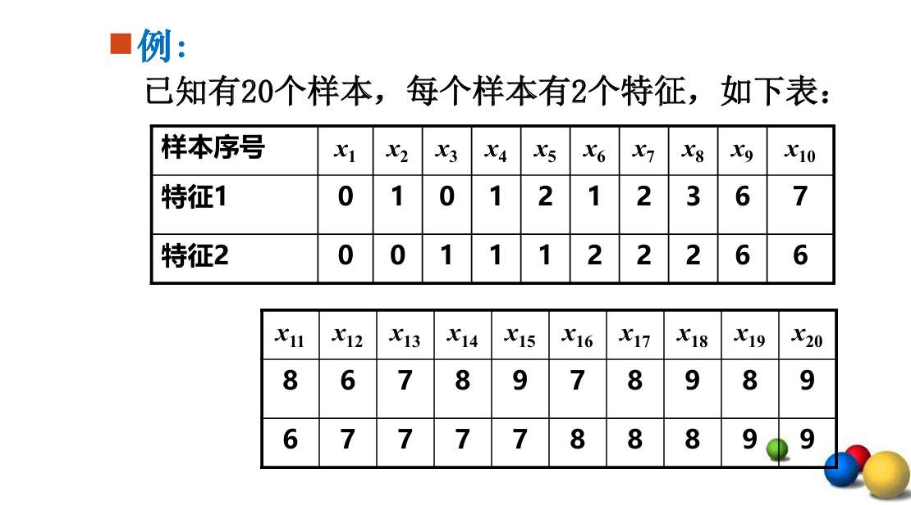

我们将本章分为三个部分复习：
1.  **高斯混合模型 (GMM) 与 EM 算法**（PPT 1-30）：软聚类、概率模型。
2.  **动态聚类：K-Means 与 FCM**（PPT 31-85）：硬聚类 vs 模糊聚类（**计算重点**）。
3.  **层次聚类**（PPT 88-113）：自底向上，距离度量（**计算重点**）。

# 自我总结

EM算法是计算GMM具体参数的方法
- 直接，随机确定，或者说蒙一个u、k、pai、y    然后计算对数似然函数。其函数值代表 蒙的这些参数，产生这些数据的概率是多少 ？ 也就代表了现在的参数准确不 
- E步 视角拉到微观的某一个样本上， 算概率
$$γ(i, k) =\frac{  π_k * N(x_i | μ_k, Σ_k) }{  ∑ (π_j * N(x_i | μ_j, Σ_j)) }$$ 即算哪个簇概率最大。注意π是说 数据分布中，某个簇的概率。 视角是宏观的
- M步 E步后，每个样本都产出自己属于某个簇的概率， 接着我们使用最大似然估计  用概率当**权重**，算**加权平均值**和**加权方差**，更新参数
- 回过头 像第一步一样 看**对数似然函数**是否不再增加

K-means步骤
（先定好几k）
- 随机出k个质点  也就是k个簇
- 

# 第一部分：高斯混合模型 (GMM) 与 EM 算法

## 1. 核心概念 (PPT 7-10)
*   **硬聚类 vs 软聚类**：
    *   **硬聚类 (K-Means)**：非黑即白，一个样本只能属于一个类（决策函数 $Y=f(X)$）。
    *   **软聚类 (GMM)**：概率分布，一个样本以 $70\%$ 概率属于 A 类， $30\%$ 概率属于 B 类（概率模型 $P(Y|X)$）。
*   **GMM 定义**：假设数据是由 $K$ 个高斯分布（正态分布）混合而成的。
    $$ P(x) = \sum_{k=1}^{K} \pi_k N(x; \mu_k, \Sigma_k) $$
    *   $\pi_k$：混合系数（权重），$\sum \pi_k = 1$。
    *   $\mu_k, \Sigma_k$：第 $k$ 个高斯分量的均值和协方差。

## 2. EM 算法 (Expectation-Maximization) (PPT 22-25)
*   **解决什么问题？** 数据里有**隐含变量**（即我们不知道样本属于哪一类），无法直接用最大似然估计。
*   **步骤（口诀：一猜二改）**：
    *   **E步 (Expectation)**：**“猜”**。假设参数已知，计算每个样本属于每个类的概率（后验概率 $\gamma$）。
    *   **M步 (Maximization)**：**“改”**。根据算出来的概率（加权），重新计算模型参数（$\pi, \mu, \Sigma$），让似然函数最大化。
*   **迭代**：E-M-E-M... 直到收敛。

### 场景设定：男女身高大混战

假设你手里有 **5 个人的身高数据**：$[160, 165, 170, 175, 180]$。
你知道这里面有**男**也有**女**（$K=2$），但你不知道具体谁是男谁是女（没有标签）。
你的任务是：算出**男生身高的平均值 $\mu_1$** 和 **女生身高的平均值 $\mu_2$**（以及方差 $\Sigma$ 和男女比例 $\pi$）。

这就是 **GMM（高斯混合模型）** 要解决的问题。

---

### 1. 初始阶段：真的就是“蒙”！

> **你的问题**：直接随机确定，或者说蒙一个 u、k、pai？“计算对数似然函数”是怎么回事？

*   **$K$ (簇数)**：这是你预设的。我们假设 $K=2$（男、女）。
*   **参数 $\theta = (\mu, \Sigma, \pi)$**：
    *   一开始我们啥都不知道。怎么办？**瞎蒙！**
    *   比如我**随便**猜：
        *   男生平均身高 $\mu_1 = 190$（猜得离谱也没关系）。
        *   女生平均身高 $\mu_2 = 150$。
        *   男女比例 $\pi_1 = 0.5, \pi_2 = 0.5$（各占一半）。
*   **计算对数似然函数**：
    *   这就是一个**“评分机制”**。
    *   系统会算一下：“在假设男生平均190、女生平均150的情况下，出现眼前这组数据 $[160, 165, 170, 175, 180]$ 的概率有多大？”
    *   因为猜得离谱，这个概率（似然值）肯定很低。
    *   **EM算法的目的**：就是一步步改参数，让这个分数变高。

---

### 2. E 步 (Expectation)：算“软标签”

> **你的问题**：为啥叫E？反正是算一个概率。但这不就是pai吗？

**关键点：$\pi$ 是“宏观比例”，$E$步算的是“个体归属”。**

*   **$\pi_k$ (先验概率)**：是你大概觉得人群中男生的比例（比如0.5）。这是**对所有人**的预判。
*   **E步算的 $\gamma_{ik}$ (后验概率)**：是针对**某一个具体的人**（比如身高175的那个），他**看起来**更像男生的概率。

**举例推导：**
现在有一个身高 **175** 的人。
*   根据你瞎蒙的参数：男生均值190，女生均值150。
*   **175 离 190（男）差 15，离 150（女）差 25。**
*   显然 175 离男生分布更近！
*   **E步计算**：利用高斯公式算出：
    *   他是男生的概率 $\gamma_{\text{男}} \approx 0.8$。
    *   他是女生的概率 $\gamma_{\text{女}} \approx 0.2$。
    *(注：这就是软标签，不是非黑即白，而是给了个概率)*

**为什么叫 Expectation (期望)？**
*   因为我们不知道他的真实身份（隐变量 $z$）。我们只能根据当前的参数，算出这个隐变量的**期望值**（也就是它是男是女的平均可能性）。这个概率值 $\gamma$ 在数学上就是隐变量的期望。

---

### 3. M 步 (Maximization)：参数更新

> **你的问题**：最大似然估计？可是我们已经把参数全确定了啊？

**回答：之前的参数是“瞎蒙”的，现在我们要根据 E 步的结果，算出“更靠谱”的新参数。**

**逻辑反转：**
*   **E步**：用**旧参数**（瞎蒙的均值） $\to$ 猜**身份**（你是男是女的概率）。
*   **M步**：用**猜出来的身份** $\to$ 算**新参数**（新的均值）。

**举例推导：**
现在我们有了 5 个人对自己身份的“自我认知”（E步算出的概率）：
*   160：我是男生的概率 0.1
*   165：我是男生的概率 0.3
*   170：我是男生的概率 0.5
*   175：我是男生的概率 0.8
*   180：我是男生的概率 0.9

**现在，我们重新计算“男生平均身高” ($\mu_1^{new}$)：**
我们不再是用所有人的身高简单平均，而是**加权平均**（谁像男生，谁的权重就大）：
$$ \mu_{\text{男}} = \frac{160 \times 0.1 + 165 \times 0.3 + 170 \times 0.5 + 175 \times 0.8 + 180 \times 0.9}{0.1+0.3+0.5+0.8+0.9} $$

算出来的结果，肯定比最开始瞎蒙的 190 更接近真实数据！
同理，可以算出新的 $\Sigma$ 和新的 $\pi$。

---

### 4. 循环迭代

现在你有了一组**新参数**（比如算出男生均值变成了 172）。
你再拿这个 172 回去重新做 E 步：
*   这时候，175 离 172 只有 3，离女生均值还是很远。
*   所以 E 步算出的概率 $\gamma_{\text{男}}$ 会从 0.8 涨到 0.95（更确定了）。
*   再用 0.95 去做 M 步……

**周而复始，直到参数不再变化（收敛），这时候似然函数达到最大。**

---

# 第二部分：动态聚类 (K-Means & FCM) —— **🔥计算题必考**

#### 1. K-Means (K均值) 算法 (PPT 37-62)
这是**最经典、最容易考手推计算**的算法。

*   **目标函数**：最小化误差平方和（SSE）。
    $$ J = \sum_{i=1}^{k} \sum_{x \in C_i} ||x - m_i||^2 $$
*   **算法流程 (背诵)**：
    1.  **初始化**：随机选 $k$ 个点作为初始中心 $m_1, ..., m_k$。
    2.  **分配**：计算每个样本到 $k$ 个中心的距离，谁近归谁。
    3.  **更新**：重新计算每个簇的**均值**（质心），作为新的中心。
    4.  **循环**：重复 2-3，直到中心不再变化。

假设第一步随机到的俩个聚类点是x1 和x2  可以过一下流程
显然x0只有x3和他在一块。
更新x0簇  新质点为 （0，0.5）  更新x1簇 新质点为（特征1和/18，特征2和/18）
现在，看看俩新质点，**与上一次的俩质点**一样不 显然不一样
重复以上流程

*   **优缺点 (PPT 50 简答题)**：
    *   *优*：简单、快。
    *   *缺*：**K值需预设**、对**初始值敏感**（结果可能不同）、对**噪声/离群点敏感**（均值会被拉偏）、只适合**凸形（球状）**簇。

#### 2. FCM (模糊 C 均值) 算法 (PPT 63-85)
*   **核心**：引入**隶属度 $\mu_{ij} \in [0, 1]$**。
*   **目标函数** (PPT 71)：
    $$ J = \sum \sum [\mu_{ij}]^b ||x_i - m_j||^2 $$
    *   $b > 1$ 是模糊加权指数（通常取2）。
    *   约束：一个样本对所有类的隶属度之和为 1 ($\sum_j \mu_{ij} = 1$)。
*   **计算逻辑**：同样是用拉格朗日乘子法推导出 $\mu_{ij}$ 和 $m_j$ 的更新公式，然后迭代。

---

### 第三部分：层次聚类 (Hierarchical Clustering) —— **🔥计算题必考**

#### 1. 两种策略
*   **分裂 (Divisive)**：自上而下，先把所有样本看作一堆，然后切分（如层次 K-Means）。
*   **凝聚 (Agglomerative)**：**自下而上**（最常用，考试通常考这个）。
    *   起步：每个样本自己就是一个簇。
    *   循环：找**距离最近**的两个簇，合并，直到剩下一个大簇。

#### 2. 簇间距离度量 (Linkage) (PPT 103-105) —— **做题关键**
假设有两个簇 $C_1$ 和 $C_2$，怎么算它俩的距离？
1.  **单连锁 (Single Linkage) / 最近邻**：
    *   $D(C_1, C_2) = \min d(x, y)$ （找两个簇里**最近**的那对点的距离）。
    *   *特点*：容易产生长链状聚类。
2.  **全连锁 (Complete Linkage) / 最远邻**：
    *   $D(C_1, C_2) = \max d(x, y)$ （找两个簇里**最远**的那对点的距离）。
    *   *特点*：产生的簇比较紧凑。
3.  **平均连锁 (Average Linkage)**：
    *   所有点对距离的平均值。

---

### 🔥 老师押题时间（第四章）

**这一章极大概率出一道 10-15 分的计算大题！**

#### **题型1：K-Means 手推计算（必练）**
**题目：** 设有一维数据点 $\{2, 4, 10, 12, 3, 20, 30, 11, 25\}$，设定 $K=2$。
初始中心为 $m_1 = 3, m_2 = 4$。请写出**第一轮**迭代后的分类结果和新的聚类中心。

*   **解题思路**：
    1.  **分配**：
        *   2: $|2-3|=1, |2-4|=2 \to C_1$
        *   3: $|3-3|=0 \to C_1$
        *   4: $|4-3|=1, |4-4|=0 \to C_2$
        *   10: $|10-3|=7, |10-4|=6 \to C_2$
        *   ...以此类推，算出每个点离 $m_1$ 近还是 $m_2$ 近。
        *   结果：$C_1 = \{2, 3\}$, $C_2 = \{4, 10, 12, 20, 30, 11, 25\}$。
    2.  **更新**：
        *   $m_1^{new} = \text{mean}(2, 3) = 2.5$
        *   $m_2^{new} = \text{mean}(4, 10, 12, \dots) = \dots$

#### **题型2：层次聚类画图（必练）**
**题目：** 给定 5 个点及其距离矩阵（PPT 111页那种），请使用**单连锁 (Single Linkage)** 算法进行层次聚类，并画出**树状图 (Dendrogram)**。

*   **解题思路**：
    1.  找矩阵里最小的数（比如 $d(P1, P2)=2$），把 P1, P2 合并为 $\{P1, P2\}$。
    2.  更新距离矩阵：计算新簇 $\{P1, P2\}$ 到其他点 P3 的距离。
        *   单连锁规则：$D(\{P1,P2\}, P3) = \min(d(P1,P3), d(P2,P3))$。
    3.  在更新后的矩阵里找最小值，继续合并。
    4.  重复直到合为一体。

#### **题型3：简答/对比**
1.  **简述 K-Means 算法的优缺点。**
    *   *答案*：优点是简单快速；缺点是需预设K值，对初值敏感，对噪声敏感，只能聚球形簇。
2.  **比较 K-Means 和 FCM (模糊C均值) 的区别。**
    *   *答案*：K-Means 是硬聚类，样本隶属度非0即1；FCM 是软聚类，引入隶属度 $\mu \in [0,1]$，样本可以属于多个类，更适合边界模糊的数据。

#### **题型4：GMM 与 K-Means 的关系**
*   **判断**：K-Means 是 GMM 的一个特例。
    *   *答案*：**对**。当 GMM 的各个高斯分量协方差矩阵相等且趋于 0（方差极小），且混合系数相等时，GMM 就退化为 K-Means。

---

### ✅ 学习建议
这一章**不要只看 PPT**，一定要拿出笔和纸：
1.  自己造 5 个二维坐标点，算一下 **K-Means 的一轮迭代**。
2.  用这 5 个点，算一下 **单连锁** 和 **全连锁** 的层次聚类过程。
3.  PPT 111-112 页的例子非常典型，建议遮住答案自己推一遍。