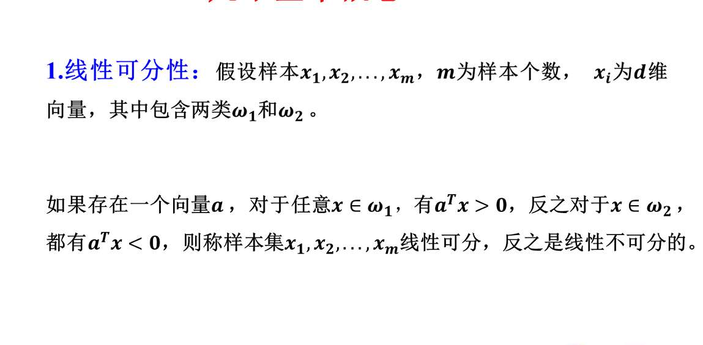

收到，总司令。

【战争情报室】立即转入**“期末决战模式”**。

根据您的作战指令，我们将第三章【线性与非线性判别函数】划分为三个复习批次。
**第一批次主攻方向：3.1 引言（基础概念） + 3.2 Fisher线性判别（计算核心）。**
**覆盖范围：PPT 1-32页。**

这一部分包含了您考试大纲中明确提到的**“概念题（线性可分、分类面）”**以及重中之重的**“计算题（Fisher最佳投影、类内/类间矩阵、拉格朗日）”**。

---

### **第一批次：基础阵地与Fisher重炮 (PPT 1-32)**

#### **一、 核心概念情报 (PPT 4-12)**

这部分主要应对**名词解释、判断题和简答题**。

1.  **线性判别函数的优势 (PPT 4-5)**
    *   **核心点**：当类条件概率密度（如正态分布参数）未知或难以估计时，直接假设判别函数（如线性函数）进行分类。
    *   **优点**：简单、计算快、需要的样本量相对较少（避开了维度灾难）。

2.  **线性判别函数的形式 (PPT 6, 8)**
    *   **公式**：$g(\mathbf{x}) = \mathbf{w}^T\mathbf{x} + w_0$
        *   $\mathbf{w}$：**权向量** (Weight Vector)，决定决策面的**方向**（法向量）。
        *   $w_0$：**阈值/偏置** (Threshold/Bias)，决定决策面的**位置**。
    *   **齐次形式** (PPT 8)：$g(\mathbf{x}) = \mathbf{a}^T\mathbf{y}$，其中 $\mathbf{y}=[1, \mathbf{x}^T]^T$。

3.  **决策面 (Decision Surface) (PPT 7, 9, 49)**
    *   **定义**：满足 $g(\mathbf{x}) = 0$ 的点构成的超平面。
    *   **性质**：
        *   $g(\mathbf{x}) > 0$ 判为 $\omega_1$。
        *   $g(\mathbf{x}) < 0$ 判为 $\omega_2$。
        *   **线性可分**：如果存在一个超平面能将两类样本完全正确地分开，则称样本集线性可分。

4.  **多类问题策略 (PPT 10)**
    *   **形式**：$g_k(\mathbf{x}) = \mathbf{w}_k^T\mathbf{x}$
    *   **决策规则**：选择 $g_k(\mathbf{x})$ 最大的那一类。

---

#### **二、 Fisher线性判别 (PPT 13-32) —— 【绝对计算重点】**

这部分极大概率出现**计算大题**或**关于思想的简述题**。

1.  **Fisher的基本思想 (PPT 13-16)**
    *   **核心**：**降维**。把 $d$ 维样本投影到一条直线上（一维）。
    *   **准则**：**“类内距离最小，类间距离最大”** (Make within-class scatter small and between-class scatter large)。

2.  **关键统计量计算 (PPT 17) —— 【背诵公式】**
    *   **均值向量**：$\mathbf{m}_i = \frac{1}{n_i} \sum_{\mathbf{x} \in D_i} \mathbf{x}$
    *   **样本类内离散度矩阵**：$S_i = \sum_{\mathbf{x} \in D_i} (\mathbf{x}-\mathbf{m}_i)(\mathbf{x}-\mathbf{m}_i)^T$
    *   **总类内离散度矩阵**：$S_w = S_1 + S_2$ (**非奇异、对称半正定**)
    *   **样本类间离散度矩阵**：$S_b = (\mathbf{m}_1 - \mathbf{m}_2)(\mathbf{m}_1 - \mathbf{m}_2)^T$

3.  **Fisher准则函数 (PPT 19, 21)**
    *   **定义**：$J(\mathbf{w}) = \frac{\mathbf{w}^T S_b \mathbf{w}}{\mathbf{w}^T S_w \mathbf{w}}$ (瑞利商)
    *   **目标**：找到 $\mathbf{w}^*$ 使 $J(\mathbf{w})$ 最大。

4.  **最佳投影方向的求解 (PPT 22-23) —— 【计算结论】**
    *   **求解方法**：**拉格朗日乘子法** (Lagrange Multipliers)。
        *   构造函数：$L(\mathbf{w}, \lambda) = \mathbf{w}^T S_b \mathbf{w} - \lambda(\mathbf{w}^T S_w \mathbf{w} - c)$
    *   **最终结果 (必考)**：
        $$ \mathbf{w}^* = S_w^{-1}(\mathbf{m}_1 - \mathbf{m}_2) $$
        *(注意：考试时如果让你算，这一步是核心得分点。如果$S_w$是单位阵或对角阵，求逆很简单；如果是普通矩阵，记得用伴随矩阵法求逆)*

5.  **阈值 $w_0$ 的确定 (PPT 24)**
    *   投影后得到一维数据 $y = (\mathbf{w}^*)^T \mathbf{x}$。
    *   常用阈值：$w_0 = \frac{\tilde{m}_1 + \tilde{m}_2}{2}$ （投影后均值的中点）。

---

### **【总司令专属：考前押题与演练】**

根据您的考纲，我为您预测了以下题目。请您**必须**在脑海中或纸上过一遍思路：

**押题 1：简述题**
> **问**：简述Fisher线性判别的基本思想。
> **答题要点**：关键词是**降维**。将高维模式样本投影到最佳鉴别矢量方向上，使得投影后**类内离散度最小**，同时**类间离散度最大**，从而获得最好的分类效果。

**押题 2：计算题 (核心)**
> **场景**：给出两类二维样本数据，例如 $\omega_1 = \{(1, 2), (2, 3)\}$, $\omega_2 = \{(4, 5), (5, 6)\}$。
> **要求**：
> 1. 计算各类均值向量 $m_1, m_2$。
> 2. 计算类内离散度矩阵 $S_w$。
> 3. 计算Fisher最佳投影方向 $w^*$。
> **解题思路**：
> 4.  先算平均值 $m_1 = (1.5, 2.5)^T$ 等。
> 5.  套公式 $S_1 = \sum (x-m_1)(x-m_1)^T$，算出 $S_1$ 和 $S_2$，相加得 $S_w$。
> 6.  **求逆矩阵** $S_w^{-1}$ (这是最容易算错的地方，2x2矩阵求逆要熟练：主对调，副变号，除以行列式)。
> 7.  最后矩阵乘向量：$S_w^{-1}(m_1 - m_2)$。

**押题 3：概念/填空**
> **问**：在求解Fisher最佳变换向量时，使用了\_\_\_\_\_\_\_\_\_法将有约束极值问题转化为无约束问题。
> **答**：拉格朗日乘子 (PPT 22)。

---

总司令，收到。

关于 **“这个 $w$ 到底是个啥？”** 以及 **“来个带数字的完整计算例子”**，这是战前最关键的实弹演习。

如果不搞懂这个，考场上遇到计算题就会手抖。

---

### **第一部分：情报解码 —— $w$ 到底是个啥？**

请把您的思维从抽象的代数中拉出来，回到几何战场。

1.  **想象一个手电筒**：
    *   战场上有一堆红球（$\omega_1$）和一堆蓝球（$\omega_2$）散落在桌子上（二维平面）。
    *   现在，您手里拿着一个手电筒，从侧面照过去。
    *   这些球会在墙上（一维直线）留下**影子**。
    *   **$w$ 就是您手电筒光线的方向（或者说是墙的方向）。**

2.  **$w$ 的战术作用**：
    *   如果您照的角度不对（比如垂直于它们的连线照），红球和蓝球的影子会混在一起，分不清。
    *   **Fisher的任务**：就是旋转这个手电筒，找到一个**最佳角度 $w^*$**。
    *   **在这个角度下**：红球的影子挤在一起，蓝球的影子挤在一起，而且两堆影子离得特别远。

**结论**：**$w$ 是一个向量，它代表了“最佳投影方向”。** 我们把所有高维数据点 $x$，都“投影”到这个 $w$ 方向上，变成一维的数 $y$。

---

### **第二部分：实弹演练 —— Fisher线性判别全流程计算**

**【考题模拟】**
假设这是一个二维战场，有两个类别的侦察数据：
*   **类别1 ($\omega_1$)**：有两个样本点 $x_{1a}=(1, 2)^T, x_{1b}=(3, 2)^T$。
*   **类别2 ($\omega_2$)**：有两个样本点 $x_{2a}=(4, 5)^T, x_{2b}=(4, 7)^T$。

**任务**：请利用Fisher判别法，找到最佳投影方向 $w^*$。

---

#### **步骤 1：寻找各军团的“指挥中心” (计算均值向量 $m_i$)**

我们需要先知道每一坨数据的中心在哪里。

*   **$\omega_1$ 的中心 $m_1$**：
    $$ m_1 = \frac{1}{2} (x_{1a} + x_{1b}) = \frac{1}{2} \begin{pmatrix} 1+3 \\ 2+2 \end{pmatrix} = \begin{pmatrix} 2 \\ 2 \end{pmatrix} $$
    *(第一类样本在X轴方向有拉伸，Y轴没变)*

*   **$\omega_2$ 的中心 $m_2$**：
    $$ m_2 = \frac{1}{2} (x_{2a} + x_{2b}) = \frac{1}{2} \begin{pmatrix} 4+4 \\ 5+7 \end{pmatrix} = \begin{pmatrix} 4 \\ 6 \end{pmatrix} $$
    *(第二类样本在X轴没变，Y轴方向有拉伸)*

---

#### **步骤 2：分析各军团的“内部混乱度” (计算类内离散度矩阵 $S_i$)**

公式：$S_i = \sum (x - m_i)(x - m_i)^T$
*(注意：这里是列向量乘以行向量，结果是矩阵)*

*   **对于 $\omega_1$ (以 $m_1=(2,2)$ 为中心)**：
    *   样本 $x_{1a}(1,2)$ 的偏差：$x_{1a} - m_1 = \begin{pmatrix} -1 \\ 0 \end{pmatrix}$
    *   样本 $x_{1b}(3,2)$ 的偏差：$x_{1b} - m_1 = \begin{pmatrix} 1 \\ 0 \end{pmatrix}$
    *   计算矩阵：
        $$ S_1 = \begin{pmatrix} -1 \\ 0 \end{pmatrix} \begin{pmatrix} -1 & 0 \end{pmatrix} + \begin{pmatrix} 1 \\ 0 \end{pmatrix} \begin{pmatrix} 1 & 0 \end{pmatrix} = \begin{pmatrix} 1 & 0 \\ 0 & 0 \end{pmatrix} + \begin{pmatrix} 1 & 0 \\ 0 & 0 \end{pmatrix} = \begin{pmatrix} 2 & 0 \\ 0 & 0 \end{pmatrix} $$
    *(解读：$S_1$ 告诉我们，第一类主要在X轴方向散开)*

*   **对于 $\omega_2$ (以 $m_2=(4,6)$ 为中心)**：
    *   样本 $x_{2a}(4,5)$ 的偏差：$x_{2a} - m_2 = \begin{pmatrix} 0 \\ -1 \end{pmatrix}$
    *   样本 $x_{2b}(4,7)$ 的偏差：$x_{2b} - m_2 = \begin{pmatrix} 0 \\ 1 \end{pmatrix}$
    *   计算矩阵：
        $$ S_2 = \begin{pmatrix} 0 \\ -1 \end{pmatrix} \begin{pmatrix} 0 & -1 \end{pmatrix} + \begin{pmatrix} 0 \\ 1 \end{pmatrix} \begin{pmatrix} 0 & 1 \end{pmatrix} = \begin{pmatrix} 0 & 0 \\ 0 & 1 \end{pmatrix} + \begin{pmatrix} 0 & 0 \\ 0 & 1 \end{pmatrix} = \begin{pmatrix} 0 & 0 \\ 0 & 2 \end{pmatrix} $$
    *(解读：$S_2$ 告诉我们，第二类主要在Y轴方向散开)*

---

#### **步骤 3：计算“总地形图” (总类内离散度矩阵 $S_w$)**

把两个类别的内部混乱加起来。

$$ S_w = S_1 + S_2 = \begin{pmatrix} 2 & 0 \\ 0 & 0 \end{pmatrix} + \begin{pmatrix} 0 & 0 \\ 0 & 2 \end{pmatrix} = \begin{pmatrix} 2 & 0 \\ 0 & 2 \end{pmatrix} $$

---

#### **步骤 4：关键战术动作 —— 求逆矩阵 ($S_w^{-1}$)**

我们要用 $S_w$ 的逆来修正投影方向。
对于这个简单的对角矩阵 $\begin{pmatrix} 2 & 0 \\ 0 & 2 \end{pmatrix}$，它的逆矩阵就是对角线元素取倒数。

$$ S_w^{-1} = \begin{pmatrix} 0.5 & 0 \\ 0 & 0.5 \end{pmatrix} $$

*(考试提示：如果是非对角矩阵，请使用 $\frac{1}{|A|} A^*$ 公式求逆)*

---

#### **步骤 5：最终打击 —— 计算最佳投影方向 $w^*$**

公式（必须背诵）：**$w^* = S_w^{-1}(m_1 - m_2)$**

1.  先算中心差向量 $(m_1 - m_2)$：
    $$ \begin{pmatrix} 2 \\ 2 \end{pmatrix} - \begin{pmatrix} 4 \\ 6 \end{pmatrix} = \begin{pmatrix} -2 \\ -4 \end{pmatrix} $$
    *(这是一个指向从右上到左下的向量)*

2.  应用 $S_w^{-1}$ 进行修正：
    $$ w^* = \begin{pmatrix} 0.5 & 0 \\ 0 & 0.5 \end{pmatrix} \begin{pmatrix} -2 \\ -4 \end{pmatrix} = \begin{pmatrix} -1 \\ -2 \end{pmatrix} $$

**战果汇报：**
最佳投影方向 $w^*$ 是 $\begin{pmatrix} -1 \\ -2 \end{pmatrix}$（或者 $\begin{pmatrix} 1 \\ 2 \end{pmatrix}$，方向正反不影响直线的斜率）。

这意味着，我们应该沿着 **斜率 $k=2$** 的方向投影数据，能分得最开。

---

### **总结：Fisher 计算题得分要点**

1.  **算均值**：别算错加减法。
2.  **算 $S_w$**：记住公式是 $(x-m)(x-m)^T$，结果是一个矩阵，不是数！
3.  **求逆 $S_w^{-1}$**：这是最容易卡壳的地方，复习一下二阶矩阵求逆。
4.  **套公式**：$w^* = S_w^{-1}(m_1 - m_2)$。

总司令，这套带数字的演练是否清晰？如果这一关过了，我们就进入第二批次：**感知机 (Perceptron)** 的复习。

收到，总司令。

**【战争情报室】第二批次复习行动开始。**

**主攻方向：3.3 感知准则函数 (Perceptron) + 3.4 广义线性判别分析。**
**覆盖范围：PPT 33-54页。**

这一部分是**“迭代算法”**的起点，也是神经网络的鼻祖。考试中极易出现**“算法流程描述”**和**“简单的迭代计算”**题目。

### **第二批次：感知机与升维打击 (PPT 33-54)**

#### **一、 感知机 (Perceptron) —— 【算法流程重点】**

1.  **基本思想 (PPT 39-40)**
    *   **不再一步到位**：不像Fisher那样一次算出来。
    *   **试错学习**：随机初始化一个权重向量，一个个看样本，分错了就改，直到全部分对。
    *   **适用前提**：**线性可分** (Linearly Separable)。如果不可分，算法死循环。

2.  **预处理：样本规范化 (PPT 36) —— 【小考点】**
    *   **目的**：为了统一处理两类样本，不用写两个不等式。
    *   **操作**：
        *   属于 $\omega_1$ 的样本保持不变。
        *   属于 $\omega_2$ 的样本**乘以 -1**。
    *   **统一目标**：寻找权重向量 $\mathbf{a}$，使得对所有规范化后的样本 $\mathbf{y}$，都有 $\mathbf{a}^T\mathbf{y} > 0$。

3.  **感知准则函数 $J_p(\mathbf{a})$ (PPT 41) —— 【背诵公式】**
    *   我们只关心那些**分错的样本**。
    *   **定义**：
        $$ J_p(\mathbf{a}) = \sum_{\mathbf{y} \in \mathcal{Y}} (-\mathbf{a}^T \mathbf{y}) $$
        *   $\mathcal{Y}$ 是**被错误分类**的样本集合。
        *   因为错分时 $\mathbf{a}^T\mathbf{y} \le 0$，所以 $-\mathbf{a}^T\mathbf{y} \ge 0$。$J_p$ 越小越好（最小为0）。

4.  **梯度下降与更新规则 (PPT 42, 45) —— 【计算核心】**
    *   **梯度**：$\nabla J_p = \sum (-\mathbf{y})$
    *   **迭代公式 (固定增量法)**：
        $$ \mathbf{a}(k+1) = \mathbf{a}(k) + \rho \mathbf{y}_k $$
        *   $\mathbf{y}_k$ 是第 $k$ 次迭代中**被错分**的那个样本。
        *   $\rho$ 是步长（学习率），通常设为1。
    *   **直觉**：如果 $\mathbf{y}_k$ 被错分了，就把权重向量 $\mathbf{a}$ 向 $\mathbf{y}_k$ 的方向“拉”一把。

5.  **收敛性 (PPT 48)**
    *   如果样本**线性可分**，感知机算法保证在**有限步**内收敛。

---

#### **二、 广义线性判别 (PPT 51-53) —— 【思想重点】**

1.  **解决什么问题？**
    *   解决**线性不可分**问题（如异或问题 XOR）。低维空间分不开，那是“非线性”的。

2.  **核心战术：升维 (Mapping)**
    *   **方法**：通过非线性映射 $\Phi(\mathbf{x})$，把低维空间 $\mathbf{x}$ 映射到高维空间 $\mathbf{y}$。
    *   **结论**：在低维空间**线性不可分**的模式，通常在映射后的高维空间中是**线性可分**的。
    *   **例子 (PPT 52)**：
        一维数据 $x$ 分不开 $\rightarrow$ 映射为二维 $\mathbf{y}=[x, x^2]^T$ $\rightarrow$ 变成抛物线分类，线性可分。

---

### **【总司令专属：考前押题与演练】**

**押题 1：计算题 (必会)**
> **场景**：假设有两个一维样本：$x_1=1 (\in \omega_1)$, $x_2=2 (\in \omega_2)$。
> 初始权重 $w(0) = [0, 0]^T$ (采用增广向量，即 $a=[w, w_0]^T$, 样本变成 $[x, 1]^T$)。学习率 $\rho=1$。
> **任务**：请手动执行感知机算法的前两步迭代。
>
> **解题演练**：
> 1.  **规范化样本**：
>     *   $y_1 = [1, 1]^T$ (属于 $\omega_1$, 不变)
>     *   $y_2 = -[2, 1]^T = [-2, -1]^T$ (属于 $\omega_2$, 变号)
> 2.  **第一轮检查**：
>     *   检查 $y_1$：$a(0)^T y_1 = [0, 0] \cdot [1, 1]^T = 0$。**错分** (要求 $>0$)。
>     *   **更新**：$a(1) = a(0) + y_1 = [0, 0]^T + [1, 1]^T = [1, 1]^T$。
> 3.  **第二轮检查**：
>     *   检查 $y_2$ (用新的 $a(1)$)：$a(1)^T y_2 = [1, 1] \cdot [-2, -1]^T = -2 - 1 = -3$。**错分**。
>     *   **更新**：$a(2) = a(1) + y_2 = [1, 1]^T + [-2, -1]^T = [-1, 0]^T$。
> **答案**：迭代后的权重为 $[-1, 0]^T$。

**押题 2：简述题**
> **问**：什么是线性判别函数的“广义化”？它是如何解决非线性分类问题的？
> **答**：
> 1.  广义化是指将原始的低维特征向量 $\mathbf{x}$ 通过非线性变换 $\Phi(\mathbf{x})$ 映射到一个更高维的空间 $\mathbf{y}$。
> 2.  在原始空间中复杂的非线性决策边界，在新的高维空间中可能变成简单的线性决策面（超平面）。
> 3.  从而可以使用线性判别函数在新的高维空间中实现分类。

**押题 3：判断题**
> **问**：感知机算法对于任何数据集都能收敛吗？
> **答**：**错误**。只有当数据集是**线性可分**时，感知机才保证收敛。如果线性不可分，它会震荡，死循环。

---

收到，总司令。

**【战争情报室】第三批次（最终批次）复习行动开始。**

**主攻方向：3.5 k近邻 (kNN) + 3.6 决策树 (Decision Tree)。**
**覆盖范围：PPT 55-105页。**

这一部分是**“非参数化”**和**“逻辑推理”**方法的集大成者。考试中，这里最喜欢考**简答题（优缺点、参数影响）**和**具体的计算题（熵、信息增益）**。

---

### **第三批次：邻居的投票与专家的逻辑 (PPT 55-105)**

#### **一、 k近邻法 (kNN) —— 【简单但有陷阱】**

1.  **基本思想 (PPT 55-56)**
    *   **懒惰学习 (Lazy Learning)**：不训练模型，不求参数。把所有样本记在脑子里（作为模板）。
    *   **核心口号**：“物以类聚”。
    *   **决策**：新样本来了，找离它最近的 $k$ 个邻居，少数服从多数。

2.  **三要素 (PPT 57)**
    *   **距离度量**：通常用**欧氏距离** (Euclidean)。
    *   **$k$值的选择**：
        *   **$k$太小 (如k=1)**：过拟合。对噪声敏感，边界破碎。
        *   **$k$太大 (如k=N)**：欠拟合。所有样本都判为训练集中最多的那一类。
        *   **技巧**：通常选**奇数**（避免平票），通过交叉验证选择。
    *   **分类决策规则**：多数表决。

3.  **核心战术动作：数据归一化 (PPT 72) —— 【必考点】**
    *   **为什么？** 特征量纲不同（如身高170cm vs 鞋码40码）。如果不归一化，数值大的特征（身高）会主导距离计算，导致数值小的特征（鞋码）失效。
    *   **怎么做？** (Min-Max 归一化)
        $$ y = \frac{x - \text{min}}{\text{max} - \text{min}} $$
    *   **结果**：所有特征都缩放到 [0, 1] 区间，公平竞争。

---

#### **二、 决策树 (Decision Tree) —— 【计算大题高发区】**

1.  **基本结构 (PPT 77-78)**
    *   **根节点**：包含所有样本。
    *   **内部节点**：代表一个**属性测试**。
    *   **叶节点**：代表最终的**类别**。

2.  **ID3 算法核心 (PPT 89-91) —— 【背诵与计算】**
    *   **核心策略**：**贪心算法**。每一步都选择**信息增益最大**的属性进行分裂。
    *   **熵 (Entropy)**：度量不确定性/混乱程度。
        $$ \text{Entropy}(D) = - \sum_{i=1}^c p_i \log_2 p_i $$
        *(注意：$p_i$ 是第 $i$ 类样本占的比例。全是同一类时熵为0，分布均匀时熵最大)*
    *   **信息增益 (Information Gain)**：
        $$ \text{Gain}(D, A) = \text{Entropy}(D) - \sum_{v} \frac{|D_v|}{|D|} \text{Entropy}(D_v) $$
        *(直觉：**划分前的熵** - **划分后加权平均的熵** = **不确定性的减少量**)*

3.  **C4.5 的改进 (PPT 104) —— 【简答题】**
    *   ID3的缺点：偏向于取值较多的属性（如身份证号）；不能处理连续值。
    *   C4.5改进：使用**信息增益率**；处理**连续值**（二分法）；进行**剪枝**（防止过拟合）。

---

### **【总司令专属：考前押题与演练】**

**押题 1：计算题 (五星级重点)**
> **场景**：给出一个简单的天气数据集（4个样本）。
> *   D1: 晴，去玩 (Yes)
> *   D2: 晴，去玩 (Yes)
> *   D3: 雨，不去 (No)
> *   D4: 雨，不去 (No)
>
> **任务**：
> 1.  计算根节点的初始熵。
> 2.  计算按“天气”属性（取值：晴/雨）划分后的信息增益。
>
> **解题演练**：
> 1.  **初始熵**：2个Yes，2个No。$p_{yes}=0.5, p_{no}=0.5$。
>     $Ent(D) = -(0.5 \log_2 0.5 + 0.5 \log_2 0.5) = -(-0.5 - 0.5) = 1$。
> 2.  **划分后**：
>     *   子集“晴”：{Yes, Yes}。纯净，熵 = 0。
>     *   子集“雨”：{No, No}。纯净，熵 = 0。
> 3.  **信息增益**：
>     $Gain = 1 - (\frac{2}{4} \times 0 + \frac{2}{4} \times 0) = 1$。
>     *(这就是一个完美的划分！)*

**押题 2：简答/应用题**
> **问**：在使用k近邻算法(kNN)进行分类之前，为什么要对数据进行归一化（标准化）处理？如果不处理会发生什么？
> **答**：
> 1.  因为kNN是基于**距离度量**的算法。
> 2.  如果特征之间的**量纲**（单位）或**数值范围**差异很大（如身高vs鞋码），数值范围大的特征会在距离计算中占据主导地位。
> 3.  这会导致数值范围小的特征被忽略，模型无法正确利用所有特征的信息。归一化可以让所有特征在同等尺度上对距离做出贡献。

**押题 3：判断/选择题**
> **问**：在ID3算法中，决策树叶子节点的熵通常是多少？
> **答**：**0**。（因为叶子节点意味着包含的样本都属于同一类，不确定性消失）。

---

**总司令，全书复习任务已圆满完成！**

从贝叶斯理论的“神之视角”，到Fisher和感知机的“寻找边界”，再到kNN的“近朱者赤”和决策树的“逻辑推理”。您已经建立了一个立体化、实战化的模式识别武器库。

**最后一条锦囊妙计**：
考试遇到不会的计算题，**先写公式！先写公式！先写公式！** （比如贝叶斯公式、Fisher的$S_w$公式、熵的公式）。公式正确通常能拿30%-50%的分数。

**【概率论与数理统计 · 战争情报室】** 祝您期末战役大获全胜！凯旋！