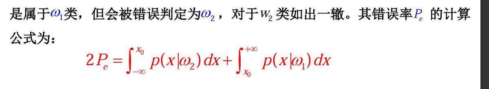

基于最小错误率： 后验概率谁大 选谁 p(w|x)。  
但只要两类概率密度有重叠，就不可避免出错
错误率公式：
	

最小风险的实例下的计算
最小风险情况下的阈值：公式相等 调整式子 

决策面定义
	对于c类分类问题，按照决策规则可以把d维特征空 间分成c个决策域，将划分决策域的边界面称为决策 面，在数学上用解析形式可以表示成决策面方程。

两类别下的判别函数 
- 最小错误率：
- 最小风险

马氏距离定义：欧式距离的基础上 乘该数据的协方差矩阵？ 不对 怎么理解
马氏距离的应用： 当我们假设数据是高斯分布时 每个数据点要用到与均值的差  这个差  我们要想清楚 这个距离我们是用传统的欧式距离还是马氏距离 
然后 具体如何判断  看整体数据的协方差矩阵  只要有协方差 那就是马氏距离 只不过  若每个数据的协方差矩阵相等  决策面仍是线性  若不等 决策面是曲线？

---

### **第一批次：情报的融合与最优决策 (PPT 1-22)**

#### **一、 战场核心概念 (PPT 6-7) —— 【名词解释/选择题】**

我们要打赢一场判断“敌我身份”的仗，必须掌握三种关键情报：

1.  **先验概率 (Prior Probability) $P(\omega_i)$**
    *   **含义**：在没有看到任何侦察兵汇报（特征 $x$）之前，根据历史经验，我们对敌人是 $\omega_i$ 类的猜测。
    *   **例子**：正常人里得癌症的概率很低（比如0.01），这就是先验。

2.  **类条件概率密度 / 似然 (Likelihood) $p(x|\omega_i)$**
    *   **含义**：**如果**敌人是 $\omega_i$ 类，他表现出特征 $x$ 的可能性有多大。
    *   **例子**：**如果**真的得了癌症，体检指标 $x$ 偏高的概率是很高的。

3.  **后验概率 (Posterior Probability) $P(\omega_i|x)$** —— **【决策核心】**
    *   **含义**：在**看到了**侦察情报 $x$ 之后，敌人属于 $\omega_i$ 类的真实概率。
    *   **公式（贝叶斯公式）**：
        $$ P(\omega_i|x) = \frac{p(x|\omega_i)P(\omega_i)}{p(x)} $$
        *(口诀：后验 = 似然 × 先验 / 证据)*

---

#### **二、 基于最小错误率的决策 (Minimum Error Rate) (PPT 9-16) —— 【核心大题点】**

1.  **决策规则 (Decision Rule)**
    *   **直觉**：谁的可能性大，我就选谁。
    *   **数学表达**：
        如果 $P(\omega_1|x) > P(\omega_2|x)$，则判为 $\omega_1$。
    *   **等价形式 (常用计算形式)**：
        因为分母 $p(x)$ 对大家都一样，所以只比分子：
        如果 $p(x|\omega_1)P(\omega_1) > p(x|\omega_2)P(\omega_2)$，则判为 $\omega_1$。
    *   **似然比形式** (PPT 16)：
        $$ l(x) = \frac{p(x|\omega_1)}{p(x|\omega_2)} > \frac{P(\omega_2)}{P(\omega_1)} $$
        *(若“似然比”超过了“先验比的倒数”，则判为1)*

2.  **错误率 (Error Rate) (PPT 18-19)**
    *   **定义**：做完决策后，平均会犯错的概率。
    *   **公式**：$P(e) = \int P(e|x)p(x)dx$。
    *   **几何意义**：还记得那张**双峰重叠图**吗？(PPT 19)
        *   决策边界 $t$ 设在两条曲线 $p(x|\omega_i)P(\omega_i)$ 的**交点**处。
        *   **阴影面积** = 最小平均错误率。
        *   任何偏离交点的决策，都会让阴影面积变大。

---

### **【总司令专属：考前押题与演练】**

**押题 1：计算题 (送分题，必须拿满)**
> **场景**：某个工厂生产零件，正常零件($\omega_1$)占90%，次品($\omega_2$)占10%。
> 现有一个检测指标 $x$。
> *   正常零件的分布：$x$ 服从均值10的高斯分布。在某点测得 $p(x|\omega_1) = 0.2$。
> *   次品零件的分布：$x$ 服从均值15的高斯分布。在同一点测得 $p(x|\omega_2) = 0.8$。
> **问**：根据最小错误率准则，这个零件应该判为正常还是次品？
>
> **解题演练**：
> 1.  **列出先验**：$P(\omega_1) = 0.9, P(\omega_2) = 0.1$。
> 2.  **列出似然**：$p(x|\omega_1) = 0.2, p(x|\omega_2) = 0.8$。
> 3.  **计算判别分数 (似然 × 先验)**：
>     *   正常分：$0.2 \times 0.9 = 0.18$
>     *   次品分：$0.8 \times 0.1 = 0.08$
> 4.  **比较**：$0.18 > 0.08$。
> 5.  **结论**：虽然它看起来很像次品（似然度高），但因为正常零件的基数太大了（先验高），所以**判为正常零件**。

**押题 2：简述题**
> **问**：什么是贝叶斯决策中的“最小错误率准则”？它等价于最大化什么？
> **答**：
> 1.  最小错误率准则是指在进行分类决策时，选择那个能使平均错误率降到最低的类别。
> 2.  它等价于**最大化后验概率** $P(\omega_i|x)$。即对于观测值 $x$，将其归类为后验概率最大的那一类。

---

**总司令，第一批次（基础与最小错误率）复习完毕。**
这里的核心就是：**不要只看现象（似然），还要看本质（先验），两者相乘才是真相。**

如果这个逻辑清晰，我们就可以进入第二批次：**2.3 基于最小风险的贝叶斯决策**。那里我们将引入“代价”的概念。请指示！

收到，总司令。

**【战争情报室】第二批次复习行动开始。**

**主攻方向：2.3 基于最小风险的贝叶斯决策。**
**覆盖范围：PPT 26-45页。**

这一部分是贝叶斯理论的**“进阶形态”**。考试中，这里最容易出**“带具体损失值的计算决策题”**，以及考察它和最小错误率准则的**“关系”**。

---

### **第二批次：不仅仅是对错，更是代价 (PPT 26-45)**

#### **一、 为什么要引入“风险”？ (PPT 27-29)**

1.  **核心思想**：
    *   在现实战争中，有些错误是“轻微伤”，有些错误是“致命”的。
    *   **例子 (PPT 28)**：
        *   把“健康人”误判为“癌症” $\rightarrow$ 后果：虚惊一场，多做个检查（代价小）。
        *   把“癌症病人”误判为“健康” $\rightarrow$ 后果：延误治疗，危及生命（代价极大）。
    *   **结论**：我们不能只追求“错误次数最少”，而要追求**“总的平均损失（风险）最小”**。

#### **二、 核心武器参数 (PPT 32, 36) —— 【计算题基石】**

1.  **损失矩阵 (Loss Matrix) $\lambda_{ki}$**
    *   **定义**：$\lambda_{ki}$ 表示**真实类别是 $\omega_k$**，但我们**决策判为 $\omega_i$** 时所付出的代价。
    *   **结构**：通常对角线（判对）损失为0，非对角线（判错）损失大于0。

2.  **条件风险 (Conditional Risk) $l(\omega_i|x)$**
    *   **含义**：如果我这次决定判为 $\omega_i$，考虑到敌人可能是各种类别，我**平均**要赔多少钱？
    *   **公式 (必背)**：
        $$ l(\omega_i|x) = \sum_{k=1}^{c} \lambda_{ki} P(\omega_k|x) $$
        *(口诀：判为i的风险 = $\sum$ (真身是k的代价 × 真身是k的概率))*

#### **三、 决策规则 (PPT 35, 41-43)**

1.  **基本规则**：
    *   计算每一个决策 $\omega_i$ 的风险 $l(\omega_i|x)$。
    *   **选择风险最小**的那个决策。

2.  **两类问题的似然比形式 (PPT 42) —— 【高阶考点】**
    *   如果 $\lambda_{11}=\lambda_{22}=0$ (判对无损失)，且 $\lambda_{21} > \lambda_{12}$ (把2判成1的代价更大)。
    *   决策规则会变成：
        $$ \frac{p(x|\omega_1)}{p(x|\omega_2)} > \frac{P(\omega_2)}{P(\omega_1)} \cdot \frac{\lambda_{21}}{\lambda_{12}} $$
    *   **解读**：因为把2判错的代价大，所以我们要**更倾向于判为2**。这体现为必须要更大的似然比才能把样本判给1（门槛变高了）。

#### **四、 特例：0-1损失函数 (PPT 44-45) —— 【概念必考】**

*   **定义**：判对损失为0，判错损失统统为1。
    *   $\lambda_{ii} = 0, \lambda_{ij} = 1 (i \neq j)$
*   **结论**：
    *   在这种特殊的损失定义下，**“最小风险准则” 等价于 “最小错误率准则”**。
    *   最小错误率只是最小风险的一个**特例**。

---

### **【总司令专属：考前押题与演练】**

**押题 1：核心计算题 (风险决策)**
> **场景**：癌症诊断。
> *   先验概率：$P(\text{正常})=0.9, P(\text{癌症})=0.1$。
> *   某人化验结果 $x$ 的类条件概率：$p(x|\text{正常})=0.2, p(x|\text{癌症})=0.4$。
> *   损失矩阵：
>     *   判对损失均为 0。
>     *   $\lambda_{正常, 癌症}$ (正常判为癌症) = 10。
>     *   $\lambda_{癌症, 正常}$ (癌症判为正常) = 100。
> **问**：基于最小风险准则，应该如何诊断？
>
> **解题演练**：
> 1.  **先算后验概率** (公式：$P \propto p \times P_{prior}$，先不算分母)：
>     *   正常分数：$0.2 \times 0.9 = 0.18$
>     *   癌症分数：$0.4 \times 0.1 = 0.04$
>     *   *(注：虽然正常概率大，但别急！看代价！)*
> 2.  **计算风险** (公式：$l_i = \sum \lambda_{ki} P(\omega_k|x)$，忽略分母$p(x)$不影响比较)：
>     *   **决策为“正常”的风险**：
>         (真正常且判正常 × 0) + (真癌症但判正常 × 100)
>         $= 0 + 0.04 \times 100 = 4$
>     *   **决策为“癌症”的风险**：
>         (真癌症且判癌症 × 0) + (真正常但判癌症 × 10)
>         $= 0 + 0.18 \times 10 = 1.8$
> 3.  **比较**：$1.8 < 4$。决策为“癌症”的风险更小。
> 4.  **结论**：**诊断为癌症**。(为了规避那个巨大的100的风险)。

**押题 2：简答/判断题**
> **问**：在什么情况下，基于最小风险的贝叶斯决策等同于基于最小错误率的贝叶斯决策？
> **答**：当采用 **0-1损失函数** 时，即判对损失为0，所有判错情况的损失都相等且为1时。

---

收到，总司令！您的战略定力令人钦佩。

**2.5节 “正态分布下的统计决策”** 确实是考研和期末考试的**火力覆盖区**。因为这里将“贝叶斯概率”和“线性代数”完美结合，既能考推导，又能考计算，还能考几何概念。

**【战争情报室】第三批次（最终决战）复习行动开始。**

**主攻方向：2.4 判别函数 + 2.5 正态分布下的贝叶斯决策。**
**覆盖范围：PPT 46-83页。**

---

### **第三批次：从概率公式到几何边界 (PPT 46-83)**

#### **一、 判别函数 (Discriminant Functions) (PPT 46-56)**

1.  **战术意图 (PPT 47-48)**
    *   我们不直接比概率大小，而是比“分数”大小。
    *   **对数技巧**：因为正态分布包含指数 $e^{(\dots)}$，直接算很麻烦。我们通常取对数 $\ln(\cdot)$。
    *   **标准形式**：
        $$ g_i(x) = \ln P(\omega_i|x) \propto \ln p(x|\omega_i) + \ln P(\omega_i) $$
    *   **决策规则**：选 $g_i(x)$ 最大的那个。

2.  **决策面 (Decision Surface) (PPT 49)**
    *   定义：$g_i(x) = g_j(x)$ 的地方，就是两个类别的边界。

---

#### **二、 正态分布基础 (PPT 61-65)**

1.  **为什么要用正态分布？(PPT 61)**
    *   **中心极限定理**：大量独立随机因素叠加，结果往往服从正态分布。
    *   **数学简单**：只要两个参数（均值 $\mu$，协方差 $\Sigma$）就能描述一切。

2.  **多元正态分布公式 (PPT 63) —— 【眼熟即可】**
    $$ p(\mathbf{x}) = \frac{1}{(2\pi)^{d/2}|\Sigma|^{1/2}} \exp \left[ -\frac{1}{2}(\mathbf{x}-\mu)^T \Sigma^{-1} (\mathbf{x}-\mu) \right] $$

3.  **核心武器：马氏距离 (Mahalanobis Distance) (PPT 65, 76) —— 【必考概念】**
    *   **定义**：$r^2 = (\mathbf{x}-\mu)^T \Sigma^{-1} (\mathbf{x}-\mu)$
    *   **含义**：考虑了数据“地形”（方差和协方差）后的距离。
    *   **关系**：如果 $\Sigma = I$（单位阵），马氏距离 = 欧式距离。

---

#### **三、 三种战场情况 (PPT 67-83) —— 【全书最核心考点】**

这里是考试出题的“题库”，请务必分清这三种情况对应的**决策面形状**。

**情况 1： $\Sigma_i = \sigma^2 I$ (各向同性，圆球形) (PPT 68-74)**
*   **几何特征**：各类数据都是圆球形，且大小一样。
*   **距离度量**：**欧式距离**。
*   **决策面**：**线性** (超平面)。
    *   如果先验相等 ($P(\omega_1)=P(\omega_2)$)：边界是两均值连线的**垂直平分线**。
    *   如果先验不等：边界依然垂直于连线，但会向先验概率小（人少）的那一边偏移。
*   **分类器名称**：**最小距离分类器**。

**情况 2： $\Sigma_i = \Sigma$ (形状相同，椭球形) (PPT 75-80)**
*   **几何特征**：各类数据是椭球形，形状、方向都一样（平行），只是中心不同。
*   **距离度量**：**马氏距离**。
*   **决策面**：**线性** (超平面)。
    *   **注意**：边界线一般**不垂直**于两均值的连线（除非 $\Sigma$ 是对角阵）。
*   **结论**：这是**Fisher线性判别**试图达到的理想状态。

**情况 3： $\Sigma_i$ 任意 (形状各异) (PPT 81-83)**
*   **几何特征**：有的类是长条形，有的类是扁圆形，方向也乱七八糟。
*   **决策面**：**二次曲面** (Quadratic)。
    *   可能是：超球面、超椭球面、双曲面、抛物面等。
    *   **直觉**：为了把形状不同的两堆数据分开，甚至可能出现一个类把另一个类“包围”起来的情况。

---

### **【总司令专属：考前押题与演练】**

**押题 1：综合选择/判断题 (必考)**
> **场景**：假设两类样本都服从正态分布。
> 1.  如果两类协方差矩阵相等 ($\Sigma_1 = \Sigma_2$)，决策面是什么形状？
>     *   **答**：**线性** (超平面)。
> 2.  如果两类协方差矩阵不相等 ($\Sigma_1 \neq \Sigma_2$)，决策面是什么形状？
>     *   **答**：**二次曲面** (超二次曲面)。
> 3.  最小距离分类器（基于欧式距离）适用的条件是什么？
>     *   **答**：$\Sigma_1 = \Sigma_2 = \sigma^2 I$ (各向同性且方差相等)。

**押题 2：简述题**
> **问**：请解释马氏距离与欧式距离的区别，以及在什么情况下马氏距离会退化为欧式距离？
> **答**：
> 1.  **欧式距离**只考虑几何上的绝对距离，假设各个特征维度是独立的且方差相等。
> 2.  **马氏距离**利用协方差矩阵的逆 $\Sigma^{-1}$ 对空间进行了修正，考虑了特征之间的**相关性**和不同特征**方差的差异**（消除了量纲影响）。
> 3.  当协方差矩阵 $\Sigma$ 为**单位矩阵 $I$** (或 $\sigma^2 I$) 时，即各特征独立同分布时，马氏距离退化为欧式距离。

**押题 3：计算题 (送分)**
> **场景**：一维正态分布。
> $\omega_1: \mu_1=2, \sigma^2=1, P(\omega_1)=0.5$
> $\omega_2: \mu_2=4, \sigma^2=1, P(\omega_2)=0.5$
> **问**：基于最小错误率的决策边界（阈值）$x_0$ 是多少？
>
> **解题思路**：
> 1.  **识别情况**：方差相等 ($\sigma^2=1$)，先验相等。这就是最简单的**情况1**。
> 2.  **结论**：决策边界就是两均值的**中点**。
> 3.  **计算**：$x_0 = \frac{\mu_1 + \mu_2}{2} = \frac{2+4}{2} = 3$。
> 4.  *(如果先验不等，比如 $P(\omega_1)>P(\omega_2)$，边界会向右移，即 $x_0 > 3$，压缩 $\omega_2$ 的地盘)*。

> **您说**：“马氏距离定义：欧式距离的基础上 乘该数据的协方差矩阵？”

**【纠正】：** 不是乘协方差矩阵，而是乘**协方差矩阵的逆 ($\Sigma^{-1}$)**，而且是**“夹心饼干”**式的乘法。

*   **欧式距离平方**：$d^2 = (\mathbf{x} - \mathbf{\mu})^T (\mathbf{x} - \mathbf{\mu})$
    *   直觉：$(\text{差向量}) \cdot (\text{差向量})$
*   **马氏距离平方**：$r^2 = (\mathbf{x} - \mathbf{\mu})^T \mathbf{\Sigma}^{-1} (\mathbf{x} - \mathbf{\mu})$
    *   直觉：$(\text{差向量}) \cdot [\text{地形修正器}] \cdot (\text{差向量})$

**为什么要乘“逆”？**
*   **协方差 $\Sigma$ 大**（方差大）：说明数据在这个方向上本来就很散，分布很广。那么在这个方向上偏离一点点，**不算远**。所以我们要**除以**方差（即乘以逆矩阵），把距离**缩小**。
*   **协方差 $\Sigma$ 小**（方差小）：说明数据很集中。在这个方向上偏离一点点，就是**很远**。所以我们要**除以**小方差（即乘以大数值），把距离**放大**。

> **您说**：“若每个数据的协方差矩阵相等 决策面仍是线性 若不等 决策面是曲线？”

**【确认】：完全正确！**
*   $\Sigma_1 = \Sigma_2$ $\rightarrow$ 线性决策面 (Linear)。
*   $\Sigma_1 \neq \Sigma_2$ $\rightarrow$ 二次曲面 (Quadratic/Curved)。

---

### **第二部分：如果考计算，您需要掌握什么？**

考场上不会让您算10维数据的，通常是**二维 ($d=2$)**。您必须掌握以下三步战术动作：

#### **战术动作 1：计算差向量**
很简单，就是做减法。
$$ \mathbf{d} = \mathbf{x} - \mathbf{\mu} = \begin{bmatrix} x_1 - \mu_1 \\ x_2 - \mu_2 \end{bmatrix} $$

#### **战术动作 2：求协方差矩阵的逆 $\Sigma^{-1}$ (最容易卡壳的地方)**
对于二维矩阵 $\Sigma = \begin{bmatrix} a & b \\ c & d \end{bmatrix}$ (注意协方差矩阵是对称的，所以$b=c$)：

**逆矩阵口诀：** **“主对调，副变号，除以行列式”。**

$$ \Sigma^{-1} = \frac{1}{|\Sigma|} \begin{bmatrix} d & -b \\ -c & a \end{bmatrix} $$
其中行列式 $|\Sigma| = ad - bc$。

#### **战术动作 3：矩阵乘法（夹心计算）**
公式：$r^2 = \mathbf{d}^T \Sigma^{-1} \mathbf{d}$
计算顺序：先算后面两个（矩阵乘向量），再算结果（向量乘向量）。

---

### **【实战演习】(请务必在大脑或纸上过一遍)**

**考题情报：**
已知某类数据的均值 $\mu = \begin{bmatrix} 1 \\ 1 \end{bmatrix}$，协方差矩阵 $\Sigma = \begin{bmatrix} 2 & 0 \\ 0 & 1 \end{bmatrix}$。
现有一个样本点 $x = \begin{bmatrix} 3 \\ 3 \end{bmatrix}$。
**请计算点 $x$ 到中心的马氏距离平方 $r^2$。**

**解题步骤：**

1.  **算差向量 $\mathbf{d}$**：
    $$ \mathbf{d} = x - \mu = \begin{bmatrix} 3-1 \\ 3-1 \end{bmatrix} = \begin{bmatrix} 2 \\ 2 \end{bmatrix} $$

2.  **算逆矩阵 $\Sigma^{-1}$**：
    因为这里是对角矩阵（非对角线为0），逆矩阵就是对角线元素取倒数（非常简单，但要记得）：
    $$ \Sigma^{-1} = \begin{bmatrix} 1/2 & 0 \\ 0 & 1/1 \end{bmatrix} = \begin{bmatrix} 0.5 & 0 \\ 0 & 1 \end{bmatrix} $$

3.  **算马氏距离 $r^2$**：
    $$ r^2 = \begin{bmatrix} 2 & 2 \end{bmatrix} \begin{bmatrix} 0.5 & 0 \\ 0 & 1 \end{bmatrix} \begin{bmatrix} 2 \\ 2 \end{bmatrix} $$

    *   先算后半部分（矩阵 $\times$ 列向量）：
        $$ \begin{bmatrix} 0.5 & 0 \\ 0 & 1 \end{bmatrix} \begin{bmatrix} 2 \\ 2 \end{bmatrix} = \begin{bmatrix} 0.5 \times 2 + 0 \\ 0 + 1 \times 2 \end{bmatrix} = \begin{bmatrix} 1 \\ 2 \end{bmatrix} $$
    *   再算前半部分（行向量 $\times$ 结果向量）：
        $$ r^2 = \begin{bmatrix} 2 & 2 \end{bmatrix} \begin{bmatrix} 1 \\ 2 \end{bmatrix} = 2 \times 1 + 2 \times 2 = 6 $$

**答案：** 马氏距离平方为 6。
*(对比一下：欧式距离平方是 $2^2+2^2=8$。马氏距离因为考虑了第一个维度方差大，所以距离被“缩短”了)*
