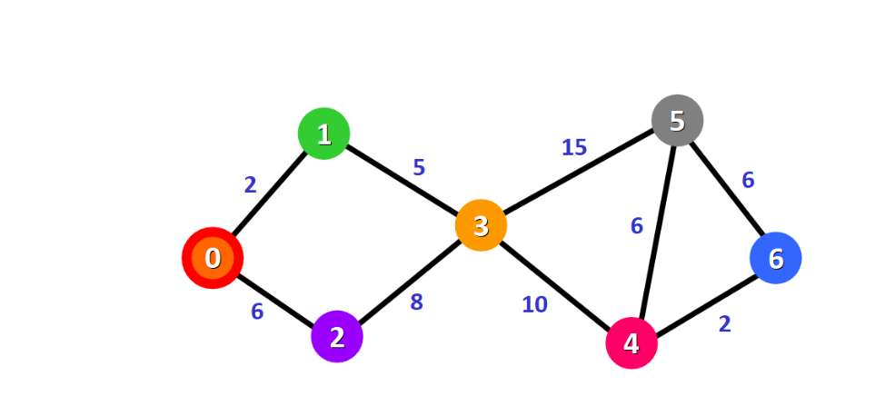

https://www.freecodecamp.org/chinese/news/dijkstras-shortest-path-algorithm-visual-introduction/

公式：

# 🚀 第一轮：贪心策略与 Dijkstra 最短路径

#### 1. 怎么区分考点？(Exam Strategy)
老师强调要“分清楚给图考哪些题”，看题干关键词：
*   **最短路径 (Shortest Path):** 问你从一个起点（Source）到其他所有点的距离。 $\rightarrow$ 用 **Dijkstra**。
*   **最小生成树 (Minimum Spanning Tree):** 问你如何用最小的代价连接所有的点（不形成环）。 $\rightarrow$ 用 **Kruskal** (PPT里讲的这个) 或 Prim。
*   **背包问题 (Knapsack):**
    *   如果物品可以**切碎**拿 (Fractional) $\rightarrow$ **贪心算法** (按性价比拿)。
    *   如果物品**要么拿要么不拿** (0/1) $\rightarrow$ **动态规划** (上一章讲的)。

---

#### 2. 分数背包问题 (Fractional Knapsack)
**覆盖 PPT：** p.5 - p.6
虽然你没特意提，但这属于贪心的入门，简单过一下以防万一。
*   **规则：** 物品可以切分（比如面粉、金砂）。
*   **贪心策略：** 算 **性价比 (Value/Size ratio)**。
*   **步骤：** 优先拿性价比最高的，直到装不下为止。

---

#### 3. Dijkstra 算法 (单源最短路径)
**覆盖 PPT：** p.7 - p.14

这是贪心算法的巅峰之作。

*   **核心逻辑：**
    我们将顶点分为两类集合：
    *   **$X$ 集合：** 已经找到最短路径的“红圈会员”。(初始只有起点 $s$)
    *   **$Y$ 集合：** 还没确定的“普通群众”。

*   **贪心策略 (Greedy Step):**
    每次从 $Y$ 集合里，挑一个距离起点 **最近 (Minimum $\lambda$)** 的点，把它拉进 $X$ 集合。

*   **松弛操作 (Update/Relaxation) —— 必考计算步骤：**
    当你把一个新点 $y$ 拉进 $X$ 集合后，你要借助于 $y$，看看能不能缩短去其他邻居 $w$ 的路。
    
    **公式 (PPT p.9):**
    $$ \lambda[w] = \min(\lambda[w], \quad \lambda[y] + \text{length}(y, w)) $$
    *   $\lambda[w]$: 原来 $w$ 离起点的距离。
    *   $\lambda[y] + \text{length}(y, w)$: 走到 $y$ 再走到 $w$ 的新距离。

*   **图解演示 (PPT p.10):**
    *   起点是 1。
    *   一开始只认识邻居：$\lambda[2]=12, \lambda[3]=9$。其他都是 $\infty$。
    *   **选谁？** 选最小的 3 (距离9)。把 3 拉入 $X$。
    *   **更新：** 站在 3 的位置看邻居。
        *   看 5: 原来是 $\infty$，现在是 $9 + 13 = 22$。
        *   看 4: 原来是 $\infty$，现在是 $9 + 4 = 13$。
        *   看 2: 原来是 12，通过 3 走是 $9 + 6 = 15$。$12 < 15$，**不更新**。

*   **复杂度 (PPT p.13):** $\Theta(n^2)$。

---

### 🧠 第一轮复习小测 (Quiz)

1.  **场景辨析：** 题目给你一张带权重的图，问你“连接这 5 个城市铺设光缆，造价最低是多少”，你应该用 Dijkstra 还是 Kruskal？
2.  **Dijkstra 细节：** 在 Dijkstra 算法中，一旦一个顶点被移入集合 $X$（被标记为 Visited），它的最短距离值 $\lambda$ 还会再改变吗？
3.  **计算题：** 假设起点是 A。A 到 B 距离 10，A 到 C 距离 3。
    *   第一步选了 C。
    *   如果 C 到 B 有一条边长度为 5。
    *   那么 B 的距离 $\lambda[B]$ 会更新成多少？

思考一下，然后告诉我“继续”，我们进入**最小生成树和哈夫曼编码**（这里有你强调的算术题）。

**1. 关于你的疑问：**

*   **问题 1 (Kruskal?):** **完全正确！** 铺设光缆、修路连通所有城市，都是典型的 **最小生成树 (MST)** 问题，用 **Kruskal**。
    *   *关于 Dijkstra:* 是的，Dijkstra 是 **“单源” (Single Source)** 最短路径。起点换了，算出来的距离表当然全变了。如果你想要那个“所有点到所有点”的大矩阵，那是上一章的 **Floyd** 算法。
*   **问题 2 (不会变?):** **正确！** 这就是贪心算法的特征：一旦进了 $X$ 集合（红圈），就盖棺定论了，绝不反悔。
*   **问题 3 (答案是 5?):** **这里掉坑了！** ❌
    *   **纠正：** Dijkstra 存的是 **“从起点 A 出发的总距离”**。
    *   你算出的 5 是 C 到 B 的距离。
    *   **正确算法：** 先走到 C (花了3)，再从 C 走到 B (花了5)。总路费 = $3 + 5 = \mathbf{8}$。
    *   因为 $8 < 10$ (原来的直达距离)，所以更新为 **8**。
    *   *(记住：$\lambda$ 永远是累加的距离！)*

---

好，热身结束。我们进入**第二轮：最小生成树 & 哈夫曼编码**。
这块全是**计算题**，老师强调“不要算错”，我们重点看怎么算。

# 🚀 第二轮：Kruskal 与 Huffman

#### 1. Kruskal 算法 (最小生成树 MST)
**覆盖 PPT：** p.15 - p.18

*   **口诀：** **先排序，选最小，别画圈。**
*   **算法流程 (怎么做题)：**
    1.  **Sort:** 把图里所有的边，按权重从小到大排个序。
    2.  **Select:** 从最小的边开始，一条条往图上画。
    3.  **Check Cycle (关键！):**
        *   如果画上这条边，会导致形成一个 **环 (Cycle/Circle)** $\rightarrow$ **扔掉！这条边不要！**
        *   如果没环 $\rightarrow$ 保留。
    4.  **End:** 直到画够了 $n-1$ 条边（连通了所有 $n$ 个点）。

*   **实战演示 (PPT p.17):**
    *   边排序：(1,2)=1, (3,5)=13... 等等。
    *   先画 `(1,2)` 权重1。
    *   再画 `(2,3)` 权重2? 不对，看图，最小的是 `(3,5)` 权重13? 也不对。
    *   *PPT p.17 那个图的边权有点乱，我们看逻辑：*
        1.  先找全图最小边 `(1,2)` 权1。选！
        2.  找次小边 `(1,3)` 权2。选！
        3.  找下一条 `(4,5)` 权3。选！
        4.  找下一条 `(5,6)` 权4。选！
        5.  ...
        6.  **陷阱：** 假设后面有一条边 `(2,3)` 权6。这时候 1-2-3 已经通了，再连 `(2,3)` 就围成圈了，所以这条边**跳过**。

---

#### 2. 哈夫曼编码 (File Compression / Huffman Coding)
**覆盖 PPT：** p.19 - p.24

这是老师强调的“给个例子算，不要算错”。通常考法是给你一堆字符和频率，让你画树，算编码长度。

*   **核心逻辑：** 频率越高的字，编码越短（省空间）。
*   **算法流程 (建树过程 - PPT p.23)：**
    **口诀：每次挑俩最小的，合并成一个新的。**

*   **手把手计算 (PPT p.24 考题模拟):**
    数据：`a:20, b:7, c:10, d:4, e:18`。

    **Step 1:** 找最小的两个。
    *   是 `b(7)` 和 `d(4)`。
    *   **合并：** $7+4=11$。生成新节点 `N1(11)`。
    *   现在剩下的池子：`a:20, c:10, e:18, N1:11`。

    **Step 2:** 再找最小的两个。
    *   是 `c(10)` 和 `N1(11)`。
    *   **合并：** $10+11=21$。生成新节点 `N2(21)`。
    *   池子：`a:20, e:18, N2:21`。

    **Step 3:** 再找最小的两个。
    *   是 `a(20)` 和 `e(18)`。
    *   **合并：** $20+18=38$。生成新节点 `N3(38)`。
    *   池子：`N2:21, N3:38`。

    **Step 4:** 最后俩合并。
    *   $21+38=59$。根节点。

    **Step 5:** **画树 & 编码 (Encoding):**
    *   左树枝标 `0`，右树枝标 `1`（或者反过来，考试保持一致即可）。
    *   从根走到叶子，路上的 0/1 连起来就是编码。

*   **前缀码 (Prefix Code) 概念 (PPT p.21):**
    *   哈夫曼编码生成的码，没有任何一个字符的编码是另一个字符的前缀。这保证了**解码无歧义**。

---

### 🧠 第二轮复习小测 (Quiz)

1.  **Kruskal:** 如果一个图有 10 个顶点，无论图多复杂，Kruskal 算法最终选出来的边数一定是多少条？
2.  **Huffman 计算:** 假设有三个字符 A: 10, B: 20, C: 30。
    *   第一步合并谁和谁？
    *   根节点的总频率是多少？
3.  **概念辨析:** 为什么要用变长编码（有的长有的短）而不是定长编码（比如大家都用 3 位）？

回答完这个，我们就进入本章最难的 **第三轮：关节点与深搜 (DFS)**，那个 $\alpha$ 和 $\beta$ 是真正的硬骨头。

**全对！满分！** 💯
你的理解完全到位：哈夫曼树就是把频率高的顶在上面（路径短），频率低的压在下面（路径长），总频率就是所有叶子的和（根节点 60）。

---

好，深吸一口气。我们要进入本章 **最难、最抽象、也是老师特意强调的** 终极考点：
### 🚀 第三轮：关节点 (Articulation Points) 与 DFS

这部分如果不听讲解，光看 PPT 里的 $\alpha$ 和 $\beta$ 公式（PPT p.34-38），很容易晕。我们把它拆解成**“特工代号”**的游戏来理解。

#### 1. 什么是关节点？(Concept)
**PPT p.33:** 如果把图看作交通网络，**关节点**就是那些“咽喉要道”。
*   **定义：** 如果删掉这个点（和连着它的线），图就会**断开**，变成两个或多个互不相通的部分。
*   *例子：* 两个岛之间唯一的桥头堡。

---

#### 2. 两个关键参数：$\alpha$ 和 $\beta$ (The Secret Codes)
这是算法的核心。我们通过做一次 **深度优先搜索 (DFS)** 来计算这两个值。

*   **$\alpha[v]$ (代号/身份证):**
    *   PPT 里叫 `predfn` (Pre-order Number)。
    *   **含义：** **你第几个被发现？**
    *   第 1 个被访问的点 $\alpha=1$，第 2 个 $\alpha=2$... 它是固定的。

*   **$\beta[v]$ (退路/情报):**
    *   **含义：** **如果不走回头路（不经过你的父亲），你能联系到的“辈分最高”（$\alpha$ 最小）的人是谁？**
    *   初始时，你的退路就是你自己 ($\beta = \alpha$)。
    *   如果你发现一条**回边 (Back Edge)** 连到了爷爷辈甚至祖宗辈，你的 $\beta$ 就会变小（变得更厉害）。
    *   如果你儿子能联系到祖宗，那你也能借光，你的 $\beta$ 也会变小。

---

#### 3. 怎么算 $\beta$？(Calculation Rules)
**PPT p.35** 的公式翻译成人话：
站在顶点 $v$ 上，你的 $\beta[v]$ 取以下三者中的**最小值**：

1.  **你自己：** $\alpha[v]$ (底线)。
2.  **回边 (Back Edge):** 如果你有一条虚线直接连到祖先 $u$，那就看祖先的 $\alpha[u]$。
3.  **树边 (Tree Edge):** 你的儿子 $w$ 搜索完回来了，告诉了你他的 $\beta[w]$。如果他的能力比你强（值比你小），你就更新成他的。

---

#### 4. 怎么判断是不是关节点？(Judgment Rules)
**PPT p.36 - 必背考点！**

*   **情况 A：如果你是根节点 (Root)**
    *   **规则：** 数数你有几个**直接孩子**（在 DFS 树里的孩子）。
    *   如果 **孩子数量 $\ge 2$** $\rightarrow$ 你是关节点。（因为删了你，大儿子和二儿子就断联了）。

*   **情况 B：如果你是普通节点 (Non-Root)**
    *   **规则：** 看看你的任意一个孩子 $w$。
    *   **公式：** 如果 **$\beta[w] \ge \alpha[v]$**。
    *   **人话解释：** 你的儿子 $w$ 的**“最远退路”** ($\beta$)，竟然比你的**“身份证”** ($\alpha$) 还大（或者相等）。
    *   **意味着：** 儿子 $w$ 除了经过你，**没有其他路**能回到你的长辈那里去了。
    *   **结论：** 你是关节点！删了你，儿子 $w$ 就跟组织失联了。

---

#### 5. 实战模拟 (PPT p.39 图解)
假设我们按字母顺序 DFS：**a $\to$ b $\to$ c ...**

1.  **a (Root):** $\alpha=1, \beta=1$.
    *   a 走向 b。
2.  **b:** $\alpha=2, \beta=2$.
    *   b 走向 c。
3.  **c:** $\alpha=3, \beta=3$.
    *   c 走向 d, d 走向 e。
    *   **关键点：** 假设 e 有一条回边连到了 c (注意 PPT 图里 e-c 有边)。
    *   e 发现能连回 c ($\alpha=3$)，e 的 $\beta$ 更新为 3。
    *   d 听 e 汇报，d 的 $\beta$ 也变成 3。
    *   c 听 d 汇报，$\beta$ 还是 3。
4.  **回溯判断：**
    *   考察点 **b** (它是 c 的父亲)。
    *   b 的儿子是 c。
    *   c 的最远退路 $\beta[c] = 3$。
    *   b 的身份证 $\alpha[b] = 2$。
    *   **判断：** $3 \ge 2$ (儿子没法绕过父亲找爷爷)。
    *   **结论：** **b 是关节点！** (看图，确实删了 b，左边那一坨就断了)。

---

### 🧠 第三轮复习小测 (终极一问)

这是本章最硬的骨头，请听题：

**场景：**
我们在做一个 DFS。
*   当前节点是 **U** ($\alpha=5$)。
*   U 有一个孩子 **V** ($\alpha=6$)。
*   V 在搜索过程中，发现了一条回边连到了 **A** ($\alpha=2$)。

**问题：**
1.  V 的 $\beta$ 值会变成多少？
2.  V 回溯给 U 汇报后，U 的 $\beta$ 值（假设原来是5）会变成多少？
3.  根据这个 $\beta$ 值，**U** 是关节点吗？（用公式 $\beta[child] \ge \alpha[parent]$ 判断）

想通这个，关节点这块你就彻底通关了！