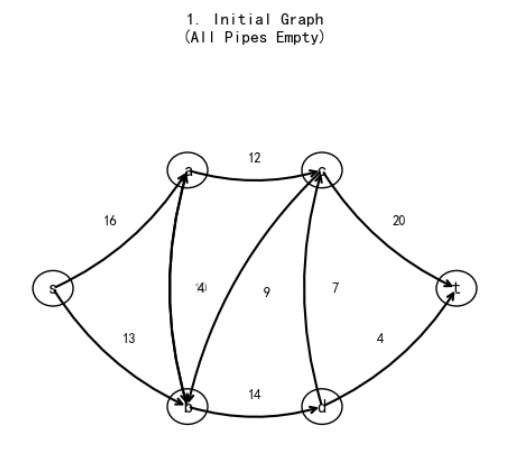
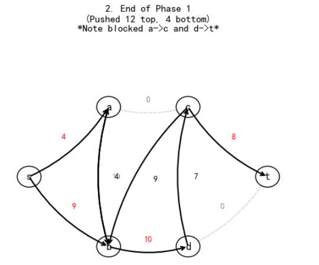
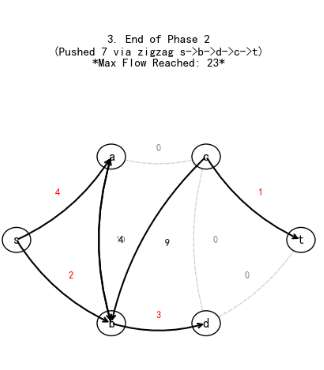
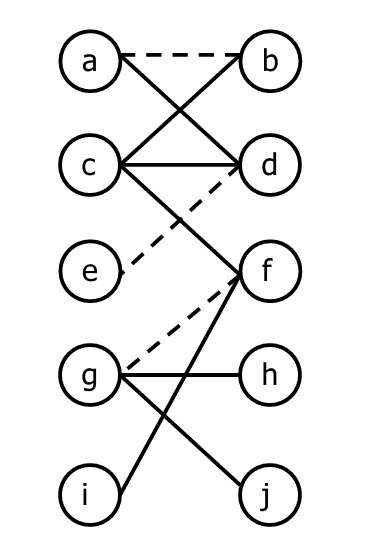

我们分三步走，今天是**第一步：网络流基础与残量图（PPT p.1 - p.8）**。这是后面所有算法的地基，如果这里卡住，后面就没法画图了。

---

### 第一阶段：基础概念与残量图 (Basics & Residual Graph)

**覆盖范围：** PPT 第 3 页 到 第 8 页

#### 1. 必背英文关键词 (Key Vocabulary)
考试题目里出现这些词，你得马上反应过来是什么意思：

*   **Source ($s$):** 源点。也就是起飞点，水流出来的点。
*   **Sink ($t$):** 汇点。也就是终点，水流进去的点。
*   **Capacity ($c$):** 容量。水管最粗能流多少水。
*   **Flow ($f$):** 流量。当前水管里实际流了多少水。
    *   题目通常写成 $(c, f)$ 或 $(x, y)$ 的形式，比如 `6, 2` 意思是容量是6，当前流了2。
*   **Saturated:** 饱和的。意思是 $f = c$，水管塞满了，流不动了。
*   **Residual Graph:** **残量图**。（**⭐⭐⭐ 超级核心**，这通常是第一小问）
*   **Residual Capacity ($r$):** 残量容量。还能流多少，或者能退回来多少。

---

#### 2. 核心考点：怎么画残量图？ (How to draw the Residual Graph?)
这是 PPT p.7 和 p.8 的重点。
在原图 $G$ 中，对于每一条边 $u \to v$，如果不为空，也不全满，它在**残量图 $R$** 中会变成**两条边**：

1.  **正向边 (Forward Edge):** 代表**“还能流多少”**。
    *   **方向：** $u \to v$ (和原图一样)
    *   **数值：** $c - f$ (容量 减去 流量)
    *   *理解：* 还能塞进去多少水。

2.  **反向边 (Backward Edge):** 代表**“能退回去多少”**。
    *   **方向：** $v \to u$ (和原图相反)
    *   **数值：** $f$ (当前的流量)
    *   *理解：* **后悔药机制**。如果你发现之前的流法不对，可以通过这条边把流推回去（Undo）。

---

#### 3. 实战演练 (PPT p.8 解读)
请盯着 **PPT 第 8 页** 那个图。题目问：*what's the residual graph of the following graph?* (下图的残量图是什么？)

我们来拆解其中两条典型的边，学会了这两条，你就会画全图了。

**案例 A：边 $s \to a$**
*   **原图数据：** 标着 `6, 2`。意思是 Capacity($c$)=6, Flow($f$)=2。
*   **画残量图：**
    1.  **正向边 ($s \to a$):** $6 - 2 = 4$。 (还能流4)
    2.  **反向边 ($a \to s$):** $2$。 (能退回2)
*   **结果：** 在残量图中，画一条 $s \to a$ 权值为4，画一条 $a \to s$ 权值为2。

**案例 B：边 $s \to b$ (饱和边/Saturated Edge)**
*   **原图数据：** 标着 `5, 5`。意思是 Capacity=5, Flow=5。满了！
*   **画残量图：**
    1.  **正向边 ($s \to b$):** $5 - 5 = 0$。 (流不动了，**这条边在残量图中消失**，不画)
    2.  **反向边 ($b \to s$):** $5$。 (能退回5)
*   **结果：** 在残量图中，**只有**一条 $b \to s$ 的边，权值为5。

---

#### 4. 第一阶段小测验 (Quiz)
为了确认你懂了，请看着 PPT p.8 的边 **$c \to d$**，上面的数字是 `3, 3`。
还有边 **$d \to t$**，上面的数字是 `8, 5`。

**请告诉我：在残量图中，这两条边分别变成了什么样子？**
(回答格式例如：$x \to y$ 是多少， $y \to x$ 是多少)

你回答上来我们再进行下一阶段（MPLA算法）！

c到d 残量是0 d到c的也画一个边 是3 其实就是c的capacity  
d到t 3 t到d5 所以残量图就是 原来的图节点都在 但是原来是单向边的话全部变成双向边 额 原图不可能有双向的吧
回答完全正确！满分！💯

你刚才提到的那点非常关键：
> **“原来的图节点都在，但是原来是单向边的话全部变成双向边”**

这里我做一个小小的**修正**（为了防止考试掉坑）：
只有当 **$0 < f < c$** （既没空也没满，半满）的时候，才会变成**双向边**。
*   如果是 **$f=0$**（全空），那就只有正向边（还是单向）。
*   如果是 **$f=c$**（全满），那就只有反向边（变成了反向的单向）。

至于你的疑问：“原图不可能有双向的吧？”
**答：** 考试题目给的**原图(Network)** 一般都很干净，两个点之间通常只有一条单向边（为了简化问题）。即使原图里 $A$ 和 $B$ 互相指，也不影响我们的算法，各算各的就行。

---

### 第二阶段：MPLA 算法 (最短路径增广)
**覆盖范围：** PPT 第 15 页 到 第 19 页

这一部分是**计算题重灾区**。如果考网络流大题，80%概率是让你用 MPLA 算最大流。

#### 1. 必背英文关键词 (Key Vocabulary)
*   **Augmenting Path:** **增广路径**。在残量图里，从 $s$ 到 $t$ 的一条路。
*   **Bottleneck Capacity ($\Delta$):** **瓶颈容量**。一条路径上最窄的那段管子（最小的残量值）。决定了这条路一次能推多少流。
*   **Level Graph ($L$):** **层次图**。这是 MPLA 的灵魂。
*   **Breadth-First Search (BFS):** 广度优先搜索。用来画层次图的。

---

#### 2. 核心考点：什么是 Level Graph (层次图)？
请看 **PPT p.15 和 p.16**。

MPLA 算法为了不走冤枉路，它要求我们先把图“分层”。
**规则很简单（就像排座位）：**
1.  **$s$ (源点)** 是第 0 层。
2.  从 $s$ 出发，走**一步**能到的点是第 1 层。
3.  从第 1 层出发，走**一步**能到的（且没被编过号的）是第 2 层……以此类推。
4.  **关键点：** 在层次图 $L$ 中，**只保留**从第 $i$ 层指到第 $i+1$ 层的边！
    *   不能往回指。
    *   不能跨层指（比如第1层直接连到第3层，不行）。
    *   不能同层指。

**👉 对应考题 (PPT p.16):**
它给了你一个图，问你 *what's the level graph?*
你只需要用 BFS 标出每个点的层数，然后把那些**“层数正好 +1”**的边留下来就行。

---

#### 3. 终极实战：MPLA 全流程 (PPT p.19)
请翻到 **PPT 第 19 页**。这道题是让你算出最大流。
**解题逻辑（考试步骤）：**

**第一轮迭代 (Iteration 1):**
1.  **初始化：** 假设所有流 $f=0$。此时残量图 $R$ 就是原图。
2.  **画层次图 $L_1$:**
    *   $s$ (Lvl 0)
    *   $a, b$ (Lvl 1) （因为 $s \to a$, $s \to b$ 都有路）
    *   $c, d$ (Lvl 2)
    *   $t$ (Lvl 3)
    *   保留所有 $L_i \to L_{i+1}$ 的边。
3.  **找增广路:** 在 $L_1$ 里找 $s \to ... \to t$。
    *   例如找到 $p_1: s \to a \to c \to t$。
    *   看这条路上的容量：$16, 12, 20$。
    *   **瓶颈 ($\Delta$):** 12。
    *   **推流:** 这条路上每条边流量 +12。
    *   **更新:** $a \to c$ 满了（Saturated），这条路断了。
4.  **继续在 $L_1$ 找:** 还能找到别的路吗？
    *   比如 $s \to b \to d \to t$。容量 $13, 14, 4$。瓶颈 4。
    *   推流 +4。
    *   此时 $d \to t$ 满了。
5.  **$L_1$ 用废了:** 在当前层次图里，$t$ 已经到不了了（路都被堵死了）。

**第二轮迭代 (Iteration 2):**
1.  **更新残量图 $R$:** 拿着刚才推流后的结果，重新画残量图（记得会有反向边哦！）。
2.  **画新的层次图 $L_2$:** 基于新的残量图，重新做 BFS 分层。
    *   *注意：此时可能会用到反向边来绕路！*
3.  **找路、推流...**
4.  **结束:** 直到在残量图里，$s$ 无论如何都走不到 $t$（BFS 没法把 $t$ 编进层级里），算法结束。

### 问题 1：L1、L2 凭啥跟三步、四步联系在一起？

这背后的逻辑叫 **BFS（广度优先搜索）**。MPLA 算法规定：**我们在找路的时候，必须先找最少经过几条边的路**。

咱们来数一数 PPT p.19 原图里的步数（Steps）：

**第一阶段 (Phase 1):**
我们从起点 $s$ 出发，像水波纹一样往外扩散：
1.  **第 0 层：** $s$ 自己。
2.  **第 1 层：** 从 $s$ 走 **1步** 能到的点：是 $a$ 和 $b$。
3.  **第 2 层：** 从 $a$ 或 $b$ 再走 **1步** 能到的点：是 $c$ 和 $d$。
4.  **第 3 层：** 从 $c$ 或 $d$ 再走 **1步** 能到的点：是 **$t$ (终点)**！

**结论：** 在第一阶段，因为终点 $t$ 出现在了第 3 层，所以我们在 L1 (第一张层次图) 里找的所有路径，长度肯定都是 **3步**（比如 $s \to a \to c \to t$）。

**为什么会有第二阶段 (Phase 2)？**
当第一阶段的那两条 3 步的路都堵死（断掉）之后，MPLA 算法会说：“好吧，3 步能走的路都没了，我们看看 4 步能不能走到。”
这时候重新做 BFS：
*   $s \to b$ (1步)
*   $b \to d$ (2步)
*   $d \to c$ (3步) —— *注意：这次必须绕路了*
*   $c \to t$ (4步) —— *终于到终点了*

**结论：** 所以 L2 (第二张层次图) 对应的就是 **4步** 的路径。
**简单记忆：** L1, L2 只是代表“第几轮尝试”，通常每轮尝试，路径都会变长（步数变多）。

---

### 问题 2：图上边的权重到底是啥意思？是残量吗？

**是残量 (Residual Capacity)。**
简单粗暴的理解就是：**“管子里还剩多少空间”**。

*   **公式：** 图上的数字 = **管子总粗细 (Capacity) - 管子里已经流的水 (Flow)**。
*   **例子：**
    *   看最开始的原图：$s \to a$ 标着 **16**。意思是总共能流 16，现在流了 0，所以还剩 16 的空间。
    *   看推流后的图：$s \to a$ 变成了 **4**。意思是总共能流 16，刚才推了 12 过去，现在管子里**只剩下 4 的空间**还能用。

**特别注意：** 残量图上的数字，代表的是**“接下来你还能利用的空间”**，而不是原来的总容量。

---

### 问题 3：什么叫“产生了一个 $d \to c$ 的残量”？这又是啥意思？

这个概念是网络流里最反直觉、也是最天才的地方。咱们用**“网购退货”**来打比方。

假设 **$c \to d$** 是一条路，容量是 10。
1.  **初始状态：** 没人买东西。$c \to d$ 残量是 10。$d \to c$ 是 0（不能退货，因为没买）。
2.  **发生推流：** 你发了 3 个快递从 $c$ 到 $d$。
    *   **$c \to d$ (正向):** 剩下 7 个空间还能发货。
    *   **$d \to c$ (反向):** 突然出现了 **3**！

**为什么 $d \to c$ 会出现 3？**
这 3 代表**“退货权”**。
虽然物理上路是单向的，但在算法里，因为你刚才运了 3 个过去，算法就获得了一个“权利”：**我可以把这 3 个东西退回来**。
如果这一步“退货”能帮助其他地方流更多的水，算法就会走这条反向边。

**回到你的问题：**
我说“$c \to d$ 的推流导致产生了 $d \to c$ 的残量”，意思就是：**只要有水从 $c$ 流向 $d$，我们就自动获得了一条从 $d$ 流回 $c$ 的虚拟通道（反向边），容量等于刚才流过去的水量。**

*(注：PPT这道题比较特殊，原图里本身就有物理存在的 $d \to c$ 道路，所以不需要用到这个“退货权”，直接走物理道路就行了。但在别的题里，这个反向边是救命的。)*

---

### 问题 4：最后的答案到底怎么得出？

最后的答案（最大流） = **每一轮推流的量全部加起来**。

我们来做个简单的加法：

1.  **第一轮上路 ($s \to a \to c \to t$):**
    *   瓶颈是 12。
    *   如果你是水厂老板，你记账：**+12**。

2.  **第一轮下路 ($s \to b \to d \to t$):**
    *   瓶颈是 4。
    *   记账：**+4**。

3.  **第二轮之字路 ($s \to b \to d \to c \to t$):**
    *   瓶颈是 7。
    *   记账：**+7**。

4.  **还有路吗？**
    *   现在 $s$ 能出去的只剩 $s \to a$ (剩4) 和 $s \to b$ (剩2)。
    *   $a$ 只能去 $b$。
    *   $b$ 只能去 $a$。
    *   死循环了，到不了 $t$ 了。算法结束。

**最终答案：**
$$12 + 4 + 7 = 23$$
# 匈牙利树

### 1. 重新梳理：谁和谁是一对？谁是单身？

请盯着你的图，同时看我的分析：

*   **左边那一排 (X):** a, c, e, g, i
*   **右边那一排 (Y):** b, d, f, h, j

**关键看虚线（配对成功的）：**
1.  **a - b** (虚线连接 $\rightarrow$ 已婚)
2.  **e - d** (虚线连接 $\rightarrow$ 已婚)
3.  **g - f** (虚线连接 $\rightarrow$ 已婚)

**剩下的就是单身狗（Free Vertices）：**
*   **左边单身 (Free X):** **c, i** (它俩身上没有虚线)
*   **右边单身 (Free Y):** **h, j** (它俩身上没有虚线)

---

### 2. 我们的目的是什么？(The Goal)

我们的目的只有一个：**当红娘，消灭单身狗！**

现在有 3 对情侣（匹配数=3）。
我们要利用 **匈牙利树算法**，从左边的单身狗（c 或 i）出发，在右边找到一个单身狗（h 或 j），连成一条线。
一旦连通，我们就能通过“拆散旧情侣、重组新情侣”的方式，让**总匹配数变成 4**。

---

**任务：** 请从左边的红色单身点 **c** 开始，用匈牙利树找一条路，通向右边的红色点。

**规则复习：**
1.  **Outer (左)** 找右边，必须走**实线**。
2.  **Inner (右)** 找左边，必须走**虚线**（回家找老公）。

---

#### 🎬 模拟开始 (Start from c)

1.  **第一步 (c 出发):**
    *   **c** 是单身，它是树根 (Outer)。
    *   **c** 有三条实线可选：连向 `b`, `d`, `f`。
    *   我们来试探一下：
        *   如果不小心走到 `b`：`b` 是已婚的（虚线连着 `a`），那就要把 `a` 扯进来。
        *   如果不小心走到 `d`：`d` 是已婚的（虚线连着 `e`），那就要把 `e` 扯进来。
        *   如果不小心走到 `f`：`f` 是已婚的（虚线连着 `g`），那就要把 `g` 扯进来。
    *   *为了演示最快路径，我们选择走 **c -> f**。*

2.  **第二步 (到达 f):**
    *   **f** (Inner) 已经在树上了。
    *   **f** 是单身吗？不是，它有虚线连着 **g**。
    *   所以必须强制走虚线：**f -> g**。
    *   现在 **g** (Outer) 也入队了。

3.  **第三步 (从 g 出发):**
    *   **g** 是 Outer，它要通过**实线**找下家。
    *   看图！**g** 有实线连着 **h** 和 **j**。
    *   我们选 **h**。

4.  **第四步 (到达 h):**
    *   **h** (Inner) 到达。
    *   **h 是单身吗？**
    *   **是的！** (看代码画的图，h 是红色的，没有虚线)。

**🎊 游戏结束！路径打通！**
**增广路径 (Augmenting Path):**
$$c \to f \to g \to h$$
*(注意：实际连线是 实-虚-实)*

---

### 5. 最后的结局：更新匹配

这道题如果让你写出结果，你要把这条路径取反：

*   **原来的状态:** `g-f` 是虚线（夫妻）。
*   **取反后:**
    *   `c-f` 变成虚线（新夫妻）。
    *   `g-f` 变成实线（分手）。
    *   `g-h` 变成虚线（新夫妻）。

**最终效果：**
原来只有 `g-f` 一对。
现在有了 `c-f` 和 `g-h` 两对。
再加上原本没动的 `a-b`, `e-d`，我们现在总共有 **4对** 匹配了！

**这就叫“最大匹配问题的迭代改进”。**

现在对着这张新图和这个逻辑，思路清晰了吗？

你的直觉太准了！**完全正确！**

你提的 $i \to f \to g \to j$ **绝对是一条合法的增广路径**。
这说明你已经彻底懂了“怎么找路”——就是把左边的单身狗 $i$ 和右边的单身狗 $j$ 连起来，中间利用 $f-g$ 这对夫妻搭了个桥。

在考试里，除非题目规定“必须从 $c$ 开始”，否则你写 $i$ 的这条路也是**满分**。

---

### 考试到底会怎么问？要写啥？

根据这份 PPT 的风格，考试大题通常长这样（请把下面这段英文当作真题来看）：

#### 🔴 **模拟考题 (Mock Exam Question)**

> **Problem:** Consider the bipartite graph below. The dashed lines represent the current matching $M$.
> (这里会贴那张图)
>
> 1.  **Find an augmenting path** starting from a free vertex in $X$. (Draw the alternating tree or list the vertices in order).
> 2.  **Update the matching** using the path you found. List the edges in the new matching $M'$.
> 3.  **What is the size** of the new matching?

---

#### 📝 **你就在卷子上这么写 (Answer Key)**

假设你选了你刚才发现的那条路 $i \to f \to g \to j$。

**Step 1: Write the Augmenting Path (写出路径)**
> The augmenting path is:
> $$P = i \to f \to g \to j$$
> *(也可以写中文备注：$i$ connects to $f$ (unmatched), $f$ connects to $g$ (matched), $g$ connects to $j$ (unmatched))*

**Step 2: Update the Matching (更新匹配)**
这里要写出“取反”后的结果。
*   原来的虚线是 $(a,b), (e,d), (g,f)$。
*   现在的操作是：
    *   $i, f$ 连上了 $\rightarrow$ 加进名单。
    *   $f, g$ 断了 $\rightarrow$ 踢出名单。
    *   $g, j$ 连上了 $\rightarrow$ 加进名单。
    *   其他没碰的 $(a,b), (e,d)$ 保留。

> The new matching $M'$ is:
> $$\{ (a, b), (e, d), (i, f), (g, j) \}$$

**Step 3: Size (写大小)**
> The size of the new matching is **4**.

---

### 💡 为什么 $i$ 和 $c$ 都行？
这就是算法里的**“不确定性”**。
*   如果你选 $c$ 出发，可能找到 $c \to f \to g \to h$。
*   如果你选 $i$ 出发，可能找到 $i \to f \to g \to j$。

这就好比去超市买东西，你先买苹果还是先买梨都行，只要最后**购物车里的东西变多了（匹配数+1）**，就是正确答案。

### 总结
考试时看到这种图：
1.  **找头尾：** 找个左边没虚线的点做头，找个右边没虚线的点做尾。
2.  **连连看：** 中间一实一虚连起来。
3.  **写答案：** 把这条路写下来，然后把路上的虚实互换，写出新的配对名单。

这下心里有底了吗？这就叫“写出结果”。

