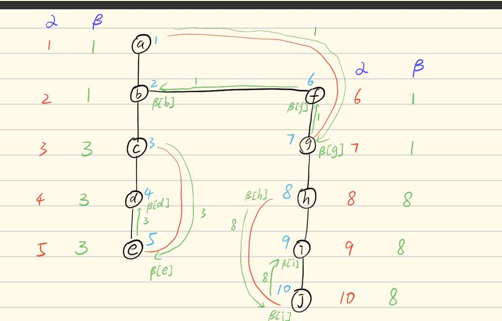

快排自己跑一下

插入和选择的赋值次数都一样？

突然觉得摩尔投票很离谱， 搞完好像遍历一下数组看candidate是不是大于二分之n      那啥都不用做 直接看每个数字是不是大于二分之n不就行？ 哦对这样复杂度高  所以现在这就是检查一下   那如果候选者是假的呢？ 比如例子中的4，那就没办法选出来了？

**Select (找第 k 小)** 一定选5？ 不对吧 

单源最短路径 与 最小生成树  英语题会怎么描述 我怎么区分才能不弄混

判断关节点 其中一个规则是 儿子的β大于等于父亲的β 但d的β就等于c的β 但c》。哦 c就是关节点？
那这个图中 b、c 、j、h都是关节点 ？
