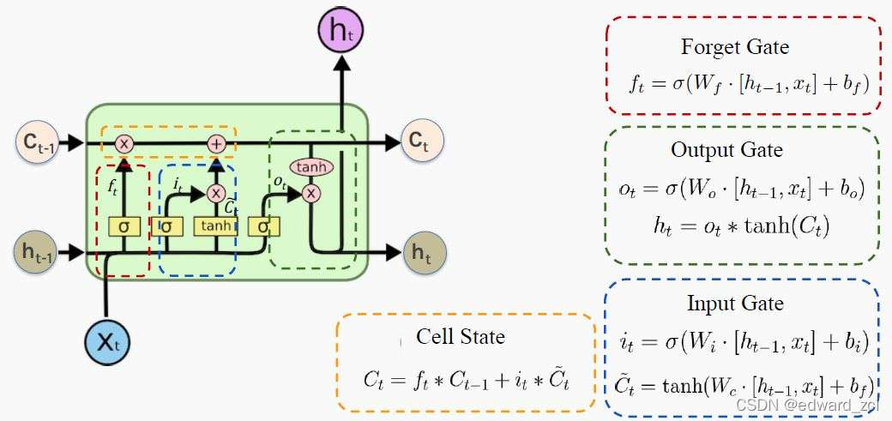

七大题
简答、论述、设计（内容和之前类似）、前沿探索（也与之前类似）
答题时，建议用“**英文术语 + 中文解释**”的方式，既显得专业又能看懂题目。

*   **Inputs (输入层, $x$):**
    *   **作用：** 接收来自外部的数据或者上一层神经元的输出。
*   **Weights (权重, $w$):**
    *   **作用：** 调节每个输入信号的重要性（强度）。
    *   **原理：** 类似于线性方程 $y=ax+b$ 中的斜率 $a$。权重越大，该输入对结果的影响越大。它是网络通过训练主要学习的参数。
*   **Bias (偏置, $b$):**
    *   **作用：** 调整激活的阈值。
    *   **原理：** 类似于线性方程中的截距 $b$。它允许激活函数左右平移，即使输入为 0，神经元也能被激活（或保持不激活）。
*   **Weighted Sum / Linear Combination (线性加权求和, $z = \sum w_i x_i + b$):**
    *   **作用：** 将所有输入信号进行汇总。
*   **Activation Function (激活函数, $\sigma(\cdot)$):**
    *   **作用：** **引入非线性因素 (Non-linearity)**。这是最重要的部分！
    *   **原理：** 如果没有它，无论网络有多少层，最终都只是一个线性模型，无法解决复杂问题（如异或问题 XOR）。它决定了神经元是否“被点燃”（fire）。

---

### 二、 常见的激活函数 (Common Activation Functions)

这部分通常要求列举 3-4 个，并简述特点。

#### 1. Sigmoid
*   **公式：** $f(x) = \frac{1}{1+e^{-x}}$
*   **特点：** 将输出压缩到 **(0, 1)** 之间。
*   **缺点：** 容易导致**梯度消失 (Gradient Vanishing)**；输出不是以 0 为中心的。
*   **适用：** 二分类问题的输出层（表示概率）。

#### 2. Tanh (双曲正切)
*   **公式：** (形状类似 Sigmoid，但是拉长了)
*   **特点：** 将输出压缩到 **(-1, 1)** 之间。
*   **优点：** 输出是以 0 为中心的 (Zero-centered)，通常比 Sigmoid 收敛快。
*   **缺点：** 依然存在梯度消失问题。

#### 3. ReLU (Rectified Linear Unit, 线性整流单元) —— **必写，最常用！**
*   **公式：** $f(x) = \max(0, x)$
*   **特点：** $x>0$ 时直接输出 $x$，$x\le0$ 时输出 0。
*   **优点：** 计算非常简单（速度快）；有效缓解了**梯度消失**问题。
*   **缺点：** Dead ReLU 问题（某些神经元可能永远不会被激活）。

#### 4. Softmax
*   **作用：** 通常用于**多分类问题的输出层**。
*   **特点：** 将一组输出数值转换为**概率分布**，所有概率之和为 1。

---

### 三、 满分论述模板 (可以直接背诵思路)

**Question:** *Explain the structure of a Perceptron and the role of Activation Functions.*

**Answer Structure (中文作答思路):**

1.  **定义 Perceptron：** 感知机是神经网络的基本构建单元，它模拟了生物神经元的工作方式。
2.  **描述结构：** 它由输入 ($x$)、权重 ($w$)、偏置 ($b$)、加权求和 ($\sum$) 和激活函数 ($f$) 组成。（此处可画图）。
3.  **解释线性部分：** 权重代表输入的强度，偏置代表阈值的调整。它们组合形成线性变换 $z = Wx + b$。
4.  **解释非线性部分（核心）：** 激活函数的作用是引入**非线性 (Non-linearity)**。
    *   *Why?* 如果没有激活函数，多层神经网络退化为单层线性网络，无法拟合复杂的非线性数据。
5.  **举例：**
    *   **Sigmoid:** 适用于二分类输出，但有梯度消失问题。
    *   **ReLU:** 现代深度学习最常用的函数，计算快且解决了梯度消失，常用于隐藏层。
    *   **Softmax:** 专门用于多分类的输出层，将输出转化为概率。

# 1 神经网络
神经网络的结构   画下来、讲清楚 其中部分的作用、原理、名字
常见的激活函数  

perceptron 神经元，是神经网络的基本单位
- inputs:接收来自外部的数据或上一层神经元的数据
- weights：
	- 作用：调节每个输入信号的重要性
	- 原理：输入的权重越大，该输入对结果的影响越大。它是网络通过训练主要学习的参数。
- bias：
	- 作用：调整激活的阈值
	- 原理：类似线性方程中的截距b，它允许激活函数左右平移，还能控制神经元被激活的阈值。
- Weighted Sum,线性加权求和, $z = \sum w_i x_i + b$ 
	- **作用：** 将所有输入信号进行汇总。
 - **Activation Function (激活函数, $\sigma(\cdot)$):**
    *   **作用：** **引入非线性因素**。
    *   **原理：** 如果没有它，无论网络有多少层，最终都只是一个线性模型，无法解决复杂问题（如异或问题 XOR）。

常见的激活函数：

  Sigmoid
*   **公式：** $f(x) = \frac{1}{1+e^{-x}}$
*   **特点：** 将输出压缩到 **(0, 1)** 之间。
*   **缺点：** 容易导致**梯度消失 (Gradient Vanishing)**；输出不是以 0 为中心的。
*   **适用：** 二分类问题的输出层（表示概率）。

Tanh (双曲正切)
*   **公式：**$tanh(x) = (e^x - e^-x) / (e^x + e^-x)$
*   **特点：** 将输出压缩到 **(-1, 1)** 之间。
*   **优点：** 输出是以 0 为中心的 (Zero-centered)，通常比 Sigmoid 收敛快。
*   **缺点：** 依然存在梯度消失问题。

  ReLU 
*   **公式：** $f(x) = \max(0, x)$
 $x>0$ 时直接输出 $x$，$x\le0$ 时输出 0。现代深度学习最常用的函数，计算快且解决了梯度消失，常用于隐藏层。

# 2 RNN到Transformer，LSTM细节
记忆相关的 记忆怎么一步步构建、实现的  基础的
序列 RNN LSTM  注意力  前沿的大模型  
LSTM！！！  清楚了解一切细节  PPT有 （结构、为什么）

这里的记忆，指上下文信息的保留能力。

- rnn，通过隐状态的传递，即当前状态等于当前输入＋上一刻的记忆   信息随着时间步衰减   存在梯度消失的问题，导致只有短期记忆 无法捕捉长距离依赖
    $$ h_t = \sigma(W x_t + U h_{t-1}) $$
- lstm  引入细胞态 ,理解为记忆。设计三个门（遗忘门，输入门，输出门） 。将记忆和输入分开，记忆横穿整个时间步，选择性地让关键信息保留在cell state. 模型可以自主学习记住什么，忘记什么，大大增强长距离记忆能力
- transformer 并行计算+自注意力机制构建记忆 不依赖时间步 没有距离衰减   生成动态词向量 提升了对复杂语义的理解

LSTM细节：
*   底部输入：$x_t$ (当前词), $h_{t-1}$ (上一时刻的短时状态)。
*   左上进入：$C_{t-1}$ (上一时刻的长时记忆)。
*   右上输出：$C_t$ (传给下一时刻的长时记忆)。
*   右下输出：$h_t$ (当前时刻的输出/短时状态)。

- 遗忘门，决定要丢弃什么旧信息。输入的是当前信息xt，上一时刻短时记忆ht-1，  使用sigmoid函数，0就是遗忘，1就是保留。最后输出的ft，直接乘到上一时刻的Ct-1，也就是，通过上一时刻短时记忆和当前信息，决定要不要丢弃过去的长时记忆。
- 输入门，决定这个时间步储存什么新信息。先是生成 $i_t$，叫输入们，决定每个信息的权重。然后生成候选记忆，是对xt和ht-1信息的处理，称为  $\tilde{C}_t$
- 有了遗忘门和输入门后，就可以直接更新Ct了。$$ C_t = f_t * C_{t-1} + i_t * \tilde{C}_t $$遗忘，就是旧记忆乘以遗忘系数（比如乘以 0.1 就忘得差不多了）**记忆**，就是根据输入门的权重，把新候选信息加进去。
- 输出门：
    $$ o_t = \sigma(W_o \cdot [h_{t-1}, x_t] + b_o) $$
    (决定输出哪些部分)
    $$ h_t = o_t * \tanh(C_t) $$
    (把当前的细胞状态 $C_t$ 经过 Tanh 归一化到 -1~1 之间，再过滤一遍，得到最终输出 $h_t$)

一些细节：
- sigmoid函数，用在”门“上，0到1表示开关程度。Tanh，用在处理信息上。-1到1，表示增加或减少某种特征
- 细胞更新状态，是加法。只要ft经常接近1，梯度就能以近乎无损的方式一直传到很久以前的时间步。而在普通 RNN 中，梯度是连乘权重矩阵，容易梯度消失。
# 3注意力机制 类型、如何起作用、工作   侧重于自注意力机制 词表征
**List the types of Attention mechanisms. Explain detailedly how Self-Attention works and how it improves word representation.**

 $$ \text{Attention}(Q, K, V) = \text{Softmax}\left(\frac{Q K^T}{\sqrt{d_k}}\right) V $$

自注意力、交叉注意力、多头注意力。
- 自注意力 $Q, K, V$ 全部源自同一个输入序列  捕捉序列内部的关联
- 交叉注意力 Q(A), K(B), V(B)，用于**A理解B**。 是处理不同模态（文、图、声）或不同任务（翻译的源句和目标句）之间信息交互的核心部分
- 多头注意力 把 $Q, K, V$ 切分成多组（多个头），分别计算再拼接  让模型从不同的“子空间”学习关联  

以自注意力机制为例，
1. 线性变换：每个输入的词向量，都经过线性层生成Q、K、V三个矩阵。
	假设最后的维度为，`[seq_len,d_model]` 
2. 计算相似度 ：使用Q点积K转置矩阵，就能实现每一个词向量的Q与每一个词向量的K作”匹配“，生成注意力分数矩阵。`[seq_len,seq_len]`
3. 缩放 ：  我们再除以根号d_model ，保证数据的稳定和训练的收敛。如果不先除以这个数，当 $d_{model}$ 很大时，点积的结果会很大。这会导致 Softmax 的梯度极其微小（进入饱和区），导致**梯度消失**，模型这就训练不动了。
4. 归一化 ：然后我们使用softmax，讲分数变为概率权重  所有权重之和为 1。
5. 加权求和：整个注意力权重矩阵 与 V做矩阵乘法，实际上是一一加权求和。
最后得到`[seq_len,d_model]`  
最后结果就是所有的新的词向量。

关于词表征的改进：

*   **传统词向量 :**
    *   它是**静态**的。无论上下文怎么变，“Apple”的向量永远固定。无法区分“苹果手机”和“吃的苹果”。
*   **Self-Attention 生成的词向量:**
    *   它是**动态**的。
    *   通过 Self-Attention，每个词的最终输出向量不仅仅包含该词本身的含义，还**融合了它在这个特定句子里关注到的所有相关词的信息**。
    *   **结果：** 完美解决了**多义词** 问题。同样的词在不同语境下，经过 Attention 计算后的输出向量是完全不同的。

# 4大模型智能体，设计类   
给定一个背景（问题） 设计一套xxx系统 逐项作答
落实到案例？

agent，五个板块
感知、大脑、记忆、规划与工具

假设考试题目是：**“设计一个智能旅行助手来帮助用户规划行程。”**

开头一句话：**本系统基于大语言模型（LLM）构建，系统采用 ReAct 范式，模型先推理该做什么，然后执行行动（调用工具），最后输出结果。**
采用模块化设计，分为感知、大脑、记忆、规划、工具五大模块。

#### 具体模块设计

**(1) Perception Module (感知模块)**

- **功能：** 接收多模态输入。
- **本案例应用：**
    
    - 接收用户的文本指令（如“我想去京都玩三天”）。
    - 如果不确定，反问用户（如“预算是多少？”）。
    - (如果是医疗场景，这里就是接收体检报告图片或描述)
        

**(2) Brain / LLM Controller (大脑/核心模型)**

- **功能：** 系统的核心控制器，负责理解语义、逻辑推理和分发任务。
- **本案例应用：**
    
    - 使用 GPT-4 或类似模型。
    - 它的作用不是直接生成结果，而是**决策**：判断用户意图是“闲聊”还是“真要订票”。若闲聊，直接调用大语言模型功能。若要有实际性的动作，则调用后面的工具。
        

**(3) Memory Module (记忆模块) —— 关键拿分点**  
这里必须要把记忆拆分为两类：

- **Short-term Memory (短期记忆/上下文):**
    
    - **作用：** 记住当前对话的历史。
    - Case: 记住用户上一句说了“不去景点人多的地方”，防止重复问。
        
- **Long-term Memory (长期记忆/知识库 RAG):**
    
    - **作用：** 存储外部知识或用户画像，通常使用**向量数据库 (Vector Database)**。
        
    - Case: 存储京都的旅游攻略、用户过去的饮食偏好（如“用户对海鲜过敏”）。系统会先使用RAG检索这些信息，再喂给 LLM，LLM根据背景信息回复用户
        

**(4) Planning Module (规划模块)**

- **功能：** 处理复杂任务的能力。LLM需要思考步骤。
    
- **核心技术：** **CoT (Chain of Thought)** 或 **ReAct (Reason + Act)**。
    
- **本案例应用：**
    
    - 用户目标：“规划京都三天行程”。

    - **Decomposition (拆解):** 系统内部将目标拆解为：
        
        1. 查询京都未来3天天气。
            
        2. 根据天气和兴趣检索景点。
            
        3. 规划路线。
            
        4. 查询酒店和机票价格。
            
        5. 生成最终表格。
 

**(5) Tools / Action Module (工具/执行模块)**

- **功能：** 弥补 LLM 无法联网、无法精确计算的缺陷。使用API或MCP，调用外部工具
    
- **本案例应用：**
    
    - **Search API:** 调用 Google Search 查询最新景点开放时间。
        
    - **Booking API:** 调用携程/Booking 接口查询房价。
        
    - **Calculator:** 计算总预算（LLM 数学通常不好，要用计算器工具）。
        

---
“大脑”的功能是通用的！不同按理改感知（是文本还是图片还是都有）、记忆（记的内容是什么，基于用户背景）、规划（把给的问题拆分出步骤）、工具（想想该问题下有什么外部工具要使用）

*   **医疗助手案例：**
    *   **Perception:** 听病人的描述。
    *   **Memory (RAG):** 检索医学教科书、药品说明书（长期记忆）。
    *   **Planning:** 先问诊 $\to$ 再分析症状 $\to$ 最后给建议。
    *   **Tools:** API调用“药物相互作用查询数据库”。

*   **代码编程助手案例：**
    *   **Perception:** 读取用户的 Bug 报错信息。
    *   **Memory:** 记住整个项目的代码库结构。
    *   **Planning:** 定位错误文件 $\to$ 生成修复代码 $\to$ 运行测试。
    *   **Tools:** Python 解释器、终端命令行。

# 5.多模态信息融合 
什么叫多模态、融合时常用的方法，融合时会有什么问题？   如何做好    也是设计类题目（提供一个背景，比如教育相关、心理健康相关，比如什么十天以后的天气？考虑数据特点？）

1.  **What is Multimodal? (什么是多模态)**
    *   **Modality (模态):** 指某种特定的信息来源或数据形式。例如：文本 (Text)、图像 (Image)、音频 (Audio)、传感器数据 (Sensor Data)。
    *   **Multimodal Learning:** 让机器像人一样，同时通过看（视觉）、听（听觉）、读（文本）来理解世界。

2.  **What is Fusion? (什么是融合)**
    *   **Definition:** 将来自不同模态的信息结合起来，以实现比单模态更高的预测精度。
    *   **Core Philosophy:** **$1 + 1 > 2$ (Synergy/互补性)**。
    *   *例子：* 一个人笑着说“我恨你”。光看文本是负面的，光看图是正面的。融合后才知道这是“开玩笑”。

### 融合方法：

1.  **Early Fusion (早期融合 / 数据层融合):**
    *   **做法：** 在特征提取之前或刚提取时，直接把不同模态的向量**拼接 (Concatenate)** 起来。
    *   *公式：* $Z = [v_{text}, v_{image}]$，然后输入神经网络。
    *   **优点：** 简单，保留了原始层面的相关性。
    *   **缺点：** 无法处理不同模态的复杂性差异（文本是稀疏的，图像是密集的），容易导致某一种模态主导。

2.  **Late Fusion (晚期融合 / 决策层融合):**
    *   **做法：** 每个模态单独训练一个模型，最后对结果进行**投票 (Voting)** 或 **平均 (Averaging)**。
    *   *公式：* $Final = w_1 \cdot P(Text) + w_2 \cdot P(Image)$。
    *   **优点：** 模态之间互不干扰，即使一个模态缺失（如摄像头坏了），另一个还能工作（鲁棒性强）。
    *   **缺点：** 忽略了模态之间深层次的交互（比如“图文对应”的关系）。

3.  **Intermediate / Deep Fusion (中间融合 / 深度融合) —— **推荐写法****
    *   **做法：** 在神经网络的隐藏层进行融合，通常使用 **Attention Mechanism (注意力机制)**。
    *   **核心技术：** **Cross-Attention (交叉注意力)**。让文本去“关注”图像中的关键区域。
    *   **优点：** 是目前效果最好的方法（Transformer 架构的核心），能捕捉深层语义对齐。

如果单独有一问是，“多模态的融合方法是什么” 这三点全答。
如果只是情景中的多模态融合方法，我们选用第三种，cross-attention
Q（query）是文本，K和V是其他模态。

### 融合时的挑战

1.  **Alignment (对齐问题):**
    *   视频是一秒 24 帧，音频是一秒 16000 次采样，文本是一句话 10 个词。**时间步不匹配**，怎么把单词 "Jump" 刚好对应到视频里跳起来的那一帧？
2.  **Missing Modality (模态缺失):**
    *   实际场景中，数据往往不完整。比如用户没开摄像头（缺视觉），或者环境太吵（缺听觉）。模型需要具备**鲁棒性**。
3.  **Heterogeneity (异构性):**
    *   文本是符号（离散的），图像是像素（连续的）。它们的分布空间完全不同，很难直接放在一起算。

如果单独有一问是，“多模态融合时的挑战” ，对齐、模态缺失、异构 这三点全答。
如果情景中，且还问如何改进。
对于对齐问题，我们使用时间戳强制对齐，或设计位置编码，让模态的时间步匹配。
对于模态缺失，我们使用“Drop-Out” 强迫模型在模态不全的情况下也正常训练。
对于异构？

###  案例设计

**背景：** 智能心理健康评估系统 (AI for Mental Health/Depression Detection)。
**任务：** 判断用户是否患有抑郁症。

**答题模板（按步骤写）：**

#### 1. Data Analysis (数据特点分析)
本系统涉及三种模态，它们提供了互补的信息：
*   **Text (Transcript):** 用户的回答内容。
    *   *特点：* 捕捉关键词（如 "hopeless", "tired"），反映**认知内容**。
*   **Audio (Acoustic):** 用户的语音语调。
    *   *特点：* 捕捉韵律（如语速慢、音调平淡、停顿长），反映**情绪状态**。
*   **Visual (Facial Expressions):** 用户的面部表情。
    *   *特点：* 捕捉微表情（如眼神躲闪、皱眉、缺乏笑容），反映**潜意识反应**。

#### 2. Model Architecture (模型架构设计)
我将采用 **基于 Transformer 的中间层融合 (Intermediate Fusion)** 架构。

*   **Step 1: Unimodal Encoders (单模态编码器)**
    *   Text: 使用 **BERT** 提取语义向量。
    *   Audio: 使用 **Wav2Vec** 或 CNN 提取声学特征。
    *   Visual: 使用 **ResNet** 或 **ViT** 提取面部帧特征。

*   **Step 2: Cross-Modal Attention (跨模态融合 —— 核心)**
    *   设计一个融合层。不要简单拼接，而是使用 **Cross-Attention**。
    *   *逻辑：* 让文本向量作为 Query，去查询音频和视频的 Key/Value。
    *   *作用：* 当用户说到 "I'm fine" (文本呈正面) 时，模型会去检查对应的视频帧（是否皱眉）和音频（是否语调低沉）。如果发现矛盾，模型会判定为“掩饰性抑郁”。

*   **Step 3: Classifier (分类器)**
    *   将融合后的向量通过全连接层 (MLP)，输出抑郁风险概率 (0~1)。

#### 3. Solving Challenges (如何解决问题 / 做好)
*   **针对对齐 (Alignment):** 使用**时间戳 (Timestamps)** 强制对齐，或者使用 Transformer 的位置编码，让模型自动学习时间对应关系。
*   **针对缺失 (Robustness):** 引入 **Drop-out 机制**。在训练时随机丢弃某种模态（例如故意把画面全黑），强迫模型学会仅靠声音或文本也能做出判断。

核心就俩步
1. 数据收集与处理，使用模型
2. 跨模态融合，即模态融合方法，一般就cross-attention
1：Text：Bert； Audio：CNN； Visual：Vit； TIme Series（温度、湿度....天气） ：LSTM

如果是“天气预测”背景怎么答？
*   **模态 1:** 卫星云图 (Image/Visual) —— 用 CNN 处理。
*   **模态 2:** 地面传感器数据 (温度、湿度、风速 - Time Series) —— 用 LSTM/Transformer 处理。
*   **融合:** 因为云图的变化滞后于气压变化，需要用融合层，cross-attention来寻找它们的滞后相关性。
*   **挑战:** **分辨率不同**（卫星图是公里级，传感器是点级）。需要进行空间插值或对齐。

为了实现记忆，现在有哪些前沿的方法，这些方法的特点、技术要点，相互作用是？
长上下文的理解，与rag的对比

关于贝叶斯理论的讨论，与具体背景结合
什么是？贝叶斯分类、网络； 公式各个部分的关系，模拟了怎样的人类认知。

前沿探索题目： 
智能决策  与具身智能小小结合  对强化学习的理解   马尔科夫的理解（为什么跟这个有关？）

