DeepSeek-V4在万众瞩目下终于亮相了！
毫无疑问，又是拿下了开源霸主的称号。

个人来讲，我对深度求索很有感情，DeepSeek-V3 与 R1 正是我的“AI 启蒙导师”。
当时 R1 的开源思维链，说是掀起世界对 AI 的热情都不为过。

所以 V4 出来，即使在考研期间，我也是迫不及待研读了技术报告。

**“Highly Efficient”**，是本次 V4 的主题，
那么本篇文章，我们就来探讨 V4 中，最体现“**Highly Efficient**”的部分：**稀疏注意力 CSA+HCA**

**全文通俗拆解公式+可视化流程，无 “AI 式车轱辘话/奇妙比喻”**

让我们一起了解这次 V4 精妙的设计吧！

# 复习一下

在正式硬核拆解 DeepSeek-V4 的注意力机制前，我想我们还是梳理下传统的 LLM，最经典的推理机制是怎样的。

假如我们输入“**我爱人工智**”这五个大字，
期待模型接下来的输出。

模型大概率会输出“能”字。

接着，模型又会根据输出的“能“，输出下一个字....

整个过程会经历下图这个 **Decoder** 架构，
不过我们只专门研究 Attention 部分，即图中的“阅览室”，

它的作用是输入向量，突出一个维度不变，但含义包含上下文的向量。

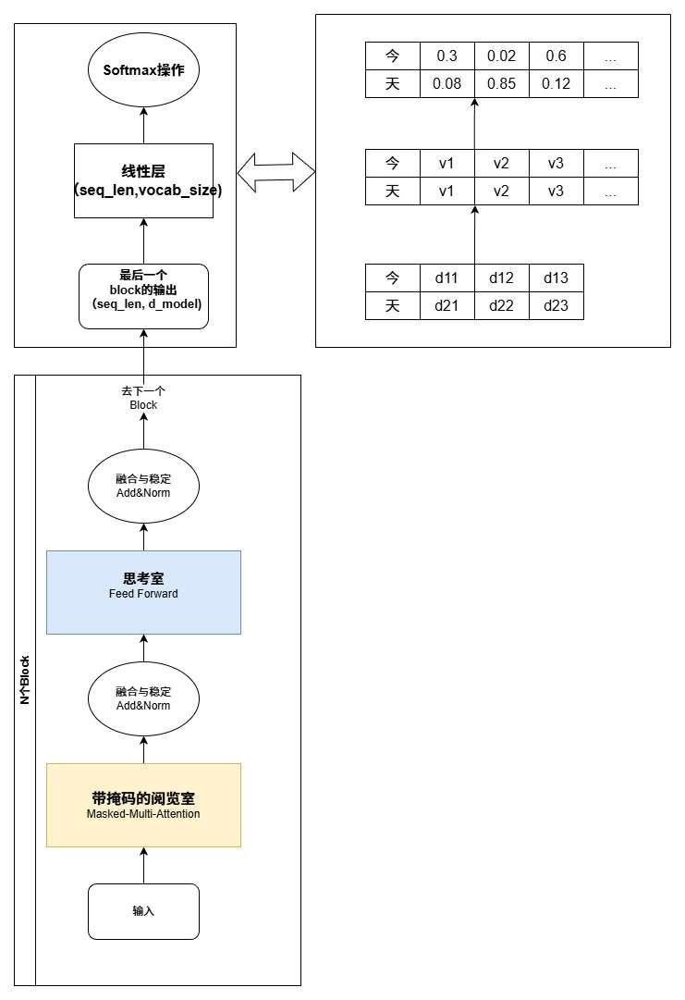

> 如图，输入是“今天”，经过了很多“Transformer Block”后， 
   最后“天”这个词的向量，各维度概率是 0.08,0.85,0.12... 假设我们查词表发现，第二个维度是“天”字，那模型大概率接下来会输出“天”。“我爱人工智”输出“能”是同样的道理
   
（看这个 Block，就是 v4 关于 Attention 模块的创新之处。实际上所有的 LLM，对架构的改变几乎都是 Block 的）

### 第一阶段
首先我们来看第一阶段，模型的 Prefill 阶段，**“预填充”**。

输入“我爱人工智”后，通过矩阵映射，构造出“我爱人工智”这五个大字的 **Q 矩阵，K 矩阵，V 矩阵。**
为了便于理解，在图中假设映射后，词向量的维度就是 4（d1--d4）

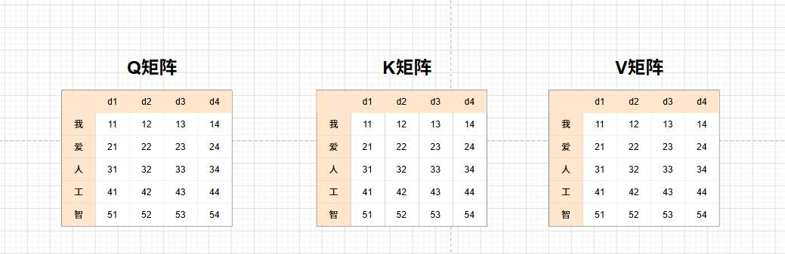

接着，Q 乘 K 矩阵的转置，算出它们之间的关联度，形成原始分数矩阵

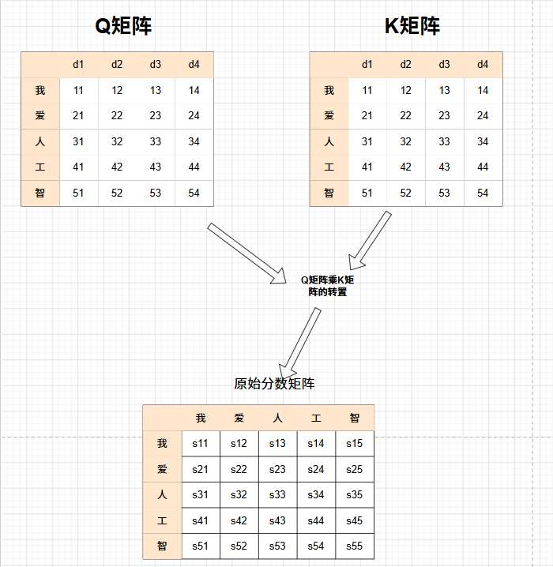

因为大模型不能让前面的字看到后面的字，所以我们要给矩阵加上**掩码（Mask）**，把不该看的未来信息遮蔽成负无穷，再经过 Softmax 处理，得到最终的**注意力权重矩阵**。

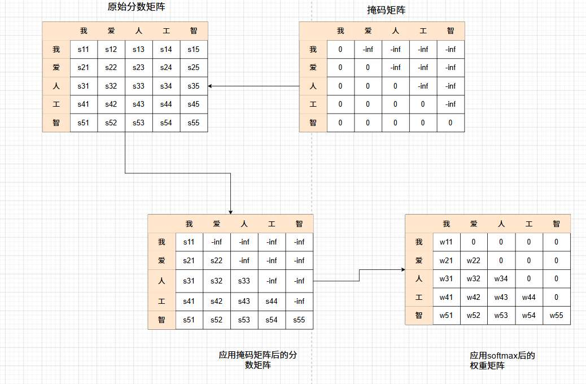

使用权重矩阵，与 V 矩阵做矩阵乘法

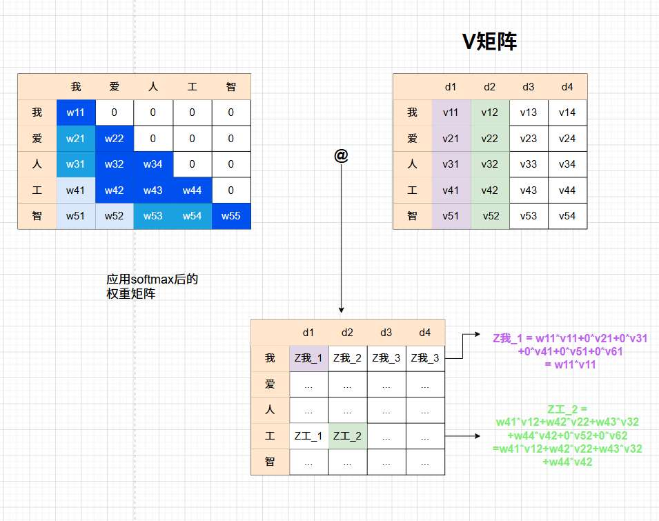

最终，模型成功得到了这 5 个字“结合了上下文”的全新词向量。

我们使用“智”的词向量，送去模型预测层，模型预测出下一个词很大概率是“能”，最后也确实输出了“能”这个 token。

于此，我们说模型的“预填充”阶段结束。 

### 第二阶段
那么接下来呢？模型还有继续往后输出词呢，它会如何做？

会拿“能”这个词向量作为输入，“能”字会生成属于它自己的 **$q$ 向量、$k$ 向量、$v$ 向量。**

与 K 矩阵作用得到“能”对每一个词的注意力权重分配，
再拿权重分配与 V 矩阵作用，“阅读内容”，最终得到维度不变的，包含上下文的新“能”词向量。
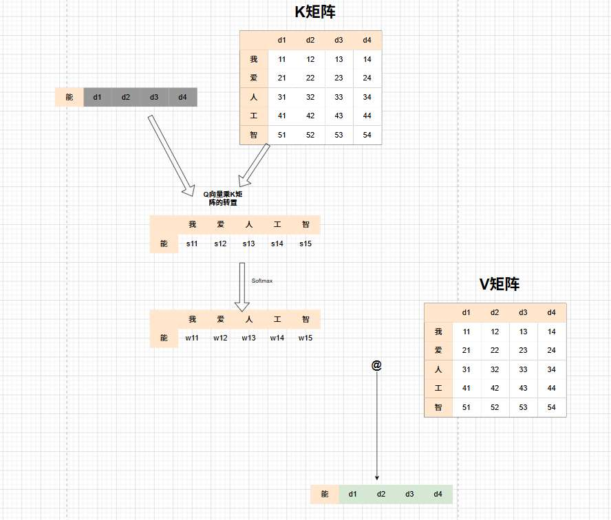

假如“能”这个词向量经过层层模型，又输出个"的"，
模型继续往下输出是什么流程？ 

它会经历和“能”一模一样的流程，
当然，整个过程中 K 矩阵和 V 矩阵会加上上轮“能”向量的部分。

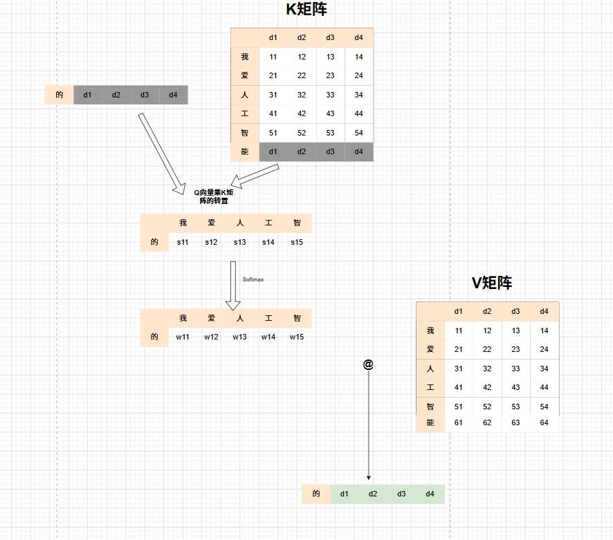

我们可以看到，在推理一个个生词时，我们会反复用到之前词的 K 向量，V 向量。我们并不会每次都重新算，而是第一次算出之后，就直接存到显存里，要用直接拿来用。这就是**“KV Cache”**。 

但，随着模型吐出的字越来越多，或者当你扔给模型一篇 **100 万字** 的小说时：  
 KV Cache 会变得**无限大**！

每蹦出一个新字，这个新字的 q 向量都要去看过去 100 万个旧字的 KV 缓存。显存会被撑爆，计算速度也会因为矩阵越来越长而越来越卡。传统的 LLM 架构的问题之一就在于此。

到如今，已经有越来越多的解决方法，VLLM 范式的推理框架(PagedAttention 思想)，FlashAttention 读写速度... 包括稀疏注意力尝试跳着读。

那接下来我们就正式来看，Deepseek -V4 独创的稀疏注意力流程，与经典的不同。

# CSA (Compressed Sparse Attention) 压缩稀疏注意力

背景还是第一阶段，预填充。
还是这个例子，我们输入“我爱人工智”
## 压缩

接下来，没有传统的 QKV 矩阵，而是用原始的词向量矩阵，生成了 4 个矩阵：
$$C^a = H \cdot W^{aKV}, \quad C^b = H \cdot W^{bKV} \tag{9}$$
$$Z^a = H \cdot W^{aZ}, \quad Z^b = H \cdot W^{bZ} \tag{10}$$
（注：公式的标号，遵循 **deepseekV4技术报告原版**，方便大家查阅。与本文章公式顺序无关，后面不再赘述）

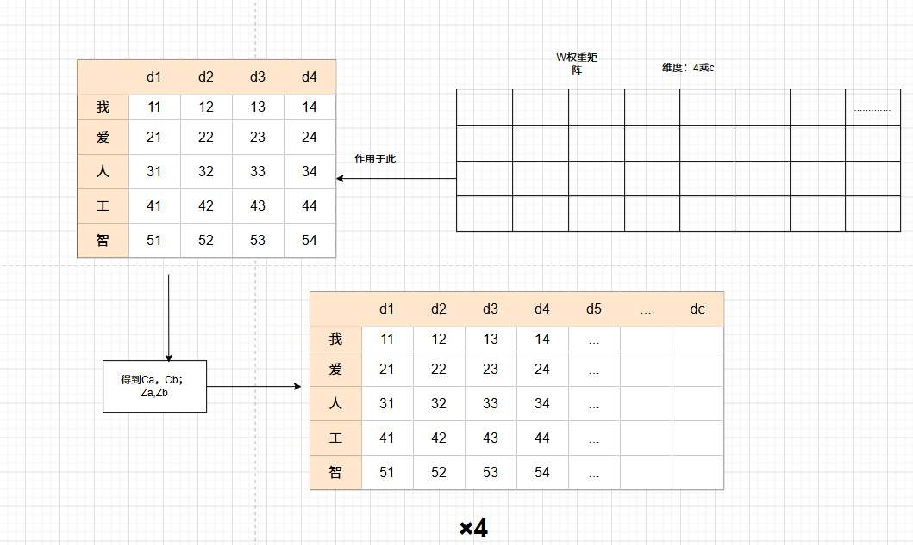

在这里，词向量的维度被重新映射到了专用的特征维度 $c$ 

那么这 4 个矩阵有什么意义呢？

*   $C$ (Content)：它代表词向量本身的**内容，意义**
*   $Z$ (Weight) ：它代表词向量各维度的“**重要程度**”

为什么要分a 和 b，我们等会就知道有什么用。

接下来就是体现“压缩”的时候

我们只拿一个 Z 矩阵来举例，
首先，我们把矩阵以 m 为单位切成一组。

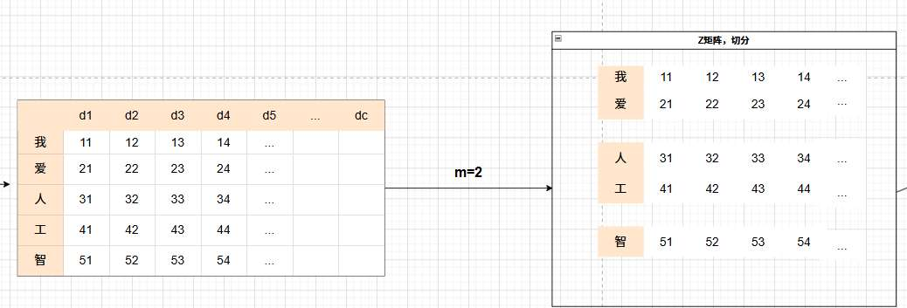

但如果只看 Z，那么模型只会关注内容重要程度，而忽视了词汇的顺序也对最终的重要性有影响！

故而，我们会有与分组后矩阵形状一模一样的 B 矩阵们。
这个 $B$ 矩阵的形状跟切分后的 $Z$ 小块一模一样（$m \times c$）。

B 矩阵被定义为"learnable positional biases",**可学习位置偏置**

Z 是内容重要性，B 是位置重要性。 

我们用这两种重要性来定位“重要的权重”。

- 比如在本例中，**也许** Z 矩阵的“人工”两个向量内容，很重要，权重都很大。
- 同时，模型通过学习发现，在这个 2 个词的小组里，排在第一位的词通常是主语，更重要，于是给第一行“人”这个位置，给了更高的权重。

于是“人”这个词整体重要程度最大。

那我们定位了重要之处，就要把它提取出来。

把这两种分数加在一起，并进行 Softmax 归一化，就能得到最终的权重分数“S”
$$[S^a_{mi:m(i+1)-1}; S^b_{m(i-1):mi-1}] = \text{Softmax}_{row}([Z^a_{mi:m(i+1)-1} + B^a; Z^b_{m(i-1):mi-1} + B^b]) \tag{11}$$
Z 和 B 是同维度的，表示重要性的矩阵，所以完全可以把“内容本身的重要程度”与“位置带来的权重”加上。

那么这里的 a 和 b，就体现了重叠压缩“overlap”的思想。

$a$ 永远代表“**当前正在处理的 $m$ 个词**”，$b$ 永远代表“**紧挨着的前 $m$ 个词**”。

我们会用 a 和 b 的权重，配合词意矩阵“C”，进行压缩向量。

比如将“我”，“爱”这两个向量，压缩成一个向量，命名为 $C_0^{Comp}$，表示“我爱”。

$$C^{\text{Comp}}_i = \sum_{j=mi}^{m(i+1)-1} S^a_j \odot C^a_j + \sum_{j=m(i-1)}^{mi-1} S^b_j \odot C^b_j \tag{12}$$

如图，最终我们将 5 个向量压缩成了 3 个向量。
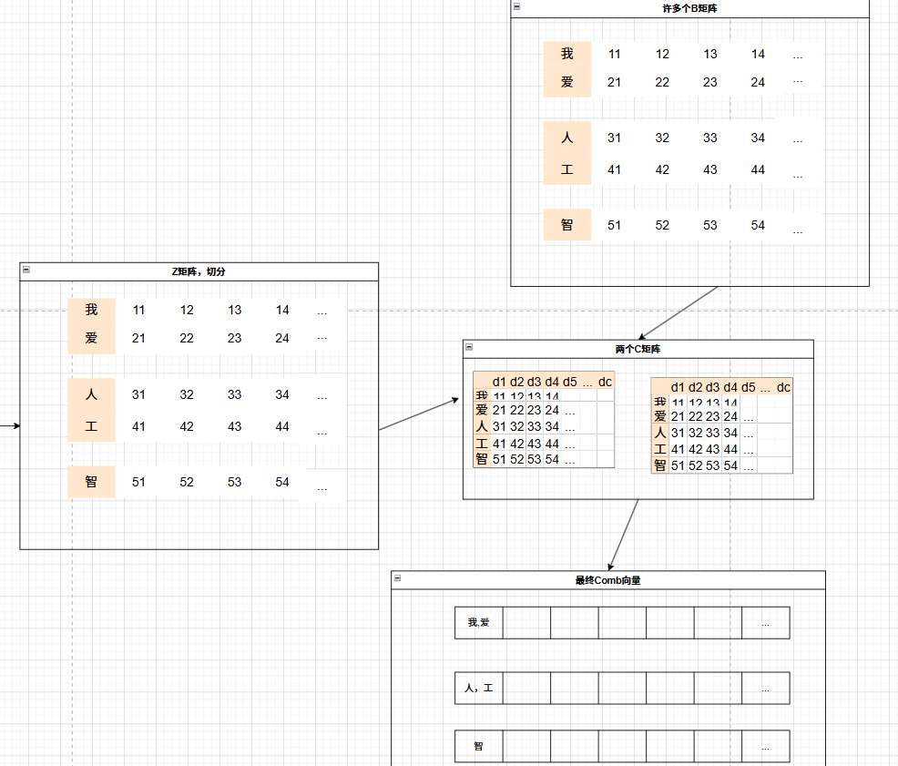

我们来过一下流程

*   **第 1 个压缩向量（$C_0^{\text{Comp}}$）**：
    此时当前组 $a$ 是 `[我, 爱]`。因为它是开头，前面没有词了，所以历史组 $b$ 是 `[空, 空]`。
    在进行 $\text{Softmax}$ 计算时，模型会将 $b$ 组的 $Z$ 分数设为“负无穷（$-\infty$）”，所以 $b$ 组分配到的权重是 0。
    最终，可能“我”分到了 0.7 的权重，“爱”分到了 0.3 的权重。我们用这两个权重分别去乘它们对应的 $C^a$ 特征并相加，就得到了代表“我爱”的第一个压缩包。
*   **第 2 个压缩向量（$C_1^{\text{Comp}}$）**：
    **此时当前组 $a$ 是 `[人, 工]`，而紧挨着的前一个历史组 $b$ 是 `[我, 爱]`。**
    模型会把这 **4 个字** 放在一起进行 $\text{Softmax}$ 。它同时使用了“人、工”的 $(Z^a + B^a)$，以及“我、爱”的 $(Z^b + B^b)$。
    算完之后，这 4 个字瓜分了 100% 的权重。比如：“我”是 0.1，“爱”是 0.1，“人”是 0.5，“工”是 0.3。
    最后，按照这个比例，把“我、爱”的 $C^b$ 矩阵与“人、工”的 $C^a$ 矩阵按比例混合，揉成了这第二个压缩向量。
    如图：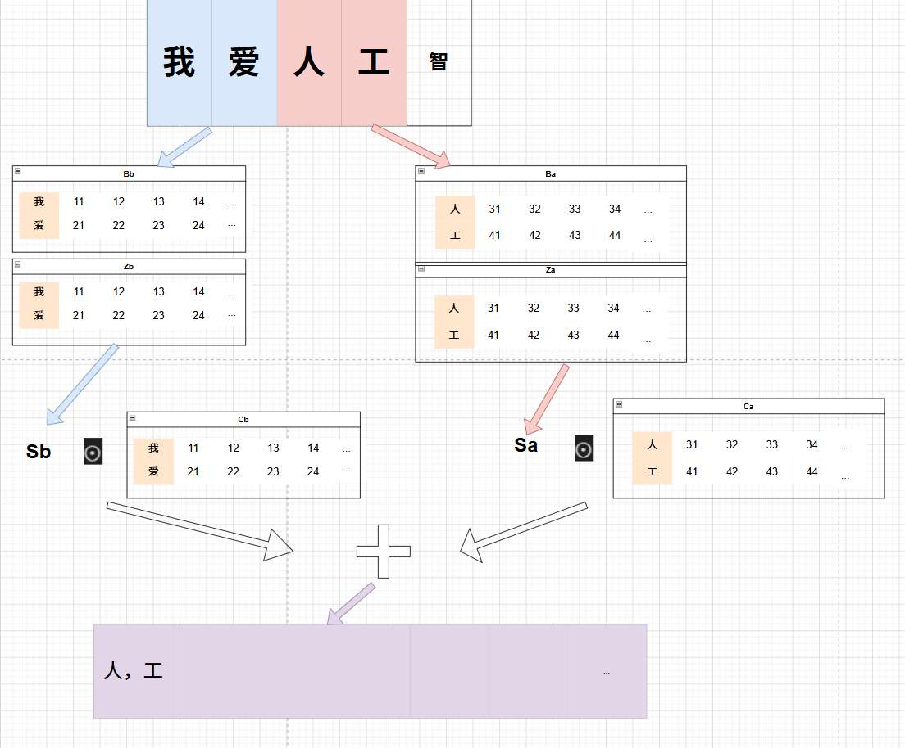
*   **第 3 个压缩向量（$C_2^{\text{Comp}}$）**：
    同理，当前组 $a$ 是 `[智, 能]`，历史组 $b$ 是 `[人, 工]`，四个字一起算分并揉捏。

**所以重叠的意义是**，当我在压缩“人工”时，它并没有只看这两个字，还带着“我爱”的信息。

这种“带着上文压下文”的滑动处理，确保了长文本在被成倍砍掉体积后，语义逻辑依然是严丝合缝的，不会出现断层。

压缩后的  $C^{\text{Comp}}$ 向量，称作“KV 实体”。里面的向量既可以当作 K 向量，又可以当作 V 向量

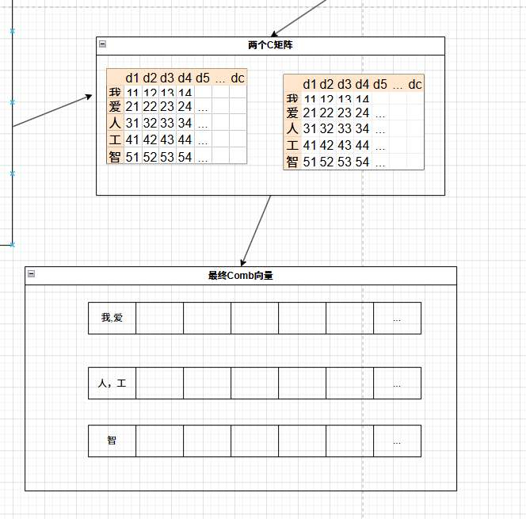

## 闪电索引   

我们拥有了目前五个词的三个 $C^{\text{Comp}}$ 向量，预填充阶段已经结束。
对比经典流程，其实就是我们的 **KV Cache**已经准备好了。

接下来我们要进行推理，看注意力机制如何生成“能”这个词向量。

再次对比经典流程，
在传统 Attention 中，当前 token“智” 会生成自己的 $q$ 向量，然后拿这个 $q$ 去和历史 KV 做匹配。

在 V4 中，当前 token 也会先从隐藏状态 $h_t$ 生成一个压缩后的 Query 意图 $c_t^Q$，再进一步展开成多个低维的“索引查询头” $q^I$，专门用来做闪电索引。

$$c^Q_t = h_t \cdot W^{DQ} \tag{13}$$
$$[q^I_{t,1}; q^I_{t,2}; ...; q^I_{t,n^I_h}] = q^I_t = c^Q_t \cdot W^{IUQ} \tag{14}$$

第一个公式中：
*   **$h_t \in \mathbb{R}^d$**：这是原始的“智”的 Query 词向量，维度 $d$ 很大。
*   **$W^{DQ} \in \mathbb{R}^{d \times d_c}$**：这是一个**下投影**矩阵。
*   **$c^Q_t \in \mathbb{R}^{d_c}$**：这是压缩后的 Query 向量。维度会很小。
第二个公式中：
*   **$W^{IUQ} \in \mathbb{R}^{d_c \times c_I n^I_h}$**：这是一个**上投影**矩阵。又将 $c^Q_t$ 的小维度升维
*   **$q^I_{t,1}, q^I_{t,2}, ...$**：这是最终生成的 $n^I_h$ 个“索引查询头”。

这个**先降维后升维**的互相转换，而不是“一步到位”的转换到最后一个维度，是神经网络中很常见的手法。

在这里，意图 $c^Q_t$ 浓缩后，重新映射回多个**索引头**空间，**每个头都有自己的分工**，一会会去扫射索引标签来看是否对应。

同时，也省下惊人的参数和计算量。如果直接从 $d$ 生成所有的查询头，参数量是 $d \times (n \times c_I)$。用了低秩中转，参数量变成了 $(d \times d_c) + (d_c \times n \times c_I)$。

为了定位这些分工不同的头，谁会更有用，v4 使用了权重矩阵，
$$[w^I_{t,1}; w^I_{t,2}; ...; w^I_{t,n^I_h}] = w^I_t = h_t \cdot W_w \tag{15}$$
比如当目前的词是“智”时，模型通过学习发现，这时候 $q_2$（找特定名词的查询头）最靠谱，于是给 $q_2$ 的权重 $w$ 很大，给 $q_3$ 的权重很小。

这些索引头，$q$ ，是去找我们上一步压缩后的 $C^{\text{Comp}}$ 向量吧

**不！deepseekV4 又压缩了！**

 Comb 向量降维到 $K_s^{IComp}$ 向量，是低维度，作为“索引压缩 向量”。

各个索引头，去和这些向量点积。
**如果负相关，就用 ReLU 函数抛弃掉**。
把所有索引头的反馈，按照刚才算好的权重 $w$ 加起来。
得到 $I_{t,s}$ ，代表了第 $t$ 个词对第 $s$ 个压缩块的“兴趣程度”。
$$I_{t,s} = \sum_{h=1}^{n^I_h} w^I_{t,h} \cdot \text{ReLU}(q^I_{t,h} \cdot K^{\text{IComp}}_s) \tag{16}$$
比如，经过计算，“智”发现跟 $K_2$（人工）的索引分特别高，跟 $K_1$（我爱）的分数一般。

接着模型根据总分 $I_{t,s}$ 排序，使用 Top-K 策略筛选。

$$C^{\text{SprsComp}}_t = \{ C^{\text{Comp}}_s \mid I_{t,s} \in \text{Top-k}(I_{t,:}) \} \tag{17}$$
比如，使用 Top-1 策略，我发现‘人工’那个压缩向量分数最高，最有用。于是我们把‘人工’的完整向量 $C_2^{Comp}$ 调出来

那个分值较低的 $C_1^{Comp}$（我爱）就被暂时忽略了，**不参与后续计算**。这就省下了大量的算力。

流程如图：
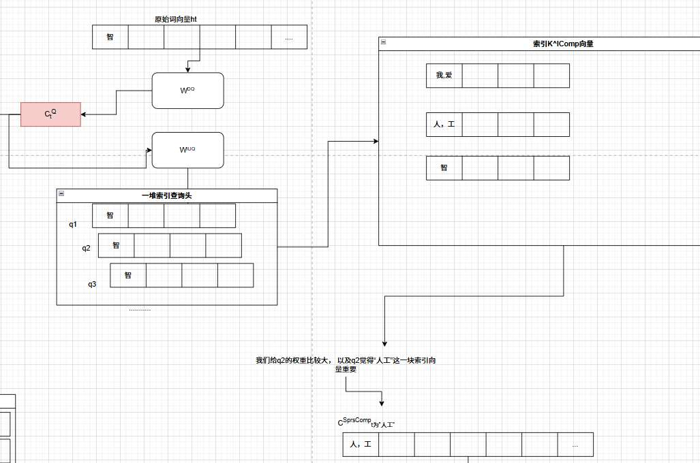

## 精读 

于此，对应推理，我们已经确定出了，“智”这个词向量，最关键的 KV 块，是“人，工”。
我们也将只用这个块来参与计算！

刚才 q 头是索引查询头，只是用来索引的。接下来我们才是生成真正与大 Comp 块做点积的。
$$[q_{t,1}; q_{t,2}; ...; q_{t,n_h}] = q_t = c^Q_t \cdot W^{UQ} \tag{18}$$

V4 又在省参数！我们之前创造索引查询头时，是用下投影矩阵构造出核心意图， **$c^Q_t$  生成核心查询头时，直接复用这个 $c^Q_t$。
拿着这个 $c^Q_t$，通过矩阵 $W^{UQ}$，变幻出 $n_h$ 个真正的、维度为 $c$ 的**核心查询头 $q_t$

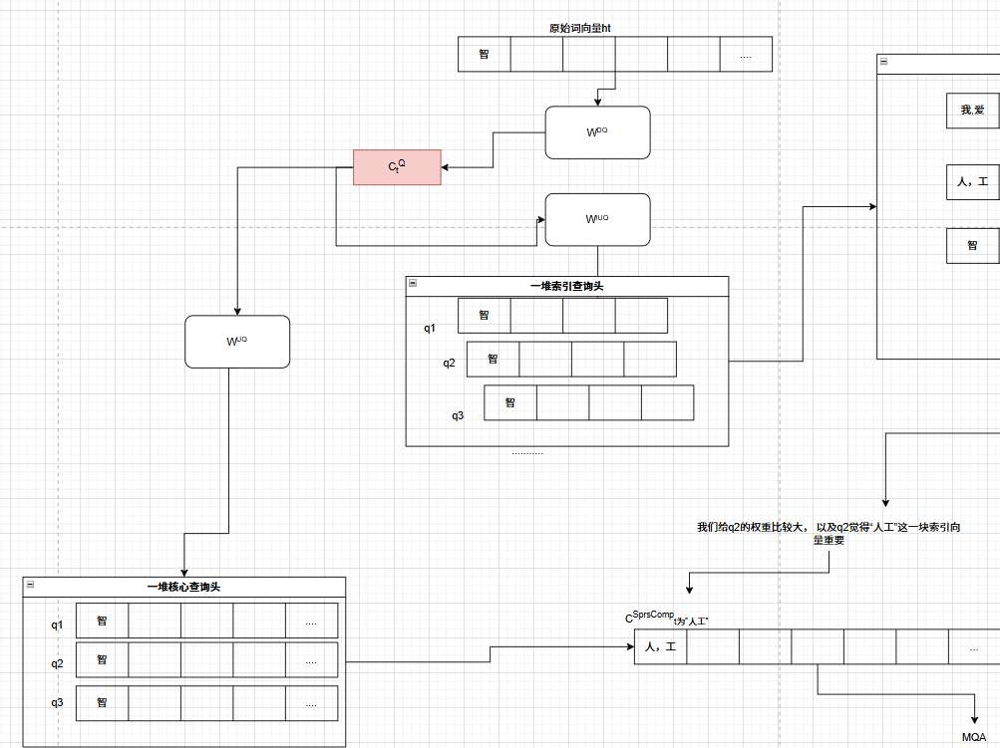

在做注意力点积时，再次强调，v4 没有专门的 K 矩阵 V 矩阵，而是Shared Key-Value（共享 KV）

> “each compressed KV entry in $C^{\text{SprsComp}}_t$ serves as **both** attention key and value.”
> （每一个压缩条目既当 Key，又当 Value）。

 **传统大模型**存一遍 K（用来匹配查算分数），再存一遍 V（用来提取内容）。

V4 又一次很狠地省显存。

来看精读公式：

$$o_{t,i} = \text{CoreAttn} \left( \text{query}=q_{t,i}, \text{key}=C^{\text{SprsComp}}_t, \text{value}=C^{\text{SprsComp}}_t \right) \tag{19}$$

*   **query**: 第 $i$ 个核心精读员（$q_{t,i}$）。
*   **key**: 被挑出来的那个厚 Comb 向量，本例中是“人，工”向量。（充当 K）。
*   **value**: 还是那 Comb 向量（充当 V）。
*   **输出 $o_{t,i}$**：第 $i$ 个头的最终结论。把所有头的结论一综合，这层“Transformer Block”就结束了！

OK，我们知道“智”的 query 头有许多，也有自己的结论（$o_{t,1}, o_{t,2}, ...$），CSA 最后一步是：**把这些结论汇总，变回原来的维度 $d$（用来预测下一个词）

到底如何汇总？

**V4 又又又来省参数啦！**

传统的做法是：把所有头的结果拼接起来，变成一个超级长的向量（维度是 $c \times n_h$），Over。

 在 V4 的设定里，核心头数 $n_h$ 极大（Pro 版本是 128 个头），导致拼接后的 $c \times n_h$ 极其庞大。

如果直接用一个巨大的矩阵把这个超长向量映射回 $d$ 维，这个矩阵乘法的**计算负担会很大**。

V4 设计了一个叫 **Grouped Output Projection（分组输出投影）** 的三步走策略：

* **第一步：分组**
  把 $n_h$ 个头分成 $g$ 个小组（比如 128 个头分成 8 组，每组 16 个头）。
  此时，每组的结果拼接起来，长度是 $c \times \frac{n_h}{g}$。

* **第二步：组内浓缩**
  对每一个小组，用一个小矩阵把它的结果**压缩**到一个中间维度 $d_g$。
  *注意论文里强调的：$d_g < c \times \frac{n_h}{g}$。这是一步**降维**操作。*
  产出：得到 $g$ 个低维的中间结果 $o^{G'}_{t,i}$。

* **第三步：终极汇总**
  把这 $g$ 个精简版的中间结果拼起来（总维度是 $d_g \times g$），最后再统一映射回 $d$ 维，得到最终的注意力输出 $\hat{o}_t$。

**又是一次降维再升维的省参数操作**
如图！

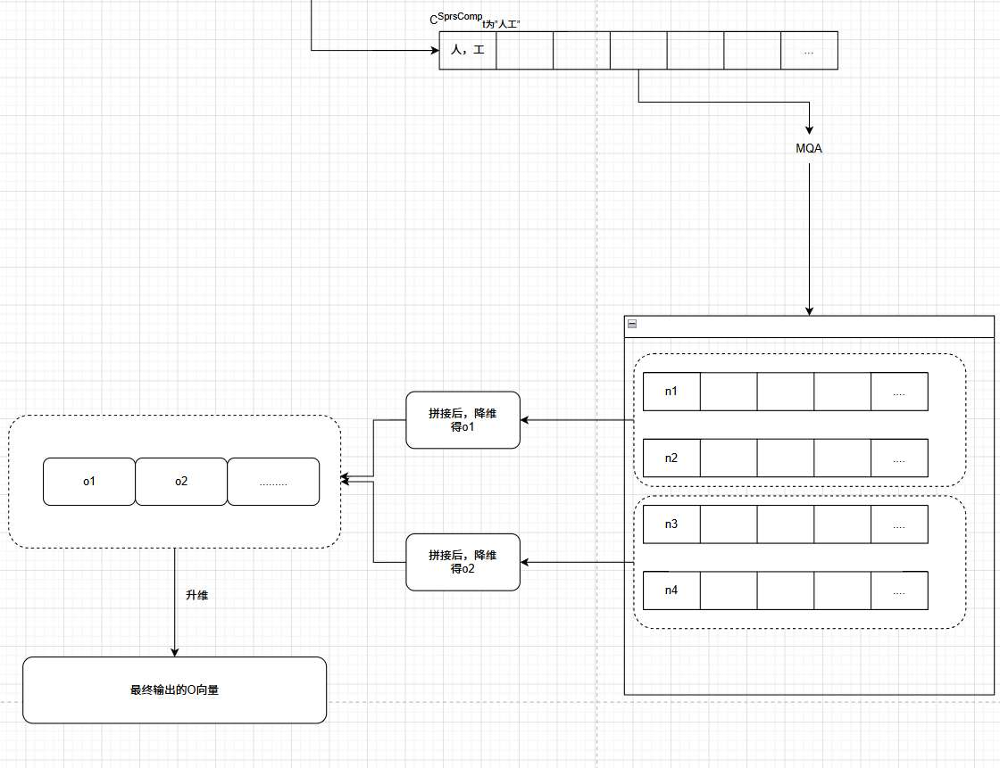

最终输出的 O 向量，就完全是这一层注意力机制的最后一步了！接着，向量再去“思考室（MoE 层）”，并且还要经过好几十层（V4 有 61 层）这样的 Transformer Block，最后由最顶端的分类头吐出“能”字。

至此，CSA所有流程已经结束。
当我们拆解完所有的数学公式后，回头再看 DeepSeek-V4 官方给出的架构图（Figure 3），一切都变得豁然开朗了

我们从左往右看：

最下面的一长条黄色块 `Hidden States of KV Tokens` 是之前的所有词。
向上流经灰色的梯形 `Token-Level Compressor`（这就是公式 11 和 12，里面有 Z 和 B 的重叠压缩）。
变成了 `Compressed KV Entries`，一排 4 个黄格子的厚重压缩向量，也就是文章反复提到的 $C^{\text{Comp}}$。

再把视角拉到下面，

同样是最下面的历史词向量。同样经过一个蓝色的 `Token-Level Compressor`，但这次压缩得更狠。
变成了 `Compressed Indexer Keys`（一排 4 个白格子的薄索引压缩向量)，也就是 $K^{\text{IComp}}$。
可以看到它画得比左边那排明显要“薄”很多，代表维度 $c_I$ 很小。

右下角绿色的 `Hidden State of Query Token`，(类比本例就是当前的新词“智”)。
流向向上变成一个小绿块 `Queries`，这就是浓缩的意图 $c_t^Q$。
这个小绿块向左伸出一条线，变成了 `Indexer Queries`，这就是那一堆低维度的索引查询头 $q^I$。

接下来经过三步：

1.  **算分：** 索引查询头（`Indexer Queries`）和薄索引压缩向量（`Compressed Indexer Keys`）相遇，算出了分数 $I_{t,s}$ 小图表，代表“闪电索引”环节的结果 (`Index Scores`)
2.  **筛选：** 分数传给了左边的 `Top-k Selector`（筛选器）。
3.  **提档：** 筛选器从厚重压缩向量 `Compressed KV Entries` 里，挑出了最相关的那几个包，变成了 `Selected Compressed KV Entries`。

`Selected Compressed KV Entries` 在本例中，就是我们最后选择的“人，工” $C_1^{\text{Comp}}$ 压缩向量。
接着会有个 `Sliding Window KV Entries`，通过 `Concatenation`（拼接），和刚才挑出来的压缩包合在了一起。

这里补充一下， `Sliding Window KV Entries`（滑动窗口 KV）是什么。
大模型在回忆时，虽然大部分历史可以用压缩包，但**刚刚说过的话**（比如最近的 128 个字）是极其重要的，绝对不能压缩！
所以它把最新鲜的、未经压缩的几个词（`Sliding Window KV Entries`），通过 `Concatenation`（拼接），和刚才挑出来的 $C^{\text{Comp}}$ 压缩向量合在了一起。作为**最最最终的 KV 块**。

最后就是**Shared Key-Value Multi-Query Attention**核心精读层，把拼接好的 KV 块（既当做 Key 和 Value），和最右侧一路上来的 `Queries` 核心查询头相遇，进行最终的点积运算，再 **Grouped Output Projection（分组输出投影）**，就完全结束了！

# HCA (Heavily Compressed Attention)

当你了解了 CSA,HCA 就变得尤为简单了。 

我们直接把技术报告的架构图抛出来：

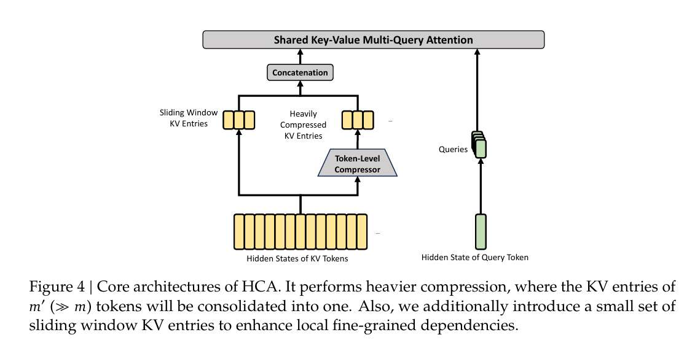

**CSA** 每一个 Comp向量的得到，都要看当前块 + 上一个块（$2m$ 个词），还要词向量原始状态分 $a, b$ 两套矩阵，Z 两个，C 两个

**HCA 根本没有那么繁琐** ，直接生成两个矩阵

> $$C = H \cdot W^{KV} \tag{20}$$
> $$Z = H \cdot W^Z \tag{21}$$

然后把 $m'$ 个词切成一块，**互不重叠**。

接着，HCA 会对每个块内部的 $Z$ 加上位置偏置 $B$，再做 Softmax，得到压缩权重：  
  
$$  
S_{m'i:m'(i+1)-1}  
=  
\text{Softmax}_{row}  
\left(  
Z_{m'i:m'(i+1)-1} + B  
\right)  
\tag{22}  
$$  
  
最后用这个权重去加权混合内容矩阵 $C$：  
  
$$  
C^{\text{Comp}}_i  
=  
\sum_{j=m'i}^{m'(i+1)-1}  
S_j \odot C_j  
\tag{23}  
$$  

为啥HCA 根本不繁琐？

因为HCA 的**压缩率 $m'$ 非常大**（比如 $m'=128$）。

在这么大的压缩率下，图的就是个“**快**”，前 128 个词向量，直接压缩成一个“Heavily COmpressed KV Entries”向量，

不需要什么繁琐的机制。

**CSA** 因为即便压缩了向量还是有很多向量，所以用闪电索引去选 Top-k 个 Comp 向量。
**HCA** 完全没有索引器相关的公式！

因为 $m'$ 太大了，原本 100 万个词现在只剩不到 8000 个包了。
压缩后的序列已经短了很多，所以 HCA 选择保留 dense attention：不再额外做索引筛选，而是直接在高度压缩后的 KV 包上做全量注意力，机制简单开销少。

**CSA** 搞了 $C^a, C^b$ 和 $Z^a, Z^b$。
**HCA** 只有一组 $W^{KV}$ 和 $W^Z$

所以 HCA 就是暴力的压缩，极致的降本。

# 混合注意力

通读下来，我们可以知道

CSA 是仔细略读全文，然后再挑“几页”精读
所以 CSA 更适合在长上下文里找关键细节。  
  
HCA 是在上下文很多时，快速扫全局。 
它把上下文压得非常狠，所以 HCA 更适合提供全局背景，让模型始终知道“整篇文章大概在讲什么”。  

如果只用 CSA，模型会更精细，但索引器和 Top-k 本身也有成本，仍然耗时
如果只用 HCA，模型会更省更快，但局部细节可能被压得太狠。

于是 V4 的架构上交替使用这两种注意力。

根据技术报告 **4.2.1 Model Setups** 章节，DeepSeek-V4 的交替逻辑非常清晰：

#### 1. DeepSeek-V4-Flash (43 层)

- **第 1-2 层**：采用 **Pure Sliding Window（纯滑动窗口）**。

    - 刚进模型时，先感知最近的上下文

- **第 3-43 层**：**CSA 和 HCA 交替（Interleaved Manner）**。

    - 可以近似理解为在后续层中交替安排 CSA 和 HCA，让不同层承担不同粒度的上下文处理任务。

#### 2. DeepSeek-V4-Pro (61 层)

- **第 1-2 层**：采用 **HCA**。

	- 通过 HCA 建立一个宏观的“全局感知”。

- **第 3-61 层**：**CSA 和 HCA 交替**。

既能保留细节，又能控制成本

有些层负责精读，有些层负责粗读。  
有些层负责局部关键片段，有些层负责全局压缩背景

从工程角度看，省了 FLOPs，省了显存。  
从模型行为角度看，训练模型学会“有层次地阅读长文本”，像是一个真正会读书，懂读书方法的人。

# 一点思考

对个人的收获：
- 很通用的设计启发：只要系统里出现了分块、切片、压缩，就要警惕边界损失。所以要**让相邻块之间有重叠，让语义平滑过渡**。Overlap 思想很经典
- 传统 Attention 是当前 Query -> 所有历史 KV，
  CSA 是当前 Query -> 先查索引 -> 找到相关压缩包 -> 再精读这些压缩包，
  RAG 工程是用户问题 -> 向量检索 -> 找到相关文档 -> 放进上下文给模型读，
  这是**把 RAG 放进了 Attention** 啊！**先用便宜的方式定位候选信息，再用昂贵的方式读取候选信息。**
- 自己做过 Agent Memory 的 Toy 项目，除了 Agent 应用层面做记忆管理，Attention 机制也可以做这种思路啊！不过更重要的是，Deepseek 团队能设计得，**让底层计算思路在显卡上跑出来！**
- 我个人在学技术报告的混合注意力后，当画完图，感觉理解了后，觉得很巧妙，很丝滑！但学的时候，又很迷糊。我发现，从迷惑到豁然开朗，是学的过程中，我个人对这些矩阵这些公式赋予了直觉理解。**好的直觉能帮助我们理解设计为什么有效，直觉也能指导我们自己设计技术和架构。希望本文能给大家带来很好的直觉！**

# 附

V4 中，关于注意力机制各参数设置：

| 关键参数               | V4-Flash (284B/13B)     | V4-Pro (1.6T/49B) |
| ------------------ | ----------------------- | ----------------- |
| **隐藏层维度 (d)**      | 4096                    | 7168              |
| **CSA 压缩率 (m)**    | **4** (每 4 词压成 1 个)     | **4**             |
| **HCA 压缩率 (m')**   | **128** (每 128 词压成 1 个) | **128**           |
| **索引头维度 (c_I)**    | 128                     | 128               |
| **核心头维度 (c)**      | 512                     | 512               |
| **注意力的 Top-k**     | 512 (只选 512 个包)         | **1024**          |
| **滑动窗口大小 (n_win)** | 128                     | 128               |

