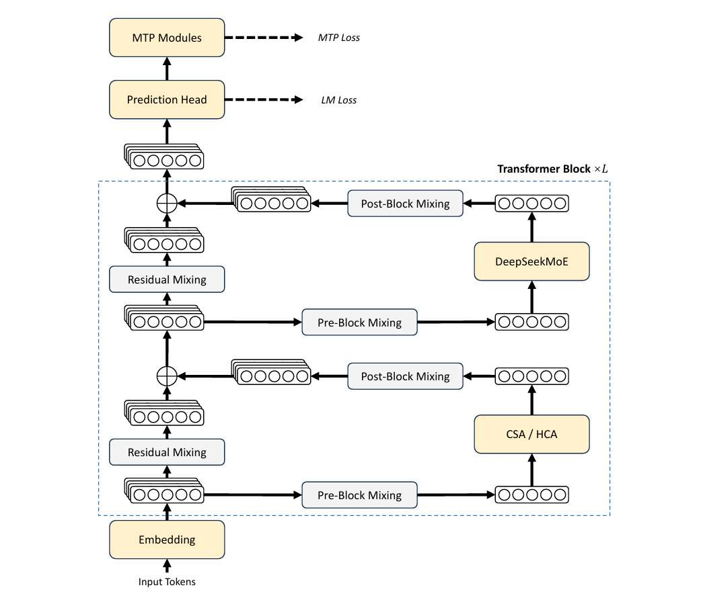
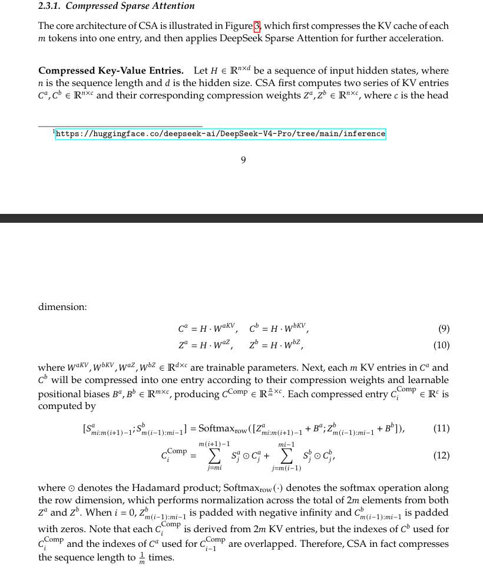
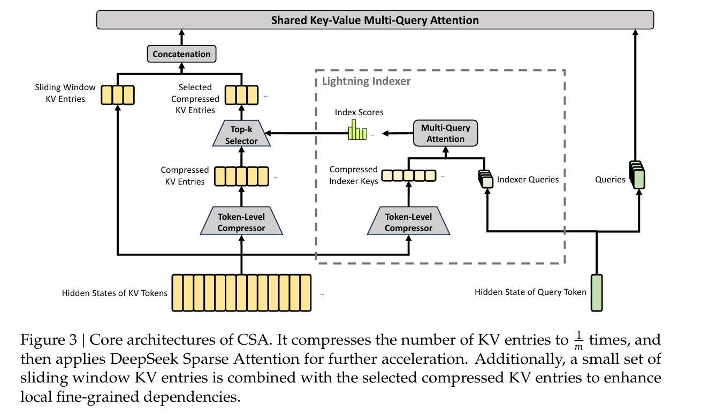

moe 

To enhance long context efficiency, we design a hybrid attention mechanism combining Compressed Sparse Attention (CSA) and Heavily Compressed Attention (HCA). CSA compresses the KV caches along the sequence dimension and then performs DeepSeek Sparse Attention (DSA) (DeepSeek AI, 2025), whereas HCA applies more aggressive compression to the KV caches but keeps dense attention.

传统注意力介绍
稀疏注意力介绍，这个单纯的 sparse 似乎很早很早都有了，

# CSA (Compressed Sparse Attention) = 压缩稀疏注意力介绍，详细介绍，并绘制简图

.  **“where $c$ is the head dimension” 是什么意思？**
    *   在大模型里，隐藏层维度（Hidden Size）通常很大（比如 $d=7168$）。为了让模型同时关注不同的信息，我们会把它拆成很多个“头”（Heads）。
    *   **$c$ 就是每个“头”自己的维度。** 比如有 128 个头，那 $c = 7168 / 128 = 56$。
    *   公式（9）和（10）做的事情，就是把原始的维度 $d$ 映射到一个更精简的维度 $c$ 上。

2.  **你的图画得对吗？**
    *   **完全正确！** 逻辑非常清晰：原始矩阵 $H$（$n$ 行 $d$ 列）乘以权重矩阵 $W$（$d$ 行 $c$ 列），得到四个新矩阵。
    *   **唯一的小细节：** 你的图中写的是 $4 \times c$，实际上这个权重矩阵的行数应该等于词向量的维度 $d$。这步就是把“厚度”为 $d$ 的词向量，通过线性变换，吐出四个“厚度”为 $c$ 的新特征矩阵。

comb

*   **这里的 KV entries 指的是：** 公式 (9) 算出来的 $C^a$ 和 $C^b$。
*   它们是原始词向量 $H$ 投影到 $c$ 维空间后的**“中间态信息”**。
*   你可以理解为：$C^a$ 和 $C^b$ 就是**“还没被压缩的、原始长度的 KV 缓存原材料”**。每一行都代表一个 Token 在这个“头”里的全部特征信息。

---
在传统架构（如 Llama）中：
*   **K (Key)**：像一个标签，用来给 Query 匹配。
*   **V (Value)**：像内页，存的是真正的知识内容。

在 **DeepSeek-V4 的 CSA** 中：
*   **$C$ (Content) 不是单纯的 V**：它包含了可以做 K 的特征，也包含了可以做 V 的特征。
*   **$Z$ (Weight) 也不是单纯的 K**：它是用来决定“谁更有资格被记住”的**内部评分卡**。

**最颠覆的一点是：**
压缩完成后，存在显存里的那个 **$C^{\text{Comp}}$**，它既充当 **Key**，也充当 **Value**。这在学术上叫 **Shared Key-Value**。这种“合二为一”让显存占用再次减半。

### 二、为什么要分 $a$ 和 $b$？（重叠压缩的秘密）

这是你最困惑的地方。为什么公式 (9)(10) 非要搞出 $C^a, C^b$ 和 $Z^a, Z^b$？

**这是为了实现“平滑压缩”，解决“断层问题”。**

#### 1. 设想一种“无重叠”的简单压缩：
假设 $m=4$。我们将 1-4 词压成一号包，5-8 词压成二号包。
*   **问题**：第 4 词和第 5 词在语义上明明是紧挨着的。但在一号包里，4 号词是结尾；在二号包里，5 号词是开头。它们之间的逻辑联系被**一刀切断**了。

#### 2. DeepSeek 的“重叠（Overlap）”解法：
为了让压缩包之间有连贯性，模型规定：**每一个包都要“瞻前顾后”**。
*   **$a$ 代表“当前（Current）”**：也就是本组的 $m$ 个词。
*   **$b$ 代表“先前（Previous）”**：也就是上一组的 $m$ 个词。

所以，公式 (9)(10) 产生四个矩阵是为了：
*   **$C^a, Z^a$**：提取当前这组词的特征和权重。
*   **$C^b, Z^b$**：提取这些词**作为“前序背景”时**的特征和权重（同一个词，作为主角和作为背景时的特征是不一样的）。

### 2. “把 $m$ 个词压成一个” 到底是怎么操作的？

你可以把这个过程想象成**“打包分装”**。

*   **背景：** 假设你的序列全长 $n=100$，压缩率 $m=4$。
*   **动作：** 算法把这 100 个词每 4 个分成一组，一共分成 25 组。
*   **目标：** 对于每一组（4 个词），通过加权求和，最后只吐出 **1 个** 综合向量。
*   **实质：** 这是一种**“池化（Pooling）”**或者**“降采样（Downsampling）”**操作。只不过它不是简单地取平均值，而是通过 $Z$（权重）和 $B$（偏置）来决定这 4 个词里谁的信息该多留一点，谁的该少留一点。

### 3. 为什么偏置 $B^a, B^b \in \mathbb{R}^{m \times c}$？

这是理解“位置感”的关键。

*   **$m$ 的含义：** 代表一个小块里的位置（比如 $m=4$，就有第 1, 2, 3, 4 个位置）。
*   **$c$ 的含义：** 代表特征的维度（厚度）。
*   **为什么要这么大？** 
    当模型把 4 个词压成 1 个词时，它必须知道这 4 个词的**相对顺序**。
    *   “我爱人工智能”里，“我”在第 1 位，“工”在第 4 位。
    *   $B$ 矩阵就像是一个 **“标准模板”**。每一行对应块内的一个位置。
    *   如果没有这个 $B$（$m \times c$），模型在压缩时就会把这 4 个词看成乱序的堆在一起，丢失了最基本的词序信息。
    *   **每一个 $m$ 长度的小块，都共用这一套 $B$ 模板。**

---

### 4. 为什么压缩后的 $C^{\text{Comp}} \in \mathbb{R}^{\frac{n}{m} \times c}$？

这是最终存在显存里的 KV Cache 的形状，也是 V4 效率奇高的数学原因。

*   **$\frac{n}{m}$（序列长度）：** 原本长度是 $n$，因为每 $m$ 个压成了一个，所以总行数变成了 $n/m$。
    *   比如 $n=1,000,000$（百万长度），$m=4$，那么显存里只需要存 $250,000$ 行。**长度直接砍掉 3/4。**
*   **$c$（特征维度）：** 压缩改变的是“长度”，不改变每个条目的“厚度”。这个 $c$ 是为了保证在后面做注意力计算时，Query（查询）还能认得出这些信息。

看公式（11）：
$$[Z^a_{mi:m(i+1)-1} + B^a ; Z^b_{m(i-1):mi-1} + B^b]$$

*   **Z 的本质：** $Z$ 是一个大矩阵（$n \times c$），也就是全序列长度。
*   **切片（Slicing）：** 注意下标 $mi:m(i+1)-1$。它不是取整个 $Z$，而是**只取其中的 $m$ 行**。
*   **维度对齐：** 
    *   切出来的 $Z$ 只有 $m$ 行、$c$ 列（维度是 $m \times c$）。
    *   报告里写了 $B \in \mathbb{R}^{m \times c}$。
    *   **所以：** 它们是两个**形状完全一模一样**的 $m \times c$ 矩阵。对应位置相加，完全合法！

### 2. B 到底是什么？（它不是词向量，它是“位置滤镜”）

你要纠正图中的一个误区：**B 不作用在词向量上，B 作用在“发言权”上。**

*   **Z 是“内容分”：** 它是根据词向量生成的。它代表：这个词**长得像不像**重点？（比如“人工智能”这几个字，本身内容分可能就高）。
*   **B 是“印象分”：** 它是一组**可学习的参数**。它代表：**在这个 $m$ 长度的小坑里，第几个位置通常比较重要？**  
    *   比如 $m=2$。$B$ 的第一行是给坑位 1 的，第二行是给坑位 2 的。
    *   模型可能通过学习发现，每组词的第 1 个词通常是动词，很重要，于是 $B$ 的第一行数值就会被训练得很大。

---

### 3. 拿你的图举例子 ($m=2$)

假设我们现在要浓缩“我”、“爱”这一组词：

1.  **切片 Z：** 我们从巨大的 $Z$ 矩阵里，切出对应“我”和“爱”的两行，得到一个 $2 \times c$ 的小矩阵。
2.  **加上 B：** 
    *   “我”的那行 Z（内容分），加上 $B$ 的第 1 行（位置 1 的印象分）。
    *   “爱”的那行 Z（内容分），加上 $B$ 的第 2 行（位置 2 的印象分）。
3.  **Softmax 生成 S：** 把加完后的结果通过 Softmax，算出最终的**比例系数 $S$**。
    *   比如算出来“我”的权重是 $0.3$，“爱”的权重是 $0.7$。
4.  **合成 C_comp：** 
    *   最后拿 $0.3 \times$ “我”的词向量 + $0.7 \times$ “爱”的词向量。
    *   **这步得到的才是真正的 $C^{\text{Comp}}$。**

**B 矩阵不是词向量，它是一套“位置模板”。**

如果没有 B，模型就会变成“色盲”。它只知道这 m个词里谁长得像重点，但完全不知道谁排在谁前面。加上了 B，模型在浓缩的时候，就既考虑了**“这个词说了什么（Z）”**，也考虑了**“这个词出现在第几位（B）”**。

#### 1. 公式 (11)：算分（谁才是这块内容的核心？）
$$[S^a; S^b] = \text{Softmaxrow}([Z^a + B^a; Z^b + B^b])$$

*   **$Z + B$：** $Z$ 是你之前算出的内容重要性，$B$ 是位置偏置。把它们加起来，代表“内容本身的重要程度”加上“位置带来的权重”。
*   **Softmaxrow：** 这是一个**归一化**操作。它在总共 **$2m$** 个候选词里进行海选。
*   **结果 $S^a$ 和 $S^b$：** 它们就是“权重分数”。比如 $m=2$，总共 $4$ 个词，Softmax 算出来可能是：
    *   上个块的“我”($0.1$)，“爱”($0.1$)；
    *   当前块的“人”($0.5$)，“工”($0.3$)。
    *   这组分数加起来等于 $1$。

#### 2. 公式 (12)：揉捏（合成最终的压缩向量）
$$C_i^{\text{Comp}} = \sum S^a \odot C^a + \sum S^b \odot C^b$$

*   **$\odot$ (对应位置相乘)：** 拿刚才算出来的“发言权” $S$，去乘对应的原始信息 $C$。
*   **$\sum$ (求和)：** 把这 $2m$ 个加权后的向量**全部加在一起**，变成一个 $c$ 维的向量。
*   **结果 $C_i^{\text{Comp}}$：** 这是一个**“高度浓缩的精华”**。它包含了当前块的主干信息，也融合了上一块的背景。

---

### 三、深度理解：为什么要搞这么复杂？（科普文的高级论点）

你可能会问：既然只要 $n/m$ 个包，为什么非要看 $2m$ 个词？

1.  **消除“边界效应”：** 
    普通的压缩（比如 Pooling）像切西瓜，一刀切下去，“爱”和“人”就被切断了。V4 的**重叠压缩**像“渐变色”，每一块都带着前一块的尾巴。这样 Query（查询）在找信息时，不会因为刚好卡在切分点上而断掉逻辑。
    
2.  **动态权重：** 
    传统的压缩是死板的（比如取平均值）。V4 通过 $Z$ 矩阵和 Softmax，实现了**“按需压缩”**。如果这 $4$ 个词里只有“人”重要，压缩包就会几乎全是“人”的特征。

3.  **计算量的极致平衡：**
    虽然压缩时多算了一倍的内容（$2m$），但这个操作只在**存** KV Cache 的时候做一次。后面在长达百万 Token 的**读**（Attention）阶段，模型只需要处理 $n/m$ 的数量，这个开销节省是巨大的。

$$c^Q_t = h_t \cdot W^{DQ}$$

*   **$h_t \in \mathbb{R}^d$**：这是原始的 Query 词向量，很厚（维度 $d$ 为 7168）。
*   **$W^{DQ} \in \mathbb{R}^{d \times d_c}$**：这是一个**下投影（Down-projection）**矩阵。
*   **$c^Q_t \in \mathbb{R}^{d_c}$**：这是压缩后的 Query 向量。

$$q^I_t = c^Q_t \cdot W^{IUQ}$$

*   **$W^{IUQ} \in \mathbb{R}^{d_c \times c_I n^I_h}$**：这是一个**上投影（Up-projection）**矩阵。
*   **$q^I_{t,1}, q^I_{t,2}, ...$**：这是最终生成的 $n^I_h$ 个“索引查询头”。

**物理意义**：
虽然你的意图是“量子力学”，但在不同的维度下，表现是不一样的。有的头关注“作者名字”，有的头关注“出版年份”，有的头关注“书名关键字”。
*   这个公式把浓缩后的意图（$c^Q_t$），重新映射回多个**索引头**空间。
*   **每个头都有自己的分工**，去扫射对应的索引标签。

1.  **参数量骤减**：如果直接从 $d$ 生成所有的查询头，参数量是 $d \times (n \times c_I)$。用了低秩中转，参数量变成了 $(d \times d_c) + (d_c \times n \times c_I)$。在 $d=7168$ 的情况下，这能省下惊人的参数和计算量。
2.  **强制特征融合**：通过强迫信息经过 $d_c$ 这个“瓶颈（Bottleneck）”，模型会学到最本质的搜索特征，过滤掉无用的噪声。

*   **为什么要多头（Multi-head）？**
    如果只有一个头，模型只能从一个维度去找关系。现在的“侦察兵小分队”里：
    *   $q_1$ 可能专门寻找“语法逻辑”（比如前面是主语，我要找谓语）；
    *   $q_2$ 可能专门寻找“特定名词”（比如前面提到了‘人工’，我要找‘智能’）；
    *   $q_3$ 可能关注“情感色彩”或“长程指代”。
*   **公式 (15) 的意义：谁才是今天的主力侦察兵？**
    $$w^I_t = h_t \cdot W_w$$
    这步是给每个头算一个**“信任权重” ($w^I_{t,h}$)**。
    当目前的词是“智”时，模型通过学习发现，这时候 $q_2$（找特定名词的兵）最靠谱，于是给 $q_2$ 的权重 $w$ 很大，给 $q_3$ 的权重很小。

---

### 二、细化时间线：从“智”到“能”的纳米级全过程

现在背景是：显存里已经存好了两个索引标签 $K_1$（我爱）和 $K_2$（人工）。当前的词是“智”（$h_t$）。

#### 1. 侦察阶段（公式 16）
“智”派出小分队去扫射 $K_1$ 和 $K_2$：
*   **计算匹配度**：每个头 $q_h$ 去跟每个标签 $K_s$ 做内积（点乘）。
*   **ReLU 过滤**：把那些完全没关系的（负分）直接变成 0，只留正相关的。
*   **加权总分 ($I_{t,s}$)**：把所有侦察兵的反馈，按照刚才算好的信任权重 $w$ 加起来。
    *   *例子*：经过计算，“智”发现跟 $K_2$（人工）的索引分特别高，跟 $K_1$（我爱）的分数一般。

#### 2. “点名”阶段（Top-k 筛选）
模型根据总分 $I_{t,s}$ 排序。
*   **决策**：大喊一声：“由于我们现在处理的是‘智’，我发现‘人工’那个压缩包最有用！来人，把‘人工’的厚重压缩包 $C_2^{Comp}$ 给我调出来！”
*   **屏蔽**：那个分值较低的 $C_1^{Comp}$（我爱）就被暂时忽略了，**不参与后续计算**。这就省下了大量的算力。

#### 3. 精读阶段（核心注意力计算）
*   **输入**：Query 是“智”，Key/Value 是刚才选中的“人工”压缩包 $C_2^{Comp}$。
*   **计算**：进行真正高精度的注意力机制矩阵运算。
*   **逻辑**：“智”结合“人工”的上下文，得出了结论——下一个概率最大的字是“**能**”。

#### 4. 蹦字与归档
*   **蹦字**：屏幕上跳出“能”。
*   **归档**：因为模型发现“智”和“能”凑够了两个字（$m=2$），档案员立刻启动，把“智能”压成第三个压缩包 $C_3^{Comp}$，并贴上新索引 $K_3^{IComp}$，存入显存。

---

### 三、总结：严谨的逻辑闭环

1.  **公式 (13)(14)**：把“智”变成一队各有特长的侦察兵（Query Heads）。
2.  **公式 (15)**：根据“智”的处境，决定该听哪个侦察兵的（分配权重 $w$）。
3.  **公式 (16)**：侦察兵带回情报，算出每个档案盒的价值分数（Indexer Score $I$）。
4.  **Top-k 筛选**：只拿最有价值的盒子。
5.  **核心 Attention**：算出结果“能”。

#### 1. 公式 (16) 为什么要用 ReLU？
**物理意义：强力过滤杂音，实现“硬稀疏”。**
*   **传统注意力**：通常用点积（Dot-product）后接 Softmax，这会给每个块都分一点点分，哪怕关系很远。
*   **DeepSeek 的 ReLU**：在百万上下文下，绝大多数块都是无关的。
    *   如果点积结果是负数，说明这个块跟当前词“完全没关系”甚至“语义对立”。
    *   **ReLU 直接把负分砍成 0**。
    *   **目的**：让 $I_{t,s}$ 这个总分更具有区分度。只有那些被多个“侦察兵（Head）”都看好的块，分数才会特别高。这能极大提高 **Top-k 选择的准确率**，防止模型被无关的信息带偏。

#### 2. $I_{t,s}$ 就是排序总分吗？
**是的。**
*   $I_{t,s}$ 是一个**标量（一个数字）**，代表了第 $t$ 个词对第 $s$ 个压缩块的“兴趣程度”。
*   模型把所有的 $I_{t,s}$ 排个序，只选前 $k$ 个（公式 17）。这就实现了从“大海（百万 Token）”到“小池塘（512 个块）”的瞬间切换。

#### 3. 搜索和计算的维度区别
你的理解非常精准，这是 CSA 高效的**维度隔离策略**：

*   **搜索阶段（搜索时）**：使用**小维度 $c_I$**。
    *   $q^I$（探照灯）和 $K^{\text{IComp}}$（小标签）都是 $c_I$ 维（非常薄）。
    *   **原因**：快！在百万长度下，低维度计算能让 GPU 的吞吐量飙升。
*   **核心计算阶段（算结果时）**：使用**大维度 $c$**。
    *   Query 跟选中的 Top-k 个 $C^{\text{Comp}}$（厚档案）进行运算。
    *   **原因**：准！最终决定生成什么词，必须使用完整的语义特征（维度 $c$）。

---

### 三、 拆解当前段落：进入真正的“核心精读（Core Attention）”

现在侦察兵已经把 Top-k 个大盒子（$C^{\text{SprsComp}}_t$）搬到桌子上了，接下来怎么算？

#### 1. 重复利用，极致抠门（公式 18）
$$[q_{t,1}; q_{t,2}; ...; q_{t,n_h}] = q_t = c^Q_t \cdot W^{UQ} \tag{18}$$

*   **$c^Q_t$ 是什么？**
    你还记得吗？在生成侦察兵（公式 13）时，我们把“智”这个词压缩成了核心意图 $c^Q_t$（腹稿）。
    **DeepSeek 抠门到了极点：这个腹稿没有扔掉！** 生成核心查询头时，直接复用这个 $c^Q_t$。
*   **$W^{UQ}$（上投影矩阵）**：
    拿着这个腹稿，通过矩阵 $W^{UQ}$，变幻出 $n_h$ 个真正的、维度为 $c$ 的**核心查询头 $q_t$**（精读员）。

#### 2. 极致压缩：Shared Key-Value（共享 KV）
这段话里有一句极其震撼的设定：
> “each compressed KV entry in $C^{\text{SprsComp}}_t$ serves as **both** attention key and value.”
> （每一个压缩条目既当 Key，又当 Value）。

*   **传统大模型**：存一遍 K（用来匹配查算分数），再存一遍 V（用来提取内容）。
*   **DeepSeek-V4**：**我不分 K 和 V 了，它们是同一个矩阵！**
*   当你需要算分的时候，用 $C^{\text{SprsComp}}$ 当 K。
*   当你需要提数据的时候，用 $C^{\text{SprsComp}}$ 当 V。
*   **结果**：显存占用再次**直接砍半**！

---

### 四、 完整的公式 (19)（核心注意力运算）

$$o_{t,i} = \text{CoreAttn} \left( \text{query}=q_{t,i}, \text{key}=C^{\text{SprsComp}}_t, \text{value}=C^{\text{SprsComp}}_t \right) \tag{19}$$

*   **输入参数解释**：
    *   **query**: 第 $i$ 个核心精读员（$q_{t,i}$）。
    *   **key**: 被挑出来的那 512 个厚档案盒（充当 K）。
    *   **value**: 还是那 512 个厚档案盒（充当 V）。
*   **输出 $o_{t,i}$**：第 $i$ 个头的最终结论。把所有头的结论一综合，下一个字“能”就跳出来了！

当所有的核心头（$n_h$ 个）都在“人，工”这个大盒子里算出了自己的结论（$o_{t,1}, o_{t,2}, ...$），大模型的最后一步是：**把这些结论汇总，变回原来的维度 $d$（用来预测下一个词）。**

这段话在讲什么？**它在讲 DeepSeek 是怎么抠门到连最后一步的“汇总汇报”都要省算力的。**

#### 1. 为什么常规做法行不通？（计算量爆炸）
* 传统的做法是：把所有头的结果拼接起来，变成一个超级长的向量（维度是 $c \times n_h$）。
* 在 V4 的设定里，核心头数 $n_h$ 极大（Pro 版本是 128 个头），导致拼接后的 $c \times n_h$ 极其庞大。
* 如果直接用一个巨大的矩阵把这个超长向量映射回 $d$ 维，这个矩阵乘法的**计算负担（Computational Burden）会直接原地爆炸**。

#### 2. V4 的解法：分组降维（瓶颈结构）
DeepSeek 设计了一个叫 **Grouped Output Projection（分组输出投影）** 的三步走策略：

* **第一步：分组（Split）**
  把 $n_h$ 个头分成 $g$ 个小组（比如 128 个头分成 8 组，每组 16 个头）。
  此时，每组的结果拼接起来，长度是 $c \times \frac{n_h}{g}$。

* **第二步：组内浓缩（Intermediate Output）**
  对每一个小组，用一个小矩阵把它的结果**压缩**到一个中间维度 $d_g$。
  *注意论文里强调的：$d_g < c \times \frac{n_h}{g}$。这说明这是一步**降维/瘦身**操作。*
  产出：得到 $g$ 个精简版的中间结果 $o^{G'}_{t,i}$。

* **第三步：终极汇总（Final Projection）**
  把这 $g$ 个精简版的中间结果拼起来（总维度是 $d_g \times g$），最后再统一映射回 $d$ 维，得到最终的注意力输出 $\hat{o}_t$。

# HCA 注意力介绍，详细介绍，并绘制简图，并与 CSA 对比

如果说 **CSA** 是“精密的档案检索系统”，那么 **HCA (Heavily Compressed Attention)** 就是“极简的缩略图概览”。通过对比公式 (20)-(26) 与之前的 CSA 公式，你会发现 HCA 做了以下三处大手术（删减）：

#### 1. 删掉了“重叠（Overlap）”机制 —— 追求极致的速度
*   **CSA 的做法：** 每一个压缩包都要看当前块 + 上一个块（$2m$ 个词），还要分 $a, b$ 两套矩阵。
*   **HCA 的做法：** 公式 (22) (23) 显示，它直接把 $m'$ 个词切成一块，**互不重叠**。
*   **为什么删？** HCA 的压缩率 $m'$ 非常大（比如 $m'=128$）。在这么大的尺度下，那点重叠带来的连贯性已经不重要了，重要的是快。

#### 2. 删掉了“闪电索引器（Lightning Indexer）” —— 不再挑食
*   **CSA 的做法：** 因为即便压缩了包还是多，所以得派侦察兵（Indexer）去选 Top-k。
*   **HCA 的做法：** 完全没有索引器（Indexer）相关的公式！
*   **为什么删？** 因为 $m'$ 太大了（128 倍压缩），原本 100 万个词现在只剩不到 8000 个包了。对于现代 GPU 来说，全量扫一遍这 8000 个包（Dense Attention）比去搞复杂的筛选更快、更稳。

#### 3. 删掉了“双胞胎矩阵（a/b pairs）” —— 降本增效
*   **CSA 的做法：** 搞了 $C^a, C^b$ 和 $Z^a, Z^b$。
*   **HCA 的做法：** 只有一组 $W^{KV}$ 和 $W^Z$（见公式 20, 21）。
*   **为什么删？** 回到了最基础的线性映射，进一步减少了参数量。

---

### 💡 深度总结（你可以写进科普文的对比金句）：

你可以把 V4 的这一套“混合拳法”比喻成人类阅读百万字长篇小说的两种状态：

*   **CSA（压缩稀疏）是“精读模式”**：虽然我不是逐字读，但我做了**带重叠的详细笔记**（Overlap），并且我只翻阅**最相关的章节**（Indexer + Top-k）。它负责搞定逻辑细节。
*   **HCA（重度压缩）是“扫读模式”**：我直接把每一章浓缩成一句话（$m'=128$），完全不纠结边界细节。但我**每一章的浓缩句都会看一遍**（Dense）。它负责搞定全局氛围和宏观走向。

**DeepSeek-V4 的天才之处在于：**
它发现如果全用 CSA，索引还是太累；如果全用 HCA，细节又太模糊。于是它在 61 层网络里**反复横跳（交替使用）**。

*   这一层用 HCA 帮模型维持“大局观”；
*   下一层用 CSA 帮模型锁定“关键证物”。

**数据上的降维打击：**
正是因为 HCA 敢于把 $m'$ 推到 128 甚至更高，才让 V4 的 KV Cache 显存占用直接从 V3.2 的水平**暴跌到了 10%**。

# 讲讲他们单个使用怎么样，然后讲 v4 想到把他们结合在一起不断交替是为什么，

"在 100 万 Token 的场景下，V4 相比上一代 V3.2，**单 Token 计算量（FLOPs）降到了 27%，而显存占用（KV Cache）直接暴降到了 10%！** 如果跟业界最常规的技术（BF16 GQA8）比，显存更是**只有可怜的 2%**"，讲清原因

根据技术报告 **4.2.1 Model Setups** 章节，DeepSeek-V4 的交替逻辑非常清晰：

#### 1. DeepSeek-V4-Flash (43 层)

- **第 1-2 层**：采用 **Pure Sliding Window（纯滑动窗口）**。
    
    - 逻辑：刚进模型时，先感知最近的上下文，不做长程搜索。
        
- **第 3-43 层**：**CSA 和 HCA 交替（Interleaved Manner）**。
    
    - 通常是 1 层 CSA 接 1 层 HCA 这种 1:1 的频率。
        

#### 2. DeepSeek-V4-Pro (61 层)

- **第 1-2 层**：采用 **HCA**。
    
    - 逻辑：大模型一上来先通过 HCA 建立一个宏观的“全局感知”。
        
- **第 3-61 层**：**CSA 和 HCA 交替**。、

|                    |                     |                   |
| ------------------ | ------------------- | ----------------- |
| 关键参数               | V4-Flash (284B/13B) | V4-Pro (1.6T/49B) |
| **隐藏层维度 (d)**      | 4096                | 7168              |
| **CSA 压缩率 (m)**    | **4** (每4词压成1个)     | **4**             |
| **HCA 压缩率 (m')**   | **128** (每128词压成1个) | **128**           |
| **索引头维度 (c_I)**    | 128                 | 128               |
| **核心头维度 (c)**      | 512                 | 512               |
| **注意力的 Top-k**     | 512 (只选512个包)       | **1024**          |
| **滑动窗口大小 (n_win)** | 128                 | 128               |

# 然后再紧接着讲工业上的难度，**为什么全球只有 DeepSeek 在 1.6 万亿（1.6T）参数级别把它们缝合成功了？**

“没法写代码把它在 GPU 上高效跑起来”，这点详细写，

然后写 deepseekv4 设计的 **Mega-Kernel（巨型算子）**，**异构的 KV 缓存系统**

