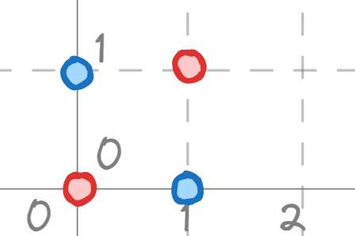
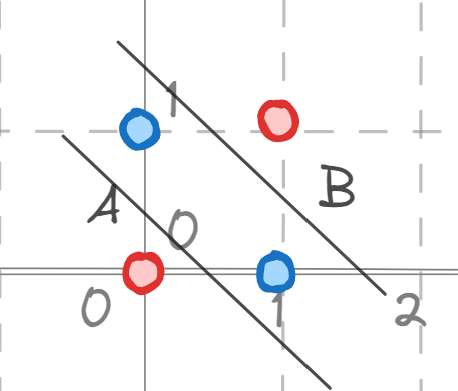
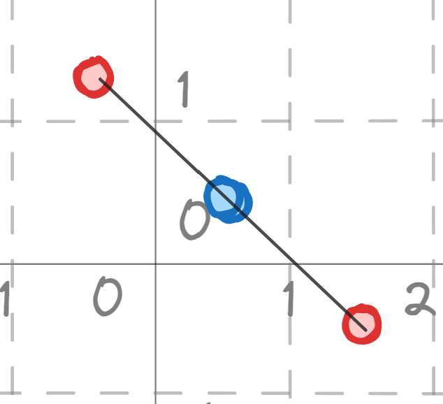
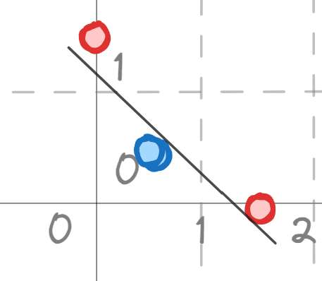
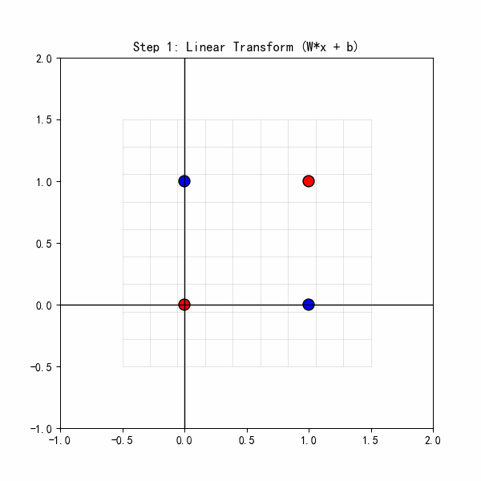
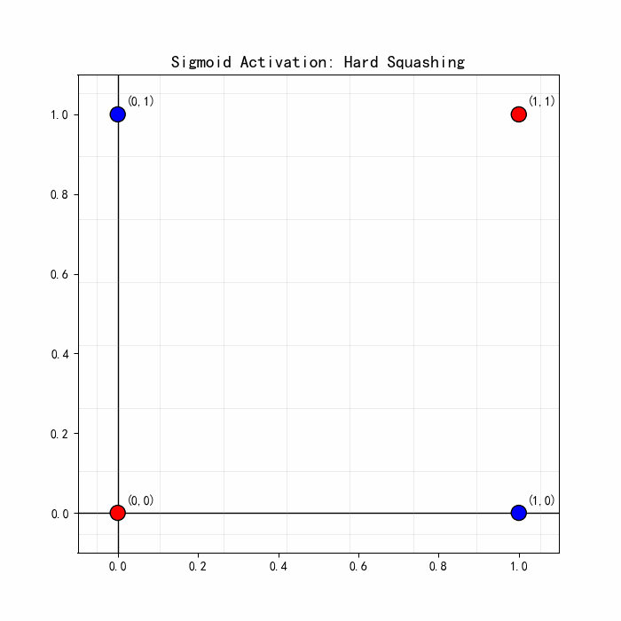
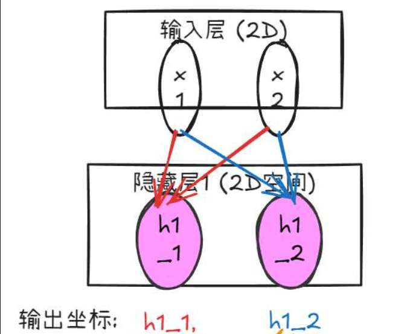
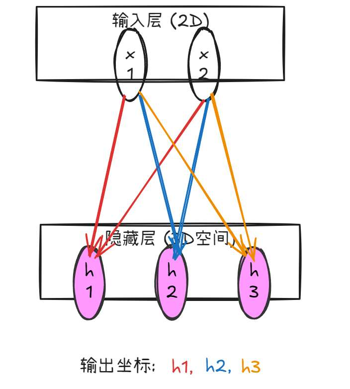
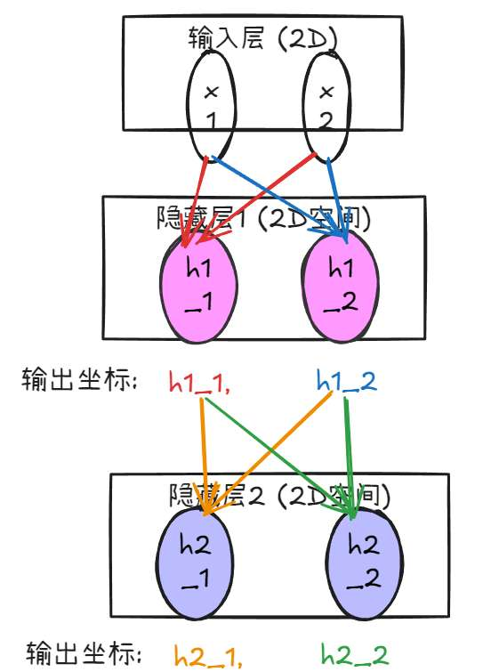

上一个文章讲清了神经网络的原理。

本篇文章，我们先复习一下神经网络的原理，再来亲自搭建一个小的神经网络模型，并感受如何训练。

读完你能收获的：
- 理解如何搭建神经网络模型，关掉文章自己就能尝试
- 反向传播和梯度下降的作用
- 何为“自动微分”
- 收获成功训练小模型的成就感

# 感受神经网络的作用
我们来简单复习一下，

拿上篇文章介绍的异或问题为例。

异或(XOR) 是一个简单的逻辑运算，规则如下：
*   **相同为 0**：(0,0) $\to$ 0, (1,1) $\to$ 0
*   **不同为 1**：(0,1) $\to$ 1, (1,0) $\to$ 1

如果我们将这四个点画在二维平面上（如下图），你会发现：蓝点（0 类）分布在一条对角线上，红点（1 类）分布在另一条对角线上。

如果直接划一条线分开这两类，是做不到的

那我们如何分类？

我们可以如此设计，画两条线，

在线 A 以下的，和线 B以上的，都是红点。
夹在线 A 与线 B 的，是红点。

很容易设置直线参数，一种可以做到的设计是，
A：x+y-0.5
B:   -x-y+1.5  

我们来详细说说这两条线，其实我们是先有“打分函数”
score=x+y-0.5，那么 score=0 时，即 x+y-0.5=0, y=-x+0.5，即为决策分界线。即 A 线，
我们容易看出，越往右上，x+y 会越大，score 会越大且大于 0.
同理可分析，对于 B，越往左下，-x-y 会越大，score 会越大且大于 0

那么，每一个点的坐标，都去转换成 (A, B)，

| **原始点 (x,y)** | **类别** | **A 的值** | **B 的值** | **新坐标 (A,B)**   |
| ------------- | ------ | -------- | -------- | --------------- |
| **(0, 0)**    | 🔴 红点  | -0.5     | 1.5      | **(-0.5, 1.5)** |
| **(1, 1)**    | 🔴 红点  | 1.5      | -0.5     | **(1.5, -0.5)** |
| **(0, 1)**    | 🔵 蓝点  | 0.5      | 0.5      | **(0.5, 0.5)**  |
| **(1, 0)**    | 🔵 蓝点  | 0.5      | 0.5      | **(0.5, 0.5)**  |

诶，我们会发现，虽然刚才我们用自己的理解，能用两条线分辨出蓝点红点，但实际上，如果将真正的 (scoreA, scoreB) 坐标写出来，计算机仍然不能把他分开，蓝点仍然夹在红点中。

$scoreA + scoreB$ 永远等于 $1$ 

有人要问了，那你刚才设计的直线太巧合了？
那我们现在改一下，

- **A:** $x + y - 0.4$
- **B:** $-x - y + 1.5$

我们再次把异或的四个点代入，看看新的坐标 $(A, B)$ 变成了什么：

|**原始点 (x, y)**|**类别**|**A 的值 (x+y−0.4)**|**B 的值 (−x−y+1.5)**|**新坐标 (A, B)**|
|---|---|---|---|---|
|**(0, 0)**|🔴 红点|-0.4|1.5|**(-0.4, 1.5)**|
|**(1, 1)**|🔴 红点|1.6|-0.5|**(1.6, -0.5)**|
|**(0, 1)**|🔵 蓝点|0.6|0.5|**(0.6, 0.5)**|
|**(1, 0)**|🔵 蓝点|0.6|0.5|**(0.6, 0.5)**|

如果我们把 A 和 B 相加：

$$A + B = (x + y - 0.4) + (-x - y + 1.5) = 1.1$$

他们依然在一条线。

那么这个事实，可以用“矩阵变换”的列视角来理解。

我们就拿
A：x+y-0.5
B:   -x-y+1.5  
讲，

实际上，我们做了这样的过程：
(scoreA, scoreB)=W (x, y)+b
W= `[[1,1],[-1,-1]]` ,b= `[-0.5,1.5]`

W (x, y)，是一个线性变换的过程。

> 举一个别的例子，向量 $\begin{pmatrix} x \\ y \\ z \end{pmatrix}$ 是在三维世界的，其基向量 $\hat{i} ,\hat{j} ,\hat{k}$ 分别为 $\begin{pmatrix} 1 \\ 0 \\ 0 \end{pmatrix},\begin{pmatrix} 0 \\ 1 \\ 0 \end{pmatrix},\begin{pmatrix} 0 \\ 0 \\ 1 \end{pmatrix}$ 

> 然而经过矩阵变换，$\begin{pmatrix} 4 \\ 7 \end{pmatrix}$ 变成了$\text{New } \hat{i}$ 
其余同理，

> 那么我们的向量也跟随基向量的改变而改变：
$$x \cdot (\text{New } \hat{i}) + y \cdot (\text{New } \hat{j})+z\cdot(\text{New }\hat{k})=\text{Output}$$

> $$ 1 \cdot \begin{pmatrix} 4 \\ 7 \end{pmatrix} + 2 \cdot \begin{pmatrix} 5 \\ 8 \end{pmatrix} + 3 \cdot \begin{pmatrix} 6 \\ 9 \end{pmatrix} = \begin{pmatrix} 32 \\ 50 \end{pmatrix} $$

> 结果向量 $\begin{pmatrix} 32 \\ 50 \end{pmatrix}$ 其实是矩阵三列向量的**线性组合**

既然是线性变换，无论怎样，当前空间的点相对位置都不变的！
b 是怎样也无所谓，因为 b 只是让所有点平移。

所以无论怎样线性变换，都是无法把红蓝分离出来的。

那怎么办呢？

我们回过头想想，我们当初到底怎么理解“两条线”分类的，
其实我们的脑子并没有什么 score 的计算，
只是“夹在一起”的是蓝点，其余是红点。

夹在一起，其实在说，坐标是 (正，0) 或 (0，正)

恰巧的是，刚好有一种函数，ReLU，
能表示这种“自然语言”

他能将"负数"压缩。
ReLU 的规则非常简单：**负数直接变 0，正数保持不变** 

$$f(x)=max⁡(0,x)$$

我们之前算的是
$(-0.5, 1.5)$、$(0.5, 0.5)$、$(1.5, -0.5)$。

我们加入 ReLU 了呢，

|**新坐标 (A,B)**|**经过 ReLU 魔法 (负数变0)**|**魔法后的最终坐标**|**类别**|
|---|---|---|---|
|(-0.5, 1.5)|ReLU(-0.5), ReLU(1.5)|**(0, 1.5)**|🔴 红点|
|(1.5, -0.5)|ReLU(1.5), ReLU(-0.5)|**(1.5, 0)**|🔴 红点|
|(0.5, 0.5)|ReLU(0.5), ReLU(0.5)|**(0.5, 0.5)**|🔵 蓝点|

终于，现在，蓝点在 $(0.5, 0.5)$，而两个红点：$(0, 1.5)$ 和 $(1.5, 0)$。

我们完全可以分类了！

那这点在空间如何解释呢
其实 ReLU 做的就是一次“非线性变换”。
它折叠了空间，
来看这个动图：两个红点被“折叠”到了坐标轴上

与不加 ReLu 的结果图比较：
没折叠：在一条线

折叠：不在一条线，可分类。

那么这种让红点“折叠”的非线性变换，是非线性函数 ReLU 引起的，我们叫做“激活函数”。

有许多激活函数可以实现非线性变换，如使用 sigmoid 函数,
Sigmoid 的规则是：**把所有数挤进 $(0, 1)$ 之间** ($f(x) = \frac{1}{1 + e^{-x}}$)。
为了让视觉效果更明显，我们在动图中将参数放大了 4 倍（即 $Z \times 4$），以下是对应坐标：

| 原始点 $(x, y)$ | 类别    | 放大后的 $Z$  | **Sigmoid 转换后坐标**  | 变换效果说明 |
| :----------- | :---- | :-------- | :----------------- | :----- |
| $(0, 0)$     | 🔴 红点 | $(-2, 6)$ | **$(0.12, 0.99)$** | 被挤向左上角 |
| $(1, 1)$     | 🔴 红点 | $(6, -2)$ | **$(0.99, 0.12)$** | 被挤向右下角 |
| $(0, 1)$     | 🔵 蓝点 | $(2, 2)$  | **$(0.88, 0.88)$** | 被推向右上角 |
| $(1, 0)$     | 🔵 蓝点 | $(2, 2)$  | **$(0.88, 0.88)$** | 被推向右上角 |

以上，我们很轻松的看到，普通的线性函数+非线性函数（激活函数），就能肆意地改变数据的位置，从而达到我们想要的分类效果。

在上面的例子中，我们是将原本二维的数据映射为了二维。
$(x1, x2)-->(h1, h2)$

具体是怎样映射的呢？
其实是对 $(x_1, x_2)$ 分别执行了**两次不同**的变换规则：

*   **计算新坐标的横轴 $h_1$：** 激活函数 ( 第一组权重 $\times (x_1, x_2)$ + 第一组平移偏置 )
*   **计算新坐标的纵轴 $h_2$：** 激活函数 ( 第二组权重 $\times (x_1, x_2)$ + 第二组平移偏置 )

代入我们刚才画动图的具体数值，这两行计算过程写出来就是：
$$h_1 = \text{ReLU}(\mathbf{1} \cdot x_1 + \mathbf{1} \cdot x_2 - 0.5)$$
$$h_2 = \text{ReLU}(\mathbf{-1} \cdot x_1 + \mathbf{-1} \cdot x_2 + 1.5)$$
（我们之前定义的是 A：x+y-0.5；B:   -x-y+1.5  ）

如果每次都要这么一行一行写公式，一旦以后维度变成了几百几千（比如一张图片的像素），那就没法写了。

所以我们再引入表达方式：**画图** 和 **矩阵**。

首先来看，如何画成“神经网络图”
仔细看上面的公式，你会发现：$h_1$ 的计算同时用到了 $x_1$ 和 $x_2$；$h_2$ 的计算也同时用到了 $x_1$ 和 $x_2$。
如果我们把变量画成圆圈，把“乘以权重”画成连线，这就构成了一幅图：

*   看图上的 **红线**，它代表第一行公式：$x_1$ 和 $x_2$ 的数据顺着红线流向了 $h_1$，在 $h_1$ 这个圆圈里完成了相加和 ReLU 激活。
*   同理，图上的 **蓝线**，代表第二行公式：数据顺着蓝线流向了 $h_2$。

在这个图里，每一个接收数据、进行线性计算并激活的圆圈（比如粉色的 $h_1$ 和 $h_2$），我们就起个叫做“神经元（Neuron）**。

几个神经元排成一排，就叫一个“层（Layer）”**。

**这一个个神经元与权重连线，像一张“网”一样，可以理解为这就是神经网络名字的由来**

图画出来虽然好看，但这只是辅助我们理解数据的流动，只是一个公式的可视化。
而对流动下的几何变化，我们还是不太能感受到。

那么引入矩阵，就好处多多了。

 $x_1$ 和 $x_2$ 是共用的输入，我们把上面公式里的“第一组权重”**和**“第二组权重”**拼成一个大矩阵 $W$：

$$ \begin{pmatrix} h_1 \\ h_2 \end{pmatrix} = \text{ReLU} \left( \begin{pmatrix} 1 & 1 \\ -1 & -1 \end{pmatrix} \begin{pmatrix} x_1 \\ x_2 \end{pmatrix} + \begin{pmatrix} -0.5 \\ 1.5 \end{pmatrix} \right) $$
也就是大家最常看到的公式： **$H = \text{Activation}(W \cdot X + b)$**

这样既让我们可以以矩阵视角，即空间变换视角理解数据
（有了矩阵就可以如图理解公式）
	

也便于计算机一次性、批量地计算。

我们继续用空间变换视角理解神经网络，
刚才是把 $(x_1, x_2)$ 映射到 $( h_1,h_2)$，是二维到二维的空间变换。

我们完全可以设置三个神经元，

用空间变换理解，是将二维数据映射到三维。
这样更容易线性可分了。

此时我们是，一层神经元，每一层 3 个。

如果是**俩层神经元**！每一层俩个会是怎样？

那就是 $(x_1, x_2)$ 映射到 $(h^{(1)}_1, h^{(1)}_2)$，   $(h^{(1)}_1, h^{(1)}_2)$ 又映射到 $(h^{(2)}_1, h^{(2)}_2)$

可以看到，我们颇有“设置”神经元的感觉，

共有**俩种**设置的方法
- **加宽度：增加神经元数量**：如果我们一层放 3 个神经元，那就相当于把二维数据“升维”到了三维空间 $(h_1, h_2, h_3)$ 里。
- **加深度（增加层数）**：如果堆叠两层神经元呢
    - 第一层先把数据 $(x_1, x_2)$ 映射到 $(h^{(1)}_1, h^{(1)}_2)$。
    - 第二层再基于 $(h^{(1)}_1, h^{(1)}_2)$ 继续在二维空间映射成 $(h^{(2)}_1, h^{(2)}_2)$。

以上，神经网络的原理和作用已经非常明显。
它基于线性变换+非线性变换，来改变数据的位置，相对关系
通过设置宽度/深度，调整变换的程度。

在实际任务中，我们的初始数据大概率不是刚才 $(x_1, x_2)$ 的二维，而是如图片 $32 \times 32 = 1024$ 个像素点，一个 **$1024$ 维的向量** 。

我们可能会设置几百个神经元，再多设置几层，让数据不断变换，直至变换到一定数据关系，方便我们使用。
（上篇文章我介绍过，这叫“解开流形”。和上文举的异或问题原理没有区别）

# 亲手建立神经网络

但是，细心的读者可能发现了，刚才我们演示空间折叠时，那些权重 $W$ 的值（比如 1 和 -1）是我们提前算好展示给你的。
真实场景下，成千上万个参数，我们不可能手动去调。我们必须要让计算机自己摸索，得到这些能能成功变换数据到我们满意的参数。

这个“自己摸索”的过程，就是深度学习最核心的部分——**模型训练**。

接下来，我们就亲手用代码搭一个网络，看看它是如何通过**梯度下降**和**反向传播**，一步步把瞎猜的数字，变成完美的分类边界的！

