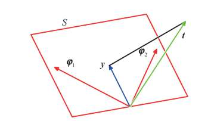
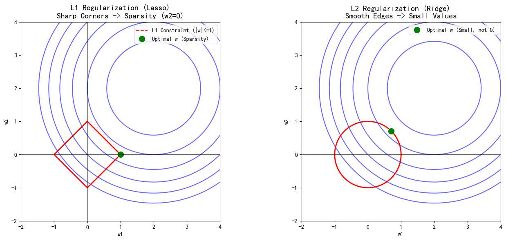

对于线性机器学习模型，

每个模型都有自己的名字、规则和适用场景，知识是零散且易忘的。

然而用概率视角，就抓住了模型的本质。

线性模型在这里的定义，不是 $W^TX$ 而是 $W^T \phi(X)$

线性模型数学形式： $$ y(x, w) = w_0 + w_1 \phi_1(x) + \dots + w_M \phi_M(x) = w_0 + \sum_{j=1}^{M-1} w_j \phi_j(x) =\mathbf{w}^T \boldsymbol{\phi}(x) $$
这里的 $\phi(x)$ 被称为**基函数**。
*   它可以是多项式（如 $x^2$）；
*   可以是高斯函数；
*   可以是 Sigmoid 函数。

“线性”是对X的特征的线性组合，同时因为有偏置项的存在，定义的时候写 $\sum_{j=0}^{M-1}$ 。

我们可以因为特征提取而使得这个函数y 是输入向量x的非线性函数，
所以线性模型这个定义，是因为整个函数对于w来说是线性的！

比如线性模型构造多项式特征时就已经不是关于 x 的线性模型了，这个函数的图像也是“曲线”但仍然叫线性模型。

# 线性回归
## 建立概率模型
我们假设：**观测值 = 理想模型的预测值 + 噪声**

 $t$ 是我们在数据集中看到的真实标签。
 $y(x, \mathbf{w})$ 是我们要寻找的理想函数。
 
我们知道的就是t 也知道那个误差是高斯 我们通过这俩个已知条件去反推最理想的那个y函数

$t=y(W,X)+\epsilon$  

通常假设这个噪声 $\epsilon$ 服从**高斯分布**，均值为 0，精度为 $\beta$（注：精度 $\beta = 1/\sigma^2$，方差的倒数）。

既然 $\epsilon$ 是高斯的，而 $y(x, \mathbf{w})$ 对于某个确定的 $x$ 来说是一个常数，那么目标值 $t$ 自然也服从高斯分布，其均值就是模型的预测值：

$$ p(t | x, \mathbf{w}, \beta) = \mathcal{N}(t | y(x, \mathbf{w}), \beta^{-1}) $$

具体的：

$$ p(t | \mathbf{x}, \mathbf{w}, \beta) = \sqrt{\frac{\beta}{2\pi}} \exp\left\{ -\frac{\beta}{2} \big( t - \underbrace{\mathbf{w}^T \boldsymbol{\phi}(\mathbf{x})}_{y(\mathbf{x}, \mathbf{w})} \big)^2 \right\} $$

## 最大似然估计

现在我们有一组数据集，包含 $N$ 个独立的样本。我们的目标是找到一组最优的参数 $\mathbf{w}$，使得这组参数下出现当前观测数据的概率最大。这就是**最大似然估计**的思想。

由于样本是独立的，整体的似然函数就是每个样本概率的乘积：
$$ p(\mathbf{t} | \mathbf{X}, \mathbf{w}, \beta) = \prod_{n=1}^{N} \mathcal{N}(t_n | \mathbf{w}^T \boldsymbol{\phi}(x_n), \beta^{-1}) $$

为了方便计算（将乘积转化为求和），我们对两边取对数（Log-Likelihood）。取对数后，指数函数抵消，乘号变加号，我们得到：

$$ \ln p(\mathbf{t} | \mathbf{w}, \beta) = \frac{N}{2} \ln \beta - \frac{N}{2} \ln(2\pi) - \beta \underbrace{\frac{1}{2}\sum_{n=1}^{N} \{t_n - \mathbf{w}^T \boldsymbol{\phi}(x_n)\}^2}_{E_D(\mathbf{w})} $$

我们要**最大化**这个对数似然函数。

*   第一项 $\frac{N}{2} \ln \beta$ 和第二项 $\frac{N}{2} \ln(2\pi)$ 与参数 $\mathbf{w}$ 无关，求导时为 0，可以忽略。
*   第三项前面有一个负号。

因此，**最大化似然函数（Likelihood），在数学上等价于最小化后面那个求和项**：
$$ \frac{1}{2}\sum_{n=1}^{N} \{t_n - \mathbf{w}^T \boldsymbol{\phi}(x_n)\}^2 $$

这正是我们熟悉的**平方和误差函数**

所谓“最小二乘法”，“二乘”指的就算这个平方，我们要让他最小

PRML 通过这一推导告诉我们：**我们在工程上直觉使用的“最小二乘法”，本质上就是假设噪声服从高斯分布后的“最大似然估计”。**

有了这个误差函数，剩下的就是微积分运算了。将梯度设为 0，即可求出 $\mathbf{w}$ 的解析解：
$$ \mathbf{w}_{\text{ML}} = (\boldsymbol{\Phi}^T \boldsymbol{\Phi})^{-1} \boldsymbol{\Phi}^T \mathbf{t} $$
正常求解其实还是蛮麻烦的，下面给出一个附加的‘几何解释’，配图来自《PRML》
### 附加解释：几何视角

我们引入“样本空间“的概念。

假设有 100 个样本（$N=100$），那我们就有**100 维（$N$ 维）** 的空间
在这个空间里，**每一个坐标轴代表一个样本**（第 1 个样本轴、第 2 个样本轴……第 100 个样本轴）。

如果我们如此构造空间，那么
目标向量 t，是把所有 100 个真实房价连起来形成的一个列向量 $\mathbf{t} = [t_1, t_2, \dots, t_N]^T$。
在这个 100 维空间里，它是一个固定的点（向量）。

假设我们的特征是俩个，所以我们需要
基函数向量 $\boldsymbol{\varphi}_1, \boldsymbol{\varphi}_2$。
显然，他们也是俩个 100 维的向量。
如果有截距项，还有一个全为 1 的向量 $\boldsymbol{\varphi}_0$

图中的那个平面 $S$（红色区域），是由特征向量 $\boldsymbol{\varphi}$ 张成的**子空间**。

我们的线性模型公式是 $y = w_1 \phi_1 + w_2 \phi_2$。
即：**预测向量 $\mathbf{y}$ 是特征向量 $\boldsymbol{\varphi}_1$ 和 $\boldsymbol{\varphi}_2$ 的线性组合。**

所以随着参数 $w$ 的变化，**预测值 $\mathbf{y}$ 在这个平面 $S$ 上变化**

现在问题变成了纯几何问题：
*   **已知：** 真实值 $\mathbf{t}$ 悬浮在平面 $S$ 的外面（因为现实总有噪声，不可能完美拟合）。
*   **限制：** 预测值 $\mathbf{y}$ 必须在平面 $S$ 上。
*   **目标：** 我们要调节 $w$（也就是调节 $\mathbf{y}$ 在平面上的位置），让 $\mathbf{y}$ 离 $\mathbf{t}$ 最近。

点到平面，怎么走距离最短？**垂线段最短。**

所以，**最优的预测值 $\mathbf{y}$，就是真实值 $\mathbf{t}$ 在平面 $S$ 上的正交投影（影子）**

即图中黑色直线垂直于平面 $S$ 的含义。这条黑线，就是最小的误差。

**这个几何解释直接推导出了解析解。**

既然是最短距离（投影），那么**误差向量**（即 $\mathbf{t} - \mathbf{y}$）必须**垂直**于平面 $S$。
垂直在数学上意味着**内积为 0**。

所以，误差向量必须垂直于平面上的所有基向量 $\boldsymbol{\varphi}$：
$$ \boldsymbol{\varphi}^T (\mathbf{t} - \mathbf{y}) = 0 $$

把 $\mathbf{y} = \boldsymbol{\Phi}\mathbf{w}$ 带进去：
$$ \boldsymbol{\Phi}^T (\mathbf{t} - \boldsymbol{\Phi}\mathbf{w}) = 0 $$

移项整理：
$$ \boldsymbol{\Phi}^T \mathbf{t} = \boldsymbol{\Phi}^T \boldsymbol{\Phi} \mathbf{w} $$
$$ \mathbf{w} = (\boldsymbol{\Phi}^T \boldsymbol{\Phi})^{-1} \boldsymbol{\Phi}^T \mathbf{t} $$

**所谓的“最小化误差平方”，本质上就是去找一个垂直投影。**

## 正则化
我们在训练时如果模型复杂度够，想让模型完全拟合数据（不加任何限制的情况下）  那就会出现有 w 特别大，

为什么？
假如数据里有一些噪声点（比如有一个点本来是 (1,2)，但不小心观察成了 (1, 100)）。
如果你非要模型把这个 (1, 100) 也拟合准（过拟合），模型就不能用简单的 $2x$ 了，它得用高阶多项式扭曲过去，比如：
$$ y = 1000x - 999x^2 + 500x^3 ... $$
为了去够那个离谱的噪声点，模型需要用**巨大的正系数**（向上拉）和**巨大的负系数**（向下拉）相互抵消，造出剧烈的波动来恰巧经过那个点。

即只有参数 $w$ 巨大且正负剧烈交替时，函数曲线才能产生剧烈的震荡（过拟合的特征）。

这种巨大的权重带来的后果是**高方差**：输入数据 $x$ 的微小变化（比如测量误差），乘以巨大的权重 $w$ 后，会被放大成预测结果 $y$ 的剧烈波动。这就是模型泛化能力差的本质。

一般我们给代价函数加上关于权重 w 的式子，以便抑制 w 过大。

我们在原始代价函数 $E_D(\mathbf{w})$ 后面加上一个惩罚项 $E_W(\mathbf{w})$，构成总的目标函数：
$$ E(\mathbf{w}) = E_D(\mathbf{w}) + \lambda E_W(\mathbf{w}) $$

我们有俩种做法。

| 特性       | **L1 正则化 (Lasso)**            | **L2 正则化 (Ridge / Weight Decay)** |
| :------- | :---------------------------- | :-------------------------------- |
| **公式项**  | $\lambda \sum w_i$ (权重的绝对值之和) | $\lambda \sum w_i^2$ (权重的平方和)     |
| **效果**   | 能把某些不重要的特征权重 $w$ **直接变为 0**。  | 让权重 $w$ **趋近于 0，但不会等于 0**，比较平滑。   |
| **应用场景** | **特征选择** 。抛弃掉一些特征             | **防止过拟合**。大部分情况下默认用 L2。           |
| **求导难度** | 在 0 处不可导 (用次梯度)，解起来稍微麻烦。      | 处处可导，方便计算。                        |

为啥 L1 的话，模型会自发的去掉 w？

对 $|w|$ 求导，只要 $w \neq 0$，梯度就是 $1$ 或 $-1$。这意味着，不管 $w$ 当前是 100 还是 0.0001，正则项都会施加同等力度的惩罚。
L1 的惩罚力度**永远是常数 1**。
坚定地把它推向 0 ，直到彻底变成 0 为止

L2 呢？它倾向于让所有特征的权重都比较小且均衡，而不是让模型仅仅依赖于某一个特征。仍然用梯度下降解释
**L2 求导：** $(w^2)' = 2w$。
当 $w$ 变小（比如 0.001）时，惩罚力度 $2w$ 也就变成了 0.002。
在 0 附近，L2 的惩罚力度几乎消失，在这个微小的范围内，主要由数据误差项主导，所以权重会保留一个非零的极小值。

### 附加解释：几何视角

蓝色圈是**损失函数 (MSE)** 的等高线。 
图里其实有无数个等高线即无数个蓝色圈
圆心是损失函数最低的地方坐标为 `（最优的w1，最优的w2）` 

==所以这里我们是举了一个，变量是二维的例子。==
假设你要预测房价。
    *   特征 1 ($x_1$)：房子的面积。
    *   特征 2 ($x_2$)：卧室的数量。
    *   模型公式：$y = \mathbf{w_1} \cdot x_1 + \mathbf{w_2} \cdot x_2 + b$
    *   **图里的坐标轴：** 横轴就是 $\mathbf{w_1}$（面积的权重），纵轴就是 $\mathbf{w_2}$（卧室数的权重）。
仍然是我们的公式 $W^T X+b$  W、X 都是向量包含了多个变量。 

红色的线
**L2 正则化:** $w_1^2 + w_2^2 \le 1$。右图
	这就是初中数学的**圆**方程。所以右图是红色的圆。

 **L1 正则化:** $|w_1| + |w_2| \le 1$。左图 
*   我们在第一象限（$w_1>0, w_2>0$）时，它是 $w_1 + w_2 = 1$（一条斜线）。
*   在第二象限（$w_1<0, w_2>0$）时，它是 $-w_1 + w_2 = 1$（另一条斜线）。
*   四个象限的四条线连起来，就变成了一个**菱形**。

我们在梯度下降的过程，就会有意把最终的解，推向红色线里。

举个例子，假设我们真的很巧，当前模型参数一下子就落到了圆心，即最优解， 
那么我们目标函数是否为 0？ 不是！因为有正则化。于是它还是要变
往哪变？往红色线区域靠近
具体速率刚才说过，L1 是 1  L2 是 2w   
那么再靠近的过程中，  
- 对于 L1  最先靠近到红线区域的坐标，是尖角！因为我们这个靠近过程，可以理解为在蓝圈上跳跃，扩散，从其他地方扩散。想象这个扩散过程，这个图像切点，正是尖角。尖角意味着什么？ 有某个特征，变为了 0！这就是为什么 L1 是用来扔特征的
- 对于 L2  最先靠近到红线区域的坐标，就是正常的圆的某个点。这个图像比较圆润。所以说 L2 较为温和它让所有特征“均匀得小” 

刚才解释了正则化的效果，现在再解释下正则化怎么来的，凭什么我们就加 w 方或 w，怎么不加其他形式？

回到概率论视角，
我们是最大似然推出的最小二乘，
这实际是“概率学派”，MLE
MLE 认为 $w$ 是个固定参数。

容易陷入什么陷阱呢？
比如连续 5 次硬币，都正面，概率学派，MLE 就会认定硬币正面的概率是 100%。
但我们都知道这只是因为太巧了。

贝叶斯学派认为 **$w$ 除了有经验，还要有先验。即我们自己的偏见

贝叶斯公式

公式：**后验 (Posterior) $\propto$ 似然 (Likelihood) $\times$ 先验 (Prior)**
$$ P(w|y, x) \propto P(y|x; w) \cdot P(w) $$

其实这个似然，就是刚才，上一步所说的，高斯函数。

所以，我们就是在这个基础上，再加一个我们对“w”的先验，

即纵使啥数据没有，我认为 w 应该服从什么分布，应该长什么样子。

我们要最大化后验概率 (MAP)。取对数后：
$$ \text{Maximize } \underbrace{\log P(y|x; w)}_{\text{MSE部分}} + \underbrace{\log P(w)}_{\text{先验部分}} $$
也就是：
$$ \text{Minimize } \text{MSE} - \log P(w) $$

1.  **推导 L2 正则化 (Ridge)：**
    *   假设参数 $w$ 的先验分布是 **高斯分布 (Gaussian)** $w \sim N(0, \tau^2)$。
    *   即 $P(w) \propto \exp(-w^2)$。
    *   那么 $- \log P(w) \propto w^2$。
    *   **结论：MSE + $w^2$ $\Rightarrow$ L2 正则化。**

2.  **推导 L1 正则化 (Lasso)：**
    *   假设参数 $w$ 的先验分布是 **拉普拉斯分布 (Laplace)** $w \sim \text{Laplace}(0, b)$。
    *   即 $P(w) \propto \exp(-|w|)$ （拉普拉斯分布是尖顶的）。
    *   那么 $- \log P(w) \propto |w|$。
    *   **结论：MSE + $|w|$ $\Rightarrow$ L1 正则化。**

故而

**误差：** 噪声是高斯分布 $\rightarrow$ 导出 MSE。
**正则化：**
*   参数 $w$ 先验是 **高斯分布** $\rightarrow$ 导出 **L2 (平方)**。
*   参数 $w$ 先验是 **拉普拉斯分布** $\rightarrow$ 导出 **L1 (绝对值)**

