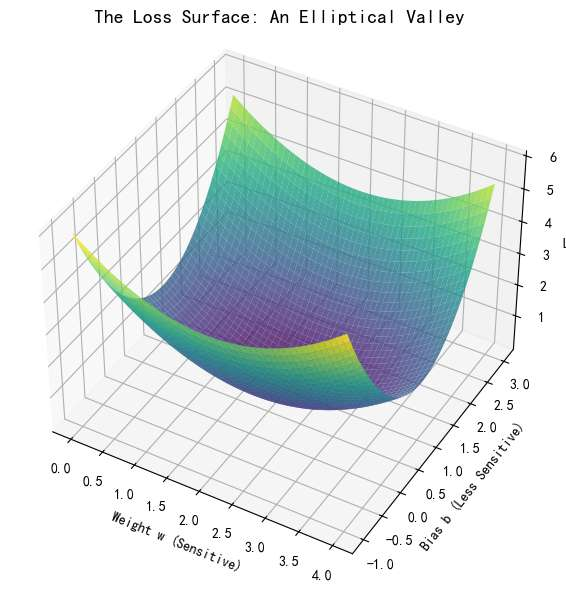
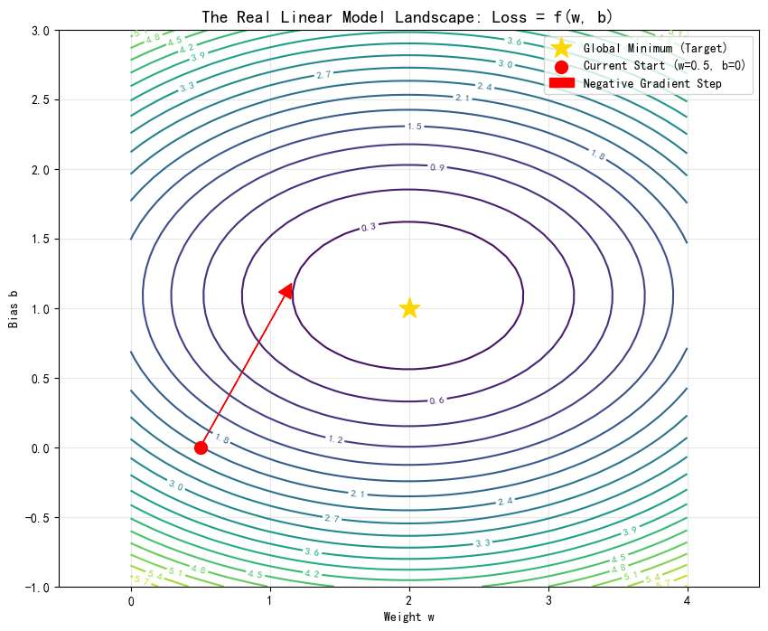

本篇文章，将从一个完整的工程闭环切入，将知识拆分为原子级，
即使你对机器学习没有任何基础，对编程没有任何基础，读完文章你也将收获到：
- 什么是机器学习？
- 怎么算成功训练出一个“机器”

文章包含
- 机器学习的定义
- 机器学习的流程概览
- 数据的处理
	- 预处理
	- 特征选择
	- 特征工程
- 训练（不讲任何训练细节，只宏观建立准确直觉）
	- 数据集划分
	- 各个数据集的使用
	- 训练的大体方法
- 模型的评估
	- 单纯的准确率引出的冲突
	- 评估曲线、评估分数
- 回看与总览

# 什么是机器学习？

关于机器学习的定义，我们是有**Tom Mitchell**教授的解释作为官方定义的，
不过描述虽然准确，初学者直接看很容易劝退。

我们只需先理解三个概念：
- **Task (T):** 任务
- **Performance (P):** 性能度量
- **Experience (E):** 经验/数据。

现在我们先不把教授的定义搬出来，而是到各个场景里，大家一起看看这三个概念都对应的什么：

在一个**下棋机器人**（**AlphaGo**）中：
- **T:** 下棋。
- **E:** 自己跟自己下棋，或跟人类高手下棋的棋谱。
- **P:** 赢棋的百分比（或胜率）。

在一个**推荐系统**（淘宝/抖音） 中
- **T**: 预测用户下一秒想看什么，并展示。
- **E**: 用户过去的浏览记录、点赞、购物车、甚至停留时长。
- **P**: 点击率 (CTR) 或 交易总额 (GMV)。

在一个**AI 编程助手 (Cursor/Copilot)**中：
- **T**: 根据注释写出一段可运行的代码。
- **E**: GitHub 上亿万行开源代码的历史仓库
- **P**: 程序跑通率、Bug数 

无论什么是什么“AI”，都能把这任务（T）、经验（E）、性能（P）拆解出来。 

结合上面的例子，我们再回头看 Tom Mitchell 的定义：
	"A computer program is said to learn from experience **E** with respect to some task **T** and some performance measure **P**, if its performance on **T**, as measured by **P**, improves with experience **E**."

给到英文就是不想“**机翻**”经典的定义。

我用我自己的理解，翻译一下：
基于数据（Experience），让模型(A computer program)具备从中发现规律，并对未知数据做出预测或决策，完成目标任务（Task）的能力， 我们可以用并且我们在这过程中，不断使模型进行参数更迭，以达到更好的性能（Performance）。

那么大家也可以自己尝试“翻译”。 大家读这句话时应当能对应到刚才具体的例子。

- 比如**推荐系统** 中，就是这个**模型**看遍了你某宝的浏览记录、购物车（**积累经验E**），然后通过自己的程序，推测出来你更可能想买什么？ 并把他推测出的给你推荐到首页上（**执行任务T**）如果你点的真的多了，说明他做的很好。如果没点几下，说明“**性能P**”下降。通过这个反馈，系统会修改内部的计算逻辑，直到下次预测得更准——这就是“**Learn (学习)**”的过程。

更进一步，我们来“咬文嚼字”一下：

### **什么是模型？**
我想起了ai领域某个教授说的，**Everything is a Function（万物皆函数）。**

模型本质是就是个函数$f(x)$ ，当我们把一个**输入放进去**模型 ，模型就会**吐出一个输出** 也许是一个预测 也许是一个分数 等等

要更好的理解**模型**，我们还需厘清三个层级：

**1. 假设空间 (Hypothesis Space) —— “我们允许函数长什么样”**'
在我们开始训练之前，必须先对数据的规律做一个**假设**。
*   如果我们认为数据是简单的线性关系，我们就假设它符合 $y = wx + b$。
*   如果我们认为数据很复杂，我们也许假设它是一个包含 100 层神经元的深度网络，也许假设模型是一个 $y = w_1x_1^3x_2^2+w_2x_1^2x_2..$ 

这种“所有可能性的集合”，就叫**假设空间**。

**2. 参数 (Parameters) —— “函数的细节”**
一旦选定了假设空间（比如 $y = wx + b$），这个函数的结构就定下来了，但它具体的**形状**还没定。
这里的 $w$ (权重) 和 $b$ (偏置) 就是**参数**。

**3. 模型 (Model) —— “函数最终的样子”**
当我们通过数据，确定了具体的 $w$ 等于多少，$b$ 等于多少时（比如 $y = 2x + 3$），我们就得到了一个**具体的模型**。
这就是一个映射关系的**具体实现**。输入一个 $x$，必然吐出一个固定的 $y$。

### 怎么基于数据学习？

我们知道了模型是函数，也知道了目标是提高性能 (P)，而且我们会借助数据提高这个P。

我们来看，凭什么能借助数据“学习”？

当我们把数据 $x$ 喂给模型，模型吐出了预测值 $\hat{y}$ (Predict)。
而数据本身自带了标准答案 $y$ (Label)。

如果 $\hat{y}$ 和 $y$ 差了十万八千里（比如$\hat{y}$ 是预测房价，预测出了是 100 块，实际是 100 万），机器会衡量这个错误。在后面对参数的更新中，不断让这个错误越来越小，性能 P 自然就提升了！

很清晰吧？不过问题又来了，
**该怎么衡量这个“错误”？**

#### 损失函数与目标函数
我们需要一个数学公式来量化这种“差距程度”，这就是**Loss（损失）**。

我常常看到人们把这俩个概念弄混：

*   **损失函数 (Loss Function):** $L(y, \hat{y})$
    *   **对象：** 针对**单个样本**。
    *   **作用：** 衡量某一个样本输出与输入的差距，比如最简单的“平方差”：$(y - \hat{y})^2$。
    
*   **目标函数 (Objective Function) / 代价函数 (Cost Function):** $J(w)$
    *   **对象：** 针对**整个训练集**。
    *   **作用：** 衡量这一套数据（许多样本），平均错了多少。通常是所有样本 Loss 的平均值，在后面深入学习中就能明白，目标函数的花样多的呢！

我们明白了如何“衡量”差距，就知道如何“训练”了。

一句话就能总结：
机器学习的**训练**过程，本质上就是一个“**把 Loss 降到最低**”的数学求解过程。  
我们想尽办法调整参数，让**目标函数**的值最小化，从而间接得到一个性能 P 优秀的模型。

至此，机器学习的全流程已经非常清晰，
你需要建立的直觉是：
**拿到数据 -> 假设模型结构 -> 根据数据算出 Loss -> 优化参数让 Loss 降到最低 -> 得到最终模型 -> 评估性能**

*注：为了方便理解，这里所讲的Loss依赖于数据中包含明确的标签，这对应的是**有监督学习**。 在**无监督学习**中（如聚类），T 不是预测标签而是发现数据结构，虽然不存在“预测值与标签的差异”，但依然会有相应的目标函数（如簇内距离）来衡量结构的好坏，原理是相通的。

上面是个初步的直觉，我们发现机器学习其实是一个严密的系统工程。其实里面能填充的“知识点”可太多太多。具体知识点图谱是这样的（为了不陷入任何数学细节，**加粗部分将在本文重点介绍**，其余后续文章才会深入。这些加粗部分是“**保下限**”，其他地方是“决定上限” ）
- **拿到数据阶段**
	- **数据的预处理**，我们要让数据方便我们训练
		- 填补空白值
		- 清洗错值
		- **归一化**，消除”量纲“的影响
	- **特征选择**
		- **具体筛选：Filter、Wrapper、Embedded**
		- **搜索策略: SFS (前向)、SBS (后向)。**
- 假设模型结构
	- 无数种函数可以选择，无数个假设空间，基于归纳偏置，确定最终空间。
- 根据数据算出Loss
	- 损失函数的定义
	- 目标函数的定义
- 优化参数让 Loss 降到最低
	- 解析解
	- 梯度下降法
- **评估与调优**
	- **数据集划分:** 训练集 / **验证集** /  **测试集** 。
	- **核心指标:** **准确率陷阱**、**混淆矩阵**、**F1-Score**、**AUC**。

接下来，我们进入**AI 文本检测**的实战案例。在这个案例中，我们将**重点拆解**数据预处理、特征选择以及模型评估环节，带你完整跑通一次机器学习的闭环, 看看我们怎么“诞生一个机器”的。

# 文本检测全流程

## 数据预处理
根据我们的 Task 描述，我们拿到的数据应当是标记好的 AI 文本和真人文本，
通常拿到的原始数据格式是 .csv 或 .json（最常见），或者是一堆 .txt 文件。

刚拿到的数据可能长这样（CSV格式）：

| id  | text (文本内容)            | label (标签)      | source (来源) |
| --- | ---------------------- | --------------- | ----------- |
| 001 | 随着人工智能的发展...           | AI              | GPT-4       |
| 002 | 今天心情不错!!! hhh       | Human           | Weibo       |
| 003 | **NaN** (数据缺失)         | Human           | Reddit      |
| 004 | The future of AI is... | **NULL** (标签丢了) | Claude      |
| 005 | 机器学习很好玩...             | 0 (标签格式不统一)     | Blog        |

所以说，什么是“脏数据”？
1. **缺失值:** ID 003 内容是空的。
2. **标签丢失:** ID 004 不知道是人写的还是 AI 写的。
3. **标签混乱:** ID 005 用了 "0" 代表 AI，而 ID 001 用的是 "AI"。
4. **噪音:** ID 002 有 HTML 标签    和无意义的语气词 hhh；ID 005 有转义字符 &nbsp;。

###  数据清洗
对于这些“脏数据”，我们会使用Python 脚本来处理。

- **处理缺失和标签:**
    - 直接**删除**内容为空（NaN）或标签缺失的行（没有内容没法练，没有标签没法学）。
    - **统一标签:** 编写映射规则，把 {"AI": 1, "Human": 0, "0": 1} 统一成计算机认识的 0 和 1，而且这样十分清晰

- **文本清洗 :** 这是 NLP（自然语言处理） 的特色。
    - **去除噪音:** 用正则表达式（Regex）去掉 HTML 标签（ ）、多余的空格、特殊的表情符号。
    - **统一格式:** 英文全部转小写（"AI" 和 "ai" 应该是一个词）；繁体转简体

至此，我们有了清洗后的干净数据（Experience）。如下所示

| text (清洗后) | label (统一后) |
| ---------- | ----------- |
| 随着人工智能的发展  | 1           |
| 今天心情不错     | 0           |
| 机器学习很好玩    | 1           |

### 特征提取
然后呢？我们直接把上面那个表格里的汉字喂给模型，让它学？  

**不行。** 模型（函数）只认识**数字**，不认识“**心情**”或“不错”这些字。

这就引出了机器学习中最关键的一步：**特征提取**。  
模型不是纯粹的“学习”原始数据，而是学习数据的“**特征 (Features)**”**。

**什么是特征？** 

> **特征，就是我们把原始数据“翻译”成机器能看懂的、且能描述这个数据关键属性的一组数字。**

**举个简单的例子：**
    
- **原始数据：** 一张苹果的照片。
	
- **特征：** 颜色=红色（可用 RGB 数值表示），形状=圆形（可用圆度数值表示），重量=200g。
	
- 机器通过学习这三个数字，就能判断“这是苹果”。

在本次任务中，我们面对的是文本。为了把文本变成数字，我们采用**手动设计的统计特征**：

1. **文本长度:** 这段话有多少个字？
2. **标点密度:** 感叹号、省略号用了多少个？（人类情感丰富，标点用得多而乱；AI 比较克制）
3. **“GPT口癖”词频:** "总之"、"综上所述"、"关键在于" 这种 AI 惯用逻辑词出现了几次？
4. **平均词长:** 使用了多少个复杂的高级词汇？

提取完特征后，我们的数据如下：

| 特征1: 文本长度 | 特征2: 标点密度 | 特征3: 口癖词频 | **Label**     |
| --------- | --------- | --------- | ------------- |
| 500       | 0.002     | 5         | **1 (AI)**    |
| 20        | 0.15      | 0         | **0 (Human)** |

*注：现代深度学习的做法通常是使用“**词向量 (Embeddings)**”，即把每个词自动转换成一串高维稠密的数字向量。但为了方便理解后续的“特征选择”逻辑，我们在本教程中主要聚焦于更直观的 **手动统计特征**。*
### 归一化
看看上面提取特征后的表格。
**“”文本长度”是 500，“标点密度”是 0.002。** 这两个数字**不在同一个数量级**上！

如果我们直接把这两个数扔进模型（比如 $y = w_1 \cdot x_1 + w_2 \cdot x_2$），模型会本能地觉得：
$x_1$ 这么大，肯定很重要！$x_2$  这么小，估计是噪音，忽略它吧。 
于是 $w2$ 参数可能就会很小，模型只会调整 $w_1$ 参数。

但这完全错了！标点密度虽然数值小，但它对区分人类和 AI **至关重要**。
为了消除这种因为单位不同（一般我们也叫量纲影响）带来的影响，我们需要进行**归一化**。

**具体做法（Min-Max 归一化）：**
把所有特征的数值，都强行压缩到 **[0, 1]** 这个区间内。
公式非常简单：
$$x_{new} = \frac{x - x_{min}}{x_{max} - x_{min}}$$

*   比如“文本长度”，最大值是 1000，最小值是 0。那么 500 就变成了 $0.5$。
*   比如“标点密度”，最大值是 0.2，最小值是 0。那么 0.002 就变成了 $0.01$。

**一个典型的归一化应用场景：**
**房价预测**。
*   特征 A：**房屋面积**（单位：平方米，数值范围 50 - 500）。
*   特征 B：**房间数量**（单位：个，数值范围 1 - 5）。
如果不做归一化，面积稍微变动 1 平方米，数值就变动 1；而房间数要变动 1 个非常难。模型会被只在意“面积”，完全忽略了“几个房间”这个重要信息。归一化后，两者就能“**公平竞争**“了。

### 特征选择

假设为了追求极致的准确率，我们疯狂地人工或者一些方法设计了 **100 个**特征！数据表现在变得非常宽：

| 特征1: 文本长度 | 特征2: 标点密度 | 特征3: "总之"词频 | ... | 特征99: 星期几发布的 | 特征100: 作者首字母 | Label |
| --------- | --------- | ----------- | --- | ------------ | ------------ | ----- |
| 500       | 0.002     | 5           | ... | 3 (周三)       | A            | 1     |
| 20        | 0.15      | 0           | ... | 6 (周六)       | Z            | 0     |

**思考一下：**

- “特征 99: 星期几发布的” 对判断是不是 AI 有用吗？（除了上班摸鱼，AI 是 24 小时无休的）。大概率没用。
    
- “特征 100: 作者首字母” 也·是纯粹的噪音。

如果我们把这 100 个特征全扔给模型：

1. **训练慢：** 模型要计算很多无用的权重。
2. **过拟合 :** 模型可能会强行记下“周三发布的文章通常是 AI 写的”这种虚假规律，导致换个数据集就崩了。

所以，我们需要进行 **特征选择 (Feature Selection)** 。选出最好的特征，组合在一起，才能更精准地表现我们的数据。  

常用的方法有三种：
#### 1. Filter 
- **核心思想：** 不在乎使用什么模型，只看**数据本身**。

- **做法：** 一般使用一些统计特征，如方差、偏度、类内类间聚类等待。这里我们计算每个特征和 Label 之间的**相关性**（比如使用皮尔逊相关系数）。
    - 算出“文本长度”和 Label 的相关性是 0.8（很高，保留）。
    - 算出“星期几”和 Label 的相关性是 0.01（极低，直接扔掉）。

- **特点：** 速度极快，因为和模型无关！不管后面用啥模型结果都一样。但它是单独地判断特征，可能漏掉**组合效应**（比如特征 A 和 B 单独都没用，但加在一起特别有用，Filter 会把它俩都扔了）。

#### 2. Wrapper

- **核心思想：** 我直接把特征扔进模型里跑，谁效果好选谁。
    
- **做法：** 这是一个不停**试错**的过程。我们选定一个模型，然后不停地尝试不同的特征组合，看哪些组合效果好。
    
- **常用的搜索策略：**
    
    - **SFS (前向选择 - Sequential Forward Selection):**
        
        - 第一轮：单独试 100 个特征，发现“标点密度”（只是举例）效果最好。**保留它。**
            
        - 第二轮：在“标点密度”的基础上，再试剩下的 99 个，看谁跟它搭档效果最好。
            
        - 如图，从下往上看，特征（纵轴）一点点增加，效果（准确率）一点点变好，直至最优点（红色点）
    - 

    - **SBS (后向选择 - Sequential Backward Selection):**
        
        - 反过来：先用全部的100 个特征跑。
            
        - 试着删掉一个特征，看效果掉没掉？如果没掉（甚至升了），说明这个特征是废的，**永久删除**。
            
        - 如图，从上往下看，特征一点点减小，效果（准确率）一点点变好，直至最优点（红色点）
    - 
- **特点：** 效果通常最好，但**计算量巨大**，非常非常慢，因为每试一次都要重新训练一遍模型。
    

#### 3. Embedded 

- **核心思想：** 不用专门筛选，**在训练模型的过程中自动选择特征**。
    
- **做法：** 有些算法（如 **Lasso 回归**、**随机森林**）自带功能。
    
    - 如 Lasso 回归在训练时，会强行把那些不重要的特征的权重 w 压缩为 **0**。权重变 0 了，等于这个特征被模型自动抛弃了。
    
- **特点：** 性价比最高，是工业界最常用的方法。

**在本次案例中：**  
为了演示清晰，我们假设使用了 **Filter 方法**，筛选掉了 97 个无用特征，最后只留下了 **3 个最好的特征**：文本长度、标点密度、特殊词频。

接下来，我们就用这 3 个特征来构建我们的模型。

## 假设模型结构

数据准备好了（变成了数字表格），现在我们需要一个模型来从这些数字中找出规律。

| 特征1: 文本长度 | 特征2: 标点密度 | 特征3: 特殊词频 | **Label**     |
| --------- | --------- | --------- | ------------- |
| 500       | 0.002     | 5         | **1 (AI)**    |
| 20        | 0.15      | 0         | **0 (Human)** |

**归一化**后：

| 特征1: 文本长度 (归一化) | 特征2: 标点密度 (归一化) | 特征3: 特殊词频 (归一化) | **Label**     |
| --------------- | --------------- | --------------- | ------------- |
| **0.50**        | **0.01**        | **0.50**        | **1 (AI)**    |
| **0.02**        | **0.75**        | **0.00**        | **0 (Human)** |

面对我们的任务（根据几个统计特征，判断是 1 还是 0），其实有无数种模型可以选择。

这就是我们在前文中提到的"**假设空间**"。

我们可以选择：

1.  **逻辑回归:**
    *   **假设：** 规律是线性的。比如：$y = \sigma(w_1 \cdot \text{长度} + w_2 \cdot \text{密度} + b)$。即假设这个线性公式计算的结果，就能分类出 0 和 1
    *   **特点：** 简单、极快、**可解释性极强**。它能明确告诉你：“因为这篇文章标点密度太低，所以我判定它是 AI”。
    *   **适用：** 特征数量不多，且特征之间关系比较简单时。

2.  **决策树 / 随机森林:**
    *   **假设：** 规律是可“决策”的。比如：“如果长度 > 500，再看标点密度；如果长度 < 50，直接判定为人类”。
    *   **特点：** 符合人类直觉，能处理复杂的非线性关系。
    *   **适用：** 表格型数据

3.  **神经网络:** 
    *   **假设：** 规律是极度复杂的网状结构。
    *   **特点：** 拟合能力最强，但可解释性很弱，你很难知道它到底学到了什么。
    *   **适用：** 数据量极其巨大，或者输入是图像、原始文本（非手动提取特征）时。

我认为，大多数人只会把“学习模型结构”当作“学习机器学习”， 
现在跟着文章的思路，你可以发现，这只是一个很小的环节。只不过是选择“模型”，选择“函数”罢了。

对于初学者，以及为了演示“特征的重要性”，我们通常首选 **逻辑回归**。

后续文章我也会详细介绍各种模型。

**选择逻辑回归有如下好处：**
1.  **直观：** 它的公式 $y = w_1x_1 + w_2x_2 + ...$ 直接对应了我们提取的特征。我们可以看到 $w$ 的大小，即权重，它的大小能看出哪个特征更重要。
2.  **Baseline:** 在工程界，无论任务多复杂，我们通常都会先跑一个逻辑回归。如果逻辑回归就能达到 90% 的准确率，就没必要杀鸡用牛刀去搞复杂的模型了。所以一般把逻辑回归叫“Baseline”

总而言之，本次实战，我们假设模型结构为：
$$P(\text{是AI}) = \text{Sigmoid}(w_1 \cdot \text{长度} + w_2 \cdot \text{密度} + w_3 \cdot \text{词频} + b)$$

这就是我们要训练的那个“机器”。现在的任务，就是找到那一组最完美的 $w$ 和 $b$。

$w$ 和 $b$ 就是之前介绍的，“模型的参数”。

## 根据数据算出 Loss

模型选好了（Sigmoid 线性公式），现在的 $w$ 和 $b$ 还是随机生成的（比如全是 0）。
我们随便抓一个数据（比如：长度 0.5，密度 0.01，真实标签是 **1 (AI)**）扔进去算一下。

模型一算：$P(\text{是AI}) = 0.1$。

这下尴尬了。 真实是 AI (1)，模型说 Human (0.1)。

机器需要一个指标来狠狠地惩罚这个错误。以让其意识到模型的参数出错了。

我们之前提到过 **损失函数 $L(y, \hat{y})$**。
在回归问题（预测房价）中，我们通常用 $(y - \hat{y})^2$（平方差）。

但在我们这个**二分类问题**（预测概率）中，我们通常使用 **对数损失 (Log Loss)**，也叫**交叉熵损失函数 (Cross Entropy)**。

**直觉是这样：**
如果真实是 1，模型预测是 0.0001。
*   用平方差算：$(1 - 0.0001)^2 \approx 1$。
*   用对数损失算：$-\log(0.0001) \approx 9.2$。

对数损失对“自信且错误”的预测，惩罚是无限大的。它逼迫模型必须对正确的分类给出极高的概率。

于是，我们把所有样本的 Loss 加起来求个平均，再加上一个正则化项（防止 $w$ 变得太大导致过拟合），就得到 **目标函数 $J(w, b)$**。

### 优化参数让 Loss 降到最低 

现在的任务变成了：**找到一组 $w$ 和 $b$，让目标函数 $J(w, b)$ 的值最小。**

为了好演示，假如我们只有一个特征 w，我们可以把 $J(w, b)$ 的函数图画出

事实就是，一定有一个最优的参数组合 (w, b) ，让目标函数 $J(w, b)$ 的值最小。

我们现在把目标函数图压扁成二维的，如图，是常用的（怎么称呼来着）... 图
图上的圆圈是“损失函数等高线”，五角星就是最优的参数组合 (w, b) 这个点，这个点对应的损失函数值最低。 
红点假设是当前的参数，我们的目的就是从红点往五角星处前进。
网上很多的比喻称“五角星”处为“谷底”，这个前往“五角星”处的过程叫“下山”。

我们有两种方法前往谷底：

**1. 解析解 **
*   **原理：** 直接用数学公式（求导等于 0）一步算出最优参数的坐标。
*   **局限：** 对于逻辑回归或复杂的神经网络，这个方程根本解不出来（或者计算量大到把电脑烧了）。所以，**此路不通**。

**2. 梯度下降法**
这是机器学习的**灵魂**。
既然看不清全貌，那我就只看脚下：
*   **第一步 (求梯度):** 算一下当前位置，往哪个方向走是最陡的？也就是最有可能快快接近谷底的方向（这就是梯度的反方向）。
*   **第二步 (更新参数):** 沿着这个方向迈一小步（这一步的大小叫 **学习率 Learning Rate**）。
*   **第三步 (循环):** 到了新位置，再看脚下，再迈步……

不停地重复几千次，直到你发现无论往哪走都是“上坡“了，恭喜你，**你到谷底了**。
此时你的坐标 $(w, b)$，就是我们要找的“**最优模型的参数**”**。

*注：在工程实战中，我们通常不会用所有数据算梯度（太慢），而是每次随机抓一小把数据算一下方向，这叫 **SGD (随机梯度下降)**。虽然路线歪歪扭扭，但下山速度非常快。*

#### **[回看] 为什么之前一定要做“归一化”？**

还记得我们在数据预处理阶段做的 **归一化** 吗？
把“文本长度 (0-1000)”和“标点密度 (0-0.2)”都压缩到了 [0, 1] 之间。

当时我们说这是为了消除量纲。现在到了梯度下降阶段，你会发现量纲影响关乎**参数更新**。

如果不做归一化，我们的目标函数 $J$ 的函数，会有如下情况：
*   $w_1$（对应长度）稍微动一点点，Loss 就剧烈变化。
*   $w_2$（对应密度）动很大，Loss 也没啥反应。

这就导致梯度下降时，损失值跳动巨大，很难走到最优点，训练速度极慢，甚至无法收敛。

而做了归一化之后，
无论往哪个方向走，，梯度下降可以直接径直走向谷底，**训练速度飞快**。

归一化不仅仅是为了数字好看，更是为了让梯度下降（优化算法）能正常工作！

