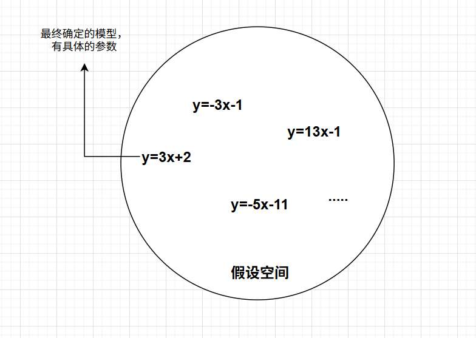

本篇文章，将从一个完整的工程闭环切入，将知识拆分为原子级，
即使你对机器学习没有任何基础，读完文章你也将收获到：
- 什么是机器学习？
- 怎么算成功训练出一个“机器”

文章包含
- 机器学习的定义
- 机器学习的流程概览
- 数据的处理
	- 预处理
	- 特征选择
	- 特征工程
- 训练（不讲任何训练细节，只宏观建立准确直觉）
	- 数据集划分
	- 各个数据集的使用
	- 训练的大体方法
- 模型的评估
	- 单纯的准确率引出的冲突
	- 评估曲线、评估分数
- 回看与总览

# 什么是机器学习？

关于机器学习的定义，我们是有**Tom Mitchell**教授的解释作为官方定义的，
不过描述虽然准确，初学者直接看很容易劝退。

我们只需先理解三个概念：
- **Task (T):** 任务
- **Performance (P):** 性能度量
- **Experience (E):** 经验/数据。

现在我们先不把教授的定义搬出来，而是到各个场景里，大家一起看看这三个概念都对应的什么：

在一个**下棋机器人**（**AlphaGo**）中：
- **T:** 下棋。
- **E:** 自己跟自己下棋，或跟人类高手下棋的棋谱。
- **P:** 赢棋的百分比（或胜率）。

在一个**推荐系统**（淘宝/抖音） 中
- **T**: 预测用户下一秒想看什么，并展示。
- **E**: 用户过去的浏览记录、点赞、购物车、甚至停留时长。
- **P**: 点击率 (CTR) 或 交易总额 (GMV)。

在一个**AI 编程助手 (Cursor/Copilot)**中：
- **T**: 根据注释写出一段可运行的代码。
- **E**: GitHub 上亿万行开源代码的历史仓库
- **P**: 程序跑通率、Bug数 

无论什么是什么“AI”，都能把这任务（T）、经验（E）、性能（P）拆解出来。 

结合上面的例子，我们再回头看 Tom Mitchell 的定义：
	"A computer program is said to learn from experience **E** with respect to some task **T** and some performance measure **P**, if its performance on **T**, as measured by **P**, improves with experience **E**."

给到英文就是不想“**机翻**”经典的定义。

我用我自己的理解，翻译一下：
基于数据（Experience），让模型(A computer program)具备从中发现规律，并对未知数据做出预测或决策，完成目标任务（Task）的能力， 我们可以用并且我们在这过程中，不断使模型进行参数更迭，以达到更好的性能（Performance）。

那么大家也可以自己尝试“翻译”。 大家读这句话时应当能对应到刚才具体的例子。

- 比如**推荐系统** 中，就是这个**模型**看遍了你某宝的浏览记录、购物车（**积累经验E**），然后通过自己的程序，推测出来你更可能想买什么？ 并把他推测出的给你推荐到首页上（**执行任务T**）如果你点的真的多了，说明他做的很好。如果没点几下，说明“**性能P**”下降。通过这个反馈，系统会修改内部的计算逻辑，直到下次预测得更准——这就是“**Learn (学习)**”的过程。

更进一步，我们来“咬文嚼字”一下：

### **什么是模型？**
我想起了ai领域某个教授说的，**Everything is a Function（万物皆函数）。**

模型本质是就是个函数$f(x)$ ，当我们把一个**输入放进去**模型 ，模型就会**吐出一个输出** 也许是一个预测 也许是一个分数 等等

要更好的理解**模型**，我们还需厘清三个层级：

**1. 假设空间 (Hypothesis Space) —— “我们允许函数长什么样”**'
在我们开始训练之前，必须先对数据的规律做一个**假设**。
*   如果我们认为数据是简单的线性关系，我们就假设它符合 $y = wx + b$。
*   如果我们认为数据很复杂，我们也许假设它是一个包含 100 层神经元的深度网络，也许假设模型是一个 $y = w_1x_1^3x_2^2+w_2x_1^2x_2..$ 

这种“所有可能性的集合”，就叫**假设空间**。

**2. 参数 (Parameters) —— “函数的细节”**
一旦选定了假设空间（比如 $y = wx + b$），这个函数的结构就定下来了，但它具体的**形状**还没定。
这里的 $w$ (权重) 和 $b$ (偏置) 就是**参数**。

**3. 模型 (Model) —— “函数最终的样子”**
当我们通过数据，确定了具体的 $w$ 等于多少，$b$ 等于多少时（比如 $y = 2x + 3$），我们就得到了一个**具体的模型**。
这就是一个映射关系的**具体实现**。输入一个 $x$，必然吐出一个固定的 $y$。

### 怎么基于数据学习？

我们知道了模型是函数，也知道了目标是提高性能 (P)，而且我们会借助数据提高这个P。

我们来看，凭什么能借助数据“学习”？

当我们把数据 $x$ 喂给模型，模型吐出了预测值 $\hat{y}$ (Predict)。
而数据本身自带了标准答案 $y$ (Label)。

如果 $\hat{y}$ 和 $y$ 差了十万八千里（比如$\hat{y}$ 是预测房价，预测出了是 100 块，实际是 100 万），机器会衡量这个错误。在后面对参数的更新中，不断让这个错误越来越小，性能 P 自然就提升了！

很清晰吧？不过问题又来了，
**该怎么衡量这个“错误”？**

#### 损失函数与目标函数
我们需要一个数学公式来量化这种“差距程度”，这就是**Loss（损失）**。

我常常看到人们把这俩个概念弄混：

*   **损失函数 (Loss Function):** $L(y, \hat{y})$
    *   **对象：** 针对**单个样本**。
    *   **作用：** 衡量某一个样本输出与输入的差距，比如最简单的“平方差”：$(y - \hat{y})^2$。
    
*   **目标函数 (Objective Function) / 代价函数 (Cost Function):** $J(w)$
    *   **对象：** 针对**整个训练集**。
    *   **作用：** 衡量这一套数据（许多样本），平均错了多少。通常是所有样本 Loss 的平均值，在后面深入学习中就能明白，目标函数的花样多的呢！

我们明白了如何“衡量”差距，就知道如何“训练”了。

一句话就能总结：
机器学习的**训练**过程，本质上就是一个“**把 Loss 降到最低**”的数学求解过程。  
我们想尽办法调整参数，让**目标函数**的值最小化，从而间接得到一个性能 P 优秀的模型。

至此，机器学习的全流程已经非常清晰，
你需要建立的直觉是：
**拿到数据 -> 假设模型结构 -> 根据数据算出 Loss -> 优化参数让 Loss 降到最低 -> 得到最终模型 -> 评估性能**

*注：为了方便理解，这里所讲的Loss依赖于数据中包含明确的标签，这对应的是**有监督学习**。 在**无监督学习**中（如聚类），T 不是预测标签而是发现数据结构，虽然不存在“预测值与标签的差异”，但依然会有相应的目标函数（如簇内距离）来衡量结构的好坏，原理是相通的。

上面是个初步的直觉，我们发现机器学习其实是一个严密的系统工程。其实里面能填充的“知识点”可太多太多。具体知识点图谱是这样的（为了不陷入任何数学细节，**加粗部分将在本文重点介绍**，其余后续文章才会深入。这些加粗部分是“**保下限**”，其他地方是“决定上限” ）
- **拿到数据阶段**
	- **数据的预处理**，我们要让数据方便我们训练
		- 填补空白值
		- 清洗错值
		- **归一化**，消除”量纲“的影响
	- **特征选择**
		- **具体筛选：Filter、Wrapper、Embedded**
		- **搜索策略: SFS (前向)、SBS (后向)。**
- 假设模型结构
	- 无数种函数可以选择，无数个假设空间，基于归纳偏置，确定最终空间。
- 根据数据算出Loss
	- 损失函数的定义
	- 目标函数的定义
- 优化参数让 Loss 降到最低
	- 解析解
	- 梯度下降法
- **评估与调优**
	- **数据集划分:** 训练集 / **验证集** /  **测试集** 。
	- **核心指标:** **准确率陷阱**、**混淆矩阵**、**F1-Score**、**AUC**。

接下来，我们进入**AI 文本检测**的实战案例。在这个案例中，我们将**重点拆解**数据预处理、特征选择以及模型评估环节，带你完整跑通一次机器学习的闭环, 看看我们怎么“诞生一个机器”的。

# 文本检测全流程

## 数据预处理
根据我们的 Task 描述，我们拿到的数据应当是标记好的 AI 文本和真人文本，
通常拿到的原始数据格式是 .csv 或 .json（最常见），或者是一堆 .txt 文件。

刚拿到的数据可能长这样（CSV格式）：

| id  | text (文本内容)            | label (标签)      | source (来源) |
| --- | ---------------------- | --------------- | ----------- |
| 001 | 随着人工智能的发展...           | AI              | GPT-4       |
| 002 | 今天心情不错!!! hhh       | Human           | Weibo       |
| 003 | **NaN** (数据缺失)         | Human           | Reddit      |
| 004 | The future of AI is... | **NULL** (标签丢了) | Claude      |
| 005 | 机器学习很好玩...             | 0 (标签格式不统一)     | Blog        |

所以说，什么是“脏数据”？
1. **缺失值:** ID 003 内容是空的。
2. **标签丢失:** ID 004 不知道是人写的还是 AI 写的。
3. **标签混乱:** ID 005 用了 "0" 代表 AI，而 ID 001 用的是 "AI"。
4. **噪音:** ID 002 有 HTML 标签   和无意义的语气词 hhh；ID 005 有转义字符 &nbsp;。

###  数据清洗
对于这些“脏数据”，我们会使用Python 脚本来处理。

- **处理缺失和标签:**
    - 直接**删除**内容为空（NaN）或标签缺失的行（没有内容没法练，没有标签没法学）。
    - **统一标签:** 编写映射规则，把 {"AI": 1, "Human": 0, "0": 1} 统一成计算机认识的 0 和 1，而且这样十分清晰

- **文本清洗 :** 这是 NLP（自然语言处理） 的特色。
    - **去除噪音:** 用正则表达式（Regex）去掉 HTML 标签（ ）、多余的空格、特殊的表情符号。
    - **统一格式:** 英文全部转小写（"AI" 和 "ai" 应该是一个词）；繁体转简体

至此，我们有了清洗后的干净数据（Experience）。如下所示（你给个例子）
然后呢，我们直接拿这些数据喂给模型，让他们学？
不，这其中还隐藏了很多细节。现在我们把细节再

