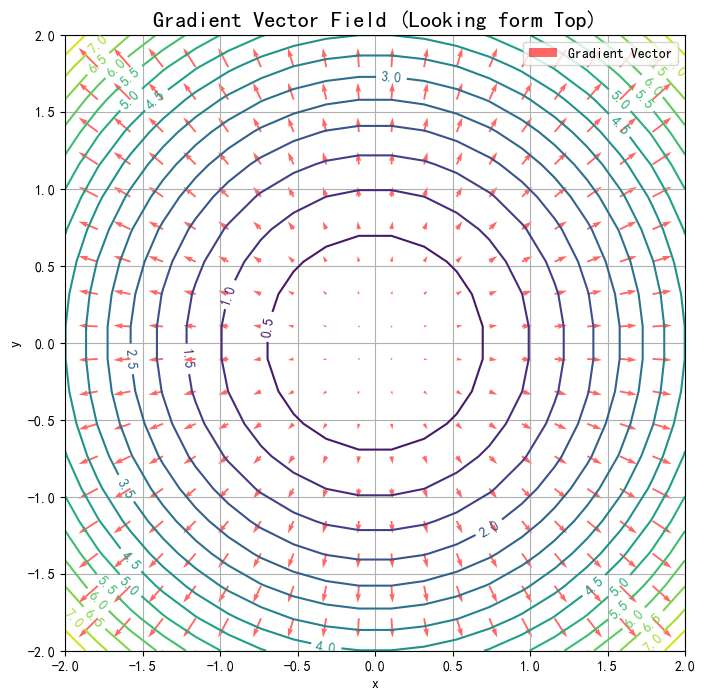

首先建立梯度的定义吧？
我总感觉网上的教学，一来就拿ai模型说，会有点糊。因为ai模型的梯度，应该是误差函数，对参数w求导吧？ 有悖直觉
需要掌握的前置知识，仅仅是“函数”，和“导数”？
我的意思是，脱离ai知识，
纯粹回归数学知识一下？
有没有简单的例子，去理解梯度。
我记得梯度，是向量？
是在学多元函数时，学到的。
一元函数当时为啥没学梯度？
然而我单层线性模型的梯度就是一维的吧？

有必要的话，可以写代码绘图

梯度
前置知识只需要：**函数** 和 **导数**。

在高中学的 $y = f(x)$，比如 $y=x^2$里，你站在抛物线上，`(1，1）` 这个点，你不能超出抛物线这个轨迹，只能待在画的这个曲线上。那你只能做两个动作：沿着切线，**向左下走** 或者 **向右上走**。
dan
*   导数 $f'(x)$ 只是一个**数值**（标量），比如当你在x=1的位置是，此点导数为 $2$。
*   它告诉你：往右走（$x$变大），$y$ 会变大；往左走，$y$ 会变小。

当然，我们往往想到导数，最直接的是想象割线，割线斜率为导数值，越陡峭，此点导数值越大。

其实，这个时候，我觉得已经可以引入“梯度”这个定义了，我们将割线添加箭头，哦，确实可以往下添可以往上添，不过想想导数的定义，是说x变大一点点，函数值（y）会怎么变。所以显然是往上。
我觉得此时就可以称有个向量
`[2]` （好像不太对） 为x=1时

在一元函数，我们在一个点，只有俩个方向能走（不对吧？ 好像有许多方向能走？）

不过我们正式学到“梯度”这个词，严谨来说是大一的微积分课程。“多元函数”章节

我们来到一个简单的**多元函数**，比如 $z = f(x, y)= x^2 + y^2$ 
想象你就在这张函数的图像上，你就是其中一点。

你不再只有左右两个方向，你的脚下有**360度无数个方向**可以“迈出一步”。
往哪走函数会变大呢？ 同样的，有无数个方向！

但我们往往研究什么呢？ 往哪走，函数会变得最大！

**我们同样需要一个向量，来指引我们方向，它正是梯度： $\nabla f$**

*   **定义：** 梯度（Gradient, 记作 $\nabla f$）是一个**向量**。
*   **物理意义**：永远指向**地形变高最快**的那个方向。
*   **长度：** 向量的长度（模），代表了这个坡有多陡。

**数学表达：**
如果 $z = f(x, y)$，那么梯度就是把对 $x$ 的导数和对 $y$ 的导数打包成一个向量：
$$ \nabla f = \begin{bmatrix} \frac{\partial z}{\partial x} \\ \frac{\partial z}{\partial y} \end{bmatrix} $$
可以理解吧？对x来说，下一步能让z变最大，同时对y来说，下一步也能让z变最大
那么这个方向，就是让z最大的方向。

我们看着这个图，已经能观察到
- 1.  **碗底（最低点）：**
    *   坐标 $(0,0,0)$ 的地方。
    *   这里的梯度（红色箭头）几乎**消失了**（长度趋近于0）。
    *   当我们到达最低时，不管往哪个方向走都不会上升了（??为啥啊)，所以梯度为0。这就是训练结束的标志。

2.  **碗壁（边缘）：**
    *   看边缘高处。
    *   红色箭头**非常明显**，且指向外侧（背离中心）。
    *   即函数值z越大，地形越陡，梯度信号越强烈。

我们是控制我们的“脚步”，“x与y”，来实现走到不同高度的地方z。
现在思考一下，我们站在某一点上，如何走，变化最大。

思考这个问题，如果我们有“梯度”这个信息，我们就不需要z的图了，
将其投影至平面。
下面的图，就代表所有x与y的情况下，如何走变化最大。（用词不精确

**数学课景：**
*   **谁是变量？** $x$ 和 $y$ 是变量（你的位置）。
*   **谁是参数？** 地形是固定的。
*   **目标：** 我们通过改变 $x, y$（移动脚步）去寻找最高点或最低点。

**AI 场景：**
*   **谁是变量？** $w$（权重）和 $b$（偏置）。
*   **谁是参数？** $x$（输入数据，比如图片像素）变成了**常数**！
*   **大反转：**
    在数学里，$y = wx$ 中 $x$ 是自变量。
    在AI训练时，数据 $x$ 已经拍在那儿不动了，我们把 $w$ 看作自变量。
    
    我们构造了一个**参数空间 (Parameter Space)**。这里的“山”，是由 $w$ 构成的。
    *   山的高度 = Loss（误差）。
    *   我们的目标：通过改变 $w$，沿着梯度的**反方向**（下坡），走到误差最低的山谷。

# 单层线性模型

