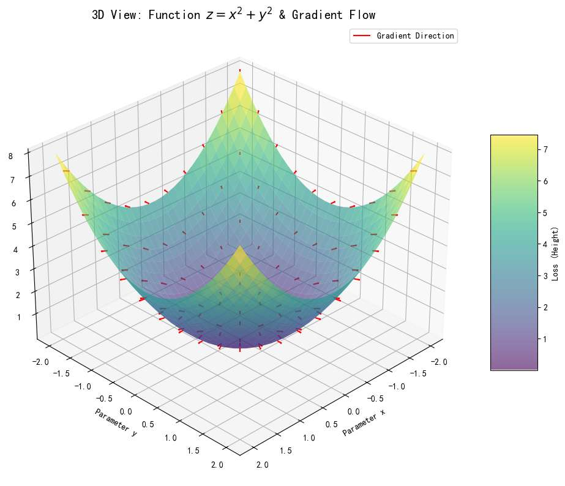

首先建立梯度的定义吧？
我总感觉网上的教学，一来就拿ai模型说，会有点糊。因为ai模型的梯度，应该是误差函数，对参数w求导吧？ 有悖直觉
需要掌握的前置知识，仅仅是“函数”，和“导数”？
我的意思是，脱离ai知识，
纯粹回归数学知识一下？
有没有简单的例子，去理解梯度。
我记得梯度，是向量？
是在学多元函数时，学到的。
一元函数当时为啥没学梯度？
然而我单层线性模型的梯度就是一维的吧？

有必要的话，可以写代码绘图

梯度
前置知识只需要：**函数** 和 **导数**。

在高中学的 $y = f(x)$，比如 $y=x^2$里，你站在抛物线上，`(1，1）` 这个点，你不能超出抛物线这个轨迹，只能待在画的这个曲线上。那你只能做两个动作：沿着切线，**向左下走** 或者 **向右上走**。
当然，虽然看上去你是往”左下“或”右上，但实际你能控制的，只是变量$x$ ，即”往左“还是”往右“。

那么，如果你想让自己，身处更高的地方，到底怎么走呢？
”导数“指导了你。
*   导数 $f'(x)$ 只是一个**数值**（标量），当你在x=1的位置是，此点导数为 $2$。
*   它告诉你：往右走（$x$变大），$y$ 会变大；往左走，$y$ 会变小。
*   数字2，表述了你往右走，y变大的程度。如果你走了1个单位，y会上升2个单位

当然，我们往往想到导数，最直接的是想象切线，切线斜率为导数值，越陡峭，此点导数值越大。

但真正指导我们的这个数字，”2“，是x轴上的。
我们可以理解为x轴上的一个向右的向量，它”指导“着你：如何控制你能控制的x，让你往更高的地方走？  如下图红色部分

*我觉得这是网上很多文章没指清的点。会让人误以为，这个图像上，”切线“（绿色线）就是梯度。然而，梯度（红色线），指导的只是你的自变量的方向。*

其实，这个时候，我觉得已经可以引入“梯度”这个定义了，
有个向量$\nabla f = [ \frac{df}{dx} ]=[2]$ （一维向量，趴在x轴上），对吧，它到底干了什么？

读者可以再次思考下，它和导数的关系。

不过我们正式学到“梯度”这个词，严谨来说是大一的微积分课程。“多元函数”章节

那么我们来到一个简单的**多元函数**，比如 $z = f(x, y)= x^2 + y^2$ 
想象你就在这张函数的图像上，你就是其中一点。

如果看着这个图，你的脚下有**无数个方向**可以“迈出一步”。
往哪走高度z会变大呢？ 同样的，有无数个方向！

但我们往往研究什么呢？还是那句话，自变量！x与y 往哪走，函数（高度）会变得最大！

**我们同样需要一个向量，来指引我们方向，它正是梯度： $\nabla f$**

*   **定义：** 梯度（Gradient, 记作 $\nabla f$）是一个**向量**。
*   **物理意义**：永远指向**地形变高最快**的那个自变量方向。
*   **长度：** 向量的长度（模），代表了这个坡有多陡。

**数学表达：**
如果 $z = f(x, y)$，那么梯度就是把对 $x$ 的导数和对 $y$ 的导数打包成一个向量：
$$\nabla f = [ \frac{\partial f}{\partial x}, \frac{\partial f}{\partial y} ]$$
可以理解吧？对x来说，下一步能让z变最大，同时对y来说，下一步也能让z变最大
那么这个方向，就是让z最大的方向。

我们先让高度“z”存在着，
我们看着这个图，红色箭头就表示那个点的梯度。

容易观察到
- 1.  **碗底（最低点）：**
    *   坐标 $(0,0,0)$ 的地方。
    *   这里的梯度（红色箭头）几乎**消失了**（长度趋近于0）。
    *   当我们到达最低时，不管往哪个方向走都不会上升了。为啥啊？当你站在正中心 (0,0)
		，脚下踩的那一小块地，其实是**水平的**碗底是非常圆润平滑的，所以梯度为0。

2.  **碗壁（边缘）：**
    *   看边缘高处。
    *   红色箭头**非常明显**，且指向外侧（背离中心）。
    *   即函数值z越大，地形越陡，梯度信号越强烈。

我们是控制我们的“脚步”，“x与y”，来实现走到不同高度的地方z。
梯度是**平铺在地图上**的指令，它告诉你“x往东走”，结果是你“往东爬上了坡”。在上面那个“碗装图”体现出了高度的上升。

 2D 梯度：$\nabla f = [ \frac{\partial f}{\partial x}, \frac{\partial f}{\partial y} ]$ （二维向量，趴在xy面上）
 
如果我们有“梯度”这个信息，我们就不需要z的图了，
将其投影至平面。

下面的图，就代表所有x与y的情况下，如何走变化最大。

关于梯度的数学直觉，建立完毕。
已二元函数为例，
*   **谁是变量？** $x$ 和 $y$ 是变量（你的位置）。
*   **谁不变？** 函数图像，即地形是固定的。
*   **目标：** 在这个不变的地形，我们通过改变 $x, y$（移动脚步）去寻找最高点或最低点。
* **梯度方向：** 取决于变量的个数，二元函数则 “平铺在地图上”

而到了**AI**的场景，需要我们稍稍转化一下思路。
我将从最简单的线性模型入手，到简单的神经网络，到复杂的神经网络，我们一起把“梯度”这个难题吃透。

# 线性模型

首先，让我们来到最简单的线性模型公式
*   **模型公式：** $\hat{y} = w \cdot x + b$
*   **任务：** 给定一堆数据点（比如房子的面积 $x$ 和价格 $y$），我们要找到一根直线，尽可能完美地穿过它们。找到一根直线，可以翻译为，找到一组完美的$w$和$x$

诶？“梯度”这个知识点会在这里吗？ wx+b 对x求导数？？

*不，还没出现。*

刚才的冲动是在说，x如何改变去影响y！如果你有刚才的冲动，说明，“梯度”在AI的“身份”你还没理解。

*   在上一节的数学基础里，我们关心 $x$ 变化时 $y$ 怎么变。
*   **在 AI 训练里，$x$ 是根本不许动的！因为** $x$ 是由于客观世界产生的数据（比如房屋面积），你无法改变它。
*   **真正能动的，是我们初始化的参数 $w$ 和 $b$。**

读到这有点懵，没关系，我们继续看！一会回过头看这段话吧！

回到预测上，
一开始，我们对 $w$ 和 $b$ 一无所知，只能随机猜。
比如我们随机生成了一组参数 $w_0, b_0$。
毫无疑问，这条直线画出来会拟合得很糟糕（预测值 $\hat{y}$ 和真实标签 $y$ 差得很远）。

如何调整？

直觉来说，我们要可以通过他们的差距，去调整我们的参数。

如果我们的参数的调节，能使在计算一次误差后，误差变小，我们就成功调整了参数。
这很大白话吧！

我们一般用“最小化损失函数”这个动作。

损失函数，就是用来计算误差的

在数学上，我们通常使用 **均方误差 (Mean Squared Error, MSE)** 来衡量我们的误差：

$$ Loss = (y - \hat{y})^2 = (y - (wx + b))^2 $$

这个函数的值，当然是越小越好。

所以我们希望，