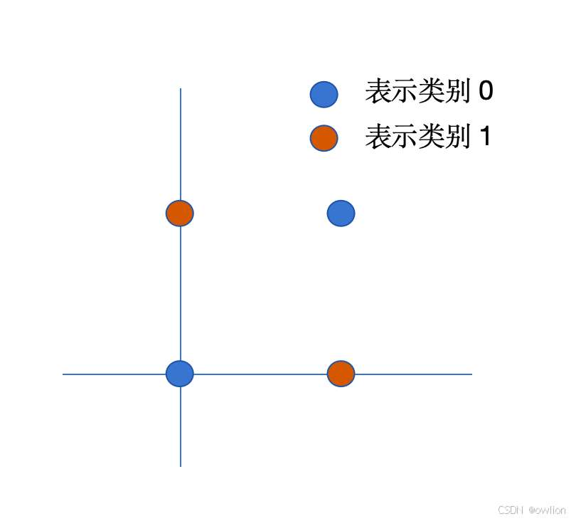
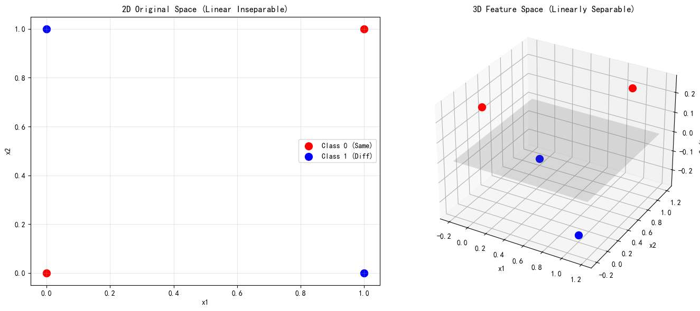

在介绍神经网络这个模型之前，
最重要的，就是理解发明神经网络的动机。

若懂了发明神经网络的出发点，这就不是一个需要记忆的模型，而是一个自然而然的过程。

# 设计神经网络的动机

我上篇文章讲过一系列的分类模型，
而这些线性分类模型、SVM、逻辑回归等模型，其决策边界都是线性的，也就是本质上都是在画一条直线（或超平面）。

然而，现实世界的数据往往不是线性可分的。
来一个很简单的问题，

XOR 是一个简单的逻辑运算，规则如下：
*   **相同为 0**：(0,0) $\to$ 0, (1,1) $\to$ 0
*   **不同为 1**：(0,1) $\to$ 1, (1,0) $\to$ 1

如果我们将这四个点画在二维平面上（如下图左），你会发现：红点（0 类）分布在一条对角线上，蓝点（1 类）分布在另一条对角线上。

请问你怎么画**一条**直线把它分开？画不出来。这就是线性模型的极限

那怎么办？

一个经典的做法是适用基函数 $\phi (x)$ ，我们构造些特征。

就以异或问题为例，
原来的数据是俩个特征 (x1, x2)，是二维的，人为地引入一个新的特征（基函数 $\phi(x)$），这下特征一共有三个，把 2D 数据投射到 3D 空间，也许就能分开了。

对于 XOR 问题，一个非常经典的构造方式是引入“交互项”。
我们保留原来的 $x_1, x_2$，并增加一个新维度 $x_3$。

令 $x_3 = (x_1 - 0.5) \cdot (x_2 - 0.5)$。

我们来看看发生了什么：

*   **红点 (0,0)**: $(-0.5) \times (-0.5) = 0.25$ $\to$ 飞到了高处。
*   **红点 (1,1)**: $0.5 \times 0.5 = 0.25$ $\to$ 飞到了高处。
*   **蓝点 (0,1)**: $(-0.5) \times 0.5 = -0.25$ $\to$ 沉到了地下。
*   **蓝点 (1,0)**: $0.5 \times (-0.5) = -0.25$ $\to$ 沉到了地下。

虽然在 $x_1, x_2$ 平面上它们线性不可分，但在 $x_3$ 这个新维度上，红点都在上面，蓝点都在下面！

这时候，我们只需要在 $x_3 = 0$ 的位置放一个**平面**，就能把它们完美分开。

我们发现，构造新的特征后，在三维空间里，数据就可分。

如果还不一定可分，那我们就可以继续构造特征，如 $x1^2$ 等

按理说，输入的数据 $x$ 特征若是二维的 ($x_1, x_2$)，若我们要构建一个 $M$ 阶的多项式：
- $M=2$ 时，特征有 $\{1, x_1, x_2, x_1^2, x_2^2, x_1 x_2\}$，共 **6** 个。
- $M=3$ 时，特征数量会膨胀到 **10** 个。
若输入是 $D$ 维的，构建 $M$ 阶特征，特征总数近似于 $D^M$ 的级别（更精确是组合数 $C_{D+M}^{M}$）。这就是指数级爆炸。

### 维度灾难与过拟合

在 XOR 例子中，我们是**猜**了可以用 $x_1 x_2$ 这个特征。

但在面对更复杂的任务，比如图像识别任务时，我们根本不知道哪个特征有用。

在特征维度更多时，我们不知道构造什么特征能让它升维后线性可分，

为了不遗漏信息，传统方法只能**暴力穷举**——把所有可能的特征组合都加上。

比如对于 $D$ 维的输入向量，来看看我们都能构造出哪些特征

1.  **一阶特征**：$x_1, x_2, \dots, x_D$ （共 $D$ 个）
2.  **二阶特征**：$x_1^2, x_1 x_2, x_2^2 \dots$ （约 $D^2/2$ 个）
3.  **三阶特征**：$x_1 x_2 x_3 \dots$ （约 $D^3/6$ 个）

*   如果输入是一张 $100 \times 100$ 的小图片，维度 $D=10,000$。代表有 D 个特征
*   仅仅是想覆盖所有**三阶**特征，特征数量就会达到 $10^{12}$ 的级别！

一是没有任何计算机能处理这么庞大的特征向量。
这就是“维度灾难”。

并且，维度增加，不仅仅是计算量的问题，几何性质的改变也会改变

在几何上，空间体积会呈指数级膨胀。

我们想象不出来更高维的，就只看刚才异或问题升维的过程，数据一下子就变稀疏了对吗？
那在数据量不变的情况下，构造的特征越多，数据在空间上越稀疏！

所以若我们真想构造特征，将数据升维后线性分类，我们需要的数据量也虽特征增长而**指数级增长**

然而，现实中数据是有限的，没有那么多的数据。

那就会发生什么事？高维的空间，稀疏的数据，会发生“过拟合”现象！

因为在高维空间，因为变稀疏了，确实线性模型很容易分类，随便画条线都分了，

但回到低维空间，原来的高维空间的“直线”在低维空间就变成了“曲线”，

这线泛化能力势必是非常弱的。

比如我在高维空间，画俩次线，这俩次线都能完美分类，看起来也长得差不多。

但是抹除一个特征后，看低维，原来高维的俩个线，在低维里，长的样子区别非常大！

就举三维和二维的例子吧，, 这里怎么举，怎么画图？

让我们看下面这个例子： **左图（高维视角）**：我们将二维数据强行升维，变成了一个坑坑洼洼的复杂曲面。这时候，一个平整的**线性切面**（绿色平面）就能轻松切开它们，训练误差为 0。 **右图（低维投影）**：但当我们把这个切面投影回原始的二维平面时，你会发现那条“平整的切面”变成了一条**疯狂扭曲的曲线**，它死记硬背了每一个噪声点的位置。

这就是为什么我们不能无脑升维。

- **在 3D 里**，它是一个简单的线性平面（看着没毛病）。
    
- **在 2D 里**，它是一个极其复杂的非线性边界（泛化能力极差）。
    

 线性模型解决不了复杂问题（XOR 分不开）。 手动升维（多项式）会带来维度灾难和过拟合。

**这就是传统方法的死胡同。** 我们迫切需要一种方法，它既能像升维那样解决非线性问题，又不需要暴力穷举所有特征组合。

“维度灾难”问题 ：
数据升维后会变得十分稀疏，**大多数训练的实例可能彼此之间距离很远。这也意味着新的实例很可能远离任何一个训练实例，导致跟低维度比起来，预测更加的不可靠，更容易过拟合。**     
如果想在空旷的高维训练出靠谱的模型需要**指数级增长的数据量**来填满这个空间

但这和神经网络的初衷有什么关系？ 

还要 data manifold? 这又在介绍什么 
“6.1.3 数据流形

6.1.3 数据流形
对于图 6.2 中的多项式回归模型和基于网格的分类器，我们发现
基函数的数量随着维度迅速增⻓，这使得这些方法对于涉及甚至⼏
⼗个变量的应⽤都不切实际，更不⽤说在图像处理等应⽤中经常出
现的数百万个输入了。问题在于基函数是提前固定的，不依赖于数
据，甚至不依赖于正在解决的特定问题。我们需要找到⼀种方法来
创建针对特定应⽤进⾏调整的基函数。
尽管维度诅咒确实给机器学习应⽤带来了重要问题，但它并不
能阻⽌我们找到适⽤于高维空间的有效技术。原因之⼀是实际数据
通常会局限于数据空间中具有较低有效维度的区域。

6.1. Limitations of Fixed Basis Functions 177

x1

x2

(a)

x1

(b)
图 6.6⼆维数据集的图⽰，其中⽤绿色和红色圆圈表⽰的两类数据点可以被⼀个线性决策⾯
分开，如（a）所⽰。然⽽，如果只测量变量，那么这些类别就不再可分，如（b）所⽰。

(x1, x2)

x1

考虑图 6.7 所⽰的图像。每个图像都是高维空间中的⼀个点，其维度由像素数量
决定。由于物体可以在图像内的不同垂直和水平位置以及不同方向出现，图像
之间存在三个可变⾃由度，并且⼀组图像在⼀阶近似下将位于嵌入高维空间的
三维流形上。由于物体位置或方向与像素强度之间的复杂关系，这个流形将是
高度非线性的。

事实上，像素数量实际上是图像⽣成过程的⼀种人为产物，因为它们代表
的是对连续世界的测量。以更高分辨率捕捉同⼀图像会增加数据空间的维度 
，但不会改变图像仍存在于三维流形上这⼀事实。如果我们能将局部基函数与
数据流形相关联，⽽不是与整个高维数据空间相关联，我们可能会预期所需基
函数的数量将随流形的维度呈指数增⻓，⽽不是随数据空间的维度增⻓。由于
流形的维度通常比数据空间低得多，这代表了⼀个巨⼤的改进。

D

图 6.7⼿写数字图像的⽰例，这些图像在
数字在图像中的位置以及方
向上有所不同。此数据存在
于高维图像空间内的非线性
三维流形上。

178 6. DEEP NEURAL NETWORKS

图 6.8 的上排展⽰了⼤⼩为像素的⾃然图像⽰例，⽽下排展⽰了通过从可能的像素颜色上
的均匀概率分布中绘制像素值⽽获得的相同⼤⼩的随机⽣成图像。

64 × 64

实际上，神经网络学习⼀组适应于数据流形的基函数。此外，对于
特定应⽤，流形内并非所有方向都可能是重要的。例如，如果我们
只想确定图 6.7 中物体的方向⽽不是位置，那么流形上只有⼀个相
关⾃由度⽽不是三个。神经网络还能够学习流形上哪些方向与预测
期望输出相关。
另⼀种理解真实数据局限于低维流形的方法是考虑⽣成随机图
像的任务。在图 6.8 中，我们看到了⾃然图像的⽰例以及通过从均
匀分布中随机独立地对每个像素的红色、绿色和蓝色强度进⾏采样
⽽⽣成的具有相同分辨率的合成图像的⽰例。我们看到，没有⼀个
合成图像看起来像⾃然图像。原因是这些随机图像缺乏⾃然图像所
表现出的像素之间非常强的相关性。例如，⾃然图像中两个相邻像
素具有相同或非常相似颜色的概率比随机⽰例中的两个相邻像素要
高得多。图 6.8 中的每个图像都对应于高维空间中的⼀个点，然⽽
⾃然图像只覆盖了这个空间的⼀⼩部分。”