在介绍神经网络这个模型之前，
最重要的，就是理解发明神经网络的动机。

若懂了发明神经网络的出发点，这就不是一个需要记忆的模型，而是一个自然而然的过程。

# 设计神经网络的动机

我上篇文章讲过一系列的分类模型，
而这些线性分类模型、SVM、逻辑回归等模型，其决策边界都是线性的，也就是本质上都是在画一条直线（或超平面）。

然而，现实世界的数据往往不是线性可分的。
来一个很简单的问题，

XOR 是一个简单的逻辑运算，规则如下：
*   **相同为 0**：(0,0) $\to$ 0, (1,1) $\to$ 0
*   **不同为 1**：(0,1) $\to$ 1, (1,0) $\to$ 1

如果我们将这四个点画在二维平面上（如下图左），你会发现：红点（0 类）分布在一条对角线上，蓝点（1 类）分布在另一条对角线上。

请问你怎么画**一条**直线把它分开？画不出来。这就是线性模型的极限

那怎么办？

一个经典的做法是适用基函数 $\phi (x)$ ，我们构造些特征。

就以异或问题为例，
原来的数据是俩个特征 (x1, x2)，是二维的，人为地引入一个新的特征（基函数 $\phi(x)$），这下特征一共有三个，把 2D 数据投射到 3D 空间，也许就能分开了。

对于 XOR 问题，一个非常经典的构造方式是引入“交互项”。
我们保留原来的 $x_1, x_2$，并增加一个新维度 $x_3$。

令 $x_3 = (x_1 - 0.5) \cdot (x_2 - 0.5)$。

我们来看看发生了什么：

*   **红点 (0,0)**: $(-0.5) \times (-0.5) = 0.25$ $\to$ 飞到了高处。
*   **红点 (1,1)**: $0.5 \times 0.5 = 0.25$ $\to$ 飞到了高处。
*   **蓝点 (0,1)**: $(-0.5) \times 0.5 = -0.25$ $\to$ 沉到了地下。
*   **蓝点 (1,0)**: $0.5 \times (-0.5) = -0.25$ $\to$ 沉到了地下。

虽然在 $x_1, x_2$ 平面上它们线性不可分，但在 $x_3$ 这个新维度上，红点都在上面，蓝点都在下面！

这时候，我们只需要在 $x_3 = 0$ 的位置放一个**平面**，就能把它们完美分开。

我们发现，构造新的特征后，在三维空间里，数据就可分。

如果还不一定可分，那我们就可以继续构造特征，如 $x1^2$ 等

按理说，输入的数据 $x$ 特征若是二维的 ($x_1, x_2$)，若我们要构建一个 $M$ 阶的多项式：
- $M=2$ 时，特征有 $\{1, x_1, x_2, x_1^2, x_2^2, x_1 x_2\}$，共 **6** 个。
- $M=3$ 时，特征数量会膨胀到 **10** 个。
若输入是 $D$ 维的，构建 $M$ 阶特征，特征总数近似于 $D^M$ 的级别（更精确是组合数 $C_{D+M}^{M}$）。这就是指数级爆炸。

### 维度灾难与过拟合

在 XOR 例子中，我们是**猜**了可以用 $x_1 x_2$ 这个特征。

但在面对更复杂的任务，比如图像识别任务时，我们根本不知道哪个特征有用。

在特征维度更多时，我们不知道构造什么特征能让它升维后线性可分，

为了不遗漏信息，传统方法只能**暴力穷举**——把所有可能的特征组合都加上。

比如对于 $D$ 维的输入向量，来看看我们都能构造出哪些特征

1.  **一阶特征**：$x_1, x_2, \dots, x_D$ （共 $D$ 个）
2.  **二阶特征**：$x_1^2, x_1 x_2, x_2^2 \dots$ （约 $D^2/2$ 个）
3.  **三阶特征**：$x_1 x_2 x_3 \dots$ （约 $D^3/6$ 个）

*   如果输入是一张 $100 \times 100$ 的小图片，维度 $D=10,000$。代表有 D 个特征
*   仅仅是想覆盖所有**三阶**特征，特征数量就会达到 $10^{12}$ 的级别！

一是没有任何计算机能处理这么庞大的特征向量。
这就是“维度灾难”。

并且，维度增加，不仅仅是计算量的问题，几何性质的改变也会改变

在几何上，空间体积会呈指数级膨胀。

我们想象不出来更高维的，就只看刚才异或问题升维的过程，数据一下子就变稀疏了对吗？
那在数据量不变的情况下，构造的特征越多，数据在空间上越稀疏！

所以若我们真想构造特征，将数据升维后线性分类，我们需要的数据量也虽特征增长而**指数级增长**

然而，现实中数据是有限的，没有那么多的数据。

那就会发生什么事？高维的空间，稀疏的数据，会发生“过拟合”现象！

因为在高维空间，数据变稀疏了，确实线性模型很容易分类，随便画条线（超平面）都分了，

甚至，模型可以轻易找到无数个复杂的分类面分开这些点

但回到低维空间，原来的高维空间的“直线”在低维空间就变成了“曲线”，

这线泛化能力势必是非常弱的。

仍以二维升三维的情况举例，

如左图，数据因构造新特征升维后，蓝点和红点确实能分开，训练误差为 0。
但这个分类的决策线投影到二维情况，就如右图，
太过精细了，任何噪声都会被分类成功，典型的过拟合。

所以**在 3D 里**，它是一个简单的线性平面，但**在 2D 里**，它是一个极其复杂的非线性边界。

另外，在 3D 空间里，纵使微调一下分类面，在 2D 里的投影也会有巨大的改变。

如图，仅仅只是将决策阈值从 $0$ 稍微向上调整一点点（例如到 $0.8$）。这相当于把高维空间的切平面向上抬了一点点，把左图的分类面向上平移了下
- 在 3D 图中，你会看到两个几乎一样的尖锐地形，只是绿色的切面位置稍微不同。
- 在 2D 投影中，你会看到这两个稍微不同的切面带来的截然不同的破碎边界。
所以高维空间是很不稳定的，任何微小的扰动（比如新数据的一点点偏差，或者参数的一点点浮动），都会导致最终的分类结果发生不可预测的剧变。

*附：理想情况的二维升三维，就需要构造特征后数据如下面左图，分类后投影在二维，是光滑的曲线*

那么现在的情况就是：
1. 线性分类模型解决不了复杂问题。
2. 我们想构造特征升维后线性分类，但盲目升维会带来维度灾难（构造特征的方法实在太多）和过拟合（高维空间分类实在太不稳定）。

二维升三维如此，而我们常用的维度甚至到达 512、1024 图像领域动辄处理几万维的像素输入
所以更可见分类问题的棘手。

这听起来像是走投无路了。那现在的深度学习什么工作得这么好？

幸好我们有一个最重要的直觉之一：
### 流形假设 (Manifold Hypothesis)

**高维空间虽然很大，但真实有效的数据并没有随机地、零散地占满整个空间。**

那在哪？

**流形假设**断言，现实世界中呈现为高维向量的数据（如图像、语音波形、文本嵌入），实际上是分布在嵌入于该高维空间中的一个低维流形附近。

提到“流形”，似乎又是一个能引出很多知识的词，
接下来我不严谨介绍它（不然感觉能开一篇文章），只给出直觉理解。

比如一张纸，他平展地躺在桌子上，我们说这张纸“内在维度”是二维的，只蚂蚁在纸面上爬行，只需要两个坐标就能确定位置。

我们也可以把他折成一个千纸鹤，揉成一个纸团，我们无论怎么揉，他的内在维度还是不变的。对于一个特别小的蚂蚁，即使他在纸团上爬行，他的眼中也是二维世界。

但，此时纸团的“外在维度”是三维的，因为由于我们的操作，他确实处于三维空间，每一点的坐标由 $(x, y, z)$ 描述。

这个纸团和纸有什么区别？普通的3D物体有什么区别？ 区别在于**约束**

虽然纸团上某一点在三维空间中有 $(x, y, z)$ 三个坐标，但我们不能随意改变这个 $z$，我不能想多少就多少，我非要改变的话， $x$，$y$ 也得变，纸是连在一起的。同时，你改变了这个坐标，也会影响其他坐标。

对于“约束”的另一种解释是，想象我们在平整的纸上点了两个墨点 A 和 B，它们之间连一条线。无论你把纸揉得多么皱，虽然 A 和 B 在三维空间里的直线距离（欧氏距离）变了，但**蚂蚁沿着纸面从 A 走到 B 的路径长度是固定的，不能变**。如下图：
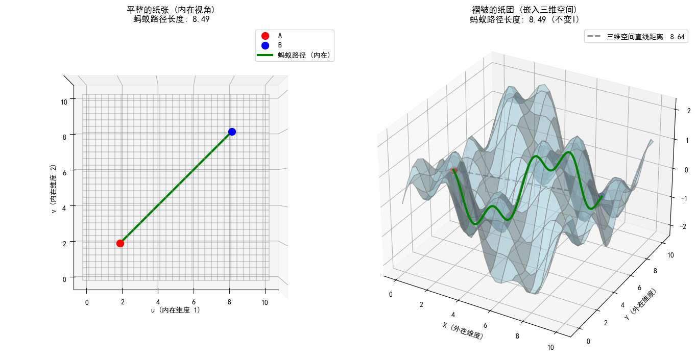

同时，在右侧看起来很复杂的 3D 图形中，表面上任何一点的位置虽然由 $(x, y, z)$ 三个坐标描述，**但真正独立的变量只有两个**。所以，这个复杂的形状本质上只有**两个自由度**。
这两个自由度，正是那只微小的蚂蚁眼中的世界

右图那个弯曲的表面就是这个“二维流形”。它嵌入在更大的三维空间里。

我们说，**这个纸团，是一个嵌入在三维空间里的二维流形。**

再来看下图一个经典的例子：

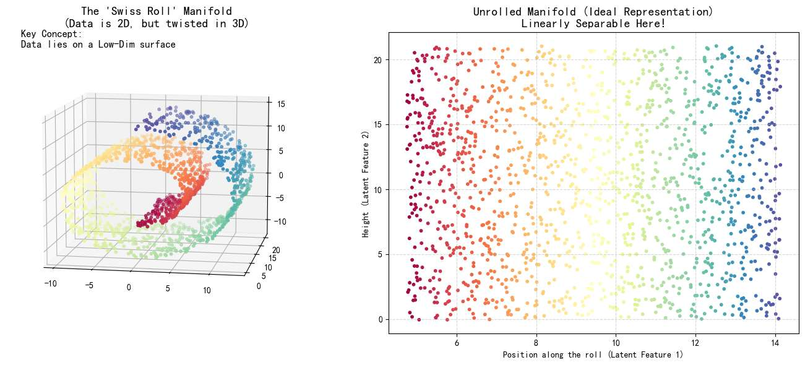

- **左图（高维视角）**：数据是三维的 ($x, y, z$)。
- **右图（流形视角）**：这堆数据的**本质**其实就是一个二维的长方形平铺纸，只是被卷进了三维空间里。

现在我们把这个概念迁移到图像上。

一张 $1024 \times 1024$ 的高清人脸照片，包含了约 100 万个像素点。
每个像素是一个变量（比如 0-255）

在计算机眼中，一张图是一个**100 万维的向量**，每个维度取一个变量后，确定的。

想象一下，这是一个拥有 100 万个坐标轴的超高维空间（就像刚才那个三维空间，只是现在变成了百万维）。

**如果你在这个百万维空间里随机取一个点，你会得到什么？**

相当于随机生成像素值，也许**99.999... 99% 的区域都是无意义的噪点图**

这些点，在二维视角，即我们人眼下，有这些约束
- 眼睛是对称的。
- 鼻子在嘴巴上面。
- 皮肤纹理是连续的。
- ...

这些规律，让关于人脸的像素点，**紧密地聚集在某个非常薄、非常卷曲的低维曲面上**。

这个曲面，就是**人脸流形**。

如果用自由度来讲，

决定“这张脸长什么样”的**核心变量（自由度）** 其实非常少，可能只有几十个：

比如性别、年龄、角度、光照、表情、发型……
只要确定了这几十个变量，这张百万像素的图就被确定了。

这些变量的个数，就是内在维度。
内在维度（自由度) 假设是 50 维，就代表了生成人脸的**潜在规律**，就由这 50 维决定即可。

这五十维就像那只“蚂蚁”眼中的坐标，即使升到 100 万维空间，蚂蚁依旧觉得他们没区别。

**这几十个核心变量，就是那只“蚂蚁”眼中的坐标（内在维度）；**
**而所有真实的人脸图像，就是那个卷曲在 100 万维空间里的“低维纸团”。**

如果蚂蚁沿着“流形”爬行，你会看到一个人的脸极其自然地通过扭头、变老，慢慢变成了另一个人的脸，全程都是清晰的人脸，不会出现噪点。

如果在 100 万维空间里做直线插值，即A点直接去B），你会穿过“噪声区域”，则两张脸渐变中间会出现鬼影或噪点。
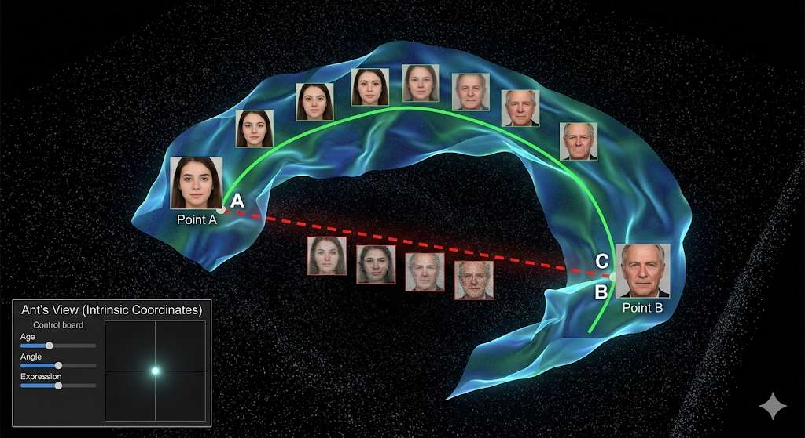

- **发光的蓝色扭曲表面**，就是嵌入在黑暗高维空间里的**人脸流形**
- **黑暗的背景**就是99.99%的无意义噪点区域
- **绿色的线（蚂蚁的路径）：** 始于一张脸（A点），终于另一张脸（B点）。关键是，它**始终没有离开过那个发光的表面**。如果你沿着这条线走，你看到的是一系列连续的、清晰的、符合逻辑的中间状态人脸（比如从侧脸平滑转到正脸）。
- **红色的虚线（直线插值）：** 它试图抄近道。离开了发光的流形，直接跳进了黑暗的虚空中。在这条路径的中点，你看到的不再是人脸，而是一个“**鬼影**”——那种叠加了噪声、结构崩坏的图像。

讲到这里，我们再次梳理一下。

面对低维但线性不可分的数据（如 XOR 问题），我们已经知道单靠一条直线是无解的。
为了解决这个问题，传统的思路（如多项式回归或 SVM 核函数）往往选择“升维”**——手动构造新的特征（例如 $x_1x_2$ 或 $x^2$），试图将数据映射到一个更高维的空间，使其线性可分。

然而，这种做法面临两个巨大的挑战：

1. **维数灾难与过拟合：** 盲目增加维度会引入大量噪声，导致计算量爆炸且模型泛化能力变差，极其容易过拟合。
2. **特征构造的局限性：** 对于简单数据我们尚可凭经验构造特征，但面对图像、语音等复杂数据，我们根本无法预知应该构造什么样的特征

对于维数灾难与过拟合，**流形假设**说没关系，数据其实是簇拥在一起的流形，所以我们可以通过空间变换，“展开流形”，像把纸团展平一样，再分类。
对于特征构造的局限性，我们在想，能不能构建一个模型，它不需要我们告诉它具体的公式（比如 $x^2$ 或 $x_1x_2$），而是能**自己学会**构造特征，直到数据变得线性可分？

那么对于高维数据的展平同理，能否让这个模型学会“展开流形”？

这就是设计**神经网络**的核心思想

接下来，我们将分别展示它是如何应对这两种情况的：

1. **面对低维纠缠（XOR）：** 看神经网络如何通过“折叠空间”，把原本对角线分布的点，强行归类到一边。
2. **面对高维流形（图像）：** 看神经网络如何利用**流形假设**，在像素噪声中找到那个卷曲的低维曲面，并把它一层层展开。

# 神经元

现在，暂时清空一下大脑，
让我们重新看 XOR 问题。

之前为了解决分类，我们人为地硬造了一个特征 $x_3 = (x_1-0.5)(x_2-0.5)$，强行把二维数据送上了三维空间。

但如果不允许这种“上帝视角”的操作，只给你最基础的线性画线工具，这题还能解吗？

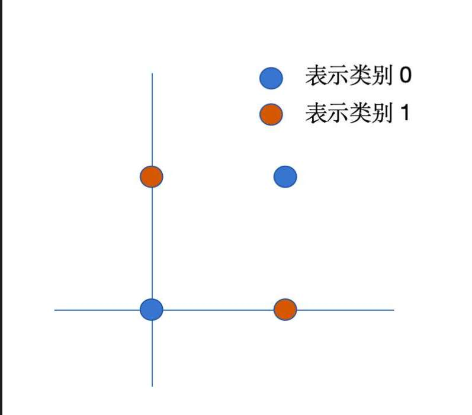

看上面这张图，既然画**一条**直线切不开，那我们画**两条**行不行？

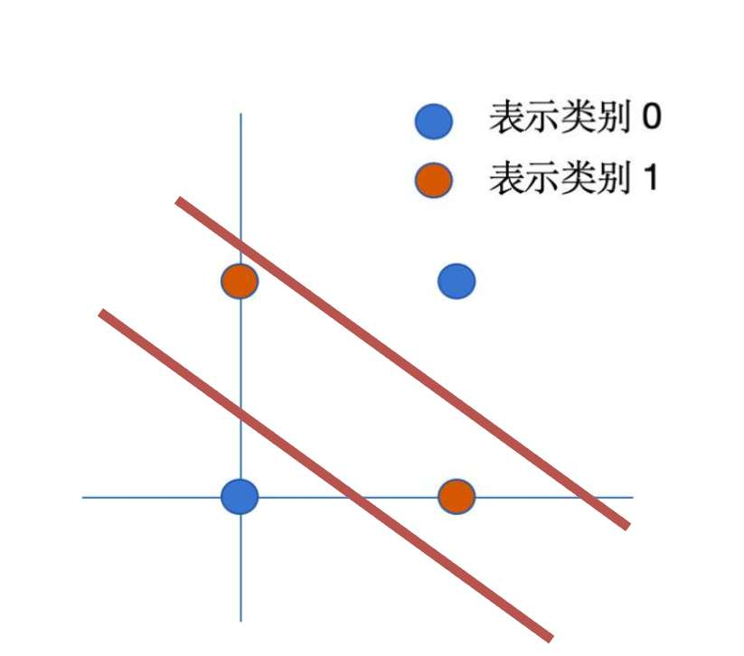

可以！

被这两条红线**夹在中间**的，就是类别 1（红点）；其余两头的是类别 0（蓝点）。

严谨一点描述这个几何逻辑：

- **红线 A**：划了一条界，把左下角的 $(0,0)$ 隔离在外面。
- **红线 B**：划了一条界，把右上角的 $(1,1)$ 隔离在外面。

只要一个点同时满足“在红线 A 右上方”**且**“在红线 B 左下方”，那它就是我们要找的红点！

如此，逻辑上就分完了

问题是，计算机不懂这种“在...之间”的自然语言描述。我们怎么用数学函数表达这个思想？

难道直接相加吗？

当然不行，线性加线性还是线性，两条直线方程叠加还是一条直线。

$$y = (w_1x + b_1) + (w_2x + b_2)$$

我们需要一种机制，能够表达上面的逻辑。

此时，我们引入非线性，即可做到。

非线性？在分类问题里面，非线性分类是什么意思？

我在之前文章介绍过，非线性通常意味着我们将线性计算的结果（$z = wx+b$），通过一个函数映射成一种“分数”：
-  将输出压缩到 **(-1, 1)** 之间，我们可以视正数为一类，负数为一类，数值绝对值大小，代表是这一类的“程度” tanh
-  将输出压缩到 **(0, 1)** 之间。如 sigmoid 函数，输出的值，是我们认同为某一类的程度，值越大，越可信。

可以看到，非线性函数有一种“自然语言”的味道。其输出的含义，其实可以由我们定义。

比如在现在的情景中，我们可以定义非线性是将线性计算的结果（$z = wx+b$），通过一个函数映射成一种“状态”
- **Sigmoid 函数**：将输出压缩到 $(0, 1)$。比如 0.9 代表“高度激活”，0.1 代表“抑制”。
- **ReLU 函数**：$f(x) = \max(0, x)$。这是一种更硬核的操作——“负数直接归零，正数保持不变”。

我们将线性模型 $z$，套上这些非线性函数 $\sigma(z)$，这就构成了一个完整的“神经元”。这些非线性函数，被称为  **“激活函数”**。

至于为什么这么叫，待会你一定能体会到。

那就是先上线性模型，然后再于其输出，套上上面说的这些“非线性函数”，
整个流程，我们称其为“神经元”！
这些非线性函数，我们称“激活函数”，

这样称呼的原因是 xxx（解释直觉）

现在我们看，他们究竟如何解决问题

我们构建两个神经元，分别代表那两条红线：

这里激活函数 $\sigma$ ，我们先用 Sigmoid 试一下

**神经元 1（$h_1$）：负责切左下角**
*   先画线：$z_1 = w_1 x + b_1$ （对应红线 A）。
*   再激活：$h_1 = \sigma(z_1)$ ，。
*   **效果**：具体映射...

**神经元 2（$h_2$）：负责切右上角**
*   先画线：$z_2 = w_2 x + b_2$ （对应红线 B）。
*   再激活：$h_2 = \sigma(z_2)$。
*   **效果**：具体映射...。

还记得我们开头讲的那个手动构造的特征 $x_3$ 吗？
当时我们把 $(x_1, x_2)$ 映射成了 $(x_1, x_2, x_3)$，在三维空间里解决了问题。

现在，看看我们的两个神经元 $h_1$ 和 $h_2$。
对于每一个输入数据 $(x_1, x_2)$，我们通过两个神经元，计算出了两个新的数值 $(h_1, h_2)$
对于 sigmoid 激活函数，我们是...
对于 ReLu，我们是....

这意味着我们把原始数据，映射到了一个新的坐标系里——**$(h_1, h_2)$ 坐标系**！

*   **手动做法**：你自己猜公式，造出了 $x_3$。
*   **神经网络做法**：它通过两个神经元（两条直线+激活函数），**自动创造**出了两个新的特征 $h_1$ 和 $h_2$。（能不能详细解释是什么特征）

然后就回到了我们最开始的那种

增加一个新维度 $x_3 = (x_1 - 0.5) \cdot (x_2 - 0.5)$ 的升维图，

激活函数登场！
我们先用 ReLU    $h=max(0,z)$ 
我们规定 z 就是线性模型。
下面的红线是 z1 上面的红线是 z2

 $h_1$ 的操作
*   $z_1 = x_1 + x_2 - 0.5$
*   $h_1 = \text{ReLU}(z_1)$
    *   在左下角 $(0,0)$，$z_1 = -0.5$，**$h_1$ 被强行变成 0**。
    *   在中间区域和右上角，$z_1 > 0$，**$h_1$ 有值（正数）**。
    *   **逻辑含义：** “只要你在直线 A 的右上方，我就是 1（或正数），否则我是 0”。

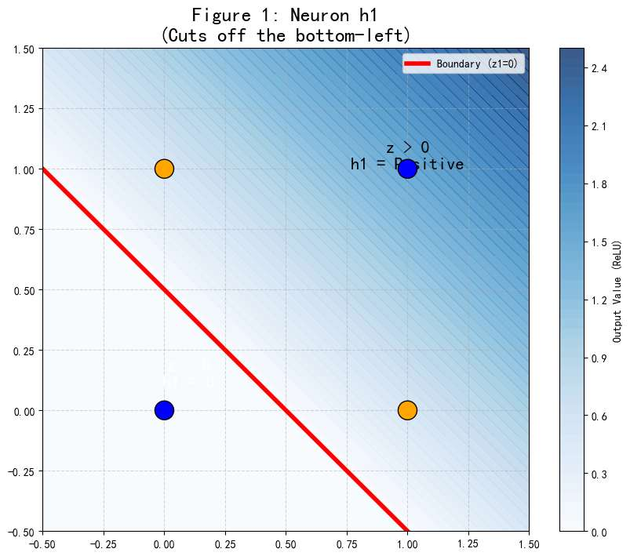

 $h_2$ 的操作（模拟 "<= 1.5"）
*   $z_2 = -x_1 - x_2 + 1.5$
*   $h_2 = \text{ReLU}(z_2)$
    *   在右上角 $(1,1)$，$z_2 = -0.5$，**$h_2$ 被强行变成 0**。
    *   在中间区域和左下角，$z_2 > 0$，**$h_2$ 有值（正数）**。
    *   **逻辑含义：** “只要你在直线 B 的左下方，我就是 1（或正数），否则我是 0”。
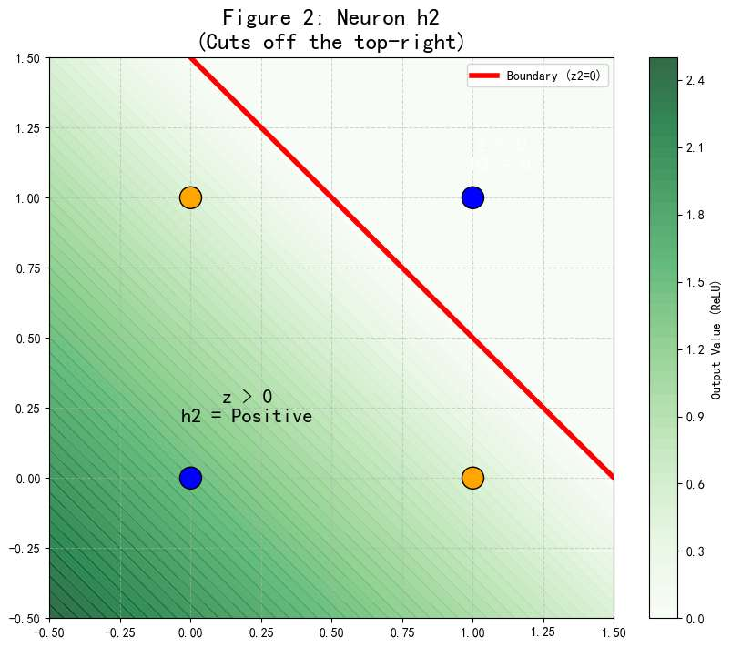

输出层把这俩加起来：$y = h_1 + h_2$。
*   **左下角 (0,0)：** $h_1=0$ (被 ReLU 砍了), $h_2=正$。总分低。
*   **右上角 (1,1)：** $h_1=正$, $h_2=0$ (被 ReLU 砍了)。总分低。
*   **中间区域 (0,1) 或 (1,0)：** $h_1=正$, $h_2=正$。**俩都没被砍！总分极高！**

所以我们能靠输出的分，分类了
因为 ReLU 把负值强行归零了，这就是“非线性”的功能
然后我们就可以靠“分数”分类

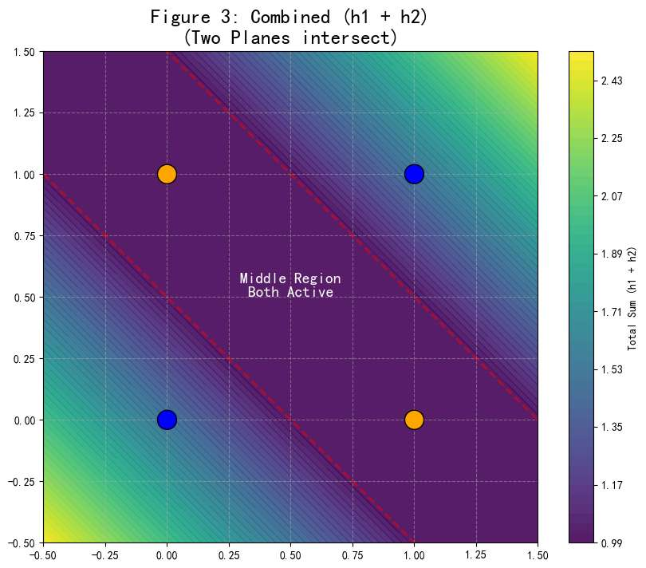

现在我们把 ReLU 换成 **Sigmoid**试试  
$$ \sigma(z) = \frac{1}{1+e^{-z}} $$

给出一个 0 到 1 之间的平滑分数。

 $h_1$ ：

*   它说：“在红线附近，我是 0.5；往右一点，我是 0.6, 0.7...；往左一点，我是 0.4, 0.3...”。

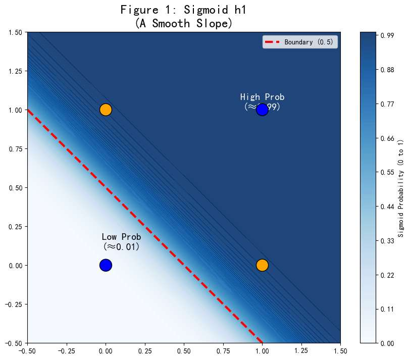

 $h_2$ 
-   同理，
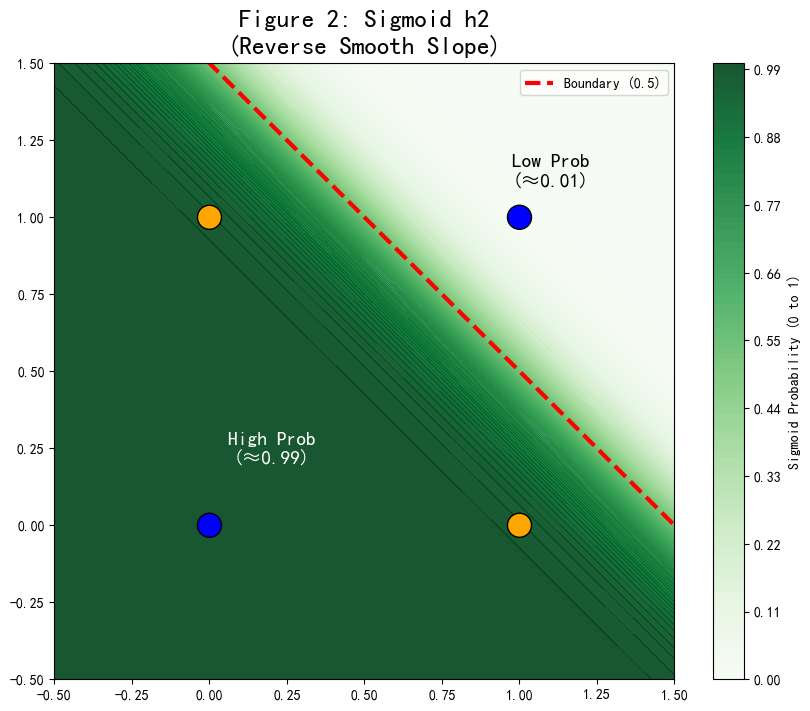

当我们把这两个“坡”加在一起时：$y = \sigma(z_1) + \sigma(z_2)$。

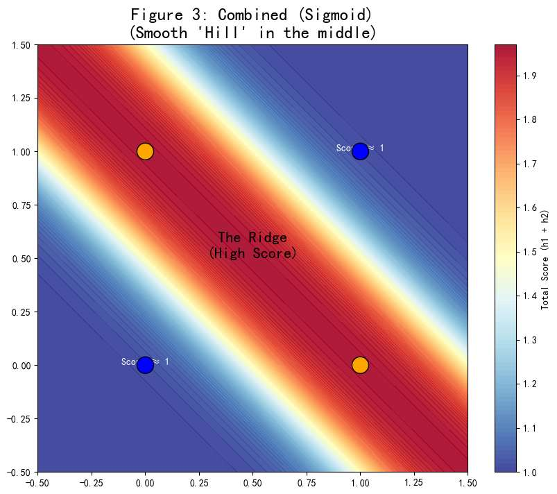

可以看到其实和 ReLU 是类似的
主要区别就是，单图来说它在红线附近是模糊的（0.5 左右）
叠加后也是边缘是非常**圆润、模糊**的。不像 ReLU 那样有棱有角。

总之，我们引入非线性函数然后叠加非线性函数
真的实现了我们刚才画的这俩条线

#### 第一阶段：神经元——最小的折纸机器
*   **承接 XOR**：既然一条线分不开，那我们用**两条线**切两刀行不行？
*   **神经元的本质**：回顾逻辑回归。一个神经元就是一个线性分类器（一把刀）。
*   **激活函数（ReLU）**：这是神来之笔。
    *   不要只讲公式，要讲几何意义。
    *   **ReLU 的几何意义是“折叠”**。
    *   $\max(0, x)$ 相当于把坐标轴的一半给“折”起来了。
    *   通过组合两个神经元（两把刀）+ ReLU（折叠），我们就能把异或问题的红蓝点，在空间中通过“折纸”的方式分开。（这里可以用经典的 XOR 网络结构图解）。

#### 第二阶段：多层感知机 (MLP)——流形的展开者
*   **深度（Deep）的意义**：为什么要很多层？
    *   一层神经元只能切一刀。
    *   两层神经元可以围出一个多边形。
    *   **多层神经元（深度学习）**：就是在做**连续的拓扑变换**。
*   **几何视角（核心）**：
    *   输入层是那个“揉皱的纸团”（纠缠的人脸数据）。
    *   每一层隐藏层，都是在一双“大手”，在尝试把纸团**拉伸、扭曲、展开**。
    *   **激活函数**提供了扭曲和折叠的能力（线性变换只能旋转缩放，展不开纸团）。
    *   **输出层**：当流形最终被拉平（Flattened）成一张平整的纸时，最后一层线性分类器只需要轻轻一划，就完成了分类。

#### 第三阶段：前向传播——数据的奇幻漂流
*   用一个具体的例子（比如手写数字识别 MNIST）来串联前向传播的过程。
*   **输入**：一堆像素值（原始流形坐标）。
*   **第一层**：检测边缘（比如这里有个横，那里有个竖）。这实际上是在寻找流形的局部切平面。
*   **中间层**：组合特征（圆圈、转角）。这实际上是在拼接流形的局部结构。
*   **高层**：抽象概念（这是个"8"）。流形被完全展开，不同数字被推到了空间的不同角落。
*   **输出**：Softmax 给出的概率。