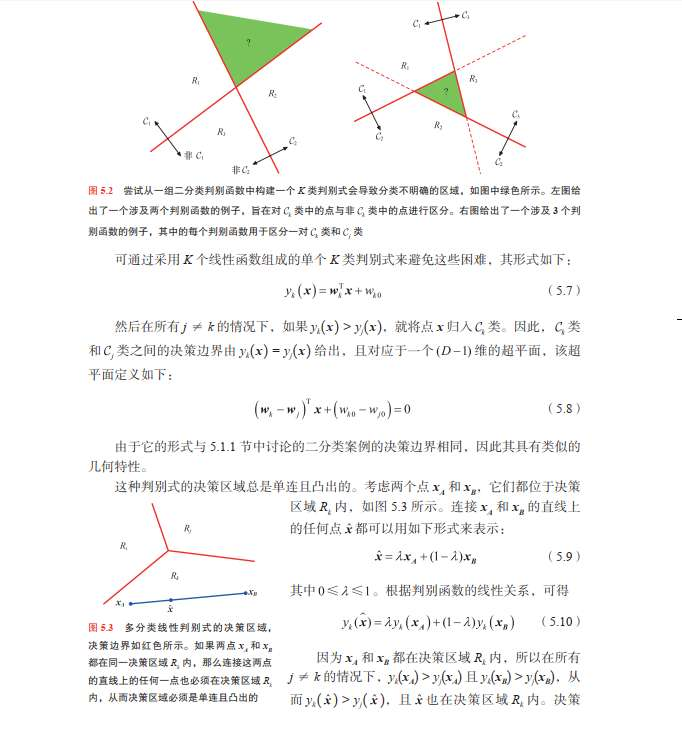

解决分类问题
- 判别函数，输入 x 直接输出类
- 判别概率模型，直接确定条件概率 p (Ck|x)
- 生成概率模型，基于贝叶斯公式，把每一项都计算出来

首先研究判别函数
二分类：
线性判别函数。
y>0 是一类，<0 是另一类 
在 y=0 上的点无法决策
 y=0 叫超叫决策面，也叫决策边界。
- 在二维空间，它是一条直线。
- 在三维空间，它是一个平面。
- 在高维空间，它叫**超平面 (Hyperplane)**。
然后这个线性判别函数，也是，x 可以是 x 的基函数，即某些特征。
然后还可以进一步，
支持向量机就是其进阶，加了一些概念而已？
加了最大间隔、核函数，一些数学技巧。

进一步叫什么广义线性模型
就是再用一个函数套在线性模型
感觉感知机就是，套一个激活函数，**阶跃函数**？+1,-1
    $$ f(a) = \begin{cases} +1, & a \ge 0 \\ -1, & a < 0 \end{cases} $$
逻辑回归就是，套一个 sigmoid 激活函数？
$$ h_{\mathbf{w}}(\mathbf{x}) = \frac{1}{1 + \exp(-\mathbf{w}^T \mathbf{x})} $$
  **它有极强的概率意义**。输出值直接代表 $p(C_1|x)$。
  
这俩本质也算线性模型
决策边界是线性的
*   对于逻辑回归，我们判断类别的标准通常是 $p \ge 0.5$。
*   Sigmoid 函数 $\sigma(a) = 0.5$ 意味着什么？意味着输入 $a = 0$。
*   而 $a = \mathbf{w}^T \mathbf{x} + w_0$。
*   所以，决定类别的分界线依然是 $\mathbf{w}^T \mathbf{x} + w_0 = 0$。

多分类：
感觉这个，书上介绍的比较古老，
使用线性模型一对一、一对多。
我的理解就是，一对一是每一类专门一个线性模型，分类为此类/其他，然后输出自己的值，最后看哪一类值高就是哪一类
一对多是，对每一“类对”都有一个分类器，比如这个分类器是 c1 与 c2，那个分类器是 c1 与 c3. 这个方法显然分类器特别多。最后得到的结果，类别数多的就是哪一类。

到达怎么解决那个“绿色区域”问题的 

“最小二乘法给出了判别函数参数的精确闭式解。然而，即使作为一个判别函数
（我们直接用它来做决定，且不需要做任何概率解释），它也存在一些严重的问题。你
已经看到，在高斯噪声分布的假设下，平方和误差函数可以看作负对数似然（参见
2.3.4 小节）。如果数据的真实分布明显不同于高斯分布，则最小二乘法的结果就会很
差。特别是，最小二乘法对离群值（与大部分数据点相距甚远的数据点）的存在非常
敏感，如图 5.4 所示。我们可以看到，图 5.4 右图中的附加数据点使决策边界的位置发
生了显著变化，尽管这些数据点会被左图中的原始决策边界正确分类。平方和误差函
数对距离决策边界较远的数据点赋予了过高的权重，即使这些数据点是被正确分类的。
离群值可能由于罕见事件，或仅仅由于数据集中的错误而产生。由此，对极少数数据
点敏感的技术是缺乏鲁棒性的。为便于比较，图 5.4 还显示了使用一种称为逻辑斯谛
回归（logistic regression）的技术（参见 5.4.3 小节）得出的结果，该技术对离群值的
鲁棒性更强。回想一下，最小二乘法对应的是高斯条件分布假设下的最大似然，而二进制目标向
量的分布显然远非高斯分布，于是最小二乘法的失败也就不足为奇了。通过采用更合适
的概率模型，我们可以获得相比最小二乘法性能更好的分类技术，而且还可以将其扩展
以得到灵活的非线性神经网络模型，详见后续章节”
这里又在说什么