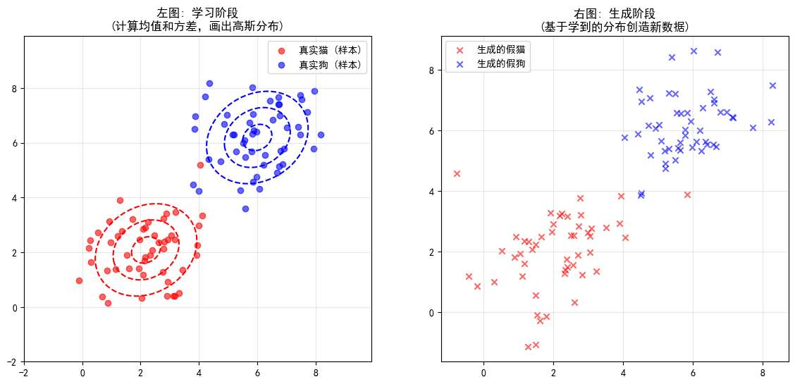
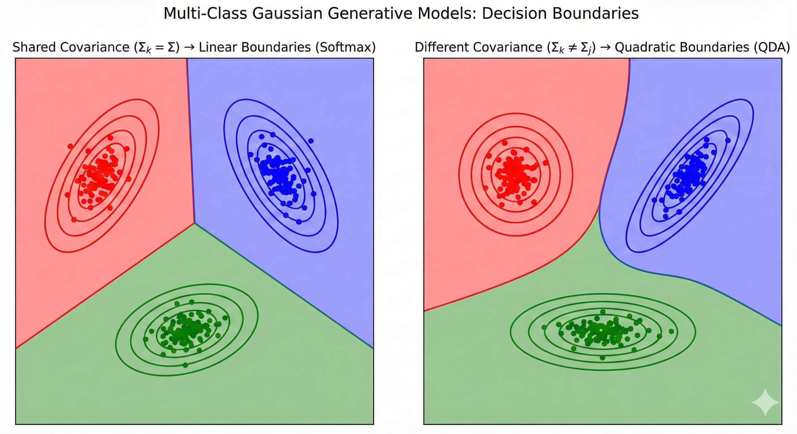
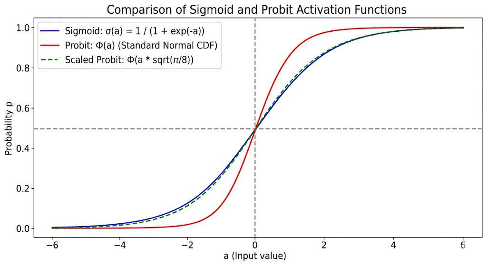
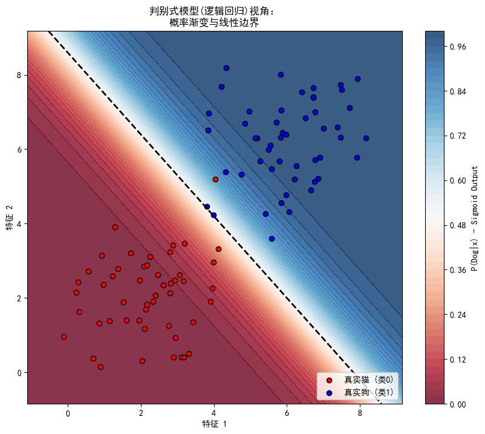
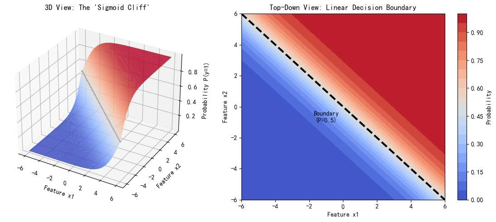
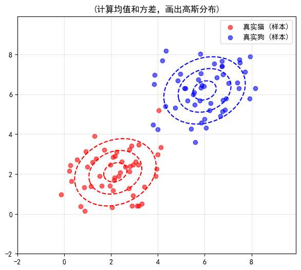

上篇文章，我写的是“概率视角重构线性回归”。

本篇文章，我们仍然用概率视角，研究另一种非常基础又重要的问题---**分类**。

在进入分类之前，我们先用一个简单的例子复习一下概率视角的本质：

比如我们数据集里有一个点，$(x=1, t=1)$ ，
**传统视角**认为 $t=1$ 是一个绝对的观测。
**概率视角**认为 $x=1$ 是固定的，但观测到的 $t=1$ 满足一个概率分布

视 x 固定，若我们说t 满足高斯分布

其意思是：
在 $x=1$ 这个位置，真实世界其实存在一个**以理想值（比如 0.9）为中心，方差为 $\sigma^2$ 的高斯分布**。
我们看到的 $t=1$，只是从这个分布里随机抽出来的一次**观测值**。它恰好落在了这里(只是这里恰好是高斯分布的高概率区域，比如 95% 区间内)，下一次观测可能就是 0.8 或 1.1。

当然，我们甚至可以更进一步：认为输入 $x$ 本身也是不确定的。
这意味着我们不是在几个固定的 $x$ 处观测，而是把 $x$ 也看作从某种分布 $p(x)$ 中采样出来的随机变量。这在后文讲“生成模型”时会非常重要。

如图，采样红色簇类别的数据时，因其满足某个概率分布我们在 2 附近采样的 x 特别多

概率分布的思想贯穿全文，在文章**末尾会再次总结**，**现在看不懂不必畏难**。

回到分类问题。假设有 $K$ 个类别，用 $C_k$ 表示第 $k$ 类。
回归问题预测的是连续的 $t$，而分类问题预测的是离散的类别。

我们的终极目标是求出**后验概率**：
$$ P(C_k | \mathbf{x}) $$
*注：因为类别是离散的，这里通常用大写 $P$ 表示概率质量，而不是小写 $p$ 表示概率密度。但在非严格语境下混用也无妨。*

或者我们也可以说条件概率，显然他的意义为：看到了特征 $x$ 之后，它属于类别 $k$ 的概率是多少？

有了这个概率，我们就可以进行**决策**。
直觉上，概率谁大选谁：
$$ \text{预测类别} = \arg\max_k P(C_k | \mathbf{x}) $$
当然，如果有风险矩阵——比如把癌症误诊为感冒的代价很大——我们就需要加权决策，这属于决策理论的范畴。

那么高屋建瓴地看，为了得到分类结果，
若以概率角度出发，我们最终要求出 $P (C_k | \mathbf{x})$。
求这个概率的过程一般也叫做“**推理过程**”

我们有俩种做法
- 判别概率模型，直接确定条件概率  $P (C_k | \mathbf{x})$
- 生成概率模型，不直接算 $P(C_k | \mathbf{x})$，而是先算出每一类数据长什么样 $p(\mathbf{x} | C_k)$ 以及每一类有多常见 $P(C_k)$。
	利用贝叶斯公式把它们组合起来：

$$ P(C_k | \mathbf{x}) = \frac{p(\mathbf{x} | C_k) P(C_k)}{p(\mathbf{x})} $$

不过，在实际中，很多经典的方法也不需要用概率，连确定类别也不是通过 $P (C_k | \mathbf{x})$ 确定。

我们称其为“**判别函数**”，他学一个函数 $f(x)$，输入 $x$ ，直接输出类别标签。

让我们先来了解经典的**判别函数**。
# 判别函数
判别函数从最直观的视角切入：**不谈概率，只谈划线。**
如果把分类问题看作几何问题，我们的目标就是找到一个几何边界，把不同颜色的点分开。
## 线性判别函数

这是最基础的模型。这里的“线性”是指决策边界是线性。
$$ y(\mathbf{x}) = \mathbf{w}^T \boldsymbol{\phi}(\mathbf{x}) + w_0 $$
*   $\mathbf{w}$：权重向量，决定了线的方向（几何视角看，是法向量）
*   $w_0$：偏置，决定了线离原点有多远。
*   $\boldsymbol{\phi}(\mathbf{x})$：基函数，可以是 $x$ 的各种形式，可以理解为特征组合

以二分类为例：
*   若 $y(\mathbf{x}) > 0$，判定为类别 $C_1$。
*   若 $y(\mathbf{x}) < 0$，判定为类别 $C_2$。
*   若 $y(\mathbf{x}) = 0$，则位于**决策边界** 上，无法决策。

这个 $y(\mathbf{x}) = 0$ 长什么样？
- 在二维空间，它是一条直线。
- 在三维空间，它是一个平面。
- 在高维空间，它叫**超平面**。

我觉得进一步可以引出“**线性可分**”概念， 

以几何视角最直观，
如果存在一个超平面，能完美地把俩类数据（红点和蓝点）切开，没有任何错误，我们就说这份数据是“线性可分”的。

##  进阶一：支持向量机 (SVM)
不知道大家是否对大名鼎鼎地 SVM有所耳闻，
然而，支持向量机完全可以视作普通线性判别的进阶，加了些概念和数学技巧而已，简单提一下，不展开
*   可以理解为，这个线性模型，通过最大化决策边界到最近样本点的距离，即逼迫模型“分得干净分得好”而得出线性判别函数。
*   数学目标：$\max \frac{1}{||\mathbf{w}||}$（等价于最小化 $||\mathbf{w}||^2$）。
*   如果原始空间分不开（线性不可分），它能通过数学技巧（**核函数**）把数据升到高维空间，让它们在高维变得线性可分。这个过程叫**核技巧**
* SVM 得出的线性模型，比我们自己用解析解或者梯度下降得到的普通线性判别函数，更加准确

## 进阶二：感知机 (Perceptron)

它的形式是只在线性模型外面套一个**阶跃函数**：
$$ f(a) = \begin{cases} +1, & a \ge 0 \\ -1, & a < 0 \end{cases} $$

这样一看，似乎感知机对比简单的线性判别就是**创造出了个标签**：
线性判别得到的结果仍是是**数字**，然后我们人为决策说大于 1 的是一类，小于 1 是一类，
但感知机是算出来的数强行变成 +1/-1，视作俩个标签。

这有啥好处？

好处在于求最优 $w$ 的 “训练过程”

**普通线性回归**关注的是“数值误差”。如果一个点本身是类 1（目标+1），你预测它是 +100，普通线性回归配套“最小二乘法”，会觉得你错得离谱（因为它想让你接近 1），从而惩罚这个“过于正确”的点。这会导致决策边界被拉偏。

如图，一些离群点完全可以把完美的分类线（绿色）拉到紫色线位置。

而**感知机**关注的是“分类错误”**。
*   **如果分对了**（比如目标是+1，算出是正数），就**完全不管**，也不更新参数。不管算出来是 +0.0001 还是 +1000，最后输出的符号都是+1 嘛，只要符号对，我就认为没误差。
*   **只有分错了**（比如目标是+1，算出是负数），才更新参数。可以看下他的损失函数（代价函数）：
$$ L(w) = - \sum_{x_i \in M} y_i (w^T x_i + b) $$

    *   $M$ 是 **误分类点** 的集合。
    *   即求和只针对**判错**的点，判对的点不参与求和（Loss=0）。

这种机制使得感知机**只关注错分样本**，不会被那些“离得很远的正确样本”（离群值）带偏。

##  多分类：一对多 vs 一对一

线性判别函数应用于多分类问题，我不详细展开，
因为多分类问题主要还是概率视角最好。

简单提一下

对于 $K$ 个类别（比如 3 类：猫、狗、猪）：

 **一对多**：训练 $K$ 个分类器。 比如：**猫 vs (狗+猪)**；**狗 vs (猫+猪)**...
然后哪个分类器数大，选哪个分类器。
当然，会出现“三不管地带”。比如一个点，猫分类器说“不是猫”，狗分类器说“不是狗”，那就没法分了。

**一对一**：训练 $K(K-1)/2$ 个分类器。 比如：**猫 vs 狗**；**猫 vs 猪**；**狗 vs 猪**。
最后分类器分，谁被判定的次数多就是谁。

当然也有比较**通用的解法**，直接训练 $K$ 个线性函数 $y_k(x)$，然后取最大值：
$$ \text{Predicted Class} = \arg\max_k y_k(x) $$
把空间切得干干净净，没有模糊区域。

# 生成式概率模型
下面我们来讲生成式概率模型，

在上一节我们知道，于概率视角出发，想要做分类，本质上就是求后验概率 $P(C_k | \mathbf{x})$。

回忆一下，我们想用贝叶斯公式求 $P (C_k | \mathbf{x})$ ，即
$$ P(C_k | \mathbf{x}) = \frac{p(\mathbf{x} | C_k) P(C_k)}{p(\mathbf{x})} $$

这个思路其实是试图去理解数据的**产生机制**。

如果我们知道“猫”长什么样（$p(\mathbf{x}|C_{cat})$），也知道“狗”长什么样（$p(\mathbf{x}|C_{dog})$），甚至知道这世界上猫和狗谁更多（先验 $p(C_k)$），那我们就能用**贝叶斯公式**反推出眼前这个 $x$ 是谁。

$$ P(C_k | \mathbf{x}) = \frac{p(\mathbf{x} | C_k) P(C_k)}{p(\mathbf{x})} $$
**所以现在看看“生成式”这个名字的由来**
既然我们求出了 $p(\mathbf{x}|C_k)$，这意味着我们掌握了数据的分布规律。
我们甚至可以根据这个分布，“生成”出一张新的猫的照片，或者造出一条从未出现过的狗的数据。

我们来一个生成式模型的例子，来感受什么叫“生成式”
## 高斯判别分析 (GDA)

来一个最经典的二分类问题。
假设我们要区分“猫”和“狗”。

生成式模型的第一步，是**分别**研究它们。

我们通常假设：
*   所有“猫”的特征 $x$（这里我们假设二维特征，体重、身长），服从一个**高斯分布**。
*   所有“狗”的特征 $x$，服从另一个**高斯分布**。

为了简单起见，我们假设共用同一个协方差矩阵 $\Sigma$（形状一样），只是中心位置不同。

想要建立出他们的高斯模型，我们需要从数据中汲取出大量信息。我们需要计算：
1.  **猫的平均长相** $\boldsymbol{\mu}_1$（猫类数据的均值）。
2.  **狗的平均长相** $\boldsymbol{\mu}_2$（狗类数据的均值）。
3.  **身材的胖瘦** $\boldsymbol{\Sigma}$（数据的协方差矩阵）。
4.  **物种比例** $p(C_1), p(C_2)$（先验概率，比如猫占 40%，狗占 60%）。

**感受一下：**
比如说，通过猫的数据，共 20 个点，我们算均值、协方差矩阵，得到猫的高斯分布。
如左图
我们假设所有可能的猫，都满足这个高斯分布，所以我们可以自己创建出更多猫的点！
如右图
这就是“生成二字”的来源！

这样，在左图中，我们就画出了俩坨“分布”，
分类自然是一清二楚。

来一个新样本点，我们看他离哪坨分布更近即可。
这比仅仅画一条分类线要麻烦得多！
但我们完全掌握了类别的信息。

但是，这里的“近”不能只用欧氏距离。因为数据可能有“胖瘦”之分，由协方差 $\Sigma$ 决定。
比如，如果“猫”的分布在身高方向拉得很长，那么在身高方向偏离远一点点，其实不算远。
统计学中有一个专门的度量，叫**马哈拉诺比斯距离**，也叫“马氏距离”：
$$ D_M(x) = \sqrt{(x - \mu)^T \Sigma^{-1} (x - \mu)} $$
乘了 $\Sigma^{-1}$，就是在对不同方向的距离进行“归一化”。

## 推导 Sigmoid

虽然比较距离很直观，但用概率视角的话，我们还是要计算 $p (C_1|x)$ 。

梳理一下，
现在，我们手里有了两个高斯分布。
当一个新的数据点 $x$ 进来时，我们要判断它是猫是狗。

我们将高斯分布的公式代入贝叶斯公式：
$$ p(C_1 | x) = \frac{p(x | C_1) p(C_1)}{p(x | C_1) p(C_1) + p(x | C_2) p(C_2)} $$

然后对式子进行化简，接下来我将推导一个有趣的结论。

我们来看 $C_1$ 的概率：

$$ p(C_1 | x) = \frac{p(x | C_1) p(C_1)}{p(x | C_1) p(C_1) + p(x | C_2) p(C_2)} $$

为了简化这个式子，分子分母同时除以分子 $p(x | C_1) p(C_1)$。

$$ p(C_1 | x) = \frac{1}{1 + \frac{p(x | C_2) p(C_2)}{p(x | C_1) p(C_1)}} $$

这时候我们引入**对数 ($\ln$) 和指数 ($\exp$)** 这一对互逆操作：
$$ \exp \left( \ln \frac{p(x | C_2) p(C_2)}{p(x | C_1) p(C_1)} \right) = \exp \left( - \ln \frac{p(x | C_1) p(C_1)}{p(x | C_2) p(C_2)} \right) $$

现在，我们把 $\ln$ 里面的东西定义为 $a$：
$$ a = \ln \frac{p(x | C_1) p(C_1)}{p(x | C_2) p(C_2)} $$

把 $a$ 代回去，我们最终可以如此简化最终的 $P (C_k | \mathbf{x})$：
$$ p(C_1 | x) = \frac{1}{1 + \exp(-a)} = \sigma(a) $$
到这里，如果有机器学习/深度学习基础，你就会发现，这就是**Sigmoid 函数 ($\sigma$)** 的形式！

不管是多么复杂的高斯分布，经过贝叶斯公式的“消化”后，最终输出的后验概率形式，必然是 **Sigmoid 函数**

它就是贝叶斯公式，在二分类情况下，得到的 $P (C_k | \mathbf{x})$ ！

进一步，
那个 $a$ 的定义：
$$ a = \ln \frac{p(x | C_1) p(C_1)}{p(x | C_2) p(C_2)} = \underbrace{\ln \frac{p(x | C_1)}{p(x | C_2)}}_{\text{核心项}} + \underbrace{\ln \frac{p(C_1)}{p(C_2)}}_{\text{常数项}} $$
这里是一个复杂的对数比率。

当我们把高斯分布的具体公式（带有 $x^2$ 的指数项）代入到这个 $a$ 里时：
$$ p(x|C_k) \propto \exp\left( -\frac{1}{2}(x-\mu_k)^T \Sigma^{-1} (x-\mu_k) \right) $$

*   高斯分布里有 $x^2$ (二次项)。
*   但在 $\ln$ 里做除法（即相减）时，**$x^2$ 项抵消了**
*   最后只剩下 $x$ 的一次项。

最后，$a$ 变成了一个关于 $x$ 的**一次函数**：
$$ a(x) = \mathbf{w}^T \mathbf{x} + w_0 $$
$$\mathbf{w} = \Sigma^{-1}(\mu_1 - \mu_2)$$
**只要假设数据服从高斯分布，那个 $a$ 就一定是一个关于 $x$ 的线性函数**

代回 Sigmoid，就得到了我们最熟悉的**逻辑回归**：
$$ p(C_1 | x) = \sigma(\mathbf{w}^T \mathbf{x} + w_0) $$

也就是，整个流程是这样的
1.  从数据里算出每一类的均值 $\mu_1, \mu_2$。
2.  算出协方差矩阵 $\Sigma$。
3.  算出先验概率 $\pi$。
4. 接下来有来一个新数据，一种做法是，计算马氏距离
5.  一种做法是，计算  $p(C_1 | x) = \sigma(\mathbf{w}^T \mathbf{x} + w_0)$，其中$\mathbf{w} = \Sigma^{-1}(\mu_1 - \mu_2)$

## 多分类问题（推导 Softmax）
假设有 $K$ 个类，根据贝叶斯定理：

$$ p(C_k | x) = \frac{p(x | C_k) p(C_k)}{\sum_{j=1}^K p(x | C_j) p(C_j)} $$

我们要把它变成漂亮的指数形式。于是我们定义 $a_k$：
$$ a_k = \ln \big( p(x | C_k) p(C_k) \big) $$

那么，分子就变成了 $\exp(a_k)$。
分母就变成了 $\sum \exp(a_j)$。

于是公式变成了：
$$ p(C_k | x) = \frac{\exp(a_k)}{\sum_{j} \exp(a_j)} $$

**这就是 Softmax（归一化指数函数）。所以它是贝叶斯公式在多分类下的化简，一种自然形态。**  

**Softmax 这个形式本身**不需要高斯分布假设，就是这个形式。

而如果希望 $a_k(x)$ 是 $x$ 的**线性函数**（即 $a_k = \mathbf{w}_k^T \mathbf{x}$），那么我们需要假设数据服从高斯分布且协方差共享。

否则 $a_k$ 可能是 $x$ 的二次函数（那就是二次判别分析 QDA，边界是弯的）。

（由 nanobanana 生成）
左图，共享协方差 ($\Sigma_k = \Sigma$) 能推出线性边界 
右图，不同协方差 ($\Sigma_k \neq \Sigma_j$) 是二次边界 
# 判别式概率模型

现在我们要进入判别模型了。

判别模型的思路很简单，**我不关心数据是怎么生成的，我只关心怎么把 $x$ 映射成概率 $p$。**
无论怎么得出的 $p (C_k|x)$ 不重要，得到了就行。

**我们可以随意定义模型吗？**
理论上可以。只要找一个函数 $f(x)$，能把输入映射到 $(0, 1)$ 之间，它就能当分类器。

我们最常用的是先把输入 x 映射到线性输出，
再把线性组合 $a = \mathbf{w}^T \mathbf{x} + w_0$ 的结果（范围 $-\infty$ 到 $+\infty$）“挤压”到 $(0, 1)$ 之间，作为 $p (C_k|x)$ 概率输出。

比如之前，统计学家常用 **Probit 函数**。

$$ p(C_1|x) = \Phi(\mathbf{w}^T \mathbf{x} + w_0) $$
其中，$\Phi(a)$ 是标准正态分布的累积分布函数，其数学积分形式为：

$$\Phi(a) = \int_{-\infty}^{a} \mathcal{N}(z|0,1) \, dz = \frac{1}{\sqrt{2\pi}} \int_{-\infty}^{a} e^{-\frac{z^2}{2}} \, dz$$

因为它是一个概率密度的积分，所以它的值域严格在 $(0, 1)$ 之间，且单调递增，形状是一个漂亮的 S 型。

但是！我们最常用的生成式概率模型，就是前文推导过的 sigmoid 函数，
正如上一节生成模型推导的，它在高斯分布假设下是自然产生的形式。

既然通过研究数据的物理分布，推导出自然界的分类边界本该就是 Sigmoid 形式的，那就直接那这个形式当作判别式模型呗！

现在我们再正式地介绍下 sigmoid 

**Sigmoid 模型的公式形式：**

$$p(C_1|\mathbf{x}) = \sigma(\mathbf{w}^T \mathbf{x} + w_0)$$

其中，Sigmoid 函数 $\sigma(a)$ 的定义为：

$$\sigma(a) = \frac{1}{1 + e^{-a}} = \frac{e^a}{1 + e^a}$$

如上图所示，我们可以看到：

- 无论是红色的 Probit 曲线（经过缩放后）还是蓝色的 Sigmoid 曲线，它们都是“S型”的（Sigmoidal）。当然，这只是函数形式，只有"S 型"能更好得压缩出概率

- 当 $a \to \infty$ 时，$p \to 1$。
- 当 $a \to -\infty$ 时，$p \to 0$。
- 当 $a = 0$ 时（即在决策边界 $\mathbf{w}^T\mathbf{x} + w_0 = 0$ 上），$p = 0.5$。

在之前的生成式模型中，我们对数据集要算均值、协方差、先验，建模出高斯分布，然后对新样本再看离哪簇分布最近。

在判别式模型中，我们的任务变成了：**直接通过梯度下降等优化算法，去寻找最佳的 $\mathbf{w}$ 和 $w_0$，使得这个决策边界 $\mathbf{w}^T \mathbf{x} + w_0$ 能最好地把两类样本分开。**

我们不再关心 $\mu$ 是多少，也不关心 $\Sigma$ 是多少，我们只关心这根 S 曲线的形状和位置。

我们仍然用前文举过的“猫狗分类”例子，

看看其到底怎么体现“**判别式概率模型**”的

 这就是 Sigmoid 函数在二维平面上的样子
左下角的**深红色区域**，极度确信是猫，平滑地过渡到右上角的极度确信是狗的**深蓝色区域**
中间那条白色的过渡带，是 P=0.5 的地方，
其中的**黑色虚线**是一条笔直的**直线**。

如果看它的 3D 图，就能看出“S 形”的体现。

对比生成式模型，画出高斯分布像是画了两个精确的圈，画出了数据的分布，圈里是种类。

# 损失函数

我们可以看到，生成式概率模型不需要“训练”，
只要有足够多的样本，建模出数据分布，无论来多少新样本都能进行分类。

而判别式概率模型，在初试的时候我们的参数是随机的，
我们需要通过“训练”校准参数。

自然而然的，我们就需要研究下其损失函数怎么设计的好。

本节仍然介绍的是 sigmoid，二分类。

## 最大似然视角
在上一篇关于线性回归的文章，我们是直接似然概率 p (t|w, x..) 这个目标来推出损失函数用什么比较好，
这里，t 是连续数值，我们假设它服从**高斯分布**，从而推导出“最小化平方误差”等价于“最大化似然”。

现在来到分类问题，我们仍然可以用似然概率推导损失函数，
但我们的标签 $t$ 变了：
*   它是离散的类别，不再是连续数值。
*   对于二分类，标签只有 $0$ 或 $1$。

既然 $t$ 只有两种取值，它自然服从**伯努利分布**。

我们模型的输出 $y = \sigma(\mathbf{w}^T \mathbf{x})$ 代表了样本属于正类 ($t=1$) 的概率。

数学表达为：
$$ P(t=1|x) = y $$
$$ P(t=0|x) = 1 - y $$
模型预测出的 $y = \sigma(\mathbf{w}^T \mathbf{x})$ 代表了 $t=1$ 的概率。

合并一起：
$$p(t | x, \mathbf{w}) = y^t (1 - y)^{1 - t}$$

同样的，假设数据集有 $N$ 个独立的样本。我们要找到一组参数 $\mathbf{w}$，使得这组数据出现的概率（似然）最大。

$$L(\mathbf{w}) = \prod_{i} y_i^{t_i} (1 - y_i)^{1 - t_i}$$

照例，我们取对数（把乘积变加法），得到**对数似然**：
$$ \ln L(\mathbf{w}) = \sum_{n=1}^{N} \left[ t_n \ln y_n + (1 - t_n) \ln (1 - y_n) \right] $$

我们要**最大化**这个对数似然。

但在机器学习的优化习惯中，我们更喜欢**最小化**某个指标。所以我们加一个负号，就得到了二分类的损失函数：

$$\text{Loss} = - \sum_{i} \left[ t_i \ln y_i + (1 - t_i) \ln (1 - y_i) \right]$$

这就是著名的**二元交叉熵损失**。
它不是设计出来的，而是基于伯努利分布假设，自然推导出来的。

对于 softmax 这种多元分类的，也一样
：（帮我直接写最终的公式）

### 拓展：多分类情况 (Softmax)

对于 $K$ 个类别的多分类问题，标签 $t$ 通常使用 **One-Hot 编码**（例如类别 2 表示为 $[0, 1, 0]$）。

此时数据不再服从伯努利分布，而是**多项分布**。

同样利用最大似然估计，我们可以直接写出多分类的损失函数——**分类交叉熵**：

$$ E(\mathbf{w}) = - \sum_{n=1}^{N} \sum_{k=1}^{K} t_{nk} \ln y_{nk} $$

*   $t_{nk}$：第 $n$ 个样本是否属于第 $k$ 类（是为 1，否为 0）。
*   $y_{nk}$：模型预测第 $n$ 个样本属于第 $k$ 类的概率（Softmax 的输出）。

到这里，我们已经用最大似然估计完美推导出了合适的损失函数：
*   回归用高斯 $\to$ 导出 MSE。
*   分类用伯努利/多项分布 $\to$ 导出交叉熵。

不过，
你是否注意到，“**交叉熵**”这个词听起来非常物理？熵？它听起来不像是一个统计学术语。

因为实际上，它是用**信息论**的角度出发描述的事。

我们可以不用最大似然推导，而用信息论的知识推导，
在这个视角下，我们不再思考“概率最大化”，而是思考两个分布之间的“距离”**。

这就引出了机器学习中另一个核心概念——**KL 散度**。

## 信息论视角

