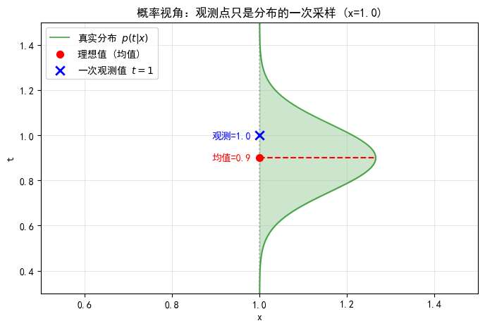
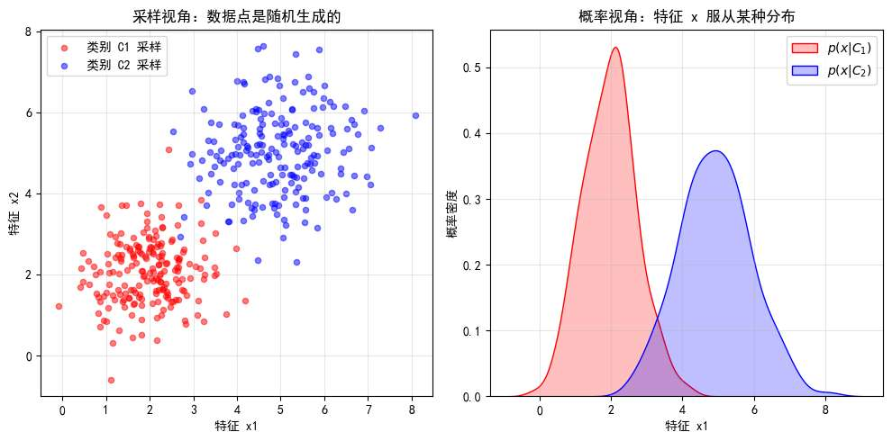
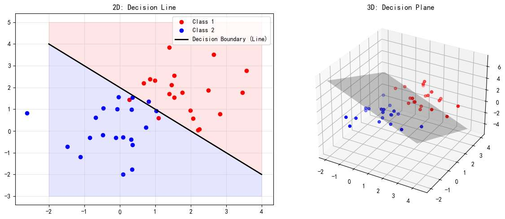
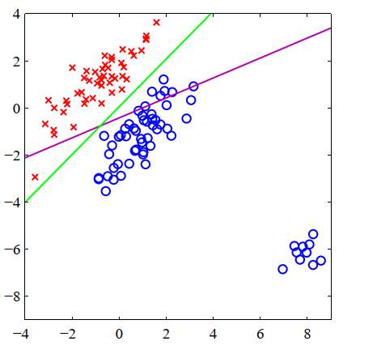

上篇文章，我写的是“概率视角重构线性回归”。

本篇文章，我们仍然用概率视角，研究另一种非常基础又重要的问题---**分类**。

在进入分类之前，我们先用一个简单的例子复习一下概率视角的本质：

比如我们数据集里有一个点，$(x=1, t=1)$ ，
**传统视角**认为 $t=1$ 是一个绝对的观测。
**概率视角**认为 $x=1$ 是固定的，但观测到的 $t=1$ 满足一个概率分布

视 x 固定，若我们说t 满足高斯分布

其意思是：
在 $x=1$ 这个位置，真实世界其实存在一个**以理想值（比如 0.9）为中心，方差为 $\sigma^2$ 的高斯分布**。
我们看到的 $t=1$，只是从这个分布里随机抽出来的一次**观测值**。它恰好落在了这里(只是这里恰好是高斯分布的高概率区域，比如 95% 区间内)，下一次观测可能就是 0.8 或 1.1。

当然，我们甚至可以更进一步：认为输入 $x$ 本身也是不确定的。
这意味着我们不是在几个固定的 $x$ 处观测，而是把 $x$ 也看作从某种分布 $p(x)$ 中采样出来的随机变量。这在后文讲“生成模型”时会非常重要。

如图，采样红色簇类别的数据时，因其满足某个概率分布我们在 2 附近采样的 x 特别多

概率分布的思想贯穿全文，在文章**末尾会再次总结**，**现在看不懂不必畏难**。

回到分类问题。假设有 $K$ 个类别，用 $C_k$ 表示第 $k$ 类。
回归问题预测的是连续的 $t$，而分类问题预测的是离散的类别。

我们的终极目标是求出**后验概率**：
$$ P(C_k | \mathbf{x}) $$
*注：因为类别是离散的，这里通常用大写 $P$ 表示概率质量，而不是小写 $p$ 表示概率密度。但在非严格语境下混用也无妨。*

或者我们也可以说条件概率，显然他的意义为：看到了特征 $x$ 之后，它属于类别 $k$ 的概率是多少？

有了这个概率，我们就可以进行**决策**。
直觉上，概率谁大选谁：
$$ \text{预测类别} = \arg\max_k P(C_k | \mathbf{x}) $$
当然，如果有风险矩阵——比如把癌症误诊为感冒的代价很大——我们就需要加权决策，这属于决策理论的范畴。

那么高屋建瓴地看，为了得到分类结果，
若以概率角度出发，我们最终要求出 $P (C_k | \mathbf{x})$。
求这个概率的过程一般也叫做“推理过程”

我们有俩种做法
- 判别概率模型，直接确定条件概率  $P (C_k | \mathbf{x})$
- 生成概率模型，不直接算 $P(C_k | \mathbf{x})$，而是先算出每一类数据长什么样 $p(\mathbf{x} | C_k)$ 以及每一类有多常见 $P(C_k)$。
	利用贝叶斯公式把它们组合起来：

$$ P(C_k | \mathbf{x}) = \frac{p(\mathbf{x} | C_k) P(C_k)}{p(\mathbf{x})} $$

不过，在实际中，很多经典的方法也不需要用概率，
我们称“判别函数”，学一个函数 $f(x)$，输入 $x$ 直接输出类别标签。

让我们先来了解经典的判别函数。
# 判别函数
判别函数从最直观的视角切入：**不谈概率，只谈划线。**
如果把分类问题看作几何问题，我们的目标就是找到一个几何边界，把不同颜色的点分开。
## 线性判别函数

这是最基础的模型。这里的“线性”是指决策边界是线性。
$$ y(\mathbf{x}) = \mathbf{w}^T \boldsymbol{\phi}(\mathbf{x}) + w_0 $$
*   $\mathbf{w}$：权重向量，决定了线的方向（几何视角看，是法向量）
*   $w_0$：偏置，决定了线离原点有多远。
*   $\boldsymbol{\phi}(\mathbf{x})$：基函数，可以是 $x$ 的各种形式，可以理解为特征组合

以二分类为例：
*   若 $y(\mathbf{x}) > 0$，判定为类别 $C_1$。
*   若 $y(\mathbf{x}) < 0$，判定为类别 $C_2$。
*   若 $y(\mathbf{x}) = 0$，则位于**决策边界** 上，无法决策。

这个 $y(\mathbf{x}) = 0$ 长什么样？
- 在二维空间，它是一条直线。
- 在三维空间，它是一个平面。
- 在高维空间，它叫**超平面**。

我觉得进一步可以引出“线性可分”概念， 

以几何视角最直观，
如果存在一个超平面，能完美地把俩类数据（红点和蓝点）切开，没有任何错误，我们就说这份数据是“线性可分”的。

*   **意义**：如果数据线性可分，感知机算法保证能收敛（一定能找到解）。如果不线性可分（比如异或问题），简单的线性模型就永远分不对，必须上非线性（基函数或神经网络）。

##  进阶一：支持向量机 (SVM)
不知道大家是否对大名鼎鼎地 SVM有所耳闻，
然而，支持向量机完全可以视作普通线性判别的进阶，加了些概念和数学技巧而已，简单提一下，不展开
*   可以理解为，这个线性模型，通过最大化决策边界到最近样本点的距离，即逼迫模型“分得干净分得好”而得出线性判别函数。
*   数学目标：$\max \frac{1}{||\mathbf{w}||}$（等价于最小化 $||\mathbf{w}||^2$）。
*   **核技巧**：如果原始空间分不开（线性不可分），它能通过数学技巧（核函数）把数据升到高维空间，让它们在高维变得线性可分。

## 进阶二：感知机 (Perceptron)

它的形式是只在线性模型外面套一个**阶跃函数**：
$$ f(a) = \begin{cases} +1, & a \ge 0 \\ -1, & a < 0 \end{cases} $$

这样一看，似乎感知机对比简单的线性判别就是**创造出了个标签**：
线性判别得到的结果仍是是**数字**，然后我们人为决策说大于 1 的是一类，小于 1 是一类，
但感知机是算出来的数强行变成 +1/-1，视作俩个标签。

这有啥好处？

好处在于求最优 $w$ 的 “训练过程”

**普通线性回归**：关注的是“数值误差”。如果一个点本身是类 1（目标+1），你预测它是 +100，普通线性回归配套“最小二乘法”，会觉得你错得离谱（因为它想让你接近 1），从而惩罚这个“过于正确”的点。这会导致决策边界被拉偏。

如图，一些离群点完全可以把完美的分类线（绿色）拉到紫色线位置。

而**感知机**关注的是“分类错误”**。
*   **如果分对了**（比如目标是+1，算出是正数），就**完全不管**，也不更新参数。不管算出来是 +0.0001 还是 +1000，最后输出的符号都是+1 嘛，只要符号对，我就认为没误差。
*   **只有分错了**（比如目标是+1，算出是负数），才更新参数。可以看下他的损失函数（代价函数）：
$$ L(w) = - \sum_{x_i \in M} y_i (w^T x_i + b) $$

    *   $M$ 是 **误分类点** 的集合。
    *   即求和只针对**判错**的点，判对的点不参与求和（Loss=0）。

这种机制使得感知机**只关注错分样本**，不会被那些“离得很远的正确样本”（离群值）带偏。

##  多分类：一对多 vs 一对一

线性判别函数应用于多分类问题，我不详细展开，
因为多分类问题主要还是概率视角最好。

简单提一下

对于 $K$ 个类别（比如 3 类：猫、狗、猪）：

 **一对多**：训练 $K$ 个分类器。 比如：**猫 vs (狗+猪)**；**狗 vs (猫+猪)**...
然后哪个分类器数大，选哪个分类器。
当然，会出现“三不管地带”。比如一个点，猫分类器说“不是猫”，狗分类器说“不是狗”，那就没法分了。

**一对一**：训练 $K(K-1)/2$ 个分类器。 比如：**猫 vs 狗**；**猫 vs 猪**；**狗 vs 猪**。
最后分类器分，谁被判定的次数多就是谁。

当然也有比较**通用的解法**，直接训练 $K$ 个线性函数 $y_k(x)$，然后取最大值：
$$ \text{Predicted Class} = \arg\max_k y_k(x) $$
把空间切得干干净净，没有模糊区域。

# 生成式概率模型
下面我们来讲生成式概率模型，

在上一节我们知道，于概率视角出发，想要做分类，本质上就是求后验概率 $P(C_k | \mathbf{x})$。

回忆一下，我们想用贝叶斯公式求 $P (C_k | \mathbf{x})$ ，即
$$ P(C_k | \mathbf{x}) = \frac{p(\mathbf{x} | C_k) P(C_k)}{p(\mathbf{x})} $$

这个思路其实是试图去理解数据的**产生机制**。

如果我们知道“猫”长什么样（$p(\mathbf{x}|C_{cat})$），也知道“狗”长什么样（$p(\mathbf{x}|C_{dog})$），甚至知道这世界上猫和狗谁更多（先验 $p(C_k)$），那我们就能用**贝叶斯公式**反推出眼前这个 $x$ 是谁。

$$ P(C_k | \mathbf{x}) = \frac{p(\mathbf{x} | C_k) P(C_k)}{p(\mathbf{x})} $$
**所以现在看看“生成式”这个名字的由来**
既然我们求出了 $p(\mathbf{x}|C_k)$，这意味着我们掌握了数据的分布规律。
我们甚至可以根据这个分布，“生成”出一张新的猫的照片，或者造出一条从未出现过的狗的数据。

## 高斯判别分析 (GDA)

我们看最经典的二分类问题。假设我们要区分“猫”和“狗”。
生成式模型的第一步，是**分别**研究它们。

### 第一步：建立档案（建模）
我们假设：
*   所有“猫”的特征 $x$（比如体重、身长），服从一个**高斯分布**。
*   所有“狗”的特征 $x$，服从另一个**高斯分布**。

为了简单起见，我们假设它们都很“圆”，即共用同一个协方差矩阵 $\Sigma$（形状一样），只是中心位置不同。

### 第二步：参数估计（学习）
想要建立这个模型，我们需要从数据中“榨取”出大量信息。我们需要计算：
1.  **猫的平均长相** $\boldsymbol{\mu}_1$（猫类数据的均值）。
2.  **狗的平均长相** $\boldsymbol{\mu}_2$（狗类数据的均值）。
3.  **身材的胖瘦** $\boldsymbol{\Sigma}$（数据的协方差矩阵）。
4.  **物种比例** $p(C_1), p(C_2)$（先验概率，比如猫占 40%，狗占 60%）。

**感受一下：**
这比仅仅画一条线要麻烦得多！我们实际上是在高维空间里重建了两个“高斯山峰”。
一旦这两个山峰建立起来，我们不仅能分类，甚至能**“生成”**数据：我们可以根据这个分布，采样画出一只“原本不存在的猫”。这就是**“生成式”**的含义。

## 连续值的二分类（推导 Sigmoid）

假设我们只有两类 $C_1$ 和 $C_2$。我们怎么得到 $p(\mathbf{x}|C_k)$ 呢？

我们不知道比如 $p(x|C_1)$ 的具体分布，我们只能观测到一堆样本点。

**我们就假设，数据在每一类中服从高斯分布。**（比如猫的身高体重服从一个高斯分布，狗的服从另一个）。

然后对式子进行化简，接下来我将推导一个有趣的结论。

我们来看 $C_1$ 的概率：

$$ p(C_1 | x) = \frac{p(x | C_1) p(C_1)}{p(x | C_1) p(C_1) + p(x | C_2) p(C_2)} $$

为了简化这个式子，分子分母同时除以分子 $p(x | C_1) p(C_1)$。

$$ p(C_1 | x) = \frac{1}{1 + \frac{p(x | C_2) p(C_2)}{p(x | C_1) p(C_1)}} $$

这时候我们引入**对数 ($\ln$) 和指数 ($\exp$)** 这一对互逆操作：
$$ \exp \left( \ln \frac{p(x | C_2) p(C_2)}{p(x | C_1) p(C_1)} \right) = \exp \left( - \ln \frac{p(x | C_1) p(C_1)}{p(x | C_2) p(C_2)} \right) $$

现在，我们把 $\ln$ 里面的东西定义为 $a$：
$$ a = \ln \frac{p(x | C_1) p(C_1)}{p(x | C_2) p(C_2)} $$

把 $a$ 代回去，我们最终可以如此简化最终的 $P (C_k | \mathbf{x})$：
$$ p(C_1 | x) = \frac{1}{1 + \exp(-a)} = \sigma(a) $$
到这里，如果有机器学习/深度学习基础，你就会发现，这就是**Sigmoid 函数 ($\sigma$)** 的形式！

它就是贝叶斯公式，在二分类情况下，得到的 $P (C_k | \mathbf{x})$ ！

进一步，
那个 $a$ 的定义：
$$ a = \ln \frac{p(x | C_1) p(C_1)}{p(x | C_2) p(C_2)} = \underbrace{\ln \frac{p(x | C_1)}{p(x | C_2)}}_{\text{核心项}} + \underbrace{\ln \frac{p(C_1)}{p(C_2)}}_{\text{常数项}} $$
这里是一个复杂的对数比率。

但是，因为我们假设数据分布 $p(x|C_k)$ 是**高斯分布**（且方差相同），把高斯公式代进去：
*   高斯分布里有 $x^2$ (二次项)。
*   但在 $\ln$ 里做除法（即相减）时，**$x^2$ 项抵消了**
*   最后只剩下 $x$ 的一次项。
$$ a(x) = \mathbf{w}^T \mathbf{x} + w_0 $$
也就是说，**只要假设数据服从高斯分布，那个 $a$ 就一定是一个关于 $x$ 的线性函数！**

在高斯同方差假设下，生成模型的决策边界是线性的。

代回 Sigmoid，就得到了我们最熟悉的**逻辑回归**：
$$ p(C_1 | x) = \sigma(\mathbf{w}^T \mathbf{x} + w_0) $$

也就是，如果我们有能力算的话，
1.  从数据里算出每一类的均值 $\mu_1, \mu_2$。
2.  算出协方差矩阵 $\Sigma$。
3.  算出先验概率 $\pi$。
4.  最后把这些参数代入复杂的公式，经过一顿抵消，算出 $a(x) = \mathbf{w}^T \mathbf{x} + w_0$ 得到 $\mathbf{w} = \Sigma^{-1}(\mu_1 - \mu_2)$。

## 多分类问题（推导 Softmax）
假设有 $K$ 个类，根据贝叶斯定理：

$$ p(C_k | x) = \frac{p(x | C_k) p(C_k)}{\sum_{j=1}^K p(x | C_j) p(C_j)} $$

我们要把它变成漂亮的指数形式。于是我们定义 $a_k$：
$$ a_k = \ln \big( p(x | C_k) p(C_k) \big) $$

那么，分子就变成了 $\exp(a_k)$。
分母就变成了 $\sum \exp(a_j)$。

于是公式变成了：
$$ p(C_k | x) = \frac{\exp(a_k)}{\sum_{j} \exp(a_j)} $$

**这就是 Softmax（归一化指数函数）。它同样不是发明的，而是贝叶斯公式在多分类下的化简，一种自然形态。**  

**Softmax 这个形式本身**不需要高斯分布假设，就是这个形式。

而如果希望 $a_k(x)$ 是 $x$ 的**线性函数**（即 $a_k = \mathbf{w}_k^T \mathbf{x}$），那么**是**的，我们需要假设数据服从高斯分布且协方差共享。

否则 $a_k$ 可能是 $x$ 的二次函数（那就是二次判别分析 QDA，边界是弯的）。

（这里又如何配图？）

# 判别式概率模型

看到这里，你可能会问：
> “既然生成模型推导到底，结果也是 Sigmoid / Softmax，那判别模型还有什么存在的意义？我直接用生成模型不就行了？”

在生成模型中，为了得到那个 $w$，我们走了很远的路：
1.  先要从数据里算出每一类的均值 $\mu_1, \mu_2$。
2.  算出协方差矩阵 $\Sigma$。
3.  算出先验概率 $\pi$。
4.  最后把这些参数代入复杂的公式，经过一顿抵消，算出 $\mathbf{w} = \Sigma^{-1}(\mu_1 - \mu_2)$。

这就像为了画一条分界线，我们要先把猫和狗的祖宗十八代（分布细节）都研究透了，才画出这条线。

## 2. 判别模型的“捷径”
判别模型（如**逻辑回归**）的思路是：
既然我知道——**只要数据大概满足高斯分布，最终的后验概率形式一定是 $p(C_1|x) = \sigma(\mathbf{w}^T \mathbf{x} + w_0)$。**

那我还去算什么 $\mu$、算什么 $\Sigma$ 呢？
**我直接假设模型就是 Sigmoid 这个形式，然后直接去求最优的 $w$ 不行吗？**

**这就是逻辑回归（Logistic Regression）。**
*   它跳过了“研究数据分布 $p(x|C_k)$”这一步（所以它叫判别模型，不叫生成模型）。
*   它利用了生成模型的**结论**（Sigmoid 形式），但换了一种**求解方法**。
*   **怎么求 $w$？** 它不再是通过统计均值方差来求，而是构建损失函数（交叉熵），利用梯度下降，让模型自己去“试”出最好的 $w$。

## 总结：两者的关系

*   **生成模型（GDA）**：是**物理学家**。我要搞清楚粒子的运动规律（分布），推导出公式，算出参数。
*   **判别模型（逻辑回归）**：是**工程师**。既然物理学家告诉我公式就是 Sigmoid，那我就直接拿来用，把数据喂进去，暴力算出参数。

**逻辑回归之所以叫“回归”，却做着“分类”的事，且属于“判别模型”，就是因为它直接对 $P(C|x)$ 建模，跳过了中间的分布假设环节。**

# 损失函数

接着，我们研究下其损失函数怎么设计的好。
线性回归模型，我们是直接似然概率 p (t|w, x..)
现在，我们是似然概率 P (C1|x)？不对，只要是最大似然估计，根据其定义就是似然 p (t|w, x..)
线性回归中这是个高斯分布，
这里的话，不是什么分布，而是 $$ P(y|x; w) = (h_w(x))^y (1 - h_w(x))^{1-y} $$
    *(意思是：如果是正面(y=1)，概率是h；如果是反面(y=0)，概率是1-h)*

**似然函数 (Likelihood):** 把所有样本的概率乘起来。我们想要这个函数最大
$$ L(w) = \prod P(y^{(i)}|x^{(i)}; w) $$**取负对数 (-LogLikelihood):** 乘积变求和，最大化变最小化。

所以我们推出，想要模型性能好，就要最小化“交叉熵损失函数”

这俩本质也算线性模型
决策边界是线性的
*   对于逻辑回归，我们判断类别的标准通常是 $p \ge 0.5$。
*   Sigmoid 函数 $\sigma(a) = 0.5$ 意味着什么？意味着输入 $a = 0$。
*   而 $a = \mathbf{w}^T \mathbf{x} + w_0$。
*   所以，决定类别的分界线依然是 $\mathbf{w}^T \mathbf{x} + w_0 = 0$。
“最小二乘法给出了判别函数参数的精确闭式解。然而，即使作为一个判别函数
（我们直接用它来做决定，且不需要做任何概率解释），它也存在一些严重的问题。你
已经看到，在高斯噪声分布的假设下，平方和误差函数可以看作负对数似然（参见
2.3.4 小节）。如果数据的真实分布明显不同于高斯分布，则最小二乘法的结果就会很
差。特别是，最小二乘法对离群值（与大部分数据点相距甚远的数据点）的存在非常
敏感，如图 5.4 所示。我们可以看到，图 5.4 右图中的附加数据点使决策边界的位置发
生了显著变化，尽管这些数据点会被左图中的原始决策边界正确分类。平方和误差函
数对距离决策边界较远的数据点赋予了过高的权重，即使这些数据点是被正确分类的。
离群值可能由于罕见事件，或仅仅由于数据集中的错误而产生。由此，对极少数数据
点敏感的技术是缺乏鲁棒性的。为便于比较，图 5.4 还显示了使用一种称为逻辑斯谛
回归（logistic regression）的技术（参见 5.4.3 小节）得出的结果，该技术对离群值的
鲁棒性更强。回想一下，最小二乘法对应的是高斯条件分布假设下的最大似然，而二进制目标向
量的分布显然远非高斯分布，于是最小二乘法的失败也就不足为奇了。通过采用更合适
的概率模型，我们可以获得相比最小二乘法性能更好的分类技术，而且还可以将其扩展
以得到灵活的非线性神经网络模型，详见后续章节”
这里又在说什么

*   **正常情况**：最小二乘法画了一条线，分得还不错。
*   **出现离群值**：
    现在，右上角的蓝点里，有一个点**特别特别靠右上**（离群点）。
    注意，这个点是**极其正确的**点（它离红点远得要命，简直是蓝点中的蓝点）。

    *   **对于人眼**：这个点太棒了，完全不影响分类。
    *   **对于逻辑回归（Sigmoid）**：它会把这个点映射成 0.99999，跟目标 $t=1$ 误差极小，几乎忽略不计。
    *   **对于最小二乘法（MSE）**：**灾难发生了！**
        线性模型是直线的，那个离群点太远了，导致模型预测出的 $y$ 值可能是 **100**。
        这时候，MSE 算出的误差是：$(100 - 1)^2 = 9801$。
        **MSE 疯了！** 它觉得误差太大了！为了迁就这个“过于正确”的离群点，它会强行把那条直线往右上方拉，试图让预测值从 100 降下来。

    **后果**：为了照顾这个离群点，直线的斜率和位置发生了巨大的偏移，导致原本能分开的红蓝大部队，反而分不开了（这就是图 5.4 右图描述的现象）。

> “最小二乘法对应的是高斯条件分布假设... 而二进制目标向量的分布显然远非高斯分布”

*   **高斯分布**关注的是“均值”，它对偏离均值太远的东西非常敏感（平方惩罚）。
*   **分类问题**关注的是“正确性”，只要你在分界线正确的一侧，你离得再远我都不应该惩罚你，甚至应该奖励你。
