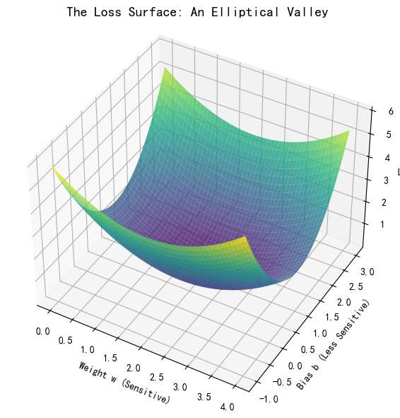
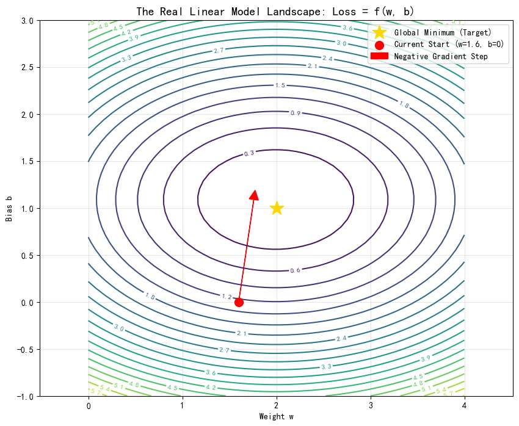
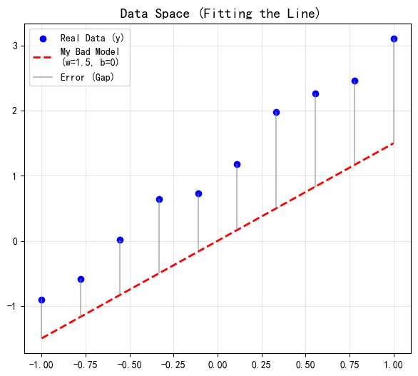
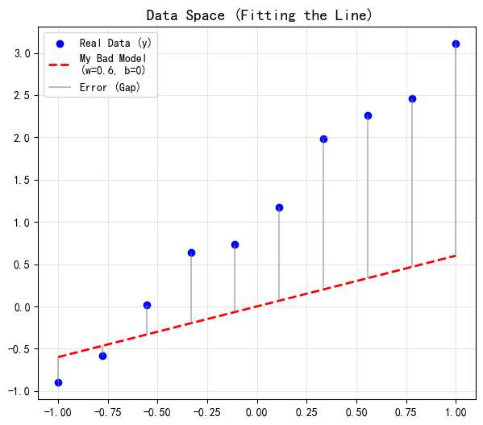

网络上介绍梯度下降的文章，我觉得都很好，但很适合对机器学习有概念的同学，真的很难找到完全适合小白读者的。

本文，我从数学直觉开始讲，拿简单的线性模型举例

前置知识只需要高中学过的俩个概念：**函数** 和 **导数**。

带你了解
- 梯度概念
- 梯度下降概念
- 学习率
- 梯度下降的各种方法（BGD、SGD）
- 优化器的目的

无任何复杂数学推导，仅仅对知识建立坚不可摧的直觉，后续想深入研究，看任何其他复杂的文章、书籍，相信你都会有底气！

# 梯度的数学直觉

假如，在函数 $y=x^2$里，站在抛物线上`(1，1）` 这个点。

你不能超出抛物线这个轨迹，只能待在画的这个曲线上。

那么你只能做两个动作：沿着切线，**向左下走** 或者 **向右上走**。

然而，虽然看上去你是往”**左下**“或”**右上**“，但实际你能控制的，只是变量$x$ 。
即往”**左**“还是往”**右**“。

那么，如果你想让自己，**往更高的地方去**，$x$到底怎么走呢？

”**导数**“指导了你。
*   导数 $f'(x)$ 是一个**数值**（标量），当你在x=1的位置时，此点导数为 $2$。
*   既然它是一个正数，那么就告诉了你：往右走（$x$变大），$y$ 会变大；往左走，$y$ 会变小。
*   大小为数字2，表述了你往右走，y变大的程度。如果你走了1个单位，y会上升2个单位

同时，**该点切线斜率为该点导数值**，切线越陡峭，此点导数值越大。

我们把“2”的这个“指导”过程，变得更形象一点：

我们可以理解为是在x轴上的一个向右的向量，
它”指导“着你：如何控制你能控制的x，让你往更高的地方走？ 
答案就是红色箭头：向右

其实，这个时候，我觉得已经可以引入“梯度”这个定义了，

这个红色箭头，向量$\nabla f = [ \frac{df}{dx} ]=[2]$ （一维向量，趴在x轴上），正是**梯度**。

可以理解为，梯度是把导数算出的值，“打包”成一个方向，指示自变量。

*我觉得这是网上很多文章没指清的点。会让人误以为，这个图像上，”切线“（绿色线）斜率就是梯度。然而，梯度（红色线），指导的只是你的自变量变化的方向。*

不过我们正式学到“梯度”这个词，严谨来说是大一的微积分课程。“多元函数”章节

那么我们来到一个简单的**多元函数**，比如 $z = f(x, y)= x^2 + y^2$ 

想象你就在这张函数的图像上，你就是其中一点。

如果看着这个图，你的脚下有**无数个方向**可以“迈出一步”。往哪走高度z会变大呢？有无数个方向！

但我们往往研究什么呢？哪个方向走，高度会变大得最快！
同时，我们“迈步子”的方式，一定是通过**自变量**的变化！

即**x与y** 往哪走，函数（高度）会变大得最快！

**仍然，有一个向量，指引我们自变量方向。正是梯度： $\nabla f$**

永远指向**地形变高最快**的那个自变量方向。

向量的长度（模），代表了这个坡有多陡，即，变化的程度！

**数学表达：**
如果 $z = f(x, y)$，那么梯度就是把对 $x$ 的导数和对 $y$ 的导数打包成一个向量：

$$\nabla f = [ \frac{\partial f}{\partial x}, \frac{\partial f}{\partial y} ]$$
可以理解吧？对x来说，下一步能让z变最大，同时对y来说，下一步也能让z变最大：

那么这个方向，就是让z最大的方向。

我们是控制我们的“脚步”，“x与y”，来实现走到不同高度的地方z。

三维函数图，变量是二维，梯度分布图，也应是二维的。所以梯度是**平铺在地图上**的指令。

2D 梯度：$\nabla f = [ \frac{\partial f}{\partial x}, \frac{\partial f}{\partial y} ]$ （二维向量，在xy面上）
 
如果我们有“梯度”这个信息，我们就不需要有z的三维图了，

**将其z的数值投影至平面**，一圈虚线，代表这圈的x、y 所对应的函数值z，都相等  

下面的图，就代表所有x与y的情况下，如何走变化最大。

**关于梯度的数学直觉，建立完毕。**

总结一下，

以二元函数为例，
* **谁是变量？** $x$ 和 $y$ 是变量（你的位置）。
* **谁不变？** 函数图像，即地形是固定的。
* **目标：** 在这个不变的地形，我们通过改变 $x, y$（移动脚步）去寻找最高点或最低点。
* **梯度方向：** 取决于**自变量**的个数，二元函数则 “平铺在地图上”

而到了**AI**的场景，需要我们稍稍转化一下思路。

# AI场景：简单的线性模型

首先，让我们来到最简单的线性模型公式
*   **模型公式：** $\hat{y} = w \cdot x + b$
*   **任务：** 给定一堆数据点（比如房子的面积 $x$ 和价格 $y$），我们要找到一根直线，尽可能完美地穿过它们。找到一根直线，可以翻译为，找到一组完美的$w$和 $b$ 拟合这些数据。

诶？“梯度”，我熟！这个知识点会在这里吗？ wx+b 对x求导数嘛

*不，还没出现！*

刚才的冲动是在说，**x如何改变去影响y**！如果你有刚才的冲动，说明，“梯度”在AI的“身份”你还没理解。

*   在上一节的数学基础里，我们关心 $x$ 变化时 $y$ 怎么变。
*   **在 AI 训练里，$x$ 是根本不许动的！因为** $x$ 是由于客观世界产生的数据（比如房屋面积），你无法改变它。
*   **真正能动的，是我们初始化的参数 $w$ 和 $b$。**

请务必多读几遍上面这句话。这是从“做题家”思维转变的关键一跃。

回到预测上，
一开始，我们对 $w$ 和 $b$ 一无所知，只能随机猜。
比如我们随机生成了一组参数 $w_0, b_0$。

毫无疑问，这条直线画出来会拟合得很糟糕（预测值 $\hat{y}$ 和真实标签 $y$ 差得很远）。

如何调整？

直觉告诉我们，我们要借助真实数据点，与我们的直线，之间的差距，去**调整我们的参数**。

如果我们参数的调节，能使在计算一次误差后，误差变小，我们就成功调整了参数。

这很大白话吧！

- 衡量误差！
- 调整参数以让误差最小！

## 损失函数

**损失函数**，就是用来计算误差的。

在数学上，我们通常使用 **均方误差 (Mean Squared Error, MSE)** 来衡量我们的误差：

$$ Loss = (y - \hat{y})^2 = (y - (wx + b))^2 $$

再次强调，x和y，不变。我们调整的是w和b
*   **上节的数学课：** $z = f(x, y)$
*   **现在的AI课：** $Loss = f(w, b)$

对于这个Loss 函数，我们把图画出来，观察：
1. 我们的函数图像是三维的（类似上节的碗，但不同）**。
2.  其中两个自变量是 **权重 $w$** 和 **偏置 $b$**。
3.  函数值，即高度轴是 **Loss**。

## 梯度的方向

在这个图中，有俩个自变量，$w$ 和 $b$ 我们要找的梯度，就是一个二维向量：
    $$ \nabla Loss = \begin{bmatrix} \frac{\partial Loss}{\partial w} \\ \frac{\partial Loss}{\partial b} \end{bmatrix} $$

诶，找到梯度干嘛？ 

**梯度**，上节“数学课”了解到了，是指导我们“自变量”如何走，让函数值最大。

我们的目的是？**让LOSS函数值最小**啊！所以梯度的相反方向，恰恰是我们要找的东西！！
$$ -\nabla Loss = \begin{bmatrix} -\frac{\partial Loss}{\partial w} \\ -\frac{\partial Loss}{\partial b} \end{bmatrix} $$
现在，像数学课一样，我把二维的（自变量w和b），真正属于梯度的地图展示出来。

横轴是w，纵轴是b！

#### 小小的注释：

2D 投影为什么看起来是一圈圈椭圆？

让我们回到 Loss 函数的公式：
$$ Loss = (x \cdot w + b - y)^2 $$

为了方便理解，我们简化一下，假设数据中心化后，Loss 大致长这样（二次型形式）：
$$ Loss \approx A \cdot w^2 + B \cdot b^2 $$

当我们令 $Loss = C$（固定高度）时，公式就变成了：
$$ A \cdot w^2 + B \cdot b^2 = C $$

或者写成更标准的几何形式：
$$ \frac{w^2}{C/A} + \frac{b^2}{C/B} = 1 $$

**这就是标准的高中数学“椭圆方程”啊！**
  $$\frac{x^2}{a^2} + \frac{y^2}{b^2} = 1$$

这个椭圆，也是“等高线”的意思。如果不理解，去“数学课”看看更好看的那个一圈圈的圆形投影。

## **关键直觉：对梯度的理解**

同时，请注意图中的一个细节，仔细看**那个红色的箭头（梯度的反方向）**：

但它**并不指向**黄色的五角星（误差最小的w和b的位置）！
  

**为什么？**

上节数学课里，明明梯度反方向是直接指向那个最优、最小点啊？

要明白，梯度反方向，不是指最优点的方向，**而是让函数下降最快的方向**！

上节数学课里，由于函数的特殊性，最优点的方向和函数下降最快方向恰好重合而已！

多读几遍，看看图，你会有收获的。

所以梯度反方向不是万能的，它不知道最优点到底在哪，它又不能像我们一样有上帝视角，

它的心理是：w和b往这个方向走，loss降的最快，我预感，最优点也许就在这个方向上！

所以，当损失函数稍微复杂时，梯度的预感不会那么准确。

## 数学计算
现在让我们回过头来，图中的这些红色箭头，即Loss下降方向（梯度反方向），
$$ \text{Loss下降方向}=\text{梯度反方向} = - \nabla Loss = \begin{bmatrix} -\frac{\partial Loss}{\partial w} \\ -\frac{\partial Loss}{\partial b} \end{bmatrix} $$
究竟是如何算出来的？
显然我们要算$\frac{\partial Loss}{\partial w}$ 和$\frac{\partial Loss}{\partial b}$

我们以**算w参数**为例。

也许你会这样做：
$$ Loss = (x \cdot w + b - y)^2 $$
嗯，然后先对函数整体求导，再对$w\cdot x$关于$w$求导.......
$$ \frac{\partial Loss}{\partial w} = 2(wx+b - y) \cdot x $$

停停停！没有问题，但我不是来跟你一起做无聊的偏导数运算的，

让我们用“**信息流动**”视角，重新审视算$\frac{\partial Loss}{\partial w}$ 这个过程。对每一步都建立物理直觉。

#### 1. 重新定义导数：敏感度
$\frac{\partial Loss}{\partial w}$，此时变量只有一个 $w$。回忆我们的“数学课”内容：
*   **符号（正负）** $\to$ **方向**：$w$ 往左，还是往右，Loss会变大？
*   **数值（大小）** $\to$ **敏感度**：朝着那个方向，Loss 的反应有多剧烈？

**怎么理解这个“数值”？**
把它想成一个敏感度，**放大倍数**。
$\frac{\partial Loss}{\partial w} = 100$，意味着：
> **“在当前这个瞬间，如果 $w$ 敢向右挪动 0.001 毫米，Loss 就会爆炸般地增加 0.1 毫米（放大了100倍）”**

#### 2. 链式法则
然而，$Loss = (y - \hat{y})^2$。Loss 无法直接看到 $w$，它只能看到预测值 $\hat{y}$。
所以信息的流动是分级的：

**1：Loss 对 $\hat{y}$ 的敏感度**
   $$ \frac{\partial Loss}{\partial \hat{y}} = 2(\hat{y} - y) $$
由公式看出，当前的**误差越大**，下次Loss的变化越剧烈。 如果现在的预测离真实值差了十万八千里，那么 $\hat{y}$ 只要稍微动一下，Loss 就会剧烈波动

**2：$\hat{y}$ 对 $w$ 的敏感度**

接着，$\hat{y}$ 去研究出w如何影响它的。
$\hat{y} = wx + b$ 可得
$$\frac{\partial \hat{y}}{\partial w} = x$$
原来，数据原始的 **$x$**，  决定了$w$稍微动一点，预测值的变化程度。如果 $x$ 很大$w$ 只要微调一点点，$\hat{y}$ 就会剧烈波动。

**3.最后综合起来**
$$ \frac{\partial Loss}{\partial w} = \text{误差项} \times \text{输入} = 2(\hat{y} - y) \cdot x $$

还没完，我们只知道变化程度，但是最终我们如何那着这个结果，修正我们原本的w参数？

## 梯度下降：拿到结果有什么用？

我们现在已经明白了梯度的含义，也知道了在这个线性模型中，梯度究竟怎么算。

现在回到我们的例子，亲自感受一下梯度如何指导$w$往正确方向变。

我们拿第一个蓝色点数据举例，看它如何指导w的变化。
$x = -1$。看图，对应的真实值 $y \approx -1$（大概在-0.9左右，我们按-1算）。

**模型（红色）目前是** $w=0.5, b=0$。
 
**预测值：** $\hat{y} = 0.5 \times (-1) = -0.5$。

**Step 1：算误差项**：
预测是 $-0.5$（在上面），真实是 $-1$（在下面）。
 $\hat{y} - y = -0.5 - (-1) = \mathbf{+0.5}$。

**Step 2：算输入项**

  $\frac{\partial \hat{y}}{\partial w} = x = \mathbf{-1}$。
输入是**负**的。这意味着 $w$ 和 $\hat{y}$ 是**反向变动**关系（$w$ 变大，$\hat{y}$ 变小；$w$ 变小，$\hat{y}$ 变大）。

**Step 3：算总梯度**

$$\ \frac{\partial Loss}{\partial w} = \text{误差项} \times \text{输入} = 2(\hat{y} - y) \cdot x=2\times \text{误差(+0.5)} \times \text{输入(-1)}  = \mathbf{-1} $$

####  执行修正

现在我们知道了：**梯度是 -1**。
*   **梯度物理含义：** 意味着 $w$ **增大**，Loss 会变小。

如何修正？ 直觉来讲，
$$ w_{new} = w_{old} - ( \text{梯度}) $$
就能达到效果吧？
$$ w_{new} = 0.5 - (-1) = 1.5 $$

让我们看看Loss图

Loss确实从2.1变为1.2了。下降得很猛啊！

我们看看线性模型图。

想要更好拟合第一个数据点，直线要向上抬一抬，即w增大！才能更靠近(-1,1)。

**确实**，
*   $w$ 从 **0.5** 变成了 **1.5**。
*   直线确实向上抬了。

但是，从0.5到1.6 变化是不是过于大了呢？

**是的！**

靠近得过火了！不仅靠近，还超过它了，本来在第一个蓝点下，现在直接跑到下面去了！

回看数据点 $(-1, -1)$。如果 $w=1.5$，预测值 $\hat{y} = 1.5 \times -1 = -1.5$。
*   原来的预测值是 $-0.5$（偏高0.5），现在的预测值是 $-1.5$（偏低0.5）。
*   **结果：** 我们用力过猛，直接从目标点的上方，跳到了目标点的下方！虽然稍微好了一点点，但这种“**过火**”的行为非常危险。

所以直接拿梯度这个大小去更新，或许太死板，又过激。

看Loss图也能理解，如果每次更新Loss变化那么大，很难最后精准移动到最优点（五角星位置）。

所以我们引入”学习率“

    $$ w_{new} = w - (\text{lr} \times \text{梯度}) $$
    $$ w_{new} = 0.5 - (0.1 \times \mathbf{-1}) $$
    $$ w_{new} = 0.5 + 0.1 = 0.6 $$

这样一看，虽没有完全拟合第一个点，Loss下降也没有那么快，

但Loss更新的”步长“更稳健了，图像确实更拟合第一个数据点了，也没有”过火“，属于比较温和。

看来，学习率是一个重要的东西，用来优化参数的变化，

我们后面再提。

现在继续回过头看这个线性模型。

刚才只是说了第一个点，
那后面还有一堆呢！

我们如何不断优化w？

#### 1. 批量梯度下降 (BGD - Batch Gradient Descent）

其实对于优化w，直接的想法是，每一次数据(x,y)，即图上蓝点，都去优化一次w。

其实没有问题，

但是，如果下一次，图上蓝点有成千上万个，怎么办？
变成千上万个，很麻烦

所以实际操作中，

一个蓝点，能计算出一个梯度，指导w的变化。但我们不急着变w！ 我们再看看剩余的所有蓝点，把他们求出的梯度求和（写公式），然后再更新w（写公式）

极其稳健。这代表了“全局最优方向”，直指谷底，不走弯路

但实际上也很慢！

#### 2. 随机梯度下降 (SGD - Stochastic Gradient Descent)

很多数据，但，我不全部采纳，而是随机选一个。

多次循环，更新参数。比如说第一次用第一个数据点，第二次用第7个数据点。

虽然单步是乱的，但只要数据量够大，**期望值（统计平均）** 依然是往谷底走的，且收敛快。

#### 3. 小批量梯度下降 (Mini-batch GD)
BGD 太慢，SGD 太乱。现代深度学习通用的标准答案是 **Mini-batch**。

 每次随机抓 **一小撮**（比如 32 个，或者 64 个）。

 64 个数据的平均梯度，比 1 个数据的梯度更靠谱，也比所有数据的平均梯度算起来简便。而且，现在的显卡（GPU）擅长做矩阵运算。算 1 个数和算 64 个数的时间其实差不多（并行计算）。不用白不用！

### 细探学习率
现在我们知道如何更新，梯度了， 比如我们使用Mini-batch ，则为
  $$ w_{new} = w - (\text{lr} \times \text{随机一个数据点计算出的梯度}) $$
在训练中，我们不仅是很多数据训练，计算梯度更新w，而且相同数据，我们还要重复训练。

那么我们要经历很多次上面的公式。
对于学习率，刚才的例子是设了一个硬性的，很小的数，0.01。  

但实际上，我们的学习率只有是动态地，才比较合适。

比如训练初期，我们设学习率为0.1，  让 Loss 快速下降。

在训练后期，w离最优w剩一点点了，如果学习率不够小，会一直无法靠近。

比如我们训练到w是5.2 但最优w是5.23  我们的学习率是0.5 那显然， w下一次跳跃会到5.27  再下一次跳跃 是5.22 还没到，再下一次跳跃5.27  反复横跳.....

所以后期我们会设置极小学习率，比如0.0001。当Loss足够小时（w靠近最优w）启用。
 

## 优化器

好了！讲了这么久$w$参数，我们把忽略已久的$b$拾起来。

在实际的SGD优化里， 我们的俩个参数的学习率，用的是同一个。

在我们文中的例子还好,我们随机生成的数据x是-1, 1，y是-1到3，很接近。

所以共用一个学习率似乎也没什么。

但现实生活，我们可能是房价预测。

在这个情景下，我们回顾一下Loss。

$Loss \approx (x_{data} \cdot w)^2 + (1 \cdot b)^2$
*   我们在预测房价，数据 $x$ 是“面积”，平均值可能是 **100**。
*   那么 $w$ 的系数实际上是 $100^2 = \mathbf{10000}$。
*   而 $b$ 的系数依然是 **1**。

所以在这些训练数据下，Loss可能是这样的： $Loss \approx 10000 w^2 + b^2$

*   **在 w 轴上：** $w$ 只要动 0.01，Loss 就变化非常大。（乘以10000）
*   **在 b 轴上：** $b$ 动 100，Loss 才变化一丢丢。

 $w$ 和 $b$ 对 Loss 的敏感度不同，函数对$w$的变化更敏感。
 
**如果非要用同一个学习率：**

1.  **如果迁就 w（设小 LR）** $w$ 走得很稳，但 $b$ 几乎不动
2.  **如果迁就 b（设大 LR)：** $b$ 终于能跑起来了，但 $w$ 变得超快（梯度爆炸，震荡无法收敛）。

所以 $w$ 和 $b$ 根本不能用同一个学习率！而且，二者的更新策略也完全不一样！

所以我们引入” **优化器 (Optimizer)** “概念.... 

*   对敏感的 $w$，自动把步子调小，求稳。
*   对迟钝的 $b$，自动把步子调大，求快。

这就是为什么在神经网络训练代码中，你总能看到 `optimizer = Adam(...)` 的原因。 优化器非常有必要。

