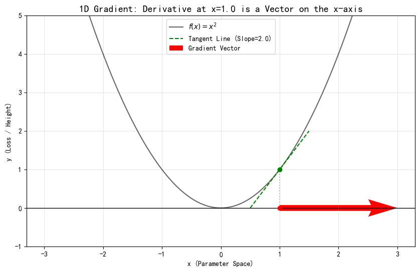
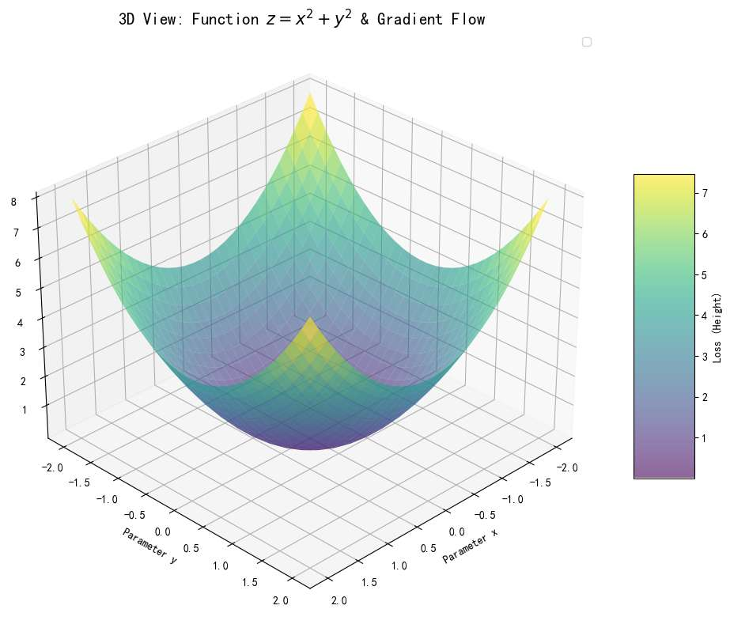
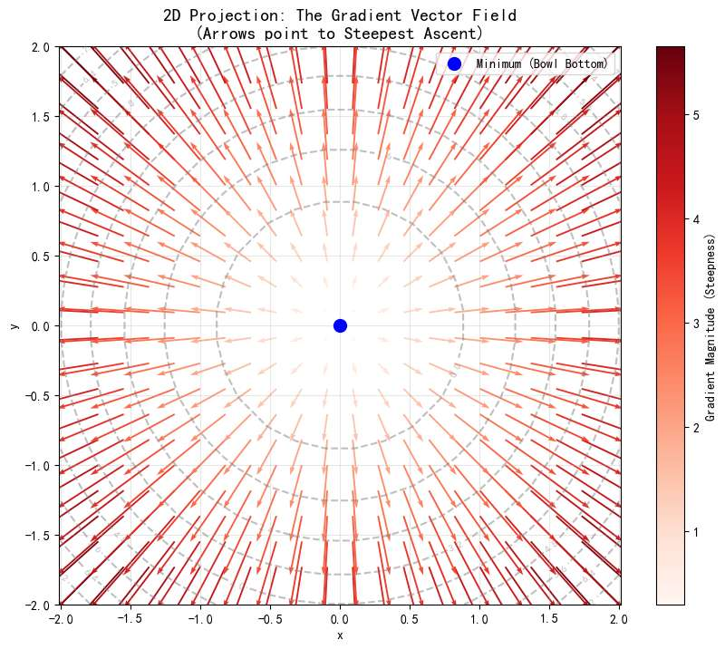
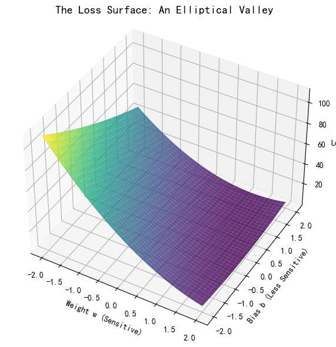
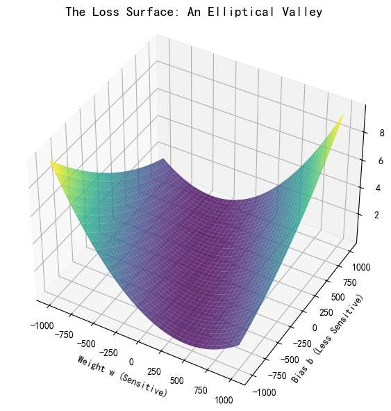
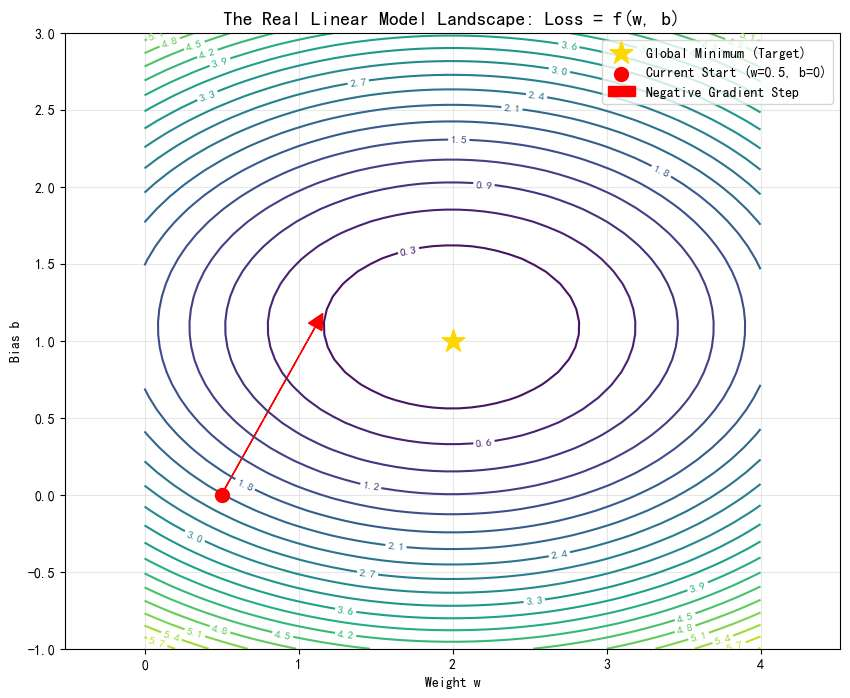

首先建立梯度的定义吧？
我总感觉网上的教学，一来就拿ai模型说，会有点糊。因为ai模型的梯度，应该是误差函数，对参数w求导吧？ 有悖直觉
需要掌握的前置知识，仅仅是“函数”，和“导数”？
我的意思是，脱离ai知识，
纯粹回归数学知识一下？
有没有简单的例子，去理解梯度。
我记得梯度，是向量？
是在学多元函数时，学到的。
一元函数当时为啥没学梯度？
然而我单层线性模型的梯度就是一维的吧？

有必要的话，可以写代码绘图

梯度
前置知识只需要：**函数** 和 **导数**。

在高中学的 $y = f(x)$，比如 $y=x^2$里，你站在抛物线上，`(1，1）` 这个点，你不能超出抛物线这个轨迹，只能待在画的这个曲线上。那你只能做两个动作：沿着切线，**向左下走** 或者 **向右上走**。

当然，虽然看上去你是往”**左下**“或”**右上**“，但实际你能控制的，只是变量$x$ 。
即往”**左**“还是往”**右**“。

那么，如果你想让自己，身处更高的地方，$x$到底怎么走呢？
”导数“指导了你。
*   导数 $f'(x)$ 只是一个**数值**（标量），当你在x=1的位置是，此点导数为 $2$。
*   它是一个正数，那么就告诉了你：往右走（$x$变大），$y$ 会变大；往左走，$y$ 会变小。
*   大小为数字2，表述了你往右走，y变大的程度。如果你走了1个单位，y会上升2个单位

我们往往想到导数，最直接的是想象切线，**该点切线斜率为该点导数值**，越陡峭，此点导数值越大。

但真正指导我们的这个数字，”2“，是x轴上的。

我们可以理解为x轴上的一个向右的向量，它”指导“着你：如何控制你能控制的x，让你往更高的地方走？ 

其实，这个时候，我觉得已经可以引入“梯度”这个定义了，
有个向量$\nabla f = [ \frac{df}{dx} ]=[2]$ （一维向量，趴在x轴上），对吧，它到底干了什么？

*我觉得这是网上很多文章没指清的点。会让人误以为，这个图像上，”切线“（绿色线）就是梯度。然而，梯度（红色线），指导的只是你的自变量变化的方向。*

不过我们正式学到“梯度”这个词，严谨来说是大一的微积分课程。“多元函数”章节

那么我们来到一个简单的**多元函数**，比如 $z = f(x, y)= x^2 + y^2$ 
想象你就在这张函数的图像上，你就是其中一点。

如果看着这个图，你的脚下有**无数个方向**可以“迈出一步”。
往哪走高度z会变大呢？ 同样的，有无数个方向！

但我们往往研究什么呢？还是那句话，自变量！

x与y 往哪走，函数（高度）会变得最大！

**我们同样需要一个向量，来指引我们方向，它正是梯度： $\nabla f$**

*   **定义：** 梯度（Gradient, 记作 $\nabla f$）是一个**向量**。
*   **物理意义**：永远指向**地形变高最快**的那个自变量方向。
*   **长度：** 向量的长度（模），代表了这个坡有多陡。

**数学表达：**
如果 $z = f(x, y)$，那么梯度就是把对 $x$ 的导数和对 $y$ 的导数打包成一个向量：
$$\nabla f = [ \frac{\partial f}{\partial x}, \frac{\partial f}{\partial y} ]$$
可以理解吧？对x来说，下一步能让z变最大，同时对y来说，下一步也能让z变最大：

那么这个方向，就是让z最大的方向。

我们是控制我们的“脚步”，“x与y”，来实现走到不同高度的地方z。

三维函数图，变量是二维，梯度分布图，也应是二维的。所以梯度是**平铺在地图上**的指令。

2D 梯度：$\nabla f = [ \frac{\partial f}{\partial x}, \frac{\partial f}{\partial y} ]$ （二维向量，在xy面上）
 
如果我们有“梯度”这个信息，我们就不需要有z的三维图了，
将其z的数值投影至平面，一圈虚线，代表这圈的x、y 所对应的函数值z，都相等  

下面的图，就代表所有x与y的情况下，如何走变化最大。

关于梯度的数学直觉，建立完毕。

以二元函数为例，
* **谁是变量？** $x$ 和 $y$ 是变量（你的位置）。
* **谁不变？** 函数图像，即地形是固定的。
* **目标：** 在这个不变的地形，我们通过改变 $x, y$（移动脚步）去寻找最高点或最低点。
* **梯度方向：** 取决于变量的个数，二元函数则 “平铺在地图上”

而到了**AI**的场景，需要我们稍稍转化一下思路。

我将从最简单的线性模型入手，到简单的神经网络，到复杂的神经网络，我们一起把“梯度”这个难题吃透。

# 线性模型

首先，让我们来到最简单的线性模型公式
*   **模型公式：** $\hat{y} = w \cdot x + b$
*   **任务：** 给定一堆数据点（比如房子的面积 $x$ 和价格 $y$），我们要找到一根直线，尽可能完美地穿过它们。找到一根直线，可以翻译为，找到一组完美的$w$和$x$

诶？“梯度”，我熟！这个知识点会在这里吗？ wx+b 对x求导数嘛

*不，还没出现！*

刚才的冲动是在说，x如何改变去影响y！如果你有刚才的冲动，说明，“梯度”在AI的“身份”你还没理解。

*   在上一节的数学基础里，我们关心 $x$ 变化时 $y$ 怎么变。
*   **在 AI 训练里，$x$ 是根本不许动的！因为** $x$ 是由于客观世界产生的数据（比如房屋面积），你无法改变它。
*   **真正能动的，是我们初始化的参数 $w$ 和 $b$。**

请务必多读几遍上面这句话。这是从“做题家”思维转变的关键一跃。

回到预测上，
一开始，我们对 $w$ 和 $b$ 一无所知，只能随机猜。
比如我们随机生成了一组参数 $w_0, b_0$。

毫无疑问，这条直线画出来会拟合得很糟糕（预测值 $\hat{y}$ 和真实标签 $y$ 差得很远）。

如何调整？

直觉告诉我们，我们要借助他们的差距，去**调整我们的参数**。

如果我们参数的调节，能使在计算一次误差后，误差变小，我们就成功调整了参数。
这很大白话吧！

- 衡量误差！
- 调整参数以让误差最小！

损失函数，就是用来计算误差的

在数学上，我们通常使用 **均方误差 (Mean Squared Error, MSE)** 来衡量我们的误差：

$$ Loss = (y - \hat{y})^2 = (y - (wx + b))^2 $$

x和y，不变。我们调整的是w和b
*   **上节的数学课：** $z = f(x, y)$
*   **现在的AI课：** $Loss = f(w, b)$

对于这个Loss 函数，我们把图画出来，观察：
1. 我们的函数图像是三维的（类似上节的碗，但不同）**。
2.  其中两个自变量是 **权重 $w$** 和 **偏置 $b$**。
3.  函数值，即高度轴是 **Loss**。

老实说，无论我如何设置坐标轴，这个函数图像都有一种，没办法“一览无遗”的感觉，有点畸形。

**附：请记住他现在丑丑的样子，这揭示了训练困难的根源，未来会“图大十八变”**

**为什么这么畸形？让我们建立数值直觉：**：
*   函数：$Loss \approx (x_{data} \cdot w)^2 + (1 \cdot b)^2$
*   $x_{data}$ 是什么？
    *   假设我们在预测房价，数据 $x$ 是“面积”，平均值可能是 **100**。
    *   那么 $w$ 的系数实际上是 $100^2 = \mathbf{10000}$。
    *   而 $b$ 的系数依然是 **1**。
*   **真实形状：** $Loss \approx 10000 w^2 + b^2$

**这意味着什么？**
*   **在 w 轴上：** $w$ 只要动 0.01，Loss 就飞了。（乘以10000）
*   **在 b 轴上：** $b$ 动 100，Loss 才会有不痛不痒的感觉。

 $w$ 和 $b$ 对 Loss 的敏感度不同，函数对$w$的变化更敏感。

## 梯度的方向
我们要找的梯度，就是一个二维向量：
    $$ \nabla Loss = \begin{bmatrix} \frac{\partial Loss}{\partial w} \\ \frac{\partial Loss}{\partial b} \end{bmatrix} $$

诶，找到梯度干嘛？ 

梯度，上节“数学课”了解到了，是指导我们“自变量”如何走，让函数值最大。

我们的目的是？**让LOSS函数值最小**啊！所以梯度的相反方向，恰恰是我们要找的东西！！
$$ -\nabla Loss = \begin{bmatrix} -\frac{\partial Loss}{\partial w} \\ -\frac{\partial Loss}{\partial b} \end{bmatrix} $$
现在，像数学课一样，我把二维的（自变量w和b），真正属于梯度的地图展示出来。

哇，**等一下，为什么 刚才展示“z轴”的3D 图像那么丑，2D 投影却这么有规律？** 

让我们回到 Loss 函数的公式：
$$ Loss = (x \cdot w + b - y)^2 $$

为了方便理解，我们简化一下，假设数据中心化后，Loss 大致长这样（二次型形式）：
$$ Loss \approx A \cdot w^2 + B \cdot b^2 $$

当我们令 $Loss = C$（固定高度）时，公式就变成了：
$$ A \cdot w^2 + B \cdot b^2 = C $$

或者写成更标准的几何形式：
$$ \frac{w^2}{C/A} + \frac{b^2}{C/B} = 1 $$

**这就是标准的高中数学“椭圆方程”啊！**
  $$\frac{x^2}{a^2} + \frac{y^2}{b^2} = 1$$

这个椭圆，也是“等高线”的意思。如果不理解，去“数学课”看看更好看的那个一圈圈的圆形投影。

## **【关键直觉】最反直觉的真相**
同时，请注意图中的一个细节，仔细看**那个红色的箭头（梯度的反方向）**：

- 它**垂直**于当前的椭圆切线（这是数学定义的）。
- 但它**并不指向**黄色的五角星（误差最小的w和b的位置）！
  

**为什么？**
上节数学课里，明明梯度反方向是直接指向那个最优、最小点啊？
要明白，梯度反方向，不是指最优点的方向，而是让函数下降最快的方向！
上节数学课里，由于函数的特殊性，最优点的方向和函数下降最快方向恰好重合而已！

多读几遍，看看图，你会有收获的。

所以梯度反方向不是万能的，它不知道最优点到底在哪，它又不能像我们一样有上帝视角，
它的心理是：w和b往这个方向走，loss降的最快，我预感，最优点也许就在这个方向上！
然而，当损失函数稍微复杂时，梯度的预感不是那么准确
比如说在我们这个例子，梯度其实是“偏颇”w参数,
因为确实，w参数改变，loss改变的非常狠。 所以计算梯度的心理活动是：改w收益最大！所以我们要拼命往 w的反方向跑！

**后果：** 梯度会带着参数在 w轴上疯狂震荡（反复横跳），而忽略了还得慢慢修正 b。这就是为什么我们说梯度是“**短视**”的。

---

## 数学计算
现在让我们回过头来，图中的这些红色箭头，即Loss下降方向（梯度反方向），
$$ \text{Loss下降方向}=\text{梯度反方向} = - \nabla Loss = \begin{bmatrix} -\frac{\partial Loss}{\partial w} \\ -\frac{\partial Loss}{\partial b} \end{bmatrix} $$
究竟是如何算出来的？
显然我们要算$\frac{\partial Loss}{\partial w}$ 和$\frac{\partial Loss}{\partial b}$

我们以**算w参数**为例。

也许你会这样做：
$$ Loss = (x \cdot w + b - y)^2 $$
嗯，然后先对函数整体求导，再对$w\cdot x$关于$w$求导.......
$$ \frac{\partial Loss}{\partial w} = 2(wx+b - y) \cdot x $$

停停停！没有问题，但我不是来跟你一起做无聊的偏导数运算的，

让我们用“**信息流动**”视角，重新审视算$\frac{\partial Loss}{\partial w}$ 这个过程。对每一步都建立物理直觉。
#### 1. 重新定义导数：敏感度
$\frac{\partial Loss}{\partial w}$，此时变量只有一个 $w$。回忆我们的“数学课”内容：
*   **符号（正负）** $\to$ **方向**：$w$ 往左，还是往右，Loss会变大？
*   **数值（大小）** $\to$ **敏感度**：朝着那个方向，Loss 的反应有多剧烈？

**怎么理解这个“数值”？**
把它想成一个敏感度，**放大倍数**。
$\frac{\partial Loss}{\partial w} = 100$，意味着：
> **“在当前这个瞬间，如果 $w$ 敢向右挪动 0.001 毫米，Loss 就会爆炸般地增加 0.1 毫米（放大了100倍）”**

#### 2. 链式法则
然而，$Loss = (y - \hat{y})^2$。Loss 无法直接看到 $w$，它只能看到预测值 $\hat{y}$。
所以信息的流动是分级的：

**1：Loss 对 $\hat{y}$ 的敏感度**
   $$ \frac{\partial Loss}{\partial \hat{y}} = 2(\hat{y} - y) $$
由公式看出，当前的**误差越大**，下次Loss的变化越剧烈。 如果现在的预测离真实值差了十万八千里，那么 $\hat{y}$ 只要稍微动一下，Loss 就会剧烈波动

**2：$\hat{y}$ 对 $w$ 的敏感度**

接着，$\hat{y}$ 去研究出w如何影响它的。
$\hat{y} = wx + b$ 可得
$$\frac{\partial \hat{y}}{\partial w} = x$$
原来，数据原始的 x，  决定了w稍微动一点，预测值的变化程度。如果 $x$ 很大$w$ 只要微调一点点，$\hat{y}$ 就会剧烈波动。

**3.最后综合起来**
$$ \frac{\partial Loss}{\partial w} = \text{误差项} \times \text{输入强度} = 2(\hat{y} - y) \cdot x $$

还没完，我们只知道变化程度，但是最终我们如何那着这个结果，修正我们原本的w参数？

### 梯度下降：拿到结果有什么用？

好了，假设我们经过一顿计算，算出的梯度值 $\frac{\partial Loss}{\partial w}$ 是 **-100**。

我们又知，梯度的反方向是我们w往此变换，Loss下降的方向

所以我们很想当然得如此更新：

$$ w_{new} = w_{old} - ( \text{梯度}) $$
这样，我们的$w_{new}$ 就能让Loss下降了。
可是，我们的$w$ 往往没有那么大，甚至是个位数，我们直接去$-梯度$ 好像还是有点夸张啊！ 下一次的$w$ 完全可能从5变到了-95 这样真能降低loss吗？

（能吗？我都不知道）

所以，梯度给我们的方向。是有指导意义的，比如梯度是负数
我们就
$$ w_{new} = w_{old} - ( \text{负数}) $$
这个公式绝对没问题？

这个负数到底多大？我们如此设计
$$ w_{new} = w_{old} - (\text{学习率} \times \text{梯度}) $$
比方说我们取学习率为0.01 
$$ w_{new} = w_{old} - (0.01 \times -100) $$
$$ w_{new} = w_{old} + 1 $$

**看！**  梯度是-100，结果就是：**$w$ 增加了**。 
完全正确，就应该增加w。

那么看来，学习率很关键，它知道

