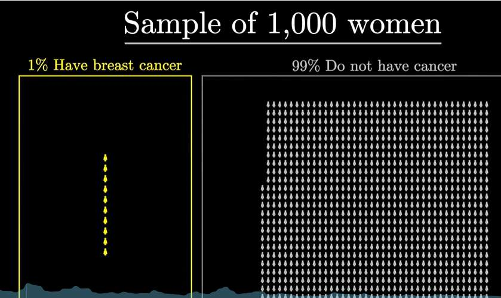
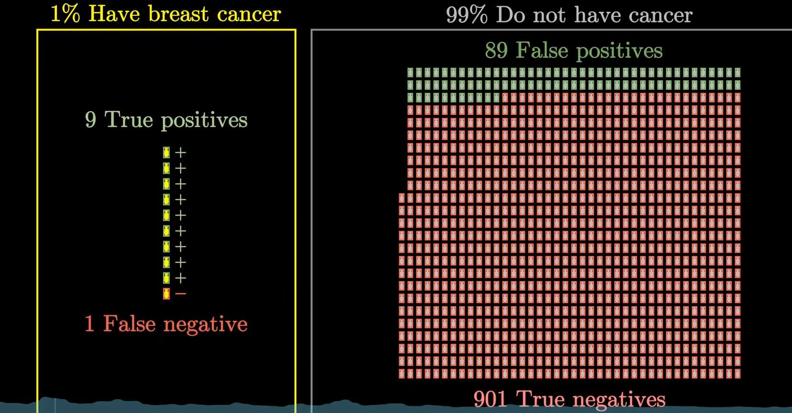
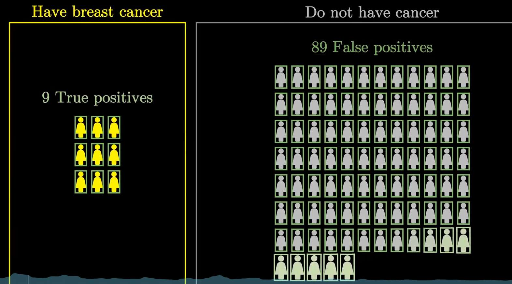
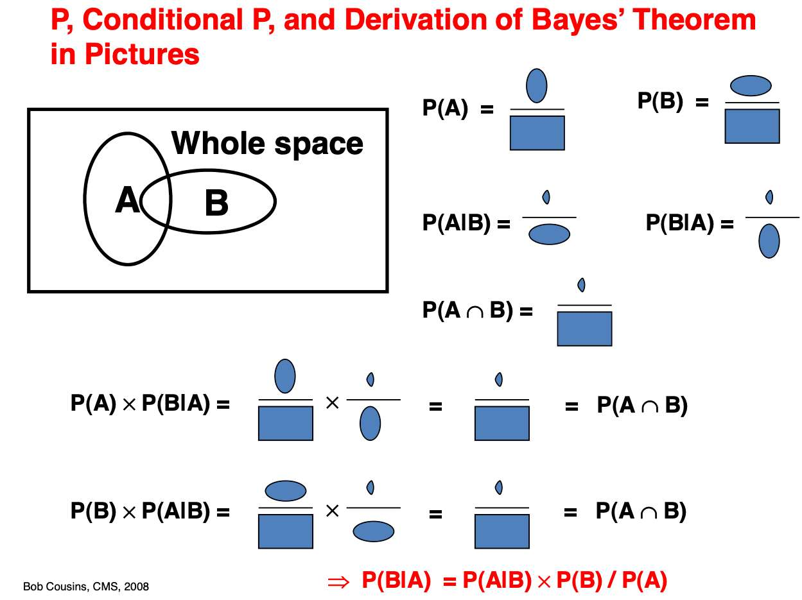

讲解如何简单地理解贝叶斯背后的哲学，以及在AI领域的俩大应用

在最近的学习中，不禁要感叹：
**贝叶斯公式实在太太太常见了！**

而如果我们仅仅是 把公式 记住  ，
对我们理解它的重要性，含义，没有任何好处。

下面，我将从直觉建立开始，再到严谨数学对齐，再到最后的AI领域应用，详细解剖贝叶斯。

放心，这绝对是一场轻松的旅程！

# **一个“攸关性命”的认知陷阱**

假设，你现在是令人尊敬的医生。
你的任务是，根据现有医学试纸检测出的结果，判断你的患者是否患癌，你的决策几乎决定了一个人的性命。

幸运的是，你有一些东西辅助你决策，

首先是医学界过往的,患病率的数据

我们发现，过往的数据是这些：
*   **总人口**: 1000 人
*   **真实患病 (Positive)**: 10 人
*   **真实健康 (Negative)**: 990 人

这个数据直观的感受到了，患病率其实不算很多，**1%**，对吧。

接着，你还有医学界目前有的检测手段，某种试纸，对这1000人的检测情况

我们定义一下名词：
真/假 指的是检测结果的对错，阳/阴指的是检测的结果，（  阳指的是患病，阴指的是健康）

举例：

真阳指的是“真的患病”  假阳指的是“假的患病，即检测出是患病（阳），但实际不对。他是健康的。”

现在，我们来看检测结果：
*   **TP (真阳性)**: 9 人 (真实患病，且检测为阳性)
*   **FN (假阴性)**: 1 人 (真实患病，但检测为阴性)
*   **FP (假阳性)**: 89 人 (真实健康，但检测为阳性)
*   **TN (真阴性)**: 901 人 (真实健康，且检测为阴性)

现在我们来计算俩个指标：

*   **Sensitivity (敏感度)**: 也叫**召回率 (Recall)** 或 **真正例率 (TPR)**
    *   **公式**: $TPR = TP / (TP + FN) = 9 / (9+1) = 9/10 = 90\%$
    *   **含义**: 在**所有真正患病的人中**，检测方法能成功**找出**多少。

*   **Specificity (特异度)**: 这是 **真负例率 (TNR)**。
    *   **公式**: $TNR = TN / (TN + FP) = 901 / (901+89) = 901 / 990 \approx 91\%$
    *   **含义**: 在**所有真正健康的人中**，检测方法能成功**排除**多少。

好，回到我们的任务。
我们任务，判断病人是否患病，可以转化为，
“如果知道一个人检测出来是阳性，他有多大概率，真的患病？”

而根据刚才的俩个指标，看看他们的定义，他们都高达90%，有没有觉得，凭借直觉，一个人检测出阳性，他大概率也90%概率患病？

**啊哦**！ 实际上，你刚才反而约90%概率，让一个正常人以为他得了癌症，悲痛欲绝....

为什么？

我们现在不靠直觉，计算一下：

求的是，检测出阳性的人，真实患病的概率

P(患病|阳性)  =  9/89+9    

其实是很小的数字！真实概率只有惊人的9%

意外吗！意味着，当我们拿着10个人的阳性检测报告时，其中只有1个人是真的患病，我们很容易误判！

这里很自然地引起了我们的困惑：

1. 为什么我们的直觉在这里会彻底失效？
2. 我们应该如何建立一个可靠的思维框架来纠正这种偏误？

#  **重建直觉**

## 为什么刚才的直觉会失效？

实际上，我们需要的数据，“所有阳性的人，其真实患病的占比多少” 
其样本空间，是所有阳性的人 。

我们只关心“**绿色框框**“。
“在所有绿色框框的人当中，来自‘真病人’区域的比例是多少？” 答案是 9 / (9 + 89)

而召回率的样本空间是“所有患病的人”（10人）。 特异度的样本空间是“所有健康的人”（990人）。

好像.... **本来就毫无关联**。

只是我们从心理上，感觉，   患病的人都容易检测出阳   健康的人也容易检测出健康  这俩个数据听起来非常棒

那个“棒”的感觉 ， 也带到了**准确率** --- 那是不是阳的人 都差不多能检测出患病？

然而，让我们再次直面那个令人震撼的对比：**9 vs 89**。怎么所有阳的人中，只有9个是真的患病！

- **9个真阳性**：这是我们竭尽全力，从10个病人中找出来的，已经接近极限了（100%召回也就10个）。
- **89个假阳性**：这89个人，仅仅占990个健康人的**9%**。在健康人的庞大基数中中，9%的误诊率看起来微不足道。

而我们**精确率** ， 真正的关注了所有阳的人 ：  9 个真阳人    89个假阳人  

健康人的基数太大了（990人）。即便只有极小比例的健康人被误判（9%），其绝对数量（89人）也比那稀少的真正患者（9人）多得多。

为了彻底打破直觉，让我们做一个极端的推演：  
即使这个测验试纸完美无缺，**召回率达到100%**（10个病人都抓住了），结果会怎样？

- 假阳性：依然是89人（只要误诊率和健康基数不变）。
- **准确率** = 10 / (10 + 89) ≈ **10.1%**

即便机器不错过任何一个病人，准确率也仅仅从9%提升到了10%。

所以，也可以说，是基数，误导了我们。

并不是机器不够准（召回率不够高），而是“健康”这个基数实在太大了。
当我们忽略了基数，仅凭试纸指标做判断时，我们就不可避免地陷入了认知陷阱。

## 如何更好的思考

看来，我们的数据，可能有很多，我们可以自己组合出”精确率、敏感度、特异度....“

但到底如何用他们，才能尽可能有效的帮助我们决策，而不是产生像刚才那样的”**基数谬误**“。

我们先不讲如何纠正基数谬误，我们直接看更高级的思考方式。

下面，请看一种新的推理方法——**信念更新**。

这种视角模仿了人类认知的动态过程：**我原本相信什么？新的证据如何修正我的看法？**

### 确立“先验” 
在没有任何检测报告之前，你对一个人“患病”的信念应该基于已知的、先前的大盘数据。

我们已知：10个病人，990个健康人。

这时，我们对一个“检测结果阳性的人“，其患病的信念是极弱的，同时，不过他检测结果是啥样，如果我们**仅仅通过我们大盘数据产生的直觉**，我们都觉得他不大可能真的患病。

我们可以用**赔率（理解为比例）** 来表示这个直觉的程度：
*   **患病 : 健康 = 10 : 990** (或者约简为 1 : 99)
这意味着，你随便抓一个人，他健康的概率是患病的99倍。

我们将其称为”先验“，英文**prior**(先前的)。

### 评估“似然比”

现在，检测报告显示“阳性”。这个证据有多强？

我们需要把“检测工具”从“人群”中剥离出来评价。

*   如果一个人真有病，阳性的概率是 90% (敏感度)。
*   如果一个人没病，阳性的概率是 9% (误诊率)。

**“阳性”这个信号，源自“患病”的可能性，是源自“健康”的可能性多少倍？**
$$ \text{似然比} = \frac{P(\text{阳}|\text{患})}{P(\text{阳}|\text{健})} = \frac{90\%}{9\%} = 10 $$

**这个“10”至关重要。** 它代表了证据
$$\frac{\text{抓取真相的能力}}{\text{产生噪音的倾向}}$$

我还是倾向于”似然比“翻译为**信噪比**。

这是一个**纯粹的、不依赖于具体人群基数**的指标。

无论你在中国测还是在美国测，只要试纸不变，这个“10倍”的信噪比就不变。

其表示，”阳“这个信号由“真病”触发的可能性，是由“误判”触发的10倍。它是一个强有力的证据，它想把你的信念往“他真的是患病”那边猛推。

### 合成 —— 贝叶斯更新
现在，我们将两个独立的部分结合：
1.  **原本的偏见**（健康人多得要是病人的99倍）。
2.  **证据的推力**（这个信号更有可能是病人发出的，强度是10倍）。

公式非常优雅：
$$ \text{后验赔率} = \text{先验赔率} \times \text{似然比} $$

$$ \text{后验赔率} = (10 : 990) \times 10 $$

这里发生了一个直观的对抗：
*   健康那边基数极大（990），但被证据削弱了（因为健康人不容易出阳性）。
*   患病那边基数极小（10），但被证据极大地增强了（乘了10倍）。

计算结果：
$$ \text{患病} : \text{健康} = 100 : 990 \approx 1 : 9.9 $$
*(注：我们可以理解为 10 * 0.9 : 990 * 0.09 = 9 : 89.1， 1：9.9和9：89.1完全一样！)*

最终赔率约为 **10 : 99**（即数人头得到的结果9:89）

### 为什么两种方法结果一样？

*   **我们通过全知视角数人头**得到：真阳性9人，假阳性89人。比例是 9 : 89。
*   **信念更新方法**说：赔率是 10 : 99。 (9/89 ≈ 0.101, 10/99 ≈ 0.101)

二者完全一致是**为什么？**

因为“信念更新”的本质，就是分别计算了”先验“中，分子的增长和分母的缩放：
*   分子（患病侧）：原本只有10人，但因为90%的敏感度，大部分保留了下来。
*   分母（健康侧）：原本有990人，但因为只有9%的误诊率，大部分被剔除了。

患病侧留下的，是”阳人“，健康侧留下的，也是“阳人”，实际上，和我们数人头方式（把“阳人”聚拢在一起数“真阳人”）就是等价的。

只不过呢，贝叶斯公式（赔率形式）是用一种更逻辑化的语言，描述了这个“**筛选**”的过程：

它用**似然比**作为过滤器，去修正原本悬殊的**先验赔率**。

最终，我们可以把把赔率是10 : 99   转化为概率：
$$ P = \frac{10}{10 + 99} \approx 9.1\% $$

我们可以看到，我们用到了“庞大的基数”这一背景！就体现在**先验**上，同时我们也用到了“阳性检测报告”的俩个指标。 我们没有陷入基数谬误，也利用了试纸的性能（似然比）

最终可以翻译为：

**即便有一个增强10倍信念的证据（似然比=10），也无法彻底扭转1:99这样悬殊的初始劣势（先验）。**

# 贝叶斯语言

现在，一切直觉就绪，我们来隆重介绍一下”贝叶斯“！

公式是这样的：
$$ P(H|E) = \frac{P(E|H) \cdot P(H)}{P(E)} $$
其实，正是上一节，我们所讲的信念更新的思考方式，其比较偏数学的，概率版本。

上一节，我们最开始用的“赔率”的视角或者说比值，只要算出 真阳性：假阳性  =  **10 : 99**，我们的任务就完成了。

而如果转换熟悉的概率，
我们需要计算 **`[真阳性] / ([真阳性] + [假阳性])`**

这个分母 **`([真阳性] + [假阳性])`**，也就是所有检测为阳性的人数。

换句话说，我们的“似然比”，其实，变成了
$$ \frac{P(E|H)}{P(E)} $$

可能你有点懵，但你只需要知道，贝叶斯公式只是上一节讲的思考方式的另一种表达形式。

接着我们顺着这个贝叶斯公式，详细讲解，我们的“似然比”去哪了！

## **组件详解与例子映射**

公式中的四个部分，每一个都有其深刻的物理含义。我们将刚才的医疗案例代入

### **1. 后验概率 (Posterior): $P(H|E)$**
*   **定义：** 在看到证据 $E$ 之后，我们对假设 $H$ 的**新**信念。
*   **对应：** $P(\text{患病}|\text{阳性})$。即我们最终计算出的 **9.1%**。。

### **2. 似然 (Likelihood): $P(E|H)$**
*   **定义：** 如果假设 $H$ 是真的，那么出现证据 $E$ 的可能性有多大？
*   **对应：** $P(\text{阳性}|\text{患病})$。即**敏感度 (TPR) = 90%**。

注意！这里它不再是比值，而是**单方面的强度**。它**只描述**了“患病导致阳性”的能力，或者说“患病这个证据有多少强度能说服我们其为阳性”  

至于“健康导致阳性”的能力，不在分子里。一会我们就能见到他。

### **3. 先验概率 (Prior): $P(H)$**
*   **定义：** 在没看到任何证据之前，我们对假设 $H$ 的**旧**信念。
*   **对应：** $P(\text{患病})$。即人群中的基础患病率 **1%**。

这是导致我们直觉偏差（基数谬误）的根源——我们往往忽略了它。

### **4. 证据/边缘似然 (Evidence): $P(E)$**
*   **含义：** 证据 $E$ 发生的**总概率**（不管你是否真的患病，只要是阳性都算）。它是归一化常数，确保后验概率总和为1。

*   **计算方法（全概率公式）：**
    它是由所有可能导致阳性的路径加和而成的：
    $$ P(E) = \underbrace{P(E|H)P(H)}_{\text{真阳性路径}} + \underbrace{P(E|\neg H)P(\neg H)}_{\text{假阳性路径}} $$
*   **对应：**
    $$ P(\text{阳}) = (90\% \times 1\%) + (9\% \times 99\%) $$
    $$ P(\text{阳}) = 0.9\% (\text{真阳}) + 8.91\% (\text{假阳}) = 9.81\% $$
*   **地位：** 它的作用是将分子（真阳性）放到一个全集（所有阳性）中去衡量占比。

## **两种视角的统一**

让我试着从这个”**概率**“版本推回到上一节的**赔率**

#### **1. 定义符号**
*   $H$ (Hypothesis): 患病
*   $\neg H$ (Not Hypothesis): 健康
*   $E$ (Evidence): 检测为阳性

#### **2. 起点：贝叶斯定理的标准形式**
我们想求 $P(H|E)$，即“阳性条件下患病的概率”。
$$ P(H|E) = \frac{P(E|H)P(H)}{P(E)} $$
同理，我们可以写出“阳性条件下**健康**的概率”：
$$ P(\neg H|E) = \frac{P(E|\neg H)P(\neg H)}{P(E)} $$

#### **3. 作比**
如果我们关心的是“患病 vs 健康”的相对关系，与其分别算出这两个概率，不如直接计算它们的**比值**。

我们将上面两个式子相除：
$$ \frac{P(H|E)}{P(\neg H|E)} = \frac{\frac{P(E|H)P(H)}{P(E)}}{\frac{P(E|\neg H)P(\neg H)}{P(E)}} $$

#### **4. 消去分母**
注意看公式里最难解释的那一项——分母 $P(E)$。它在分子和分母中同时出现，直接**抵消**了！

式子简化为：
$$ \frac{P(H|E)}{P(\neg H|E)} = \frac{P(E|H)P(H)}{P(E|\neg H)P(\neg H)} $$

#### **5. 重新分组**
我们把右边的项重新排列组合一下，把关于“外界环境”的项放在一起，把关于“检测工具”的项放在一起：

$$ \underbrace{\frac{P(H|E)}{P(\neg H|E)}}_{\text{后验赔率}} = \underbrace{\frac{P(H)}{P(\neg H)}}_{\text{先验赔率}} \times \underbrace{\frac{P(E|H)}{P(E|\neg H)}}_{\text{似然比}} $$

#### **6. 映射回现实**
让我们把每一项对应回例子：

*   **似然比 (Likelihood Ratio):**
    $$ \frac{P(E|H)}{P(E|\neg H)} = \frac{P(\text{阳}|\text{患})}{P(\text{阳}|\text{健})} = \frac{\text{敏感度}}{\text{误诊率}} $$
    *(这就是算出的 10)*

*   **先验赔率 (Prior Odds):**
    $$ \frac{P(H)}{P(\neg H)} = \frac{P(\text{患})}{P(\text{健})} $$
    *(这就是算出的 1/99)*

*   **结论：**
    $$ \text{后验赔率} = \frac{1}{99} \times 10 = \frac{10}{99} $$

所以俩者，确实可以说是”等价“的，

小小的区别就是

*   **上一节的赔率法：**
    $$ \text{真阳} : \text{假阳} = 0.9 : 8.91 $$
    我们只关心两者的**相对强弱**。

*   **本节的概率法：**
    $$ P = \frac{\text{真阳}}{\text{真阳} + \text{假阳}} = \frac{0.9}{0.9 + 8.91} = \frac{0.9}{9.81} \approx 9.1\% $$
    我们关心的是真理的**纯度**。

可以说他们表示的东西，其本质相同，都是来和我们的“先验”互相“校准”的。

## 定理的证明
现在，我们再用纯粹的数学，证明贝叶斯公式完全没有问题。

假设有两个事件：
*   $H$ ：假设（例如：患病）。
*   $E$ ：证据（例如：检测阳性）。

我们要找的是两个事件同时发生的概率，即联合概率 $P(H \cap E)$。
我们可以从两个不同的方向来描述这件事情：

1.  **因果**： 先有“患病”这个因，再表现出“阳性”这个果。
$$ P(H \cap E) = P(E|H) \cdot P(H) $$
    *(翻译：患病的概率 × 患病前提下检测出阳性的概率)*

2.  **观察流** : 先看到了“阳性”这个果，再推测“患病”这个因。
    $$ P(H \cap E) = P(H|E) \cdot P(E) $$
    *(翻译：检测出阳性的概率 × 阳性前提下确实患病的概率)*

因为“患病且阳性”和“阳性且患病”是同一个事实（$H \cap E$ 是同一个区域），所以上述两个等式的右边必须相等！

$$ P(H|E) \cdot P(E) = P(E|H) \cdot P(H) $$

我们需要求解的是 $P(H|E)$（逆向推理），只需简单移项，就得到了大名鼎鼎的**贝叶斯公式**：

$$ P(H|E) = \frac{P(E|H) \cdot P(H)}{P(E)} $$

还有一种，很简单的可视化证明：

## **总结**

让我们再次审视这个公式，来理解“信念更新”：
$$ P(H|E) = \frac{P(E|H) \cdot P(H)}{P(E)} $$

$$ P(\text{后验}) = \frac{\text{似然} \times \text{先验}}{\text{证据}} $$

*   **输入：** 你的初始偏见（先验 $P(H)$，即1%）。
*   **处理：** 观察现实，看证据与假设的吻合度（似然 $P(E|H)$，即90%）。
*   **修正：** 似然很高，想把概率拉高；但先验很低，死死拽住。
*   **标准化：** 除以证据的总发生率 $P(E)$，确保后验概率总和为1。可以看作，是我们为了数学上表现出“好看”的概率而不是上一章的赔率，做的处理。或者，也可以理解**似然/证据** 是赔率章节中，“**似然比**”的新表示。

最终，**90%的似然性**与**1%的先验**在这一框架下博弈，得出了**9.1%的后验真理**。

这就是理性思考的数学形式：**不偏信经验（先验），也不盲从数据（似然），而是在两者之间寻找最佳的平衡。**

# **贝叶斯在AI的应用——反向推理**

前两章我们学会了如何修正对“得病”的信念。
了解了“贝叶斯”是如何帮我们举措的。

笔者是人工智能领域的学生，如果你也感兴趣，此小节会探讨贝叶斯在**AI的应用**。

在人工智能的眼中，世界只有两样东西：
1.  **数据 (Data, $X$):** 我们观察到的事实（比如：一张猫的图片，或者前面的“阳性报告”）。
2.  **参数 (Parameters, $\theta$):** 决定模型行为的内部配置（比如：神经网络的权重，或者前面的“患病与否”）。

我们做AI（机器学习），本质上就是要在**已知数据 $X$** 的情况下，**反推**出最合理的**参数 $\theta$**。

## **从频率到信念**

这听起来很简单，就像看答案猜题一样。但在实际操作中，我们面临一个巨大的困境：**数据永远是不够的。**

这就引出了 AI 界两种截然不同的解决思路，：**频率学派**与**贝叶斯学派**。

*   **频率学派:**
    *   **核心：** 参数 $\theta$ 是固定的真理，只是我们不知道。
    *   **方法：** 既然参数是固定的，那我就完全听数据的。谁能让眼前的数据出现概率最大，谁就是对的参数。测试的工具是是**最大似然估计 (MLE)**——即寻找一组参数，让眼前这组数据出现的概率最大。$$\theta_{MLE} = \text{argmax } P(X|\theta)$$
    *  **缺陷**：因为频率派拒绝引入“**先验**”（不相信经验，只信数据）。 当数据很少时，频率派很容易过拟合，即过于随机、结果波动大。假设你抛一枚硬币，只抛了3次，全是正面根据数据，P(正面)=100%, 那就目前情况来看，**这枚硬币绝对是两面都是正的**。对啊，只有俩面都正，才能最靠近目前我们有的数据P(正面）。我们可以看到，这种方法，结果极端且波动巨大。

*   **贝叶斯学派:**
    *  **核心：** 参数 $\theta$ 本身就是一个**随机变量**，它具有不确定性。我们对参数有自己的信念。
    *   **方法：** 我们先有一个预判（先验），然后用数据去修正它。
         还是抛硬币，3次全是正面。虽然数据全是正面（似然高），但我的**先验**告诉我“硬币通常是均匀的”。于是修正一下，我猜正面概率大概是 70%，而不是 100%。先验起到了“刹车”的作用，防止模型在数据少时走极端。在AI中，这就是**正则化** 的本质。我们在告诉模型：“去拟合数据吧，但别太疯狂，我们认为，参数不会太过分的（我们的先验）”  
         $$\theta_{MAP} = \text{argmax } P(X|\theta)P(\theta)$$

确实，看起来，贝叶斯学派更可靠些。

那贝叶斯到底如何指导AI训练的？下面讲俩个实际应用。
- **朴素贝叶斯分类**： 模型本身就是由贝叶斯公式构建的，是直接用贝叶斯公式计算出”模型参数“
- **扩散模型**：我们贝叶斯公式推导出的理想训练标签，指导神经网络的学习，调整模型参数。

## 实际应用

### 朴素贝叶斯分类

假如没有贝叶斯公式，我们要如何设计一个“垃圾邮件识别器”？

我们大概率会采用“关键词匹配”的方法。
#### **前贝叶斯时代**

我们的逻辑是硬性的：
*   **规则 A：** 如果邮件里包含“发票”，判定为垃圾邮件。
*   **规则 B：** 如果邮件里包含“免费”，判定为垃圾邮件。
*   **规则 C：** 如果邮件里包含“朋友”，判定为正常邮件。

很简单，但面对复杂场景呢：

*   **冲突**
    *   邮件内容：“亲爱的**朋友**，这是你要的**发票**。”
    *   *规则系统：* 宕机了。规则A说是垃圾，规则C说是正常。听谁的？我们需要人工再去写一条“规则D”来处理这种情况。
*   **缺乏量化**
    *   “博彩”和“打折”，这两个词虽然都是垃圾词，但程度一样吗？规则系统通常只能标记 0 或 1，无法区分“极度可疑”和“稍微可疑”。
*   **忽略背景**
    *   如果你是个会计，你的邮箱里全是正经的“发票”。规则系统依然会无脑拦截，因为它不看背景（先验）。

#### **贝叶斯时代**

贝叶斯分类器的引入，本质上引入 “软概率”**。

贝叶斯不再说“有发票就是垃圾”，而是说：“‘发票’提供了 **+50分** 的垃圾嫌疑，‘朋友’提供了 **-30分** 的垃圾嫌疑。”

 结果：$50 - 30 = +20$。综合来看，还是偏向垃圾，但没那么确定。**它解决了冲突。**

通过统计数据，贝叶斯会自动学习到：
*   “澳门首家线上赌场” $\to$ 垃圾概率 99%（权重极大）。
*   “免费” $\to$ 垃圾概率 60%（权重中等）。
*   模型能精确感知每个证据的分量。

当然啦，最重要的是，我们**引入了先验**

如果你是会计（会计的邮箱里大部分是发票），你的**先验参数** $\theta_{prior}(\text{垃圾})$ 会很低。

这就像给“正常邮件”加了一个巨大的初始分。即使出现了“发票”这个词，总分依然倾向于正常。

总结一下，
1.  **先验参数 ($\theta_{prior}$):** 这封邮件本身是垃圾邮件的概率有多大？（比如 $P(\text{垃圾}) = 40\%$）。
2.  **似然参数 ($\theta_{likelihood}$):** 在垃圾邮件里，“发票”这个词出现的频率是多少？（比如 $P(\text{发票}|\text{垃圾}) = 50\%$）。

**这些具体的概率值（0.4, 0.5...），就是这个模型的参数 $\theta$！

**计算那些 $\theta$ 参数的原因，便是因为我们要把每个证据的“话语权”精确地算出来。**

怎么确定这些参数呢？

我们是在**寻找最能解释数据的参数**

*   **数据 $X$：** 你手里的10万封已标注的历史邮件。
*   **训练方法：** **加先验的MAP**。

*   系统会去数数：10万封邮件里，有4万封是垃圾。
*   于是参数 $\theta_{prior}$ 被确定为 0.4。
*   系统会去数数：在4万封垃圾邮件里，有2万封出现了“发票”。
*   于是参数 $\theta_{invoice}$ 被确定为 0.5。

现在，模型训练好了（参数 $\theta$ 都有值了）。
来了一封**新邮件**（证据 $X_{new}$）：内容只有两个字——“发票”。
我们要判断它是垃圾邮件的概率。

这时，我们用**无分母的贝叶斯公式**进行“跑分”：
为什么无分母？
我们的目标不是为了精准计算出“参数 $\theta$ 的概率具体是0.91还是0.92”，而是为了**找到最好的那个 $\theta$**（即 argmax）。也就是，我们是要从一堆参数里去**作比较**。

$$ \begin{aligned} \text{Score}(\text{垃圾}) & \propto P(\text{发票}|\text{垃圾}) \cdot P(\text{垃圾}) \\ & \propto \theta_{invoice} \cdot \theta_{prior} \\ & \propto 0.5 \times 0.4 = \mathbf{0.2} \end{aligned} $$

同理，计算它是正常邮件的分数，比较大小，谁分数高，就归为哪一类。

#### 朴素
至于”**朴素**“二字，则是一种”简化手段“。

因为实际上，我们面对一个邮件，并不是只有几个字。

实际要判断的是
由数千个词组成的序列 $X = (x_1, x_2, ..., x_n)$。
我们需要计算的是联合似然：
$$ P(\text{数千个词的特定组合} \mid \text{垃圾}) $$ 
这个我们实在学不来啊！！！语言的组合是无穷的

但我们可以假设，这些文字，都是独立的，所以”组合“ 变成了数千个独立的概率，
$$ P(X|\text{垃圾}) \approx P(\text{发票}|\text{垃圾}) \cdot P(\text{你好}|\text{垃圾}) \cdot ... $$这些概率，我们是很好统计的。

但总而言之， 核心思想仍然是利用贝叶斯，进行分类工作。

###  扩散模型 

扩散模型的直觉很简单，想想我们使用的图片生成模型，是不是“先模糊”“后清晰”？

模型生成时，我们是将一团噪点的图片，一步一步，去噪，变成清晰图片的 。

那么到底如何做到，去噪声，最终得到了一个人类能看懂的清晰照片？
#### 训练过程直觉
模型训练时，我们是先给出一个确定的清晰的图，然后加噪声，加完之后，训练模型“去除噪声”，恢复成原图的能力。

我们会用很多人类能看懂的清晰图片来做这个工作。

所以，如果你下载一个纯粹的扩散模型，随机生成一团噪声，让他去噪。即使我们复制这个噪声10份，让模型分别进行去噪，同样的噪声，得到的图片却不同。但都是人类能看懂的。

如果训练的数据集很多猫猫，那结果也很大概率生成猫猫，因为模型学习了很多“如何从噪声里面去除噪声直至还原为一个猫的图片？”

下面再详细讲下：

#### **前向过程的加噪**

不是把像素值改一下：比如像素是100，我加个10，变成110。

噪声不是一个固定的数（比如永远+10），而是一个符合数学之美的随机数（其实就是高斯分布）。

假设 $x_{t-1}$ 是你手里的一张照片，其中某一个像素点的亮度是 **100**。

现在，我们要得到下一秒的照片 $x_t$。

规则：**保留一点原样，加一点高斯噪声。**

公式写成这样：

$$ x_t = \underbrace{\sqrt{1-\beta} \cdot x_{t-1}}_{\text{保留原样}} + \underbrace{\sqrt{\beta} \cdot \epsilon}_{\text{加入随机噪声}} $$
这里的 $\epsilon$ 是从**标准正态分布（高斯分布)里随机抽出来的一个数**。
$\epsilon$ 可能是 0.5，也可能是 -1.2，也可能是 2.1...（虽然大概率在0附近，但理论上可能是任何值）。

因为 $\epsilon$ 是**随机**的，所以算出来的 $x_t$ 也是**随机**的。

在我们还没进行“抽奖”之前，我们无法确定 $x_t$ 到底是多少。

但是，我们知道 $x_t$ **大概率**会落在哪里。

它大概率落在 90 附近，呈钟形曲线（高斯分布）散开。

**这就是概率的介入点。**

所以我们用$P(x_t | x_{t-1})$表示这个过程：

**“已知上一张图是 $x_{t-1}$，那么下一张图 $x_t$ 变成各种可能样子的概率密度是多少？”**

所以，在训练阶段，这是非常清晰，可以计算的。因为规则是我们定的，这个概率分布我们**完全已知**。

#### **逆向过程的去噪**
现在仍然是训练阶段， 不过假设我们已经把噪声加完了，我们要去噪，训练模型从噪声中还原原图的能力。

即：已知现在的图很糊 ($x_t$)，求上一秒那张清晰点的图 ($x_{t-1}$) 长什么样？

这种“反向推理”的想法，
也出现在“我们知道患者阳，他有多大概率患病？”
我们如何解决的？

#### 贝叶斯的应用

贝叶斯！

我们试图列出贝叶斯公式：
$$ q(x_{t-1} | x_t) = \frac{ \overbrace{q(x_t | x_{t-1})}^{\text{前向(似然)}} \cdot \overbrace{q(x_{t-1})}^{\text{先验}} }{ \underbrace{q(x_t)}_{\text{分母(边缘概率)}} } $$

在这里，有点尴尬：
1.  **分母 $q(x_t)$ 算不出来**：我们需要遍历世界上所有可能的图片，算出它们变成当前这张噪点图的概率总和。
2.  **先验 $q(x_{t-1})$ 不知道**：我们不知道“稍微清晰一点的图”在世界上所有可能的图片中的概率。

虽然我们无法直接算出 $q(x_{t-1} | x_t)$，但在**训练阶段**，我们有**原图** $x_0$**（那张清晰的猫）。

如果我们**已知原图 $x_0$**，贝叶斯公式突然就变得可解了

只要知道了起点（$x_0$）和当前点（$x_t$），推断中间点（$x_{t-1}$）就是纯粹的高斯分布计算：

$$ q(x_{t-1} | x_t, \mathbf{x_0}) = \frac{ q(x_t | x_{t-1}, \mathbf{x_0}) \cdot q(x_{t-1} | \mathbf{x_0}) }{ q(x_t | \mathbf{x_0}) } $$

在扩散过程中，虽然我们是一步步加噪（$x_0 \to x_1 \to x_2 \dots$），

但因为每次加的都是高斯噪声，**无数个小高斯噪声叠加起来，还是一个大高斯噪声。**

所以，只要知道原图 $x_0$，我们可以直接算出任意时刻 $t$ 的状态 $q(x_t | x_0)$：
*   它依然是一个高斯分布。
*   均值是 $x_0$ 缩小一点点。
*   方差是很多步噪声的叠加。

只要有 $x_0$，不管是 $x_t$ 还是 $x_{t-1}$，它们相对于 $x_0$ 的分布我们都**一清二楚**。

所以现在贝叶斯公式的各个项，都是已知的！！

即公式变成了这样：
$$ \text{未知分布} = \frac{\text{高斯A} \times \text{高斯B}}{\text{高斯C}} $$

在数学上，**高斯分布乘除高斯分布，结果依然是高斯分布！**

我们要找的那个后验分布 $q(x_{t-1} | x_t, x_0)$，**必然也是一个高斯分布**。

我们不管高斯分布是个啥，我们只用知道，这是我们完全能算出来的东西。

我们是完全知道，模型应该如何“去噪”的，我们可以用其指导模型训练。

那么**训练时**，模型的能力还不足，不会识别噪音。但是我们通过“贝叶斯”得到的标准答案，就能指导模型，让模型调整参数。

**生成时**，我们手里没有 什么原图$x_0$。但是，神经网络已经学会了那个映射关系，
神经网络看着一团模糊的 $x_t$，“嗯...根据之前的训练经验，这种噪点分布，它的原图大概长那样（训练时记忆的），所以我应该那样去除噪声。”

**贝叶斯**，在训练时，通过它得到的正确噪声，指导模型，让模型学会“识别噪声”。
才能让模型学会“去噪”。

# 总结
整篇文章中，我们一直在做同一件事：**由果索因**。

$$ P(\text{因}|\text{果}) \propto P(\text{果}|\text{因}) \times P(\text{因}) $$
- **在医院里：** 我们看到了“阳性”这个**果**，试图推断“患病”这个**因**。
- **在邮箱里：** 我们看到了“发票”这个**果**，试图推断“垃圾邮件”这个**因**。
- **在扩散模型里：** 我们看到了“噪点”这个**果**，试图推断“清晰原图”这个**因**

这是大模型生成的一句话，我很喜欢：

**世界展示给我们的永远是充满噪音的表象（Likelihood），而我们渴望得到的永远是其背后的真相（Posterior）**

**贝叶斯不偏信“经验”（先验）：**  
    哪怕你是会计，哪怕患病率只有1%，如果证据足够强（似然比极高），我们依然会修正信念，承认“这封邮件是垃圾”或“这个人确实病了”。
**也不盲从“现实”（似然）：**  
    哪怕硬币抛出3次全是正面，哪怕神经网络在训练时想死记硬背，先验知识（正则化/高斯分布假设）依然会像一只无形的手，拉回理性，防止过拟合。

当你感到迷茫时，不妨回到贝叶斯：  

**“我现在有什么证据？我原有的信念是什么？我该如何更新我的认知？”**

这不仅是计算概率的方法，更是我们面对不确定世界时，最理性的生活方式

# 参考资料
贝叶斯：
https://theoryandpractice.org/stats-ds-book/bayes_theorem.html
https://www.bilibili.com/video/BV1Ei4y1F72M/?spm_id_from=333.1387.search.video_card.click&vd_source=75bbed22d60140f515b7fda5f0bd532d
扩散模型：
https://zhuanlan.zhihu.com/p/586362713
https://spaces.ac.cn/archives/9164
