前两篇文章，我们着重介绍了attention机制。

我们明白，attention是**输入一个句子的向量，吐出一个形状一模一样的向量**。

但奇迹在于，这个句子中，每个词向量都蕴含着上下文的信息。
可以说，每个词都真正“**读懂**”了它所在的整个句子。

那，我们到底如何“**用**”它呢？

现在，万事俱备。是时候让Self-Attention、Cross-Attention、Multi-Head Attention和Positional Encoding这些强大的“插件”各就各位，协同作战了。

我们将亲手将它们组装起来，见证那个神奇的架构：**Transformer**！

# Encoder-Decoder
在深入复杂的线路之前，我们先从高空俯瞰Transformer的整个架构。
这个架构称为Encoder-Decoder。

我们先英译中：
- Endoder：编码器
- Decoder：解码器

**编码器**，顾名思义，是将输入，进行**加工**！加工后输出，这个加工的过程就叫“编码”。它不直接生产任何新东西，而是产出一份蕴含了对原文最深刻理解的文稿。
**解码器**，看名字，是对编码进行“**破译**”。那对着加工后的句子，能破译什么呢？ 实际上，这里的“破译”，是生成的意思。Decoder会看着Encoder传来的文稿，一个 词一个词地、小心翼翼地，生成输出句子（比如对应的法文翻译）。

接下来，让我们详细看看，Encoder和Decoder内部都是什么，

以及，Decoder如何接收Encoder的信息，又是如何破译、生成出新的信息。
# Encoder
要理解数据是怎么在Encoder流动的，我们先搞清楚数据长什么样！

我们送入的是句子，但是为机器能看懂的句子。
还记得第一篇文章所讲的稠密词向量吗？
我们送入句子向量的维度为，`[batch_size,seq_len,d_model]`

- batch_size，指批次（组），比如3，则指每组有3个句子。我们为了效率，一般都是成组成组（成批次）地将句子送入模型
- seq_len，指句子长度，也就是句子中，词的个数。
- d_model，指词向量的维度，一般为512。这512个浮点数，共同编码着词的语义。

为了讲解方便，我们暂时忽略batch_size，将输入的“原材料”视为一个` [seq_len, d_model]` 的二维矩阵。
我们假设batch_size就为1，省略掉他.
如图为例：
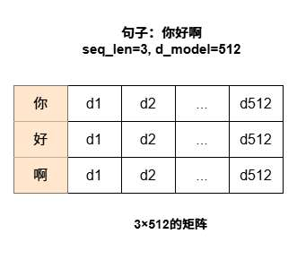

现在，原材料被送上了Encoder的第一道加工单元（一个Encoder Block）。 
我们先来看一次完整的Encoder Block包含哪些步骤。

##  **全局信息交互**
刚一来，句子就进入“阅览室”。

各个词都是互相见面的，他们打了个招呼，就开始上一篇文章讲的“图书馆阅览“流程

每个词向量都会**同时扮演“读者”和“书籍”的角色**，阅览其他所有词（包括自己），最终得到自己的向量。

这正是我们上一篇文章精讲的Self-Attention机制。

当然，为了避免“单一视角的陷阱”，我们启用了更强大的**Multi-Head Attention**。

同时，为了让模型感知到语序，输入的词向量在进入这里之前，**已经加法融合了“位置编码”** 这个感知语序的坐标！

我们简单回顾一下阅览室内会发生什么（详细过程请参考上一篇系列文章）
1. **输入准备**：`[seq_len, d_model]` 维度的、已添加位置编码的词向量矩阵 X。
2. **QKV矩阵**：将 X 分别通过三个独立的线性层，生成宏观的 Q、K、V 矩阵。
3. **多头分身**：将 Q、K、V 矩阵在 d_model 维度上进行切分，拆解成8个“头”，得到 q₁, k₁, v₁ ... q₈, k₈, v₈。
4. **并行阅览**：每个“头”独立并行地执行自己的Scaled Dot-Product Attention计算，得到各自的“阅读报告” Z₁ ... Z₈。
5. **整合信息**：将8份“阅读报告”拼接起来，并通过最后一个线性层进行信息整合。

经过”阅览“部分，我们成功地 让每一个词向量，都变成了蕴含上下文的词向量！

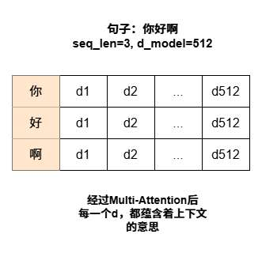
我们输出的依然是一个 `[seq_len, d_model] `的矩阵，但每个词至此都**蕴含全局上下文信息**。
## **融合与稳定**
接下来，向量们需要“稍作休整”，完成两个至关重要的操作：**残差连接** 和 **层归一化**。（Add&Norm)

### 残差连接：不忘初心
在深度学习模型中，当信息经过层层复杂的变换（比如我们的Attention），有时会丢失掉一部分最原始、最核心的特征。在训练层面，这样会导致“梯度消失”，让深层网络难以训练。

我们要让句子看看自己最初的模样，而“残差连接”就能让句子“不忘初心”

这是一个很常用的手段，具体来说，

**将进入“阅览室”之前的原始向量，直接加到从“阅览室”出来的结果向量上。**

$X_{processed} = X_{original} + Attention(X_{original})$

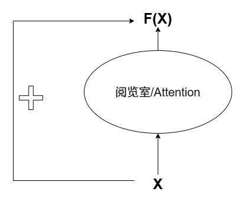

### 层归一化: 纪律委员

经过了刚才残差的加法操作，向量内部各个维度的数值，一定是大小不一，各自“放飞自我”的。

从模型角度看，一个向量各维度数值，有的大几十，有的又是负数小数，非常乱，是很难进行训练的。

“**层归一化**”就是一位“纪律委员”，它的作用是**对每一个词向量进行独立地“整顿”**。

它会计算单个向量内部所有512个维度的**均值和方差**，然后利用这些统计数据，将这个向量的数值分布“拉回”到一个标准的、更健康的范围内（通常是均值为0，方差为1）。
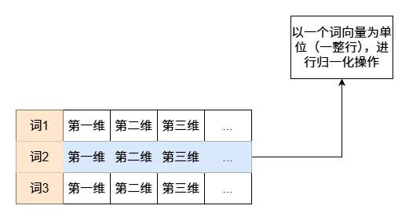

具体操作如下：

首先，对于单个词向量 x，计算其内部所有 d_model 个元素的均值 μ 和标准差 σ：
$$ \mu = \frac{1}{d_{\text{model}}} \sum_{i=1}^{d_{\text{model}}} x_i $$ $$ \sigma = \sqrt{\frac{1}{d_{\text{model}}} \sum_{i=1}^{d_{\text{model}}} (x_i - \mu)^2 + \epsilon} $$
然后，使用 μ 和 σ 对 x 进行标准化，使其均值为0，方差为1。：
$$ \text{Normalized}(x_i) = \frac{x_i - \mu}{\sigma} $$

最后，为了不让标准化过程“抹杀”掉网络可能学到的有用信息，我们引入两个**可学习的参数**：一个缩放因子 γ (gamma) 和一个平移因子 β (beta)。它们允许模型在训练中，自己决定最佳的数值尺度。

最终的输出 y 是：

$$ y = \gamma \cdot \text{Normalized}(x) + \beta $$

层归一化这个“纪律委员”带来了什么？

**稳定！**

把一个向量，拉回到一个“标准、规范”的状态，同时又给予模型一定的“自由度”（通过γ和β），使其训练过程更加**稳定高效**！

## 思考
经过了“信息交互”（Attention）和第一次“融合稳定”（Add & Norm），每个词向量都满载着上下文信息。

但这些信息是“关系型”的，是每个词向量阅读“他们的兄弟”产出的结果。

我们认为，仅仅这些还不够，模型还需要一个阶段，让每个词向量，对自己刚刚吸收到的海量信息，进行一次**独立的**、深度的“消化”和“思考”**。

与“阅览室”里所有词向量都能见到其他兄弟不同，在“思考室”里，**每个词向量的计算过程是完全独立的，与其他词向量无关**。

这确保了模型在进行了全局信息共享后，还能保留并强化每个位置上独特的语义特征。

在深度学习中，我们用线性层完成这个效果。

在Transformer中，这个思考过程叫**前馈神经网络（Feed-Forward Network, FFN）**。

如何思考呢？

- **升维思考**：将词向量，从当前维度投影到更高维度。在经典的Transformer模型中，这个维度通常是**2048维**（d_model的4倍）。
- **降维整合**：模型再通过第二个线性层，将这个2048维的向量**投影回原始的512维**，是一次对高维空间思考结果的整合。

那么，到底为什么刚才的比喻能成立，为什么说**它像一次“思考”**？让我们来严谨地解剖一下。

#### 为什么“先升后降”结构有效？

**1. 更广阔的特征空间：**
拿最简单的一维升二维来想象。

想象一下，有一些数据点挤在一条一维的直线上，红蓝两类互相交错，你很难一下子把它们分开。难以看出特征，难以分类。但如果我们将这些点映射到一个二维平面上呢？

原本挤在一起的点瞬间被变得“松弛”，它们之间的关系变得清晰起来，我们可能很容易就能画一条直线将它们完美分开了。

把一个向量从512维映射到2048维，正是让数据来到极其广阔的“高维空间”，在低维空间中可能线性不可分的复杂特征组合，在高维空间中可能变得更容易被区分和处理。这为模型学习更复杂的函数关系提供了可能。

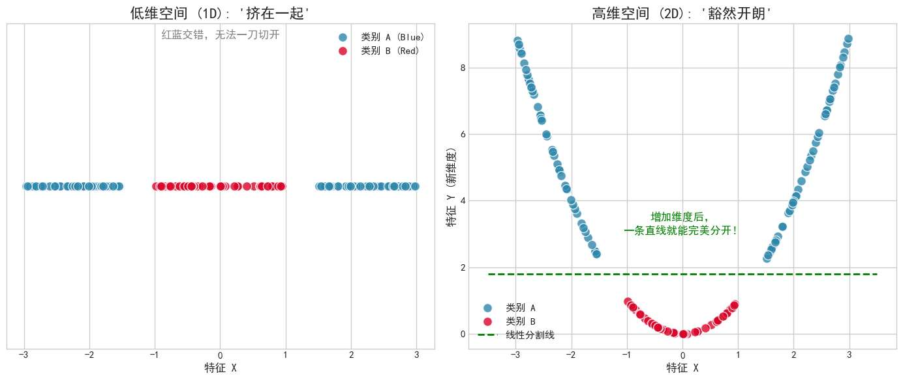

**2. 非线性激活是关键**：
在这两个线性层之间，还夹着一个至关重要的**非线性激活函数**，通常是**ReLU**。 关于非线性激活函数，我会在未来机器学习基础文章详细讲解。
- **ReLU的作用**：$ReLU(x) = max(0, x)$。它会**将所有小于0的维度值直接“关闭”为0**，只保留大于0的值。
- **为何重要**：如果没有这个非线性步骤，连续两次线性变换`（X 乘  W1 再乘以 W2）`在数学上可以被简化为一次单独的线性变换`（X * (W1*W2)）`，那么“升维”就失去了意义。ReLU的引入，打破了这种线性关系，赋予了模型进行真正复杂思考的能力。它允许模型学习类似“如果...那么...”的逻辑，比如“如果这个词向量在第10维（代表‘动作’）和第58维（代表‘工具’）上都有很高的值，那么就在2048维的某个特定区域产生强烈的激活”。

**3. 参数的智慧：**
- **初始状态**：在训练开始前，构成这两个线性层的W1(升维）, b1, W2（降维）, b2矩阵参数，是**随机初始化**的。此时的FFN只能进行“混沌的思考”，进行着毫无意义的随机映射。
- **学习过程**：在模型训练的过程中，通过**反向传播**算法，模型会计算出预测结果与真实标签之间的“差距”（损失）。这个“差距”会指导这些随机参数进行**极其微小但有方向性的调整**。如果一次调整让差距变小了，这个方向就是对的。
- **最终状态**：经过数百万甚至数十亿次的迭代学习，这些参数不再是随机的。它们已经被打磨成了“**智慧的参数**”。W1学会了如何将输入的512维向量中蕴含的上下文信息，有效地“解压”并映射到2048维的“思想空间”中，暴露出有用的特征模式。而W2则学会了如何从这个复杂的空间中，精准地“提炼”和“整合”出对最终任务最有价值的信息，并将其压缩回512维。

总结来说，前馈神经网络（FFN）这个子层，就是让每个吸收了全局上下文的词向量，利用一个高维的、非线性的“思考空间”，对自己进行一次深度的、个性化的信息提炼和重塑。

## 再次融合与稳定

接着，词向量经过刚才的思考后，又要“稍作休整”，才能进行下一阶段。
这里的休整，仍是前文讲的“残差连接+归一化”处理，以确保信息流的稳定和训练的高效。
这里不再赘述。

总的来说，整个流程是
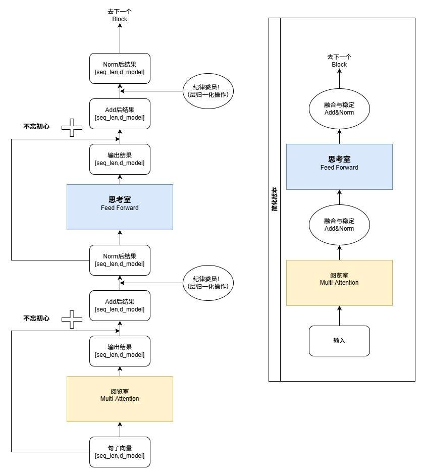
.svg)

最开始的维度，与最终的维度别无二异。
始终都是送来的句子向量，只是向量中的数字变了而已。
一个Encoder Block的输入和输出，其**形状是完全相同的**。它没有改变数据的“外貌”，而是深刻地重塑了它的“内涵”。

# Decoder
encoder始终都是处理进来的一个句子向量，输出的也是他，我们可以说，Encoder是在对句子进行“深度阅读”。

而Decoder，输入的是一个句子向量，输出的是一个决策。

这个决策是“生成”，即**看着当前句子向量，思考“接下来的词应该是什么”？**

可以说，Decoder是在进行“写作”。

我认为网上很多文章将decoder直接放到transformer架构讲，很容易模糊。

本篇文章，我们将采用“**先分后合**”的策略：

1. **第一步**：我们先将Decoder作为一个**独立的语言模型**来研究，看看它是如何学习“写作”本身的。这正是像GPT系列这样的大语言模型的核心。

2. **第二步**：我们再将它放回完整的Transformer架构中，看看它是如何与Encoder“协作”，完成翻译这样的特定任务。

## **Decoder的训练**

现在，我们把视角投向，**“如何训练decoder的写作能力”。**

我们会给出decoder完整的句子，看看他能否成功写作。

值得注意的是，在训练阶段，我们想训练Decoder的能力**是“逐字”预测。**

我们不仅仅是送入“今天天气很“，让他预测出”好“。

我们要让他能完整地逐字生成：

给decoder"今”,让他能逐字生成“今天天气很好”。

即，想同时训练它完成以下**所有**任务：

- 看到 `<start>`（起始符），能预测出“今”。
 - 看到 `<start> 今`，能预测出“天”。
- 看到 `<start> 今天`，能预测出“天”。
- 看到 `<start> 今天天`，能预测出“气”。
- ...以此类推，直到最后预测出 `<end>（结束符）`。

你可能会疑惑，可是我想让他看到“今”生成“天”啊，我在未来使用decoder时，也许想生成“今朝有酒今朝醉”，想让他在“今”后面生成出“朝”啊？

这个担心是多余的。我们并非只用一句话来训练它。我们会用**超出想象的海量文本数据**（整个互联网的公开文本）来喂养它。在学习了数万亿个单词后，模型会掌握语言的**统计规律**。它会知道，“今”后面跟“天”的概率很高，但跟“朝”的概率也不低。

这个能力能让decoder”懂句子“，”生成人话“，但也带来了随机性。（这也是为什么，每次问AI同样的问题，都可能得到不同但都合理的回答）

### **专注写作**
现在，我们专注于实际的训练流程。

如何**高效地**同时训练上面罗列的所有任务？

最笨的办法是循环一次一次地喂数据，
- 喂入”今“，检测生成“天”的能力”，
- 喂入”今天天“，检测生成“气”的能力”

太慢了，人家encoder都是使用attention，一口气把一个句子理解完的。

那我们能不能，**一口气把完整的句子“今天天气很好”送入模型，并让它在一次计算中，就完成所有位置的预测和学习？**

这听起来有点迷糊：又要让模型在看到“今天”时只能预测“天”，又想把完整的“今天天气很好”一口气喂给它。

对此，我们必须要引入一个机制——**注意力掩码（Attention Mask）*。

Attention Mask？ 他也用和encoder一样的Attention机制？

是的：**Decoder Block的设计，几乎和Encoder Block一模一样！**

我们直接借鉴了Encoder那套极其成功的工序：

信息交互 (Attention) --> 融合稳定 (Add&Norm) --> 独立深度思考 (FFN) --> 再次融合稳定。

所以“并行”被我们解决，我们可以在训练阶段，一次性把一个句子扔进去，让他在每一个句子的地方（也就是每一个词）都输出新的词向量。

但是，**它的第一个环节——那个进行信息交互的“阅览室”，有一个与Encoder截然不同环节**。
正是Attention Mask中的Mask，掩码，其作用，就是辅助我们实现“预测”二字。

现在，让我们聚焦于当完整的句子“今天天气很好”的词向量进入Decoder的“阅览室”（Self-Attention层）时，会发生什么。

#### 掩码的详细机制
让我们回忆一下Attention的核心：通过计算一个**注意力分数矩阵 (Q @ K.T)** 来决定每个词应该对其他词投入多少关注度。

**第一步：生成原始的“全知”注意力分数**

如果没有加任何限制，Decoder的“阅览室”会像Encoder一样，生成一个“全知视角”的分数矩阵。每一行每个词都能“看到”所有其他词，包括未来的词。假设我们的句子是“今天天气好”，这个5x5的矩阵看起来会是这样：
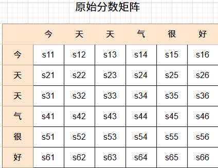

  
图中是原始分数矩阵。如，s12 代表 ”今“字与”天“字的对应程度。

如果我们和encoder一样，用标准的attention机制，用标准的注意力分数矩阵，（**若不了解请看我之前的文章《对Attention机制的深度可视化解剖》**）

由于这里写的是”今“对每一个字的对应程度，那后面，我们再用这个矩阵与V矩阵做点积时，
得到的最终词向量”今“， 就是一个蕴含后面所有词意思的词向量，

我们拿这个蕴含后面词义的词向量“今”，去让decoder，预测后面的字“天”？

怎么能对呢，那这根本不能训练到我们的写作能力！

它让每个词都提前看到了未来的答案，这违背了我们“逐字预测”的训练目标。

**第二步：掩码矩阵**

为了防止作弊，我们使用我们的工具：**掩码矩阵（Mask Matrix）**。

它的形状和上面的分数矩阵完全相同，但内容极其简单：

- 在**下三角和对角线**的位置，值为 0。这代表“你可以关注阅览”。

- 在**上三角**的位置，值为**负无穷大 (-inf)**。这代表“**绝对禁止阅览”。

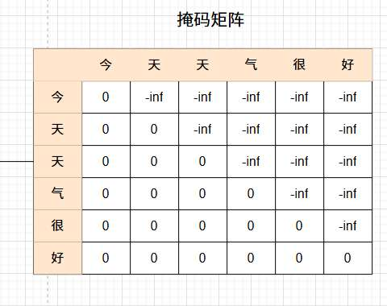

**第三步：将掩码覆盖到分数上**

现在，最关键的一步来了。我们将这个掩码矩阵，**直接加到**原始的注意力分数矩阵上。

- 原始分数 + 0 = 原始分数不变。
- 原始分数 + -inf = **负无穷大 (-inf)**。

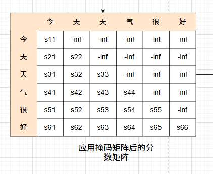

**最后的操作：Softmax**

把未来的词的注意力分数，变成-inf又怎样？

这个矩阵马上要被送入**Softmax**函数，以转换成最终的注意力权重（0到1之间的概率）。

Softmax函数有一个特性：**Softmax(-inf) = 0。**

这意味着，所有被标记为-inf的“未来”位置，它们最终的注意力权重会**精确地等于0**！

**这就完美地实现了“遮蔽”的效果。** 

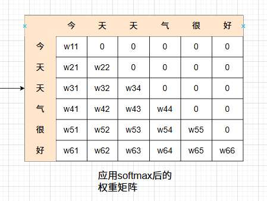

即，在数学上，我们让模型在一次并行计算中，就为每个位置都创造出了一个“只能看到过去”的公平环境。

完整流程：

我们可以看看词向量最终到底如何诞生的

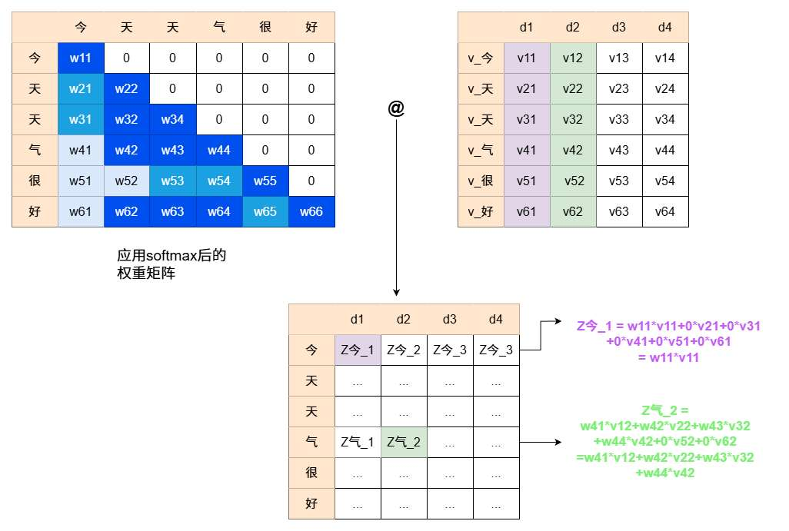

如图，左边的权重矩阵得益于我们的掩码矩阵， 让各词只“关注”了本身及之前的词。  其中， 颜色深浅可以理解为权重大小。
词向量如何得来？是由左边的权重矩阵与右边的V矩阵做矩阵乘法，

观察下方的词向量矩阵， Z_今1，是”今“这个词向量第一维度的数，它的产生，是权重矩阵“今”这一行，与V矩阵d1这一整列做点积，显然，只有w11 * V11有效，其他维度同理。显然，”今“只与V中的”今“有关。

再看Z_气2，是”气“这个词向量第二维度的数，同理，只有`w41*v12+w42*v22+w43*v32+w44*v42` 有效， ”气“ 只与 V中的“今天天气”有关。

### 数据流与堆叠
在我们初步完成内部信息交互后，
我们Decoder还需要进行和Encoder几乎完全一样的后续工序：

- **一次‘融合稳定’（Add & Norm）**
- **一次‘独立深度思考’（FFN）**
- **最后一次‘融合稳定’（Add & Norm）**

至此，一个只依赖自身历史信息的Decoder Block就完成了它的工作。

当然，一次‘阅览-思考’是不够的。

Decoder模型，还会**将上述的Decoder Block完整地堆叠N次**（GPT-3有96层！），

让每个词在‘只能看过去’的约束下，其信息被反复地、深度地提炼。

“今”的词向量只关注了`<start>` “天”的词向量只关注了"`<start>`、今"  

在经过了这N层处理后，我们得到了一个对当前文本序列最高质量的理解向量。

我们用这些词向量，进行融合稳定、深度思考等流程，直至最后的“决策”---**预测该词的下一个词**

### 最终决策

无论内部经历了多么复杂的计算，在N层Decoder Block之后，我们得到的依然是一个` [seq_len, d_model]` 形状的向量矩阵。

它包含了在每个位置上，模型对“接下来该写什么”的深度思考。

>我们可以再回忆回忆，在此刻，对于encoder和decoder，他俩几乎是一模一样的，只是decoder多了一个掩码矩阵。  Encoder也是` [seq_len, d_model]` 形状的向量矩阵，但这些向量由于没有掩码过，所以与decoder不同，是模型对“每个词在包含上下文语境，如何表示”的深度思考。

我们现在把视角，放到其中一个具体的词向量，

比如说“今天天气很好”中的，“很”。

现在我们拿到的“很”的向量，是一个形状为`[d_model]` 的向量。

它包含了在每个位置上，模型对“接下来该写'好'”的思考。

但这个512维的稠密向量，人类是看不懂的。

我们需要将它翻译成对我们词汇表中**每一个具体单词**的“推荐分数”。

“翻译”+“决策”的过程，由两个简单的组件完成：

1. **线性层**：我们将最终的输出向量，送入一个最后的线性层。这个线性层的特殊之处在于，它的输出维度等于我们的**词汇表大小**。
    - 比如说，我们的字典里有5万个单词，这个线性层就会把这个个512维的“思考结果”向量，转换成一个5万维的“打分”向量，我们称之为**Logits**。这个向量的第一个维度，对应“苹果”这个词的分数；第二个维度，对应“香蕉”的分数……以此类推。一定有一个维度，对应着“好”。我们期望线性层处理后，“好”这个维度有足够高的“分数”。

2. **Softmax函数**：Logits是原始的、大小不一的分数。为了让它变得更直观，我们用**Softmax**函数将这5万个分数，转换成一个**总和为1的概率分布**。

    - 现在，我们得到了一个清晰的概率列表。比如，在“今天天气很”这个位置，输出的概率可能是：{“好”: 0.95, “棒”: 0.04, “差”: 0.001, ...}。

有了这个概率分布，模型在训练时，就可以拿它和真实答案（“好”）去比较，我们一般就取概率最大的那个当作模型的“输出”。然后计算损失，通过反向传播去更新所有参数。在推理时，它就可以选择概率最高的那个词作为最终的输出。

并行来看：

在训练时，输入一个句子，对应的真实答案（label），是刚好错开一位输入的
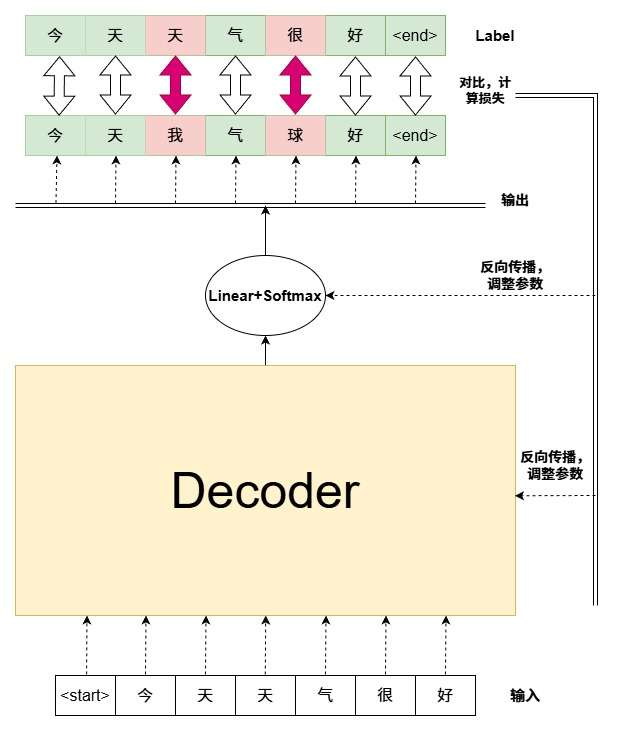
 
 如图，这样就可以同时进行比较，计算输出与结果的偏差，反向传播更新参数，每一个对照都是独立的，不影响其他词。
 
 哪怕模型在第3步把“天”预测成了“**我**”（预测错误），在第4步预测“气”的时候，我们**喂给模型的输入依然是正确的“天”**（来自底部的标准输入），而不是它刚刚生成错的“我”。

- 因为输入是固定的标准答案，不需要等模型“想”出结果再喂给下一步。
- 所以，我们可以在一个计算步骤内，同时预测出“今天我气球好”。
- 然后，同时计算每一位的误差（Loss）。
- 最后，反向传播，告诉模型：“第3个字应该是‘天’，第5个字应该是‘很’”

这样，我们就实现了根据“今天”预测“天”、根据“今天天气”预测“很”的**全方位并行训练**。

### 总结
一个专注于写作的decoder架构，如图所示
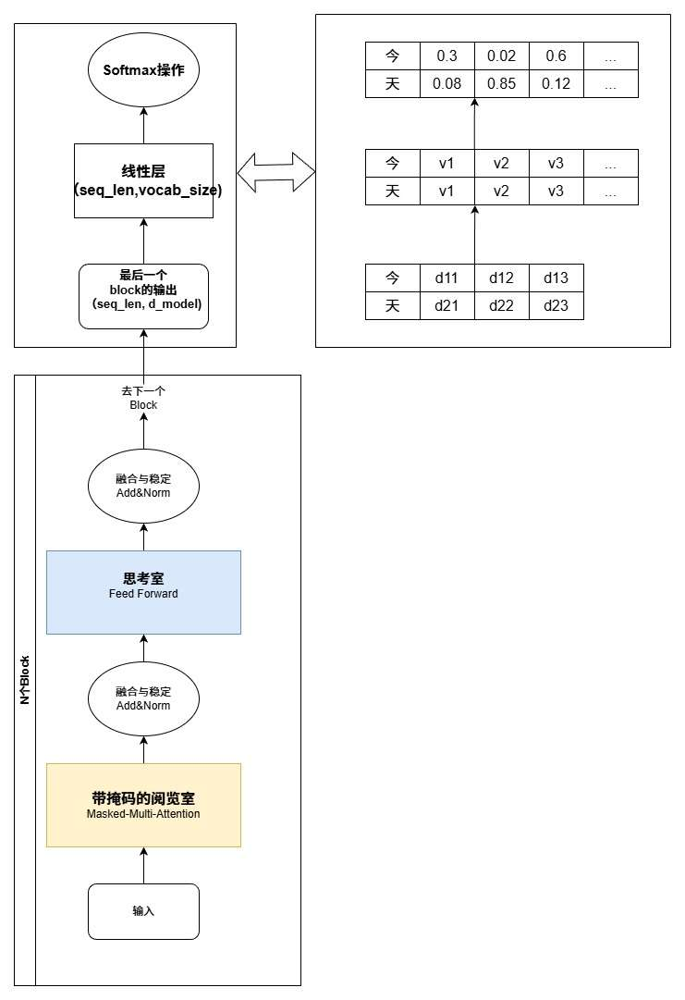

.svg)

## Transformer架构中的Decoder

 好了，我们已经打造了一个强大的、能够独立写作的Decoder模型。

那Decoder在transformer结构中长什么样呢？
在架构上，如图所示：
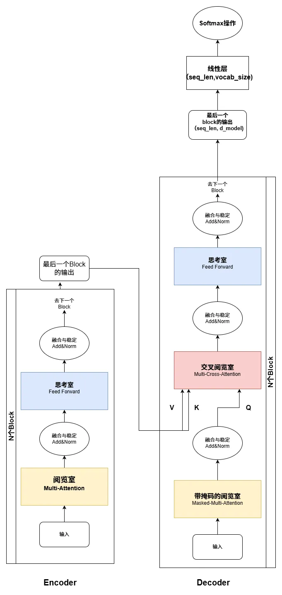

我们发现，在Decoder架构中，居然有Encoder的箭头！ 似乎参与到了Decoder 的Block里！
（如果大家嫌弃我画的丑可以看看这个网图）
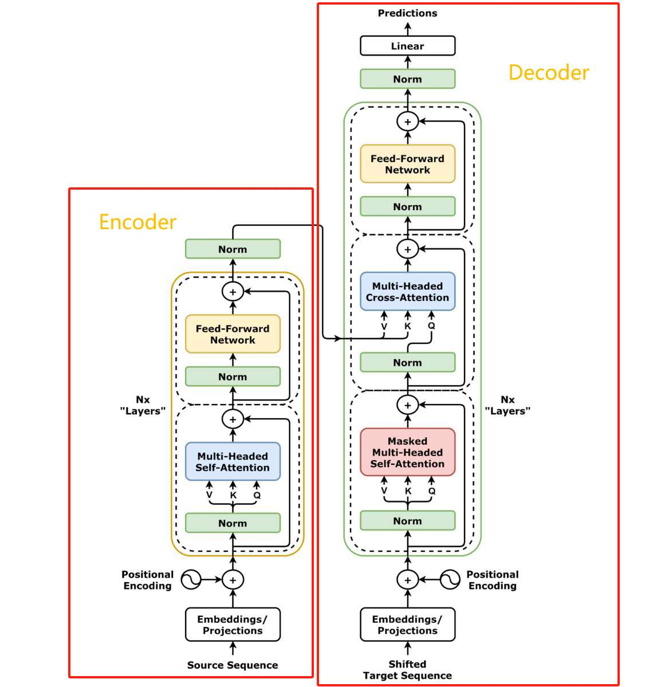

诶？**要encoder干嘛呢？** 

我们再次看看decoder的使命，他是“写作”。

你给它一个开头，比如“今天天气很”。它的工作是根据自己从海量数据中学到的语言规律，生成一个**最合理、最通顺的续写**，比如“好”、“不错”、“晴朗”。它没有一个必须严格遵守的“源信息”。它的任务是让故事继续下去。

Transformer诞生是架构其任务是什么呢？
**翻译**！

而如果我们要做翻译任务，它的工作，是生成一个**与源句子意思完全对应**的目标句子，比如“I love you”。它的每一步生成，都必须**严格地、忠实地**以源句子的信息为根据。它不能自由发挥，说“I love apple”。它的任务是**专业的翻译**，首要原则是“信、达、雅”，而“信”（忠实）是第一位的。

所以，我们需要encoder，对“我爱你”的深度理解！

当我们将“我爱你”输入Encoder时，它会进行我们前面讨论过的N次深度“阅读理解”，最终输出的不是一个简单的向量，而是一个**包含了每个词在完整上下文中的深刻理解**的矩阵。encoder输出的信息，就是Decoder在翻译时可以随时查阅的、最可靠的“源文本注释”。

也就是说，我们不是把“我爱你”送入Decoder，让Decoder凭借自己理解生成”I Love You“，

而是把“我爱你”送入理解能力更更厉害的Encoder，Decoder去参考这份阅读理解，进行生成--也就是翻译。  

在架构上，我们如何实现这个“参考”功能呢？

- **原有的工序（依然保留）**：
    1. **内部阅览 (Masked Self-Attention)**：Decoder依然需要装配Masked这个工具，先回顾自己已经写出的部分（比如I love），理解目标语言自身的语法。
    2. **独立思考 (Feed-Forward Network)**：在整合完所有信息后，进行一次深度的、独立的思考。
    3. **两次 Add & Norm**：穿插其中，确保稳定。
- **新增的升级：**
    - **新增的核心环节** : 查阅注释 (Cross-Attention) !
    - 这个新组件被**安插在“内部阅览”和“独立思考”之间**。
    - 它的工作机制是：当Decoder在内部阅览完（比如自己得到了I love的内部理解）后，它会拿着这个结果作为**查询（Query）**，去“查阅”Encoder产出的那份包含“我爱你”深度理解的“注释”（Key, Value）**。
    - **这一步。就是将生成的内容与源语言的信息进行对齐，确保翻译的“忠实性”。**
  
我们可以对比上面那个decoder，我们可以发现多的就是一个**交叉阅览室**而已！

# 完整Transformer流程总结

现在，我们手中已经拥有了两个强大的组件：阅读能力超强的Encoder和会照着理解文本写翻译的Decoder。

是时候将它们连接起来，观察一条完整的“翻译”任务，其信息流是如何在Transformer里流动的

我们将分别观察两种最重要的情景：

**并行高效的训练** 和**严谨有序的推理**。

### **一、 批量的训练流程**

在训练阶段，我们的目标是让模型学会“翻译”这个任务。

我们的输入输出有什么变化？
 
我们的输入是我爱你，我们希望输出I Love You.

显然，我们的输入是汉语，而最后得到logits的词表，却是其他语言，上面的例子就是英语。

这样看来 输入输出的话 仅仅是决定输出的词表变了

当我们输入”我“时 我们希望 词表打分时 ”I“这个分数足够高，从而输出正确的翻译。

现在，我们手头有大量的“教材”，即**成对的源句和目标句**，我们正是要训练模型“打分”的能力。

**假设我们其中一个训练句子对是：("我爱你", "I love you")**

1. **第一步：源句进入Encoder进行“深度阅读”**

    - 将完整的源句 “我爱你” 的词向量（已加入位置编码）送入Encoder。
    - 数据流经N层Encoder Block（自注意力 -> Add&Norm -> FFN -> Add&Norm）。
    - 最终，Encoder输出一份对“我爱你”的**最终理解**（我们称之为encoder_output）。这份报告包含了每个汉字在完整语境下的深度语义。
    - 对于这一对训练样本，这个过程**只发生一次**。Encoder的任务到此结束。

2. **第二步：目标句进入Decoder进行“写作”**
    - 将**完整的**、带有起止符的目标句 "`<start> I love you <end>`" 的词向量（已加入位置编码）送入Decoder。
    - 数据流经N层Decoder Block。在**每一层**Block内部：
        - 首先，进行**Masked Self-Attention**，确保在预测每个词时，只能看到它前面的词。
        - 然后，进行**Cross-Attention**，它会拿着上一步的结果（Query），去查阅Encoder产出的那个“**最终理解”（Key, Value），确保翻译内容忠于原文。
        - 最后，通过FFN进行“独立思考”。
    - 这是一个**完全并行**的计算。Decoder在一次前向传播中，就同时计算出了` I, love, you, <end> `这四个位置的输出向量。
        
3. **第三步：对照结果，更新参数**
    - Decoder的最终输出向量会经过一个线性层和Softmax，得到在**每个位置**上对整个词汇表的预测概率。
    - 我们将这个预测结果与真实的“标准答案”（即目标句向左错开一位：`I love you <end>`）进行比较，计算出**损失（Loss）**。
    - 最后，通过反向传播，这个“损失”信号会**同时更新**Decoder、Encoder以及所有相关线性层的参数。

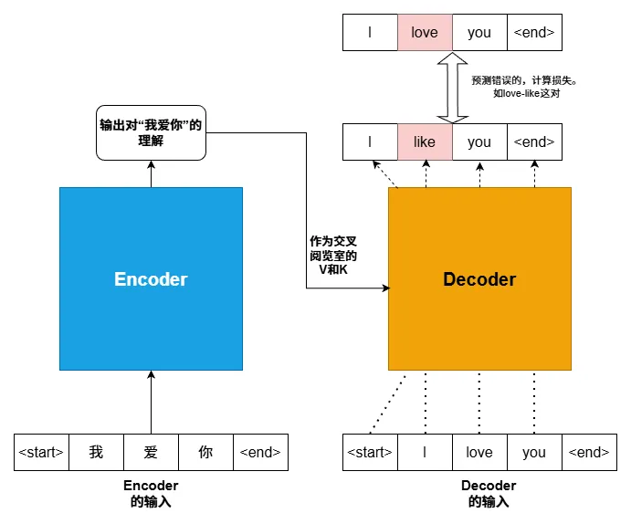

整个过程高度并行，效率极高。Encoder和Decoder各司其职，在一次计算中就完成了对一条训练样本的学习。

### **二、 逐个进行的推理/生成流程**

假设模型已经得到充分的训练，得让它真正地进行**翻译**工作了。

**假设我们收到的任务是翻译：“我爱你”**

1. **第一步：Encoder生成“理解报告”（与训练时完全相同）**
    - 将“我爱你”送入Encoder，得到一份一次性的、可供反复查阅的encoder_output。

2. **第二步：Decoder开始“动笔写作”（自回归生成）**

    - **时刻 T=1:**
        - 我们先喂给Decoder一个起始符 "`<start>`"。
        - Decoder（内部通过Masked Self-Attention和Cross-Attention）结合 `<start>`  和 encoder_output，进行计算。
        - 最终的Softmax层预测出第一个最可能的词是 I。

    - **时刻 T=2:**
        
        - 我们将上一步的输出 I，拼接到输入序列中。现在Decoder的输入是 "`<start> I`"。
        - Decoder再次结合 "`<start> I`" 和 **同一个** encoder_output（encoder_output始终是一个，并不断复用），进行计算。  
        - 最终预测出第二个最可能的词是 love。
            
    - **时刻 T=3:**
        
        - 输入序列变成 "`<start> I love`"。
        - Decoder再次结合输入和 encoder_output，预测出第三个词 you。
        
    - **时刻 T=4:**
        
        - 输入序列变成 "`<start> I love you`"。
        - Decoder预测出最可能的下一个符号是结束符 "`<end>`"。
            
    - **任务结束**：一旦生成了结束符，翻译过程就完成了。我们将所有生成的词拼接起来，得到最终结果 "I love you"。

这是一个**串行**的、**一步一步**的自回归过程。Decoder每生成一个词，都会把它作为下一步的输入，循环往复，直到生成结束符。

.svg)

.webp)

如图，Encoder的理解，在每一个时间步都会用的。对于Encoder属于是“一劳永逸”了。

在推理时，与训练时一样，我们不受前面“历史记录”的干扰，输入输出永远是图中高亮部分，一个词对一个词。

# LLM的应用

现在，让我们走出理论，踏入真实的世界，真实世界**远不止“翻译”**，我们可以用transformer这个范式，做很多东西。

首先让我们看看，2017年transformer论文横空出世后，这套强大的架构是如何被各大科技巨头巧妙地“拆分”与“组合”，演化出当今LLM的三大家族 -- 
- Encoder-Only
- Decoder-Only
- Encoder-Decoder
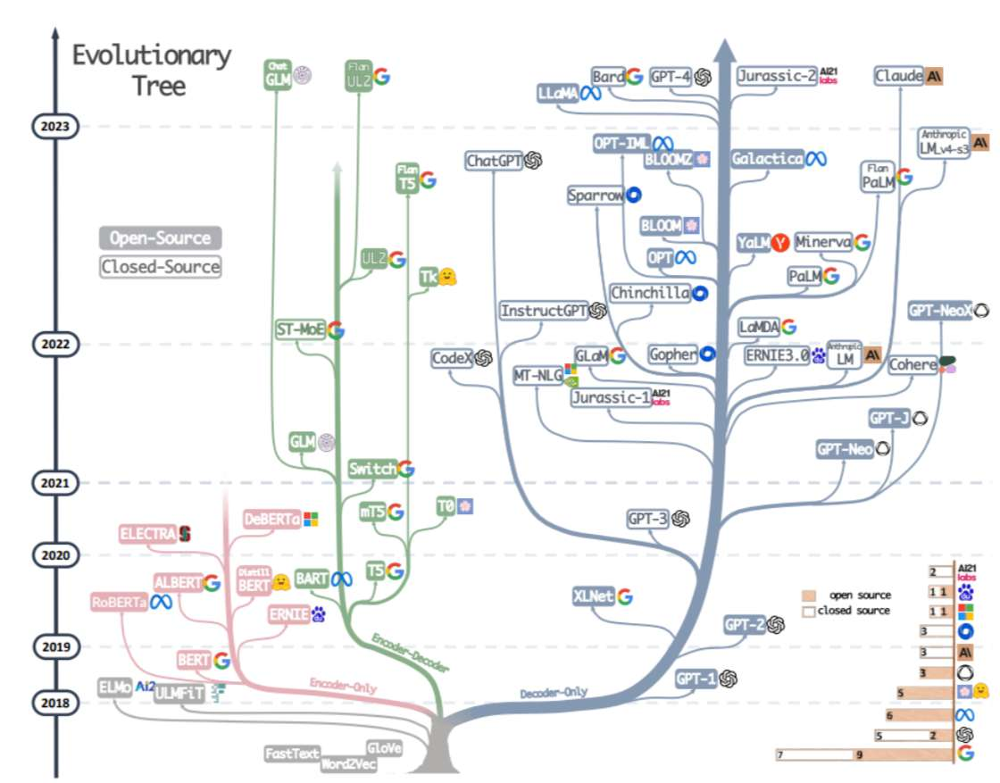

图:LLM进化树(来自论文[2304.13712] Harnessing the Power of LLMs in Practice: A Survey on ChatGPT and Beyond)

虽然现在是25年了，但我仍想引用一下这张LLM进化树。

我们猜猜这三种颜色都是什么架构吧！ 

接下来我们立即揭晓答案

### **一、 Encoder-Only ：深度阅读理解工具**

这条路的开创者，是**Google于2018年**发布的里程碑式模型——**BERT 

- **核心思想**：并非所有任务都需要“生成”。对于**文本分类（如情感分析）、命名实体识别、句子关系判断**这类“阅读理解”任务，我们需要的只是一个能**深度理解文本内在含义**的强大模型。

- **架构**：**只保留Transformer的Encoder部分**。

- **原理**：

    - **双向视野**：与Decoder的“只能看过去”不同，Encoder具有“**全知视角**”。在训练时，它的自注意力机制就允许每个词都能同时看到左边和右边的所有上下文。便于理解一个词在句子中的确切含义
    - **特殊的训练任务**：为了训练这种深度理解能力，BERT被设计了两个巧妙的任务：
        1. **掩码语言模型**：随机遮掉句子中的一些词（比如 我爱`[MASK]`京天安门），让模型去预测被遮住的词是什么。迫使模型不能只看上文（像GPT那样），而必须同时结合‘我爱’和‘天安门’的信息，才能猜出‘北’字。这就是**双向理解**。
        2. **下一句预测**：给模型两个句子，让它判断第二句是否是第一句的下一句。
		其实，这就是如何训练encoder，通过这些训练任务，间接地训练出Encoder的强大理解能力。

**结果是革命性的**：BERT家族（包括后来的RoBERTa, ALBERT）迅速统治了NLP榜单。直到今天，当你使用搜索引擎，或者被智能客服精准识别意图时，背后依然有BERT家族在默默工作。

### **二、 Decoder-Only 家族：文本生成工具**

与Google不同，**OpenAI**从一开始就押注在了“**生成**”上。他们相信：如果一个模型能完美地预测“下一个词”，它一定在某种程度上理解了世界。

- **架构**：**只保留Transformer的Decoder部分**。

- **工作原理**：
    - **自回归生成**：正是我们前面详细解剖过的“纯粹的Decoder”。它基于“只能看过去”的**掩码自注意力机制**，被训练来做一件事：**预测下一个词**。
    - **创造力**：通过在整个互联网海量数据下，进行这种简单的“下一个词预测”训练，GPT系列模型学会了语法、事实、逻辑推理，甚至某种程度的“创造力”。

2018年的GPT-1到后来震撼世界的GPT-3、ChatGPT乃至GPT-5，OpenAI一路狂奔。

事实证明，这种简单的“成语接龙”训练，在海量数据和参数量的加持下，竟然涌现出了逻辑推理、代码编写甚至情感理解的能力。

所有人，感到“AI爆发”时，是被谁震撼？ 正是一批一批的**Decoder-Only模型**！ 
以及，现在最融入我们生活的，最常用的，也是他们：聊天机器人、AI写作助手、代码生成工具....

### **三、 Encoder-Decoder 家族：序列转换工具**

这是Transformer最“原教旨主义”的应用，也是**2017年原论文《Attention Is All You Need》** 中提出的原始架构。后来，**Google在2019年**通过**T5 (Text-to-Text Transfer Transformer)** 模型，将这种架构的威力发挥到了极致。
 
T5的核心理念非常优雅：**万物皆可序列转换**。翻译是文本转文本，摘要是长文本转短文本，甚至分类任务也可以看作是文本转标签

- **架构选择**：**完整地使用Transformer的Encoder和Decoder**。

- **工作原理**：

    - **分工合作**：这正是我们之前分析的“翻译模式”。**Encoder**负责深度理解输入（比如一篇长文章），**Decoder**则负责在Encoder的指导下（通过Cross-Attention），生成对应的输出（比如文章的摘要）。

    - **任务的灵活性**：通过在输入前加入不同的“任务前缀”（比如 translate English to German: 或 summarize:），同一个T5模型可以被用来执行多种不同的任务。

在机器翻译、长文本摘要等需要严格忠于原文的任务中，这种架构依然是无可替代的.

# **Transformer：一个统一未来的架构**

2025年了，当我们谈论Transformer时，我们谈论的早已不仅仅是一个能做“翻译任务”的架构。

2017年那篇论文的真正革命性在于，它提供了一种**处理“关系”的通用方法**: Attention机制

只要任何数据能够被表示成一个**序列**，Transformer就能揭示其内部长距离的依赖关系。

这也为什么在讲transformer架构前，我单独开一篇文章详解attention。

总而言之，attention的思想+Transformer的架构，让AI领域多点开花：

### **一、 视觉：理解图片 (ViT)**

在Transformer之前，计算机视觉领域是卷积神经网络的主场。
CNN通过一个个小窗口卷积核）在图片上滑动，从局部到整体，逐层提取特征（点->线->面->纹理->物体）。

这种方法非常有效，但其核心是“**局部归纳**”。

2020年，Google的研究者提出了一个颠覆性的想法：**为什么不能像处理一句话一样，直接“阅读”一张图片呢？**

Vision Transformer (ViT)应运而生 。它的做法简单粗暴：
    
1. **切块**：把图片切成一个个16x16的小方块。
2. **序列化**：把每个小方块展平，映射成向量。此时，对于模型来说，这些方块就是“单词”。
3. **加位置**：给方块加上位置编码，告诉模型谁在左上，谁在右下。
4. **送入模型**：直接丢进标准的Transformer Encoder。

ViT的结果证明了，在有足够数据的情况下，一个纯粹基于全局注意力机制的模型，其性能可以**超越**最顶尖的CNN。

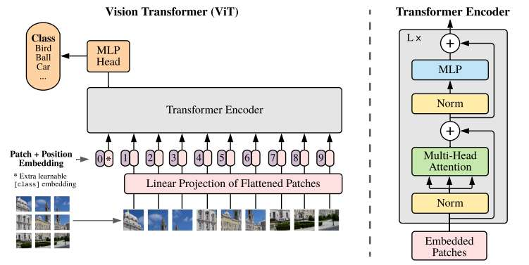

也就是说，Attention机制理解“**全局空间关系**”的能力，可能比CNN的“局部特征提取”更为根本。
Attention被正式应用到了图片理解上。

### **二、 生成：AI绘画和视频 (DiT)**

近年来，像Midjourney、Stable Diffusion、Sora这样的AI绘画和视频生成模型，很火吧！

其底层技术大多是**扩散模型（Diffusion Model）**。

简单来说，扩散模型的核心，是一个能“去噪”的神经网络。你给它一张纯噪声的图片，它能一步步地把噪声抹去，最终还原出一张清晰的画。

早期的扩散模型，核心网络通常用的是基于CNN的U-Net。但OpenAI的研究者们再次想到了Transformer：**如果我们把U-Net换成Transformer会怎样？**

这就是**Diffusion Transformer (DiT)**。

原理和ViT异曲同工：
- **分块**：与ViT类似，DiT也将输入的**噪点图片**切分成小方块。然后，它会将**文本提示**、**噪声强度**等信息，也作为特殊的“Token”一起送入Transformer。 是的！这里用的仍是cross-attention！
- **Transformer的任务**：去理解所有这些信息（图片内容、文本要求、噪声程度）之间的复杂关系，然后**预测出每个方块里应该被去除的噪声是什么**。

DiT展现出了惊人的可扩展性。即，只要你把模型做得更大，喂给它更多的数据，它的性能就会持续、可预测地飙升。

**这正是Sora 2、可灵等视频模型崛起的基石。**  

2025年发布的**Sora 2**，不再只是生成视频，它开始理解物理规律，模拟光影互动，甚至生成同步音效。这一切的背后，是因为Transformer成功地捕捉到了视频帧之间、动作之间复杂的**时空序列关系**。

### **三、 生命科学：破解蛋白质**

蛋白质折叠问题，困扰了人类50年。

DeepMind的思路是：**氨基酸序列，不就是大自然写的一句代码吗？**

**AlphaFold 2** 大量借鉴了Attention思想。

蛋白质折叠的关键，在于序列上相距很远的氨基酸，在三维空间中可能会紧紧“拥抱”在一起。

- **Transformer的任务**：模型将氨基酸序列作为输入。它的使命，是利用注意力机制，去计算序列中**每一对氨基酸之间**的相互作用关系。
- **关键突破**：蛋白质折叠的关键，在于序列上相距很远的氨基酸，在三维空间中可能会紧紧贴在一起。**这Transformer能干嘛？捕捉长距离依赖关系啊！** 它能精准地“看到”第10个氨基酸和第200个氨基酸之间可能存在强大的相互吸引力。

AlphaFold 2的成功是**科学史上里程碑式的突破**。它以惊人的精度预测了几乎所有已知蛋白质的结构，正在彻底改变新药研发、材料科学和我们对生命本身的理解。

**这证明了Attention机制不仅能理解人类语言，还能破译生命的语言。**

### **四、 具身智能：给机器人装上大脑**

传统机器人的控制代码是非常生硬的：“如果传感器A数值大于10，则电机B转动30度”。这种方法，很生硬吧！脆弱且难以泛化到新场景。

Google的**RT-2**提出了一种新范式：**把机器人的行动，也看作一种语言。

- **输入**：摄像头看到的画面（图像Token） + 你的指令（文本Token）。
- **输出**：机器人的动作指令（动作Token）。
- **Transformer的任务**：模型需要理解这个混合了图像、文字和数据的庞大序列，然后生成一个最合理的“动作序列”作为回答。它在学习的，是从“**感知**”到“**行动**”的直接映射。
	
我们常常听到“**具身智能**”这一词，上面RT-2的应用，就是一个体系！这是迈向“**通用机器人**”的关键一步。

**Transformer正在成为连接数字与物理实体的桥梁。**

---

# **结语：三部曲的终章**

从一个“图书馆查阅”的简单直觉出发，我们一步步解剖了Attention机制的数学核心，见证了它如何被组装成强大的Encoder和Decoder，进而演化出BERT、GPT、T5这三大LLM家族，

最终，我们看到它的思想跨越了语言的边界，**正在重塑人工智能的每一个角落**。

Transformer的故事，是一个关于“**关系**”的故事。

它告诉我们，无论是语言的逻辑、图像的结构，还是声音的韵律，其本质都是信息单元之间复杂而精妙的相互关系。

而Attention机制，正是我们迄今为止，找到的理解和驾驭这种“关系”的最强大的工具（是的，仍是迄今为止最强大的）。

--- 

感谢您能将如此长文读到结尾。

tranformer固然强大而美丽，但它真的是完美的吗？它那随序列长度平方增长的计算量（N²复杂度），是否会成为制约我们迈向无限长上下文的枷锁？为什么在如今25年的10月，Transformer之父称：世界需要新的AI架构？

后面，我会开“Transformer的缺陷”，“attention变体与优化”，“位置编码” ，等独立篇章，深化我们对架构的理解。

我们对Transformer的解析，暂时告一段落。

但由Transformer开启的AI革命，还在进行中....

