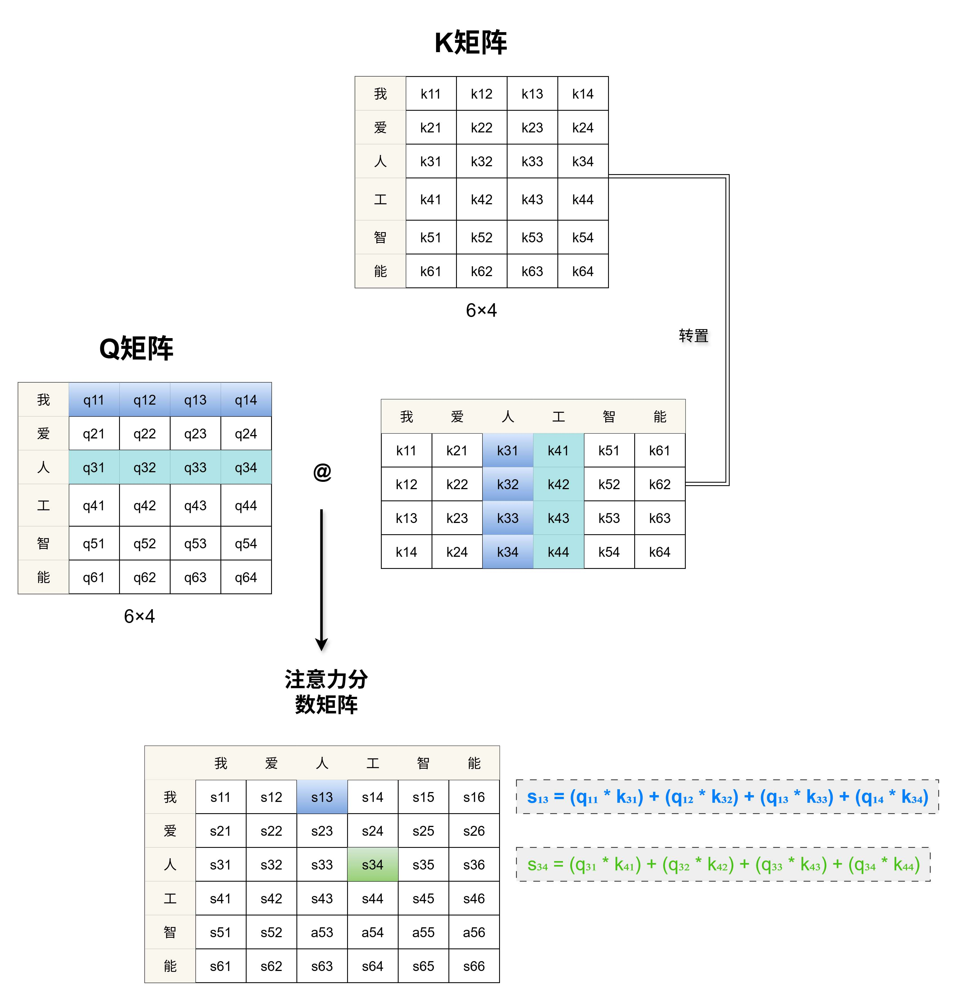
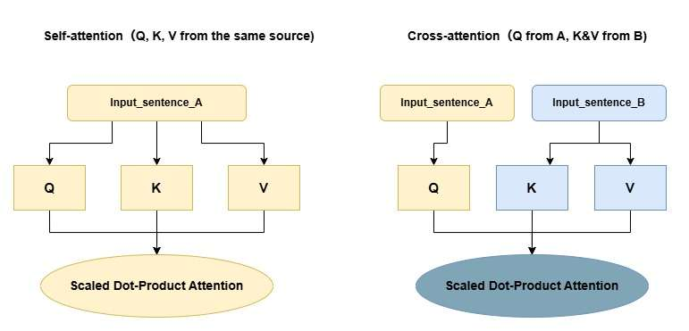
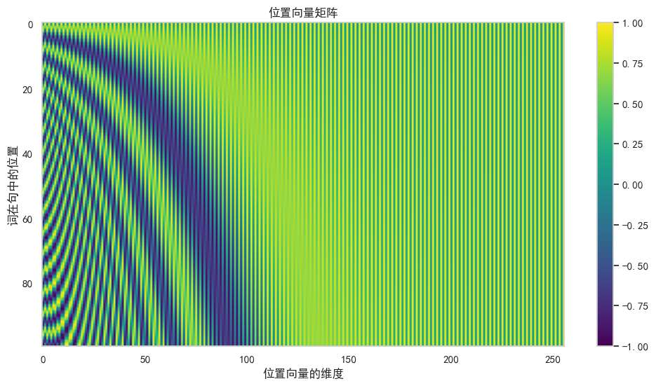
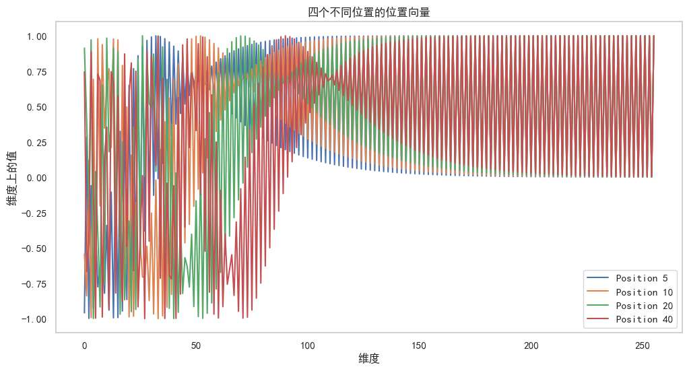
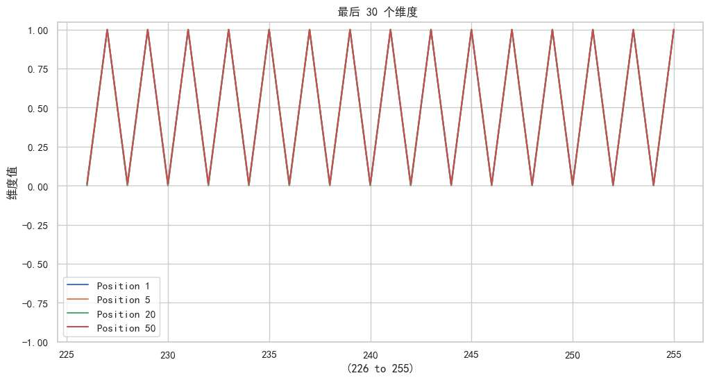
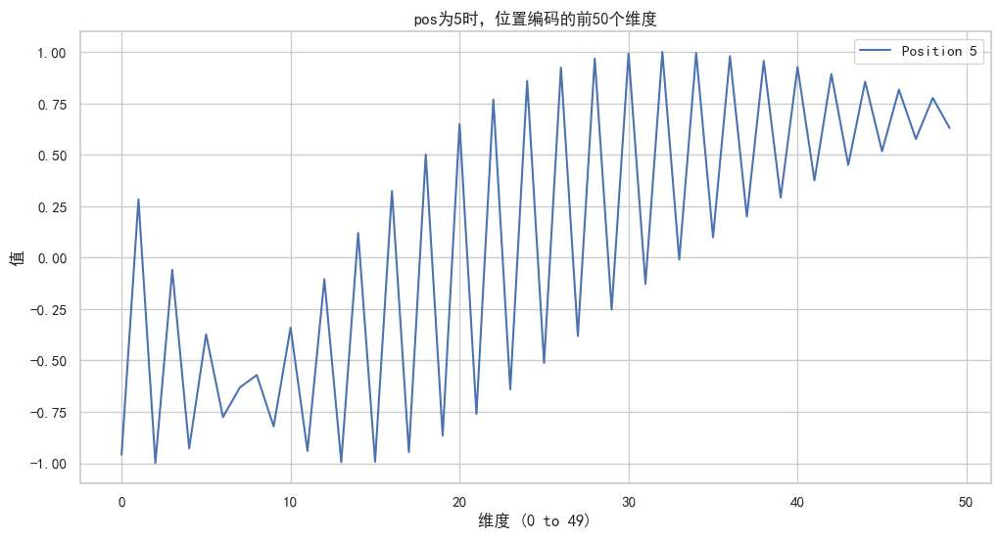
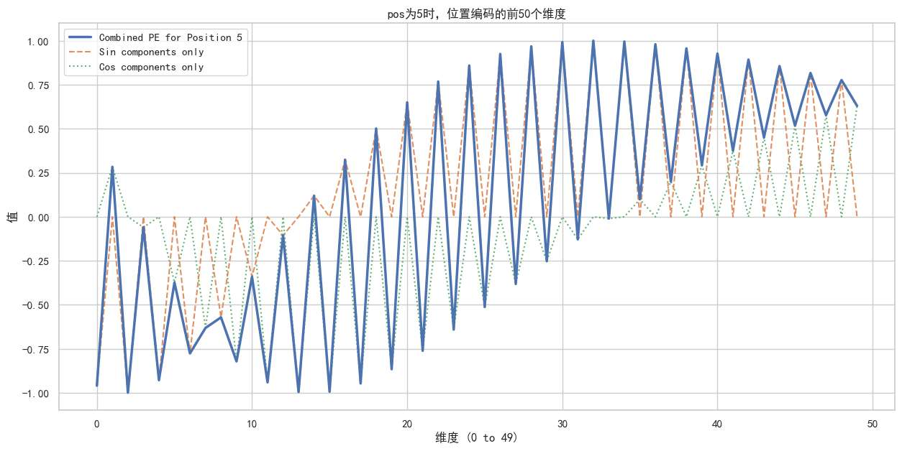
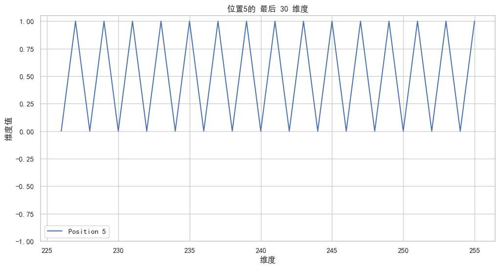
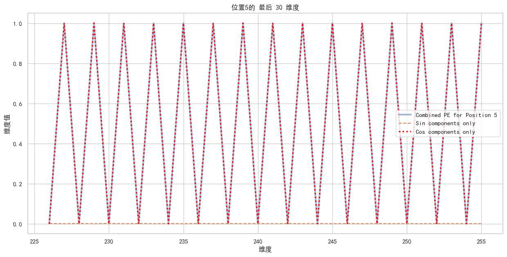
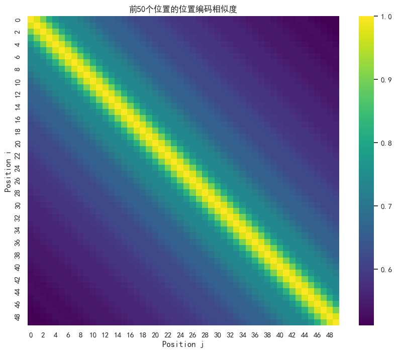

承接上一篇文章，不管是一口气输入一个句子，还是一个字一个字地输入，

之前的RNN/LSTM 不管那些，统统都是**按顺序读入**的。

夸张来说，一个字读1秒。一个10字长的句子那就得读10秒，然后得到包含上下文信息的每个词的词向量，拼接后得到句子向量。

我们能不能设计一种全新的机制，彻底抛弃“循序渐进”的模式？

让模型能够“**一眼看尽”** 所有词，在**一个计算步骤**内，就得到融合了全局上下文信息的、全新的词向量？

**换言之，一个耗时10秒才能读完的句子，我们能让模型在1秒内就“读懂”吗？**

**Attention机制，正是为回答这个问题而生。**
# attention机制
## 直觉性建立

假如说，你是一个人工智能研究生，为了写一篇关于ai的论文，你来到学校图书馆。但图书馆好大，有成千上万本书，各个领域的都有，怎么办？

你会采取一个高效的“**注意力**”策略：
- 带着问题查询：你的脑子里很清楚，你想要找的是“神经网络”方面的数据，这就是你的“查询”**（Query）**
- 快速扫描书名：你会浏览书架，很棒的是，每本书都会有书名（**键 Key**），你不用详细翻开就能知道是否符合你的查询。一本书的书名如果是《深度学习简史》，它就会获得你高度的关注。如果书名是《园艺入门》，你就会忽略它。
- 深入阅读：对于那些你认为高度相关的书籍，你会把它们抽出来，**仔细阅读它们的内容（值 Value）**，并将这些内容，吸收到你自己的知识体系中，你可能不仅读一本，可能会选择读很多本，形成你论文的最终观点。

注意到**Query、Key、Value**的意象了吧！正是Attention机制的灵魂。

接下来我们再建立**attention的直觉**。我们把句子送进attention机制的模型中，
每一个词，都会当一下”**逛图书馆的学生**“。

假设我们只有ABCD四个词，有趣的是，当A变成学生时，**BCD就会变成书**，**甚至A自己**，也会变成自己查询的对象，变成一本书（理解为在图书馆踱步时，思考自己脑袋里到底有没有想要的知识）。

同理，当B变成学生时，ACD，以及B都会变成书。

回到A学生，以A词的视角，他会带着自己的query，挨个“**审视**”其他词

而每个词，都有着自己的**书名key**！key浓缩了这本书的精华，所以容易让query来精准判断。

现在，”**匹配**“开始了。

如果A是“智能”，它的Query可能就带着“寻找技术、算法”的意图。当它遇到B（“人工”）时，B的Key会强烈回应：“我的主题是‘技术’！你可以详细看看我”；当它遇到C（“非常”）时，C的Key可能只会微弱回应：“我是‘程度副词’，稍稍浏览即可“。  

当key的对应程度越高，A词看这本书的内容（其value）就会越详细。

最终一个词的词向量，可以理解为**三个阶段**

1. query和key，双向奔赴，共同决定”**匹配**“的程度
2. 基于上一步的程度，深入读取每一本书的value（每一本哦，就算"非常”这本书和我们query匹配度5%我们也读，就是稍微翻一下下。
3. 把所有阅读到的、经过加权处理的信息**综合起来**，形成一个全新的、融合了全局视野的“阅读报告”，即词向量！

而attention机制的另一个优势，是刚才的流程，对每个词来说都是同时的。**都是在同一个计算步骤内，并行完成。** 

>如此建立直觉:
所有词向量进入自己的平行宇宙图书馆，比如A的图书馆中，A是查询者，BCD都是书；
B的图书馆中，B是查询者，ACD都是书。他们在各自的平行宇宙里，同时开始在图书馆查询！
这就实现了送进去一个句子，立马出来各个词向量组成的句子向量。
## 流程详解

直觉性我们建立完毕了，那硬核严谨的原理呢？

### QKV矩阵
我们先来看看，刚才贯穿始终的query、key、value，都是怎么来的？

在接下来的文章中，对于单个词的这三个属性，我简称为q、k、v向量。

以A词的视角，他一进去attention模型，模型就会为**每一个词向量**，进行三次独立的**线性变换**（即乘以三个不同的、可学习的权重矩阵 Wq, Wk, Wv）

三个矩阵乘完后，就变成了q、k、v三个向量。 **这相当于为每个词，瞬间赋予了三个不同的“角色”或“身份”

最开始的这三个权重矩阵，是我们在训练中，不断修改，不断打磨（反向传播），最终模型会逐渐学会，如何最好地为每个词提取出qkv这三种不同的信息，以完成最终的任务。

比如在漫长的训练后，模型可能会学到：“对于“猫”这个词，它的Query应该去寻找“抚摸”、“铲屎官”等概念；

它的Key应该能提供“宠物、毛茸茸”这些最容易被其他词（比如“可爱”、“抚摸”）找到的特征。

而它的Value则包含更丰富、更本质的信息，比如“一种哺乳动物、有九条命的传说、会打呼噜”。

如此，我们就可以说训练出了很好的词向量。

### 注意力点积
ok，现在我们人工定义好了qkv。 那么在实际操作中，到底怎么去把词向量计算出来呢？

我们再次引用一下上面讲过的直觉流程

>最终一个词的词向量，可以理解为三个阶段
>1. query和key，双向奔赴，共同决定”匹配“的程度

其中第一阶段，对应一个关键的公式，就叫注意力点积。

我们首先以单个词的q向量的视角。他要去查询，就要瞧瞧所有的key，即key向量。

查询，共同决定”匹配“的程度这一动作，在数学里，是用”**点积**“去代替。

#### 点积
在几何角度，点积公式`a·b = |a||b|cos(θ)`，能代表向量在空间中方向是否相似，那么当一个Query向量和一个Key向量在语义空间中指向相似的方向时，它们的点积就会很大，代表着**高度匹配**。完美地模拟了“查询”过程。

计算机是如何计算这个点积的呢？

它采用了一个等价的代数方法：将两个向量在**每一个维度**上对应的值相乘，然后将所有结果**全部相加** `(a·b = a1*b1 + a2*b2 + ...)`

如果q向量在第5个维度上有很大的值，k向量也是，那它们在这个维度上的乘积结果就很大”，代表它们在这个特定的“语义特征”上产生了强烈的共鸣。

最终的求和，则是将所有维度的“共鸣”汇总成一个总的匹配分数。

#### 并行计算
两个词的q和v，进行点积，就能表示匹配度。

但我们有很多词呀，每次都要分别轮流计算点积太麻烦了.

为了实现并行计算，我们将所有词的q向量堆叠成一个**Q矩阵**，所有k向量堆叠成一个**K矩阵**。

然后，我们执行一次矩阵乘法：

$$AttentionScores = Q @ K.T$$

**K.T** 代表对K矩阵进行**转置**。

矩阵乘法的规则，能够完美地实现“**Q矩阵的每一行（每个词的q）**”去和“**K矩阵的每一行（每个词的k）**”进行点积。

							`图:注意力点积过程、注意力分数矩阵`

假设我们的句子是”我爱人工智能“ 
- 句子：“我爱人工智能”（6个词）
- hiddensize（我们自定义的向量维度）= 4
- **Q矩阵**的形状是 `[6, 4]` (6个词，每个词的q是4维)。
- **K矩阵**的形状也是 `[6, 4]`。
- **K.T** (K的转置) 的形状是 `[4, 6]`。
- Q @ K.T 的结果，就是一个 `[6, 6]` 的**注意力分数矩阵**。

我们来欣赏一下这个注意力分数矩阵！
- **第1行**，代表“我”这个词，作为查询者，对所有六个词（包括自己）的原始关注分数。
- **坐标 (1, 3)** 的值，就是“我”的q向量与“人”的k向量进行点积的结果，代表“**我**”对“人”的匹配度。
- **坐标 (3, 4)** 的值，就是“人”的q向量与“工”的k向量进行点积的结果，代表“**人**”对“工”的匹配度。

至此，第一阶段——“匹配”，已经通过严谨而高效的矩阵运算完成了。
我们得到了一张蕴含着句子内部所有词与词之间原始关系的图。

### 得到结果
好，现在我们就完成了一个注意力分数矩阵。实现了“query与key的匹配”。

还记得吗，我们还有两个阶段

>2. 基于上一步的程度，深入读取每一本书的value（每一本哦，就算"非常”这本书和我们query匹配度5%我们也读，就是稍微翻一下下。)
>3. 把所有阅读到的、经过加权处理的信息**综合起来**，形成一个全新的、融合了全局视野的“阅读报告”，即词向量！

接下来我们要翻阅内容！

我们先把视角放小看。

比如上述注意力分数矩阵的第一行，是“我”这个词对整个句子每个词的匹配分数。

但这里的数字，还只是**原始的、未经处理的“匹配分数”**。它们的大小可能千差万别，从极大的正数到负数都有。

在将它们用于“指导阅读”之前，我们必须做两件重要的“预处理”工作：
- 缩放：这是《Attention Is All You Need》论文中提出的一个关键技巧。为了防止点积的结果过大导致训练不稳定，我们会将整个分数矩阵除以一个缩放因子，通常是`sqrt(d_k)`（Key向量维度的平方根）。其目的是让数值更稳定，有利用模型的训练。
- 归一化：还记得，我们想要用注意力分数矩阵表示“注意的程度”，那么，**概率**一定是表达程度的最好选择。我们将这些大小不一的分数，转换成一个**总和为1的、漂亮的“概率分布”**。这就是**Softmax**函数的用武之地。

> 经过Softmax处理后，我们“我”这个词对整个句子的注意力分数 `[0.8, -0.1, 10.5, 9.2, 5.4, 3.1]`，就会变成类似 `[0.01, 0.0, 0.4, 0.3, 0.2, 0.09]` 这样的**注意力权重**。
> 
> 这些权重加起来**等于1**，完美地模拟了我们“图书馆”比喻中的“**注意力分配**”：我将把40%的注意力放在“人”上，30%放在“工”上，20%放在“智”上

我们通过softmax缩放，得到了**注意力权重**，

但这个权重，只决定了我关注的程度是多少，到底能关注什么东西，还需要细细翻阅呢！

一个藏有黄金屋的书，就算我关注度很小，到最后获取的信息仍然会很多；

一个有很多废话的书，就算我凭着书名关注度很大，仍然信息会很少。

每一个词，都有自己的value向量，正是”这本书的内容“。

我们要做的翻阅步骤为：

词对句子的注意力程度向量，与整个句子的词的value向量，

进行“**加权求和**”

			`图：加权求和示意图。注意力权重矩阵与V矩阵相乘，得到最终的输出矩阵Z。`

整个加权求和动作，一个矩阵乘法就全部解决。

让我们像看慢动作一样，解剖一下矩阵Z中的结果是如何诞生的：

#### **宏观视角：一个新向量的诞生**

我们来看输出矩阵Z的**第一整行**，也就是代表“我”的**新词向量 `z₁`**。这个向量，是由“注意力权重矩阵”的**第一行**（“我”对所有词的关注度）与**整个V矩阵**（所有词的“内容”）共同决定的。

其计算公式，正是一个**加权求和**：

$z_1 = (s_{11} \cdot v_1) + (s_{12} \cdot v_2) + (s_{13} \cdot v_3) + (s_{14} \cdot v_4) + (s_{15} \cdot v_5) + (s_{16} \cdot v_6)$

*   其中，`z₁` 和 `v₁...v₆` 都是**向量**（4维）。
*   `s₁₁...s₁₆` 则是**标量**（单一的权重数字）。

这个公式告诉我们，新的“我”向量 `z₁`，是经过多个value得出的：它包含了`s₁₁`比例的`v₁`（“我”自己的内容），`s₁₂`比例的`v₂`（“爱”的内容），`s₁₃`比例的`v₃`（“人”的内容）...等等。

还是有点懵？那我们再把视角放小。

#### **微观视角：一个新元素的计算**

新向量 `z₁` 内部的**每一个具体数字**，又是如何算出来的呢？

让我们聚焦于它的第一个元素 `z₁₁`。

这个数字，代表了新的“我”向量，在其“**第一个语义维度**”上的最终值。它的诞生，也遵循着“加权求和”的逻辑：

**它是对所有Value向量的“第一个语义维度”的值，进行的一次加权**

$z_{11} = (s_{11} \cdot v_{11}) + (s_{12} \cdot v_{21}) + (s_{13} \cdot v_{31}) + (s_{14} \cdot v_{41}) + (s_{15} \cdot v_{51}) + (s_{16} \cdot v_{61})$

*   `z₁₁` 是新向量的**第一个维度**的值。
*   `v₁₁, v₂₁, v₃₁...` 分别是V矩阵**第一列**的所有值，它们可以被理解为所有词的Value向量在“**第1个语义维度**”上的分量。

**换句话说：**
- 要计算新向量的**第1个维度**，我们就用注意力权重，去“加权求和”所有旧向量的**第1个维度**。
- 同理，要计算新向量的**第2个维度 (z₁₂)**，我们就用**同一套**注意力权重，去“加权求和”所有旧向量的**第2个维度**。
- ...以此类推。

如果你仔细观察，你会发现，这个过程，在数学形式上，与我们之前为计算“注意力分数”而使用的“点积”非常相似。

但它们的“语义”截然不同：

>对比一下点积和加权求和
- **点积**的目的是**衡量相似度**，输入是两个向量，产出的是一个**标量（单一数字）**。我们在“QK匹配”阶段用过它了，是为了“比较”一个Query向量和一个Key向量的所有维度
- **加权求和**的目的是**融合信息**，输入是一组标量和一个向量，产出的是一个**新的向量**。它的逻辑是：“取A的70%，加上B的20%，再加上C的10%，混合成一个新的东西”。是为了“融合”来自不同Value向量的同一个维度的信息

上述无论是宏观视角还是微观视角，我们都用一个公式就能完全表达：

$$Z = AttentionWeights @ V$$

- Attention_Weights：是我们经过Softmax处理后的` [6, 6]` 权重矩阵。
- V：是所有词的Value向量堆叠成的` [6, 4]` 的V矩阵。
- Z：就是我们最终得到的、全新的 `[6, 4]` **输出矩阵**

# Self-attention和cross-attention

我们思考一下，目前讲的QKV，都产生哪个群体？

正是送进去的那一批序列。 比如“我爱人工智能”， 这一批有六个词，这六个词都分别当一次“查阅图书馆的人”、六次“被查阅的书”。  

我们称QKV同源。 他们确实都属于同一个群体。 

所以这里的“self” 是把“一个完整句子”当作self主体。

思考一下，这样做有什么效果？

每一个词向量，都是阅读整个句子，关注他的兄弟（上下文） ，最终产出的结果。

所以**Self-Attention的核心使命，就是深度挖掘一个序列内部的依赖关系，重塑每一个词的向量，使其最精准地蕴含当前语境下的含义.**

现在，让我们思考一个更复杂的场景 ：

A句是自然语言转化的文本序列向量（上个文章讲过的），比如“小猫躺
、沙发”，他有自己的QKV矩阵。

B句，是将“小猫躺沙发”的图片序列向量，通过某种方式，变成向量。 也有QKV矩阵。

我们希望这两个序列能够“对话”，互相理解。这就需要Attention机制另一应用——**交叉注意力（Cross-Attention）**。

我们拿A句的Q，去和B句的K匹配，最后将关注程度应用到“V矩阵”里，
如此最终产生的向量，有什么效果？

对交叉注意力，我们如此分析：
- **谁是查询者 (Query)？** 文本A。因为它想主动去获取图片的信息。
- **谁是信息源 (Key, Value)？** 图片B。它被动地提供信息以供查询。
- **流程：** 我们拿出文本A的**Q矩阵**，去和图片B的**K矩阵**进行匹配($Q_A @ K_{B}.T$)，然后用得到的权重，去加权求和图片B的**V矩阵**。
- **结果：** 我们得到一个新的**文本序列向量**。这个新向量的厉害之处在于，它的每一个词（比如“小猫”），都已经吸收了图片中最像“**小猫**”的那个区域的视觉特征。文字，被注入了视觉的灵魂

那如果Q 和KV换一下呢？

- **谁是查询者 (Query)？** 图片B。
- **谁是信息源 (Key, Value)？** 文本A。
- **流程：** 我们拿出图片B的**Q矩阵**，去和文本A的**K矩阵**进行匹配(Q_B @ K_A.T)，然后加权求和文本A的**V矩阵**。
- **结果：** 我们得到一个新的**图像序列向量**。现在，图片中“猫”的那个区域，被注入了“小猫”这个词的语义；“沙发”的区域，被注入了“沙发”的语义。图片，被贴上了精准的语义标签。

**结论：**
- **Self-Attention** 是 Q(A), K(A), V(A)，用于**理解自身**。
- **Cross-Attention** 是 Q(A), K(B), V(B)，用于**A理解B**。

Cross-attention是Transformer模型中，处理不同模态（文、图、声）或不同任务（翻译的源句和目标句）之间信息交互的核心部分。

# Multi-Head Attention
目前为之，attention“注意”的这个概念，还有几个问题
- 自我中心：attention机制显然会过度关注自己，体现在注意力分数矩阵上，就是对角线元素过大。
- 视角单一：由于对每个词，q、k向量只有一个，那么“匹配”阶段只能有一个部分。回到图书馆看书的直觉，就是就是书名可能很长，但我们只注意了一个关键字
	 - 这里我想到一个很好玩的场景： 我们的query是学习如何烹饪美食，书名key是”创造出顶级美食的厨房清理教程“，我们关注到美食，以为很匹配，结果，你兴冲冲地把书的“内容”（Value）拿过来一看，发现里面全是关于如何擦洗油污和收纳厨具的技巧。**这就是单一视角的陷阱：它可能会被一个局部的、强烈的信号所“欺骗”，而忽略了整体的、更真实的意图。**
- 与人类注意力的差距：看到一只猫，我们可能同时关注它的“颜色”、“姿态”、“品种”，甚至它和“沙发”的相对位置。让一个Attention“研究员”同时掌握所有这些分析视角，太难了

那么回到attention机制来说，如何解决上述问题和模仿人类视角呢？

我们将原始QKV矩阵，通过**多组（比如8组）独立**的线性层，**分别投影**到8个不同的、更低维度的“**语义子空间**”中，得到 (q₁,k₁,v₁), (q₂,k₂,v₂), ..., (q₈,k₈,v₈)

在直觉上可以理解为，在图书馆查阅的同学，使用了分身术，各自分工，进行原来书库的查阅与理解。 且分身术同样分走了大脑的资源！

分出来的每一套qkv，我们都叫一个attention head。

每一个”头“都是独立、并行地执行前面我们学过的完整的attention流程的。

经过训练，这些不同的“头”会**自发地学会分工**，从不同的角度去分析信息：

- **Head 1** 可能变成了**句法专家**
- **Head 2** 可能变成了**语义专家**。
- **Head 3** 可能变成了**位置关系专家

**最终，”分身”们进行一次合体:**
- 所有8个专家组都提交了报告 z₁, z₂, ..., z₈。
- 模型将这8份报告拼接在一起，形成一份包含了所有专家意见的、信息量极大的“综合报告”。
- 最后，通过**另一个**线性层，对这份“综合报告”进行最终的提炼和整合，得到Multi-Head Attention的最终输出。

							`图：多头注意力详解`
如图，在代码中，原始的输入向量，首先还是像之前一样，经过**三组大的线性变换**，得到宏观的Q, K, V。

但接下来，这三个大的Q, K, V矩阵，会被**直接、高效地**在“维度”这个轴上，**切分**成8个更小的q₁,k₁,v₁, q₂,k₂,v₂...。比如大Q矩阵是516维，那么Head1的q1就是516/8 维。

每一个head，都会用自己的QKV做注意力点积（Scaled D-P Attention)。

然后，得到各自的输出z₁, z₂...

我们将矩阵进行拼接，拼接成经典流程中输出的矩阵维度（也就是上文提到的）。

接着我们需要进行一个**线性层**linear！用来“整合”这8个视角的信息。输出维度不变。得到最终的Multi-Head Output。

我们回到“美食清理教程”的例子看看，过一遍完成的multihead-attention。

当这个书名（Key）进入模型时，8个“头”会从8个不同的“子空间”去审视它：

- **Head 1 (美食家头):** 它可能被训练得对“美食”、“烹饪”这类词高度敏感，它会给出一个**高分**。
- **Head 2 (清洁工头):** 它可能对“清理”、“教程”、“打扫”高度敏感，它也会给出一个**高分*
- **Head 3 (动词专家头):** 它可能专注于核心动词，发现“创造”和“清理”是两个不同的意图。
- **Head 4, 5, 6...** 可能会关注语法、词语搭配等其他方面。

在最终的整合阶段，模型会看到，虽然“美食家头”很兴奋，但同样兴奋的还有“清洁工头”。

通过学习，模型会明白，当这两个“头”**同时**被激活时，这句话的真实意图，很可能与“家务”相关，而不是“烹饪”。

于是，它就能够做出更精准的判断，降低对这本书的整体注意力。

所以，Multi-Head Attention通过“分而治之”和“集体智慧”，让模型摆脱了“单一视角”的陷阱。它让模型能够同时权衡多种不同的证据和线索，从而对语言中的细微差别和复杂意图，做出更鲁棒、更精准的理解。

# 位置编码 
Attention部分还有最后一个未解决的问题：

如果我们将“我打你”送进去，得出句子向量A，
将“你打我”送进去，得出句子向量B，

会发现两者一模一样。

是的，上次出现这个情况还是Word2Vec模型产出的静态词向量。

咦，那RNN和LSTM解决的语序问题，attention没有解决？

为什么会这样？

因为Q @ K.T这个核心运算，只关心“哪些词出现了”，而完全忽略了“它们在哪个位置出现”。

循环神经网络借助其“顺序读入”的机制，天然地包含了语序信息。而完全并行的Attention，则彻底抛弃了它。

**我们必须为Attention，找回它丢失的“对语序的处理”。** 

这就是**位置编码**的使命！

用什么来表示“位置”？

嗯...  1， 2， 3， 4...  我们直接把“第n个数“的n，加到词向量里面，不能表示吗？

不行：
- 数值爆炸：当句子长度到500，要在第500维+数字500，造成整个句子向量数值的不稳定，这样会严重丢失语义。
- 无法泛化：假如训练只用了长度最长512的句子，但实际使用时，输入了513的句子，此时加入数字513，模型看不懂这个数字代表啥，他不明白这是512的下一个数字！模型在这个层面没有能力推理！

## 位置编码直觉建立
原论文中使用的是**sin和cos函数**，一个天才般的设计。

它同时解决了上面两个问题，并带来了额外的好处。

**它的核心思想是：我们不用单一的数字来表示位置，而是用一个独特的“频率组合”来表示每个位置。**

想象一下，我们词向量的维度是512维。那么，我们为每一个位置（pos=0, 1, 2...）都生成一个512维的**位置向量**。这个向量的**每一个维度 i**，都是通过一个特定的三角函数公式算出来的

- **偶数维度 (2i):** $PE(pos, 2i) = sin(\frac{pos} {10000^{2i/d_{model} } })$
- **奇数维度 (2i+1):** $PE(pos, 2i) = cos(\frac{pos} {10000^{2i/d_{model} } })$

这样下来，我们为每一个位置，都生成了一个高维度的向量，在某一位置的角度来看，每个维度值都不一样，在全局的角度来看，每个位置的高维向量也都不一样！

我们先不探究为什么公式设计成这样，我们先看这样的位置编码公式带来的效果。

下面我们用生成的图，来详细看看位置编码

								`图：位置向量矩阵`

**这幅图，可以从两个角度解读**

其他文章这里都很模糊，我建议大家先从纵向解读这张图！

**1. 纵向解读（固定维度i，观察位置pos的变化）：**  

再去看眼公式吧！当我们固定维度时，
每一列，都是一个**标准、规则的关于pos的周期函数**（sin或cos波）。

- 在**左侧的列**（低位维度），颜色从上到下剧烈地、快速地交替，这代表着**高频波**（大家可以带入小i，看看是不是函数的频率很高）。它们对分辨相邻的位置（比如pos=5和pos=6）极其敏感。
- 在**右侧的列**（高位维度），颜色从上到下几乎保持不变，这代表着**极低频的波**（如果2i接近d_model，那么频率大小就接近于0）。它们为模型提供了关于一个词在句子中“大致轮廓”的、极其稳定的信号。

**2. 横向解读（固定位置pos，观察维度i的变化）：**  
每一行，都是一个**独一无二**的“位置向量”。

比如第一行，其含义就是“当词的位置在句子中的第一个时，它的位置向量，各维度的大小是多少。其大小我们用颜色表示”。

我们可以看到，没有一行是一样的！且从左到右，先是变化快，再是变化慢。

其实，我们结合纵向解读来看，在低维区间，簇拥着很多“竖的”高频函数，而横着看时，显然会被这些高频函数影响到，变化很快。高维同理。

我们选取5、10、20、40四个位置向量，详细看看他们的值，

可以看到，前面非常...凌乱，从-1到1，每个点几乎都会取值。

而往后，收敛到了奇怪的情况，所有曲线好像都...变一样了？

他们都在0，1这俩个值反复横跳。我放大给大家看：

为什么会这样？

请再看看公式，当2i逼近dmodel时，sin和cos里面的值，都是趋近于0的！

sin0和cos0都是多少呢？  有没有“Ahamoment”出现！

## 公式详解
下面我们再好好探究这个公式，

- **偶数维度 (2i):** $PE(pos, 2i) = sin(\frac{pos} {10000^{2i/d_{model} } })$
- **奇数维度 (2i+1):** $PE(pos, 2i) = cos(\frac{pos} {10000^{2i+1/d_{model} } })$

我们逆向工程一下作者的思路, 尽可能还原作者是如何想到的

1. **目标A：我们需要一种能区分不同位置 pos 的方法。**
    
    - **思路：** 最简单的方法，就是让编码值与pos成正比。比如 $f(pos) = C * pos$。
        
2. **目标B：我们需要让编码值被限制在一个很小的范围内（比如`[-1,1]`），不能无限增大。**
    
    - **思路：** 什么函数能把一个线性增长的输入，变成一个周期性的、有界的输出？sin和cos函数是完美的选择。于是，我们的设计演变成了 $f(pos) = sin(C * pos)$。
        
3. **目标C：我们需要一个高维向量，而不是单一数字，来表示位置，以避免“位置冲突”。**
    
    - **思路：** 如果只用一个sin函数，sin(π) 和 sin(2π) 的值都是0，我们就无法区分π和2π这两个位置了。
        
    - **解决方案：** 我们使用**不同频率**的sin和cos波的组合。用d_model个不同频率的波，来给一个位置进行“描述”。这样，两个不同位置，在所有维度上都完全相同的概率，就变得微乎其微了。
        
    - **设计演变：** 我们的编码，变成了 d_model维的向量，每一维 i 都有自己的频率 $ω_i$。  
        $PE(pos, i) = sin(ω_i * pos)$

下图非常详细地展示了，奇数sin，偶数cos，共同组合成位置编码函数的含义：

通过将一个位置向量（蓝色实线）“解剖”成其sin（橙色虚线）和cos（绿色点线）两个分量，我们可以清晰地看到，那条看似不规则的曲线，实际上是由两条基础波形**精确交织**而成的。
  
当然，我们也分解一下高维情况，也许也解决了你前文的某些困惑。

实际的维度都是离散的点哦，我们画线只是为了表达趋势。 但我们sin和cos这种连续函数，画密集的点是没问题的，仔细看sin和cos在采样点都是什么值。

4. **目标D：我们希望这些频率 ω_i 能覆盖一个广阔的范围，从非常高频（能分辨相邻词）到非常低频（能编码长距离关系）。**
    
    - **思路：** 我们需要设计一个函数，让频率ω_i随着维度i的增加而平滑地变化。
        
    - **最简单的想法：** 让频率ω_i**线性**变化。比如 $ω_i = C * i$。
        
    - **更好的想法：** 让频率ω_i在**对数空间**上线性变化，也就是**几何级数**变化。这样能更均匀地覆盖从短波到长波的范围。
        
    - **这就是最终公式的诞生！** 作者选择了 $ω_i = \frac{1} { 10000^{(\frac{2i}{d_{model}})}}$这个公式，正是一个从 1 平滑地、按几何级数递减到 1/10000 的频率序列。

## 总结优势
- 由于sin和cos的周期性组合，每个位置（无论多长）都有一个独一无二的512维向量
- 无论pos有多大，sin和cos的输出值永远被**限制在`[-1, 1]`之间**。这就完美地解决了“数值爆炸”的问题，可以安全地与词嵌入相加。
- 蕴含”相对位置“信息
	- 这个公式有一个神奇的数学特性：对于任何一个位置pos的位置编码，都可以通过一个**固定的线性变换**，得到pos+k（比如pos+2）的位置编码。
	- 模型不需要去“死记硬背”每个位置的绝对编码。它只需要学会那个“线性变换”，就能**理解“向后移动k步”这个相对概念。
	- 这使得模型具有了极强的**泛化能力**。即使它在训练时只见过长度到512的句子，当遇到第
	 513个词时，它也能通过这个学到的“相对关系”，理解它与前面词的位置关系。

这里不具体证明位置编码为什么蕴含相对位置信息，到时候会开一篇文章详细讲讲位置编码。
在这里，我们来看看位置编码蕴含相对位置信息的“效果”。

图中，全是与主对角线完全平行的、颜色恒定的条纹
  
这意味着什么？

看主对-角线旁的第一条斜线（`|i-j|=1`）： 它的颜色是恒定的淡黄色。这证明了，任何两个相邻位置（pos与pos+1）之间的几何关系，都是完全相同的。

  
看第二条斜线（|i-j|=2）： 它的颜色是恒定的浅绿色。这证明了，任何两个相隔2个位置的向量对，它们之间的几何关系，也是完全相同的。

......以此类推！

通过这张图我们很清晰地看见，位置编码向量之间的相似度，只取决于它们的相对距离 |i - j|，而与它们的绝对位置 i 和 j 无关。

这就是模型能够学会“向后移动k步”这个通用规则的根本原因。这就是泛化能力的来源。

### 作者的小声嘀咕
我们已经知道，位置编码通过叠加不同频率的sin/cos波，为模型提供了多尺度的位置坐标系。但它的影响，尤其是前面高频，后面低频这种模式，其影响可能比我们想象的更为深远。

这种从高频到低频的结构化设计，就像一个“模板”，在训练过程中，很可能“**诱导**”了模型内部的词向量表示，也学习到了类似的分工模式。

也就是说，一个训练好的Transformer模型，其高维词向量（无论是词嵌入本身，还是Q, K, V向量）的**不同维度区间，可能已经自发地学会了专注于不同尺度的语义信息**：前半部分更关注局部搭配，后半部分更关注全局主题。

这不是一个被明确写入代码的规则，而是在降低损失函数的"要求"下，“涌现”出的一种影响和特点。

这也许就是深度学习的美吧！

# 总结
在本文中，我们完成了一次对Attention机制的“深度解剖”。

我们从“**图书馆查阅**”的直觉出发，一步步深入其数学核心，见证了Query, Key, Value如何通过矩阵运算，实现高效的信息检索。

接着，我们为attention补充俩个关键插件：
- **Cross-attention**：让它拥有了在不同信息源（如文本与图像）之间建立关系的能力。
- **Multi-Head Attention**，则通过“集体智慧”，让它摆脱了“单一视角”的陷阱，学会了从多个维度进行复杂、鲁棒的审视。

最后，我们修复了它唯一的、致命的设计缺陷。通过注入**位置编码**这道充满数学美感的标记，我们让attention找回了对序列顺序的感知。

至此，我们手中，已经拥有了一件足以撼动整个AI领域的、完整的、可并行的核心计算单元。从大语言模型对文本的深层理解，到视觉大模型对图像的精细解析，再到多模态模型为不同感官世界搭建起的沟通桥梁——这一切奇迹的背后，都闪耀着Attention机制的身影！

下一篇文章中，将是Transformer三部曲的最终章，我们将认识前馈神经网络、残差连接、层归一化，将零件组装成Encoder（负责深度阅读理解的结构）,Decoder（在encoder帮助下，负责“有根据地、一步步生成”的精巧结构。 当我们彻底理解了完整的Encoder-Decoder架构后，届时，整个现代大语言模型的世界，都将为你敞开大门！

----
理论的理解，只有在实践中才能得到最终的升华。

为了让您能亲手触摸到我们文中所探讨的每一个概念——从注意力点积，到交叉注意力与多头注意力的体现，再到亲手感受位置编码的效果——我为您准备了一份配套的、逐行注释的Jupyter Notebook。

您将在15分钟内，亲眼见证问题的发生、奇迹的出现、以及魔法的揭秘。

**所有代码和未来的更新，都已在我的开源项目【LLM基础锻造厂】中发布。欢迎您Star、Fork，并与我们一同踏上这段激动人心的锻造之旅。**
> 👉 **[点击此处，直达GitHub仓库，获取本文的完整配套代码](https://github.com/xduerkkkk/LLM-Foundations-Forge/tree/main)**
