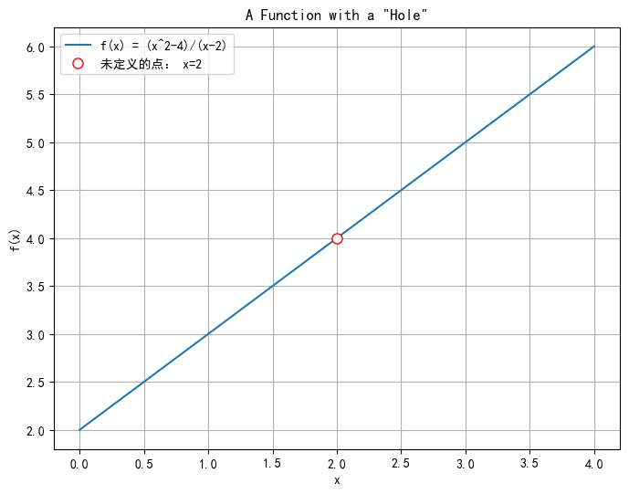
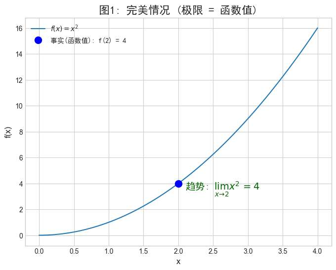
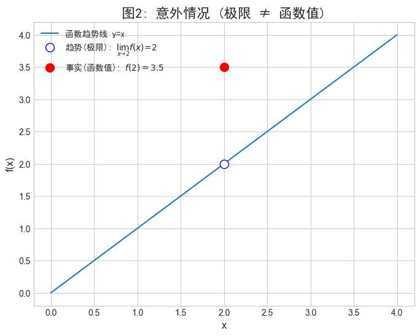
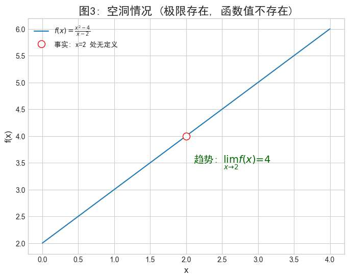

我们学微积分，第一个见面的，就算“极限”

但大多数同学，包括我，之前对极限的直觉，只停留在模糊的“逼近”二字上。

对极限的定义
$\forall \varepsilon > 0$，$\exists \delta > 0$，当 **$0 < |x - x_0| < \delta$** 时，有 $|f(x) - A| < \varepsilon$。

更是让无数英雄好汉“从入门到放弃”。

本篇文章，不从公式入手，而是详细探究出极限定义的内涵，用一场生动的“拷问游戏”，去亲手重塑对极限的直觉。用生动的比喻，建立起难忘的直觉！

刚才模糊的公式，也会变得清晰而和蔼可亲！

# 极限的艺术
为什么我们需要极限的定义？
我们人类的初始直觉，天生就对“逼近”有种朴素的感知。

但放到数学领域，我们试图，用公式，描述这个“逼近"感。
这样听起来很有趣吧？ 用公式来描述我们的感觉。

“逼近”到底是一种什么样的感觉呢？

假如说，有一个生活在二维世界的函数。
二维世界里，函数上每一个点都有自己的横坐标位置x，和函数值y。

x和y共同决定了该点在图中的位置。
函数图像完整地展示出了这样的画面。

但是！他有一个点 x₀，它的函数值 f(x₀) 被神秘地遮住了（或者，它压根就不存在！）。比如下面的函数，红色圆圈就是被遮盖的地方。

我们强大的直觉，通过观察它左右的“邻居”，几乎能瞬间“脑补”出那个被遮住的值应该是多少：“这个值一定是 4！”

现在，我们要做的，就是把这个“脑补”和“猜测”的过程，变成一场严谨的游戏。

---
**游戏角色：**

- **你：** 充满直觉的提问者。
    
- **x₀：** 被拷问者。它从不用自己的真实值回答（因为它可能没有），而是通过调度它的“邻居”来回应。
    

**游戏目标：**

验证你的猜测值 A，是否真的是 x₀ 在那个位置上无限逼近的值。

----

就用上面的图做为例子，对于函数 f(x) = (x² - 4) / (x - 2)，我们关注的点是 x₀ = 2。我们的直觉猜测，它被遮住的值应该是 A = 4。

这个凭我们直觉出来的“猜测值”，视作对x0的挑战。

有可能，x0会说：

诶，我有周围方圆几十米内的邻居，他们的值，很接近你猜的A。

我们想，如果我们的猜测，能让x0称“他的邻居值很接近”，   且如果这个“接近”，是非常非常夸张的“逼近”近乎于“相等”，

我们就可以说，我们的猜测，准确了！

于是我们不断进行逼问x0, 到底有多么接近。

我们来“游戏”情景的例子：

**第一轮**
- 你：x0，你邻居的值，和我的猜测值 4 之间的距离，小于 **0.1**吗？
- x0: 是的，在离我0.05范围内的所有邻居，都满足。
**第二轮**
- 你：我感觉0.1还是太大，你邻居能做到离4只差**0.001**吗？
- x0: 可以！ 只要邻居 与我之间的距离，小于 **0.0005**，就满足！

如果我们一直为难x0的邻居，x0说**怎么滴他都有邻居能满足我们的为难**。

即无论你的挑战变得多么苛刻，无论你提出的那个“误差范围”有多么微乎其微，被拷问的 x₀ 总能给出一个确切的“邻域范围”作为回应。

我们就可以理解为，我们的预测值，真的是没问题的！**4，就是这个函数在 x 趋近于 2 时的极限！**

这个游戏，就是数学家们发明的，用来描述“逼近”感的精确“公式”——ε-δ 定义

现在，我们直觉建立结束，再去回过头看看公式的定义。

## 公式例子解读

直觉已经建立，让我们对齐严谨的数学！

- 我们预测，x0这个位置，其值应该是4。
	- 数学翻译：x0位置的极限为A，A=4
- 提出的误差挑战”**（比如 0.1, 0.001）**
	- 数学翻译：误差，是任意一个大于零的值 **ε (Epsilon)**，不过我们一般默认他非常小
	- **对应公式：** `|f(x) - A| < ε`  （函数值与猜测值的距离，小于你指定的误差）
- x₀ 给出的邻域范围
	- 数学翻译： 这就是 `x₀` 为了满足你的 ε 挑战，而找到的邻域半径 **δ (Delta)**。
	- **对应公式：** `0 < |x - x₀| < δ` （x 和 `x₀` 的距离，在 δ 半径内，且 x 不是 `x₀` 本身）
- 无论你提出多苛刻的提问
	- 数学翻译：**对于任意给定的 ε > 0...**
	- **对应符号：** $\forall \varepsilon > 0$
- “x₀ 总能找到一个范围来应对”
    *   **数学翻译：** **总会存在一个 δ > 0...**
    *   **对应符号：** $\exists \delta > 0$

现在再来看公式

对于函数f(x)，其x0处，极限为A的定义为

$\forall \varepsilon > 0$，$\exists \delta > 0$，当 **$0 < |x - x_0| < \delta$** 时，有 $|f(x) - A| < \varepsilon$。

是不是感觉完全不一样了？
它不再抽象,而是那场游戏的总结：

**对于你提出的任何(∀)一个精度挑战(ε)，我总能找到(∃)一个邻域范围(δ)，让这个范围里的所有邻居，都满足你的挑战。**

## 注意的地方
## 极限与函数值
在我们这场“拷问游戏”中，有一个核心原则必须牢记：

我们预测的那个“值”，我们称之为**极限**。这个值，是我们通过严刑拷问 x₀ 的所有“邻居”而得出的**结论**。

预测的“值”我们称做极限，这是我们通过逼问x0邻居得出的值，与x0的函数值没有
任！何！关！系！

**趋势是趋势（极限），事实是事实（函数值）。** 极限只负责描绘趋势的动态，它回答的问题是：“当我们无限逼近 x₀ 时，函数值正朝着哪个目标飞奔而去？”至于它最终有没有到达那个目标，甚至那个目标点本身是不是个陷阱，极限根本不在乎。

下面这三张图，就是对这个核心思想最完美的诠释：

**图1: 完美情况 (极限 = 函数值)**
>    **解说：** 趋势与事实完美统一。这，就是我们下一篇文章的主角——**连续**。

> **图2: 意外情况 (极限 ≠ 函数值)**
> **解说：** 趋势指向 `y=2`，但事实却被强行按在了 `y=3.5`。

> **图3: 空洞情况 (极限存在，但函数值不存在)**
>**解说：** 趋势清晰地指向 `y=4`，但那个位置上空无一物。

# 无穷大和无穷小

这里，我们再用无穷大和无穷小，套用一下我们的游戏模板，加深大家理解，并搞定这俩个特殊的极限。

## 无穷大

我们看到图像，从直觉感觉，x0这点的值，似乎非常了不得，感觉看不到头啊。我们自己也说不出一个预测值

我们用刚才的游戏，测试一下：

我们定一个超大的预测值，假如说A =10000 ，并且要求邻居误差精度。
x0说，我周围有邻居，满足，且无论你精度如何设置都满足。
那好，现在，我们都不改精度了，我们直接改A，难道你邻居，还能接近，比刚才再加一个0，1000000.
x0说，轻轻松松。
我们生气了，再加！

.....

结果发现，无论我们设置多大的预测值，x0总有邻居能满足靠近。

所以游戏已经变得不是靠直觉猜预测，然后用精度逼问是否预测正确，

因为第一步“猜预测”我们就发现**我们无法做到**。

无穷大是一个，我们无法用直觉预测的值。

他是一种**状态**，一种**趋势**，描述的是“永无止境地增长”。

所以，拷问游戏的目标变了。

*   **旧游戏的目标：** 证明 `f(x)` 能被无限“挤压”到一个**特定值 `A`** 的周围。
*   **新游戏的目标：** 证明 `f(x)` 的增长**不可阻挡**，能**突破任何你敢设定的上限**。

#### 无穷大定义

让我们先看一下它的公式，然后马上用升级版的游戏来翻译它。

> 我们称函数 `f(x)` 当 `x` 趋近于 `x₀` 时的极限为 `+∞`，其定义为：
>
> $\forall M > 0$，$\exists \delta > 0$，当 **$0 < |x - x_0| < \delta$** 时，有 $f(x) > M$。

#### **游戏翻译**

现在，我们把这个定义翻译成我们的游戏，游戏的“挑战-回应”策略完全没变！

*   **`∀ M > 0` （对于任意 M > 0）**
    *    你（挑战者）可以设定**任何一个你认为高不可攀的“上限” `M`**。你可以喊出“一万！”，“一个亿！”，或者任何一个巨大的数字。

*   **`∃ δ > 0` （存在一个 δ > 0）**
    *    `x₀`（被拷问者）总能回应你，并**找到一个对应的“邻域范围” `δ`**。

*   **当 $0 < |x - x_0| < \delta$`时，有 `$f(x) > M$`
    *    `x₀` 向你保证：“只要我的邻居 `x` 落在我给出的这个 `δ` 范围之内，那么邻居对应的值 `f(x)` 就**必定会突破**你设定的那个上限 `M`！”

**游戏的机制从“确定预测值后，通过逼近缩小误差” `|f(x) - A| < ε`，升级为了“发现自己连预测值都确定不了，一直突破上限” `f(x) > M`**。

但逻辑还是那个“你敢提任何要求(∀)，我就总有办法(∃)满足你”

此时我们不存在预测的极限值A，极限变为：

`lim (x->x0) f(x) = ∞` (这里修改一下markdown吧)

## 无穷小

无穷小本质上就是**极限为零**的另一种说法。

关于无穷小，我们直接拿个有无穷小的x0的函数，大家可以自己尝试描述。

我们知道

$\lim_{x \to 0} x^2 = 0$

现在，你可以自己来描述这场游戏了。你和 x₀=0 的对话会是怎样的呢？

...（思考思考吧）...

**游戏剧本应该是这样的：**

*   **你的第一轮挑战：** “`x₀=0`，我猜你的极限是 0。你的邻居 的函数值`x²` 和 0 之间的差距，小于 **0.01** 吗？”
*   **`x₀=0` 的回应：** “当然。只要邻居 `x` 离我的距离在 **0.1** 之内（即 `|x-0| < 0.1`），那么 `x²` 就必然小于 `0.01`。满足你的要求。”

*   **你的第二轮挑战（更苛刻）：** “我要更精确一点！你邻居的值 `x²` 和 0 的差距，能小于 **0.0001**！”
*   **`x₀=0` 的回应：** “没问题。只要邻居范围缩小到 **0.01** 之内（即 `|x-0| < 0.01`），那么 他们的`x²` 就一定会小于 `0.0001`。”
......

**游戏的结论：**

无论你的要求 `ε` （比如 0.01, 0.0001）多么接近零，`x₀=0` 总能给出一个对应的 `δ` 范围（在这个例子里 $δ = √ε$来满足你。

当我们预测x的值为0（当我们认为x的极限值为0），x0永远能回答我们的逼问。
因此，我们宣布：`lim (x->0) x² = 0`

# 连续的内涵
现在，我们已经彻底掌握了“极限”这个工具。我们知道，它描述的是一个“趋势”。同时，我们也知道一个函数在某点上有一个“事实”（函数值）。

那么，一个最自然的问题就是：**当“趋势”和“事实”完美相遇时，会发生什么？**

**答案就是：连续 。**

后续文章，我同样会用“直觉”与“比喻”介绍连续与“可去间断点”的知识，为我们的“导数、微分”和“积分”打下基础。