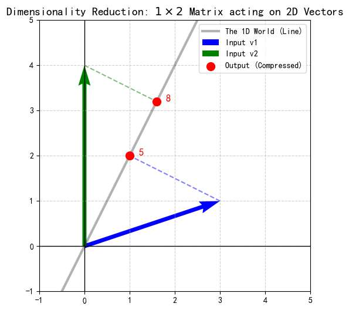

矩阵，线性代数里非常常见的元素。

在大多数人的印象里，它似乎只是一张枯燥的、由数字排列而成的方方正正的表格。如果不幸通过应试教育去认识它，它更像是一个用来进行繁琐加减乘除的“计算容器”。“哦，他作用于一堆数字，然后通过繁杂的公式，得出另一堆数字”......

但在我看来，**矩阵不应当仅仅是枯燥的数字表格。**

我们需要理解矩阵的“几何直觉”。明白他是“空间变换”和“信息处理”的语言，我们才能更好应用他。无论是在人工智能领域如鱼得水地应用矩阵，还是面对”考研“”期末“，不想那么痛苦的应试。去建立直觉，永远，是一个好方向。

# 矩阵乘法：为了“作用”而生
矩阵不能凭空出现，孤零零地呆在那。

如果我们还是用“应试”的角度，去看矩阵，矩阵确实可以孤零零的。 因为它就是一堆毫无意义的数字。

然而，矩阵从诞生的那一刻起，就有个使命，“作用”于他人的。

这个“作用”，在数学上，正是矩阵乘法。

我们可以这样理解：**矩阵一旦出现，就是为了去“乘”某个对象的。** 它是一个动词，是一个机器，而不是一个名词。

那么矩阵乘法到底蕴含着什么直觉呢？

忘掉那背的滚瓜烂熟的“行乘列求和”公式。

从现在开始，我会展示矩阵乘法，但请不要套用公式，去验证它。

我们要重新建立对它的直觉。

## 场景一：矩阵与向量的初次相遇

让我们从最基础的场景开始：一个矩阵 $A$ 想要“作用”于一个向量 $x$。我们默认，“作用”，是将矩阵，放到向量的“左边”！！！去作用的。位置不能错。

$$
\text{Output} = \text{Matrix} \cdot \text{Input}
$$

我们设定：
*   **变换机器 $A$**：一个 $2 \times 2$ 的矩阵。
*   **输入对象 $x$**：一个 $2 \times 1$ 的列向量。
举个例子：
$$
\begin{bmatrix}
1 & 3 \\
2 & 0
\end{bmatrix}
\cdot
\begin{bmatrix}
x \\
y
\end{bmatrix}
= \ ?
$$

A，是个机器，我们不用想它的物理含义！ 目前只知道，它用于变换别人。

在按下“计算”按钮之前，我们先好好看看这个**输入对象**。
我们可以理解为熟知的二维坐标（x，y），高中知识告诉我们，
可以表示为，以原点为起点，终点为（x，y） 箭头方向从原点到终点的向量。

`图：《矩阵力量》 https://github.com/Visualize-ML/Book4_Power-of-Matrix `

高中知识还告诉我们，二维向量 $\begin{bmatrix} x \\ y \end{bmatrix}$ 其实是两个**基向量**的组合：
*   $\hat{i}$ ：横轴单位向量 $\begin{bmatrix} 1 \\ 0 \end{bmatrix}$
*   $\hat{j}$ ：纵轴单位向量 $\begin{bmatrix} 0 \\ 1 \end{bmatrix}$

显然，他们的长度`|i|、|j|`都是1。
向量 $\begin{bmatrix} x \\ y \end{bmatrix}$ 的本质含义是：**“沿着 $\hat{i}$ 方向走 $x倍的|i|$ 步，再沿着 $\hat{j}$ 方向走 $y倍的|j|$ 步”。** 或者直接说，x倍的i于y倍的j做向量加法。

写成数学式子就是：
$$
\text{Input} = x \cdot \hat{i} + y \cdot \hat{j}
$$
如图，向量v，可以拆分成$\hat{i} , \hat{j}$的组合，本例中为：$1\cdot \hat{i} + 2 \cdot \hat{j}$

### 列视角

现在，矩阵 $A$ 开始发挥作用了。这个机器到底做了什么？
**列视角告诉我们要盯着矩阵的“列”看：**

*   **矩阵的第一列** $\begin{bmatrix} 1 \\ 2 \end{bmatrix}$：这是 $\hat{i}$ 变换后的**新位置**（New $\hat{i}$）。
*   **矩阵的第二列** $\begin{bmatrix} 3 \\ 0 \end{bmatrix}$：这是 $\hat{j}$ 变换后的**新位置**（New $\hat{j}$）。

随着基向量i和j的改变，整个坐标轴，我们都可以理解为变了。

既然原来的向量是 “$x$ 份的 $\hat{i}$ 加上 $y$ 份的 $\hat{j}$”，
那么变换后的向量，必然就是 **“$x$ 份的** **新 $\hat{i}$** **加上 $y$ 份的** **新 $\hat{j}$”**

带来的结果是，空间里千千万万个向量，都变成了新向量。同时，网格线始终保持平行且等距，原点保持不动。

这就叫”线性变换“  。

我们不需要关心空间里千千万万个向量各自去了哪里，我们只需要追踪这两个基向量，整个空间的就被确定了。

原来的坐标轴或许已经被拉伸、旋转，不再是标准的十字架，但我们的**路径法则**依然有效：

$$
\text{Output} = x \cdot (\text{New } \hat{i}) + y \cdot (\text{New } \hat{j})
$$

把它代入我们具体的矩阵 $A$：

$$
\begin{bmatrix}
1 & 3 \\
2 & 0
\end{bmatrix}
\begin{bmatrix}
x \\
y
\end{bmatrix}
=
x \cdot \underbrace{\begin{bmatrix} 1 \\ 2 \end{bmatrix}}_{\text{Col 1}}
+ 
y \cdot \underbrace{\begin{bmatrix} 3 \\ 0 \end{bmatrix}}_{\text{Col 2}}
=
\begin{bmatrix}
1x + 3y \\
2x + 0y
\end{bmatrix}
$$

如图，我们的原始向量v是$1\cdot \hat{i} + 2 \cdot \hat{j}$
现在只不过变成了$1\cdot (\text{New } \hat{i}) + 2 \cdot (\text{New } \hat{j})$。

当然，实际上，可以理解为整个空间坐标轴都因为新的基向量，而改变

**这就是列视角：**

**矩阵列向量**，看做$\text{New } \hat{i},\text{New } \hat{j}$
矩阵与向量的乘法，本质上是在说，基向量变换后的空间，向量 $\begin{bmatrix}x \\y\end{bmatrix}$去哪了，去到了output
$\text{Output} = x \cdot (\text{New } \hat{i}) + y \cdot (\text{New } \hat{j})$ 

也可以看作，结果是**矩阵列向量的线性组合**。输入向量的坐标 $(x, y)$，其实就是分配给这些列向量的**权重**。

ok  这样一来，矩阵的形状（几行几列）就不再是死记硬背的规则，而是逻辑的必然。

我们能用一个 **$2 \times 3$**（2行3列）的矩阵，去变换一个 **$2 \times 1$** 的向量 $\begin{bmatrix}x \\y\end{bmatrix}$ 吗？
 
不能，这个向量，是二维的，表明，只有俩个基向量组成他们。$x$ 和 $y$。

那么$\text{New } \hat{i},\text{New } \hat{j}$ 也一定是俩个，

则矩阵，一定是，俩列！！！

从刚才线性加权角度思考，
$2 \times 3$ 的矩阵有 **3列**（3个基向量）。
我们有 3 个基向量等待被缩放，却只来了 2 个权重指令。第 3 列基向量就问了“谁来乘我？”

故而，**矩阵的列数（Columns），必须等于输入向量的维数。**

### 批量处理
假设我们不是处理一个向量，而是同时处理两个向量 $\vec{v_1} = \begin{bmatrix}x_1 \\y_1\end{bmatrix}$ 和 $\vec{v_2} = \begin{bmatrix}x_2 \\y_2\end{bmatrix}$。
我们可以把它们拼起来，变成一个 $2 \times 2$ 的矩阵 $B = [\vec{v_1}, \vec{v_2}]$。

$$
A \cdot \begin{bmatrix} \vec{v_1} & \vec{v_2} \end{bmatrix} = \begin{bmatrix} A\vec{v_1} & A\vec{v_2} \end{bmatrix}
$$

这只是**批量处理！**
矩阵 $A$ 并没有发生什么神奇的变化，它只是勤勤恳恳地、独立地对 $B$ 中的**每一列**分别进行了变换，然后把结果并排摆放。

*   **输入：** 2个向量。
*   **输出：** 2个变换后的向量。

### 维度的含义
可能又有人问，用刚才这个矩阵A，作用于横着写的向量 $[x, y]$行不行？

有的人很容易把这个向量，也立即为二维的。

可是按照上面那个“批量处理”的法则，实际上，

这应该是，**一维的，数轴上的，俩个独立的点，拼接的向量！**

所以不可以。

- 行数（一共多少行）代表维数！  
- 列数（一行有多少个）说明了向量的个数。

### 维度的跃迁

现在来到最精彩的部分。

ok  那我们这样，

如果矩阵是 **$3 \times 2$**（3行2列）的，它可以作用于二维向量 $\begin{bmatrix}x \\y\end{bmatrix}$ 吗？

**检查规则：**
*   输入向量有 2 个权重（$x, y$）。
*   矩阵有 2 列。
*   **没问题！**

但是，这一次发生了质的变化。让我们看看这个矩阵长什么样：

$$
A = \begin{bmatrix}
a_1 & b_1 \\
a_2 & b_2 \\
a_3 & b_3
\end{bmatrix}
$$

*   **第一列（New $\hat{i}$）：** $\begin{bmatrix} a_1 \\ a_2 \\ a_3 \end{bmatrix}$。这是一个 **三维空间** 中的向量！
*   **第二列（New $\hat{j}$）：** $\begin{bmatrix} b_1 \\ b_2 \\ b_3 \end{bmatrix}$。这也是一个 **三维空间** 中的向量！

**运算过程：**
$$
\text{Output} = x \cdot \underbrace{\begin{bmatrix} \text{3D Vector} \end{bmatrix}}_{\text{New } \hat{i}} + y \cdot \underbrace{\begin{bmatrix} \text{3D Vector} \end{bmatrix}}_{\text{New } \hat{j}} = \begin{bmatrix} \text{New 3D Vector} \end{bmatrix}
$$

如图，

从矩阵形状来说，确实，规定了仅有的俩个基向量（图中蓝色、红色向量）的新去处，即$\text{New } \hat{i},\text{New } \hat{j}$ 

但！

这个新地方，不在原来$\begin{bmatrix}x \\y\end{bmatrix}$ （如图中绿色向量）所生活的二维平面的世界了， 而是去了三维世界！

*   **矩阵的列数（Columns）** = **输入空间**的维度（因为列数就是原来空间的基向量个数）。
*   **矩阵的行数（Rows）** = **输出空间**的维度（把你送去几维世界？）。

读者！你现在可以自己想象，一个$1 \times 2$的向量，当作矩阵，变换的机器，作用于$2 \times 2$ 的拼接向量，当然我们也称为矩阵。
## 维度的“降维”

现在，让我们把思维逆转过来。
如果我们的矩阵A，这个变换的**机器**变得非常薄，只有一行，会发生什么？

设想我们的机器 $A$ 是一个 **$1 \times 2$** 的矩阵：
$$
A = \begin{bmatrix} 1 & 2 \end{bmatrix}
$$

我们的输入对象 $B$ 是一个 **$2 \times 2$** 的矩阵（代表两个二维向量）：
$$
B = \begin{bmatrix} 3 & 0 \\ 1 & 4 \end{bmatrix}
$$

让我们看看 $A$ 是如何“作用”于 $B$ 的：

$$
\underbrace{\begin{bmatrix} 1 & 2 \end{bmatrix}}_{\text{1D Machine}} \cdot \underbrace{\begin{bmatrix} 3 & 0 \\ 1 & 4 \end{bmatrix}}_{\text{2D Data}} = \begin{bmatrix} (1\cdot3 + 2\cdot1) & (1\cdot0 + 2\cdot4) \end{bmatrix} = \begin{bmatrix} 5 & 8 \end{bmatrix}
$$

**发生了什么？**
1.  **输入：** 两个生活在二维平面上的向量 $\begin{bmatrix} 3 \\ 1 \end{bmatrix}$ 和 $\begin{bmatrix} 0 \\ 4 \end{bmatrix}$。
2.  **输出：** 两个躺在数轴上的数字 $5$ 和 $8$。

这是三体里的“**二向箔**”攻击啊！
*   $1 \times 2$ 的矩阵代表了一个**投影动作**。
*   它把二维空间中的所有物体，强行压缩（投影）到了一根数轴上。
*   虽然输入有 $x$ 和 $y$ 两个维度的信息，但经过这个机器的降维，最后只剩下一个维度的标量。

**这就是“行向量”的真：**
它不仅仅是一个横着写的向量，它本质上是一个**测量工具**。它拿着一把尺子，去衡量所有二维向量在它方向上的投影长度。

# 行视角

