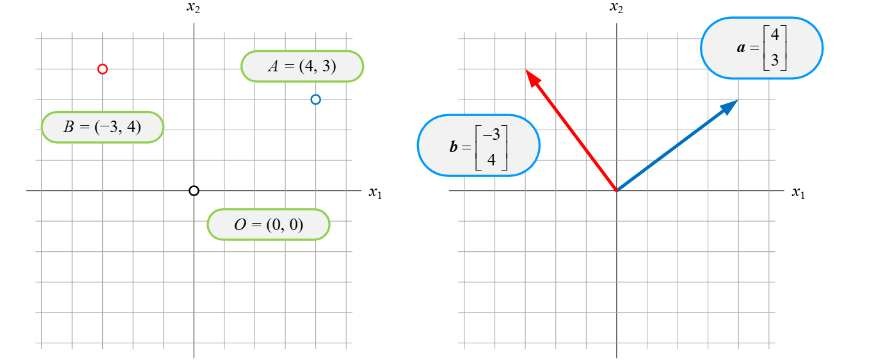
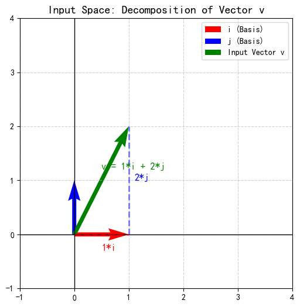
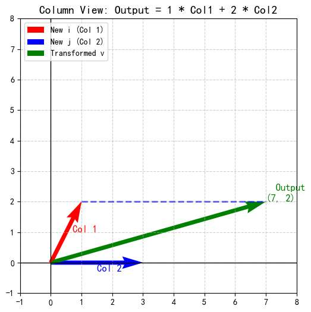
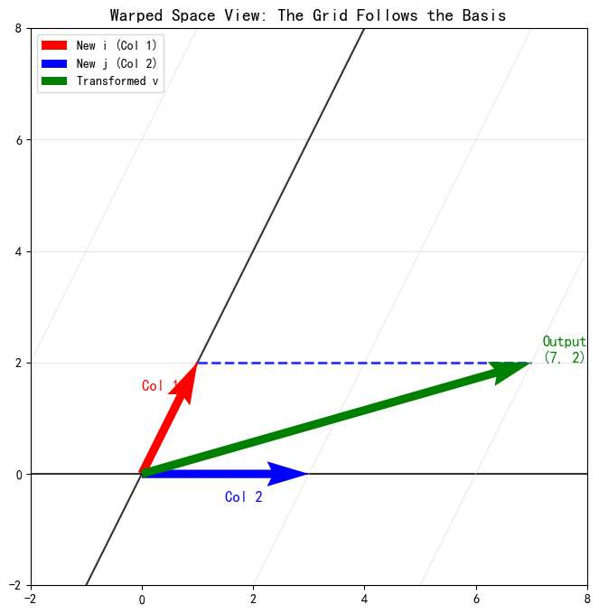
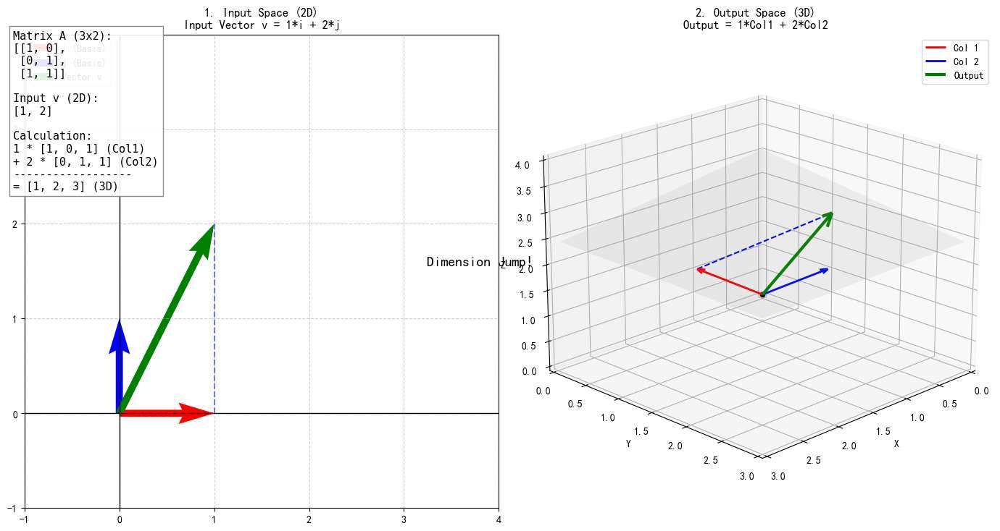
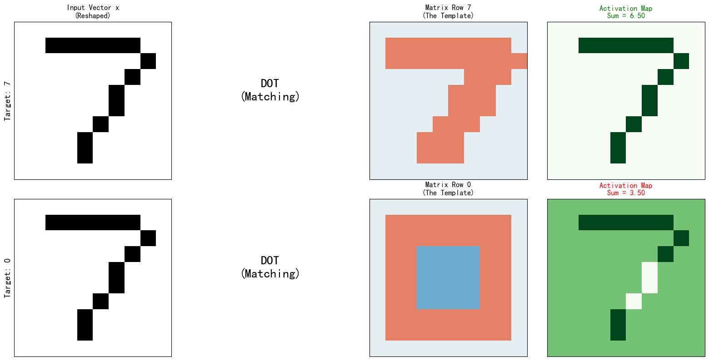

矩阵，线性代数里非常常见的元素。

在大多数人的印象里，它似乎只是一张枯燥的、由数字排列而成的方方正正的表格。如果不幸通过应试教育去认识它，它更像是一个用来进行繁琐加减乘除的“计算容器”。“哦，他作用于一堆数字，然后通过繁杂的公式，得出另一堆数字”......

但在我看来，**矩阵不应当仅仅是枯燥的数字表格。**

我们需要理解矩阵的“**几何直觉**”。明白他是**列视角下**的“空间变换”和**行视角下**的“信息处理”的语言，我们才能更好应用他。

无论是在人工智能领域如鱼得水地应用矩阵，还是面对”考研“”期末“，不想那么痛苦的应试。**去建立直觉，永远，是一个好方向。**

# 矩阵乘法：为了“作用”而生
矩阵不能凭空出现，孤零零地呆在那。

如果我们还是用“应试”的角度，去看矩阵，矩阵确实可以孤零零的。 因为它就是一堆毫无意义的数字。

然而，矩阵从诞生的那一刻起，就有个使命，“作用”于他人的。

这个“作用”，在数学上，正是**矩阵乘法**。

我们可以这样理解：**矩阵一旦出现，就是为了去“乘”某个对象的。** 它是一个动词，是一个机器，而不是一个名词。

那么矩阵乘法到底蕴含着什么直觉呢？

忘掉那背的滚瓜烂熟的“行乘列求和”公式。

从现在开始，我会展示矩阵乘法，但请不要套用公式，去验证它。

我们要重新建立对它的直觉。

## 矩阵与向量的初次相遇

让我们从最基础的场景开始：一个矩阵 $A$ 想要“作用”于一个向量 $x$。

我们默认，“作用”，是将矩阵，放到**向量的“左边”**！！！位置不能错。

$$
\text{Output} = \text{Matrix} \cdot \text{Input}
$$

我们设定：
*   **变换机器 $A$**：一个 $2 \times 2$ 的矩阵。
*   **输入对象 $x$**：一个 $2 \times 1$ 的列向量。
举个例子：
$$
\begin{bmatrix}
1 & 3 \\
2 & 0
\end{bmatrix}
\cdot
\begin{bmatrix}
x \\
y
\end{bmatrix}
= \ ?
$$

A，是个机器，我们不用想它的物理含义！ 目前只知道，它用于变换别人。

在按下“计算”按钮之前，我们先好好看看这个**输入对象**。

我们可以理解为熟知的二维坐标（x，y），高中知识告诉我们，
可以表示为，以原点为起点，终点为（x，y） 箭头方向从原点到终点的向量。

`图：《矩阵力量》 https://github.com/Visualize-ML/Book4_Power-of-Matrix `

高中知识还告诉我们，二维向量 $\begin{bmatrix} x \\ y \end{bmatrix}$ 其实是两个**基向量**的组合：
*   $\hat{i}$ ：横轴单位向量 $\begin{bmatrix} 1 \\ 0 \end{bmatrix}$
*   $\hat{j}$ ：纵轴单位向量 $\begin{bmatrix} 0 \\ 1 \end{bmatrix}$

显然，他们的长度`|i|、|j|`都是1。
向量 $\begin{bmatrix} x \\ y \end{bmatrix}$ 的本质含义是：**“沿着 $\hat{i}$ 方向走 $x倍的|i|$ 步，再沿着 $\hat{j}$ 方向走 $y倍的|j|$ 步”。** 或者直接说，x倍的i于y倍的j做向量加法。

写成数学式子就是：
$$
\text{Input} = x \cdot \hat{i} + y \cdot \hat{j}
$$
如图，向量v，可以拆分成$\hat{i} , \hat{j}$的组合，本例中为：$1\cdot \hat{i} + 2 \cdot \hat{j}$

# 列视角

现在，矩阵 $A$ 开始发挥作用了。这个机器到底做了什么？
**列视角告诉我们要盯着矩阵的“列”看：**

*   **矩阵的第一列** $\begin{bmatrix} 1 \\ 2 \end{bmatrix}$：这是 $\hat{i}$ 变换后的**新位置**（New $\hat{i}$）。
*   **矩阵的第二列** $\begin{bmatrix} 3 \\ 0 \end{bmatrix}$：这是 $\hat{j}$ 变换后的**新位置**（New $\hat{j}$）。

随着基向量i和j的改变，整个坐标轴，我们都可以理解为变了。

既然原来的向量是 “$x$ 份的 $\hat{i}$ 加上 $y$ 份的 $\hat{j}$”，
那么变换后的向量，必然就是 **“$x$ 份的** **新 $\hat{i}$** **加上 $y$ 份的** **新 $\hat{j}$”**

带来的结果是，空间里千千万万个向量，都变成了新向量。同时，网格线始终保持平行且等距，原点保持不动。

这就叫”**线性变换**“  。

我们不需要关心空间里千千万万个向量各自去了哪里，我们只需要追踪这两个基向量，整个空间就被确定了。

原来的坐标轴或许已经被拉伸、旋转，不再是标准的十字架，但我们的**路径法则**依然有效：

$$
\text{Output} = x \cdot (\text{New } \hat{i}) + y \cdot (\text{New } \hat{j})
$$

把它代入我们具体的矩阵 $A$：

$$
\begin{bmatrix}
1 & 3 \\
2 & 0
\end{bmatrix}
\begin{bmatrix}
x \\
y
\end{bmatrix}
=
x \cdot \underbrace{\begin{bmatrix} 1 \\ 2 \end{bmatrix}}_{\text{Col 1}}
+ 
y \cdot \underbrace{\begin{bmatrix} 3 \\ 0 \end{bmatrix}}_{\text{Col 2}}
=
\begin{bmatrix}
1x + 3y \\
2x + 0y
\end{bmatrix}
$$

如图，我们的原始向量v是$1\cdot \hat{i} + 2 \cdot \hat{j}$
现在只不过变成了$1\cdot (\text{New } \hat{i}) + 2 \cdot (\text{New } \hat{j})$。

当然，实际上，可以理解为整个空间坐标轴都因为新的基向量，而改变

**这就是列视角：**

**矩阵列向量**，看做$\text{New } \hat{i},\text{New } \hat{j}$
矩阵与向量的乘法，本质上是在说，基向量变换后的空间，向量 $\begin{bmatrix}x \\y\end{bmatrix}$去哪了，去到了output
$\text{Output} = x \cdot (\text{New } \hat{i}) + y \cdot (\text{New } \hat{j})$ 

也可以看作，结果是**矩阵列向量的线性组合**。输入向量的坐标 $(x, y)$，其实就是分配给这些列向量的**权重**。

ok  这样一来，**矩阵的形状（几行几列）就不再是死记硬背的规则**，而是逻辑的必然。

我们能用一个 **$2 \times 3$**（2行3列）的矩阵，去变换一个 **$2 \times 1$** 的向量 $\begin{bmatrix}x \\y\end{bmatrix}$ 吗？
 
不能，这个向量，是二维的，表明，只有俩个基向量组成他们。$x$ 和 $y$。

那么$\text{New } \hat{i},\text{New } \hat{j}$ 也一定是俩个，

则矩阵，一定是，**俩列**！！！

用线性加权角度思考，
$2 \times 3$ 的矩阵有 **3列**（3个基向量）。
我们有 3 个基向量等待被缩放，却只来了 2 个权重指令。第 3 列基向量就问了“谁来乘我？”

故而，**矩阵的列数，必须等于输入向量的维度数（行数）。**

## 批量处理
假设我们不是处理一个向量，而是同时处理两个向量 $\vec{v_1} = \begin{bmatrix}x_1 \\y_1\end{bmatrix}$ 和 $\vec{v_2} = \begin{bmatrix}x_2 \\y_2\end{bmatrix}$。
我们可以把它们拼起来，变成一个 $2 \times 2$ 的矩阵 $B = [\vec{v_1}, \vec{v_2}]$。

$$
A \cdot \begin{bmatrix} \vec{v_1} & \vec{v_2} \end{bmatrix} = \begin{bmatrix} A\vec{v_1} & A\vec{v_2} \end{bmatrix}
$$

这只是**批量处理！**
矩阵 $A$ 并没有发生什么神奇的变化，它只是勤勤恳恳地、独立地对 $B$ 中的**每一列**分别进行了变换，然后把结果并排摆放。

*   **输入：** 2个向量。
*   **输出：** 2个变换后的向量。

## 维度的含义
可能又有人问，用刚才这个矩阵A，作用于横着写的向量 $[x, y]$行不行？

有的人很容易把这个向量，也理解为二维的。

可是按照上面那个“批量处理”的法则，实际上，

这应该是，**一维的，数轴上的，俩个独立的点，拼接的向量！**

所以不可以。

- 行数（一共多少行）代表维数！  
- 列数（一行有多少个）说明了向量的个数。

## 维度的跃迁

现在来到最精彩的部分。

ok  那我们这样，

如果矩阵是 **$3 \times 2$**（3行2列）的，它可以作用于二维向量 $\begin{bmatrix}x \\y\end{bmatrix}$ 吗？

**检查规则：**
*   输入向量有 2 个权重（$x, y$）。
*   矩阵有 2 列。
*   **没问题！**

但是，这一次发生了质的变化。让我们看看这个矩阵长什么样：

$$
A = \begin{bmatrix}
a_1 & b_1 \\
a_2 & b_2 \\
a_3 & b_3
\end{bmatrix}
$$

*   **第一列（New $\hat{i}$）：** $\begin{bmatrix} a_1 \\ a_2 \\ a_3 \end{bmatrix}$。这是一个 **三维空间** 中的向量！
*   **第二列（New $\hat{j}$）：** $\begin{bmatrix} b_1 \\ b_2 \\ b_3 \end{bmatrix}$。这也是一个 **三维空间** 中的向量！

**运算过程：**
$$
\text{Output} = x \cdot \underbrace{\begin{bmatrix} \text{3D Vector} \end{bmatrix}}_{\text{New } \hat{i}} + y \cdot \underbrace{\begin{bmatrix} \text{3D Vector} \end{bmatrix}}_{\text{New } \hat{j}} = \begin{bmatrix} \text{New 3D Vector} \end{bmatrix}
$$

如图，

从矩阵形状来说，确实，规定了仅有的俩个基向量（图中蓝色、红色向量）的新去处，即$\text{New } \hat{i},\text{New } \hat{j}$ 

但！

这个新地方，不在原来$\begin{bmatrix}x \\y\end{bmatrix}$ （如图中绿色向量）所生活的二维平面的世界了， 而是去了三维世界！

*   **矩阵的列数（Columns）** = **输入空间**的维度（因为列数就是原来空间的基向量个数）。
*   **矩阵的行数（Rows）** = **输出空间**的维度（把你送去几维世界？）。

读者！你现在可以自己想象，一个$1 \times 2$的向量，当作矩阵，变换的机器，作用于$2 \times 2$ 的拼接向量（当然我们也称其为矩阵），会发生什么
## 维度的“降维”

现在，让我们把思维逆转过来。
如果我们的矩阵A，这个变换的**机器**变得非常薄，只有一行，会发生什么？

设想我们的机器 $A$ 是一个 **$1 \times 2$** 的矩阵：
$$
A = \begin{bmatrix} 1 & 2 \end{bmatrix}
$$

与我们之前建立的“**列视角**”依然坚不可摧，逻辑完全一致：

*   **看第一列 $[1]$：** 这意味着原来的横向基向量 $\hat{i}$，在这个一维新世界里，变成了数字 **1**。
*   **看第二列 $[2]$：** 这意味着原来的纵向基向量 $\hat{j}$，在这个一维新世界里，变成了数字 **2**。

**变换过程：**
输入向量 $\begin{bmatrix} x \\ y \end{bmatrix}$ 本质上是 $x$ 个 $\hat{i}$ 加上 $y$ 个 $\hat{j}$。
既然 $\hat{i}$ 变成了 $1$，$\hat{j}$ 变成了 $2$，那么结果自然就是：

$$
\text{Output} = x \cdot (1) + y \cdot (2) = x + 2y
$$

我们的输入对象 $B$ 是一个 **$2 \times 2$** 的矩阵（代表两个二维向量）：
$$
B = \begin{bmatrix} 3 & 0 \\ 1 & 4 \end{bmatrix}
$$

让我们看看 $A$ 是如何“作用”于 $B$ 的：

$$
\underbrace{\begin{bmatrix} 1 & 2 \end{bmatrix}}_{\text{1D Machine}} \cdot \underbrace{\begin{bmatrix} 3 & 0 \\ 1 & 4 \end{bmatrix}}_{\text{2D Data}} = \begin{bmatrix} (1\cdot3 + 2\cdot1) & (1\cdot0 + 2\cdot4) \end{bmatrix} = \begin{bmatrix} 5 & 8 \end{bmatrix}
$$

**发生了什么？**
1.  **输入：** 两个生活在二维平面上的向量 $\begin{bmatrix} 3 \\ 1 \end{bmatrix}$ 和 $\begin{bmatrix} 0 \\ 4 \end{bmatrix}$。
2.  **输出：** 两个躺在数轴上的数字 $5$ 和 $8$。

这是三体里的“**二向箔**”攻击啊！
*   $1 \times 2$ 的矩阵代表了一个**投影动作**。
*   它把二维空间中的所有物体，强行压缩（投影）到了一根数轴上。
*   虽然输入有 $x$ 和 $y$ 两个维度的信息，但经过这个机器的降维，最后只剩下一个维度的标量。

# 行视角

在纯几何变换（移动向量）的世界里，列视角确实够了。
但一旦涉及到**数据处理、方程求解、AI特征提取**，行视角就是不可或缺的上帝视角。
     
假设我们要计算 $C = A \cdot B$。
**列视角，会如何看待这个过程**？
如”批量处理“那一小节， $B$ 实际上是看作一列一列的向量 ($\vec{b_1}, \vec{b_2}, ...$)拼起来，等待A的作用。
$A$ 是什么？一个**空间的变换机器**。它勤勤恳恳地分别把 $\vec{b_1}$ 扭曲成了 $\vec{c_1}$，把 $\vec{b_2}$ 扭曲成了 $\vec{c_2}$...
最后得到 $C = [A\vec{b_1} \ | \ A\vec{b_2} \ | \ ... ]$

**行视角 ，会如何看待这个过程**

**$B$ 是仍然是等待作用的原材料**（每一行是同一种原料）， **$A$ 仍然是作用在B上**。
但！我们要把 $A$ 切成一行一行的向量 ($\vec{r_1}, \vec{r_2}, ...$)。
$C$ 的每一行，都是 $A$ 的那一行（指令）对 $B$ 的所有行（原料）进行的**加权混合**
*   **公式：**
    $$
    C = \begin{bmatrix}
    \text{Row}_1(A) \cdot B \\
    \text{Row}_2(A) \cdot B \\
    ...
    \end{bmatrix}
    $$

让我们用行视角重新审视那个 **维度跃迁 ($3 \times 2$)** 的例子。

$$
\begin{bmatrix}
1 & 0 \\
0 & 1 \\
1 & 1
\end{bmatrix}
\cdot
\begin{bmatrix}
x \\
y
\end{bmatrix}
=
\begin{bmatrix}
x \\
y \\
x+y
\end{bmatrix}
$$

**我们之前讲的列视角：**
我们在 3D 空间里组合两个基向量

**现在来看看行视角：**
我们将矩阵看作 3 行独立的“指令”：

1.  **第一行 $[1, 0]$：**
	 “只保留第一个分量，忽略第二个。”
    *   **结果：** $x$。 提取了 x 轴的信息。

2.  **第二行 $[0, 1]$：**
     “忽略第一个分量，只保留第二个。”
    *   **结果：** $y$。 提取了 y 轴的信息。

3.  **第三行 $[1, 1]$：**
	 “把两个分量等比例混合。”
    *   **结果：** $x + y$。**创造了一个新的特征**

这三行指令，提取的数据结果，纵向拼接，形成最终的矩阵计算结果。

**再回到那个 $1 \times 2$ 的例子 $[1, 2]$$\begin{bmatrix} x \\ y \end{bmatrix}$ 这俩个矩阵作用，看看：**
*   **列视角：** 把基向量变成了1和2。（想象空间变化的话，确实有点抽象）
*   **行视角：** 只有一行指令， $[1, 2]$。就是把二维数据压缩成了一个读数。要一一倍的$x$ ，两倍的$y$ ，结束。

## AI场景举例

行视角的威力，在人工智能领域（特别是计算机视觉）展现得淋漓尽致。

在神经网络中，矩阵 $W$（权重矩阵），

通常左乘输入向量 $x$：
$$y = Wx$$

**场景：手写数字识别**

*   **输入向量 $x$**：我们将一张 $28 \times 28$ 像素的图片拉直，变成一个 $784 \times 1$ 的长向量。这就是**原材料**。假如，它是数字”7“
*   **权重矩阵 $W$**：假设这是一个 $10 \times 784$ 的矩阵。它有 10 行，分别代表数字 0 到 9 的“过滤器”。

如果用列视角，嗯.... 一个784维的向量，其784个基向量，每个都被投影到了10维空间里，比如W的第645列，就是645维方向上的基向量，投影到10维空间时的坐标...然后x经过这些新基向量再次组合成新向量....

*我们只可以粗略理解为，输入向量x经过”降维“的空间变换。除此之外，，再想不到什么特别有效的信息*

**行视角视角，则更好理解整个过程：**

**我们看 $W$ 的第 "7" 行（对应检测数字7的那一行）：**

在这行向量里，对应图片“顶部横线”和“右侧斜线”位置的数值会非常大（正数），比如说，第600维度到700维度，代表了这个含义。

其他位置可能是 0 或负数。

代表我们想要提取的，就是600维度到700维度，这些特征的数。

 当我们用 $W$  去乘 **输入图片 $x$** 时，$W$ 的第七行明确说了，它要提取的信息就是600维度到700维度  比如这些维度的”配方“是`[12,34,12,...]

以单独的行视角来看，本质上是在做**点积（Dot Product）**，也就是**相似度匹配**：

$$
\underbrace{\begin{bmatrix} 0 & 0& \dots &  12 & 34 & 12 & \dots & 0& 0 \end{bmatrix}}_{\text{W 的第7行 (模版): 关注 600-700 维的特征}}
\cdot
\underbrace{\begin{bmatrix} 0 \\ 0\\ \vdots \\ 200 \\ 255 \\ 200 \\ \vdots \\ 0 \\0 \end{bmatrix}}_{\text{输入图片 x (数据): 在 600-700 维有笔画}}
= \text{巨大的正数}
$$
**结果** 算出来一个**巨大的正数**。 说明，诶，我们的**输入图片 $x$**  这些维度真的有数字且不小。那确实证明，输入图片是7

 看 $W$ 的第 "0" 行，它去乘输入图片 "7"，600维到700维没多几个数，即像素位置对不上。 算出来很小，甚至接近 0。  确实证明，它不是”0“

如图 ，我们看左中右三种矩阵
1.  **左边：**   这就是我们的输入向量 $\vec{x}$。虽然在计算时它是 高维的列向量，但在行视角下，我们把它这个列向量重新排列下，看做一张图片。图中所有矩阵同理。

2.  **中间：**
    *   **“行视角”的核心：**
    *   这个红蓝相间的图。就是矩阵的一行数字（$\vec{r_7}$ 和 $\vec{r_0}$）。
    *   **红色区域**表示正权重（“希望这些维度有数字，提取他们”）。
    *   **蓝色区域**表示负权重（“不希望这里有数字”）。

3.  **右边：**
    *   **第一行（匹配 7）：** 输入的黑色笔画，完美落在了模版的**红色区域**。
        *   正正得正。结果是一片亮绿色的激活区。 把所有绿色像素加起来，总分（Sum）很高（例如 10.5）。**系统便判定我们的输入是 7**
    *   **第二行（匹配 0）：** 输入的黑色笔画 "7"，大部分落在了模版（Row 0）的**白色或蓝色区域**（那是 0 的空心部分）。
        *   只有很少的地方重合。
        *   总分很低（例如 2.5）。**系统判定这不是 0。**

所以，在 AI 里，**行视角**的”信息提取“非常有用.

# 行视角与列视角的统一

说实话，用两种视角解释同一种东西，确实有一种，强行解释的感觉。 而不是从矩阵诞生最初的意义，自下而上地梳理。

实际上，创造矩阵的人也没想到，矩阵在如今能有这么多的应用，而对不同的应用几何变换 vs 数据挖掘），我们选择不同的角度，不同的思维模型来应对，去给计算结果一个恰当的解释，是非常便于我们更好使用矩阵的。

在刚才，我们分别介绍了列视角和行视角的应用场景，
而接下来，我们来研究一个，能同时用这俩个视角思考的场景。
并最后，做出视角的”统一“。

我们知道无论列视角还是行视角，
设矩阵为$A$ 输入向量为$x$ （当然也可以把它看作矩阵）
$Ax$ 都会产出一个结果。

上面的例子，我都是给出 $A$ 和 $x$  ，分析输出。

如果，我们已知的只有 $A$ 以及他们的输出，”0“ ，  求$x$ 呢？

即

$$
A x = \vec{0}
$$

让我们用一个简单的 $2 \times 2$ 矩阵来看看这一切是如何发生的。

$$
A = \begin{bmatrix} 1 & -1 \\ 2 & -2 \end{bmatrix}
$$

我们要找 $Ax=0$ 的解。

这里我就告诉大家一个答案，当 $x = \begin{bmatrix} x_1 \\ x_2 \end{bmatrix}=\begin{bmatrix} 1 \\ 1 \end{bmatrix}$ 时，结果为 0。  也就是$\begin{bmatrix} 1 \\ 1 \end{bmatrix}$ 就为一个解。

## **【列视角看待整个过程】：**

A这个空间变换，把基向量，变成新基向量。

$A x = \vec{0}$ 代表，最后向量按照x的组合，加起来，恰巧为0。

比如两个向量方向相反，或者三个向量在一个平面上互相抵消。

$$
x_1 \cdot (\text{Col}_1) + x_2 \cdot (\text{Col}_2) + \dots = \vec{0}
$$

在本例中，
$$
x_1 \cdot \begin{bmatrix} 1 \\ 2 \end{bmatrix} + x_2 \cdot \begin{bmatrix} -1 \\ -2 \end{bmatrix} = \vec{0}
$$
新基向量`[1,2]`与`[-1,-2]` 和x的搭配非常独特，俩个新向量刚好相反。

这里我没说怎么求解x， 而是让大家思考下， 为什么一定有非零解x？

其实.用列视角，我们可以观察到，俩个新的基向量$\begin{bmatrix} 1 \\ 2 \end{bmatrix}$ 和 $\begin{bmatrix} -1 \\ -2 \end{bmatrix}$ 是**共线**的！ 他们张成了一维空间，一条线。

原来的二维空间坍缩成了一条线。二维到一维，一维没有足够的地盘映射二维，所以**一定有输入向量**被挤压到了 0 点。 

我们正是求解这些挤压到0点的向量。

$x = \begin{bmatrix} 1 \\ 1 \end{bmatrix}$是其中一个。

### 【行视角看待整个过程】：

行视角中，矩阵的每一行都是一个组合输入x的，特征提取器。

*   $y_1 = \text{Row}_1 \cdot x$ （提取特征 1）
*   $y_2 = \text{Row}_2 \cdot x$ （检测特征 2）

而最终结果是0

这意味着：
*   按第 1 行的组合方式，提取x的结果是 0。
*   第 2 行提取结果是 0。
*   ...
*   $m$ 行提取结果全是 0。

$$
\begin{cases}
\text{Row}_1 \cdot x = 0 \\
\text{Row}_2 \cdot x = 0 \\
\vdots \\
\text{Row}_m \cdot x = 0
\end{cases}
\quad \Rightarrow \quad A x = \vec{0}
$$

在本例中

*   **第一行** $\vec{r_1} = [1, -1]$。即取 1 份的 $x_1$，取 -1 份的 $x_2$，混合起来，显然，为0。
*   **第二行** $\vec{r_2} = [2, -2]$。同理，为0！

所以用这个x，当作输入最后结果是0，是非常显然的。

在这里，我们可以用行视角看看，那个x在哪里！

1.  **解的样子 ($x$)：**
    既然 $x_1 = x_2$，那么这个 $x$ 向量一定躺在 $y=x$ 这条直线上（比如 $[1,1], [2,2]$）。这是一条**45度**朝向右上方的线。

2.  **配方的样子 ($\text{Row}_1$)：**
    行向量本身是 $[1, -1]$。这是一个向右($x=1$)、向下($y=-1$)的向量。这是一条 **-45度** 朝向右下方的线。（第二行也躺在这）

3.  **视角上：**
    *   解向量 $x$ 往右上（45度）。
    *   行向量 $\text{Row}_1$ 往右下（-45度）。
    *   **它们相交的角度正是 90 度（垂直）！**

这个垂直的几何关系，不是这个例子特殊，而是一个**特有的性质**。

我们用行视角时，矩阵是极为苛刻的过滤器。要求输入向量必须满足其配方，最终配出来为0。 

绝大多数输入向量都不满足此配方出来是0，而只有一些向量满足，即我们要求解的x。 

他们的特点就是，若把配方”可视化“为向量，这些x与这些配方，”**垂直**“。

在输入空间里，绝大多数向量都被过滤掉了，只有躲在**一个垂直方向**里的向量能满足应用配方的结果”0“。

刚才列视角，我们没法解x， 只能理解变换后的新世界。
而行视角，我们可以解x，看到是哪些x会最终变为0。  但那个”新世界“，我们无法理解。

### 给现象起个名字：秩与核

刚才的例子展示了一个极其深刻的现象：**维度的消失与转移。**
**列视角告诉了我们“解的存在性”：因为空间降维了，所以一定有非零向量被压死（变成0）了。**

现在，我们要给俩个视角，看到的两个关键现象，正式命名。

#### **(1) 秩 (Rank)**

回到**列视角**。

我们看到，原本二维的输入空间（平面），经过矩阵 $A$ 的变换后，坍缩成了一条一维的**直线**（由 $\begin{bmatrix} 1 \\ 2 \end{bmatrix}$ 与$\begin{bmatrix} -1 \\ -2 \end{bmatrix}$ 张成）

*   这个“变换后剩下的空间”，数学上叫 **列空间**。
*   这个空间的维度（这里是 1），就叫做 **秩 (Rank)**，记为 $r(A)$。

秩代表了矩阵 $A$ “ **保留信息的能力**”。

我们通过列视角，俩个新基向量，能很轻松地判断出”秩“。

此情景下，秩 = 1，说明它把二维世界的信息压缩成了一维，丢失了一部分信息。

#### **(2) 核 (Kernel)**

再看**行视角**。

我们发现，矩阵的配方极其挑剔，只有躺在 $y=x$ 这条直线上的向量（比如 $[1,1]$），会被矩阵变成 0。

*  这个“所有变成 0 的向量组成的集合”，数学上叫 **核空间 (Null Space)** 或 **零空间**。
*  其维度（这里也是 1，因为是一条线），叫做 **零度 (Nullity)**。

**核**代表了矩阵 $A$ **“毁灭信息的能力”**。

掉进核空间里的向量，再也找不回来了（变成0了）。

行视角，通过配方的可视化，让我们看出，”核空间“到底在哪里？

### 统一视角

现在，让我们总结一下。

我们的输入是一个 **2维** 的向量（有两个自由度 $x_1, x_2$）。
经过矩阵 $A$ 的处理后：

1.  通过列视角，我们能清楚新基向量张成的维度，即对于输入，一部分维度被“**显现**”了出来（变成了**秩**，也就是输出的那条线）。
2.  通过行视角，我们能看到，到底哪些向量会被变成0，即对于输入，有另一部分维度被“**毁灭**”了（那一部分为**核**，也就是与配方垂直的那条线）。

你会发现一个算术关系：
$$ \text{输入总维度 (2)} = \text{幸存的维度 (1)} + \text{毁灭的维度 (1)} $$

这不是巧合。这就是线性代数中最伟大的 **“秩-零度定理” (Rank-Nullity Theorem)** 的直觉版：

$$ n = r(A) + \text{dim}(N(A)) $$
> **输入空间的维度 = 秩 + 核的维度**

这里，行与列的视角碰撞，终于有了意义。

列视角让你看到， 新维度去哪了（秩），行视角让你看到，原来的维度哪些消失了（核），它们共同构成了矩阵完整的“降维画像”。

# **结语**

至此，我们已经建立了一套关于矩阵的全新直觉：
*   **矩阵是机器**：它既可以从**列视角**看作空间的变换，也可以从**行视角**看作信息的提取。
*   **乘法是作用**：它是变换的叠加，也是配方的组合。
*   **秩是灵魂**：它决定了信息的保留与丢失。

但这仅仅是开始。
我们不仅要能“看见”这些直觉，还要能用它们去解决具体的问题：
*   如果 $Ax=b$ 中的 $b$ 不再是 0，解还在哪里？
*   如何精准地算出那些“被毁灭的维度”（基础解系）？
*   那些复杂的“初等变换”，究竟是在对空间做什么？

在下一篇文章中，我们将带上这套行与列视角的直觉，正式踏入**线性方程组**的阵地，去拆解那些让无数考生头疼的计算与证明！

线代，此时是不是并不枯燥了呢？

