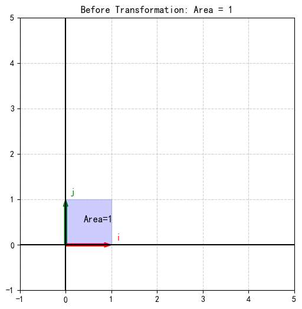
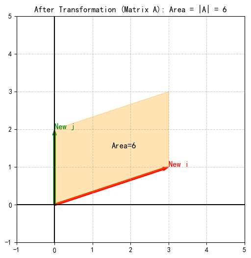
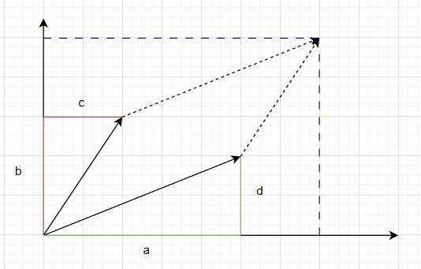
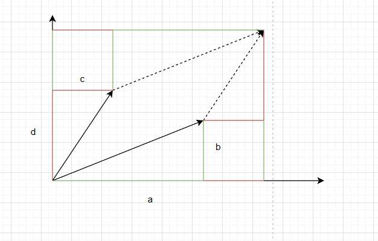
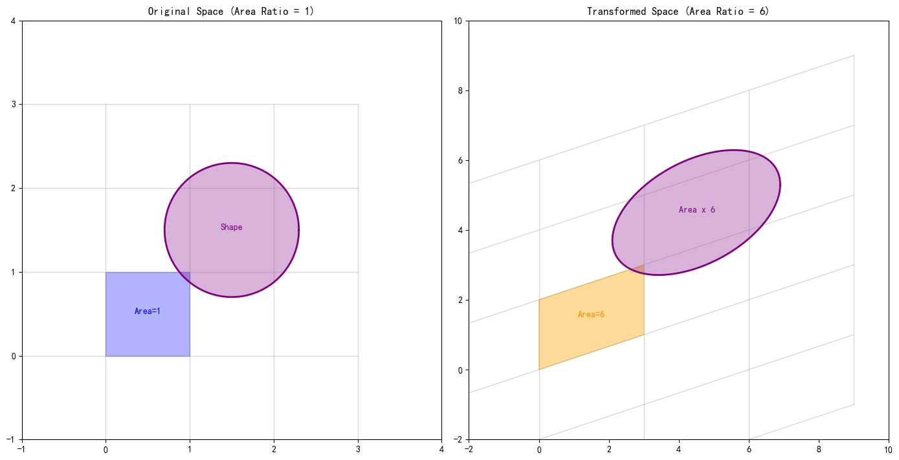
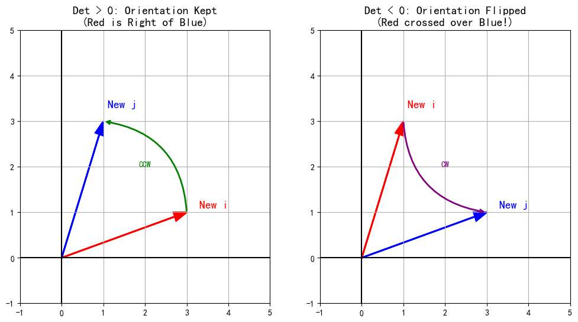
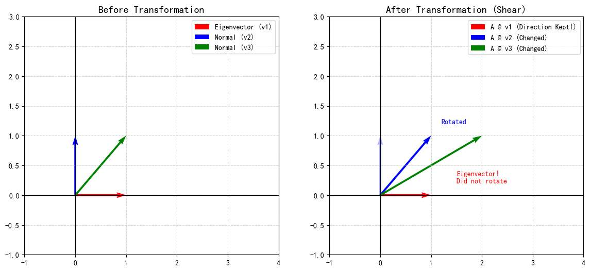
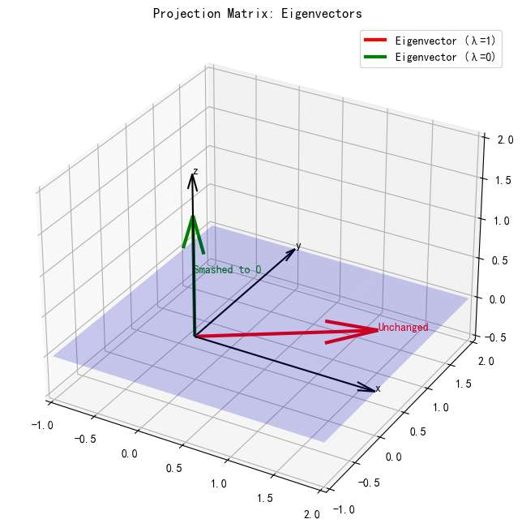

之前写的矩阵文章，主要还是把视角放在单独的某个向量来讨论的。

今天, 我们不再关注单个向量。
而是看矩阵对所有向量的作用，就能感受到矩阵对整个空间的作用。
这个对空间的作用有哪些特点？
- 空间的“体积”变换---行列式
- 空间变换后，不变的东西---特征值和特征向量
- 复杂的变换后，怎么轻松地理解？---相似对角化

我们一一进行探讨。

本文在探讨空间，所以大家应当知道，我们全篇都是“**列视角**”看待矩阵。（关于行列视角这里不带大家复习了，具体可见往期文章）

仍然，没有枯燥繁琐的数学公式，只需跟上文章的节奏，就能体验线性代数核心概念背后的直觉之美。
# 行列式 

行列式的英文名叫Determinant，它“Determine（决定）”了什么呢？

它决定了**线性变换对空间体积的“缩放倍率”**

### 1. 二维

让我们来看一个具体的矩阵例子：
$$ A = \begin{bmatrix} 3 & 0 \\ 1 & 2 \end{bmatrix} $$

*   原来的基向量是 $\hat{i} = [1, 0]^T$ 和 $\hat{j} = [0, 1]^T$。它们围成了一个**单位正方形**，面积是 $1 \times 1 = 1$。
*   矩阵 $A$ 作用向量时会意味：
    *   $\hat{i}$ 变成了新的基向量 $\text{New } \hat{i} = [3, 1]^T$。
    *   $\hat{j}$ 变成了新的基向量 $\text{New } \hat{j} = [0, 2]^T$。

现在，我们不再追踪某个向量（即某个点），而是追踪这个**单位正方形**。
在矩阵 $A$ 的作用下，这个正方形，变成了一个倾斜的**平行四边形**。

**它的面积是多少？**
如果看图，这属于一道小学数学题，平行四边形的面积为 $底×高=2×3=6$  

那好，我们换成未知数：
计算这个四边形的面积
假设矩阵是 $\begin{bmatrix} a & c \\ b & d \end{bmatrix}$，这意味着：
*   $\text{New } \hat{i} = (a, b)$
*   $\text{New } \hat{j} = (c, d)$

我们要算这两个向量围成的平行四边形面积。

我们可以把这个平行四边形包在一个大矩形里，大矩形的宽是 $a+c$，高是 $b+d$。
然后，减去周围多余的 4 个直角三角形和 2 个小矩形：

1.  **大矩形面积**：$(a+c)(b+d) = ab + ad + cb + cd$
2.  **减去 2 个绿色三角形**（对应向量 $\hat{i}$）：$2 \times (\frac{1}{2}ab) = ab$
3.  **减去 2 个红色三角形**（对应向量 $\hat{j}$）：$2 \times (\frac{1}{2}cd) = cd$
4.  **减去 2 个小矩形**：$2 \times (bc) = 2bc$

**最终面积 = 大矩形 - 红三角 - 绿三角 - 小矩形**
$$ \text{Area} = (ab + ad + cb + cd) - ab - cd - 2bc $$
$$ \text{Area} = ad + bc - 2bc $$
$$ \text{Area} = ad-bc$$

这意味着，矩阵 $A$ 把整个二维空间的面积**放大了 $ad-bc$ 倍**。

诶？真的是整个二维空间吗？ 我们只是把基向量围成的单位正方形放大了 6 倍，怎么敢说整个空间里随便画个东西，面积也放大 6 倍呢？

这就是 **线性** 代数中，**线性 (Linear)** 二字的魅力。

空间中任意一个向量 $v$，本质上都是基向量 $\hat{i}, \hat{j}$ 的线性组合：
$$ v = x \cdot \hat{i} + y \cdot \hat{j} $$

变换后，向量 $v$ 变成了 $v_{new}$，它依然保持着同样的组合关系，只是基向量换了：
$$ v_{new} = x \cdot (\text{New } \hat{i}) + y \cdot (\text{New } \hat{j}) $$

我们追踪的那个原始正方形，算是“单位网格”。

在原始坐标中，任何图案都可以视作单位网格组成的，
如果我们变换了单位网格为原来的$x$倍，  而图案占用的“格子数”并没变，图形的总面积，也势必放大$x$倍

### 2. 三维

升维到三维，道理完全一样。
来一个简单的，想象一个矩阵 $B$：
$$ B = \begin{bmatrix} 2 & 0 & 0 \\ 0 & 2 & 0 \\ 0 & 0 & 2 \end{bmatrix} $$
它把 $\hat{i}, \hat{j}, \hat{k}$ 全部拉长了 2 倍。
原来的**单位立方体**（体积 1），变成了一个边长为 2 的大立方体。
体积变为了 $2 \times 2 \times 2 = 8$。

仍然，行列式是追踪基向量围成图形（单元格子，当然在三维就是单元小方块）
变换后的体积。

其公式，我们不像二维一样推导了，确实复杂，但我们无论如何明白了行列式的意义。

**结论：行列式 $|A|$ 的绝对值，就是变换后体积相对于原体积的倍数。**

### 行列式为负

推导完面积，必须要讲讲**负数**。
行列式是 $ad-bc$。如果 $bc > ad$，结果就是负的。
**面积怎么可能是负的？**

这是一个非常深刻的问题。行列式的符号取决于基向量的**相对位置（顺序）**。

*   通常我们默认 $\hat{i}$ 在 $\hat{j}$ 的右边（逆时针 $0^\circ \to 90^\circ$）。这是正定向。
*   如果把 $\text{New } \hat{i}$ 画到了 $\text{New } \hat{j}$ 的左边（逆时针角度反而比 $\hat{j}$ 大），那就说明空间发生了翻转，行列式就是负的。

*   **正行列式**：保持右手定则。$\hat{i}$ 在 $\hat{j}$ 的右边（或顺时针/逆时针关系不变）。
*   **负行列式**：空间被**翻转**了。就像把一张纸翻了个面，$\hat{i}$ 和 $\hat{j}$ 的相对位置互换了。

### 行列式为 0

在之前的文章中，我们常常提到“降维打击”

*   比如把 3D 的盒子压扁成一张 2D 的纸。
*   或者把 2D 的纸压成一条 1D 的线。

如果一个 3D 的盒子被压扁成了一张纸，它的**体积**是多少？
**是 0！**

这正是行列式最直观的物理意义：
**如果矩阵变换导致了空间的维度降低，那么其行列式 $|A| = 0$。**

我们再看回行列式的计算：$|A| = \text{新体积} / \text{旧体积}$。
*   3D 压 2D，“高”变成 0 了，体积自然归零。
*   2D 压 1D，“宽”变成 0 了，面积自然归零。

所以，

以下五件事，说的其实是**同一回事**。只要其中一件发生，其他四件必然发生：

1.  **行列式为 0** ($|A| = 0$)：
    *   *几何视角*：体积被压成了 0。
2.  **矩阵秩亏** ($r < n$)：
    *   *空间视角*：维度发生了坍缩（降维）。
3.  **矩阵不可逆** ($A^{-1}$ 不存在)：
    *   *变换视角*：压扁的东西没法完美还原。
4.  **列向量线性相关**：
    *   *向量视角*：至少有一个列向量是“多余”的，它躺在其他向量张成的空间里（没撑开新维度）。
5.  **$Ax=0$ 有非零解**：
    *   *方程视角*：存在非零向量被压成了 0（存在非零的核空间）。

# 特征值与特征向量

行列式能展现空间变换的“体积变化”直觉，
如果说行列式告诉了我们空间“缩放”了多少，那么**特征值和特征向量**则揭示了空间变换的**方向性结构**。

一个矩阵 $A$ 对空间作用时，
网格被拉扯，图形被旋转，绝大多数向量在变换后，都会**改变方向** 

但是，在所有向量中，存在相对于当前矩阵来说，特殊的向量。
其在变换中**不旋转**，只进行**伸缩**。它就像是矩阵的主轴，指明了变换的主要方向。

这种向量就叫“**特征向量**”。

其伸缩的倍数，就是“**特征值**”（记为 $\lambda$）。
*   $\lambda > 1$：拉伸。
*   $0 < \lambda < 1$：压缩。
*   $\lambda < 0$：反向拉伸（翻转）。

显然，当矩阵 A 作用到自己的特征向量 x 时：
$$ A x = \lambda x $$
*   左边 ($Ax$)：矩阵作用的结果。
*   右边 ($\lambda x$)：仅仅是数值乘法（伸缩）。
矩阵的作用，退化成了简单的乘法。

让我们来看一个具体的例子：**剪切矩阵**。
$$ A = \begin{bmatrix} 1 & 1 \\ 0 & 1 \end{bmatrix} $$
大家用列视角脑部新基向量，可以知道
这个矩阵的作用是把空间向右上方“推”一下（保持 x 轴不动）。

1.  **绝大多数向量**（比如垂直的 $\hat{j}$）：都被推歪了，方向变了。
2.  **唯独 x 轴上的向量**（比如 $\hat{i}$）：变换后依然躺在 x 轴上，方向没变，长度也没变！
    *   这说明：$[1, 0]^T$ 是特征向量，特征值 $\lambda = 1$。
    *   它就是这个剪切变换中的“主轴”。

为了让大家更全面的理解特征向量，再来俩个例子

**例一：单位矩阵 (A=I)**
$I = \begin{bmatrix} 1 & 0 & 0 \\ 0 & 1 & 0 \\ 0 & 0 & 1 \end{bmatrix}$
*   单位矩阵 $I$ 什么都不做。
*   这就意味着，空间里**每一个向量**都没有改变方向（连长度都没变）。
*   那么所有非零向量都是特征向量！特征值全为 1。
此例旨在打破“特征向量只有有限个”的误区，有时候**所有方向**都是特征方向。

**例二：降维的投影矩阵**
*   想象一个灯光把所有向量投影到地板（$xy$ 平面）上。$P = \begin{bmatrix} 1 & 0 & 0 \\ 0 & 1 & 0 \\ 0 & 0 & 0 \end{bmatrix}$。
*   **地板上的向量**：投影后还是它自己。$\to$ 它是特征向量，$\lambda = 1$。
*   **垂直于地板的向量**（z 轴）：投影后变成了一个点（0 向量）。
    *   注意：$Pz = 0 = 0 \cdot z$。
    *   它也是特征向量！只不过特征值 $\lambda = 0$。
    同时我们也可以发现，若出现了**零特征值 $\iff$ 矩阵不可逆（降维）**。

此例旨在打破“特征值必须非零”的误区。

## 求解特征值
求解特征值，其实就是解一个**特殊的线性方程组**。
我们看公式：
$$ Ax = \lambda x $$
移项（注意要加 $I$）：
$$ (A - \lambda I)x = 0 $$

这变成了我们熟悉的 **齐次线性方程组**。

我们在上一章学过，要想这个方程有**非零解**（非零向量 $x$），矩阵 $(A - \lambda I)$ 必须是**秩亏**的！即它必须把空间压扁。

**五位一体**告诉我们，压扁意味着**行列式为 0**：
$$ |A - \lambda I| = 0 $$
 那我们的步骤就是
1.  **算行列式**：解 $|A - \lambda I| = 0$，算出 $\lambda$。（这一步是算多项式）。
2.  **解方程**：把算出的 $\lambda$ 代回 $(A - \lambda I)x = 0$。
3.  **找核空间**：上一章的“找自由变量、找通解”，这里就是找特征向量！

**求解特征向量，本质上就是找 $(A-\lambda I)$ 这个新矩阵的零空间！**
完全是之前知识的复用。

# 相似对角化

在搞懂了特征值和特征向量之后，我们终于可以试图攻克线性代数非常复杂的概念——**相似对角化**。

这听起来是个又长又拗口的数学名词，但它的本质，其实是为了解决一个极其朴素的“问题”**。

不要害怕，我们一起建立直觉！

### 1. 产生对角矩阵的动机

假设我们有一个矩阵 $A$，我们需要计算它的 100 次方 $A^{100}$。
这在工程、物理、计算机图形学中非常常见（比如模拟一个系统经过 100 秒后的状态）。

如果直接算：
$$ A^{100} = \underbrace{A \cdot A \cdot \dots \cdot A}_{100 \text{次}} $$
计算量是爆炸的，而且每次乘法都会让数字纠缠得越来越乱。

但如果，我是说如果，这个矩阵是一个**对角矩阵 (我们常用符号 $\Lambda$ 表示)** 呢？
$$ \Lambda = \begin{bmatrix} 2 & 0 \\ 0 & 3 \end{bmatrix} $$
那 $\Lambda^{100}$ 简直是送分题：（用列视角或行视角计算都很简单）
$$ \Lambda^{100} = \begin{bmatrix} 2^{100} & 0 \\ 0 & 3^{100} \end{bmatrix} $$
我们只需要对对角线上的数字分别求幂，其他的 0 根本不用管。

这时候，一个自然的想法诞生了：
**能不能把那个复杂的矩阵 $A$，变成这个简单的对角矩阵 $\Lambda$ 呢？**

### 2. 什么是“相似”？

想要解决 1 的问题，先要明白线性代数中最抽象、但也最深刻的概念：**相似**。

在教科书上的定义是这样的：
> 如果存在可逆矩阵 $P$，使得 $P^{-1}AP = B$，则称 $A$ 与 $B$ 相似。

这个公式 $P^{-1}AP$ 到底在干什么？为什么夹在中间就叫“相似”？

**相似矩阵，本质上是同一个线性变换，在不同坐标系下的描述。**

*   **$A$**：是在我们熟悉的**标准坐标系**（$\hat{i}, \hat{j}$）下描述的变换。在这里，变换可能很复杂，既有拉伸又有旋转，很难算。
*   **$B$ (或 $\Lambda$)**：是在一个新的**自定义坐标系**下描述的**同一个变换**。

那个矩阵 **$P$**，就是连接这两个世界的“翻译官”**（基底变换矩阵）。

仍然是列视角，
我们知道矩阵的存在是等待作用向量的，

矩阵 B，就是把向量变换到新坐标系里，因为引来了新的基向量。

 $P^{-1}AP$ 这个矩阵，作用在 $x$ 这个向量。
作用是从右到左依次作用。
我们看看他们会怎么影响向量，

让我们拆解 $P^{-1}AP$ 的动作链条：
1.  **$P$ (Translate)**：把“新坐标系”里的向量，翻译成“标准坐标系”的语言。
2.  **$A$ (Transform)**：在“标准坐标系”里，用矩阵 $A$ 进行变换（拉伸/旋转）。
3.  **$P^{-1}$ (Translate Back)**：把变换后的结果，再翻译回“新坐标系”。

如果在“新坐标系”里看，这个变换的效果等价于矩阵 $B$。
虽然 $A$ 和 $B$ 长得不像（数字不同），但它们代表同一个变换，所以我们称之为“**相似**”。

### 3. 一个具体的“翻译”过程
刚才一定还是有点懵，
让我们看一个具体的例子。

假设有一个矩阵：
$$ A = \begin{bmatrix} 2 & 1 \\ 0 & 3 \end{bmatrix} $$
在标准坐标系（$\hat{i}, \hat{j}$）下，它把 $\hat{i}$ 拉长 2 倍，把 $\hat{j}$ 拉长 3 倍并向上推 1 格。这看起来有点扭曲，并不纯粹。

（举一个例子，画图展示）

现在，我们想找一个新的视角（坐标系），让这个变换变得简单、纯粹。
**选谁做新坐标系的基底呢？**

答案是：**特征向量！**  （为什么？）
通过计算（计算过程略），我们找到 $A$ 的两个特征向量：
*   $v_1 = [1, 0]^T$ （对应特征值 $\lambda_1 = 2$）
*   $v_2 = [1, 1]^T$ （对应特征值 $\lambda_2 = 3$）

我们将这两个特征向量作为**新的基底**。
于是，翻译矩阵 $P$ 就是把这两个基底拼起来：
$$ P = [v_1, v_2] = \begin{bmatrix} 1 & 1 \\ 0 & 1 \end{bmatrix} $$

**见证奇迹的时刻：**
如果我们计算 $P^{-1}AP$，会发生什么？

（一步一步来，每一步都应有对应的图）

$$ P^{-1} A P = \begin{bmatrix} 1 & -1 \\ 0 & 1 \end{bmatrix} \begin{bmatrix} 2 & 1 \\ 0 & 3 \end{bmatrix} \begin{bmatrix} 1 & 1 \\ 0 & 1 \end{bmatrix} = \begin{bmatrix} \mathbf{2} & 0 \\ 0 & \mathbf{3} \end{bmatrix} = \Lambda $$

看！矩阵变成了对角阵 $\Lambda$。
在以 $v_1, v_2$ 为轴的“特征世界”里，这个变换变得无比纯粹：
*   沿着 $v_1$ 方向，单纯拉伸 **2** 倍。
*   沿着 $v_2$ 方向，单纯拉伸 **3** 倍。
*   没有任何旋转或剪切的干扰。

这，就是相似变换的魔力。我们找到了隐藏在复杂 $A$ 表面下的那个简单的灵魂 $\Lambda$。

