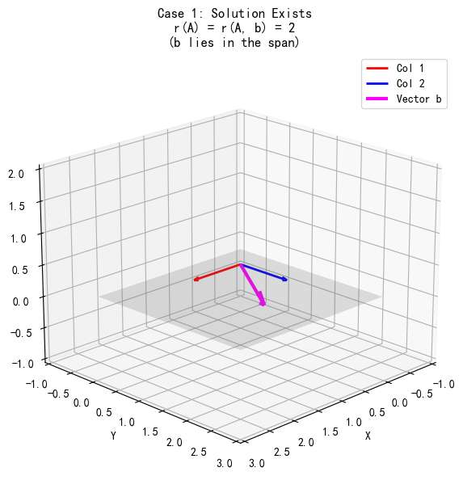
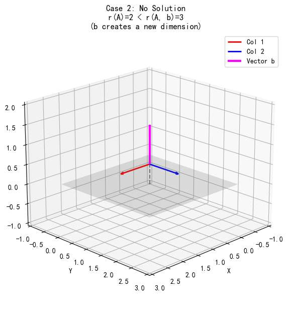

## **文章二标题：《破解方程：高斯消元与解的几何结构》**

上一篇线性代数文章，我们搞懂了“列视角”与“行视角”看矩阵。
也用这俩个视角，描述了 
 $Ax=0$的情况。
那么本篇文章，我们来攻克 
 $$Ax=b$$
 

 **什么意思？**
*   **已知：** 矩阵 $A$（一个作用别人的机器），目标 $b$（已知的产出）。
*   **求解：** 输入 $x$（未知的向量）。
*(注：在本章中，为了直观，我们默认 $x$，$b$  都是一个列向量。)*

 
 其实就是解方程，但我们拒绝任何枯燥的应试方法，而是赋予“解方程”这个过程，有趣的直觉

# 解的存在性
现在，我们使用“列视角”看待矩阵。

回顾一下，$A$ 的列向量，是“新基向量”。

矩阵与向量相乘 $Ax$，本质上是在对 $A$ 的**列向量**进行**线性组合**。
$$ x_1 \cdot \text{Col}_1 + x_2 \cdot \text{Col}_2 + \dots = b $$

$A$ 的列向量张成了一个空间，我们称之为 **“列空间”**

如果 我们发现$b$ 恰好落在这个空间里，方程就**有解**。

这句话很好理解吧，因为$b$，一定是$A$的列向量们组合而成的。 

而如果 $b$ 指向了空间之外（比如列空间是一个平面，而 $b$ 指向了三维世界的其他方向，如天空），方程就**无解**。

显然，因为无论如何，都找不到$x$ 能让A作用后，被线性组合成维度之外的向量。

## 秩的应用

显然，$b$ 是否落在 $A$ 的列空间，是我们判断方程是否有解的关键。

那到底怎么判断其是否在呢？

我们需要一个数学工具来量化。这个工具就是 **秩 (Rank)**。

$A$ 的列向量张成的空间维度，就是 $A$ 的秩，记作 $r(A)$。
*   比如，$r(A)=2$，说明$A$ 的列向量张成的空间是一个二维平面。

为了测试目标 $b$ 是否到底是不是A的空间，我们把 $b$ 拼接到 $A$ ，组成一个新的矩阵 $[A | b]$，这叫**增广矩阵**。

然后，我们计算这个新矩阵的秩 $r(A, b)$。

 **情况一：维度保持不变**
$$ r(A, b) = r(A) $$
增广矩阵列向量张成的空间维度**没有增加**， 这说明 $b$ 并没有带来新的方向。它**原本就躺在** $A$ 的列向量张成的空间里！

**结论：** **方程有解。**
    *(注意：这里只保证有解，至于是只有 1 个解还是有无数个解，要看 $A$ 内部是否有冗余，这是后面“解的结构”要讨论的。)*

**情况 二：维度增加了**
$$ r(A, b) > r(A) $$
*(其实是 $r(A)+1$，因为加入一个向量最多增加一个维度)*

加入 $b$ 之后，空间被“撑大”了。比如原来是二维平面，加入 $b$ 后变成了三维空间。 这说明 $b$ 指向了一个 $A$ 的列向量们**绝对无法组合而成**的新维度。
**结论：** **方程无解。**

你可能会问：*“有没有可能 $r(A, b) < r(A)$ 呢？”*
**当然不可能。**
给A矩阵多加一个b向量，维度不可能变少。
增加向量只会维持或扩大张成的空间，绝不会让空间缩水。

**综上所述，线性方程组解的存在性判别，只需要比较增广矩阵的秩和作用在未知量x矩阵的秩**
- $r(A, b) = r(A)$ 有解
- $r(A, b) < r(A)$ 无解

# 如何解？

刚才，我们利用 **列视角** 和 **秩**，已经完成了最关键的一步：**确认解的存在性**。

只要 $r(A) = r(A, b)$，我们就确信：$b$ 躺在$A$张成的空间，即 $b$ 一定是由 $A$ 的列向量组合而成的。也就是说，确实存在一组系数 $x_1, x_2...$ 能让列向量组合出 $b$。

$$ x_1 \cdot \text{Col}_1 + x_2 \cdot \text{Col}_2 + \dots = b $$

**但是，具体是哪种组合？** $x_1$ 是多少？$x_2$ 是多少？

靠眼睛看列向量是看不出来的

这个工具就是：**高斯消元法 (Gaussian Elimination)**。

## 高斯消元法

我们之前提到了 **增广矩阵 $[A | b]$**。

在判断存在性时，我们用它来算秩。

在解方程时，它依然是主角。

$$ [A | b] = \left[ \begin{array}{c|c} \text{Row}_1 & b_1 \\ \text{Row}_2 & b_2 \\ \vdots & \vdots \end{array} \right] $$

**为什么要带着 $b$ 一起？**
因为 $Ax=b$ 是一个整体。
当我们对 $A$ 的行进行操作（比如“第一行减去第二行”）时，为了保持等式成立，等号右边的 $b$ 必须**同步**进行相同的操作。
增广矩阵把它们捆绑在一起，确保我们不会顾此失彼。

我们的目标是什么？
我们要通过行变换，把复杂的矩阵 $A$，变成一个**行最简形矩阵 (RREF)**。

**直觉对比：**

*   **变换前（复杂的 $A$）：**
    每一行都充满了数字。这意味着每一个方程都牵扯了大量的未知数 $x_1, x_2, \dots$。
    *   *例如：* $2x_1 + 3x_2 - 5x_3 = 7$ （三个变量纠缠在一起，看不出谁是谁）。

*   **变换后（行最简形）：**
    我们要把它变成类似单位矩阵的样子（$1$ 和 $0$）。
    *   *例如：* $1x_1 + 0 + 0 = 2$。
    *   **瞬间清晰！** 这告诉我们 $x_1 = 2$。

**所以，解方程的过程，就是利用“行变换”这个手术刀，切断变量之间复杂的纠缠关系（把系数变成0），最后让每一个非零行的“主元”，直接对应一个变量的解。**

### **第二章：高斯消元 —— 戴着镣铐跳舞 (The Algorithm)**
*这里引入行视角和初等变换，解释“怎么算”。*

*   **困惑：** 为什么我们可以随便把行加来加去？这难道不会改变矩阵的“列空间”（射程）吗？
*   **直觉解释（行视角）：**
    *   **初等行变换 = 左乘可逆矩阵 $P$**。
    *   我们在对“方程组”进行整形，或者说在对“坐标系”进行扭曲。
    *   **核心性质（考点）：** $r(PA) = r(A)$。
    *   **直觉：** $P$ 是可逆的（满秩的），它只是把空间揉捏、旋转、拉伸了，但**没有压扁**空间。既然没压扁，维度的“压缩率”（秩）就不会变。
*   **结论：** 高斯消元虽然把矩阵的面目全非了（列空间变了），但它**保留了最核心的两个东西**：
    1.  **秩不变**（空间的维数没变）。
    2.  **解不变**（行向量张成的空间没变/约束条件等价）。

---

### **第三章：解的结构 —— 平行世界的替身 (The Structure)**
*这是考研大题的得分点：通解 = 特解 + 齐次解。*

*   **问题：** 如果有解，解是什么样子的？
*   **几何直觉：**
    *   还记得上一篇的 $Ax=0$ 吗？那是**经过原点的核空间**（比如一条过原点的直线）。
    *   $Ax=b$ 的解，其实就是把那个“核空间”**平移**了一下，让它穿过特解 $x_p$。
*   **公式翻译：**
    $$ x = \underbrace{x_p}_{\text{特解(定位)}} + \underbrace{k \cdot \xi}_{\text{核(形状)}} $$
*   **画面感：** 特解是把你带到目的地的“班车”，核空间是你到达目的地后可以自由活动的“范围”。

---

### **第四章：秩的性质 —— 维度的瓶颈 (Rank Properties)**
*在这里集中收束“应试性质”，因为有了前面的铺垫，现在讲就不枯燥了。*

*   我们已经理解了 $r(A)$ 是“有效维度”。现在看几个高频考点：
1.  **$r(AB) \le \min(r(A), r(B))$**
    *   **直觉：** 你有一个管道系统。$B$ 是进水管，$A$ 是出水管。整个系统的流量（秩），不可能超过进水管的最大流量，也不可能超过出水管的最大流量。**瓶颈效应。**
2.  **$r(A+B) \le r(A) + r(B)$**
    *   **直觉：** 两个空间拼在一起，总维度最多是它们各自维度的和（如果它们完全不重叠）。如果重叠了，维度会更小。
3.  **$r(A^T) = r(A)$**
    *   **直觉：** 回顾上一篇，行空间维度 = 列空间维度。信息的“输入口径”和“输出口径”是匹配的。
