# 素材

只有n乘n的矩阵 才能化简为行阶梯型？
哪些行阶梯型矩阵能体现inconsistent  linear systems.？当且仅当最后一列（即增广列）是主元列。
主元的定义，不知道有更深刻意味没有  使用的是“pivot”一词？

当不是方阵的矩阵化简为行阶梯型 比如2×3矩阵   此时就产生了 自由变量。
定义考虑一个关于变量 x1,x2,...,xn. 的一致方程组。设 A 为该系统增广矩阵的行阶梯形。如果 xi 对应的列在 A 中不是主元列，则称 xi 为自由变量。
再比如2乘4矩阵 自由变量能有多种组合吧？比如第三个和第四个 第二个和第四个 第一个..... 不能有第一个？

三种可能的简化行阶梯形情况
- 最后一列是主元列。解集为空，即没有解
- 除最后一列外，每一列都是主列。在这种情况下，系统有唯一解
- 最后一列不是主元列，其他某一列也不是主元列。在这种情况下，系统有无穷多解，对应于自由变量的无穷多可能取值

我觉得开启文章之前应该回顾一下行视角与列视角
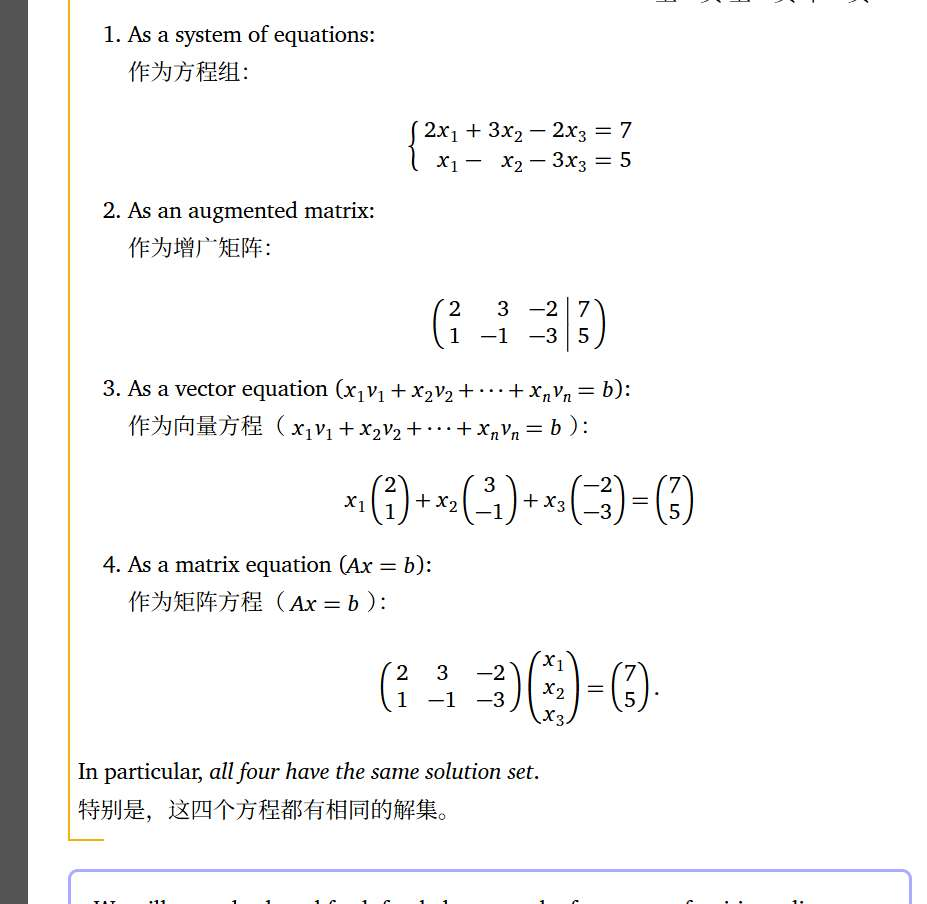

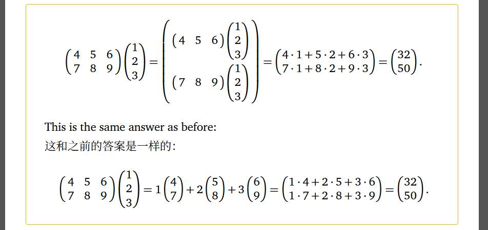

等等，这怎么建立起来的，我没get到逻辑链条
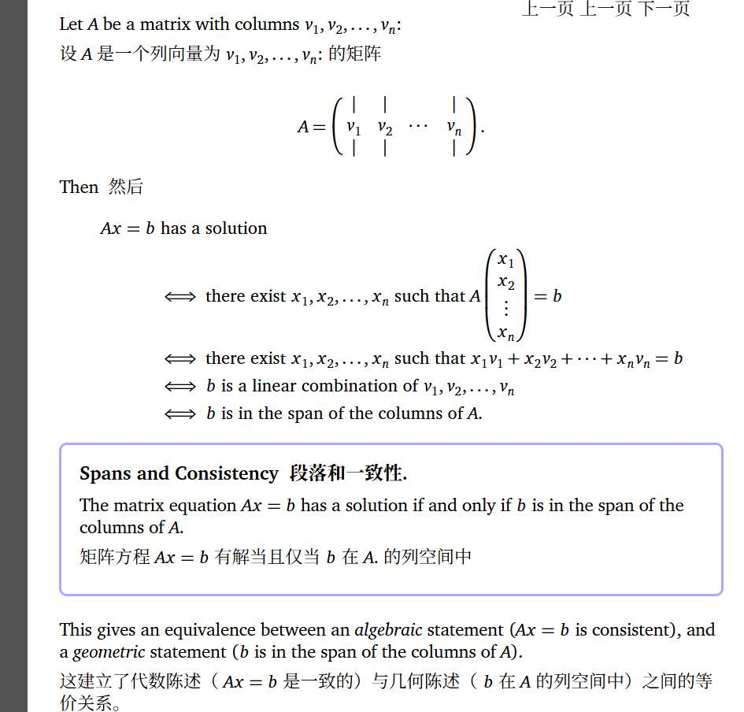

完全可以证明？.... 怎么证的
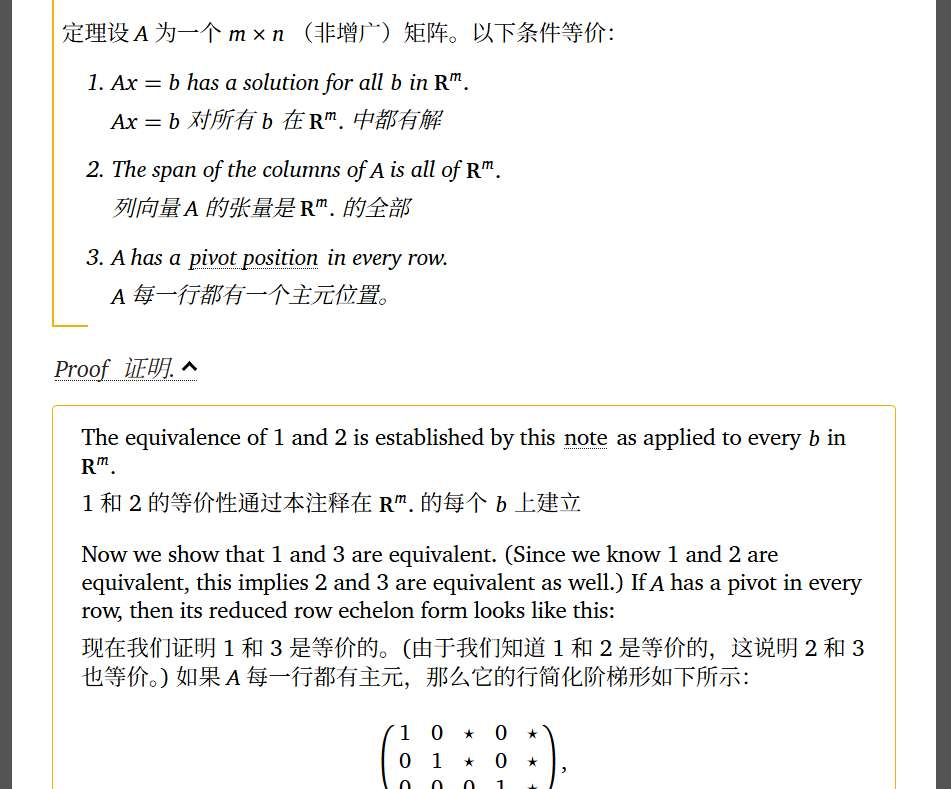

“我们将在第 2.7 节的这个推论中看到，列空间的维数等于 A. 的主元个数。也就是说，如果 A 有一个主元，那么 A 的列张成一个直线；如果有两个主元，张成一个平面，依此类推。整个空间 Rm 的维数是 m, ，因此这推广了当 A 有 m 个主元时， A 的列张成 Rm 的事实”

非齐次解等于齐次解加特解.... 这里也要好好解释

还有线性无关
假设 A 的列数多于行数。那么 A 不可能在每一列都有主元（每行最多有一个主元），因此其列自动线性相关。
矩阵中的哪些列是冗余的，即哪些列可以删除而不会影响列空间。
“必须对 A 进行行简化以确定其主元列。然而，行简化矩阵的列的张成空间通常不等于 A: 的列的张成空间，因此必须使用原始矩阵的主元列” 这个还蛮难解释吧

子空间，以及子空间的基与维数... 可以放一放吧  以后和列空间、零空间一块整理？或者放到应试专题。
应试专题是未来写一篇文章，专门写各种应试的公式、性质，用行或列视角去理解，比如逆矩阵 行列式 代数余子式等？
# **文章二标题：《破解方程：高斯消元与解的几何结构》**

上一篇线性代数文章，我们搞懂了“列视角”与“行视角”看矩阵。

让我们简单复习一下

当$\begin{pmatrix} 4 & 5 & 6 \\ 7 & 8 & 9 \end{pmatrix}$ 矩阵，作用于$\begin{pmatrix} 1 \\ 2 \\ 3 \end{pmatrix}$向量时：

$$ \begin{pmatrix} 4 & 5 & 6 \\ 7 & 8 & 9 \end{pmatrix} \begin{pmatrix} 1 \\ 2 \\ 3 \end{pmatrix} = \begin{pmatrix} 32 \\ 50 \end{pmatrix} $$
#### **行视角：**
 $[4, 5, 6]$ 是一个配方，说：它要提取向量$\begin{pmatrix} x1 \\ x2 \\ x3 \end{pmatrix}$ 中x1的4倍，x2的5倍，x3的6倍，然后相加。

第二行同理。

我们一般用“点积”描述：

*   第一行 $[4, 5, 6]$ 与向量 $[1, 2, 3]$ 做点积：$4\cdot1 + 5\cdot2 + 6\cdot3 = 32$。
*   第二行 $[7, 8, 9]$ 与向量 $[1, 2, 3]$ 做点积：$7\cdot1 + 8\cdot2 + 9\cdot3 = 50$。

在行视角中，矩阵是在做**信息的加权求和**。每一行都是一个**配方**，计算出了结果的一个分量。

#### **列视角：**
向量$\begin{pmatrix} x \\ y \\ z \end{pmatrix}$ 是在三维世界的，其基向量$\hat{i} ,\hat{j} ,\hat{k}$ 分别为$\begin{pmatrix} 1 \\ 0 \\ 0 \end{pmatrix},\begin{pmatrix} 0 \\ 1 \\ 0 \end{pmatrix},\begin{pmatrix} 0 \\ 0 \\ 1 \end{pmatrix}$ 

然而经过矩阵变换，$\begin{pmatrix} 4 \\ 7 \end{pmatrix}$ 变成了$\text{New } \hat{i}$ 
其余同理，

那么我们的向量也跟随基向量的改变而改变：
$$x \cdot (\text{New } \hat{i}) + y \cdot (\text{New } \hat{j})+z\cdot(\text{New }\hat{k})=\text{Output}$$

$$ 1 \cdot \begin{pmatrix} 4 \\ 7 \end{pmatrix} + 2 \cdot \begin{pmatrix} 5 \\ 8 \end{pmatrix} + 3 \cdot \begin{pmatrix} 6 \\ 9 \end{pmatrix} = \begin{pmatrix} 32 \\ 50 \end{pmatrix} $$

结果向量 $\begin{pmatrix} 32 \\ 50 \end{pmatrix}$ 其实是矩阵三列向量的**线性组合**。

上面的例子里，我们已知 $x=[1,2,3]^T$，算出 $b=[32,50]^T$ 是轻而易举的。

但我们通常面临的局面是：

 $$Ax=b$$

 **什么意思？**
*   **已知：** 矩阵 $A$（一个作用别人的机器），目标 $b$（已知的产出）。
*   **求解：** 输入 $x$（未知的向量）。
*(注：在本章中，为了直观，我们默认 $x$，$b$  都是一个列向量。)*

 
 其实就是**解方程**，但我们拒绝任何枯燥的应试方法，而是赋予“解方程”这个过程，有趣的直觉。

# 解的存在性
现在，我们使用“列视角”看待矩阵。

回顾一下，$A$ 的列向量，是“新基向量”。

矩阵与向量相乘 $Ax$，本质上是在对 $A$ 的**列向量**进行**线性组合**。
$$ x_1 \cdot \text{Col}_1 + x_2 \cdot \text{Col}_2 + \dots = b $$

$A$ 的列向量张成了一个空间，我们称之为 **“列空间”**

如果 我们发现$b$ 恰好落在这个空间里，方程就**有解**。

这句话很好理解吧，因为$b$，一定是$A$的列向量们组合而成的。 

而如果 $b$ 指向了空间之外（比如列空间是一个平面，而 $b$ 指向了三维世界的其他方向，如天空），方程就**无解**。

显然，因为无论如何，都找不到$x$ 能让A作用后，被线性组合成维度之外的向量。

## 秩的应用

显然，$b$ 是否落在 $A$ 的列空间，是我们判断方程是否有解的关键。

那到底怎么判断其是否在呢？

我们需要一个数学工具来量化。这个工具就是 **秩 (Rank)**。

$A$ 的列向量张成的空间维度，就是 $A$ 的秩，记作 $r(A)$。
*   比如，$r(A)=2$，说明$A$ 的列向量张成的空间是一个二维平面。

为了测试目标 $b$ 是否到底是不是A的空间，我们把 $b$ 拼接到 $A$ ，组成一个新的矩阵 $[A | b]$，这叫**增广矩阵**。

然后，我们计算这个新矩阵的秩 $r(A, b)$。

 **情况一：维度保持不变**
$$ r(A, b) = r(A) $$
增广矩阵列向量张成的空间维度**没有增加**， 这说明 $b$ 并没有带来新的方向。它**原本就躺在** $A$ 的列向量张成的空间里！

**结论：** **方程有解。**
    *(注意：这里只保证有解，至于是只有 1 个解还是有无数个解，要看 $A$ 内部是否有冗余，这是后面“解的结构”要讨论的。)*

**情况 二：维度增加了**
$$ r(A, b) > r(A) $$
*(其实是 $r(A)+1$，因为加入一个向量最多增加一个维度)*

加入 $b$ 之后，空间被“撑大”了。比如原来是二维平面，加入 $b$ 后变成了三维空间。 这说明 $b$ 指向了一个 $A$ 的列向量们**绝对无法组合而成**的新维度。
**结论：** **方程无解。**

你可能会问：*“有没有可能 $r(A, b) < r(A)$ 呢？”*

**当然不可能。**
给A矩阵多加一个b向量，维度不可能变少。
增加向量只会维持或扩大张成的空间，绝不会让空间缩水。

**综上所述，线性方程组解的存在性判别，只需要比较增广矩阵的秩和作用在未知量x矩阵的秩**
- $r(A, b) = r(A)$ 有解
- $r(A, b) < r(A)$ 无解

# 如何解？

刚才，我们利用 **列视角** 和 **秩**，已经完成了最关键的一步：**确认解的存在性**。

只要 $r(A) = r(A, b)$，我们就确信：$b$ 躺在$A$张成的空间，即 $b$ 一定是由 $A$ 的列向量组合而成的。也就是说，确实存在一组系数 $x_1, x_2...$ 能让列向量组合出 $b$。

$$ x_1 \cdot \text{Col}_1 + x_2 \cdot \text{Col}_2 + \dots = b $$

**但是，具体是哪种组合？** $x_1$ 是多少？$x_2$ 是多少？

靠眼睛看列向量是看不出来的

我们引入一个新的工具来解决”x是什么“

这个工具就是：**高斯消元法 (Gaussian Elimination)**。

## 高斯消元法

接下来我们切换到行视角， 

即，矩阵 $A$ 的每一行为一个**提取配方**

方程组 $Ax=b$ 本质上就是一份清单：
$$
\begin{cases}
\vec{r_1} \cdot x = b_1 \quad (\text{配方 1 的结果}) \\
\vec{r_2} \cdot x = b_2 \quad (\text{配方 2 的结果}) \\
\vdots
\end{cases}
$$

我们以这个方程为例子 

$$\underbrace{\begin{bmatrix}1 & 2 & 3 \\2 & -3 & 2 \\3 & 1 & -1\end{bmatrix}}_{A}\cdot\underbrace{\begin{bmatrix}x_1 \\x_2 \\x_3\end{bmatrix}}_{x}=\underbrace{\begin{bmatrix}6 \\14 \\-2\end{bmatrix}}_{b}$$

我们现在的任务是解出 $x$。

### **交换的影响**

思考一下，如果我们把这个矩阵的行（Row）交换一下，比如把第一行和第二行对调，会对解 $x$ 产生影响吗？

*   **原来的说法：** “配方1的结果是6，配方2的结果是14。”
*   **交换后的说法：** “配方2的结果是14，配方1的结果是6。”

$$\underbrace{\begin{bmatrix}2 & -3 & 2 \\1 & 2 & 3 \\3 & 1 & -1\end{bmatrix}}_{A}\cdot\underbrace{\begin{bmatrix}x_1 \\x_2 \\x_3\end{bmatrix}}_{x}=\underbrace{\begin{bmatrix}14 \\6\\-2\end{bmatrix}}_{b}$$

我们只交换了方程的**陈述顺序**，行变换是安全的，它不会破坏未知数 $x$ 的结构。    $x$ 该是什么，还是什么。

为了防止我们在操作“配方”时，忘了对应的“结果”$b$，我们使用老朋友 **增广矩阵 $[A | b]$**。它把天平的左边（系数）和右边（常数）打包在了一起。

在本例中，增广矩阵即为：

$$
[A | b] = 
\left[
\begin{array}{ccc|c}
1 & 2 & 3 & 6 \\
2 & -3 & 2 & 14 \\
3 & 1 & -1 & -2
\end{array}
\right]
$$

接下来，我们继续对这个“配方”清单进行一些变换，看有什么影响。

### **倍乘的影响**
以第一行为例 

如果整体乘2倍  其结果替换第一行
就从$[1,2,3]\cdot x = 6$ 变为了 $[2,4,6]\cdot x = 12$ 
这俩个方程，$x$有变化吗？

完全没有
这俩个式子蕴含的信息，一模一样

### **倍加的影响**
我们再考察一种操作
**将第 1 行的 $k$ 倍加到第 2 行**  其结果替换第二行

我们又创造了个新配方
 $$ (\vec{r_2} + k\vec{r_1}) \cdot x = \vec{r_2} \cdot x + k(\vec{r_1} \cdot x) =b_2 + k b_1 $$在本例中为，假设k为2
操作为：**$R_2 \leftarrow R_2 + (-2)R_1$**。

计算过程如下：
$$
\begin{aligned}
\text{新 } R_2 &= [2, -3, 2] + (-2) \cdot [1, 2, 3] \\
&= [2-2, -3-4, 2-6] \\
&= [0, -7, -4]
\end{aligned}
$$

同时右边的 $b$ 也要变：
$$ 14 + (-2) \cdot 6 = 2 $$

所以新配方是：
$$ [0, -7, -4] \cdot x = 2 $$

**这个新配方中 $x$ 的解，和原来的 $[2,-3,2] \cdot x = 14$ 有区别吗？**
**仍然没有！**

看似长得完全不一样，实则我们稍微逆向还原一下，就发现这个式子是
$$[2, -3, 2]\cdot x + (-2) \cdot [1, 2, 3]\cdot x = 14+(-2)\cdot6 $$

我们只是在已有配方的基础上，加了另一个已知配方，所以我们没有增加新信息，也没有减少信息！

综上三种变换，我们都没有改变x的解，其实这三种操作本质上都是“线性组合”的特例，也叫“初等行变换”

1.  **倍加**（$r_j + kr_i$）：组合已有配方
2.  **倍乘**（$kr_i$）：调整配方的比例（例如放大2倍），信息本质不变。
3.  **交换**（$r_i \leftrightarrow r_j$）：调整事实陈述的顺序，不改变事实本身。

### 几何视角：旋转平面，锁死交点

如果配方的行视角还不够直观

我们也可以引入几何视角，辅助对初等行变换操作的理解。

仍然借助本例，再次看这个式子，
$[1,2,3]\cdot x = 6$  即
$$ 1x_1 + 2x_2 + 3x_3 = 6 $$

我们不说什么点积或配方了 如果以几何视角来看，这不就是三维空间中一个平面嘛！

整个方程组，就是三个平面。

**我们要求的解 $x$（坐标 $x_1, x_2, x_3$），其实就是这三个平面的“公共交点”！**

如此 我们再来看倍加、倍乘、交换这三个操作。
*   **交换：** 调整方程顺序而已，交点显然不动。
*   **倍乘：** 平面还是那个平面，根本没有改变平面方程的样子，交点也不变
*   **倍加 ($R_2 + kR_1$)：** 这是要详细想象的部分

让我们看难以理解的倍加。

当我们把平面 1 （即使是k倍那也算平面1）加到平面 2 上时，我们创造了一个**新平面**。

这个新平面**它必然经过前两个平面的“交线”！**

很简单的高中学过的证明：

设点 $P$ 是平面 1 和平面 2 的交点。
*   $P$ 满足方程 1 ($Eq_1$)。
*   $P$ 满足方程 2 ($Eq_2$)。
*   那么把 $P$ 代入新方程 ($Eq_2 + k \cdot Eq_1$)，结果必然成立

所以高斯消元中的“倍加”操作，本质上是在**旋转平面**。
我们固定住平面 1，让平面 2 绕着它与平面 1 的交线旋转
**无论怎么转，因为旋转轴（交线）没动，所以那个交线的某个交点（解），也一定固定在那**

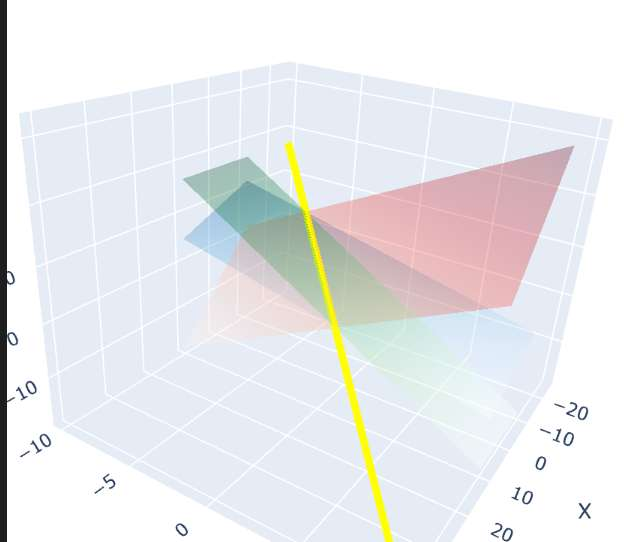

如图  **蓝平面**和**红平面**是原始平面   **绿平面**是经过“倍加操作”后的新平面。 **黄线**是它们的交线
想象红平面绕着黄线旋转到了一个新的角度--绿平面。解（交线上的点）没有丢失

## 行阶梯型的诞生

既然初等行变换是“保真”的（不改变解），那我们可以肆无忌惮修改矩阵！

修改矩阵为了什么？是为了**把变量之间复杂的纠缠，变成简单的独立。**

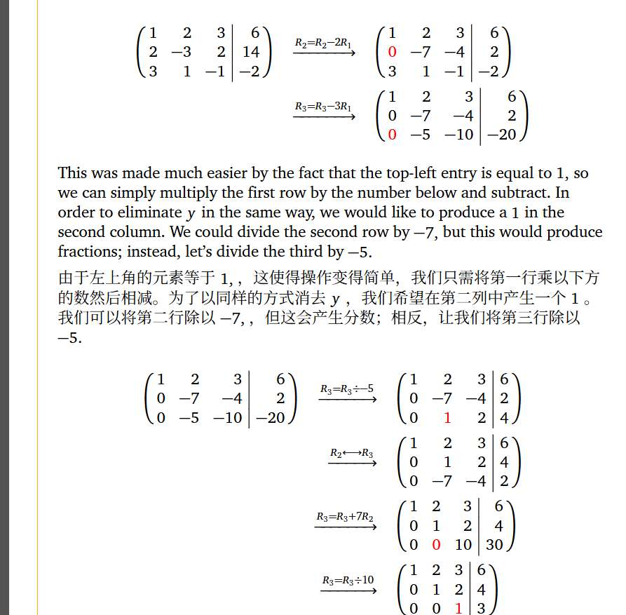

如图所示，经过一顿操作，我们将矩阵变成了一个**上三角形状**：
$$
\begin{bmatrix}
\mathbf{1} & 2 & 3 \\
0 & \mathbf{1} & 2 \\
0 & 0 & \mathbf{1}
\end{bmatrix}
\cdot x =
\begin{bmatrix}
6 \\
4 \\
3
\end{bmatrix}
$$

#### **行视角：简化**

**化简后的配方，我们倒着看：**
*   **第 3 行：** $0x_1 + 0x_2 + 1x_3 = 3$ $\Rightarrow$ **$x_3 = 3$**。
    *  我们提取出了**纯净的** $x_3$！没有任何干扰。
*   **第 2 行：** $0x_1 + 1x_2 + 2x_3 = 4$。
    *   这里只混入了 $x_3$。既然 $x_3$ 已经是已知的，那 $x_2$ 也就唾手可得。
*   **第 1 行：** $x_1$ 混入了 $x_2, x_3$。同理，既然后面两个都解开了， $x_1$ 也就解开了。

化成“阶梯形”的本质，就是简化配方。
我们通过消元，制造了大量的 0。让配方精简，
最终我们倒着看，很容易把x解出来。

#### **几何视角：旋转到最合适的位置**

在几何上，每个方程是一个平面。

最初的三个平面乱七八糟地斜着相交，很难看出交点在哪。

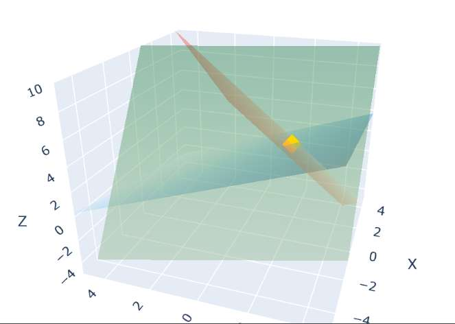

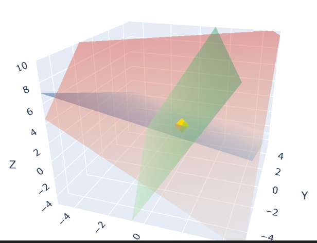

我给大家展示了俩个角度 可以看到 真的... 很凌乱

**消元后的三个平面长什么样？**
1.  **第 3 个方程 ($x_3=3$)：** 这是一个**水平面**，平行于 $x_1-x_2$ 平面，高度为 3。
2.  **第 2 个方程 ($x_2+2x_3=4$)：** 这是一个**立着的平面**，它只和 $x_2, x_3$ 有关，平行于 $x_1$ 轴。
3.  **第 1 个方程：** 还是斜的。

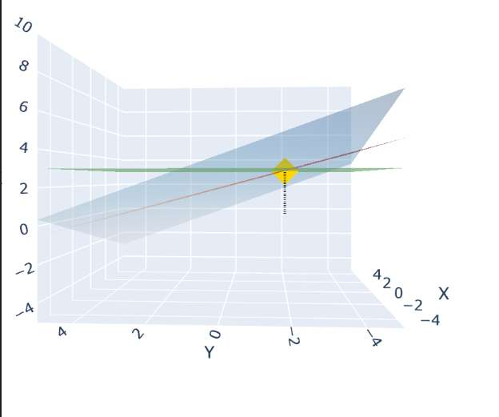

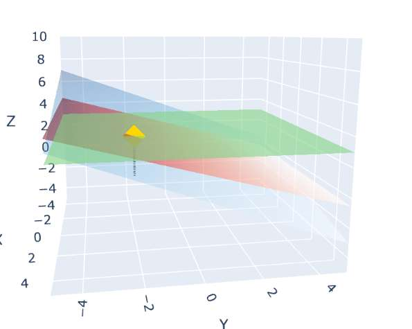

**这一顿操作的几何意义**
我们没有改变交点的位置，但我们将这三个平面**旋转**到了最舒服的角度——**垂直于坐标轴**（或平行于轴）。
*   最后一个平面直接锁定了高度 ($z$轴)。
*   中间的平面锁定了深度 ($y$轴)。
*   交点在几何平面中，非常清晰，坐标直接可以读出来。

当然了，二维也适用：

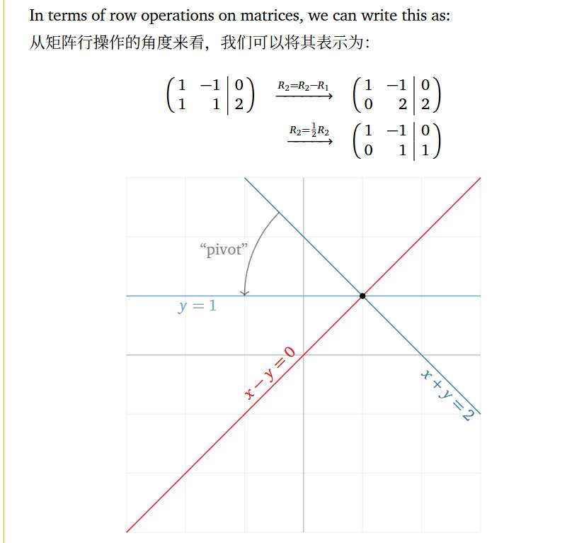
原来的$x_1+x2=2$ 经过倍加与倍乘操作，变成了$x2=1$ 

可以看到，并不影响解的位置（图中黑色的交点）
## 三个疑问

#### 为什么要化成“阶梯形”？ 不能化成对角型的矩阵吗？

**答案是：当然可以！**

实际上，
对于本例的矩阵
$$\begin{bmatrix}
\mathbf{1} & 2 & 3 \\
0 & \mathbf{1} & 2 \\
0 & 0 & \mathbf{1}
\end{bmatrix}$$
如果我们把高斯消元做到极致，我们第三行把第二行的第三个位置消掉，同理第一行也可以消，  那么它完全可以长这样：

$$
\begin{bmatrix}
1 & 0 & 0 \\
0 & 1 & 0 \\
0 & 0 & 1
\end{bmatrix}
\begin{bmatrix} x_1 \\ x_2 \\ x_3 \end{bmatrix} = b 
$$

第一行只有 $x_1$，第二行只有 $x_2$... 此时每个变量都彻底独立了。

**那为什么我们先化成“上三角”的阶梯形呢**
$$
\begin{bmatrix}
1 & 2 & 3 \\
0 & 1 & 2 \\
0 & 0 & 1
\end{bmatrix}
$$
这纯粹是为了**计算的策略**：
1.  **第一步（消元）：** 我们先从上往下扫荡，制造出一个“三角形”。这一步成本较低，且已经足以让我们看清矩阵的性质（比如有没有解）。
2.  **第二步（回代）：** 既然最后一行 $x_3$ 已经算出来了，我们就可以像倒回去算出 $x_2$，再算出 $x_1$。

我们到这一步就够了， 已经能”压榨“够矩阵的信息了，所以不用再”压榨“去求对角型了。
#### 为什么要化成“上三角”？ “下三角”不行吗？

既然我们说了，高斯消元法就是能肆意妄为地对矩阵配方进行操作，
那么答案当然是“可以！”

并没有任何数学公理规定“必须”消成上三角。

如果非要反着来，把上方消成 0（变成下三角），**在数学上是完全等价的**，也能解出方程。

我们使用之前的方程组：
$$
\left[
\begin{array}{ccc|c}
1 & 2 & 3 & 6 \\
2 & -3 & 2 & 14 \\
3 & 1 & -1 & -2
\end{array}
\right]
$$

**下三角形式是这样的**
$$
\left[
\begin{array}{ccc|c}
\mathbf{50} & \mathbf{0} & \mathbf{0} & 50 \\
8 & \mathbf{-1} & 0 & 10 \\
3 & 1 & \mathbf{-1} & -2
\end{array}
\right]
$$

我们把这个矩阵翻译回方程组看看：

1.  **第 1 行：** $50x_1 = 50 \Rightarrow \mathbf{x_1 = 1}$。
    *(第一个变量直接解出来了)*

2.  **第 2 行：** $8x_1 - 1x_2 = 10$。
    把 $x_1=1$ 带入（这就叫**前代**）：
    $8(1) - x_2 = 10 \Rightarrow -x_2 = 2 \Rightarrow \mathbf{x_2 = -2}$。

3.  **第 3 行：** $3x_1 + 1x_2 - 1x_3 = -2$。
    把 $x_1, x_2$ 带入：
    $3(1) + 1(-2) - x_3 = -2 \Rightarrow 1 - x_3 = -2 \Rightarrow \mathbf{x_3 = 3}$。

**结果：** $x = [1, -2, 3]^T$。 和标准高斯消元的结果**一模一样**。

#### **为什么行变换没改变“秩”**？

*   **行变换**：明明是在把行加来加去，甚至把某一行的数字改得面目全非。
*   **秩（列视角）**：是列向量张成的空间维度。

 我把行改了，列向量的样子全变了（比如从 $[1, 2, 3]^T$ 变成了 $[1, 0, 0]^T$），**列空间的维度（秩）没变吗？**
 
**真的没变！**

**初等行变换，虽然改变了列向量的具体数值，但它绝对不改变列向量之间的“线性关系”。**

假设在原矩阵 $A$ 中，第 3 列是前两列的和：
$$ \text{Col}_3 = 1 \cdot \text{Col}_1 + 1 \cdot \text{Col}_2 $$
现在，我们对矩阵进行**任何**行变换，比如第二行减去第一行，得到新矩阵 $B$。

在 $B$ 中，这个关系**依然合理**：
$$ \text{NewCol}_3 = 1 \cdot \text{NewCol}_1 + 1 \cdot \text{NewCol}_2 $$

因为我们行变换是一起变的！  col1 col2加多少乘多少  我col3也是，所以，col3和col1 col2的关系当然也维持不变！

所以说
如果在原矩阵里，某些列是“多余的”（线性相关的），在化简后的矩阵里，它们**依然是多余的**。
如果在原矩阵里，某些列是“独立的”（线性无关的），在化简后的矩阵里，它们**依然是独立的**。

这也就告诉了我们一个性质！
即**我们可以用化简后得到的行阶梯型矩阵，来判断矩阵的秩！**

## 主元 (Pivot)

当我们把矩阵化简成完美的阶梯形后
$$\begin{bmatrix}
\mathbf{1} & 2 & 3 \\
0 & \mathbf{1} & 2 \\
0 & 0 & \mathbf{1}
\end{bmatrix}$$
*   有些行（此例为所有行）会存在一个数，是紧挨着左边一连串，被消掉的0
*   这些位置的数字，我们叫它 **主元**。

我们把他们当作每个矩阵历经高斯消元法, 化成最简矩阵时，最简矩阵的标识。

其英文名是**pivot**，“支点、枢纽”   

为什么这几个数字这么重要，叫做“枢纽”？

**原因有二**：
1. 我们看它，能一眼看出矩阵的秩
2. 我们看它，能一眼看出方程解的特点

**第一个原因**很好解释：
因为行变换保留了列的独立性关系。
在阶梯形里，我们可以一眼看出，**包含主元的列**显然是互相独立的
（因为后面一个主元总是在新的一行，前面的列没法抵消它）。
故而 **主元的个数 = 独立列的个数 = 秩。**

**对于原因二**，
在本例中，我们来分析一下主元带给了我们什么信息
$$
\begin{bmatrix}
\mathbf{1} & 2 & 3 \\
0 & \mathbf{1} & 2 \\
0 & 0 & \mathbf{1}
\end{bmatrix}
\cdot x =
\begin{bmatrix}
6 \\
4 \\
3
\end{bmatrix}
$$

*   **第 3 行的主元 ($\mathbf{1}$)**：它位于第 3 列。它告诉我们，x3一定是固定的唯一一个值
*   **第 2 行的主元 ($\mathbf{1}$)**：它位于第 2 列。，$x_2+2x_3=4$ 即 而$x_3$我们从第三行的主元能知道，是固定的，所以$x_2$也是唯一固定的！
*   **第 1 行的主元 ($\mathbf{1}$)**：它位于第 1 列。同理

于是在本例中，我们看到三个主元，就能知道方程只有唯一解。

所以，呼应我们”三个疑问“中的疑问二，**既然化简成下三角和上三角，对于解方程来说结果一样，为什么全世界的线性代数教材都约定“化为上三角（阶梯形）”？**

那么原因不仅是消成上三角这种逻辑，符合人类“从左到右"处理列表的直觉。

更重要的是其**让”主元“清晰可见。**

# 解的结构

在上一个部分，我们通过一个比较经典而友好的矩阵，
展示了”如何解“这个过程。

现在，我们把视野拓宽，我们能不能不要会解刚才那一个矩阵的问题，
而是掌握所有情况？

## 无穷解
那我们现在就再来一个情况：
假如我们在高斯消元的过程中，消着消着，最后一行变成了 **全 0**：

$$
\begin{bmatrix}
\mathbf{1} & 2 & 3 \\
0 & \mathbf{1} & 2 \\
0 & 0 & 0
\end{bmatrix}
$$

**发生了什么？**

**看主元：** 只有 **2** 个主元了。第 3 行**没有主元**

这就引出了线性方程组中最核心的概念 —— **自由变量**

我们把约束写出来（举一个b的例子，这里只展示了A嘛）

