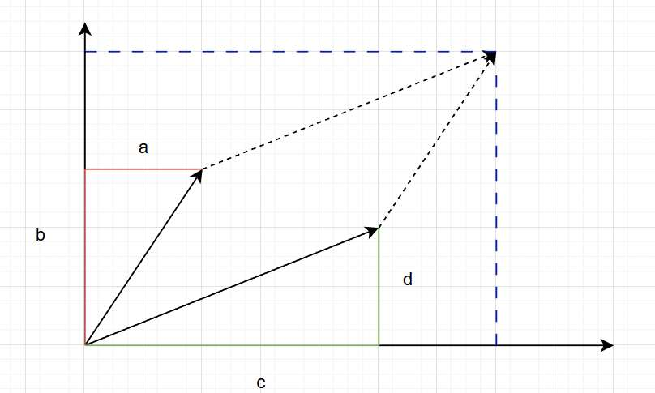
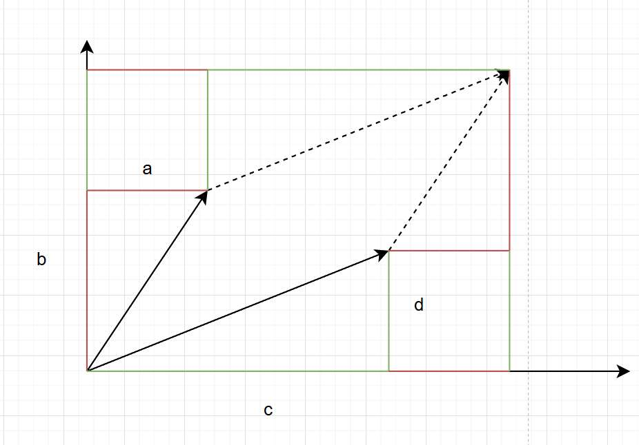

之前写的矩阵文章，主要还是把视角放在单独的某个向量来讨论的。

今天, 我们不再关注单个向量。
而是看矩阵对所有向量的作用，就能感受到矩阵对整个空间的作用。
这个对空间的作用有哪些特点？
- 空间的“体积”变换---行列式
- 空间变换后，不变的东西---特征值和特征向量
- 复杂的变换后，怎么轻松地理解？---相似对角化

我们一一进行探讨。

本文在探讨空间，所以大家应当知道，我们全篇都是“**列视角**”看待矩阵。（关于行列视角这里不带大家复习了，具体可见往期文章）

仍然，没有枯燥繁琐的数学公式，只需跟上文章的节奏，就能体验线性代数核心概念背后的直觉之美。
# 行列式 

行列式的英文名叫Determinant，它“Determine（决定）”了什么呢？

它决定了**线性变换对空间体积的“缩放倍率”**

### 1. 二维

让我们来看一个具体的矩阵例子：
$$ A = \begin{bmatrix} 3 & 0 \\ 1 & 2 \end{bmatrix} $$

*   原来的基向量是 $\hat{i} = [1, 0]^T$ 和 $\hat{j} = [0, 1]^T$。它们围成了一个**单位正方形**，面积是 $1 \times 1 = 1$。
*   矩阵 $A$ 作用向量时会意味：
    *   $\hat{i}$ 变成了新的基向量 $\text{New } \hat{i} = [3, 1]^T$。
    *   $\hat{j}$ 变成了新的基向量 $\text{New } \hat{j} = [0, 2]^T$。

现在，我们不再追踪某个向量（即某个点），而是追踪这个**单位正方形**。
在矩阵 $A$ 的作用下，这个正方形，变成了一个倾斜的**平行四边形**。

**它的面积是多少？**
如果看图，这属于一道小学数学题，平行四边形的面积为 $底×高=2×3=6$  

这意味着，矩阵 $A$ 把整个二维空间的面积**放大了 6 倍**。
诶？真的是整个二维空间吗？ 我们只是把基向量围成的单位正方形放大了 6 倍，怎么敢说整个空间里随便画个东西，面积也放大 6 倍呢？

这就是 **线性 (Linear)** 代数中，**线性**二字的魅力。

空间中任意一个向量 $v$，本质上都是基向量 $\hat{i}, \hat{j}$ 的线性组合：
$$ v = x \cdot \hat{i} + y \cdot \hat{j} $$

变换后，向量 $v$ 变成了 $v_{new}$，它依然保持着同样的组合关系，只是基向量换了：
$$ v_{new} = x \cdot (\text{New } \hat{i}) + y \cdot (\text{New } \hat{j}) $$

这意味着，整个空间像是被印在了一张弹性橡胶膜上。
*   如果我们把膜上的单位网格（正方形）拉伸了 6 倍。
*   那么画在膜上的**任何图案**（无论是不规则的圆，还是蒙娜丽莎的笑脸），都会随着网格一起被均匀拉伸。
*   它们占用的“格子数”没变，但每个“格子”的面积变大了 6 倍。
*   所以，任意图形的总面积，也势必放大 6 倍。

现在我们知道，算行列式就是算这个**平行四边形的面积**。
但为什么 $\begin{bmatrix} a & c \\ b & d \end{bmatrix}$ 的行列式公式偏偏是 $ad-bc$ 呢？

假设矩阵是 $\begin{bmatrix} a & c \\ b & d \end{bmatrix}$，这意味着：
*   $\text{New } \hat{i} = (a, b)$
*   $\text{New } \hat{j} = (c, d)$

我们要算这两个向量围成的平行四边形面积。

我们可以把这个平行四边形包在一个大矩形里，大矩形的宽是 $a+c$，高是 $b+d$。
然后，减去周围多余的 4 个直角三角形和 2 个小矩形：

1.  **大矩形面积**：$(a+c)(b+d) = ab + ad + cb + cd$
2.  **减去 2 个红色三角形**（对应向量 $\hat{i}$）：$2 \times (\frac{1}{2}ab) = ab$
3.  **减去 2 个绿色三角形**（对应向量 $\hat{j}$）：$2 \times (\frac{1}{2}cd) = cd$
4.  **减去 2 个小矩形**（对应侧边）：$2 \times (ad) = 2ad$

**最终面积 = 大矩形 - 红三角 - 绿三角 - 小矩形**
$$ \text{Area} = (ab + ad + cb + cd) - ab - cd - 2ad $$
$$ \text{Area} = ad + cd - 2ad $$
$$ \text{Area} = ad - bc $$

那么问题又来了，上面的例子是恰好正方形变成平行四边形，我们方便算出这个'6' 如果变换... 不对，如果追踪基向量的话  所有变换一定都是平行四边形！
我觉得接下来还欠缺的是， 对行列式公式的推导  

$$ |A| = 3 \times 2 - 0 \times 1 = 6 $$
没错，这个新平行四边形的面积就是 **6**。
这意味着，矩阵 $A$ 把整个二维空间的面积**放大了 6 倍**！不仅是这个正方形，空间里任何一个图形（三角形、圆、蒙娜丽莎的画像），经过变换后，面积都会变为原来的 6 倍。

### 2. 三维

升维到三维，道理完全一样。
想象一个矩阵 $B$：
$$ B = \begin{bmatrix} 2 & 0 & 0 \\ 0 & 2 & 0 \\ 0 & 0 & 2 \end{bmatrix} $$
它把 $\hat{i}, \hat{j}, \hat{k}$ 全部拉长了 2 倍。
原来的**单位立方体**（体积 1），变成了一个边长为 2 的大立方体。
体积变为了 $2 \times 2 \times 2 = 8$。
算算行列式：$|B| = 8$。

**结论：行列式 $|A|$ 的绝对值，就是变换后体积相对于原体积的倍数。**

### 第一部分：行列式 —— 空间的“压缩比”

#### 1. 核心直觉：不仅仅是面积，是“倍率”
我们不能干巴巴地说它就是面积。
准确的定义是：**行列式是线性变换对空间体积的“缩放倍率” (Scaling Factor)。**

*   **故事线**：
    *   想象一个单位正方形（面积为 1），由基向量 $\hat{i}, \hat{j}$ 围成。
    *   矩阵 $A$ 把 $\hat{i}, \hat{j}$ 拉伸、旋转、剪切，变成了新的向量。
    *   原来的正方形变成了一个**平行四边形**。
    *   **这个新平行四边形的面积，就是行列式 $|A|$。**
    *   如果是 3D，就是单位立方体变成平行六面体的**体积**。

*   **🎨 建议画图 1（2D 变换）**：
    *   **左边**：标准的网格，红色的小正方形（1x1）。
    *   **右边**：被矩阵拉扯变形后的网格。红色正方形变成了一个歪歪斜斜的平行四边形。
    *   **标注**：Parallel Area = $|A|$。

#### 2. 符号的秘密：为什么会有负数？（Orientation）
这是很多教材忽略的，但非常有意思。面积怎么可能是负的？

*   **深挖点**：
    *   行列式的正负，代表了空间的**定向（Orientation）**。
    *   **正数**：保持右手定则（或者说 $\hat{i}$ 在 $\hat{j}$ 的右边）。
    *   **负数**：空间被“翻转”了！就像翻煎饼一样，$\hat{i}$ 跑到了 $\hat{j}$ 的左边。这叫“镜像变换”。

*   **🎨 建议画图 2（翻转）**：
    *   画一张纸，正面写着字。
    *   矩阵变换如果 $|A| < 0$，就相当于把这张纸**翻面**了，背面的字是反的。

#### 3. **高潮部分：当行列式为 0（The Zero）**
这是本章最核心、最值得细讲的地方，因为它直接**连接了上一篇文章（秩）**。

*   **逻辑链条**：
    *   还记得上一篇的“降维打击”吗？（3D 压扁成 2D）。
    *   如果一个 3D 的盒子被压扁成了一张纸，它的**体积**是多少？
    *   **是 0！**
    *   所以，**$|A| = 0$ 的物理意义就是：矩阵把空间压扁了！**

*   **考研/理论连接（深意）**：
    这里可以给出一个**“五位一体”**的超级结论（考研必考）：
    > 以下五件事是同一回事：
    > 1.  行列式 $|A| = 0$ （体积为 0）
    > 2.  矩阵不满秩 / 秩亏 （空间被压扁）
    > 3.  矩阵不可逆 （压扁了就还原不回去了，就像降维后丢失了信息）
    > 4.  列向量线性相关 （至少有一个列向量是多余的，比如 $col_3$ 落在 $col_1, col_2$ 的面上）
    > 5.  $Ax=0$ 有非零解 （存在非零向量被压成了 0）

    **这一段是真正的“干货”，把前面所有的知识点全部打通了。**

*   **🎨 建议画图 3（压扁）**：
    *   一个饱满的立方体（Volume = 1）。
    *   经过矩阵 $A$（$|A|=0$）作用。
    *   变成了一张纸（平面），或者一条线。
    *   **标注**：Volume = 0 $\rightarrow$ Dimension Loss (降维)。

#### 4. 几何性质的应用（选讲）
如果篇幅允许，可以提一下行列式的**倍乘性质**和**加法性质**其实都是几何必然。
*   比如：把其中一条边拉长 $k$ 倍，面积自然变成 $k$ 倍（对应行列式某一行乘 $k$，整体乘 $k$）。
*   这比背公式 $det(kA) = k^n det(A)$ 要直观一万倍。

---

### 总结：这部分讲什么？
这一章不是在教怎么算 $ad-bc$，而是在讲：
1.  **缩放**：矩阵让世界变大变小了多少？
2.  **翻转**：矩阵有没有把世界翻个面？
3.  **毁灭**：矩阵有没有把世界压扁（$|A|=0$）？

这样讲，你觉得“可讲的东西”是不是变多了？特别是**第三点（和秩的联系）**，是这一章的灵魂。

# **第二部分：特征值与特征向量 —— 寻找不变的脊梁**
*   **切入点**：矩阵变换通常是旋转+剪切，乱七八糟的。有没有什么东西是“稳定”的？
*   **核心直觉**：
    *   **特征向量**：在变换中**不旋转**，只进行**伸缩**的向量。它们是矩阵的“脊梁”或“主轴”。
    *   **特征值**：伸缩的倍数。
*   **例子**：
    *   $A = I$（什么都没变，所有向量都是特征向量）。
    *   投影矩阵（投影面上的向量不变 $\lambda=1$，垂直向量变0 $\lambda=0$）。

# **第三部分：相似对角化 —— 换个角度看世界**
*   **切入点**：$A^n$ 怎么算？太难了。能不能把矩阵变得简单点？
*   **核心直觉**：
    *   **对角矩阵 ($\Lambda$)**：最完美的矩阵，只在坐标轴方向伸缩。
    *   **相似变换 ($P^{-1}AP$)**：
        *   $P$ 是“换基底”（换视角）。
        *   如果我们站在**特征向量**构成的基底上看矩阵 $A$，它就变成了一个纯粹的对角矩阵 $\Lambda$！
    *   这解释了为什么要解特征方程，为什么要找特征向量——**为了找到那个让世界变得最简单的视角。**

#### **第四部分：考研隐形考点植入（总结表）**
*   总结 $A$ 可逆、$|A| \neq 0$、$r(A)=n$、0 不是特征值，这一串全是等价的。这是考研选择题必考。
