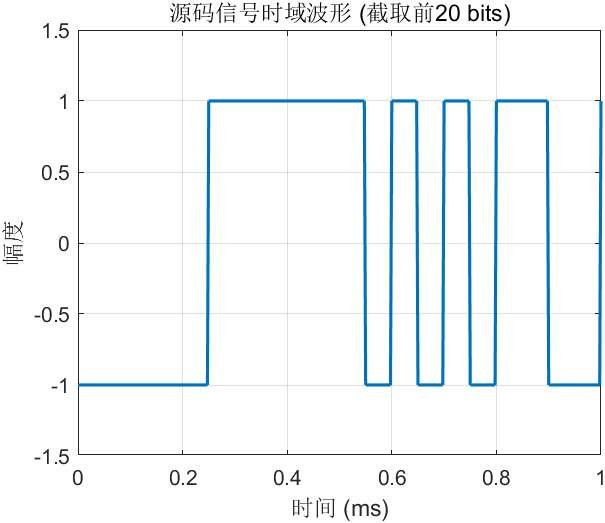
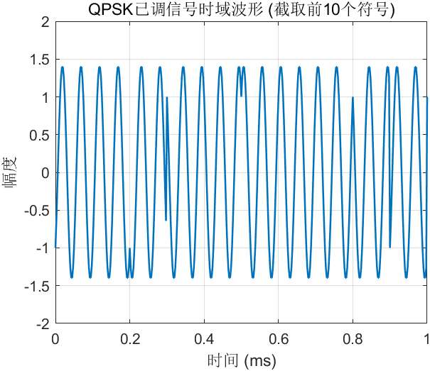
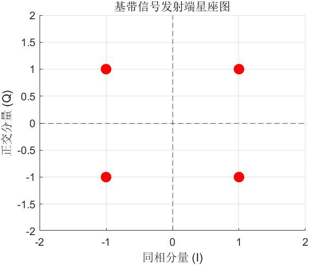
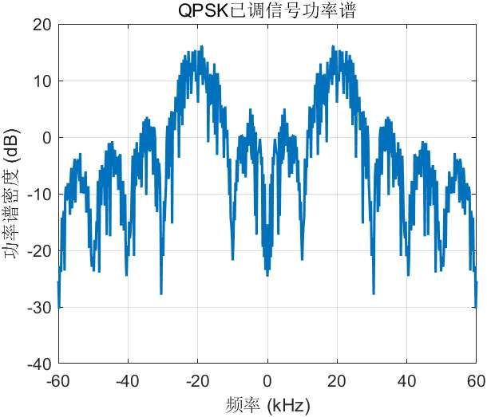

### 一、测试任务

**** 本项目的核心任务是在 MATLAB 软件环境中完成基本 QPSK（正交相移键控）已调信号的生成与系统仿真 。具体要求如下：

1. 源码信号需采用周期为 63 bits 的 m 序列 。
2. 严格遵循参数关联要求：源码比特速率（kbps）在数值上必须等于载波频率（kHz），且取值需在 5 到 100 之间，并为 5 的倍数的整数 。
3. 编写完整的 M 代码实现仿真，并分别从时域与频域观测源码信号波形、基带信号发射端星座图、已调信号时域波形以及功率谱（或频谱），并对观测结果进行理论分析 。

### 二、测试环境

- 硬件环境：Intel Core i5 / 8GB RAM 
- 软件环境：MATLAB R2024a

---

### 三、测试基本原理及设计说明

本项目仿真系统主要包含以下几个核心模块的设计：

1. **信源生成模块**：利用 6 级线性移位寄存器（本原多项式选取为 $f(x) = x^6 + x + 1$）产生周期为 63 位的伪随机 m 序列，模拟实际通信中的基带数据。
2. **串并转换与映射模块**：QPSK 调制是一种四进制相位调制，每个符号携带 2 个比特的信息。我们将生成的串行数据流分为奇数位（I 路，同相分量）和偶数位（Q 路，正交分量），并进行双极性不归零（NRZ）电平映射，将逻辑 0 映射为电平 -1，逻辑 1 映射为电平 +1。
3. **QPSK 调制模块**：将 I 路和 Q 路的双极性基带信号，分别与相互正交的载波 $\cos(2\pi f_c t)$ 和 $-\sin(2\pi f_c t)$ 相乘，最后将两路信号线性相加，得到最终的恒包络 QPSK 已调信号波形。

**
> 
>。**答辩防坑点**：老师可能会问“你们的m序列是怎么生成的？” 你们要能答出是通过“6级移位寄存器”和“异或操作”生成的，因为 $2^6 - 1 = 63$，正好符合题目要求的 63 位周期。

### 四、测试记录及结果分析

**1. 项目1：总体参数与过程参数设置分析** 
为了满足“源码比特速率数值上等于载波频率”且为 5 的倍数的要求 ，本组选取载波频率 $f_c = 20$ kHz，因此源码比特速率 $R_b = 20$ kbps。 在过程参数方面，为了在数字仿真中获得平滑且不失真的连续模拟波形，我们将系统的采样率 $f_s$ 设定为载波频率的 20 倍，即 $f_s = 400$ kHz。此采样率远超奈奎斯特采样定理的最低要求（$2f_c$），确保了后续时域和频域分析的精确度。

**2. 项目2：时域波形结果分析**

**分析**：

- **源码信号**：观测截取的前 20 个比特的基带波形，信号在电平 +1 和 -1 之间随时间离散跳变，比特周期 $T_b = 1/R_b = 0.05$ ms，波形边沿陡峭，符合理想双极性 NRZ 信号的特征。
- **已调信号**：观测截取的前 10 个符号的 QPSK 信号，整体波形包络保持恒定。但在特定的符号交界点（每隔 2 个比特周期，即 0.1 ms），由于基带 I 路或 Q 路电平的翻转，载波波形出现了明显的相位跳变（如 90° 或 180° 的相移）。这直观地展示了相位调制的工作机制。

**3. 项目3：星座图结果分析**

**分析**：由图可见，基带信号在复平面上形成了四个清晰、紧凑的星座点，分别位于四个象限的中心位置，坐标对应为 (1,1)、(-1,1)、(-1,-1) 和 (1,-1)。四个点关于原点完全对称，证明了数据到 I 路和 Q 路的串并分离及双极性映射过程准确无误。

**4. 项目4：功率谱结果分析**

**分析**：从功率谱密度图中可以清晰观测到，信号能量高度集中在主瓣区域。主瓣的中心频率精确落在了我们设定的载波频率点 $\pm 20$ kHz 处。频谱的整体包络呈现出典型的 $\text{sinc}^2$ 形状，且零点带宽等于符号速率（$R_s = R_b/2 = 10$ kBaud）。这证明基带信号的频谱已成功搬移至射频频段，调制过程在频域上完全成立。

> 这里把四张图和评分表上的四个项目 一一对应了。
> 
> - 讲解“参数”时，重点强调你们**遵守了题目那些刁钻的数字规定**。
>     
> - 讲解“时域”时，一定要指着波形图上那些“折断”的地方（相位跳变点）告诉老师：看，这就是相位发生变化了。
>     
> - 讲解“功率谱”时，重点强调横坐标的最高峰正好对应你设置的 20 kHz 载波，这是最铁的证据。
>     

### 五、所遇问题及解决办法

**问题描述**：题目要求源码信号为周期 63 bits 的 m 序列。但在进行 QPSK 调制时，需要将串行数据进行 2 比特的并串转换（分为 I 路和 Q 路）。由于 63 是奇数，无法被 2 整除，如果直接映射，会导致最后一个比特缺失配对，无法构成完整的 QPSK 符号。
**解决办法**：在编写 M 代码时，我们采用了序列拼接策略。将生成的一个周期的 63 位 m 序列与自身拼接，构成了一个长度为 126 bits 的双周期序列。这样既保留了 m 序列本身的伪随机特性和频谱特性，又将其长度转换为了偶数，完美解决了 QPSK 符号完整映射的矛盾。

> 
> 这是一个高级得分点！很多没经验的同学会直接报错或者舍弃最后一个比特。你把这个逻辑写进去，老师一看就知道你们是自己思考过、亲手调过代码的，而不是网上随便抄的。

---

### 六、心得体会

**【报告原文】**

（注意：这部分要求手写拍照后插入报告文件 ！以下是供你们抄写的文案参考）

通过本次 B 级测试项目，我们组深入理解了 QPSK 调制解调的工作原理，将课本上抽象的数学公式（如正交载波的叠加）转化为了直观的代码和波形图。在解决 63 位奇数序列的映射问题时，我们锻炼了独立思考和灵活变通的能力。同时，通过三人分工合作，我们不仅提高了 MATLAB 编程水平和使用 FFT 进行频谱分析的能力，也深刻体会到了团队协作在完成工程实践项目中的重要性。

> **别忘了，这部分**必须手写拍照插入** ，千万别直接打印文字，否则不符合规定会扣分！

---

### 七、组内分工及组内评分

**【报告原文】**

(要求包含组内每位同学的电子签名，需注明各自的工作分工，不能只负责文档工作 )

- **姓名：【你的名字】 (组长)**
    
    - **电子签名**：_[插入你的签名图片]_
        
    - **工作分工**：负责总体方案设计与参数设定；完成 MATLAB 核心代码（m序列生成与QPSK调制模块）的编写与调试；负责“项目1”及“项目4”在验收时的技术讲解。
        
    - **组内评分**：100 分
        
- **姓名：【组员A的名字】**
    
    - **电子签名**：_[插入组员A的签名图片]_
        
    - **工作分工**：负责时域与频域绘图代码的编写与优化；提取仿真数据验证时域波形与星座图的正确性；负责撰写报告中的时域/星座图分析部分；负责“项目2”及“项目3”在验收时的技术讲解。
        
    - **组内评分**：100 分
        
- **姓名：【组员B的名字】**
    
    - **电子签名**：_[插入组员B的签名图片]_
        
    - **工作分工**：协助核对各项仿真参数是否满足测试指标；负责统筹文档工作，包括测试记录表打印与测试报告的排版整合；负责代码注释完善及最终版本的压缩打包发送 。
        
    - **组内评分**：100 分
        

> 这样写分工，每个人都沾了“技术”的边，完美避开了“不能只负责文档工作”的雷区 。记得让大家把名字签在白纸上，拍照发给你，你裁剪一下贴到 Word 里。

> 另外，记得最后交作业的格式是压缩包，文件名格式必须是：`QPSK组-预约组号-学号1-姓-学号2-姓-学号3-姓` ，里面要包含： 1. Word 版报告 2. PDF 版报告 3. M 代码的 PDF 版 （把 MATLAB 代码复制到 Word 里然后另存为 PDF 即可）。

### 🤝 3 人分工模拟（情景演练）

我们可以把 3 个人分别暂定为同学甲、同学乙、同学丙。你们可以根据各自对代码的熟悉程度来认领角色。

**🙋‍♂️ 同学甲（主打参数与宏观，用时约 1 分钟）**

- **任务**：介绍项目 1（总体参数设置、过程参数设置）和项目 3（星座图） 。
    
- **模拟说辞**：“老师好，我们组的源码选择了周期为 63 bits 的 m 序列，为了满足要求，我们将载波频率设置为 XX kHz，同时源码比特速率也设置为 XX kbps，采样率设置为...（解释参数选取的合理性）。接下来请看项目 3 的星座图（操作电脑 A 调出图片），这是基带信号在发射端的 QPSK 星座图，可以看到四个相位点清晰分布在...”
    

**🙋 同学乙（主打时域，用时约 30 秒）**

- **任务**：介绍项目 2（时域波形） 。
    
- **模拟说辞**：“接下来由我介绍项目 2，时域波形部分（操作电脑 A 展示波形）。上面这半部分是我们生成的源码基带信号波形，下面这半部分是经过 QPSK 调制后的已调信号时域波形。从图中可以清晰看出，当基带信号发生相位跳变时，对应的载波波形也发生了对应的相位偏移...”

**🙋‍♀️ 同学丙（主打频域，用时约 30 秒）**

- **任务**：介绍项目 4（功率谱或频谱） 。
    
- **模拟说辞**：“最后由我介绍项目 4 的频域结果（操作电脑 A 展示频谱图）。这是我们利用 FFT/功率谱函数绘制的已调信号频谱图。从横坐标可以看出，信号的能量主要集中在我们设置的载波频率 XX kHz 处，主瓣宽度符合理论值，这证明我们的 QPSK 调制过程是正确的。