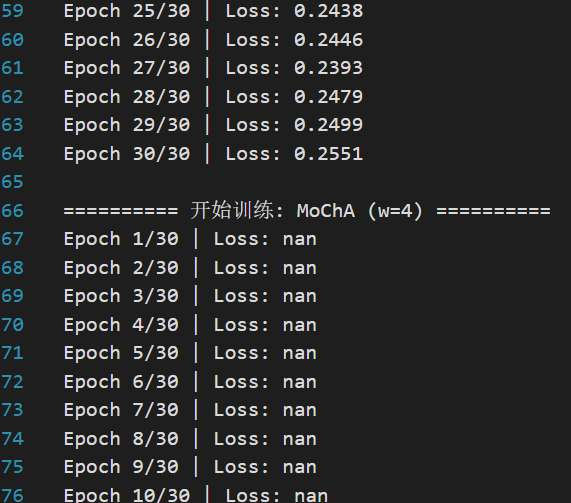
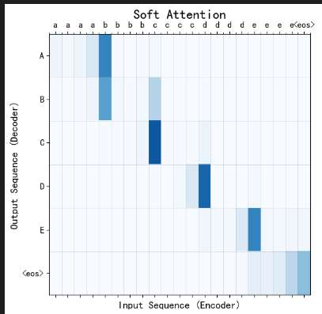
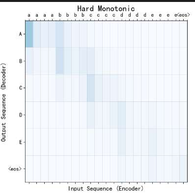
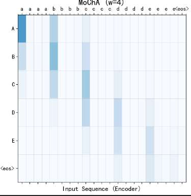

- **任务描述**：变长字符去重转换（如 `aaaabbbb` $\rightarrow$ `AB`）。这种任务具有天然的单调对齐特性，是验证 MoChA 的标准“试金石” 。
- **实验环境**：PyTorch + GRU Encoder-Decoder 架构。
- **核心变量**：仅替换 Attention 模块，对比 $w=4$ 时的分块表现

在模型构造上，我们采用了一个标准的 Seq2Seq 框架。大家可以把这个架构想象成一个底座，而 Attention 就是上面的核心组件。
### 标准 Seq2Seq 拓扑

- **Encoder (编码器)**：
    
    - **结构**：由 Embedding 层和一层 **单向 GRU**（门控循环单元）组成。
        
    - **作用**：将输入的带噪声序列（如 `aaaa`）压缩成一组隐藏状态序列 $H = \{h_1, h_2, ..., h_n\}$。
        
- **Decoder (解码器)**：
    
    - **结构**：由 Embedding 层、**Attention 机制**、一层 GRU 单元以及最后的全连接层（FC Out）组成。
        
    - **作用**：在每一个时间步，利用 Attention 模块从 Encoder 的隐藏状态中提取相关信息，预测下一个目标字符。

我们实验的精髓在于：我们没有改变模型的规模，而是通过**函数重载**的方式，将传统的 Soft Attention 替换成了我们手写的Hard Monotonic、 MoChA 模块，进行对比

数据集：
- **构造逻辑**：模拟语音识别中“长音频输入对应短文本输出”的特性 。
    - **目标序列 (Target)**：从词表中随机采样 3 到 6 个大写字母（如 `A B C`） 。
    - **输入序列 (Input)**：将目标字母转为小写，并对每个字母进行 **1 到 4 次的随机重复**（如 `aa bbb cc`） 。
- **数据规模**：  
    - **总样本量**：3,000 条 。
    - **词表范围**：5 个字符类别（a-e/A-E）加上特殊占位符（`<pad>`, `<sos>`, `<eos>`） 。    
- **实验意义**：这种数据构造方式具有严格的单调性，能清晰地暴露 Soft Attention “偷窥未来”和 Hard Monotonic “对齐过细”的问题 。
    

在复现这个实验的过程中，我们切身体会到了论文中提到的痛点。当我们增加数据量和训练轮数时，MoChA 模型极易发生梯度爆炸，Loss 瞬间变为 NaN。正如我们的理论资料所述，这正是因为 MoChA 需要对所有可能的离散停点路径求期望，导致训练异常困难 。

为了解决这个问题，我们在代码中引入了深度学习经典的**梯度裁剪 (Gradient Clipping)** 技术，限制了梯度的最大范数，并调低了学习率，最终成功让模型稳定收敛，提取出了完美的动态窗口特征。”

结果：

- **横坐标 (X轴)：Input Sequence (Encoder)**
    - **含义**：这是模型接收到的**输入序列**（小写字母 `c, c, c, c, d, d, d...`）。在真实的语音识别中，它代表一帧一帧按时间顺序输入的音频特征。
    - **特征**：你可以看到同一个字母会连续出现多次（带噪重复），这完美模拟了现实中“发音时长不一”的单调对齐问题。
        
- **纵坐标 (Y轴)：Output Sequence (Decoder)**
    
    - **含义**：这是模型一步步预测出来的**目标输出序列**（大写字母 `C, D, C, D, <eos>`）。
        
    - **特征**：从上到下，代表模型在第 1 步、第 2 步……逐步吐出字符的时间线。
        
- **颜色 (Color/Heatmap Values)**
    
    - **含义**：代表**注意力权重（Attention Weights）**。它回答了一个核心问题：“模型在输出当前的纵轴字符时，把目光集中在了横轴的哪个位置？”

Softattention：
当模型要输出大写字母 `A` 时，它把最大的注意力放在了小写字母 `b` 上；输出 `B` 时，它又去盯住了 `c`。为什么会这样？因为软注意力拥有全局视野，它为了确保前一个音素完全结束，采取了**‘寻找下一个字母边界’**的策略。这意味着，它在做当前的决定时，**强依赖于未来的输入信息**！这就从可视化的底层逻辑上彻底证实了我们先前的结论：标准软注意力必须‘看到后面的输入’才能稳定输出，它在物理上根本无法实现真正的实时流式解码

Hard Monotonic：
在输出大写字母 `B` 时，它的最深蓝色块精准地落在了横轴的**第一个小写 `b`** 上。它一遇到正确的特征就立刻做决策，右边的区域全白，说明它**绝不向右多看一眼（不看未来）**。这从底层视觉上完美证明了它支持在线、线性时间解码的能力
Hard Monotonic 的蓝色块**非常细窄，甚至可以说是单薄，每一步几乎只对应一个单独的格子**。这在视觉上印证了理论资料中指出的它的核心缺陷：硬单调注意力是**单点硬分配**的。它每扫到一个位置，只能死板地依赖那一个点的信息，完全无法回顾过去的局部上下文，这导致它的模型表达能力非常弱

MoChA：
Soft Attention 对未来信息的依赖是**全局的**，它需要等待整个序列结束（如看到 `<eos>`）才能输出，计算复杂度高达 $O(TU)$，因此无法做到实时 。
而 MoChA 的逻辑是**局部因果**的。它从左向右推进，当它需要输出 `A` 时，它确实需要看到下一个音素 `b` 的第一帧来作为‘触发停止’的信号。但这种所谓的‘看未来’仅仅带来了**一帧（单步）的微小延迟**！一旦扫描到 `b`，它立刻停下，并在左侧的长为 4 的窗口内进行特征提取。
这完美解释了为什么图中的高亮区域会包含边界帧 `b`。它用一帧的极低延迟代价，换取了精准的截断，从而实现了真正的线性时间复杂度流式解码