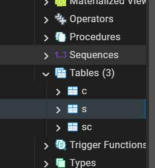
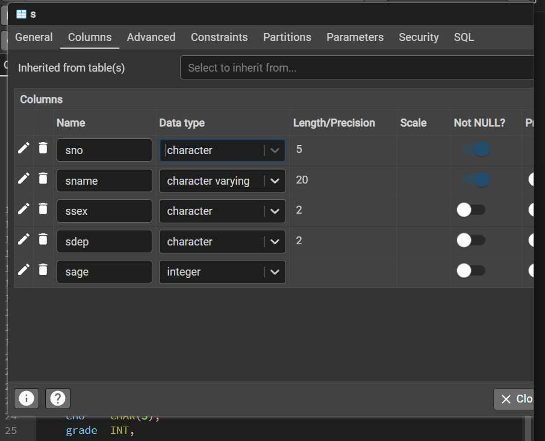
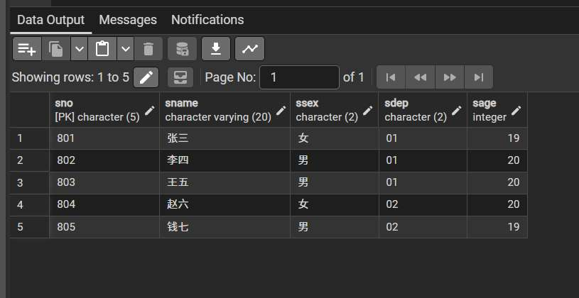
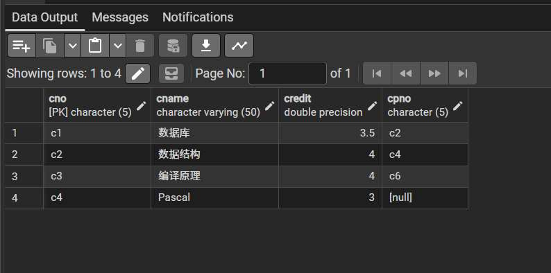
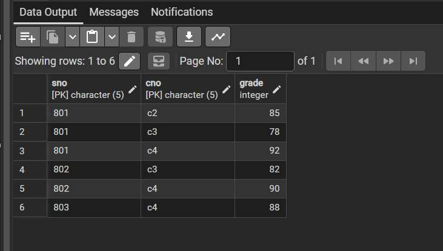
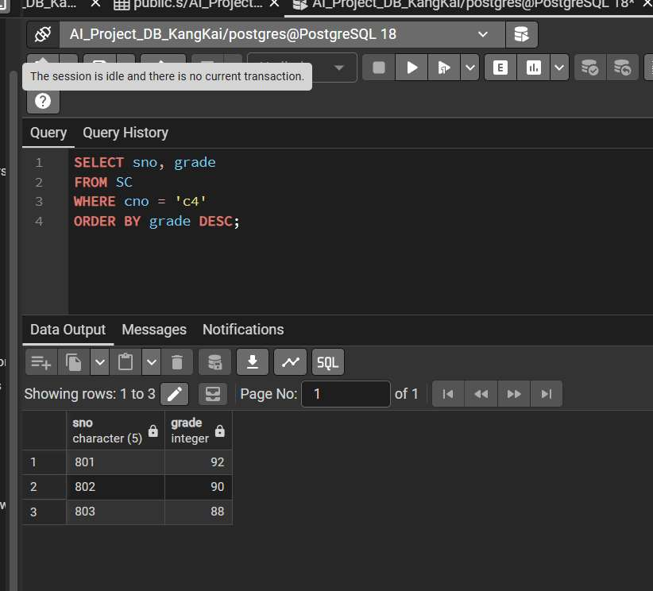
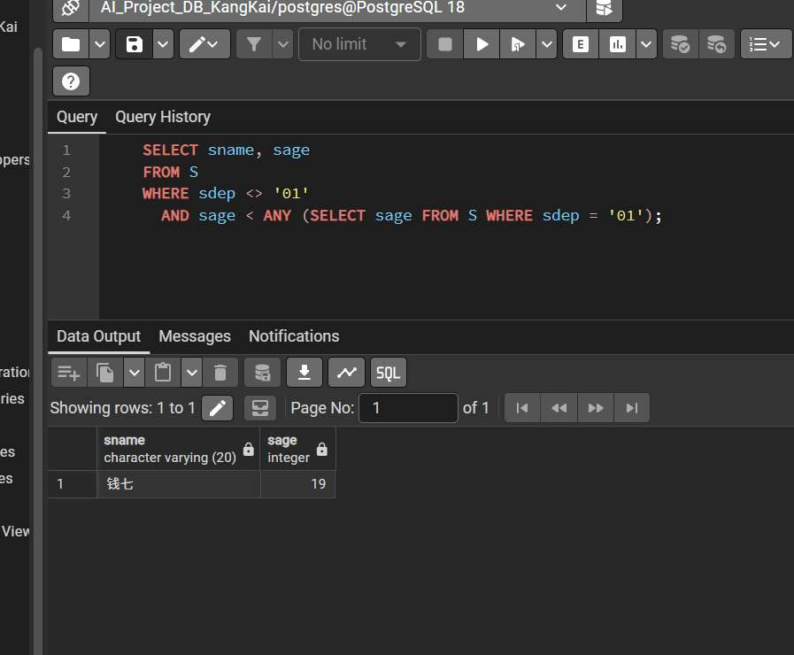

康凯---23009200942


### 一、实验环境准备与数据库安装

#### 1.1 实验环境说明

- **操作系统：** Windows 11 
- **数据库管理系统：** PostgreSQL 18 
- **管理工具：** pgAdmin 4 
- **AI 开发背景：** 在 AI 项目中，高质量的结构化数据是模型训练的基础。选择 PostgreSQL 是因为它不仅支持标准 SQL，还拥有强大的扩展性（如处理 Embedding 向量的 pgvector 插件），是工业级 AI 特征的首选方案。故而本次实验选择 PostgreSQL 作为熟悉。


#### 1.2 安装过程记录
1. **安装程序启动：** 运行 PostgreSQL 安装包，选择安装服务器、pgAdmin 4 等核心组件。
2. **服务器参数配置：** 设置超级用户 postgres 的密码，并配置默认服务端口为 5432。

kkdatabase


#### 1.4 创建个性化实验数据库

为体现操作的真实性并模拟多项目管理环境，我手动创建了一个以个人身份命名的数据库。

- **数据库名称：** AI_Project_DB_KangKai

- **操作痕迹说明：** 如下图所示，清晰可见我本人命名数据库实例过程


#### 2.5 环境连通性测试

在 Query Tool（查询工具）中执行基础 SQL 命令，验证数据库服务的运行状态及当前操作上下文。

- **执行语句 1：** SELECT version();
    
    - 作用： 获取当前数据库内核的详细版本信息。
        
- **执行语句 2：** SELECT current_user, current_database();
    
    - 作用： 确认当前登录身份（postgres）以及所操作的数据库对象。
        


#### 3.2 AI 视角解读

作为 AI 专业学生，我不仅关注查询结果，还通过 pgAdmin 的 **Dashboard（仪表盘）** 观察了数据库的实时监控数据。

- **观测点：** Transactions per second (每秒事务数)
- **专业思考：** 在大规模 AI 模型训练或推理阶段，高频的数据存取对 IO 性能有极高要求。通过可视化界面实时监控事务波动，能有效辅助我们进行模型特征提取阶段的性能调优。
**在实时监控（Dashboard）中观察到了明显的事务波动和 I/O 峰值。通过分析可知，这反映了数据库管理系统（DBMS）在维持高可用性时的固有开销，包括 pgAdmin 的轮询监控、系统元数据的读取以及后台维护进程的操作。在实际的 AI 离线特征库构建中，这种‘背景噪声’提醒我们需要在模型训练的吞吐量与数据库的监控性能损耗之间寻找平衡点**


### 二、数据库模式设计与数据导入

#### 2.1 实体关系建

基于实践要求，构建了三个核心模型：

- **S (Student)：** 学生基础特征库。
    
- **C (Course)：** 课程元数据配置。
    
- **SC (Score)：** 学生-课程交互矩阵

#### 2.2 核心实现与逻辑说明

- **操作细节：** 在建表脚本中，我使用了 PRIMARY KEY 约束确保数据的唯一性，并利用 FOREIGN KEY 建立了表间的参照完整性。

```SQL
DROP TABLE IF EXISTS SC; 
DROP TABLE IF EXISTS S;
DROP TABLE IF EXISTS C;


CREATE TABLE S (
    sno   CHAR(5) PRIMARY KEY, -- 数据类型固定5位，主键
    sname VARCHAR(20) NOT NULL, -- 可变长度字符，最长 20 位
    ssex  CHAR(2),
    sdep  CHAR(2),
    sage  INT
);

CREATE TABLE C (
    cno    CHAR(5) PRIMARY KEY,
    cname  VARCHAR(50),
    credit FLOAT,
    cpno   CHAR(5)
);

CREATE TABLE SC (
    sno    CHAR(5),
    cno    CHAR(5),
    grade  INT,
    PRIMARY KEY (sno, cno),
    FOREIGN KEY (sno) REFERENCES S(sno),
    FOREIGN KEY (cno) REFERENCES C(cno)
);

```





#### 2.3 数据导入与验证 (DML)

将样本数据批量录入数据库。


```SQL

-- 1. 录入学生数据
INSERT INTO S (sno, sname, ssex, sdep, sage) VALUES 
('801', '张三', '女', '01', 19),
('802', '李四', '男', '01', 20),
('803', '王五', '男', '01', 20),
('804', '赵六', '女', '02', 20),
('805', '钱七', '男', '02', 19);

-- 2. 录入课程数据 
INSERT INTO C (cno, cname, credit, cpno) VALUES 
('c1', '数据库', 3.5, 'c2'),
('c2', '数据结构', 4, 'c4'),
('c3', '编译原理', 4, 'c6'),
('c4', 'Pascal', 3, NULL);

-- 3. 录入成绩数据
INSERT INTO SC (sno, cno, grade) VALUES 
('801', 'c4', 92),
('801', 'c3', 78),
('801', 'c2', 85),
('802', 'c3', 82),
('802', 'c4', 90),
('803', 'c4', 88);
```


**操作展示：**

 






### 三、核心查询任务与分析


#### 3.1 任务一：查询选修 c4 课程的学生学号及成绩（按成绩降序排列）

- **SQL 语句：**
```SQL
    SELECT sno, grade 
    FROM SC 
    WHERE cno = 'c4' 
    ORDER BY grade DESC;
```

    


#### 3.2 任务二：查询其他系中比 01 系“某些”学生年龄小的学生姓名和年龄

- **SQL 语句：**

    
    ```SQL
    SELECT sname, sage 
    FROM S 
    WHERE sdep <> '01' 
      AND sage < ANY (SELECT sage FROM S WHERE sdep = '01');
    ```



### 四、总结

通过本次 PostgreSQL 数据库实践，我掌握了从环境搭建、Schema 设计到高级 SQL 查询的全流程操作。作为人工智能专业的学生，我深刻体会到关系型数据库在结构化特征管理中的稳健性。

在未来 AI 项目中，我将尝试将此类传统数据库与向量索引技术结合，构建支持非结构化数据检索的智能化应用系统。


### 五、参考文献

1. **王珊, 萨师煊.** 《数据库系统概论（第五版）》. 高等教育出版社

2. **PostgreSQL Global Development Group.** PostgreSQL 16.0 Documentation. [Online] Available: [https://www.postgresql.org/docs/16/index.html](https://www.google.com/url?sa=E&q=https%3A%2F%2Fwww.postgresql.org%2Fdocs%2F16%2Findex.html) 

