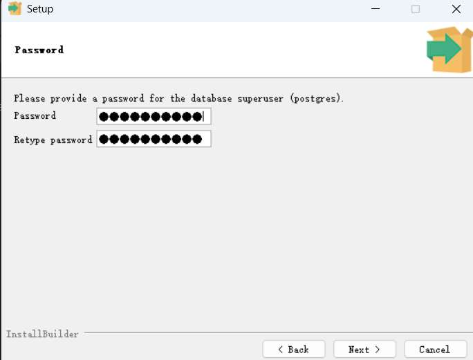
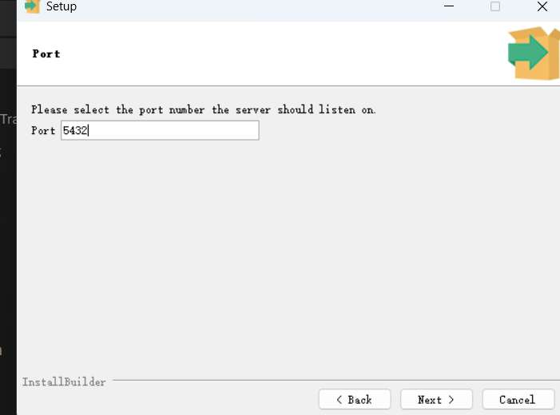
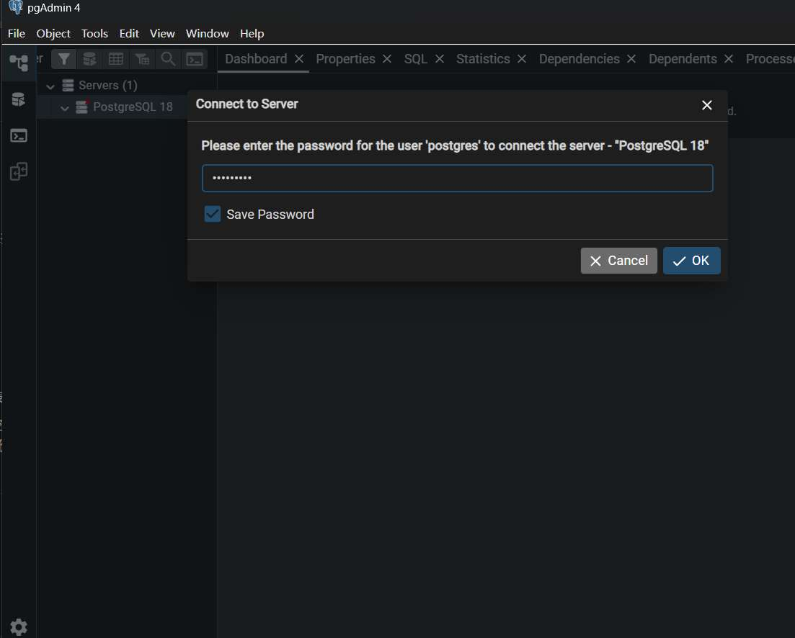
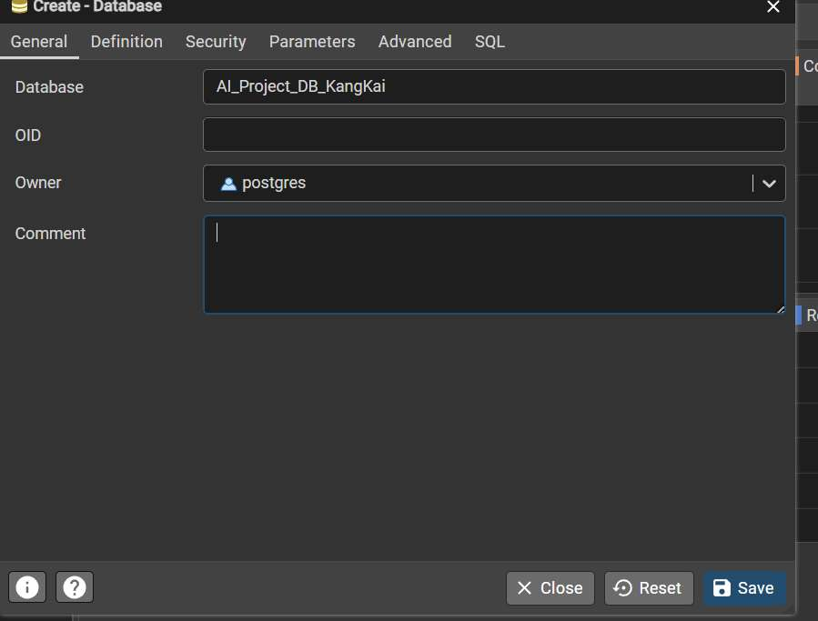
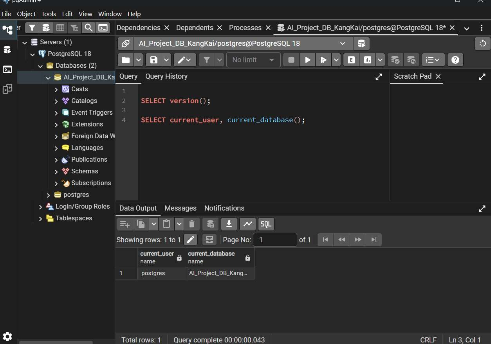
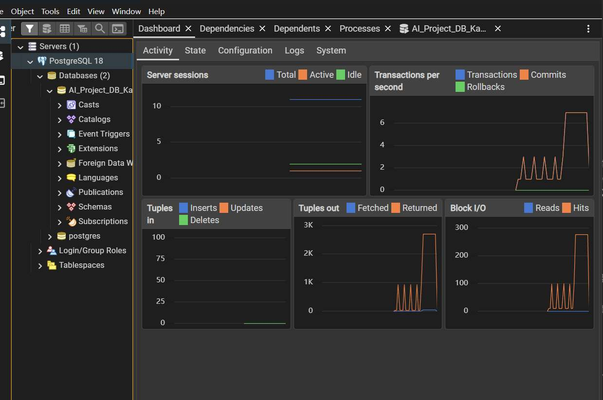
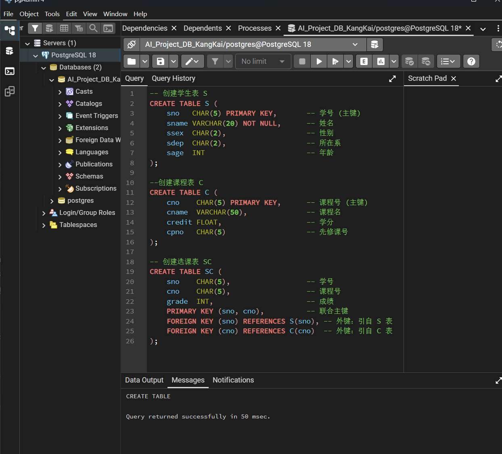

### 1. 左侧树状菜单（资源管理器）：你的“数据集目录”

这是整个数据库的结构树。

- **Databases (2)：** 这里显示你所有的数据库。你已经创建了 AI_Project_DB_KangKai。
    
- **Schemas（模式）：** 点击你的数据库左侧的小箭头，展开后找到 Schemas。再展开 Schemas，你会看到一个 **public**。
    
    - **核心知识：** 在 PostgreSQL 中，表（Tables）不是直接放在数据库下的，而是放在“模式（Schema）”下的。**默认都在 public -> Tables 里**。等会儿我们建完表，就在这里找。
        
- **Extensions（扩展）：** 这个就是以后放 **pgvector**（向量检索插件）的地方。
    

### 2. 中间上部（查询编辑器）：你的“代码实验室”

就是你输入 SELECT version (); 的那个地方。

- 这里是你写 SQL 指令的地方。
    
- **蓝色播放键（或 F5）：** 执行你选中的 SQL 代码。
    
- **软盘图标：** 保存你的 SQL 脚本（可以保存为 . sql 文件，以后重复使用）。
    

### 3. 中间下部（结果面板）：你的“实验报告区”

- **Data Output：** 显示查询出来的表格数据。你刚才看到的 postgres 和数据库名就在这。
    
- **Messages：** 如果你执行代码报错了，或者成功创建了表，这里会提示“Query returned successfully”或者具体的错误代码（比如你刚才遇到的路径非空错误，在这里也会有提示）。
    

### 4. 顶部状态栏：你的“仪表盘”

你会看到一些像心电图一样的波动（Dashboard）。

- **AI 关联点：** 当你以后用 Python 写循环往数据库里塞几百万条 Embedding 向量时，看这里的 CPU 和 Transactions（事务）波动，能帮你判断数据库是否遇到了性能瓶颈。

### 一、实验环境准备与数据库安装

#### 1.1 实验环境说明

- **操作系统：** Windows 11 
- **数据库管理系统：** PostgreSQL 18 
- **管理工具：** pgAdmin 4 
- **AI 开发背景：** 在 AI 项目中，高质量的结构化数据是模型训练的基础。选择 PostgreSQL 是因为它不仅支持标准 SQL，还拥有强大的扩展性（如处理 Embedding 向量的 pgvector 插件），是工业级 AI 特征的首选方案。故而本次实验选择 PostgreSQL 作为熟悉。

#### 1.2 安装过程记录
1. **安装程序启动：** 运行 PostgreSQL 安装包，选择安装服务器、pgAdmin 4 等核心组件。
2. **服务器参数配置：** 设置超级用户 postgres 的密码，并配置默认服务端口为 5432。

kkdatabase

### 二、 数据库初始化与个人操作痕迹展示

#### 2.1 创建个性化实验数据库

为体现操作的真实性并模拟多项目管理环境，我手动创建了一个以个人身份命名的数据库。

- **数据库名称：** AI_Project_DB_KangKai

- **操作痕迹说明：** 如下图所示，清晰可见我本人命名数据库实例过程

### 三、 数据库基本操作验证（截图点）

#### 3.1 环境连通性测试

在 Query Tool（查询工具）中执行基础 SQL 命令，验证数据库服务的运行状态及当前操作上下文。

- **执行语句 1：** SELECT version();
    
    - 作用： 获取当前数据库内核的详细版本信息。
        
- **执行语句 2：** SELECT current_user, current_database();
    
    - 作用： 确认当前登录身份（postgres）以及所操作的数据库对象。
        

#### 3.2 AI 视角解读

作为 AI 专业学生，我不仅关注查询结果，还通过 pgAdmin 的 **Dashboard（仪表盘）** 观察了数据库的实时监控数据。

- **观测点：** Transactions per second (每秒事务数)
- **专业思考：** 在大规模 AI 模型训练或推理阶段，高频的数据存取对 IO 性能有极高要求。通过可视化界面实时监控事务波动，能有效辅助我们进行模型特征提取阶段的性能调优。
**在实时监控（Dashboard）中观察到了明显的事务波动和 I/O 峰值。通过分析可知，这反映了数据库管理系统（DBMS）在维持高可用性时的固有开销，包括 pgAdmin 的轮询监控、系统元数据的读取以及后台维护进程的操作。在实际的 AI 离线特征库构建中，这种‘背景噪声’提醒我们需要在模型训练的吞吐量与数据库的监控性能损耗之间寻找平衡点**

