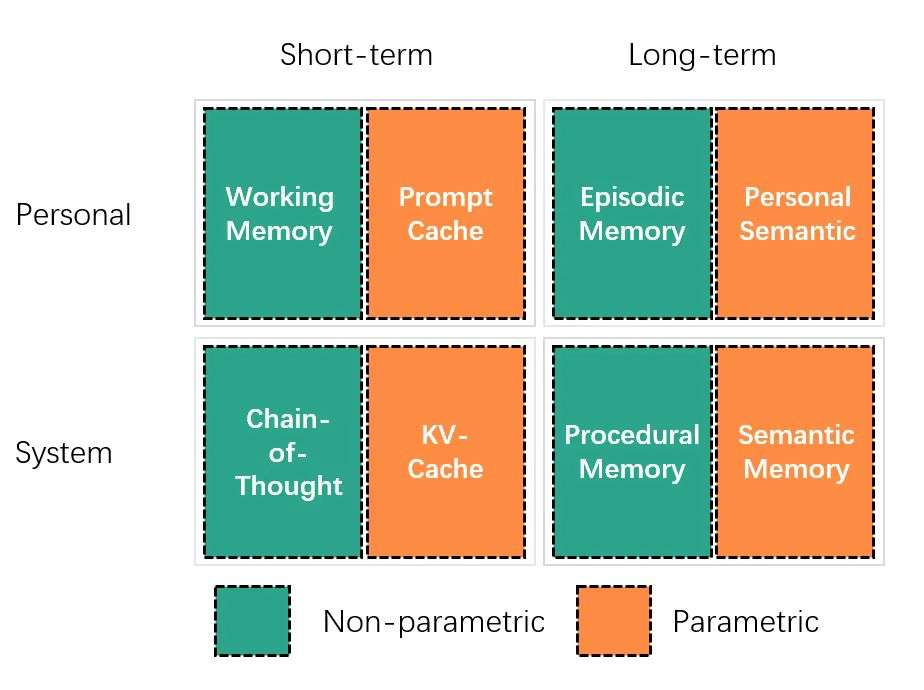
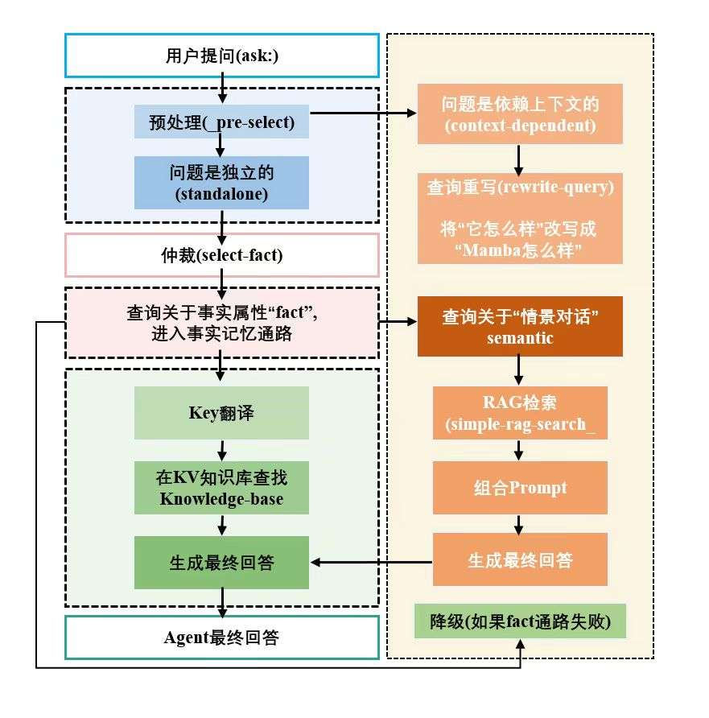

# **为什么LLM需要记忆**
LLM需要记忆吗？ 
在我们日常体验大模型中，豆包、元宝、gpt、gemini... 似乎模型是有记忆的呀 他们完全能记得我们之前说了什么。
- 但当我们历史会话长度非常长时，模型的记忆还准确吗？
- 当我们调用大模型api而不是官网网页/软件时，如果不用history选项，第二次调用api的输出和第一层调用api的输出有关系吗？
- 我们新开一个对话窗口，以往的对话窗口的信息这个新窗口能get到吗？
显然，答案都是NO！
我们的日常体验中模型有记忆，恰恰是因为技术人员给模型进行的技术包装，通过技术强行拥有记忆，我们体验才会如此流畅。而模型本身只知道输入输出，是一种“无状态”，输入输出后就把刚才过程的所有信息忘掉了.

>**像一个只有顶级智商、却没有记忆的金鱼。**


对于记忆问题，业界有两条路径：
- 长上下文机制
- agent记忆
# 业界的解法
## 长下文
既然模型只能看到眼前的东西，那我们就把这东西做的足够大！这就是上下文窗口。
我们每次在跟模型对话时，都把以前的所有历史记录，跟当前的prompt拼接在一起，把它当作输入发送给模型。 当然，本次对话结束后，模型仍然会把我们刚塞给的巨无霸信息忘的一干二净。那接下来呢，就再来一次！把前面的历史信息和上一个prompt再次拼接到当前的prompt。所以长下文机制是一次性地、暴力的。
这也是为什么，我们用网页和模型问答时，用的时间越久“网页越卡”， 其实是prompt越来越长，模型需要很长时间响应。跟模型聊了100天的你发了个“你好”，你以为模型很快就回复你，实际上它要先处理那100天的信息 + “你好” 两个字，所以回复起来也慢吞吞的。

目前的大厂商，如何设计长下文机制，使得窗口能容纳更多，且响应能尽可能更快点呢？
关键在于模型架构，和注意力机制的优化！
我们来看看；
- **Gemini**：引入更高效的专家混合架构
- Claude：在注意力机制优化的应用上做大量工作
- Deepseek：25/9/29 v3.2-exp引入稀疏注意力架构
- **Llama**：其系列开创了分组查询注意力机制的先河

注意力机制优化为什么解决长上下文的问题？
通俗来讲，我们把信息全部收录，但让模型关注的信息，可能只需要和它“附近”的词（滑动窗口注意力），或者和一些被选出来的“关键代表词”（稀疏注意力）就够了，也可以让注意的过程更加快速，减小不必要的时间支出（flash attention）。
而模型架构呢？
无论是deepseek引起火爆的专家系统，还是元宝在应用的mamba架构，都是尽可能减少计算的流程（专家系统）和时间复杂度（mamba）
我们可以理解为，我们看到的这些模型上突破的技术，其目标之一就是让大模型这个金鱼，更加聪明，以至于就算忘的快也不影响体验！
## agent记忆机制

和暴力的长上下文机制不同，agent记忆机制是借鉴于大脑的记忆机制。我们和模型的聊天记录就是信息，记忆机制会妥善管理这些信息。 我们不是每次给金鱼看一堆信息，而是有选择的看。
注意，和上文所讲注意力优化不同，注意力优化是信息全部塞给金鱼，但是有选择的注意。现在我们是，信息就有选择的塞给金鱼。

下面使用业界框架langchain对记忆的管理为例子：
langchain记忆管理的核心思想是**将“记忆的管理”与“AI的核心逻辑”分离开**。
- 你的“Chain”或“Agent”，只负责思考和回答。
- 而“Memory”对象，则像一个**外挂的“黑匣子”**，专门负责在每次对话前后，**自动地读取和写入记忆**。

那么到底如何管理记忆的呢？
- ConversationBufferMemory：把所有的对话历史，原封不动地一句一句地记录下来。然后在下一次调用时，把**所有**的历史记录，全部塞进Prompt里。
- **ConversationBufferWindowMemory**： 它只保留**最近的 k 轮**对话。比如你设置k=5，它就会永远只记住最近的5轮问答，更早的会自动丢弃。
- **ConversationSummaryMemory**：它不再傻乎乎地记录所有对话。而是在每一轮对话结束后，它会**调用一次LLM**，把**到目前为止的所有对话**，动态地**总结**成一段摘要。在下一次调用时，它就把这个**不断变长的“摘要”**，塞进Prompt里。
- **VectorStoreRetrieverMemory**：它会把每一轮的对话，都**向量化**后，存入一个你指定的向量数据库。在下一次调用时，它会先拿**当前的用户问题**，去向量数据库里进行一次**相似度搜索**，找出最相关的几条历史对话，然后只把这几条“**相关记忆**”，注入到Prompt里

可以看到第一个ConversationBufferMemory其实就是我们讨论的长上下文机制，但是记忆管理就能做到不同的场景应用不同的记忆组件！

LangChain为我们提供了一个功能强大的“**记忆工具箱**”，它让我们能根据不同场景，像搭积木一样选择不同的记忆策略。
**然而，这还不够。** 
LangChain的记忆，本质上还是一些**被动**的“数据容器”。如果我们想让AI的记忆系统真正接近人脑，它就不能只是一个被动的“仓库”，而应该是**主动的管理**。
于是，社区里涌现出了更前沿的、专门的记忆框架，它们试图回答一个更深刻的问题：

>“**AI能否学会如何管理自己的记忆？**”

我们以GitHub上收获40k Star的明星项目Mem0为例
记忆类型：
- **Working Memory**: 短期对话记忆
- **Factual Memory**:长期的结构化知识（例如，偏好、设置）
- **Episodic Memory**: 记录特定的过去对话
- **Semantic Memory**: 随着时间的推移建立一般知识
工作、事实、情景、语义，四方面
在记忆机制工作时，是“**LLM-based extraction**”，大模型自己选择要记忆什么。
举例，它会去扫描新存入的记忆，然后决策：“这条信息很重要，我应该把它提炼一下，放入核心记忆”、“这两条记忆其实说的是一回事，我应该把它们合并”、“这条记忆太久没用了，而且不重要，我可以降低它的权重甚至‘遗忘’它”。
另外，Mem0不仅能记住对话，还能记住**工具（API）的使用情况**。
比如，它会记住：“上次用户问天气时，我调用了XX天气API，并且成功了。” 下次再遇到类似请求，它就能更快地选择正确的工具。这对应了论文中的“**系统记忆**”或人脑的“**程序性记忆**”。
**简单来说**：Mem0 不再是一个被动的数据库，它是一个**活的、会自己整理笔记、自己划重点、自己反思总结的“智能记忆系统”**

# 学术界的探索
我们一直在说，让ai的记忆机制“像人类的大脑”。
这里，我想详细展开一下，到底怎样才算”像“，到底怎样我们的记忆机制才算”好“?
我们解析一篇华为诺亚方舟实验室带来的文章：
《From Human Memory to AI Memory: A Survey on Memory Mechanisms in the Era of LLMs》
文章地址：https://arxiv.org/abs/2504.15965

## 记忆的分类

### AI记忆分类
在此之前，大家谈论AI记忆，大多只停留在“短期/长期”这一个维度上。这篇论文提出了“**三维八象限**”的分类法，为这个混乱的领域，带来了秩序。
1. 维度一：对象，记录的对象，是**个人**的、用户的信息，还是**系统**的、ai助手的信息？
2. 维度二：形式，记忆的方式，是改变模型**参数**的记忆（刻在模型脑子里），还是不改变参数的**非参数**记忆（存储于模型外部的记事本）
3. 维度三：时间，记忆时间的长短，是可销毁的**短期**记忆，还是一直保存的**长期**记忆？

**记什么、怎么存、记多久**。用这三把尺子一量，AI的记忆系统，一下子就被划分进了8个清晰、独立的‘功能区’。比如RAG系统，它的坐标就清晰地落在了‘**个人-非参数-长期记忆**’这个象限。AI 解编程题时的推理步骤。 就是”**系统 + 非参数 + 短期记忆**“这个象限



### 人脑记忆分类
我们看看，ai记忆分类是否对应上了人脑的记忆分类
1. 主动回忆的外显记忆：一类是情景化的，”我小时候买的玩具车的样子“，一类是常识性的，”9.3是**中国人民抗日战争暨世界反法西斯战争胜利**纪念日“
2. 不用回忆的内隐记忆：肌肉记忆形成的打字，打球，走路
3. 时间上：长期记忆，能存几分钟到一辈子的，短期记忆，前五秒看到的路人模样，可能一分钟后就忘一干二净。


这样看来，我们就能清晰地定位
- AI的**参数/非参数记忆**，就像人脑的**内隐/外显记忆**。一个是被动技能，一个是主动知识。
- AI的**长期/短期记忆**，更是直接照搬了人脑的时间划分。
- 甚至，在非参数的“外显记忆”中，我们可以进一步细分：
    - 用**键值对或知识图谱**来存储的，就像人脑的“**语义记忆**”（常识知识）。
    - 用**向量检索**来存储的，就像人脑的“**情景记忆**”（个人经历）。


## 记忆核心阶段
论文总结了，无论多复杂的长期个人记忆系统，其工作流程都逃不开**四个核心阶段**：
### **记忆构建**
如何从乱糟糟的对话里，提炼出有价值的信息？
提取信息类似于人类的记忆巩固 —— 即稳定并强化记忆以实现长期存储的过程。结构清晰的长期记忆既能提升用户记忆的存储效率，也能增强其检索有效性
论文提出，研究人员开发了多种存储格式，多种存储格式，包括键值对、图结构和向量表示：

- 键值对格式 ：便于高效访问用户事实、偏好等结构化信息；
- 图结构格式 ：用于捕捉和表示个体、事件等实体间的关系；
- 向量格式 ：通常由文本、视觉或音频记忆表示转换而来，用于编码对话的语义含义和上下文信息。

### 记忆管理
如何对记忆进行更新、合并、甚至遗忘？
论文提出的例子：
- 反思 ：让AI像人一样，定期“复盘”自己的记忆，从中提炼出更深刻的见解和摘要。
- 自组织 ：借鉴“卡片盒笔记法”，让记忆不再是孤立的条目，而是像一张知识网络一样，动态地建立关联、演化生长。
- 模拟遗忘 ：模仿人脑的“艾宾浩斯遗忘曲线”，让AI能够根据时间或重要性，逐渐淡化甚至忘记那些不再重要的信息，从而保持记忆库的清爽和高效。

### 记忆检索
如何根据问题，快速找到相关的记忆？
- 针对键值对记忆：我们可以通过关键词索引快速定位
- 针对图结构记忆：知识图谱，召回更相关的记忆
- 针对向量记忆：采用高效向量数据库建立索引，基于相似度进行检索

## 未来的展望

尽管当前在 “对象、形式、时间” 三个维度及对应的八个象限中，记忆研究已取得显著进展，但仍存在诸多开放性问题与挑战。
论文提出几个核心展望
- 模型不能光记录单一类型数据，还要记录图像、音频、视频等多模态，并且记忆机制里把他们联系起来最好！
- 和人类记忆的多层级多维度的复杂记忆机制相比，当前大模型记忆机制的分类还是太单调！我们能否从当前的“特定记忆”升级到“全面记忆”，有一个对所有方面记忆的“整体感知”？
- 当前的记忆是独属于单个agent，有时甚至局限于特定领域、特定任务，就比如我们微调的医疗大模型和微调的法律大模型。我们能否让他们共享记忆？以推动更复杂的多领域挑战？
- 当前我们的记忆机制仍然是人工设计规则，规则驱动演化。未来能否通过利用个人记忆和系统记忆，根据不断变化的数据和环境上下文动态调整并优化自身，减少对人工干预的依赖？


# 从零徒手，构建一个“迷你记忆大脑”


## 设计哲学
首先我们针对人脑的外显记忆，去设计ai的非参数记忆。
如上文介绍过，外显记忆分为情景记忆和事实记忆。
我们设计一个仲裁模型，去判断。
- 最简单的是事实记忆，  
将记忆提取成**结构化数据**，放进knowledge_base记忆库里。
如："我叫kk,我最喜欢的编程语言是Python." 
knowledge_base将更新如下
{'user_name': 'kk', 'favorite_programming_language': 'Python'}。

- 对于情景记忆，我们就使用最传统最简单的rag流程。
	这里简单介绍下rag：
	- 将自然语言转化为向量，存储到向量数据库
	- 每一个句子都会和其他句子有关联，向量也是如此
	- 当我们有一个目标向量时，就可以根据相似度，找出与之相似的向量
	- 对应到句子来说，就是将数据库里与目标句子句意相同的句子找出来
将所有对话存储到向量数据库里，这个记忆我们称episodic_memory。
当与用户的对话，是情景下的，或者需要检索之前的记忆，就用rag流程去episodic_memory寻找相关片段。

## 系统架构


为了实现我们“事实记忆”和“情景记忆”分离的设计哲学，我们构建了一个三层决策的智能大脑
当用户提出一个问题（ask:），我们的 **`_pre_select`**  会率先介入。它会利用短期记忆（history）判断：这个问题是本身就清晰明了（standalone），还是包含了“他/她/它”这类需要联系上下文才能理解的代词（context_dependent）？
如果是后者，我们的 **`_rewrite_query`** 就会登场，将模糊的问题，改写成一个独立的、无歧义的“标准陈述”。

无论是原始问题还是改写后的问题，现在都变成了一个清晰的query。接着，我们的核心调度器 **pipeline** 会让“仲裁官” **`_select_fact`** 对query进行定性：这个问题，是关于一个**用户的固有属性**（fact_lookup），还是需要我们去**翻阅过去的案卷**（semantic_search）？

- **如果定性为 fact_lookup**，**`_translate_question_to_key`** 会从问题中提取出问题的索引（key），然后我们就能从事实记忆库 knowledge_base 中，快速定位到答案。

- **如果定性为 semantic_search**，我们的RAG引擎 **`_simple_rag_search`** 会启动，它会深入情景记忆库 episodic_memory，通过向量相似度，检索出最相关的历史对话片段。


### 系统架构图

```
+----------------------------------------------------------------------+
|                           用户提问 (ask:)                            |
+----------------------------------------------------------------------+
                                  |
                                  V
+----------------------------------------------------------------------+
|                  [大脑前额叶：智能决策中心]                          |
|                                                                      |
|  1. 预处理 (_pre_select)      ->  问题是独立的(standalone)还是依赖上下文的(context_dependent)? |
|                                  |                                       |
|  2. 查询重写 (_rewrite_query) ->  (如果是依赖的) 将 "它怎么样？" 改写成 "Mamba模型怎么样？"     |
|                                                                      |
+----------------------------------------------------------------------+
                                  | (得到一个清晰、独立的查询 query)
                                  V
+----------------------------------------------------------------------+
|                     [调度中心: _pipeline]                            |
|                                                                      |
|  3. 仲裁 (_select_fact)       ->  查询是关于"事实属性(fact)"还是"情景对话(semantic)"?  |
|                                                                      |
+------------------------+---------------------------------------------+
|                        |                                             |
V                        V                                             V
[事实记忆通路]         [情景记忆通路]                                [降级]
(如果_select_fact是fact) (如果_select_fact是semantic)           (如果fact通路失败)

+------------------------+---------------------------------------------+
| 4a. Key翻译             | 5a. RAG检索                                |
|   (_translate_...)     |   (_simple_rag_search)                      |
|                        |                                             |
| 4b. 在KV知识库中查找     | 5b. 组合Prompt                              |
|   (knowledge_base)     |                                             |
|                        |                                             |
| 4c. 生成最终回答         | 5c. 生成最终回答                             |
+------------------------+---------------------------------------------+
                                  |
                                  V
+----------------------------------------------------------------------+
|                           Agent最终回答                              |
+----------------------------------------------------------------------+
```


### 核心组件

- extract_fact 输入用户的话，提取其中的fact
- select_fact 输入用户的话，输出fact或semantic
- pre_select 判断是情景的还是非情景 
- `_translate_question_to_key` 将用户的问题提取出一个关键词（用于去knowledgebase找对）
- add_statement_to_memory 添加到episodic_memory
- `_rewrite_query`  根据对话历史，将可能依赖上下文的问题，改写为独立问题。
- `_perform_semantic_search`   执行一次完整的语义搜索并返回最终答案。这是一个可被复用的核心组件。
- pipeline 路径一：尝试事实查找，# 如果 key 没有找到，或者 key 找到了但 information 是空的 我们不直接放弃，而是自动降级，去尝试语义搜索；--- 路径二：直接进行语义搜索 ---
- `_simple_rag_search`  去episodicmemory计算相似度
- answer_question 接收用户问题，经过完整的记忆回忆流程，返回最终答案。
其他模块
llm_client.py  
prompts.py

### pipline模块

```python
def _perform_semantic_search(self, query: str) -> str:

        """

        执行一次完整的语义搜索并返回最终答案。

        这是一个可被复用的核心组件。

        """

        print(f"--- (Fallback) 启动语义搜索来回答: '{query}' ---")

        retrieved_info = self._simple_rag_search(query)

        if not retrieved_info:

            # 如果RAG没找到东西，就让LLM直接回答

            final_prompt = f"你是一个乐于助人的助手。请直接回答用户的这个开放性问题。\n\n用户问题: {query}\n\n你的回答:"

        else:

            # 如果RAG找到了东西，就用上下文来回答

            context_str = "\n---\n".join(retrieved_info)

            final_prompt = f"""你是一个知识渊博且善于总结的助手。请根据以下可能相关的历史对话，来回答用户的最终问题。请不要直接复述历史对话，而是要从中提炼和总结信息。

  

    # 相关历史对话:

    {context_str}

  

    # 最终用户问题:

    {query}

  

    # 你的回答:

    """

        messages = [{"role": "system", "content": final_prompt}]

        answer = self.client.call_for_text(messages)

        return answer or "抱歉，我找到了信息但组织语言时出错了。"

  
  

    def pipeline(self, query: str) -> str:

        category_data = self.select_fact(query)

        if not category_data:

            return "抱歉，我没判断出你的问题类型"

        category = category_data.get('type')

        print(f"--- 问题被分类为: {category} ---")

  

        # --- 路径一：尝试事实查找 ---

        if category == 'fact_lookup':

            available_keys = list(self.knowledge_base.keys())

            key = self._translate_question_to_key(query, available_keys)

            print(f"问题映射到的Key是: {key}")

  

            if key:

                information = self.knowledge_base.get(key)

                if information:

                    print("--- 在事实记忆中找到答案！ ---")

                    final_prompt = f"你是一个乐于助人的助手。请根据以下信息，用自然语言回答用户的问题。\n\n已知信息: '{key}' 是 '{information}'.\n\n用户问题: {query}\n\n你的回答:"

                    messages = [{"role": "system", "content": final_prompt}]

                    answer = self.client.call_for_text(messages)

                    return answer or "抱歉，我找到了信息但组织语言时出错了。"

  

            # 如果 key 没有找到，或者 key 找到了但 information 是空的

            # 我们不直接放弃，而是自动降级，去尝试语义搜索

            print("--- 事实查找失败，自动降级为语义搜索 ---")

            return self._perform_semantic_search(query)

  

        # --- 路径二：直接进行语义搜索 ---

        elif category == 'semantic_search':

            return self._perform_semantic_search(query)

        else:

            return "抱歉，我无法识别这个问题类型。"

```

### 简易rag模块

```python
def _simple_rag_search(self,query, top_k:int = 3):

        if not self.episodic_memory:

            return []

        query_embedding =self.embedding_model.encode([query])[0]

        docs = [item['text'] for item in self.episodic_memory]

        doc_embeddings = np.array([item['vector'] for item in self.episodic_memory])

        # 计算相似度

        similarities = []

        for i, doc_embedding in enumerate(doc_embeddings):

            similarity = 1 - cosine(query_embedding, doc_embedding)

            similarities.append((similarity, docs[i]))

  

        sorted_similarities = sorted(similarities,key = lambda x:x[0], reverse = True)

        return [doc for similarity, doc in sorted_similarities[:top_k]]

```


## 测试环节：

### 事实提取测试
```python
  
statement1 = "我是kk。"

statement2 = "我感觉今天有点累。"
  

fact1 = memory_system.extract_fact(statement1)

fact2 = memory_system.extract_fact(statement2)


```
从 '我是kk。' 提取的事实是: {'user_name': 'kk'} 
从 '我感觉今天有点累。' 提取的事实是: {}


### 完整对话测试
```python
chat_history = []

  

while True:

    user_input = input("\n> ")

  

    if user_input.lower() == 'exit':

        print("Agent已关闭。")

        print("\n--- 本次会话的短期记忆 ---")

        import json

        print(json.dumps(chat_history, indent=2, ensure_ascii=False))

        break

    # 解析指令

    if user_input.startswith("learn:"):

        statement = user_input[len("learn:"):].strip()

        # 准备好 learn 指令的用户部分和Agent部分

        user_part = user_input # 我们记录完整的指令

        agent_part = f"好的，我已经记住了关于'{statement[:10]}...'的信息。"

        print(f"Agent: {agent_part}")

        memory_system.add_statement_to_memory(statement, agent_part)

        # 更新短期记忆

        chat_history.append({"role": "user", "content": user_part})

        chat_history.append({"role": "assistant", "content": agent_part})

    elif user_input.startswith("ask:"):

        question = user_input[len("ask:"):].strip()

        chat_history.append({"role": "user", "content": question})

        answer = memory_system.answer_question(question, history=chat_history)

        print(f"Agent: {answer}")

        memory_system.add_statement_to_memory(statement, answer)

        chat_history.append({"role": "assistant", "content": answer})

    else:

        print("指令无法识别，请使用 'learn: ' 或 'ask: '")

```

测试结果：
```txt

--- Agent记忆系统已启动，请输入指令 ---
指令格式:
  'learn: [一句话]'  -> 让Agent学习一个新知识
  'ask: [一个问题]'   -> 向Agent提问
  'exit'             -> 退出程序
Agent: 好的，我已经记住了关于'这几天是国庆节...'的信息。
未提取到事实，知识库保持不变。
当前知识库: {}

Agent: 好的，我已经记住了关于'我喜欢的饮料是冰红茶...'的信息。
成功提取到事实: {'favorite_drink': '冰红茶'}
知识库已更新！
当前知识库: {'favorite_drink': '冰红茶'}

这是情景回答，需要查询重写，然后进入流水线
--- 启动查询重写 ---
原始问题: '我最喜欢的饮料是？'
重写后的问题: '我最喜欢的饮料是什么？'
--- 问题被分类为: fact_lookup ---
问题映射到的Key是: favorite_drink
--- 在事实记忆中找到答案！ ---
Agent: 根据已知信息，您最喜欢的饮料是冰红茶。
成功提取到事实: {'favorite_drink': '冰红茶'}
知识库已更新！
当前知识库: {'favorite_drink': '冰红茶'}

这是情景回答，需要查询重写，然后进入流水线
--- 启动查询重写 ---
原始问题: '你知道我为什么在家里休息吗？'
重写后的问题: '根据已知信息，你知道我为什么在家里休息吗？'
--- 问题被分类为: semantic_search ---
--- (Fallback) 启动语义搜索来回答: '根据已知信息，你知道我为什么在家里休息吗？' ---
Agent: 根据我们之前的对话记录，您提到过“这几天是国庆节”。国庆节通常是法定节假日，因此您可能因为假期而在家休息。不过，关于您休息的具体原因，目前已知信息中并没有更详细的说明。
当前知识库: {'favorite_drink': '冰红茶'}


```


# 总结与展望

虽**建造了一座“茅草屋”，但绘制了“摩天楼”的蓝图**
我们从一片空白的代码文件开始，亲手搭建起了一个“迷你记忆大脑”的核心骨架。
尽管它还很初级——记忆会在程序关闭后消失，RAG引擎也只是一个最简陋的原型——但我们通过这次“从0到1”的旅程，取得了比代码本身更有价值的成果：
1. 我们验证了一套“事实记忆+情景记忆”双轨并行、并能智能降级的混合记忆架构**是完全可行的。
2. 我们绘制了一幅清晰的**智能决策流水线蓝图**，它让我们的Agent在处理复杂问题时，表现得不再像一个被动的工具，而更像一个主动的思考者。
3. 最重要的是，我们通过实践，深刻体会到了AI记忆系统在面对不确定性时的挑战，并探索出了一套属于我们自己的、兼具效率与稳健性的解决方案。

对照开源框架，我们亲手实现的原型只能算概念验证原型，至少存在以下几个“软肋”
- **记忆的临时性**: 所有的记忆都存储在内存中，一旦程序关闭，我们的Agent就会变回那条“金鱼”。我们还没有为它安装一个**持久化的“记忆库”**（如文件或数据库存储）。
- **RAG的“简单粗暴”**: 我们的语义检索，还停留在最原始的阶段。我们没有实现工业级的“父子文档”切割、**多路召回**和**精排模型**，这使得它在面对大量、复杂的对话历史时，检索的精准度还有待提高。
- **管理的空白”**: 我们的记忆只会被动地“堆积”，而不会被智能地“管理”。它还不会**处理冲突**，也学不会**遗忘**那些过时、无用的信息。
- **prompt的依赖**：现阶段的仲裁、情景判断等，都是使用prompt驱动大模型api，若数据并发大，成本将会很高昂，
如果要探索更加成熟的agent记忆框架，还需引入更精密的数据工程、更强大的检索策略、构建闭环的数据飞轮，赋予agent记忆管理模块，探索多模态记忆的融合。

欢迎访问GitHub项目！
https://github.com/xduerkkkk/llm_memory_from_scratch


