#  **软件安装与图数据库使用问题总结**

## 软件安装 (JDK 和 Neo4j)
### Java 开发环境 (JDK) 配置不当**
Neo4j 是一个用 Java 编写的软件，它的运行强依赖于 JDK 环境。在安装完 JDK 后，如果没有正确配置系统环境变量，命令行（无论是 CMD 还是 PowerShell）将无法识别 java 命令，导致 Neo4j 启动失败，提示类似“java 不是内部或外部命令”的错误。
- **解决方法**：
    1. **配置 JAVA_HOME**：在系统的环境变量中，新建一个名为 JAVA_HOME 的变量，其值指向 JDK 的安装根目录（例如 C:\Program Files\Java\jdk-11.0.1）。
    2. **配置 Path**：在系统的 Path 变量中，添加一个新的条目 %JAVA_HOME%\bin。
    3. **验证**：配置完成后，**必须重启**命令行工具，然后输入 java -version。如果能成功显示 Java 的版本信息，则证明配置成功。
- **心得体会**：我认识到，软件安装并不仅仅是“下一步”和“完成”。对于很多底层或平台型软件来说，环境变量是非常重要的桥梁。正确配置它，是保证软件正常运行的基础。这个过程也让我学会了如何在 Windows 系统中管理环境变量，这是一项非常基础且重要的IT技能。
### **问题二：Neo4j 启动时的文件权限冲突**
在我尝试用 neo4j.bat start 命令启动 Neo4j 服务时，启动失败。错误日志明确指出：“Owner 'BUILTIN\Administrators' ... and user running this process '...kkkkkk' differs”。这意味着，Neo4j 的安装文件夹是由管理员用户创建的，而我当时用来执行命令的 PowerShell 窗口是普通用户权限，没有足够的权限在 Neo4j 的目录里创建或修改文件（如日志、进程ID文件），导致启动被系统拒绝。
- **解决方法**：
    1. **根本方法**：**以管理员身份运行命令行工具**。通过右键点击 PowerShell 或 CMD 图标，选择“以管理员身份运行”，在新打开的窗口中执行启动命令。这样，命令就拥有了和文件夹所有者匹配的权限，可以顺利读写文
    2. **长久方法**：修改 Neo4j 文件夹的安全权限，为我当前的普通用户（kkkkkk）添加“完全控制”的权限，这样以后就无需每次都用管理员身份启动了。
- **心得体会**：这个问题让我深刻理解了 **Windows 的用户账户控制（UAC）和文件系统权限机制**。权限问题是一个非常常见但又容易被忽略的“坑”。需要仔细阅读日志，这次的错误信息就非常直白地指出了问题所在。它也提醒我，在执行一些需要系统级操作的命令时，要时刻注意自己当前的权限级别。

## **图数据库 (Neo4j) 使用**
在安装成功、开始用 Python 连接和操作数据库时，我又遇到了两个与“连接”和“认证”相关的核心问题。
### **py2neo 库版本更新导致连接代码失效**

- **问题描述**：我最初使用的 Python 脚本在连接 Neo4j 时报错 ValueError: The following settings are not supported: {'http_port': 7474}。这表明我的 py2neo 库是一个较新的版本，它已经不再支持旧版的、通过 host, http_port 等独立参数来连接数据库的方式了。
- **解决方法**：
    1. **更新连接语法**：我查阅了新版 py2neo 的用法，将连接代码从 Graph(host="...", http_port="...") 修改为使用 Bolt 协议的 URI 格式：Graph("bolt://localhost:7687", auth=("neo4j", "你的密码"))。
    2. **理解端口差异**：这个过程也让我明白了 Neo4j 默认会开放两个主要端口：7474 用于浏览器和 HTTP API 访问，而 7687 是专门用于驱动程序（如 py2neo）通过更高性能的 Bolt 协议进行连接的端口。
- **心得体会**：。当遇到库函数报错时，首先应该怀疑是不是版本不兼容的问题。学会查阅官方文档、理解库的版本变更日志，是程序员必备的能力。这也让我认识到不同通信协议（HTTP vs Bolt）在应用场景和性能上的区别。
### **数据库认证失败与密码重置**
在更新了连接代码后，程序又报了一个新的错误：ClientError: [Security.Unauthorized] ... authentication failure。这个错误非常明确：用户名或密码错误。我忘记了自己为 Neo4j 设置的密码。
- **解决方法**：
    1. **密码重置流程**：我通过修改 Neo4j 配置文件 neo4j.conf，暂时禁用了数据库的登录验证（将 dbms.security.auth_enabled 设置为 false）。
    2. **重启服务并修改密码**：重启服务后，无需密码即可连接数据库。此时，我通过 Cypher 命令 ALTER USER neo4j SET PASSWORD '我的新密码' 成功设置了新密码。
    3. **恢复安全配置**：最后，也是最重要的一步，再次修改配置文件，将登录验证重新开启（设置为 true），并再次重启服务。
- **心得体会**：这个问题提醒我，即便是本地开发环境，也应该妥善管理密码。我学习到了 Neo4j 数据库管理的一个重要操作——如何在忘记密码的情况下进行安全重置。这个流程（**停服务 -> 改配置 -> 启服务 -> 改密码 -> 停服务 -> 恢复配置 -> 启服务**）虽然繁琐，但保证了操作的安全性，是一个非常规范的运维流程。

# 操作演示
知识图谱build代码做了什么？
- **read_nodes函数**：脚本逐行读取 medical.json 文件。把所有提到的东西分门别类，同时记录下了这些东西之间的“连接关系”
- **create_graphnodes 函数**：在 Neo4j 数据库里，为类别里的**每一个独立的东西**都创建了一个“节点 Node“，给每一种节点都贴上了一个“标签 (Label)”
- **create_graphrels函数**：查看readnodes函数的连接关系，在 Neo4j 中找到对应的两个节点，然后在它们之间建立一条带方向的“关系 (Relationship)”，这些关系也有自己的“类型 (Type)”
### 查询
查找名为“高血压”的疾病节点。把我们找到的节点 d 返回并显示出来
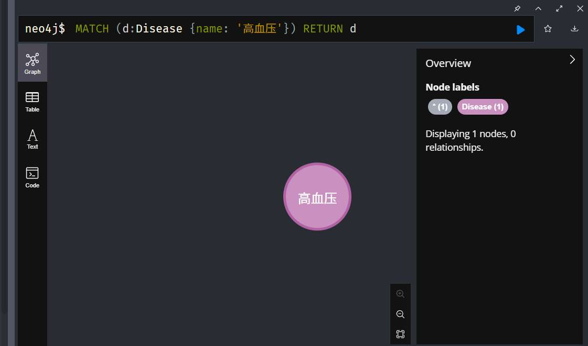
**查询“高血压”的推荐药品**

### 添加

创建一个新的疾病节点“眼底病变”，并建立从“高血压”到“眼底病变”的并发症关系。
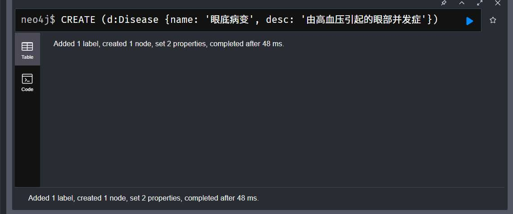
可以看到我们成功创建节点
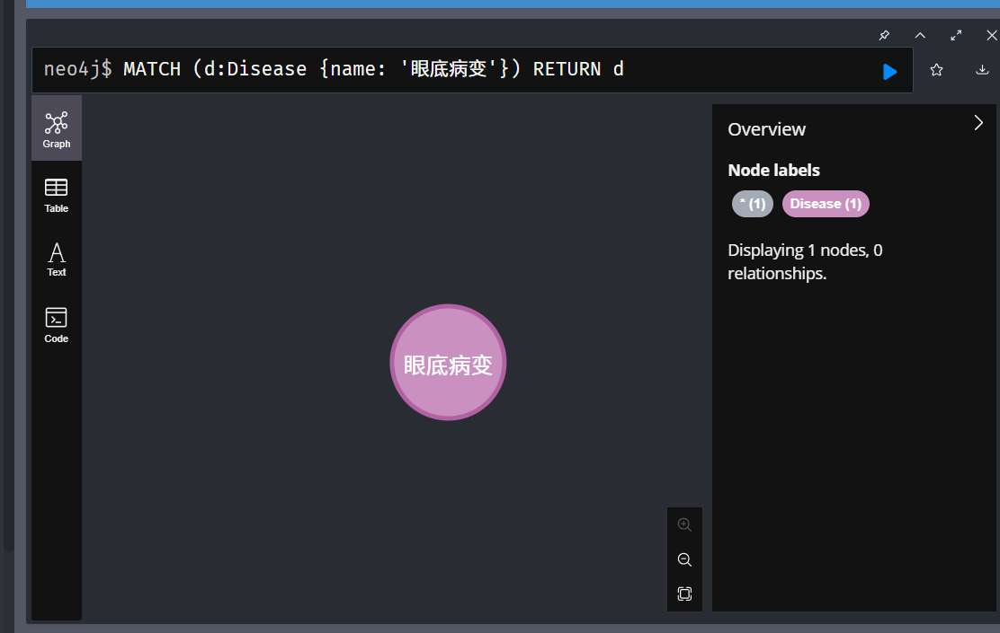
接下来我们建立与高血压的关系
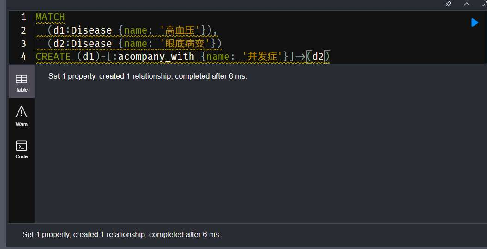
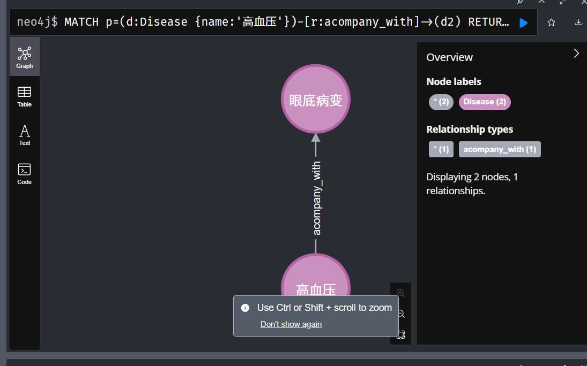

### 修改

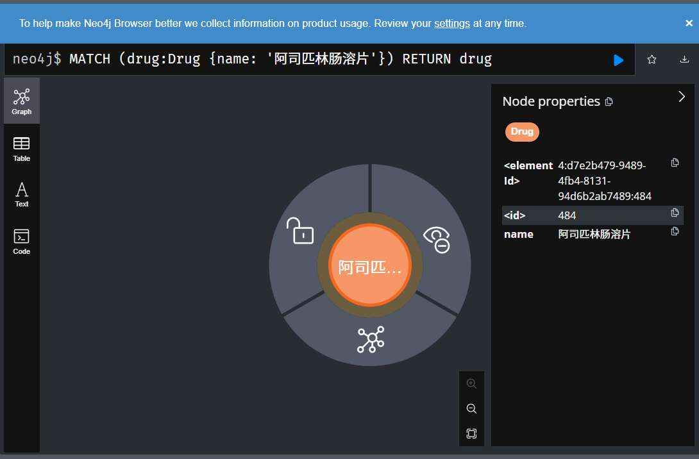
名为“阿司匹林肠溶片”的药品节点没有描述，我们添加一个描述。

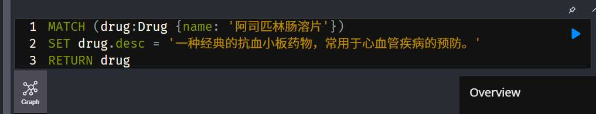

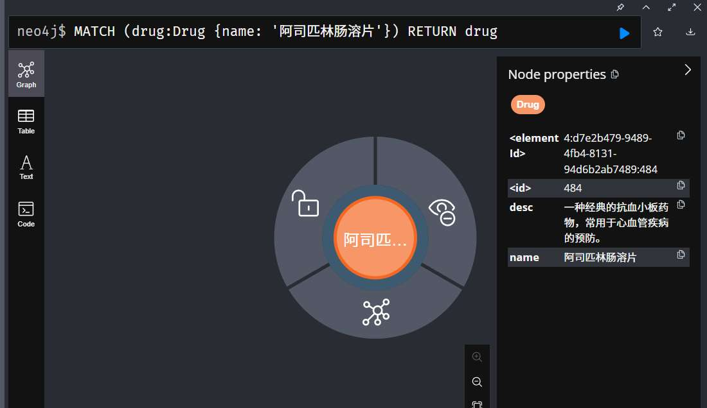

可以看到desc成功显示

### 删除节点

我们再次确认”眼底病变“节点的存在以及其与高血压的连接。
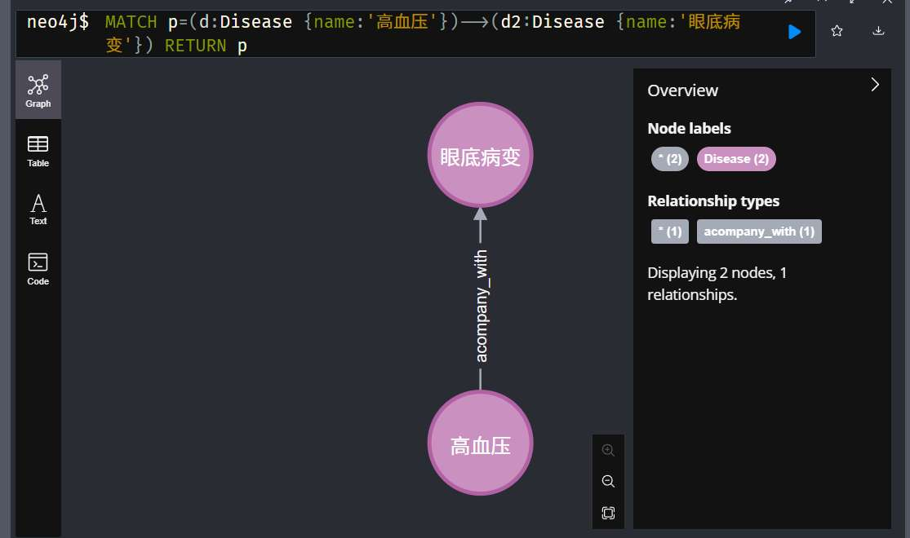
接下来我们进行删除

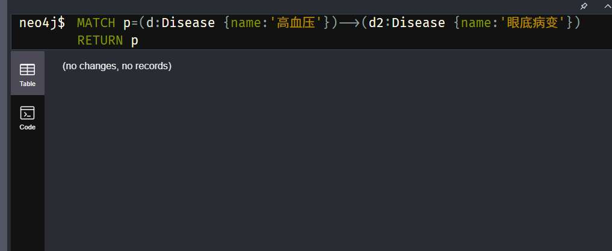
可以看到，再次查询时显示 no changes，no records

# **Neo4j 与 JanusGraph、HugeGraph 的比较**

### Neo4j 的优势 

- **Cypher 查询语言**: Cypher 是一种声明式的、非常直观的语言，它的语法设计得就像用 ASCII 字符“画”出图的模式。相比 JanusGraph 和 HugeGraph 都使用的 **Gremlin**（一种图遍历语言），Cypher 更易于数据分析师和业务人员学习和编写。
    - 对比: Gremlin 更加冗长和程序化，学习曲线更陡峭，更像是给程序员用的 API。  
- **工具链**: Neo4j Desktop 和 Neo4j Browser 提供了极其友好的图形化管理和查询界面。从安装、创建数据库到查询、可视化，整个体验非常流畅。
    - 对比: JanusGraph 和 HugeGraph 通常需要更多手动的命令行配置，并且需要与其他可视化工具（如 Gephi）集成，初始搭建过程更复杂。

- **无索引邻接**。这意味着在物理存储层，每个节点都直接包含指向其邻居节点的“指针”。当进行深度遍历查询时，它会像链表一样顺着指针一路跟过去，速度极快，性能与图的总大小无关，只与查询涉及的局部范围有关。
    - 对比: JanusGraph 和 HugeGraph 将图结构数据存储在底层的键值（Key-Value）数据库中（如 Cassandra, HBase）。它们的遍历实际上是一系列的索引查找，当遍历深度增加时，性能开销会比 Neo4j 更大。    
- **专为图优化的存储引擎**: Neo4j 的存储引擎完全是为图数据结构量身定做的，确保了对图的增删改查操作具有很高的效率。

- **丰富的扩展库**: Neo4j 拥有强大的官方扩展库，这是其他两者无法比拟的。
    - **APOC**: 提供了数百个实用的函数和过程，极大地扩展了 Cypher 的能力，可以处理数据集成、格式转换等各种复杂任务。
    - **GDS **: 内置了如 PageRank、社区发现、路径查找等数十种图算法，让数据科学家可以直接在数据库内进行高级分析，无需将数据导出。
- **庞大的用户社区**: 作为最流行的图数据库，Neo4j 拥有海量的文档、教程、博客文章和活跃的社区（Stack Overflow, Discord），遇到问题几乎总能快速找到解决方案。

- Neo4j 从设计之初就完全支持 ACID（原子性、一致性、隔离性、持久性），这对于需要强数据一致性的应用场景（如金融风控、身份认证、订单管理）至关重要。
    - 对比: JanusGraph 的事务一致性级别取决于其后端存储。例如，使用 Cassandra 时，它只能提供最终一致性，无法满足所有需要强一致性的场景。
---

### **Neo4j 的缺陷 **

- Neo4j 的集群架构采用主从复制模式，所有的写操作都必须由主节点（Leader）处理。虽然可以增加从节点（Follower）来横向扩展**读性能**，但**写性能**的扩展能力有限，最终会受限于单个主节点的处理能力。
    - 对比: **JanusGraph 和 HugeGraph 的核心优势就在于此**。它们构建在 Cassandra、HBase、ScyllaDB 这种天然的分布式数据库之上，可以轻松地通过增加机器来线性地扩展读写性能和存储容量，能够支持比 Neo4j 更大规模的数据集。
- **社区版功能限制**: Neo4j 的免费社区版（Community Edition）是单机版的，不提供集群功能。集群功能是付费企业版（Enterprise Edition）的核心特性之一。

- Neo4j 使用其专有的原生图存储格式。你无法更换底层存储引擎来适应不同的业务需求（比如对成本、一致性、运维复杂度的不同考量）。这在某种程度上造成了**厂商锁定（Vendor Lock-in）**。
    - 对比: JanusGraph 的核心设计哲学就是**存储后端可插拔**。你可以根据需要选择 Cassandra（为可扩展性）、HBase（为强一致性）或 Google Cloud Bigtable。这种灵活性是 JanusGraph 最大的亮点。

- 对于需要集群、高级安全、企业级支持和高级数据科学功能的企业用户来说，Neo4j 企业版的许可费用可能相当昂贵。
    
    - 对比: JanusGraph 和 HugeGraph 都是完全开源的（Apache 2.0 许可证），你可以免费使用它们的所有功能。当然，你可能需要为底层的数据库（如 Datastax DSE）或商业支持付费，但核心的图引擎本身是免费的。
# 导出
源代码已有导出函数，
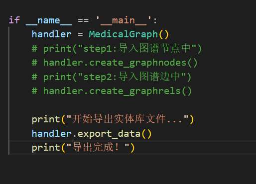
执行效果如下：
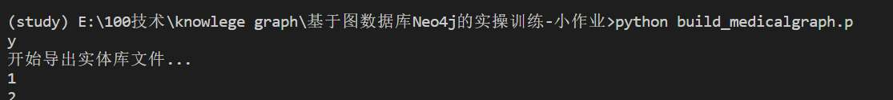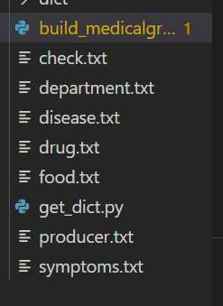

可以看到导出许多txt文件。

## **遇到的问题及解决方法**
### **如何从复杂的图结构中，提取出某一类别的所有实体？**
数据在 Neo4j 中是以节点和关系的形式存在的，而不是像 Excel 表格那样整齐排列。如果我想获得一个包含所有药品名称的列表，我该如何操作？
**解决方法1 (代码中的方法 - 从源文件提取)**：
- **思路**：不直接从 Neo4j 数据库里查，而是回到最原始的 medical.json 数据源。
- **实现**：编写 read_nodes 函数，遍历整个 JSON 文件，把所有 common_drug 和 recommand_drug 字段下的药品名称都收集起来。
- **优点**：逻辑直观，一次解析，既能用于建图，也能用于导出。
- **缺点**：如果数据库后续被人手动修改过（比如添加了新药），这种方法导出的数据就不会包含这些更新。
**解决方法2 (直接从 Neo4j 查询)**：
- **思路**：使用 Cypher 查询语言，直接命令 Neo4j 数据库返回所有药品节点。
- **实现**：在 Neo4j Browser 中运行查询 MATCH (d:Drug) RETURN d.name。这条命令会返回所有标签为 Drug 的节点的 name 属性。然后可以将查询结果导出为 CSV 或手动复制。
- **优点**：导出的永远是数据库**当前最新**的数据。
- **缺点**：需要额外编写查询代码，或者手动操作
### **导出的实体列表中存在大量重复项怎么办？**
在原始数据中，同一种药（比如“布洛芬”）可能会在多种疾病下被推荐，如果只是简单地收集，导出的药品列表里会有很多重复的“布洛芬”。
- **解决方法 (代码中的方法)**：
    - **思路**：利用 Python 中 set (集合) 数据结构的特性。
    - **实现**：在 read_nodes 函数中，所有收集到的实体（药品、食物等）最后都被转换成了 set，例如 return set(drugs), set(foods), ...。set 的一个核心特点就是**自动去重**，无论你往里面加多少个重复的“布洛芬”，最终它只会保留一个。
    - **效果**：确保了最终写入 drug.txt 的是一个干净、无重复的药品清单。
### **导出的数据应该保存成什么格式？**

数据提取出来后，是存成一个文件还是多个文件？是存成 CSV 还是 TXT？

- **解决方法 (代码中的方法)**：
    - **思路**：根据“获取各类型实体库”这个明确的目标，为每一种实体类型（药、食物、症状等）创建一个独立的、简单的文本文件。
    - **实现**：export_data 函数为 Drug, Food, Check 等分别创建了 drug.txt, food.txt, check.txt。文件格式是纯文本，每个实体名占一行。
    - **优点**：这种格式非常便于后续的程序读取和处理，例如在自然语言处理任务中加载成一个词典
## 心得体会
1. **数据导出是数据管理的重要一环**：一个完整的数据项目，不仅要考虑如何存数据，还要考虑如何有效地取数据、用数据。导出功能让存储在图数据库中的知识得以被其他系统复用。
2. **“从源头提取” vs “从仓库提取”**：我认识到导出数据有两种主要思路。一种是像代码一样，回到原始数据源进行再处理（从源头提取）；另一种是直接查询已经建好的数据库（从仓库提取）。后者能更好地保证数据的一致性和实时性，是生产环境中更常用的做法。
3. **善用编程语言的特性事半功倍**：在处理数据去重的问题时，我深刻体会到了 Python 中 set 结构的强大和便捷。如果不知道用 set，我可能需要写复杂的循环和判断逻辑来手动去重，不仅代码冗长，而且效率低下。选择正确的数据结构是高效编程的关键。
4. **数据格式的选择决定了其可用性**：将实体库导出为简单的一行一个的 .txt 文件，看似简单，但其实是“目标驱动”的结果。正是因为我们的目标是“获取实体库/词典”，这种格式才是最合适的。如果目标是给财务人员做报表，那么导出成 .csv 文件会是更好的选择。
