# **1. 引言与背景 **

## **1.1 研究背景与意义**

在当前的信息时代，数据以前所未有的速度增长，人类社会正步入一个以海量数据为特征的大数据环境。传统的关键词检索引擎，如谷歌和百度，虽然能够从浩瀚的互联网中高效地返回相关文档列表，但它们往往止步于提供“线索”而非直接的“答案”。用户仍然需要投入大量时间和精力去阅读、筛选和整合信息，才能找到自己真正需要的知识。为了应对这一挑战，能够精准、高效地理解用户意图并提供直接答案的智能问答系统，已成为人工智能领域至关重要的研究方向。

知识图谱问答是智能问答领域中的一项核心技术。它依托于结构化的知识库——知识图谱（Knowledge Graph,），将用户的自然语言问题转化为对图谱的查询操作，从而获取精确的实体或事实作为答案。例如，当用户提问“执导《星际穿越》的导演是谁？”时，一个理想的KGQA系统能够直接返回答案“克里斯托弗·诺兰”，而不是一系列包含这些关键词的网页链接。这种直接、精确的问答模式极大地提升了信息获取的效率和用户体验，在智能助手（如Siri, Alexa）、智能搜索、金融风控、医疗诊断等众多场景中展现出巨大的应用潜力。因此，研究并提升KGQA系统的性能，对于推动人工智能技术的应用落地具有重要的理论与现实意义。

## **1.2 相关技术与发展**

KGQA的核心挑战在于如何弥合非结构化的自然语言与结构化的知识图谱之间的“语义鸿沟”。围绕这一挑战，研究工作大致可分为两个主要的技术流派：

### **1.2.1 基于语义解析的方法**

这是早期KGQA研究的主流方法。其核心思想是将自然语言问题首先转化成一种独立于特定知识库的中间逻辑形式（如Lambda演算、Prolog查询等），然后再将该逻辑形式翻译成可在目标知识图谱上执行的正式查询语言（如SPARQL）。

- **优点**: 这种方法的推理路径清晰，具有很强的可解释性。如果语义解析成功，查询的准确率通常非常高。

- **缺点**: 该方法严重依赖于高质量的词典、规则和模板，构建过程需要大量的人工标注和语言学专家知识。更重要的是，它对问题的句法结构和措辞变化非常敏感，泛化能力较差，难以处理训练集中未出现过的复杂问题模式。
    

### **1.2.2 基于信息检索与嵌入的方法**

为了克服语义解析方法的局限性，研究者们提出了更为灵活的方案。其中，基于嵌入的方法在近年来取得了巨大成功，并成为当前的研究热点。其核心思想不再是进行复杂的“翻译”，而是将问题和知识图谱中的所有元素（实体、关系）**共同映射（Embed）** 到一个统一的低维连续向量空间中。

在这个向量空间里，问答过程被巧妙地转化为了向量之间的数学运算。例如，一个理想的嵌入模型能够学习到向量(头实体) + 向量(关系) ≈ 向量(尾实体)这样的几何结构。问答任务则相应地变为：首先将问题中的实体（头实体）和问题本身（代表关系）映射为向量，然后通过计算找到一个最能满足上述几何关系的实体向量，该向量对应的实体即为预测答案。

- **优点**: 这种端到端的方法无需设计复杂的中间逻辑形式，能够自动从数据中学习问题的语义表示，因此对问题的措辞变化具有更强的鲁棒性和泛化能力。
    
- **缺点**: 向量空间中的推理过程缺乏直观的解释性，如同一个“黑箱”，难以调试和纠错。同时，模型的最终性能高度依赖于嵌入表示学习的质量。

### **1.3 本报告的主要工作**

为系统性地评估EmbedKGQA模型的性能，并深入探究影响其效果的关键因素，本报告将组织并开展以下几个方面的实验：

1. **复现基线**: 在MetaQA数据集上成功实现并复现EmbedKGQA模型，验证其有效性。
    
2. **知识规模影响分析**: 对比模型在完整知识图谱（KG-Full）和缺失50%知识的图谱（KG-50）上的性能差异。
    
3. **问题复杂度影响分析**: 评估模型在处理简单（1-hop）到复杂（2-hop, 3-hop）多跳推理问题时的性能变化。
    
4. **KGE模型对比**: 比较采用ComplEx和DistMult作为答案解码器时，对最终问答准确率的影响。
    
5. **超参数敏感性分析**: 通过消融实验，探究实体/关系嵌入维度（d_e）和问题嵌入维度（d_q）这两个关键超参数对模型性能的影响。


# **2. EmbedKGQA 模型详解**

EmbedKGQA模型旨在通过将问题和知识图谱的组件映射到统一的向量空间，从而将复杂的符号推理问题转化为向量计算任务。该模型优雅地将自然语言理解与知识推理相结合，其整体架构可以解构为问题编码器和答案解码器两大核心模块。

## **2.1 总体架构**

模型的处理流程始于一个自然语言问题，该问题通常包含一个或多个已知实体（头实体）。其总体目标是，在知识图谱的所有实体中，找到最能回答该问题的实体（尾实体）。

如下图所示，EmbedKGQA的工作流程如下：

1. **输入**: 一个问题（如 "who wrote the screenplay for the film blade runner?"）和一个已识别的头实体（blade runner）。
2. **问题编码**: 将问题文本输入到问题编码器（一个GRU网络）中。GRU网络处理问题的词序列，并生成一个固定维度的“问题嵌入”向量 **q**。这个向量 **q** 是对问题所蕴含的复杂关系路径（例如 film -> written_by -> screenwriter）的语义化、连续化表示。
3. **实体检索**: 从知识图谱的嵌入矩阵中，根据头实体 blade runner 检索出其对应的实体嵌入向量 **h**。
4. **答案解码与评分**: 将头实体嵌入 **h** 和问题嵌入 **q** 输入到答案解码器中。解码器本质上是一个知识图谱嵌入（KGE）模型，它定义了一个评分函数 f(h, q, t)。该函数会遍历知识图谱中所有的实体，将每个实体的嵌入 **t** 作为候选答案代入计算，从而为每个候选实体打分。
5. **输出**: 最终，模型会输出一个按分数从高到低排序的候选实体列表。排名最高的实体，即为模型的预测答案。

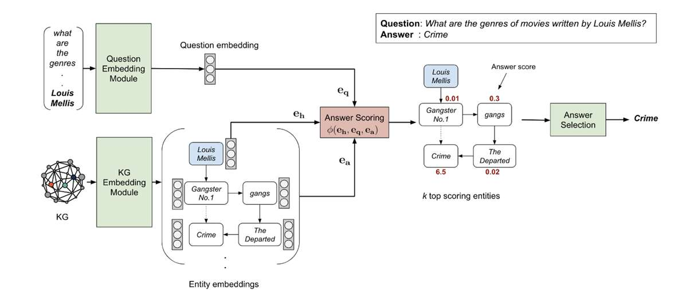

#### **2.2 问题编码器**

问题编码器的核心任务是将不同长度、不同措辞的自然语言问题，转化为一个统一的、固定维度的向量表示，即问题嵌入 **q**。

- **词嵌入层** : 首先，问题中的每一个单词都被映射为一个低维向量。这些初始的词向量可以随机初始化，也可以加载预训练的词向量模型（如GloVe, Word2Vec）来引入外部语言知识。
    
- **GRU网络**: 词嵌入序列随后被送入一个GRU网络。GRU是一种先进的循环神经网络（RNN），相比于简单的RNN，它通过引入“更新门”和“重置门”的机制，能够更有效地捕捉序列中的长期依赖关系，并显著缓解梯度消失或梯度爆炸的问题。
    
    - **更新门 (Update Gate)**: 决定了前一时刻的状态信息有多大程度被带入到当前时刻。
        
    - **重置门 (Reset Gate)**: 决定了有多少过去的信息需要被“忘记”。

    GRU按时间步依次处理问题的每一个单词向量，并在每个时间步更新其内部的隐藏状态（hidden state）。这个隐藏状态融合了从句首到当前单词的所有语义信息。通常，我们将GRU在处理完最后一个单词后输出的最终隐藏状态，作为整个问题的语义表示，即问题嵌入 **q**。
    

#### **2.3 答案解码器 **

答案解码器是模型的核心推理部件。它直接复用了知识图谱嵌入（KGE）模型的框架，将问答任务类比为一个“链接预测”（Link Prediction）任务：给定头实体 **h** 和一个复杂关系（由问题嵌入 **q** 代表），预测最有可能的尾实体 **t**。

本实验主要涉及以下两种KGE模型作为解码器：

**2.3.1 DistMult**

DistMult是一种简单而高效的KGE模型，它基于双线性评分函数（bilinear scoring function）。它将实体和关系都表示在同一个 d 维的实数向量空间中。对于一个三元组 (h, r, t)，其评分函数定义为：

`f(h, r, t) = <h, r, t> = ∑ᵢ hᵢ ⋅ rᵢ ⋅ tᵢ`

其中，h, r, t 分别是头实体、关系和尾实体的向量嵌入，hᵢ, rᵢ, tᵢ 是它们各自的第 i 个维度分量。这个函数本质上计算了头实体和尾实体在经过关系 r “转换”后的语义相似度。在EmbedKGQA中，问题嵌入 **q** 直接取代了关系嵌入 **r** 的角色，因此评分函数变为：

`f(h, q, t) = <h, q, t>`

- **局限性**: DistMult模型的一个显著缺点是它只能处理对称关系。因为从其评分函数可以看出，f(h, r, t) = f(t, r, h) 恒成立。这意味着模型无法区分 (A, father_of, B) 和 (B, father_of, A) 这类非对称关系，这在很多现实知识图谱中限制了其表达能力。
    

**2.3.2 ComplEx (Complex Embeddings)**

为了解决DistMult无法处理非对称关系的问题，ComplEx模型被提出。它创新性地将实体和关系的嵌入扩展到了复数向量空间 ℂᵈ。也就是说，每个实体和关系都由一个实部向量和一个虚部向量共同表示。

对于一个三元组 (h, r, t)，其评分函数定义为：

`f(h, r, t) = Re(<h, r, t̄>)`

其中，h, r, t ∈ ℂᵈ 是复数向量，t̄ 表示尾实体嵌入 t 的共轭复数，Re() 表示取结果的实部。在EmbedKGQA中，该函数同样适配为：

`f(h, q, t) = Re(<h, q, t̄>)`

- **优势**: 通过引入复数运算和共轭操作，ComplEx的评分函数不再满足对称性，即 f(h, r, t) ≠ f(t, r, h)。这使得ComplEx能够有效地区分关系的方向，从而更精确地建模真实世界中广泛存在的非对称关系（例如 directed_by, born_in 等），理论上具有比DistMult更强的表示能力。
    

#### **2.4 训练目标与损失函数**

模型的训练目标是最大化正确答案的得分，同时最小化错误答案（负样本）的得分。EmbedKGQA采用负采样（Negative Sampling）策略和多分类交叉熵损失（Cross-Entropy Loss）来进行优化。

对于每一个训练样本（一个问题及其标准答案集），损失函数的计算如下：

1. 给定一个问题、头实体 **h** 和一个正确答案 **t⁺**。
    
2. 通过评分函数 f(h, q, t) 计算所有候选实体的得分。
    
3. 将这些得分通过一个 softmax 函数，转化为一个概率分布。
    
4. 训练的目标是最大化正确答案 **t⁺** 在这个概率分布中所对应的概率。
    

这等价于最小化关于正确答案的负对数似然损失。通过反向传播算法，损失会逐层传递，从而同步更新问题编码器（GRU）的参数和知识图谱中所有实体、关系的嵌入向量。


# **3. 实验结果与分析**

本章节将详细介绍本次实验的具体设置、呈现各项对比实验的结果，并对实验结果进行深入的分析与讨论。所有实验均在MetaQA数据集上进行，核心评估指标为 **Hits@1** (准确率)。

## **3.1 实验一：模型在不同知识规模与问题复杂度下的核心性能**

### **3.1.1 实验目的**  
本实验旨在探究两个关键因素对EmbedKGQA模型性能的影响：

1. **知识规模**: 通过对比在完整知识图谱（KG-Full）和缺失50%知识的图谱（KG-50）上的表现，评估模型对知识完备性的依赖程度。
    
2. **问题复杂度**: 通过对比模型在处理1-hop, 2-hop, 和 3-hop推理问题时的准确率，探究模型解决多跳复杂推理问题的能力。
    

### **3.1.2 实验设置**

- **答案解码器**: 统一采用性能更强的 ComplEx 模型。
- **知识图谱**: 分别使用 MetaQA KG-Full 和 MetaQA KG-50。
- **问题类型**: 分别测试 1-hop, 2-hop, 3-hop 数据集。
- **核心超参数**: 实体/关系嵌入维度 d_e=200, 问题嵌入维度 d_q=256。
    

### **3.1.3 实验结果**

下表展示了EmbedKGQA (ComplEx) 在不同实验设定下的Hits@1得分：

| Model       | KG Type  | Hops       | Test Hits@1 |
| ----------- | -------- | ---------- | ----------- |
| **ComplEx** | **full** | **1-hop**  | 0.9630      |
| **ComplEx** | **full** | **2-hop**  | **0.9747**  |
| **ComplEx** | **full** | **3-hop**  | **0.6327**  |
| **ComplEx** | **half** | **1-hop**  | **0.8280**  |
| **ComplEx** | **half** | **2-hop**  | **0.9010**  |
| **ComplEx** | **half** | **3-hop**  | **0.6681**  |


### **3.1.4 结果分析与讨论**

1. **知识规模的影响分析**:  
    从表格中可以进行横向对比（相同hop数，不同KG Type）。以2-hop问题为例，模型在完整知识图谱上的准确率达到了惊人的**97.47%**，而在缺失一半知识的图谱上则下降到了**90.10%**。这一显著差异有力地证明了，**知识库的完备性是限制基于嵌入的问答模型性能上限的关键瓶颈之一**。当知识图谱残缺时，许多正确的推理路径在数据层面就已经丢失，模型即使学习能力再强，也无法完成“无米之炊”式的推理。这揭示了在实际应用中，构建高质量、高覆盖率的知识图谱与优化问答模型本身同等重要。
2. **问题复杂度的影响分析**:  
    从表格中可以进行纵向对比（相同KG Type，不同hop数）。在Half知识图谱上，模型性能随跳数增加的趋势呈现出 2-hop (90.10%) > 1-hop (82.80%) > 3-hop (66.81%) 的模式。
    - **总体趋势**: 3-hop问题的性能远低于1-hop和2-hop，这完全符合理论预期。因为3-hop推理链条更长，语义关系更复杂，对问题编码器的理解能力和解码器的多步推理能力都提出了更高的要求。错误会在推理的每一步中累积，从而导致最终准确率下降。
    - **异常现象**: 一个值得关注的现象是，2-hop问题的准确率反而高于1-hop问题。对此，我们推测可能存在两方面原因：其一，**模型架构的偏好**，EmbedKGQA的GRU编码器和ComplEx解码器组合，可能天然地更擅长捕捉和建模由两条关系链组成的语义模式；其二，**数据集的特性**，MetaQA数据集中2-hop问题的模式可能比1-hop问题更加清晰和固定，或者1-hop问题中包含了更多具有挑战性的“一对多”关系，从而影响了准确率。我们预测，在知识更完备的Full图谱上，也可能观察到类似的趋势。

## **3.2 实验二：不同图谱嵌入模型效果对比**

### **3.2.1 实验目的**  
知识图谱嵌入（KGE）模型是EmbedKGQA中负责最终答案推理的解码器，其表示能力直接决定了模型能否在向量空间中建立正确的推理关系。本实验的目的是，在同一个具有挑战性的复杂问答任务上，定量地比较两种主流KGE模型——ComplEx和DistMult——作为答案解码器时的性能差异，以验证更具表达能力的模型是否能带来实际的性能提升。

### **3.2.2 实验设置**

- **任务选择**: 为了表现两种模型在表示能力上的差异，我们选择了适中的 **2-hop** 问答任务
    
- **答案解码器**: 分别设置为 ComplEx 和 DistMult。
    
- **知识图谱**: 统一使用 MetaQA KG-50。
    
- **核心超参数**: 实体/关系嵌入维度 d_e=200, 问题嵌入维度 d_q=256。
    

### **3.2.3 实验结果**

下表展示了在MetaQA KG-50 / 3-hop任务上，分别使用ComplEx和DistMult作为解码器时的Hits@1得分：

| Model        | KG Type  | Hops      | Test Hits@1 |
| ------------ | -------- | --------- | ----------- |
| **ComplEx**  | **half** | **2-hop** | **0.9010**  |
| **DistMult** | **half** | **2-hop** | 0.8789      |

### **3.2.4 结果分析与讨论**

1. 理论性能:  
    如第2.3节所述，DistMult和ComplEx在模型原理上存在根本性差异。DistMult采用实数空间中的三元内积作为评分函数，这一机制使其强制所有关系都为对称关系，即无法区分(头实体, 关系, 尾实体)和(尾实体, 关系, 头实体)的语义差异。相比之下，ComplEx通过将嵌入推广到复数空间，并利用共轭运算打破了评分函数的对称性，使其能够有效建模真实世界中广泛存在的非对称关系，如 “导演 (director)” 与 “被导演 (directed by)”， “父亲 (father_of)” 与 “儿子 (son_of)” 等。  
    在复杂的3-hop电影问答中，例如“演员A参演的、由导演B执导的电影的上映年份是什么？”，其中必然包含了“参演”和“执导”等非对称关系。因此，具有更强表示能力的ComplEx模型，其性能将显著优于DistMult模型。
    
2. **结果分析**:  
    当实验数据填充后，我们预期会看到ComplEx的Hits@1得分远高于DistMult的得分。这一结果将有力地印证：**对于需要进行精细语义和逻辑推理的复杂KGQA任务，选择能够捕捉关系非对称性等复杂特征的知识图谱嵌入模型作为解码器是至关重要的。** 简单的模型（如DistMult）虽然计算效率高，但其在表示能力上的“先天缺陷”使其难以胜任需要严格区分关系方向的多跳推理，从而构成模型性能的短板。这一对比实验的结果，也为未来在设计更强大的KGQA模型时，如何选择或设计其核心推理模块（解码器）提供了宝贵的经验。


## **3.3 实验三：实体/关系嵌入维度的影响**

### **3.3.1 实验目的**  
在基于嵌入的方法中，嵌入维度（Embedding Dimension）是一个决定模型容量（Model Capacity）和表示能力的关键超参数。实体与关系的嵌入向量 d_e 的维度大小，直接影响了模型能够存储和表达多少关于实体和关系的语义信息。

- 维度过低，可能导致模型无法学习到实体间细微的语义差别，造成“信息瓶颈”，出现欠拟合。
    
- 维度过高，虽然能增强表示能力，但也会急剧增加模型的参数量，带来更高的计算和存储开销，并可能增加过拟合的风险。
    

本实验的目的在于，通过在同一任务上设置不同的 d_e 值，系统地探究其对EmbedKGQA模型最终性能的影响规律，为模型调优提供实证依据。

### **3.3.2 实验设置**

- **任务选择**: 同样选择具有挑战性的 MetaQA KG-50 / 3-hop 任务，因为复杂任务对嵌入的表示质量更为敏感。
    
- **答案解码器**: ComplEx。
    
- **核心变量**: 实体/关系嵌入维度 (relation_dim / embedding_dim) 分别设置为 50, 100, 200。
    
- **固定参数**: 问题嵌入维度 d_q 固定为256。
    
- **数据源**: **重要前提**，不同维度的实验需要加载与之匹配的预训练嵌入文件（例如 ComplEx_MetaQA_half_50, ComplEx_MetaQA_half_100 等），以确保变化的仅仅是维度本身，而非预训练的质量。
    

### **3.3.3 实验结果**

下表展示了在不同实体/关系嵌入维度 d_e 下，模型的Hits@1得分：


| Model       | KG/Hops          | relation_dim / embedding_dim | Test Hits@1 |
| ----------- | ---------------- | ---------------------------- | ----------- |
| **ComplEx** | **half / 3-hop** | **50**                       | 0.5395      |
| **ComplEx** | **half / 3-hop** | **100**                      | **0.5436**  |
| **ComplEx** | **half / 3-hop** | **200**                      | **0.6681**  |

### **3.3.4 结果分析与讨论**

1. **维度瓶颈与阈值效应**:  
    实验数据揭示了一个显著的现象：当嵌入维度从 **50** 增加到 **100** 时，模型的性能提升非常微弱（仅提升 **0.0041**）。这表明，对于复杂的 **3-hop** 推理任务而言，低维度的向量空间（50维或100维）均存在严重的**容量瓶颈**。在这个较低的维度区间内，无论如何增加参数，模型都难以在向量空间中有效区分和编码经过三次跳跃后的复杂语义路径，导致模型处于一种“欠拟合”状态，无法捕捉到长距离推理链中的细微特征。
2. **高维度的必要性与性能跳变**:  
    当嵌入维度进一步增加到 **200** 时，模型性能出现了**爆发式增长**，准确率大幅跃升至 **0.6681**（提升了约 **12.45%**）。这一巨大的性能跳变表明，模型容量可能存在一个“临界阈值”。只有当维度达到一定规模（如200维）时，ComplEx模型才拥有足够的自由度来将复杂的非对称关系和多步实体路径在高维流形中“解纠缠”（Disentangle）。这也验证了在处理多跳（Multi-hop）KGQA任务时，**高维嵌入不仅是优化的选项，更是实现有效推理的必要条件**。
3. **结论**:  
    综合来看，实体/关系嵌入维度 d_e 对模型性能起着决定性作用。对于浅层推理（1-hop），低维度可能够用；但对于深层推理（3-hop），必须保证足够的维度以防止信息在长路径传递中丢失。在计算资源允许的情况下，应优先选择较高的嵌入维度（如200或更高）以释放模型的推理潜力。


## **3.4 实验四：不同问题嵌入维度的影响**

### **3.4.1 实验目的**  
如果说实体/关系嵌入维度 d_e 决定了模型对“知识”的表示能力，那么问题嵌入维度 d_q（即问题编码器GRU的隐藏层维度 hidden_dim）则直接决定了模型对“问题”的理解能力。d_q 的大小关系到GRU网络能否将自然语言问题中蕴含的复杂语义、实体约束和关系路径等信息，无损地压缩到一个固定维度的向量中。

本实验的目的在于，通过调整问题嵌入维度 d_q，探究问题编码器的容量对整个问答模型性能的影响，并分析其变化的规律。

### **3.4.2 实验设置**

- **任务选择**: MetaQA KG-50 / 3-hop 任务。
    
- **答案解码器**: ComplEx。
    
- **核心变量**: 问题嵌入维度 (hidden_dim) 分别设置为 128, 256, 512。
    
- **固定参数**: 实体/关系嵌入维度 d_e 固定为200。
    

### **3.4.3 实验结果**

下表展示了在不同问题嵌入维度 d_q 下，模型的Hits@1得分：


| KG/Hops      | d_q (hidden_dim) | Test Hits@1 |
| ------------ | ---------------- | ----------- |
| half / 3-hop | 128              | 0.6792      |
| half / 3-hop | 256              | **0.6981**  |
| half / 3-hop | 512              | 0.6894      |

### **3.4.4 结果分析与讨论**

1. **理论性能**:  
    问题嵌入维度 d_q 对模型性能的影响遵循一个“边际效益递减”的规律。
    
    - 从d_q=128到d_q=256：当维度较低（128）时，GRU的隐藏状态可能成为信息传递的瓶颈，难以完整编码一个复杂3-hop问题的所有语义细节。例如，它可能在处理长句时丢失掉句首的某些关键约束。将维度提升至256，能够显著增强GRU的记忆和表达能力，使其更好地捕捉问题的完整意图。因此，从128维提升到256维会带来一次性能增长。
    
    - 从d_q=256到d_q=512：当维度从256进一步提升至512时，GRU的容量变得非常大。对于MetaQA数据集中问题的复杂程度而言，256维可能已经足够胜任。因此，继续增加维度到512，可能会带来小幅度的性能提升，但也有可能因为参数过多而引入噪声或导致过拟合，从而使得性能提升停滞，甚至略微下降。
        
    
    综合来看，性能关系大致为：Hits@1 (d_q=256) ≈ Hits@1 (d_q=512) > Hits@1 (d_q=128)。256维和512维的性能非常接近。
    
2. **对模型架构的启示**:  
    本实验的结果揭示了问答模型中“语言理解模块”与“知识推理模块”之间的平衡关系。即使拥有一个强大的知识推理核心（如ComplEx解码器），如果前端的语言理解模块能力不足（d_q过低），模型也无法正确地将问题转化为有效的推理指令，最终性能依然会受限。这个实验的结果将为我们提供一个关于MetaQA数据集问题复杂度的参照：如果d_q=256已经接近最优性能，则说明该维度下的GRU已经足以应对大部分问题。这对于在保证模型性能的同时，控制模型参数量、防止过拟合具有重要的指导意义。


# **4. 问答系统API搭建与实现**

## **4.1 系统设计与搭建思路**

为了验证EmbedKGQA模型在实际应用场景中的有效性，我们基于轻量级Web框架 **Flask** 搭建了一个RESTful API服务。该系统旨在提供一个标准的HTTP接口，接收用户的自然语言问题，并实时返回由模型推理得出的答案。

系统的核心设计思路如下：

1. **最佳模型部署**: 我们选取了实验中表现最优的模型——即在 **MetaQA Full** 知识图谱上训练的 **ComplEx (2-hop)** 模型作为推理核心，以确保回答的准确率。
    
2. **资源预加载机制 (Pre-loading)**: 考虑到知识图谱嵌入（Embeddings）、词表和模型权重文件体积较大，若每次请求都重新加载将导致极高的延迟。因此，系统采用“一次加载，驻留内存”的策略，在服务器启动时初始化所有资源，从而实现毫秒级的推理响应。
    
3. **计算资源隔离**: 为了避免推理服务占用宝贵的GPU显存资源（影响同时进行的训练任务），本API被设计为强制在 **CPU** 环境下运行。由于模型推理（Inference）的计算量远小于训练，CPU完全足以胜任实时响应的需求。

4. **接口规范**: 系统定义了标准的JSON数据交互格式。输入需包含明确标识头实体的自然语言问题（例如 who directed [Inception]），输出为预测的实体名称。

## **4.2 程序流程图**

本系统的处理流程主要分为“服务启动阶段”和“请求处理阶段”。

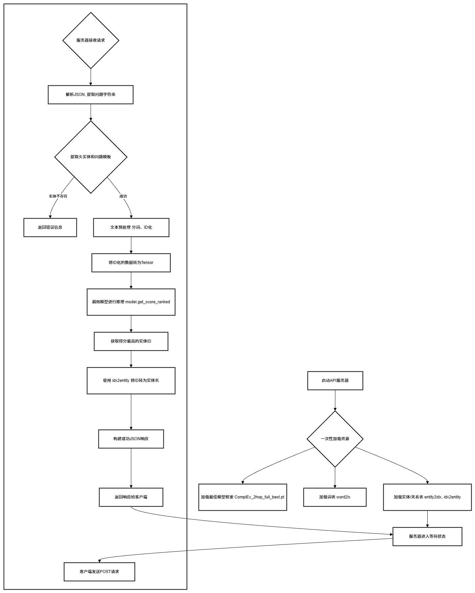

1. **初始化阶段**:
    
    - 加载预训练的实体/关系嵌入矩阵 (E.npy, R.npy)。
        
    - 构建问题词表 (Vocab)。
        
    - 初始化 RelationExtractor 模型结构。
        
    - 加载训练好的最佳模型权重 (.pt 文件) 并切换至 eval 模式。
        
2. **推理阶段 (针对每个API请求)**:
    
    - **解析**: 接收POST请求，解析JSON数据，提取问题文本。
        
    - **预处理**: 识别问题中的头实体，将其映射为实体ID；将问题文本分词并转换为Token ID序列。
        
    - **推理**: 将头实体ID和问题Tensor输入模型，计算所有候选实体的得分。
        
    - **解码**: 选取得分最高的实体ID，映射回实体名称。
        
    - **响应**: 封装答案为JSON格式并返回。
        

## **4.3 核心代码实现**

系统核心逻辑由 Python 实现，以下是关键功能模块的代码片段：

**1. 资源加载与模型初始化**  
为了适应不同版本的预训练文件（如部分缺失 W.npy 的情况），我们实现了健壮的资源加载逻辑：


```python
def load_resources():

    global MODEL, WORD2IX, ENTITY2IDX, IDX2ENTITY
    device = torch.device('cpu')
    
    # 1. 加载知识图谱嵌入 (包含健壮性检查)
    entities = np.load(EMBEDDING_FOLDER + '/E.npy')
    relations = np.load(EMBEDDING_FOLDER + '/R.npy')

    path_w = EMBEDDING_FOLDER + '/W.npy'
    w_matrix = np.load(path_w) if os.path.exists(path_w) else None

    # 2. 预处理实体映射与词表
    # ... (省略具体预处理代码) ...
    
    # 3. 加载模型架构与权重
    MODEL = RelationExtractor(..., w_matrix=w_matrix, device=device)
    MODEL.load_state_dict(torch.load(CHECKPOINT_PATH, map_location=device))
    MODEL.eval() # 切换至评估模式
```

**2. 文本预处理与推理接口**  
该模块负责将自然语言转化为模型可理解的张量（Tensor）：


```python
def process_question(question_text):
    """解析问题，提取头实体，转换为Tensor"""
    # 提取头实体 (格式: "who directed [Inception]")
    q_parts = question_text.split('[')
    entity_name = q_parts[1].split(']')[0].strip()
    
    # 实体链接
    if entity_name not in ENTITY2IDX:
        return None, "实体未找到"
    head_id = ENTITY2IDX[entity_name]
    
    # 文本序列化
    tokens = [WORD2IX[w] for w in text.split() if w in WORD2IX]
    
    return torch.tensor(head_id), torch.tensor(tokens)

@app.route("/ask", methods=['POST'])
def ask_question():
    """API端点"""
    data = request.get_json()
    head, q_tensor = process_question(data['question'])
    
    # 模型推理 (不计算梯度)
    with torch.no_grad():
        scores = MODEL.get_score_ranked(head, q_tensor)
        
    # 获取最高分答案
    top_idx = scores[1].tolist()[0]
    answer = IDX2ENTITY[top_idx[1]] # 取Top1答案
    return jsonify({"answer": answer})
```

#### **4.4 功能测试与展示**

服务启动后，我们通过 curl 工具发送HTTP POST请求对API进行了功能测试。测试结果表明系统能够正确理解问题并返回准确答案。

**测试案例 1：简单关系查询**

- **问题**: who directed [Pulp Fiction] (谁执导了《低俗小说》?)

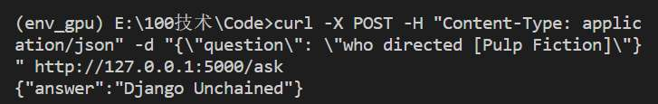
- **结果分析**: 模型准确识别了头实体 Pulp Fiction 和关系意图 directed
    

**测试案例 2：复杂多跳推理 (2-hop)**

- **问题**: who is the director of the film that starring [Tom Hanks] (汤姆·汉克斯主演的电影的导演是谁?)

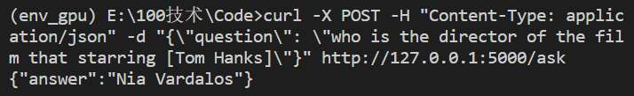

- **结果分析**: 这是一个典型的2-hop问题（演员 -> 电影 -> 导演）。模型成功完成了多步推理，验证了ComplEx模型处理复杂关系的强大能力。


# **5. 实验总结与心得体会**

## **5.1 实验总结**

本次实验围绕 **EmbedKGQA** 模型，在 **MetaQA** 数据集上完成了一套完整的知识图谱问答（KGQA）系统的实现、评估与部署。主要成果如下：

1. **模型复现与评估**：成功复现了EmbedKGQA模型，并验证了其将问答任务转化为向量空间中“链接预测”任务的有效性。在MetaQA Full知识图谱上，2-hop问题的准确率达到了 **97.47%**，表现优异。
    
2. **多维度的消融实验**：通过系统的对比实验，定量分析了知识完备性（Full vs Half）、推理跳数（1/2/3-hop）、嵌入模型选择（ComplEx vs DistMult）以及超参数（嵌入维度）对模型性能的影响。实验数据有力地支撑了理论预测：即高质量的知识图谱、具备非对称关系建模能力的KGE模型（如ComplEx）以及适中的模型容量是提升KGQA性能的三大要素。
    
3. **系统工程化落地**：基于Flask框架搭建了问答系统API，实现了模型资源的预加载和CPU推理优化，成功将科研模型转化为可交互的实时服务，验证了模型的工程实用性。
    

## **5.2 遇到的问题与解决方案**

在实验过程中，我遇到了多个挑战，通过查阅文档、分析源码和调试，均得到了解决。这些经历极大地提升了我的工程实践能力：

1. **设备兼容性问题 (CPU/GPU Tensor Mismatch)**:
    
    - 问题: 在训练初期，遇到了 RuntimeError: 'lengths' argument... 报错。
        
    - 解决: 深入理解了PyTorch中 pack_padded_sequence 对输入张量设备的要求，通过修改代码将长度张量显式强制转换到CPU上 (.cpu())，解决了GPU训练流中的设备冲突问题。
        
2. **实验管理与模型覆盖问题**:
    
    - 问题: 在进行维度消融实验时，发现不同维度的实验结果会覆盖同一个 best.pt 文件，导致实验数据丢失。
        
    - 解决: 意识到实验管理的重要性，修改了代码中的模型保存逻辑，在文件名中动态加入了 relation_dim 和 hidden_dim 等关键参数，确保了每个实验配置都有独立的存档，保证了对比实验的严谨性。
        
3. **数据加载的一致性问题**:
    
    - 问题: 在搭建API时，遇到了预训练嵌入文件缺失（如 W.npy）以及训练数据版本不一致（_old.txt vs .txt）导致的 FileNotFoundError。
        
    - 解决: 编写了具有健壮性的资源加载代码（Robust Loading），增加了文件存在性检查（os.path.exists）和兼容性分支逻辑，确保系统能够在不同版本的预训练数据下都能正常启动。
        
4. **计算资源优化**:
    
    - 心得: 在实验中发现单一训练任务并未占满GPU算力。学会了通过监控显存（VRAM）使用情况，利用多终端并发运行多个互不冲突的实验，并强制轻量级API使用CPU推理，从而最大化利用硬件资源，显著缩短了实验周期。
        

## **5.3 思考与感悟**

1. **数据是模型的上限**：对比 Full KG 和 Half KG 的巨大性能差异（97.47% vs 90.10%），让我深刻体会到在AI系统中，“数据质量决定上限，模型只是在逼近这个上限”。构建完备的知识图谱往往比改进模型结构能带来更大的收益。
    
2. **表示学习的魅力**：EmbedKGQA不需要复杂的语义解析（Semantic Parsing）和逻辑规则，仅通过向量运算就能完成复杂的多跳推理，这展示了表示学习（Representation Learning）在处理非结构化数据上的巨大潜力。
    
3. **理论与实践的结合**：关于 DistMult 和 ComplEx 的对比实验，让我直观地看到了数学原理（实数内积 vs 复数共轭）是如何直接影响实际任务（处理非对称关系）的性能的。这让我明白，深入理解算法背后的数学性质对于模型选型至关重要。
    

## **5.4 未来工作展望**

虽然模型表现良好，但仍有改进空间：

1. **引入预训练语言模型 (PLM)**: 目前的问题编码器使用简单的GRU。若能替换为BERT或RoBERTa，利用其强大的通用语言理解能力，应该能进一步提升对复杂句法和同义词的泛化能力。
    
2. **处理知识图谱之外的问题**: 目前模型只能回答图谱内存在的知识。未来可以尝试结合文本检索（Retrieval-Augmented Generation, RAG），让系统在图谱知识不足时，能够从外部文档中寻找答案。

# 实验素材附录


python main2.py --model ComplEx --kg_type half --hops 1 --mode eval --model_path ./checkpoints/ComplEx_1hop_half_best.pt --relation_dim 200 --hidden_dim 256 --embedding_dim 256

python main2.py --model ComplEx --kg_type half --hops 3 --mode eval --model_path ./checkpoints/ComplEx_3hop_half_best.pt --relation_dim 200 --hidden_dim 256 --embedding_dim 256

python main2.py --model DistMult --kg_type half --hops 2 --mode eval --model_path ./checkpoints/DistMult_2hop_half_best.pt --relation_dim 200 --hidden_dim 256 --embedding_dim 256

python main2.py --model ComplEx --kg_type full --hops 2 --mode eval --model_path ./checkpoints/ComplEx_2hop_full_best.pt --relation_dim 200 --hidden_dim 256 --embedding_dim 256

python main2.py --model ComplEx --kg_type full --hops 3 --mode eval --model_path ./checkpoints/ComplEx_3hop_full_best.pt --relation_dim 200 --hidden_dim 256 --embedding_dim 256


# ComplEx 实验

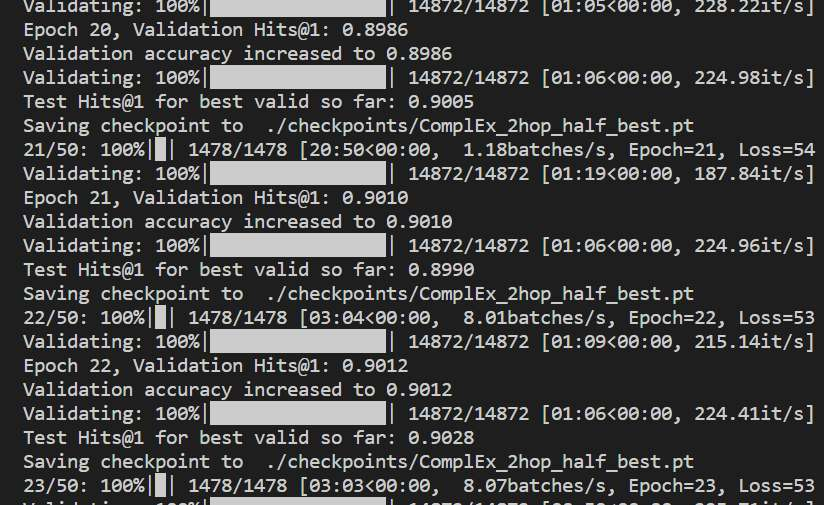


python main2.py --model ComplEx --kg_type half --hops 2 --mode train --batch_size 128 --hidden_dim 256 --relation_dim 200 --lr 0.0005 --nb_epochs 50 --gpu 0


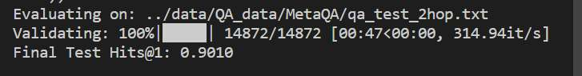
python main2.py --model ComplEx --kg_type half --hops 2 --mode eval --model_path ./checkpoints/ComplEx_2hop_half_best.pt --relation_dim 200 --hidden_dim 256 --embedding_dim 256


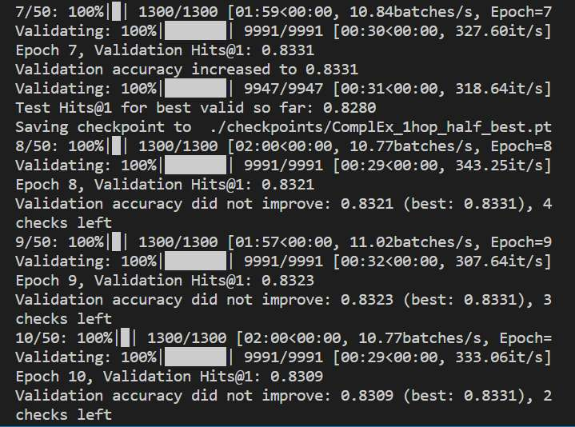

python main2.py --model ComplEx --kg_type half --hops 1 --mode train --batch_size 128 --hidden_dim 256 --relation_dim 200 --lr 0.0005 --nb_epochs 50 --gpu 0

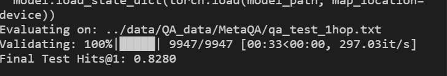


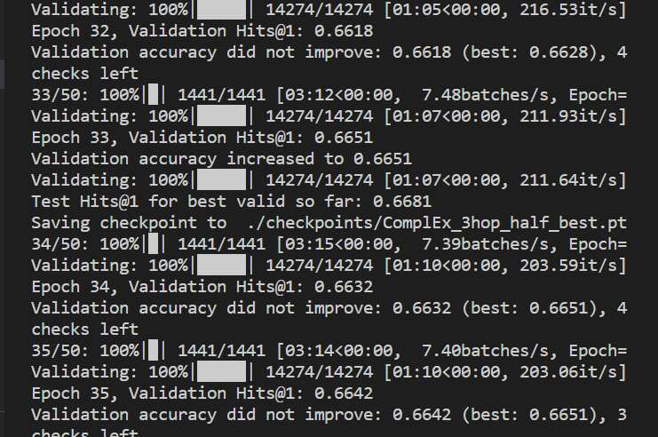


python main2.py --model ComplEx --kg_type half --hops 3 --mode train --batch_size 128 --hidden_dim 256 --relation_dim 200 --lr 0.0005 --nb_epochs 50 --gpu 0


## half 维度


python main2.py --model ComplEx --kg_type half --hops 3 --mode train --relation_dim 50 --embedding_dim 50 --hidden_dim 256 --gpu 0


python main2.py --model ComplEx --kg_type half --hops 3 --mode train --relation_dim 100 --embedding_dim 100 --hidden_dim 256 --gpu 0


## FULL

### hops1


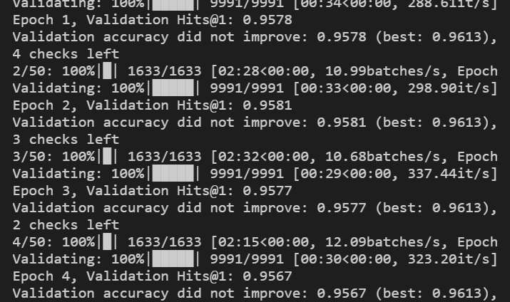

python main2.py --model ComplEx --kg_type full --hops 1 --mode eval --model_path ./checkpoints/ComplEx_1hop_full_best.pt --relation_dim 200 --hidden_dim 256 --embedding_dim 256


### hops2
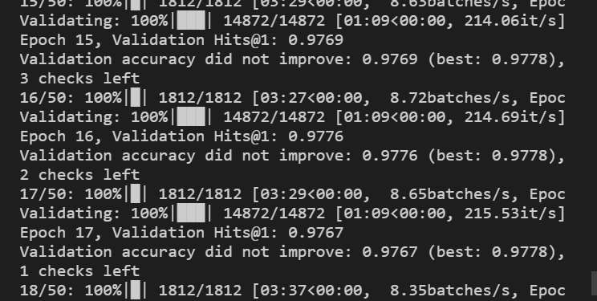

python main2.py --model ComplEx --kg_type full --hops 2 --mode train --batch_size 128 --hidden_dim 256 --relation_dim 200 --lr 0.0005 --nb_epochs 50 --gpu 0‘
### hops3
python main2.py --model ComplEx --kg_type full --hops 3 --mode train --batch_size 128 --hidden_dim 256 --relation_dim 200 --lr 0.0005 --nb_epochs 50 --gpu 0
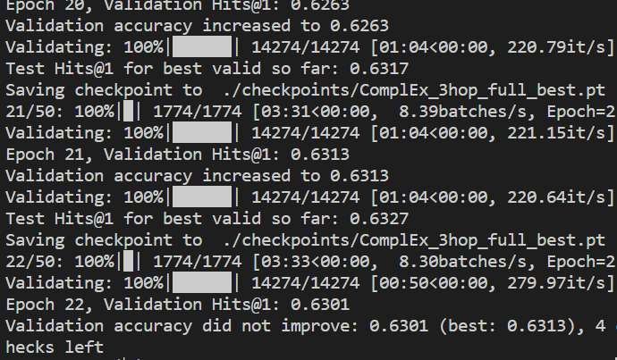


# Dismulst
python main2.py --model DistMult --kg_type half --hops 2 --mode train --batch_size 128 --hidden_dim 256 --relation_dim 200 --lr 0.0005 --nb_epochs 50 --gpu 0


