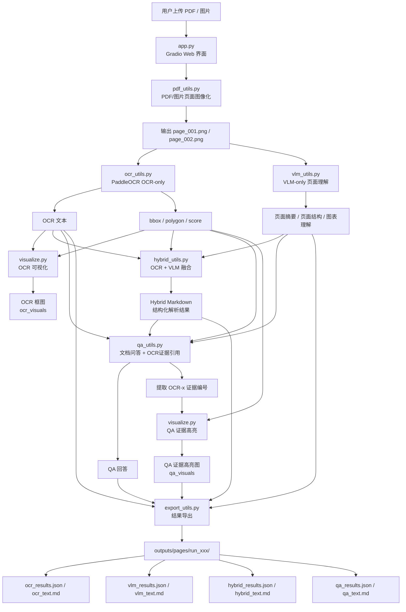
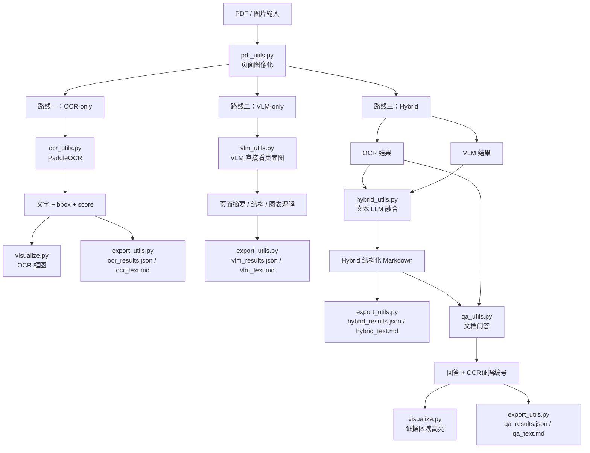

| 文件                    | 主要职责              | 输入                    | 输出                        |
| --------------------- | ----------------- | --------------------- | ------------------------- |
| `app.py`              | Gradio 主界面，调度所有模块 | 上传文件、参数、问题            | 页面展示、状态、下载文件              |
| `src/pdf_utils.py`    | PDF/图片转页面图        | PDF / PNG / JPG       | `page_001.png` 等页面图       |
| `src/ocr_utils.py`    | PaddleOCR 基础文字识别  | 页面图                   | OCR 文本、bbox、polygon、score |
| `src/visualize.py`    | 可视化绘制             | 页面图 + OCR/证据框         | OCR 框图、QA 证据高亮图           |
| `src/vlm_utils.py`    | 调用视觉语言模型          | 页面图                   | VLM 页面理解结果                |
| `src/text_utils.py`   | 调用文本大模型           | prompt                | 文本生成结果                    |
| `src/hybrid_utils.py` | 融合 OCR 与 VLM      | OCR 结果 + VLM 结果       | Hybrid 结构化 Markdown       |
| `src/qa_utils.py`     | 文档问答与证据编号解析       | 用户问题 + OCR/VLM/Hybrid | 回答、`[OCR-x]` 证据编号、证据 item |
| `src/export_utils.py` | 保存结果文件            | 各模块结果                 | JSON / Markdown 文件        |
