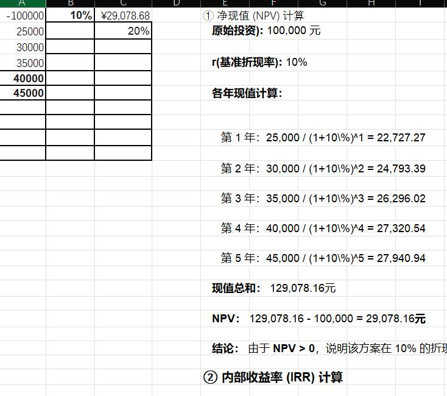

## 题目二：某企业方案 A 的经济可行性分析报告

### 1. 项目基本数据概述

根据题目要求，方案 A 的原始投资及未来 5 年的现金流量情况如下表所示：

|**时间（年度）**|**现金净流量（元）**|**备注**|
|---|---|---|
|第 0 年|-100,000|原始投资额|
|第 1 年|25,000|经营现金净流量|
|第 2 年|30,000|经营现金净流量|
|第 3 年|35,000|经营现金净流量|
|第 4 年|40,000|经营现金净流量|
|第 5 年|45,000|经营现金净流量|

- **基准折现率 ($i_c$)**：10%
    

---

### 2. 净现值（NPV）分析

#### 2.1 计算公式

净现值是指项目寿命期内各年发生的净现金流量，按照一定的折现率折现到期初的现值之和。其计算公式为：

$$NPV = \sum_{t=1}^{n} \frac{CI - CO}{(1 + i)^t} - I_0$$

其中，$CI - CO$ 为各年净现金流量，$i$ 为折现率，$I_0$ 为原始投资额。

#### 2.2 计算过程

将本项目数据代入公式，进行逐年折现计算：

- **第 1 年现值**：$25,000 / (1+10\%)^1 = 22,727.27$ 元
    
- **第 2 年现值**：$30,000 / (1+10\%)^2 = 24,793.39$ 元
    
- **第 3 年现值**：$35,000 / (1+10\%)^3 = 26,296.02$ 元
    
- **第 4 年现值**：$40,000 / (1+10\%)^4 = 27,320.54$ 元
    
- **第 5 年现值**：$45,000 / (1+10\%)^5 = 27,940.94$ 元
    

现值总和 (PV) = $22,727.27 + 24,793.39 + 26,296.02 + 27,320.54 + 27,940.94 = 129,078.16$ 元

净现值 (NPV) = $129,078.16 - 100,000 = \mathbf{29,078.16}$ 元

#### 2.3 评价准则

根据净现值评价准则：

- 若 **NPV ≥ 0**，则方案在经济上可行。
    
- 本方案 **NPV = 29,078.16 元 > 0**，说明该项目不仅能收回初始投资，还能获得高于 10% 折现率的额外收益。
    

---

### 3. 内部收益率（IRR）分析

#### 3.1 定义与计算方法

内部收益率（IRR）是指项目净现值为零时的折现率，代表了项目本身的实际盈利能力。

通过 Excel 函数 =IRR(A1:A6) 计算得出：

IRR ≈ 19.80%

#### 3.2 评价准则

根据内部收益率评价准则：

- 若 **IRR ≥ 基准折现率 ($i_c$)**，则方案在经济上可行。
    
- 本方案 **IRR = 19.80% > 10%**。
    

---

### 4. 综合结论

通过对方案 A 的定量分析：

1. **净现值（NPV）** 为 **29,078.16 元**，大于零；
    
2. **内部收益率（IRR）** 为 **19.80%**，远高于企业要求的 10% 基准收益率。
    

**综上所述，方案 A 在经济上具有显著的可行性，建议采纳该投资方案。**

# EXCEL完成：

其中 **B3 (NPV)**=NPV(B1, A2:A6) + A1

B4 (IRR) =IRR(A1:A6)